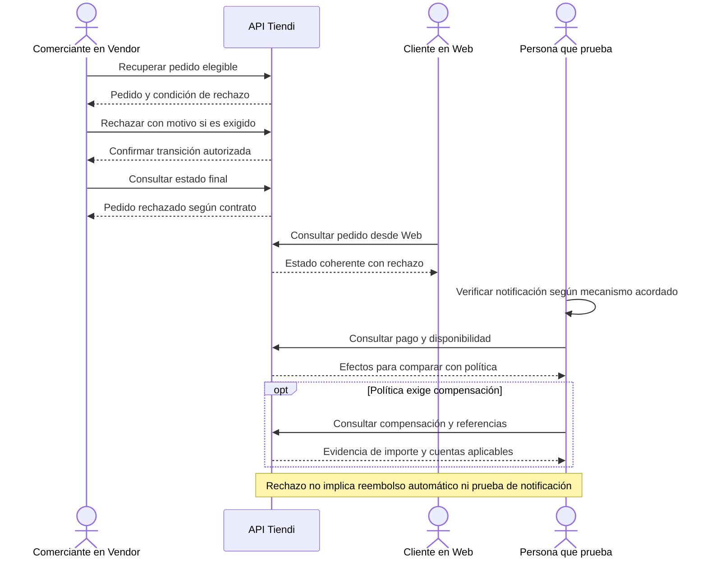

# ORDER-REJECT-001 — Rechazar un pedido

[Volver al plan general](../../PLAN-PRUEBAS-E2E.md)

> Estado: borrador de caso por completar y revalidar. Sin ejecutar. Basado en la revisión del 2026-09-19, organizado el 2026-09-20. Los resultados siguientes son criterios propuestos, no evidencia de implementación ni aprobación.

## Objetivo y alcance

Verificar rechazo autorizado y sus consecuencias para cliente, tienda y pago.

- Actores y superficies: Comerciante Vendor, cliente Web y API.
- Alcance previsto: recorrido integrado de las superficies indicadas. Registrar el alcance real y todos los mocks en la ejecución.
- Prioridad: Media.

## Preparación y datos

Pedido propio en etapa habilitada para rechazo, canal de pago definido y estado de cobro inicial registrado. Documentar política vigente y actor autorizado.

Preparar datos propios de este caso, aunque se reutilice el procedimiento de otro. Registrar entorno, versiones, IDs y valores iniciales. No depender de ejecuciones previas. Definir plazos y condición de espera para procesos asíncronos.

## Pasos y resultados esperados

| Paso | Acción | Resultado esperado |
|---|---|---|
| 1 | Recuperar pedido elegible en Vendor | Se identifica el pedido y condición de rechazo permitida. |
| 2 | Rechazar usando mecanismo disponible | Se registra transición permitida con motivo si el contrato lo exige. |
| 3 | Consultar desde cliente y vendedor | Estado y notificación esperada son coherentes con el rechazo. |
| 4 | Revisar pago y disponibilidad | Solo se aplican efectos definidos por política, con compensación trazable si corresponde. |

## Diagrama de secuencia

Flujo conceptual propuesto a partir de los pasos del caso, pendiente de validar contra la implementación vigente. No representa todas las llamadas internas ni evidencia una ejecución aprobada.

## Verificaciones y evidencias

Guardar estado previo/final, actor, eventos y referencias financieras aplicables. Entrega, cobro y notificación se comprueban independientemente.

Usar [el registro de ejecución](../PLANTILLAS.md#registro-de-ejecución) para separar esperado y obtenido, con evidencias sanitizadas, controles omitidos y resultado por comprobación.

## Limpieza

Restablecer únicamente los datos de prueba mediante el mecanismo autorizado del entorno. Conservar evidencia antes de limpiar. En movimientos financieros, usar el restablecimiento o compensación permitido, nunca borrar asientos para forzar saldos. Registrar los IDs afectados.

## Pendientes y bloqueos

Confirmar etapas, motivos, mecanismo de notificación, stock y compensación por canal. No asumir reembolso automático para todo pedido rechazado.

Si falta una regla o capacidad necesaria, registrar el bloqueo y su motivo. No aprobar el caso por la existencia de tests o por una pantalla exitosa.

## Referencias

- [Operación diaria Vendor](../../../FUENTES/tiendi-vendor/e2e/flujo2-operacion-diaria.spec.ts); [Creación de pedido Web](../../../FUENTES/tiendi-web/src/app/features/cart/components/bag/bag.ts); [Ledger](../../../FUENTES/tiendi-api/src/modules/ledger/ledger.service.ts); [Reglas de negocio](../../FLUJO_DINERO.md).
- [Criterios compartidos y límites de implementación](../REFERENCIAS-Y-CRITERIOS.md).
