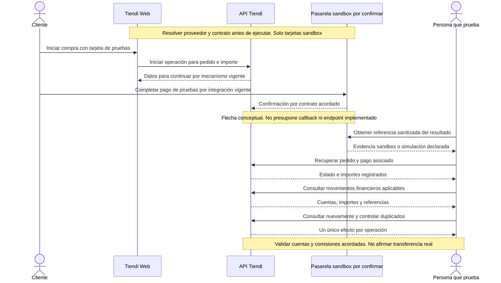

# PAYMENT-CARD-001 — Verificar pago con tarjeta

[Volver al plan general](../../PLAN-PRUEBAS-E2E.md)

> Estado: borrador de caso por completar y revalidar. Sin ejecutar. Basado en la revisión del 2026-09-19, organizado el 2026-09-20. Los resultados siguientes son criterios propuestos, no evidencia de implementación ni aprobación.

## Objetivo y alcance

Acreditar confirmación de pago y movimientos financieros de una compra con tarjeta de pruebas.

- Actores y superficies: Cliente Web, API Tiendi y pasarela de pruebas.
- Alcance previsto: recorrido integrado de las superficies indicadas. Registrar el alcance real y todos los mocks en la ejecución.
- Prioridad: Alta.

## Preparación y datos

Usar exclusivamente credenciales y tarjetas de sandbox. Preparar pedido propio, importes, referencias y saldos iniciales. Confirmar proveedor e integración vigentes.

Preparar datos propios de este caso, aunque se reutilice el procedimiento de otro. Registrar entorno, versiones, IDs y valores iniciales. No depender de ejecuciones previas. Definir plazos y condición de espera para procesos asíncronos.

## Pasos y resultados esperados

| Paso | Acción | Resultado esperado |
|---|---|---|
| 1 | Iniciar compra y pago con tarjeta de pruebas | La solicitud corresponde al pedido y total esperado. |
| 2 | Completar confirmación del proveedor mediante el contrato vigente | La API registra la confirmación vinculada al pago correcto. |
| 3 | Recuperar pedido y movimiento financiero | Estado de pago e importes/cuentas coinciden con la política acordada. |
| 4 | Consultar nuevamente y controlar duplicados | Persiste un único efecto económico por operación. |

## Diagrama de secuencia

Flujo conceptual propuesto a partir de los pasos del caso, pendiente de validar contra la implementación vigente. No representa todas las llamadas internas ni evidencia una ejecución aprobada.

## Verificaciones y evidencias

Conservar referencias de proveedor/pago/pedido y asientos cuando apliquen. Declarar si callbacks/proveedor fueron simulados y no guardar datos completos de tarjeta.

Usar [el registro de ejecución](../PLANTILLAS.md#registro-de-ejecución) para separar esperado y obtenido, con evidencias sanitizadas, controles omitidos y resultado por comprobación.

## Limpieza

Restablecer únicamente los datos de prueba mediante el mecanismo autorizado del entorno. Conservar evidencia antes de limpiar. En movimientos financieros, usar el restablecimiento o compensación permitido, nunca borrar asientos para forzar saldos. Registrar los IDs afectados.

## Pendientes y bloqueos

La estrategia histórica menciona Niubiz y el flujo financiero Culqi: revalidar antes de ejecutar. Faltan contrato exacto, comisiones, plazos y cuentas esperadas.

Si falta una regla o capacidad necesaria, registrar el bloqueo y su motivo. No aprobar el caso por la existencia de tests o por una pantalla exitosa.

## Referencias

- [Creación de pedido Web](../../../FUENTES/tiendi-web/src/app/features/cart/components/bag/bag.ts); [Ledger](../../../FUENTES/tiendi-api/src/modules/ledger/ledger.service.ts); [Reglas de negocio](../../FLUJO_DINERO.md).
- [Criterios compartidos y límites de implementación](../REFERENCIAS-Y-CRITERIOS.md).
