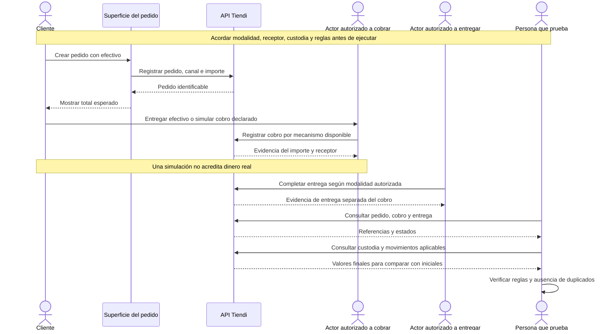

# PAYMENT-CASH-001 — Verificar pago en efectivo

[Volver al plan general](../../PLAN-PRUEBAS-E2E.md)

> Estado: borrador de caso por completar y revalidar. Sin ejecutar. Basado en la revisión del 2026-09-19, organizado el 2026-09-20. Los resultados siguientes son criterios propuestos, no evidencia de implementación ni aprobación.

## Objetivo y alcance

Comprobar el cobro y la custodia de efectivo para una modalidad de pedido definida.

- Actores y superficies: Cliente, actor que cobra según modalidad y APIs participantes.
- Alcance previsto: recorrido integrado de las superficies indicadas. Registrar el alcance real y todos los mocks en la ejecución.
- Prioridad: Alta.

## Preparación y datos

Preparar pedido propio de recojo o delivery. Fijar total, actor autorizado a cobrar y saldos iniciales. Documentar antes de ejecutar reglas de custodia, comisión y liquidación aplicables.

Preparar datos propios de este caso, aunque se reutilice el procedimiento de otro. Registrar entorno, versiones, IDs y valores iniciales. No depender de ejecuciones previas. Definir plazos y condición de espera para procesos asíncronos.

## Pasos y resultados esperados

| Paso | Acción | Resultado esperado |
|---|---|---|
| 1 | Crear pedido con efectivo | Canal e importe coinciden con los datos preparados. |
| 2 | Registrar el cobro mediante el mecanismo disponible | Queda evidencia del importe y del actor receptor, separada de la entrega. |
| 3 | Completar entrega y consultar efectos | Estados, custodia y movimientos corresponden a la regla del canal acordada. |
| 4 | Contrastar valores iniciales y finales | No hay cargos o ingresos duplicados y las diferencias tienen referencias trazables. |

## Diagrama de secuencia

Flujo conceptual propuesto a partir de los pasos del caso, pendiente de validar contra la implementación vigente. No representa todas las llamadas internas ni evidencia una ejecución aprobada.

## Verificaciones y evidencias

Correlacionar cobro/pedido/entrega y asientos solo cuando apliquen. Una simulación de cobro físico no acredita recepción de dinero real.

Usar [el registro de ejecución](../PLANTILLAS.md#registro-de-ejecución) para separar esperado y obtenido, con evidencias sanitizadas, controles omitidos y resultado por comprobación.

## Limpieza

Restablecer únicamente los datos de prueba mediante el mecanismo autorizado del entorno. Conservar evidencia antes de limpiar. En movimientos financieros, usar el restablecimiento o compensación permitido, nunca borrar asientos para forzar saldos. Registrar los IDs afectados.

## Pendientes y bloqueos

Pendiente fijar quién cobra y conserva el efectivo por modalidad, cuentas/importes esperados y superficies disponibles. No extrapolar tarjeta o Yape/Plin.

Si falta una regla o capacidad necesaria, registrar el bloqueo y su motivo. No aprobar el caso por la existencia de tests o por una pantalla exitosa.

## Referencias

- [Controlador Admin](../../../FUENTES/tiendi-api/src/modules/admin/admin.controller.ts); [Ledger](../../../FUENTES/tiendi-api/src/modules/ledger/ledger.service.ts); [Reglas de negocio](../../FLUJO_DINERO.md).
- [Criterios compartidos y límites de implementación](../REFERENCIAS-Y-CRITERIOS.md).
