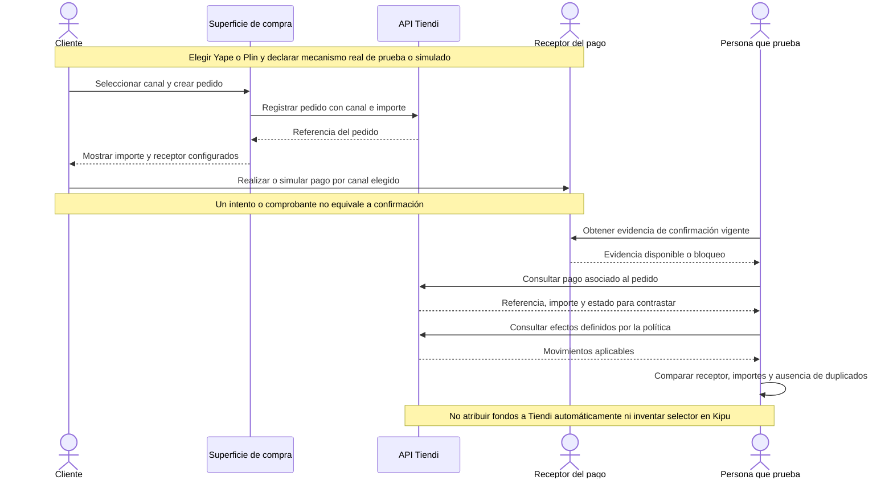

# PAYMENT-WALLET-001 — Verificar variante Yape/Plin

[Volver al plan general](../../PLAN-PRUEBAS-E2E.md)

> Estado: borrador de caso por completar y revalidar. Sin ejecutar. Basado en la revisión del 2026-09-19, organizado el 2026-09-20. Los resultados siguientes son criterios propuestos, no evidencia de implementación ni aprobación.

## Objetivo y alcance

Confirmar el pago de billetera y sus efectos propios sin atribuir automáticamente fondos a la plataforma.

- Actores y superficies: Cliente, receptor del pago y APIs/superficies vigentes.
- Alcance previsto: recorrido integrado de las superficies indicadas. Registrar el alcance real y todos los mocks en la ejecución.
- Prioridad: Alta.

## Preparación y datos

Pedido propio, modalidad, canal específico Yape o Plin y entorno seguro. Identificar receptor, mecanismo de confirmación y saldos iniciales. Declarar componentes simulados.

Preparar datos propios de este caso, aunque se reutilice el procedimiento de otro. Registrar entorno, versiones, IDs y valores iniciales. No depender de ejecuciones previas. Definir plazos y condición de espera para procesos asíncronos.

## Pasos y resultados esperados

| Paso | Acción | Resultado esperado |
|---|---|---|
| 1 | Seleccionar canal y crear pedido | Canal, receptor e importe corresponden a la configuración acordada. |
| 2 | Realizar/simular pago y obtener confirmación por el mecanismo vigente | La evidencia distingue intento, comprobante y confirmación efectiva. |
| 3 | Contrastar pago con pedido | Referencia e importe coinciden y no se contabiliza dos veces. |
| 4 | Revisar efectos esperados del canal | Solo aparecen movimientos definidos por la regla aprobada. |

## Diagrama de secuencia

Flujo conceptual propuesto a partir de los pasos del caso, pendiente de validar contra la implementación vigente. No representa todas las llamadas internas ni evidencia una ejecución aprobada.

## Verificaciones y evidencias

Guardar referencias sanitizadas y explicar fuente de confirmación. Un comprobante o estado de pedido aislado no demuestra cobro ni asiento.

Usar [el registro de ejecución](../PLANTILLAS.md#registro-de-ejecución) para separar esperado y obtenido, con evidencias sanitizadas, controles omitidos y resultado por comprobación.

## Limpieza

Restablecer únicamente los datos de prueba mediante el mecanismo autorizado del entorno. Conservar evidencia antes de limpiar. En movimientos financieros, usar el restablecimiento o compensación permitido, nunca borrar asientos para forzar saldos. Registrar los IDs afectados.

## Pendientes y bloqueos

Definir contrato vigente de confirmación y efectos por receptor. El formulario de ingreso Kipu revisado fija efectivo y otros: no inventar selector Yape/Plin en ese formulario.

Si falta una regla o capacidad necesaria, registrar el bloqueo y su motivo. No aprobar el caso por la existencia de tests o por una pantalla exitosa.

## Referencias

- [Creación de pedido Web](../../../FUENTES/tiendi-web/src/app/features/cart/components/bag/bag.ts); [Registro Kipu](../../../FUENTES/tiendi-kipu/web/src/app/features/expenses/register.page.ts); [Ledger](../../../FUENTES/tiendi-api/src/modules/ledger/ledger.service.ts); [Reglas de negocio](../../FLUJO_DINERO.md).
- [Criterios compartidos y límites de implementación](../REFERENCIAS-Y-CRITERIOS.md).
