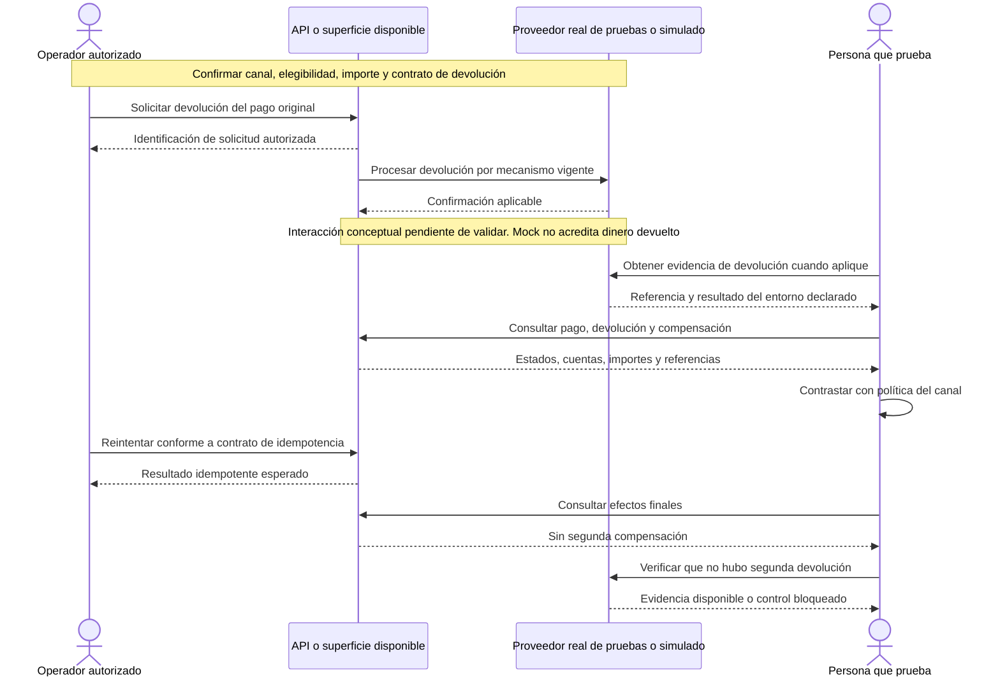

# REFUND-001 — Reembolsar una operación elegible

[Volver al plan general](../../PLAN-PRUEBAS-E2E.md)

> Estado: borrador de caso por completar y revalidar. Sin ejecutar. Basado en la revisión del 2026-09-19, organizado el 2026-09-20. Los resultados siguientes son criterios propuestos, no evidencia de implementación ni aprobación.

## Objetivo y alcance

Verificar una devolución elegible, trazable y sin duplicación.

- Actores y superficies: Operador autorizado, API, proveedor y superficies realmente disponibles.
- Alcance previsto: recorrido integrado de las superficies indicadas. Registrar el alcance real y todos los mocks en la ejecución.
- Prioridad: Alta.

## Preparación y datos

Preparar pago propio confirmado y elegible, canal definido, importe reembolsable y saldos conocidos. Declarar proveedor real de pruebas o simulación y regla de devolución.

Preparar datos propios de este caso, aunque se reutilice el procedimiento de otro. Registrar entorno, versiones, IDs y valores iniciales. No depender de ejecuciones previas. Definir plazos y condición de espera para procesos asíncronos.

## Pasos y resultados esperados

| Paso | Acción | Resultado esperado |
|---|---|---|
| 1 | Solicitar devolución por el mecanismo vigente | Se identifica pago original, importe y autorización. |
| 2 | Procesar y obtener confirmación aplicable | La evidencia distingue solicitud interna y confirmación del proveedor. |
| 3 | Contrastar ledger y estado del pago | Compensación y cuentas/importes corresponden a la política del canal. |
| 4 | Reintentar según contrato de idempotencia | No se produce una segunda devolución económica. |

## Diagrama de secuencia

Flujo conceptual propuesto a partir de los pasos del caso, pendiente de validar contra la implementación vigente. No representa todas las llamadas internas ni evidencia una ejecución aprobada.

## Verificaciones y evidencias

Guardar referencias de operación original y devolución, grupo de asientos y evidencia del proveedor cuando aplique. Balance cero solo no demuestra cuentas correctas.

Usar [el registro de ejecución](../PLANTILLAS.md#registro-de-ejecución) para separar esperado y obtenido, con evidencias sanitizadas, controles omitidos y resultado por comprobación.

## Limpieza

Restablecer únicamente los datos de prueba mediante el mecanismo autorizado del entorno. Conservar evidencia antes de limpiar. En movimientos financieros, usar el restablecimiento o compensación permitido, nunca borrar asientos para forzar saldos. Registrar los IDs afectados.

## Pendientes y bloqueos

Confirmar endpoint/superficie, devolución total/parcial, límites, plazos e idempotencia. No asumir refund implementado para todos los canales ni devolución bancaria real desde mocks.

Si falta una regla o capacidad necesaria, registrar el bloqueo y su motivo. No aprobar el caso por la existencia de tests o por una pantalla exitosa.

## Referencias

- [Controlador Admin](../../../FUENTES/tiendi-api/src/modules/admin/admin.controller.ts); [Ledger](../../../FUENTES/tiendi-api/src/modules/ledger/ledger.service.ts); [Conciliación](../../../FUENTES/tiendi-api/src/modules/ledger/reconciliation.service.ts); [Reglas de negocio](../../FLUJO_DINERO.md).
- [Criterios compartidos y límites de implementación](../REFERENCIAS-Y-CRITERIOS.md).
