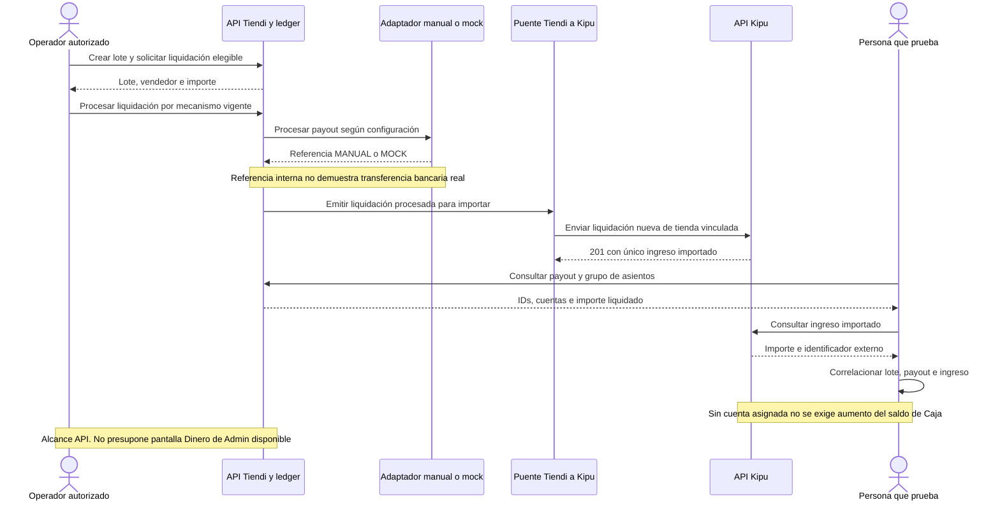

# SETTLEMENT-KIPU-001 — Liquidar al vendedor e importar en Kipu

[Volver al plan general](../../PLAN-PRUEBAS-E2E.md)

> Estado: borrador de caso por completar y revalidar. Sin ejecutar. Basado en la revisión del 2026-09-19, organizado el 2026-09-20. Los resultados siguientes son criterios propuestos, no evidencia de implementación ni aprobación.

## Objetivo y alcance

Seguir una liquidación positiva elegible hasta un único ingreso importado en Kipu, no importar cada pedido.

- Actores y superficies: Operador autorizado, API Tiendi, puente de integración y API/interfaz Kipu.
- Alcance previsto: integración API, con consulta Kipu cuando corresponda. Registrar el alcance real y todos los mocks en la ejecución.
- Prioridad: Alta.

## Preparación y datos

Vendedor elegible con saldo positivo conocido y tienda vinculada a negocio Kipu. Revisar mínimo de payout S/50 observado en la revisión y configuración vigente. Preparar credenciales de servicio y plazos de colas sin exponer secretos.

Preparar datos propios de este caso, aunque se reutilice el procedimiento de otro. Registrar entorno, versiones, IDs y valores iniciales. No depender de ejecuciones previas. Definir plazos y condición de espera para procesos asíncronos.

## Pasos y resultados esperados

| Paso | Acción | Resultado esperado |
|---|---|---|
| 1 | Crear lote y solicitar liquidación elegible | Lote, vendedor e importe corresponden al saldo y reglas preparados. |
| 2 | Procesar liquidación | Payout y grupo de asientos tienen importes/cuentas correctos, según reglas documentadas. |
| 3 | Emitir puente y recibir en Kipu | Una liquidación nueva válida recibe 201 y genera un único ingreso. |
| 4 | Consultar ingreso y comparar | Importe liquidado e importado coinciden y conservan identificador externo. |

## Diagrama de secuencia

Flujo conceptual propuesto a partir de los pasos del caso, pendiente de validar contra la implementación vigente. No representa todas las llamadas internas ni evidencia una ejecución aprobada.

## Verificaciones y evidencias

Conservar storeId, batchId, payoutId, EntryGroup, origenExternoId e ID Kipu disponibles. No esperar aumento de saldo de cuenta Kipu si el ingreso importado no tiene cuenta asignada.

Usar [el registro de ejecución](../PLANTILLAS.md#registro-de-ejecución) para separar esperado y obtenido, con evidencias sanitizadas, controles omitidos y resultado por comprobación.

## Limpieza

Restablecer únicamente los datos de prueba mediante el mecanismo autorizado del entorno. Conservar evidencia antes de limpiar. En movimientos financieros, usar el restablecimiento o compensación permitido, nunca borrar asientos para forzar saldos. Registrar los IDs afectados.

## Pendientes y bloqueos

Banco revisado devuelve MANUAL-* o MOCK-*, no transferencia bancaria real. UI Dinero de Admin pendiente: declarar alcance API. Confirmar elegibilidad, mínimo, reglas de redondeo y espera.

Si falta una regla o capacidad necesaria, registrar el bloqueo y su motivo. No aprobar el caso por la existencia de tests o por una pantalla exitosa.

## Referencias

- [Liquidaciones](../../../FUENTES/tiendi-api/src/modules/settlement/settlement.service.ts); [Puente emisor Kipu](../../../FUENTES/tiendi-api/src/modules/integraciones/kipu-bridge.service.ts); [Receptor de liquidaciones](../../../FUENTES/tiendi-kipu/api/src/modules/integraciones/integraciones.controller.ts); [Modelo Kipu](../../../FUENTES/tiendi-kipu/api/prisma/schema.prisma); [Dashboard Admin](../../../FUENTES/tiendi-admin/src/app/admin/pages/dashboard/dashboard.page.ts); [Reglas de negocio](../../INTEGRACION-TIENDI.md).
- [Criterios compartidos y límites de implementación](../REFERENCIAS-Y-CRITERIOS.md).
