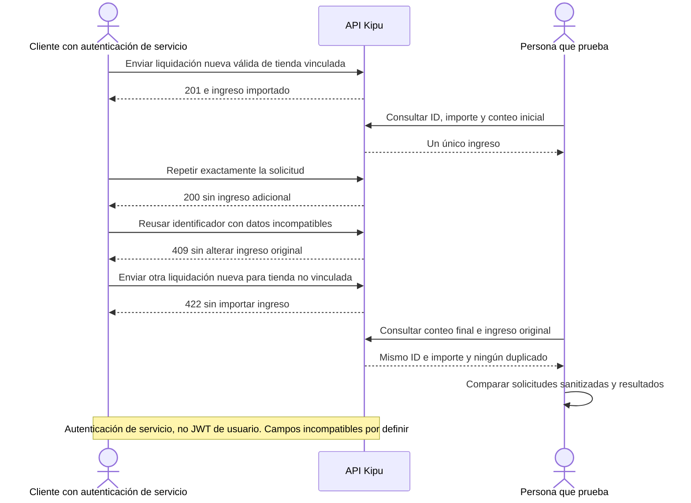

# SETTLEMENT-RETRY-001 — Reintentar una liquidación importada

[Volver al plan general](../../PLAN-PRUEBAS-E2E.md)

> Estado: borrador de caso por completar y revalidar. Sin ejecutar. Basado en la revisión del 2026-09-19, organizado el 2026-09-20. Los resultados siguientes son criterios propuestos, no evidencia de implementación ni aprobación.

## Objetivo y alcance

Comprobar idempotencia y rechazo de datos incompatibles en el receptor Tiendi–Kipu.

- Actores y superficies: Cliente de servicio autorizado y APIs Tiendi/Kipu.
- Alcance previsto: integración API, con consulta Kipu cuando corresponda. Registrar el alcance real y todos los mocks en la ejecución.
- Prioridad: Alta.

## Preparación y datos

Preparar liquidación válida propia con importe positivo, origenExternoId único y tienda vinculada. Preparar otra tienda no vinculada. Mantener evidencia del payload sanitizado y conteos iniciales.

Preparar datos propios de este caso, aunque se reutilice el procedimiento de otro. Registrar entorno, versiones, IDs y valores iniciales. No depender de ejecuciones previas. Definir plazos y condición de espera para procesos asíncronos.

## Pasos y resultados esperados

| Paso | Acción | Resultado esperado |
|---|---|---|
| 1 | Enviar liquidación nueva válida | 201 y un único ingreso importado. |
| 2 | Repetir exactamente la solicitud | 200 y ningún ingreso adicional. |
| 3 | Reusar identificador con datos incompatibles | 409 y sin modificación ni duplicación indebida del ingreso original. |
| 4 | Enviar liquidación nueva para tienda no vinculada | 422 y sin ingreso importado. |

## Diagrama de secuencia

Flujo conceptual propuesto a partir de los pasos del caso, pendiente de validar contra la implementación vigente. No representa todas las llamadas internas ni evidencia una ejecución aprobada.

## Verificaciones y evidencias

Comparar payloads, códigos HTTP, IDs y conteo final. Verificar también invariantes de importe del ingreso original. El endpoint usa autenticación de servicio, no JWT de usuario.

Usar [el registro de ejecución](../PLANTILLAS.md#registro-de-ejecución) para separar esperado y obtenido, con evidencias sanitizadas, controles omitidos y resultado por comprobación.

## Limpieza

Restablecer únicamente los datos de prueba mediante el mecanismo autorizado del entorno. Conservar evidencia antes de limpiar. En movimientos financieros, usar el restablecimiento o compensación permitido, nunca borrar asientos para forzar saldos. Registrar los IDs afectados.

## Pendientes y bloqueos

Definir campos incompatibles y requests exactos a partir del contrato vigente. Credenciales inválidas y respuesta perdida necesitan variantes separadas. Tests Prisma simulado no certifican E2E desplegado.

Si falta una regla o capacidad necesaria, registrar el bloqueo y su motivo. No aprobar el caso por la existencia de tests o por una pantalla exitosa.

## Referencias

- [Receptor de liquidaciones](../../../FUENTES/tiendi-kipu/api/src/modules/integraciones/integraciones.controller.ts); [Pruebas del servicio de integración Kipu](../../../FUENTES/tiendi-kipu/api/src/modules/integraciones/integraciones.service.spec.ts); [Puente emisor Kipu](../../../FUENTES/tiendi-api/src/modules/integraciones/kipu-bridge.service.ts); [Reglas de negocio](../../INTEGRACION-TIENDI.md).
- [Criterios compartidos y límites de implementación](../REFERENCIAS-Y-CRITERIOS.md).
