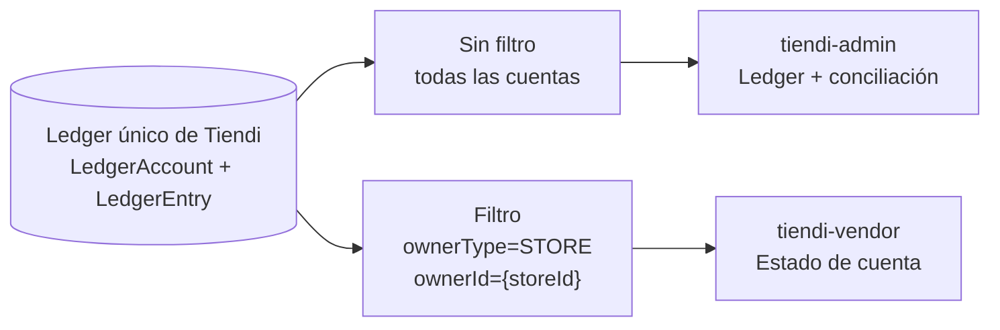
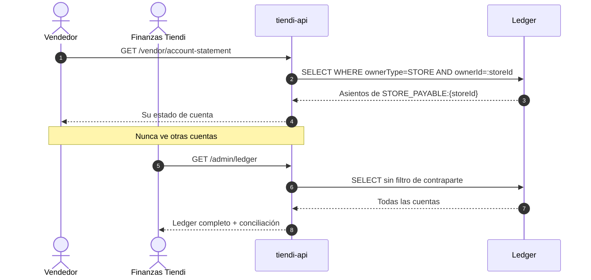
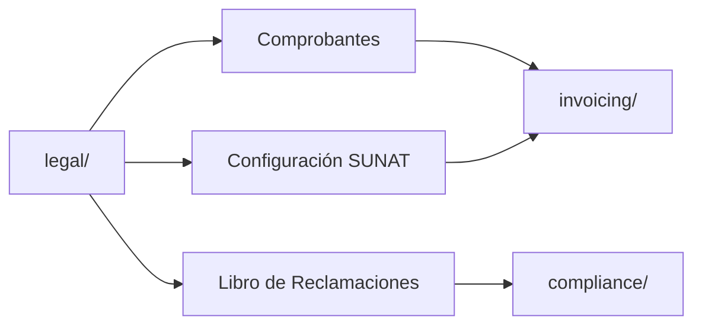
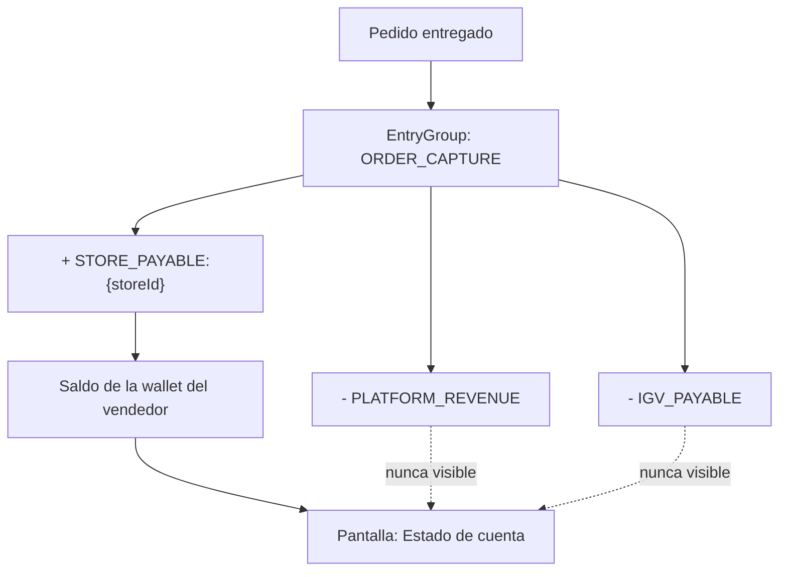

---
tags:
  - tiendi
  - arquitectura
  - facturacion
  - contabilidad
  - aplicaciones
aliases:
  - Facturación y Contabilidad Tiendi
  - Ubicación de Facturación y Contabilidad
  - Reparto por Aplicación
---

# Facturación y Contabilidad — Reparto por Aplicación

Este documento define **dónde vive cada cosa**: qué pantallas de dinero pertenecen al panel del vendedor, cuáles al back-office de la plataforma, y por qué la frontera está donde está.

> [!IMPORTANT]
> Este documento complementa a [[FLUJO_DINERO]], que define **cómo se mueve** el dinero (ledger, asientos, liquidaciones), y a [[MODELO_NEGOCIO]], que define **de dónde sale**.
> Acá se define **quién lo ve**.

> [!NOTE]
> Parte de lo descrito es **estado objetivo**. Lo ya implementado está marcado con ✅ y lo pendiente con 🔲 en [§8 Estado actual vs objetivo](#8-estado-actual-vs-objetivo).

---

## Índice

1. [Principio rector](#1-principio-rector)
2. [La distinción fundamental](#2-la-distinción-fundamental)
3. [Reparto por aplicación](#3-reparto-por-aplicación)
4. [Un solo ledger, muchas dimensiones](#4-un-solo-ledger-muchas-dimensiones)
5. [Facturación electrónica](#5-facturación-electrónica)
6. [Renombrado de módulos](#6-renombrado-de-módulos)
7. [Estado de cuenta del vendedor](#7-estado-de-cuenta-del-vendedor)
8. [Estado actual vs objetivo](#8-estado-actual-vs-objetivo)
9. [Orden de implementación recomendado](#9-orden-de-implementación-recomendado)
10. [Deuda técnica detectada — roles desalineados](#10-deuda-técnica-detectada--roles-desalineados)

---

## 1. Principio rector

> [!IMPORTANT]
> **El vendedor ve su propio dinero, nunca el de la plataforma.**

Toda duda futura sobre dónde va una pantalla se resuelve con esa frase. Si el dato responde *"¿cuánto tengo yo?"* va en el panel del vendedor. Si responde *"¿cuánto tiene Tiendi?"* va en el back-office.

---

## 2. La distinción fundamental

Facturación y contabilidad suenan parecido y son cosas **con dueños distintos**.

| | Facturación electrónica | Contabilidad (ledger) |
|---|---|---|
| **Qué es** | Comprobantes que el vendedor emite a su cliente final | Registro de partida doble de todo el dinero que mueve la plataforma |
| **Dueño del dato** | El vendedor | Tiendi |
| **Obligación ante** | SUNAT, por cuenta del vendedor | SUNAT y accionistas, por cuenta de Tiendi |
| **Frecuencia de uso** | Diaria | Cierre diario / mensual |
| **Quién la opera** | `STORE_OWNER`, `MANAGER` | Finanzas de Tiendi |
| **Aplicación** | `tiendi-vendor` | Back-office (propuesto: `tiendi-admin`) |

> [!CAUTION]
> **El ledger no puede vivir en `tiendi-vendor`.**
> Las cuentas de [[FLUJO_DINERO]] son `PLATFORM_CASH`, `PLATFORM_REVENUE`, `GATEWAY_RECEIVABLE`, `IGV_PAYABLE`, `RIDER_PAYABLE`. Un vendedor con acceso a eso ve el margen real de Tiendi, la caja completa y lo que se le debe a terceros. No es una feature mal ubicada: es una **fuga de datos**.
>
> Y un guard de ruta no alcanza. El guard controla el *routing*, no la *distribución del bundle*: el código igual se descarga al navegador del vendedor.

---

## 3. Reparto por aplicación

```mermaid
graph TB
    FIN["Finanzas de Tiendi"] --> BO
    VEN["Vendedor"] --> VD
    CLI["Cliente / Repartidor"] --> WB

    subgraph BO["tiendi-admin — back-office (propuesto)"]
        direction TB
        BO1["Ledger completo"]
        BO2["Conciliación bancaria y Culqi"]
        BO3["Payouts y batches"]
        BO4["Gestión global de repartidores"]
        BO5["Curación del catálogo maestro"]
        BO6["Ranking de demanda de plataforma"]
    end

    subgraph VD["tiendi-vendor — panel del vendedor"]
        direction TB
        VD1["Facturación electrónica SUNAT"]
        VD2["Libro de reclamaciones"]
        VD3["Estado de cuenta propio"]
        VD4["Captura de GTIN en el alta"]
    end

    subgraph WB["tiendi-web / tiendi-go"]
        direction TB
        WB1["Comprobante del pedido"]
        WB2["Wallet del repartidor"]
    end
```



| Superficie | Alcance del dato | Aplicación |
|---|---|---|
| Ledger completo, conciliación, payouts | Todas las cuentas | `tiendi-admin` 🔲 |
| Comprobantes + configuración SUNAT | Solo la tienda logueada | `tiendi-vendor` ✅ |
| Libro de reclamaciones | Solo la tienda logueada | `tiendi-vendor` ✅ |
| Estado de cuenta / liquidaciones | Solo `STORE_PAYABLE:{storeId}` | `tiendi-vendor` 🔲 |
| Captura de GTIN en el alta de producto | Solo la tienda logueada | `tiendi-vendor` ✅ |
| Curación del catálogo: `merge`, `verify`, `duplicates` | Todas las tiendas | `tiendi-admin` 🔲 |
| Ranking de demanda de plataforma | Agregado entre tiendas | `tiendi-admin` 🔲 |

> [!WARNING]
> **Anti-patrón ya presente en el repositorio.**
> `tiendi-vendor/src/app/vendor/shared/layout/sidebar.component.ts:32` expone:
>
> ```ts
> { label: 'Repartidores', route: '/vendor/riders', roles: ['SUPER_ADMIN'] }
> ```
>
> Funcionalidad de plataforma dentro de la app del inquilino, protegida únicamente por un flag de rol en un array. Debe migrar al back-office junto con el ledger. Hoy es una pantalla de repartidores; el riesgo es que mañana sea la tesorería.


### 3.1 Catálogo maestro — tres superficies, no una

El catálogo maestro descrito en [[CATALOGO_MAESTRO]] **no es una sola pantalla**. Se reparte con la
misma regla que el ledger: el vendedor toca su propio producto, la plataforma toca el registro compartido.

| Superficie | Qué hace | Aplicación |
|---|---|---|
| Captura | Escaneo y validación de GTIN en el alta de producto (`GET /master-products/lookup?gtin=`) | `tiendi-vendor` |
| Resolución | Normalización, `matchKey`, deduplicación automática | `tiendi-api`, sin interfaz |
| Curación | `PATCH /master-products/:id`, `POST /:id/verify`, `POST /merge`, `GET /duplicates` | `tiendi-admin` |
| Analítica | Ranking de demanda agregado entre tiendas | `tiendi-admin` |

> [!CAUTION]
> **`POST /master-products/merge` modifica un registro compartido por varias tiendas.**
> Un vendedor que opere esa acción altera el catálogo de sus competidores. No es una pantalla
> de tenant bajo ninguna interpretación.
>
> El ranking de [[CATALOGO_MAESTRO#8.3 Ranking de plataforma con k-anonimato|§8.3]] es aún más
> sensible: devuelve `COUNT(DISTINCT storeId)`, `SUM(quantity)` y `AVG(unitPrice)` **cruzados entre
> tiendas**. El umbral de k-anonimato evita inferir la venta de una tienda puntual, pero no cambia
> la naturaleza del dato: es inteligencia competitiva agregada.

> [!NOTE]
> **La Fase 6 de [[CATALOGO_MAESTRO]] declara el guard, no la aplicación.**
> Pedir *«guard de rol admin en todos los endpoints de escritura»* protege el **backend** y está bien.
> Lo que no especifica es dónde vive el panel que consume esos endpoints — y ese silencio es
> exactamente por donde se coló `/vendor/riders`. Un guard en el controlador no impide que la
> pantalla se compile dentro del bundle del inquilino.

> [!IMPORTANT]
> **Dependencia cruzada entre documentos.**
> La Fase 6 de [[CATALOGO_MAESTRO]] («Panel de administración») depende de que exista `tiendi-admin`,
> que en este documento es la [Fase 4](#9-orden-de-implementación-recomendado). Ninguno de los dos
> documentos declaraba esa dependencia. Mientras `tiendi-admin` no exista, los endpoints de curación
> pueden construirse y testearse, pero **no deben recibir interfaz** en `tiendi-vendor`.

---

## 4. Un solo ledger, muchas dimensiones

No existe "la contabilidad de cada tienda". Existe **un único ledger, el de Tiendi**, con subcuentas por contraparte.

```prisma
model LedgerAccount {
  code      String  @unique   // "STORE_PAYABLE:abc-123"
  ownerType String?           // STORE | RIDER | PLATFORM
  ownerId   String?
  @@index([ownerType, ownerId])
}
```

La tienda **no es dueña de un libro**: es una **dimensión** dentro del libro de Tiendi.



### 4.1 El mismo número, signo opuesto

`STORE_PAYABLE:{storeId}` significa cosas distintas según quién lo mire:

| Libro | Naturaleza | Lectura |
|---|---|---|
| Contabilidad de **Tiendi** | **Pasivo** (acreedora) | "Le debo S/ 3.000 a la tienda 42" |
| Contabilidad de **la tienda 42** | **Activo** (deudora) | "Tiendi me debe S/ 3.000" |

Mismo hecho económico, libros distintos, signos opuestos. Por eso el ledger de Tiendi no puede "reutilizarse" como contabilidad del vendedor.

> [!NOTE]
> **La contabilidad real del vendedor vive fuera de Tiendi, y está bien que así sea.**
> Tiendi solo observa la porción del negocio que pasa por Tiendi. No ve las ventas en mostrador, ni la compra de inventario, ni el alquiler, ni los sueldos. Construir "la contabilidad de la tienda" con esos datos produciría un balance incompleto y, por lo tanto, falso. Eso es trabajo del contador del vendedor, en su propio software.

### 4.2 Qué habilita esto

[[FLUJO_DINERO]] lo resuelve de raíz:

> El saldo de la wallet de un vendedor es literalmente el saldo de su `STORE_PAYABLE:{storeId}`. Eso hace que la wallet sea auditable línea por línea sin ninguna lógica adicional.

Una sola fuente de verdad, dos superficies. El índice `@@index([ownerType, ownerId])` es lo que hace barato el endpoint del vendedor: se filtra por su `storeId` y se devuelve su estado de cuenta. **Sin ledger paralelo, sin datos duplicados, sin proceso de sincronización.**



---

## 5. Facturación electrónica

Implementada y correctamente ubicada en `tiendi-vendor`. **No debe moverse.**

### 5.1 Superficies actuales

| Ubicación | Contenido |
|---|---|
| `/vendor/legal` → tab **Comprobantes** | Listado de boletas y facturas emitidas |
| `/vendor/legal` → tab **Configuración SUNAT** | RUC, razón social, dirección fiscal, régimen tributario, proveedor OSE (Nubefact / Efact), token API, series de boletas y facturas, IGV 18%, emisión automática al marcar "Entregado" |
| `/vendor/legal` → tab **Libro de Reclamaciones** | Reclamos y respuestas |
| Configuración de tienda → tab **Facturación Electrónica (SUNAT)** | Mismos campos fiscales (`store-invoicing-tab.component`) |

La página muestra un banner de advertencia mientras `store.sunatConfigured()` sea falso: *"No podés emitir comprobantes electrónicos hasta completar la configuración."*

### 5.2 Backend

`tiendi-api/src/modules/legal/legal.controller.ts`

| Método | Ruta |
|---|---|
| `GET` | `invoices` |
| `GET` | `complaints` |
| `GET` | `sunat-config` |
| `PUT` | `sunat-config` |
| `PATCH` | `:id/respond` |

---

## 6. Renombrado de módulos

El módulo `legal/` es un cajón de sastre: mezcla facturación (obligación fiscal ante SUNAT) con libro de reclamaciones (protección al consumidor ante Indecopi). Son dominios distintos, con frecuencias de uso distintas.



### 6.1 Estructura objetivo

```
tiendi-api/src/modules/invoicing/       ← comprobantes + configuración SUNAT
tiendi-api/src/modules/compliance/      ← libro de reclamaciones

tiendi-vendor/src/app/vendor/features/invoicing/
tiendi-vendor/src/app/vendor/features/compliance/
```

| Identificador (código) | Label (UI) | Ruta |
|---|---|---|
| `invoicing` | Facturación | `/vendor/invoicing` |
| `compliance` | Legal | `/vendor/compliance` |

> [!TIP]
> **`billing` está semánticamente ocupado. No usarlo.**
> En `features/subscription/` ya existen `billing-cycle-toggle` y `payment-history-table`, donde `billing` significa **"lo que el vendedor le paga a Tiendi"**. Usar el mismo término para **"lo que el vendedor le cobra a su cliente"** invertiría el sentido y garantiza confusión permanente.

### 6.2 Alternativas descartadas

| Nombre | Motivo del descarte |
|---|---|
| `fiscal` | Agrupa bien, pero no resuelve la mezcla con reclamaciones |
| `billing` | Colisión semántica con `subscription/` |
| `sunat` | Acopla el nombre del dominio a una autoridad fiscal específica |
| `receipts` | Ambiguo: "recibo" ≠ boleta ≠ factura |
| `tax-documents` | Correcto pero largo y poco usado en el dominio local |
| `legal` (actual) | No describe el contenido, describe una categoría residual |

### 6.3 Beneficio operativo

Hoy emitir un comprobante — tarea **diaria** — está enterrado detrás de una entrada llamada "Facturación y Legal", junto al libro de reclamaciones — tarea **mensual**. El split expone la acción frecuente en el primer nivel del menú.

> [!WARNING]
> Al renombrar, mantener redirecciones temporales de `/vendor/legal*` hacia las rutas nuevas. Hay vendedores con esas URLs en favoritos.

---

## 7. Estado de cuenta del vendedor

**Brecha confirmada:** no existe ninguna ruta en `tiendi-vendor` donde el vendedor pueda ver cuánto le debe Tiendi, qué comisión se le descontó ni cuándo se le liquida.

### 7.1 Alcance

| Incluye | Excluye |
|---|---|
| Saldo actual de `STORE_PAYABLE:{storeId}` | Cualquier otra cuenta del ledger |
| Asientos línea por línea (venta, comisión, liquidación) | Comisiones de otras tiendas |
| Liquidaciones recibidas y sus fechas | Margen de la plataforma |
| Próxima liquidación estimada | Saldos de repartidores |



> [!NOTE]
> Esta pantalla depende del ledger de [[FLUJO_DINERO]], que aún no está implementado. Hasta entonces solo puede construirse una versión aproximada sobre `wallet/` (modelos `Wallet` y `Transaction` en `schema.prisma`), que registra movimientos pero **no es partida doble** y, por lo tanto, no es auditable línea por línea.

---

## 8. Estado actual vs objetivo

| Componente | Estado | Ubicación |
|---|---|---|
| Facturación electrónica SUNAT | ✅ Implementado | `tiendi-vendor/features/legal/` |
| Libro de reclamaciones | ✅ Implementado | `tiendi-vendor/features/legal/` |
| API de comprobantes y config SUNAT | ✅ Implementado | `tiendi-api/src/modules/legal/` |
| Módulo `wallet` (movimientos) | ✅ Implementado | `tiendi-api/src/modules/wallet/` |
| Módulo `admin` (backend) | ✅ Existe, sin frontend | `tiendi-api/src/modules/admin/` |
| Ledger de partida doble | 🔲 Solo diseñado | [[FLUJO_DINERO]] |
| App back-office (`tiendi-admin`) | 🔲 No existe | — |
| Estado de cuenta del vendedor | 🔲 No existe | — |
| Split `invoicing` / `compliance` | 🔲 Acordado, sin ejecutar | — |
| `/vendor/riders` fuera del panel | 🔲 Pendiente | `sidebar.component.ts:32` |

> [!IMPORTANT]
> **`wallet/` no es contabilidad.** Registra movimientos de dinero sin partida doble, sin asientos y sin la garantía de atomicidad del principio **P4** de [[FLUJO_DINERO]]. Es un precursor, no un sustituto del ledger.

---

## 9. Orden de implementación recomendado

> [!IMPORTANT]
> **El estado de cuenta del vendedor es la brecha más visible, pero NO es lo primero que hay que construir.**
>
> Depende del ledger, y el ledger todavía no existe. Lo único disponible hoy es `wallet/`, que es un log de movimientos sin partida doble. Una pantalla de saldo construida sobre eso le muestra al vendedor una cifra que **no se puede probar línea por línea**.
>
> En un producto de dinero, un saldo no auditable es peor que ninguna pantalla: cuando el vendedor discuta la cifra —y la va a discutir— no hay asientos con qué defenderla.

### Fase 1 — Renombrado de módulos

Mecánico, bajo riesgo y sin dependencias. Va primero porque toca los mismos archivos que la Fase 3 (`vendor.routes.ts`, `sidebar.component.ts`): ordenar la superficie antes de agregar pantallas evita tocar dos veces lo mismo y resolver conflictos autoinfligidos.

- [ ] `tiendi-api`: `legal/` → `invoicing/` + `compliance/`
- [ ] `tiendi-vendor`: `features/legal/` → `features/invoicing/` + `features/compliance/`
- [ ] Partir `legal.store.ts` (hoy maneja los tres tabs con un único `activeTab()`)
- [ ] Actualizar `vendor.routes.ts` (tres rutas lazy-loaded)
- [ ] Actualizar `sidebar.component.ts` (dos entradas en lugar de una)
- [ ] Redirecciones temporales desde `/vendor/legal*`

### Fase 2 — Ledger de partida doble

El trabajo que duele y el que habilita todo lo demás. Vive en `tiendi-api`, sin frontend nuevo.

- [ ] Modelos `LedgerAccount`, `EntryGroup`, `LedgerEntry` según [[FLUJO_DINERO]]
- [ ] Atomicidad del principio **P4**: movimiento de dinero + asientos + saldos en la misma transacción
- [ ] Idempotencia por `idempotencyKey` y reversas vía `reversalOfId`
- [ ] Invariante verificable en tests: `SUM(asientos) == 0`
- [ ] Backfill o convivencia con `wallet/` durante la transición

### Fase 3 — Estado de cuenta del vendedor

Recién acá la pantalla se apoya en datos auditables.

- [ ] Endpoint `GET /vendor/account-statement` filtrado por `ownerType=STORE, ownerId={storeId}`
- [ ] Pantalla de estado de cuenta en `tiendi-vendor`
- [ ] Verificar que la respuesta **nunca** incluya cuentas ajenas al `storeId` de la sesión

### Fase 4 — Back-office

- [ ] Levantar `tiendi-admin` con autenticación propia
- [ ] Ledger completo, conciliación bancaria y contra extracto de Culqi
- [ ] Migrar `/vendor/riders` fuera de `tiendi-vendor`

> [!TIP]
> Las fases 1 y 2 son independientes entre sí y pueden ir en paralelo si hay dos personas. Las fases 3 y 4 sí dependen de la 2.

---

## 10. Deuda técnica detectada — roles desalineados

> [!CAUTION]
> El frontend de `tiendi-vendor` declara roles que el backend **no puede emitir en un JWT**.
> Toda decisión de permisos basada en esos roles es, hoy, código muerto que aparenta funcionar.

### 10.1 La discrepancia

| Origen | Roles declarados |
|---|---|
| `tiendi-api/prisma/schema.prisma:14` (`enum Role`) | `SUPER_ADMIN`, `STORE_OWNER`, `EMPLOYEE`, `CUSTOMER`, `RIDER` |
| `tiendi-vendor/src/app/vendor/core/types/user.types.ts:1` | `STORE_OWNER`, `MANAGER`, `CASHIER`, `WAREHOUSE`, `EMPLOYEE`, `CUSTOMER`, `SUPER_ADMIN` |

`MANAGER`, `CASHIER` y `WAREHOUSE` existen únicamente en el tipo del frontend. La base de datos
no los puede persistir y el token no los puede transportar.

### 10.2 Consecuencia concreta en facturación

`sidebar.component.ts:30` gatea la entrada de facturación así:

```ts
{ label: 'Facturación y Legal', icon: 'receipt', route: '/vendor/legal', roles: ['STORE_OWNER', 'MANAGER'] }
```

Como `MANAGER` nunca llega en un JWT, la condición se reduce en la práctica a `['STORE_OWNER']`.
El mismo efecto aplica a `auth.store.ts:32`, donde `vendorRoles` incluye tres roles inalcanzables.

> [!WARNING]
> El síntoma es engañoso: la pantalla **funciona** para el dueño de la tienda, así que el defecto
> no se manifiesta como error. Se manifiesta como una delegación de permisos que nunca ocurre —
> el dueño no puede darle facturación a un encargado, aunque el código sugiera que sí.

### 10.3 Decisión pendiente

Son dos caminos con costos distintos y hay que elegir **antes** de la Fase 1, porque el renombrado
toca exactamente los archivos donde vive el gateo:

| Camino | Implica |
|---|---|
| Ampliar el backend | Agregar `MANAGER`, `CASHIER`, `WAREHOUSE` al `enum Role` de Prisma + migración + asignación de roles por tienda |
| Reducir el frontend | Eliminar los tres roles de `user.types.ts` y ajustar todo gateo que los mencione |

> [!NOTE]
> Esta deuda es **independiente** de facturación y contabilidad: se documenta acá porque se
> detectó al revisar el gateo de la entrada de facturación, y porque la Fase 1 va a tocar
> `sidebar.component.ts` y `vendor.routes.ts` de todas formas.

---

## Documentos relacionados

- [[FLUJO_DINERO]] — cómo se mueve el dinero (ledger, asientos, liquidaciones)
- [[MODELO_NEGOCIO]] — de dónde sale el dinero (comisiones, planes)
- [[CATALOGO_MAESTRO]] — identidad de producto entre tiendas (`MasterProduct`, GTIN)
