---
tags:
  - tiendi
  - dinero
  - arquitectura
  - flujo
  - contabilidad
aliases:
  - Flujo del Dinero Tiendi
  - Money Flow Tiendi
  - Diseño de Liquidaciones
---

# Flujo del Dinero — Diseño Objetivo

Este documento define **cómo debe funcionar** el movimiento de dinero en Tiendi: desde que el cliente paga hasta que el vendedor y el repartidor reciben su parte, incluyendo devoluciones, contracargos, suscripciones y conciliación.

> [!IMPORTANT]
> Este es el **estado objetivo (target state)**, no el estado actual del código.
> Las brechas confirmadas contra la implementación de hoy están marcadas con callouts `[!WARNING]` a lo largo del documento y resumidas en la sección [§18 Brechas actuales](#18-brechas-actuales-vs-objetivo).

---

## Índice

1. [Principios rectores](#1-principios-rectores)
2. [Actores y cuentas](#2-actores-y-cuentas)
3. [Plan de cuentas](#3-plan-de-cuentas-chart-of-accounts)
4. [Modelo de datos objetivo](#4-modelo-de-datos-objetivo)
5. [Mapa global del dinero](#5-mapa-global-del-dinero)
6. [Descomposición del total del pedido](#6-descomposición-del-total-del-pedido)
7. [Money-in: pago con tarjeta](#7-money-in-pago-con-tarjeta-culqi)
8. [Money-in: pago contra entrega](#8-money-in-pago-contra-entrega-cod)
9. [Comisión del repartidor](#9-comisión-del-repartidor)
10. [Wallet del repartidor](#10-wallet-del-repartidor)
11. [Retiros del repartidor](#11-retiros-del-repartidor)
12. [Depósito de efectivo del repartidor](#12-depósito-de-efectivo-del-repartidor)
13. [Liquidación al vendedor](#13-liquidación-al-vendedor-settlement)
14. [Suscripciones](#14-suscripciones)
15. [Devoluciones y contracargos](#15-devoluciones-cancelaciones-y-contracargos)
16. [Idempotencia, atomicidad y reintentos](#16-idempotencia-atomicidad-y-reintentos)
17. [Conciliación y cierre diario](#17-conciliación-y-cierre-diario)
18. [Brechas actuales vs objetivo](#18-brechas-actuales-vs-objetivo)
19. [Plan de implementación por fases](#19-plan-de-implementación-por-fases)
20. [Glosario](#20-glosario)

---

## 1. Principios rectores

Estos siete principios son innegociables. Todo lo demás en el documento se deriva de ellos.

| # | Principio | Qué significa en la práctica |
|---|-----------|------------------------------|
| P1 | **El ledger es la única fuente de verdad** | Los saldos (`balance`, `pending`, `cashOnHand`) son **proyecciones** derivadas del ledger, nunca el origen del dato. Se pueden recalcular desde cero. |
| P2 | **Doble entrada obligatoria** | Todo movimiento genera al menos dos asientos que suman exactamente cero. Si no suma cero, la transacción se rechaza. |
| P3 | **Inmutabilidad** | Un asiento nunca se edita ni se borra. Un error se corrige con un asiento de reversión (`REVERSAL`) que apunta al original. |
| P4 | **Atomicidad** | Movimiento de dinero + escritura de asientos + actualización de saldos ocurren en la **misma transacción de base de datos**. Nunca en llamadas separadas. |
| P5 | **Idempotencia** | Toda operación que mueve dinero acepta una `idempotencyKey`. Reintentar con la misma clave devuelve el resultado original, no duplica el movimiento. |
| P6 | **Precisión decimal fija** | Todo monto se almacena como `Decimal(12,2)` en PEN. Nunca `float`. La conversión a céntimos para la pasarela ocurre solo en el borde de integración. |
| P7 | **Snapshot de configuración** | Las reglas de cálculo (comisión, tarifas, planes) se **congelan por operación**. Cambiar la config nunca reescribe el pasado. |

> [!CAUTION]
> **P2 es la que más se viola en sistemas de pago inmaduros.** Cuando un saldo es un simple `UPDATE wallet SET balance = balance + X`, no hay forma de auditar de dónde salió ese dinero ni de detectar que se creó valor de la nada. La doble entrada hace que ese error sea **estructuralmente imposible**.

> [!NOTE]
> **Sobre P6:** `Decimal(10,2)` (el actual) tope en S/ 99,999,999.99. Se propone `Decimal(12,2)` para los asientos del ledger porque los saldos acumulados de cuentas de plataforma (ej. `PLATFORM_REVENUE` histórico) sí pueden superar ese techo.

---

## 2. Actores y cuentas

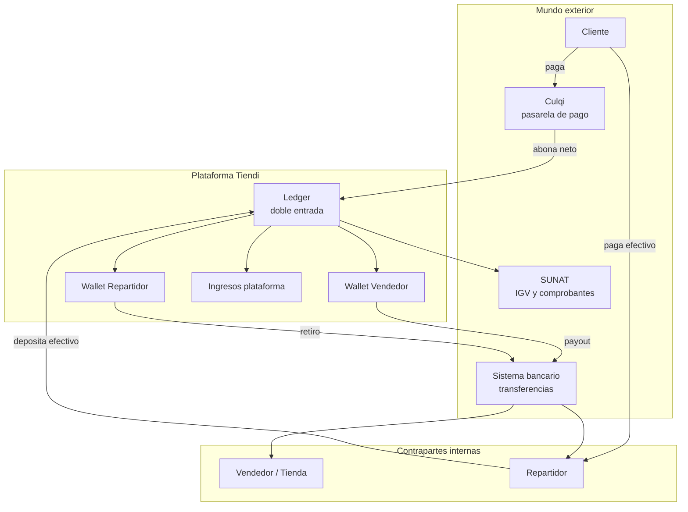
```mermaid
flowchart TB
    subgraph EXT["Mundo exterior"]
        CUST["Cliente"]
        GW["Culqi<br/>pasarela de pago"]
        BANK["Sistema bancario<br/>transferencias"]
        SUNAT["SUNAT<br/>IGV y comprobantes"]
    end

    subgraph PLAT["Plataforma Tiendi"]
        LEDGER["Ledger<br/>doble entrada"]
        WSTORE["Wallet Vendedor"]
        WRIDER["Wallet Repartidor"]
        REV["Ingresos plataforma"]
    end

    subgraph USERS["Contrapartes internas"]
        STORE["Vendedor / Tienda"]
        RIDER["Repartidor"]
    end

    CUST -->|paga| GW
    CUST -->|"paga efectivo"| RIDER
    GW -->|"abona neto"| LEDGER
    LEDGER --> WSTORE
    LEDGER --> WRIDER
    LEDGER --> REV
    WSTORE -->|payout| BANK
    WRIDER -->|retiro| BANK
    BANK --> STORE
    BANK --> RIDER
    RIDER -->|"deposita efectivo"| LEDGER
    LEDGER --> SUNAT
```

| Actor | Rol respecto al dinero | Puede tener saldo |
|-------|------------------------|-------------------|
| **Cliente** | Origen de todo el dinero | No |
| **Vendedor / Tienda** | Recibe el valor de los productos menos comisión | **Sí** — wallet de vendedor |
| **Repartidor** | Recibe comisión de entrega; custodia efectivo del COD | **Sí** — wallet de repartidor |
| **Plataforma** | Retiene comisión, cobra suscripciones, custodia fondos en tránsito | Sí — cuentas internas |
| **Culqi** | Procesa tarjeta, retiene su fee, abona en D+N | No (es externo) |
| **SUNAT** | Destino del IGV recaudado | No (es externo) |

> [!WARNING]
> **Brecha actual:** el modelo `Wallet` tiene `riderId String @unique`, es decir **solo los repartidores tienen wallet**. El vendedor no tiene ninguna cuenta donde acumular lo que se le debe. El dinero de tarjeta entra a la cuenta Culqi de la plataforma y **nunca sale hacia el vendedor**.

---

## 3. Plan de cuentas (chart of accounts)

El ledger opera sobre cuentas tipadas. Cada cuenta tiene un `type` que determina su naturaleza contable.

| Código de cuenta | Tipo | Naturaleza | Qué representa |
|------------------|------|------------|----------------|
| `GATEWAY_RECEIVABLE` | Activo | Deudora | Dinero cobrado por Culqi todavía no abonado a la plataforma |
| `PLATFORM_CASH` | Activo | Deudora | Dinero efectivamente disponible en la cuenta bancaria de la plataforma |
| `RIDER_FLOAT:{riderId}` | Activo | Deudora | Efectivo del COD que el repartidor tiene físicamente encima |
| `STORE_PAYABLE:{storeId}` | Pasivo | Acreedora | Lo que la plataforma le debe al vendedor |
| `RIDER_PAYABLE:{riderId}` | Pasivo | Acreedora | Lo que la plataforma le debe al repartidor |
| `IGV_PAYABLE` | Pasivo | Acreedora | IGV recaudado pendiente de declarar |
| `CUSTOMER_REFUND_PAYABLE` | Pasivo | Acreedora | Devoluciones aprobadas aún no ejecutadas |
| `PLATFORM_REVENUE` | Ingreso | Acreedora | Comisión de plataforma ganada |
| `SUBSCRIPTION_REVENUE` | Ingreso | Acreedora | Ingresos por planes de suscripción |
| `GATEWAY_FEE_EXPENSE` | Gasto | Deudora | Fee cobrado por Culqi |
| `CHARGEBACK_EXPENSE` | Gasto | Deudora | Pérdida por contracargos no recuperados |

> [!TIP]
> Las cuentas con sufijo `:{id}` son **subcuentas por contraparte**. El saldo de la wallet de un vendedor es literalmente el saldo de su `STORE_PAYABLE:{storeId}`. Eso hace que la wallet sea auditable línea por línea sin ninguna lógica adicional.

**Invariante global del sistema:**

```
SUM(todos los asientos) == 0     // siempre, sin excepción
```

---

## 4. Modelo de datos objetivo

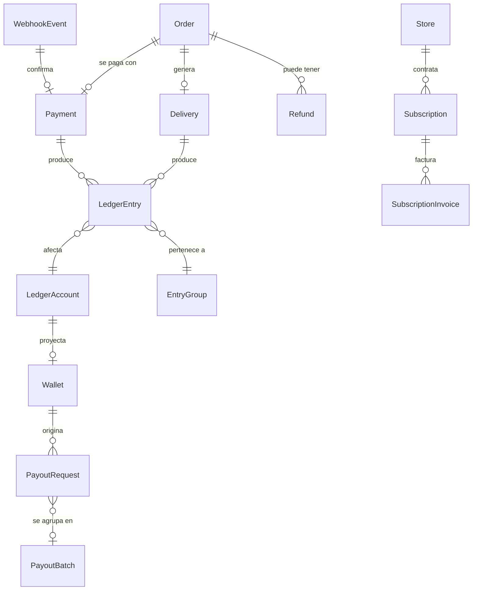
```mermaid
erDiagram
    Order ||--o| Payment : "se paga con"
    Order ||--o| Delivery : "genera"
    Payment ||--o{ LedgerEntry : "produce"
    Delivery ||--o{ LedgerEntry : "produce"
    LedgerEntry }o--|| LedgerAccount : "afecta"
    LedgerEntry }o--|| EntryGroup : "pertenece a"
    LedgerAccount ||--o| Wallet : "proyecta"
    Wallet ||--o{ PayoutRequest : "origina"
    PayoutRequest }o--o| PayoutBatch : "se agrupa en"
    Order ||--o{ Refund : "puede tener"
    Store ||--o{ Subscription : "contrata"
    Subscription ||--o{ SubscriptionInvoice : "factura"
    WebhookEvent ||--o| Payment : "confirma"
```

### 4.1 Entidades nuevas requeridas

```prisma
// Cuenta contable. Una por contraparte y tipo.
model LedgerAccount {
  id        String   @id @default(uuid())
  code      String   @unique          // "STORE_PAYABLE:abc-123"
  type      String                    // ASSET | LIABILITY | REVENUE | EXPENSE
  ownerType String?                   // STORE | RIDER | PLATFORM
  ownerId   String?
  currency  String   @default("PEN")
  entries   LedgerEntry[]

  @@index([ownerType, ownerId])
}

// Agrupa los asientos de un mismo hecho económico. Debe sumar 0.
model EntryGroup {
  id             String   @id @default(uuid())
  kind           String   // ORDER_CAPTURE | COMMISSION | PAYOUT | REFUND ...
  reference      String   // orderId | deliveryId | payoutId
  idempotencyKey String   @unique
  reversalOfId   String?  // apunta al grupo que revierte
  createdAt      DateTime @default(now())
  entries        LedgerEntry[]

  @@index([kind, reference])
}

// Asiento individual. INMUTABLE.
model LedgerEntry {
  id        String        @id @default(uuid())
  groupId   String
  group     EntryGroup    @relation(fields: [groupId], references: [id])
  accountId String
  account   LedgerAccount @relation(fields: [accountId], references: [id])
  amount    Decimal       @db.Decimal(12, 2)  // + debe, - haber
  memo      String?
  createdAt DateTime      @default(now())

  @@index([accountId, createdAt])
}

// Solicitud de salida de dinero. Reemplaza el WITHDRAWAL directo actual.
model PayoutRequest {
  id             String    @id @default(uuid())
  ownerType      String    // STORE | RIDER
  ownerId        String
  amount         Decimal   @db.Decimal(12, 2)
  status         String    @default("PENDING")
  method         String    // BANK_TRANSFER | YAPE | PLIN
  destination    Json      // datos bancarios cifrados
  batchId        String?
  externalRef    String?   // id de la operación bancaria
  failureReason  String?
  idempotencyKey String    @unique
  requestedAt    DateTime  @default(now())
  settledAt      DateTime?

  @@index([ownerType, ownerId, status])
}

// Evento de webhook recibido. Garantiza idempotencia y auditoría.
model WebhookEvent {
  id          String   @id @default(uuid())
  provider    String   // CULQI
  externalId  String                  // id del evento en el proveedor
  signature   String
  verified    Boolean  @default(false)
  payload     Json
  processedAt DateTime?
  createdAt   DateTime @default(now())

  @@unique([provider, externalId])
}
```

### 4.2 Cambios a entidades existentes

| Entidad | Cambio requerido | Motivo |
|---------|------------------|--------|
| `Wallet` | Quitar `riderId @unique`; usar `ownerType` + `ownerId` | Permitir wallet de vendedor |
| `Wallet` | Los saldos pasan a ser campos **derivados** del ledger | Principio P1 |
| `Transaction` | Se conserva solo como vista legible; el dato real vive en `LedgerEntry` | Principio P1 |
| `Order` | Añadir `platformCommission Decimal` y `storeNet Decimal` congelados al confirmar | Principio P7 |
| `Delivery` | Añadir `tip Decimal @default(0)` | Hoy la propina está hardcodeada en `0` |
| `Subscription` | Añadir `nextBillingAt`, `gatewayCustomerId`, `gatewayCardId` | Cobro recurrente |

> [!NOTE]
> El campo `commissionConfigId` en `Delivery` ya implementa correctamente el principio P7 (snapshot de configuración). **Esa parte del diseño actual se conserva tal cual** — es el patrón correcto y hay que replicarlo en `Order` para la comisión de plataforma.

---

## 5. Mapa global del dinero

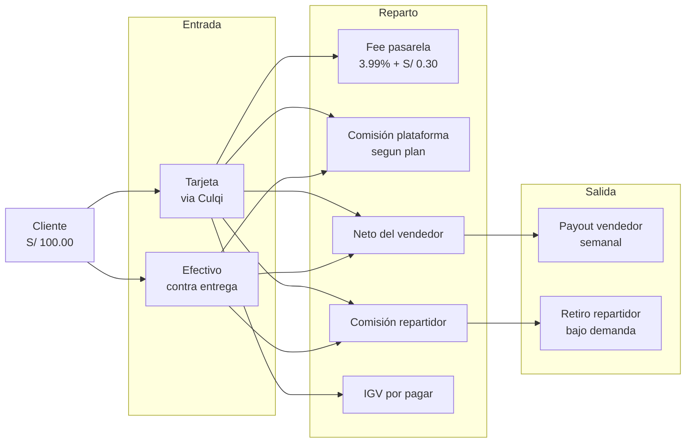
```mermaid
flowchart LR
    CUST["Cliente<br/>S/ 100.00"]

    subgraph IN["Entrada"]
        CARD["Tarjeta<br/>via Culqi"]
        CASH["Efectivo<br/>contra entrega"]
    end

    subgraph SPLIT["Reparto"]
        GWFEE["Fee pasarela<br/>3.99% + S/ 0.30"]
        PCOM["Comisión plataforma<br/>segun plan"]
        RCOM["Comisión repartidor"]
        SNET["Neto del vendedor"]
        IGVP["IGV por pagar"]
    end

    subgraph OUT["Salida"]
        POUT["Payout vendedor<br/>semanal"]
        RWD["Retiro repartidor<br/>bajo demanda"]
    end

    CUST --> CARD
    CUST --> CASH
    CARD --> GWFEE
    CARD --> PCOM
    CARD --> RCOM
    CARD --> SNET
    CARD --> IGVP
    CASH --> RCOM
    CASH --> SNET
    CASH --> PCOM
    SNET --> POUT
    RCOM --> RWD
```

> [!IMPORTANT]
> **La diferencia clave entre tarjeta y efectivo no es el monto, es quién custodia el dinero mientras tanto.**
> - **Tarjeta:** la plataforma custodia. Debe al vendedor y al repartidor.
> - **Efectivo:** el repartidor custodia. Le debe a la plataforma.
>
> Esa inversión de la relación de deuda es la razón por la que el efectivo necesita `cashOnHand`, límite de custodia y depósito obligatorio.

---

## 6. Descomposición del total del pedido

Ejemplo con un pedido de **S/ 100.00** pagado con tarjeta, tienda en plan Pro (5% comisión).

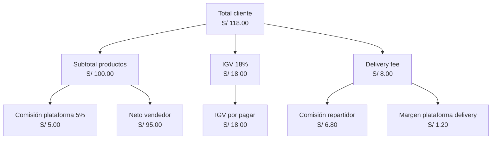
```mermaid
flowchart TD
    T["Total cliente<br/>S/ 118.00"]
    T --> SUB["Subtotal productos<br/>S/ 100.00"]
    T --> IGV["IGV 18%<br/>S/ 18.00"]
    T --> DF["Delivery fee<br/>S/ 8.00"]

    SUB --> PC["Comisión plataforma 5%<br/>S/ 5.00"]
    SUB --> SN["Neto vendedor<br/>S/ 95.00"]

    DF --> RC["Comisión repartidor<br/>S/ 6.80"]
    DF --> PD["Margen plataforma delivery<br/>S/ 1.20"]

    IGV --> SUNAT["IGV por pagar<br/>S/ 18.00"]
```

### 6.1 Orden de cálculo (obligatorio)

El orden importa. Calcular la comisión sobre el total con IGV incluido es un error que infla la comisión un 18%.

```
1. subtotal        = SUM(item.price * item.quantity)
2. igv             = subtotal * 0.18
3. deliveryFee     = tarifa de zona/distancia
4. total           = subtotal + igv + deliveryFee
5. platformCommission = subtotal * plan.commissionPct     // ← sobre subtotal, NO sobre total
6. storeNet        = subtotal - platformCommission
7. riderCommission = f(config, distancia, nivel)          // ver §9
8. platformDeliveryMargin = deliveryFee - riderCommission
```

> [!CAUTION]
> **La comisión de plataforma se calcula sobre el `subtotal`, jamás sobre el `total`.**
> El IGV no es ingreso de la tienda: es dinero de SUNAT que la tienda solo recauda. Cobrar comisión sobre el IGV significa cobrarle al vendedor por recaudar impuestos ajenos — es incorrecto contablemente y probablemente impugnable legalmente.

> [!WARNING]
> **Brecha actual:** no existe ningún cálculo de `platformCommission` sobre el pedido. El modelo `Order` tiene `subtotal`, `igv`, `deliveryFee` y `total`, pero ningún campo que registre cuánto le corresponde a la plataforma ni cuánto al vendedor. La comisión de plataforma **solo existe dentro del cálculo de la entrega** (`platformFeePct` sobre la tarifa del repartidor), no sobre la venta.

---

## 7. Money-in: pago con tarjeta (Culqi)

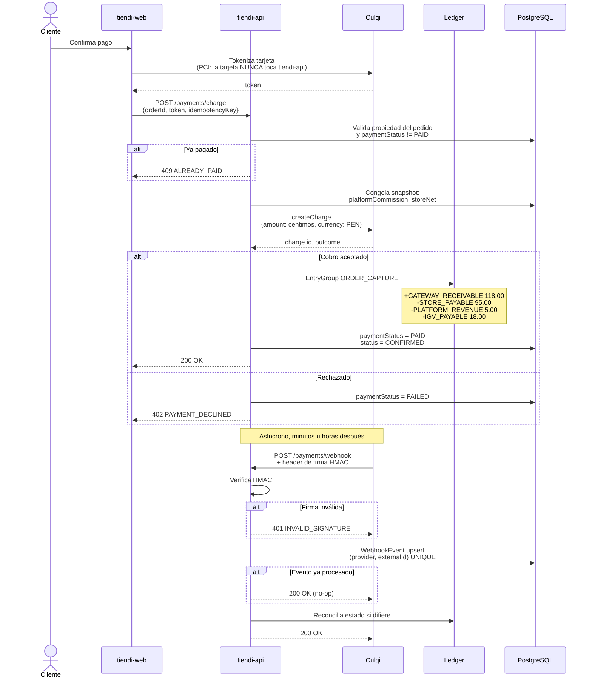
```mermaid
sequenceDiagram
    actor C as Cliente
    participant W as tiendi-web
    participant API as tiendi-api
    participant CQ as Culqi
    participant L as Ledger
    participant DB as PostgreSQL

    C->>W: Confirma pago
    W->>CQ: Tokeniza tarjeta<br/>(PCI: la tarjeta NUNCA toca tiendi-api)
    CQ-->>W: token
    W->>API: POST /payments/charge<br/>{orderId, token, idempotencyKey}

    API->>DB: Valida propiedad del pedido<br/>y paymentStatus != PAID
    alt Ya pagado
        API-->>W: 409 ALREADY_PAID
    end

    API->>DB: Congela snapshot:<br/>platformCommission, storeNet
    API->>CQ: createCharge<br/>{amount: centimos, currency: PEN}
    CQ-->>API: charge.id, outcome

    alt Cobro aceptado
        API->>L: EntryGroup ORDER_CAPTURE
        Note over L: +GATEWAY_RECEIVABLE 118.00<br/>-STORE_PAYABLE 95.00<br/>-PLATFORM_REVENUE 5.00<br/>-IGV_PAYABLE 18.00
        API->>DB: paymentStatus = PAID<br/>status = CONFIRMED
        API-->>W: 200 OK
    else Rechazado
        API->>DB: paymentStatus = FAILED
        API-->>W: 402 PAYMENT_DECLINED
    end

    Note over CQ,API: Asíncrono, minutos u horas después
    CQ->>API: POST /payments/webhook<br/>+ header de firma HMAC
    API->>API: Verifica HMAC
    alt Firma inválida
        API-->>CQ: 401 INVALID_SIGNATURE
    end
    API->>DB: WebhookEvent upsert<br/>(provider, externalId) UNIQUE
    alt Evento ya procesado
        API-->>CQ: 200 OK (no-op)
    end
    API->>L: Reconcilia estado si difiere
    API-->>CQ: 200 OK
```

### 7.1 Consideraciones críticas

> [!CAUTION]
> **El webhook DEBE verificar la firma HMAC antes de tocar nada.**
> Hoy el código tiene literalmente `@nota: TODO — verificar firma HMAC del webhook`. Sin esa verificación, **cualquier persona que conozca la URL del webhook puede marcar pedidos como `PAID` con un simple POST**. Es un fraude de un solo comando `curl`. Esto es un bloqueante de producción, no una mejora.

> [!WARNING]
> **El webhook debe ser idempotente por `externalId`.** Culqi reintenta los webhooks ante cualquier respuesta que no sea `2xx`. Sin la restricción `@@unique([provider, externalId])`, un reintento genera un segundo juego de asientos y **duplica el dinero acreditado**.

> [!NOTE]
> **La tarjeta nunca debe llegar al backend.** La tokenización ocurre en el navegador contra Culqi directamente. `tiendi-api` solo recibe un token de un solo uso. Esto mantiene el alcance PCI-DSS en SAQ-A, el nivel más bajo. Cualquier cambio que haga pasar el PAN por el backend eleva el alcance a SAQ-D y obliga a auditoría anual.

> [!TIP]
> **`GATEWAY_RECEIVABLE` no es `PLATFORM_CASH`.** Culqi abona en D+2 hábiles descontando su fee. El asiento de captura reconoce una **cuenta por cobrar**; recién cuando llega el abono bancario se hace el segundo asiento:
> ```
> +PLATFORM_CASH        113.29
> +GATEWAY_FEE_EXPENSE     4.71
> -GATEWAY_RECEIVABLE    118.00
> ```
> Liquidar al vendedor antes de recibir el abono real significa financiarlo con capital propio. Es una decisión de negocio válida, pero **debe ser explícita**, no accidental.

---

## 8. Money-in: pago contra entrega (COD)

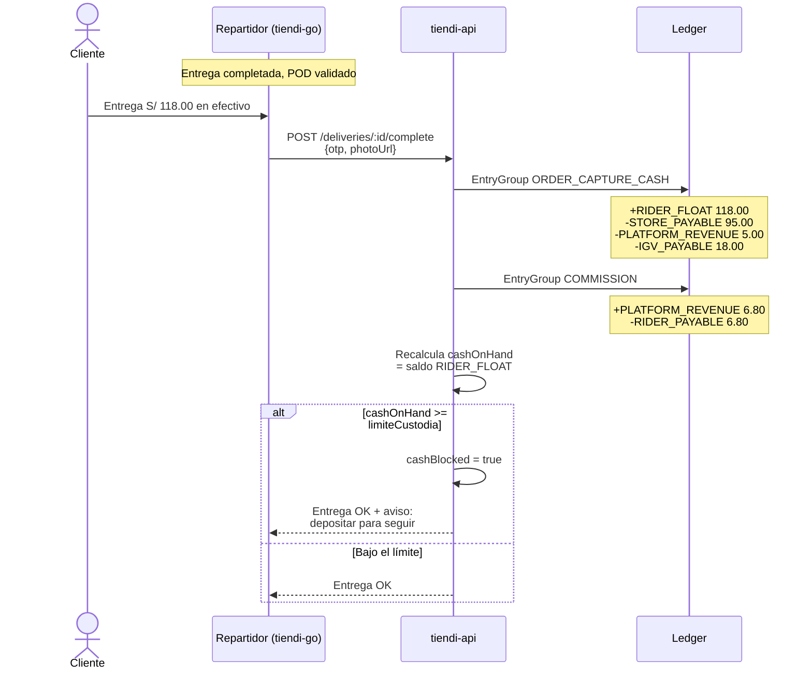
```mermaid
sequenceDiagram
    actor C as Cliente
    participant R as Repartidor (tiendi-go)
    participant API as tiendi-api
    participant L as Ledger

    Note over R: Entrega completada, POD validado
    C->>R: Entrega S/ 118.00 en efectivo
    R->>API: POST /deliveries/:id/complete<br/>{otp, photoUrl}

    API->>L: EntryGroup ORDER_CAPTURE_CASH
    Note over L: +RIDER_FLOAT 118.00<br/>-STORE_PAYABLE 95.00<br/>-PLATFORM_REVENUE 5.00<br/>-IGV_PAYABLE 18.00

    API->>L: EntryGroup COMMISSION
    Note over L: +PLATFORM_REVENUE 6.80<br/>-RIDER_PAYABLE 6.80

    API->>API: Recalcula cashOnHand<br/>= saldo RIDER_FLOAT

    alt cashOnHand >= limiteCustodia
        API->>API: cashBlocked = true
        API-->>R: Entrega OK + aviso:<br/>depositar para seguir
    else Bajo el límite
        API-->>R: Entrega OK
    end
```

### 8.1 Consideraciones críticas

> [!IMPORTANT]
> **En COD el repartidor es un custodio, no un cobrador.** El dinero que tiene encima **no es suyo**: es de la plataforma y del vendedor. Por eso `RIDER_FLOAT` es una cuenta de **activo de la plataforma**, no un saldo del repartidor. Su comisión es un asiento separado contra `RIDER_PAYABLE`.

> [!CAUTION]
> **La comisión del repartidor en COD NO puede quedar congelada indefinidamente.**
> Diseño correcto: la comisión se acredita en `RIDER_PAYABLE` **al completar la entrega**, igual que en tarjeta. Lo que cambia es que en paralelo se genera una **deuda** del repartidor hacia la plataforma por el efectivo que custodia. Ambos saldos se compensan al depositar.
>
> El anti-patrón es acumular la comisión en un estado `pending` que ningún proceso convierte nunca en saldo disponible.

> [!WARNING]
> **Brecha actual:** el campo `pending` de la wallet **solo recibe sumas**. La única escritura está en `creditCommission()` (`delivery.service.ts:846`) y no existe ningún proceso que convierta `pending → balance`. **Toda comisión ganada en pedidos en efectivo queda congelada de forma permanente.**

### 8.2 Límite de custodia de efectivo

| Parámetro | Valor propuesto | Justificación |
|-----------|-----------------|---------------|
| `cashCustodyLimit` | S/ 200.00 | Límite de exposición por repartidor ante pérdida o robo |
| `cashDepositGraceHours` | 24 h | Ventana para depositar antes de escalar |
| Acción al superar el límite | `cashBlocked = true` | Bloquea aceptar **nuevas** entregas, nunca completar las activas |
| Acción tras 48 h sin depositar | Escalado a soporte | Riesgo de morosidad |

> [!CAUTION]
> **`cashBlocked` nunca debe impedir COMPLETAR una entrega en curso.** Si un repartidor cruza el límite a mitad de ruta y el sistema le bloquea la finalización, el cliente se queda sin pedido y el efectivo sin registrar. El bloqueo aplica exclusivamente a **aceptar entregas nuevas**.

> [!WARNING]
> **Brecha actual:** `cashBlocked` se pone en `true` en `delivery.service.ts:845` pero **`confirmCashDeposit()` nunca lo devuelve a `false`**. Hay incluso un comentario en `delivery.service.ts:754` que afirma que el endpoint de depósito lo limpia — pero el código de `wallet.service.ts` no toca ese campo.
> **Consecuencia:** el primer repartidor que cruce S/ 200 queda bloqueado **para siempre**, sin ninguna vía de recuperación desde la aplicación.

---

## 9. Comisión del repartidor

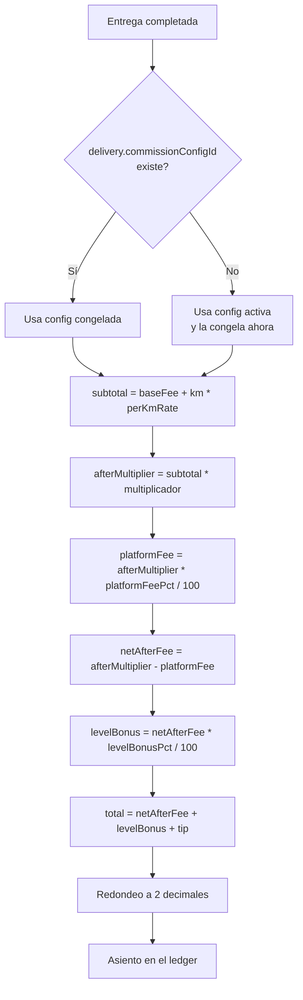
```mermaid
flowchart TD
    START["Entrega completada"] --> CFG{"delivery.commissionConfigId<br/>existe?"}
    CFG -->|Sí| SNAP["Usa config congelada"]
    CFG -->|No| ACT["Usa config activa<br/>y la congela ahora"]

    SNAP --> CALC
    ACT --> CALC

    CALC["subtotal = baseFee + km * perKmRate"]
    CALC --> MULT["afterMultiplier = subtotal * multiplicador"]
    MULT --> FEE["platformFee = afterMultiplier * platformFeePct / 100"]
    FEE --> NET["netAfterFee = afterMultiplier - platformFee"]
    NET --> BONUS["levelBonus = netAfterFee * levelBonusPct / 100"]
    BONUS --> TOTAL["total = netAfterFee + levelBonus + tip"]
    TOTAL --> ROUND["Redondeo a 2 decimales"]
    ROUND --> POST["Asiento en el ledger"]
```

### 9.1 Variables de entrada

| Variable | Origen | Congelada |
|----------|--------|-----------|
| `baseFee` | `CommissionConfig` | Sí, vía `commissionConfigId` |
| `perKmRate` | `CommissionConfig` | Sí |
| `platformFeePct` | `CommissionConfig` | Sí |
| `levelBonusTable` | `CommissionConfig` | Sí |
| `multiplierTable` | `CommissionConfig` | Sí |
| `distanceKm` | `gpsDistanceKm ?? estimatedDistanceKm` | Al completar |
| `riderLevel` | `MonthlyScore.level` del mes en curso | Al completar |
| `tip` | `Delivery.tip` | Al completar |

> [!NOTE]
> El mecanismo de snapshot vía `commissionConfigId` ya está bien implementado y **debe conservarse**. Es la garantía de que subir las tarifas mañana no recalcula lo que se pagó ayer.

> [!IMPORTANT]
> **La distancia debe preferir el GPS real sobre la estimación.** Pagar sobre `estimatedDistanceKm` cuando existe `gpsDistanceKm` significa que un desvío obligado por tráfico o corte de calle lo absorbe el repartidor. La regla `gpsDistanceKm ?? estimatedDistanceKm` es correcta.

> [!CAUTION]
> **El multiplicador debe evaluarse contra la fecha de la ENTREGA, no contra `new Date()` al momento de ejecutar el cálculo.** Si un job de reconciliación reprocesa un lote el lunes, todas las entregas del sábado perderían el multiplicador de fin de semana. Usar siempre `delivery.completedAt`.

> [!WARNING]
> **Brecha actual:** el cálculo del multiplicador usa `new Date().getDay()` (hora de ejecución) en lugar de la fecha de la entrega. Además `tip` está hardcodeado en `0` porque el campo no existe todavía en el modelo `Delivery`.

### 9.2 Ejemplo numérico

Entrega de 4.2 km, repartidor GOLD (bonus 10%), sábado (multiplicador 1.25), `platformFeePct` 15%:

```
subtotal        = 5.00 + (4.2 * 1.20)          = 10.04
afterMultiplier = 10.04 * 1.25                 = 12.55
platformFee     = 12.55 * 0.15                 =  1.88
netAfterFee     = 12.55 - 1.88                 = 10.67
levelBonus      = 10.67 * 0.10                 =  1.07
tip             =                                 0.00
────────────────────────────────────────────────────────
totalCommission                                = 11.74
```

Asientos generados:

```
+PLATFORM_REVENUE           11.74
-RIDER_PAYABLE:{riderId}    11.74
```

---

## 10. Wallet del repartidor

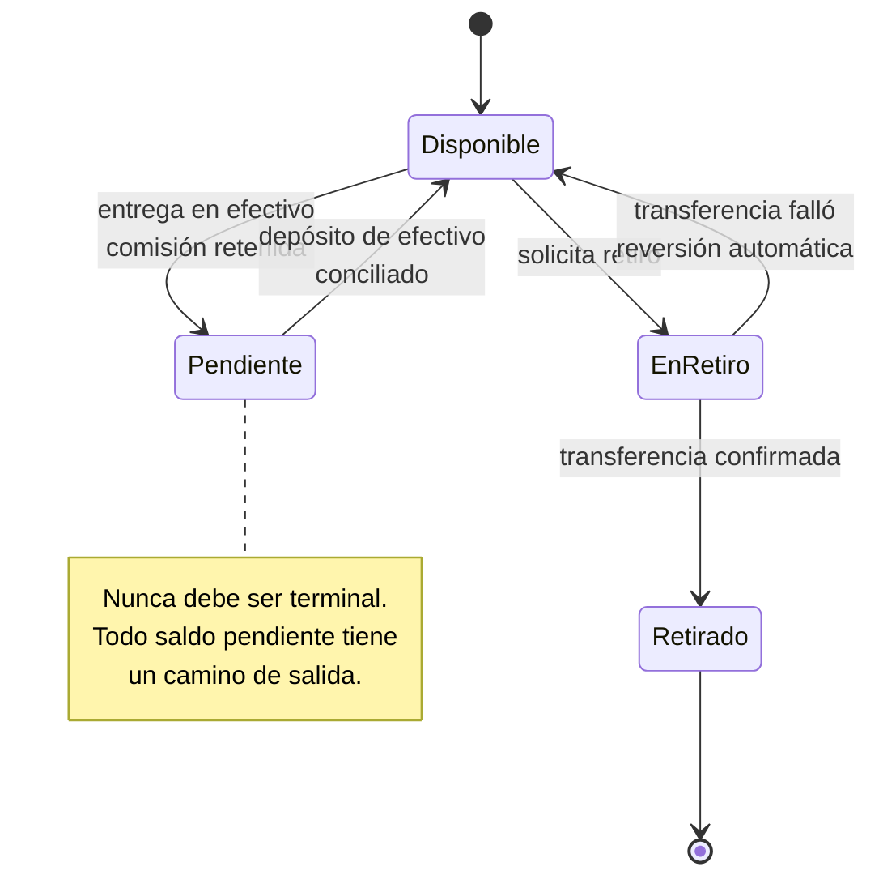
```mermaid
stateDiagram-v2
    [*] --> Disponible

    Disponible --> Pendiente: entrega en efectivo<br/>comisión retenida
    Pendiente --> Disponible: depósito de efectivo<br/>conciliado
    Disponible --> EnRetiro: solicita retiro
    EnRetiro --> Retirado: transferencia confirmada
    EnRetiro --> Disponible: transferencia falló<br/>reversión automática
    Retirado --> [*]

    note right of Pendiente
        Nunca debe ser terminal.
        Todo saldo pendiente tiene
        un camino de salida.
    end note
```

### 10.1 Campos de la wallet y su significado exacto

| Campo | Definición | Se deriva de |
|-------|-----------|--------------|
| `balance` | Disponible para retirar **ahora** | `RIDER_PAYABLE` menos retenciones |
| `pending` | Ganado pero retenido hasta conciliar efectivo | Comisiones de COD sin depósito conciliado |
| `cashOnHand` | Efectivo de la plataforma en poder del repartidor | Saldo de `RIDER_FLOAT` |
| `cashBlocked` | No puede aceptar entregas nuevas | `cashOnHand >= cashCustodyLimit` |
| `totalEarned` | Histórico acumulado, solo informativo | Suma de asientos `COMMISSION` |

> [!IMPORTANT]
> **`cashBlocked` debe ser una función pura de `cashOnHand`, no un campo con estado propio.**
> ```ts
> get cashBlocked(): boolean {
>   return this.cashOnHand >= config.cashCustodyLimit;
> }
> ```
> Un campo booleano persistido puede desincronizarse del valor que lo justifica. Una propiedad derivada **no puede**. Esa es exactamente la causa raíz del bug actual.

---

## 11. Retiros del repartidor

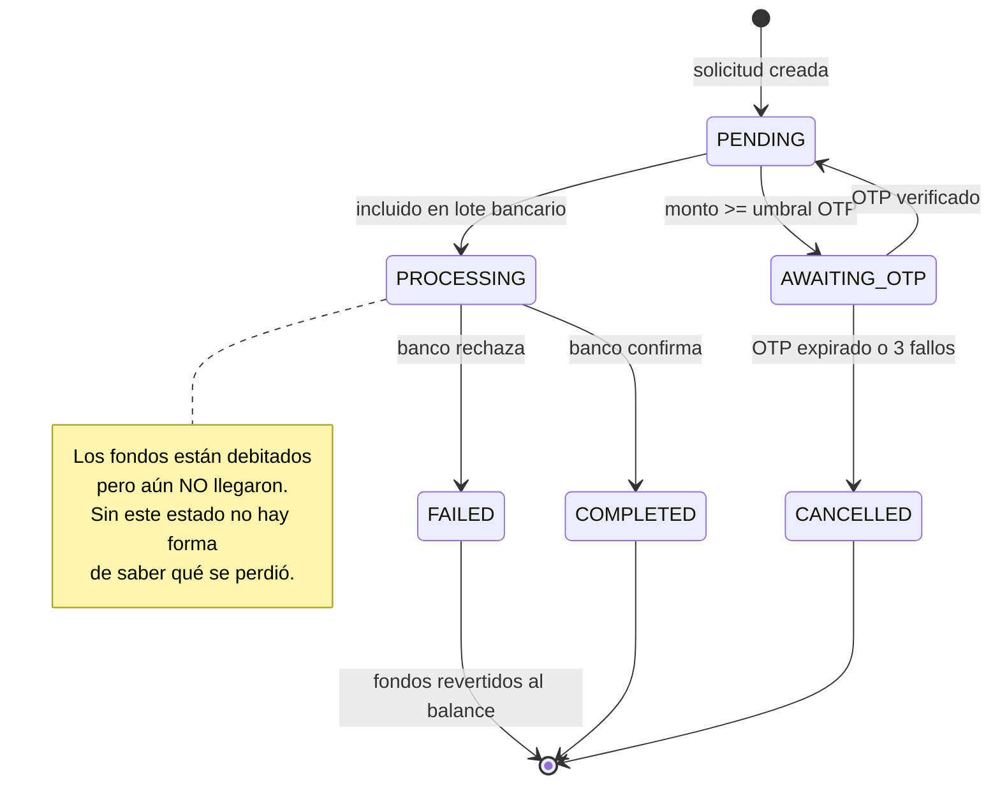
```mermaid
stateDiagram-v2
    [*] --> PENDING: solicitud creada
    PENDING --> AWAITING_OTP: monto >= umbral OTP
    AWAITING_OTP --> PENDING: OTP verificado
    AWAITING_OTP --> CANCELLED: OTP expirado o 3 fallos

    PENDING --> PROCESSING: incluido en lote bancario
    PROCESSING --> COMPLETED: banco confirma
    PROCESSING --> FAILED: banco rechaza

    FAILED --> [*]: fondos revertidos al balance
    COMPLETED --> [*]
    CANCELLED --> [*]

    note right of PROCESSING
        Los fondos están debitados
        pero aún NO llegaron.
        Sin este estado no hay forma
        de saber qué se perdió.
    end note
```

### 11.1 Flujo completo

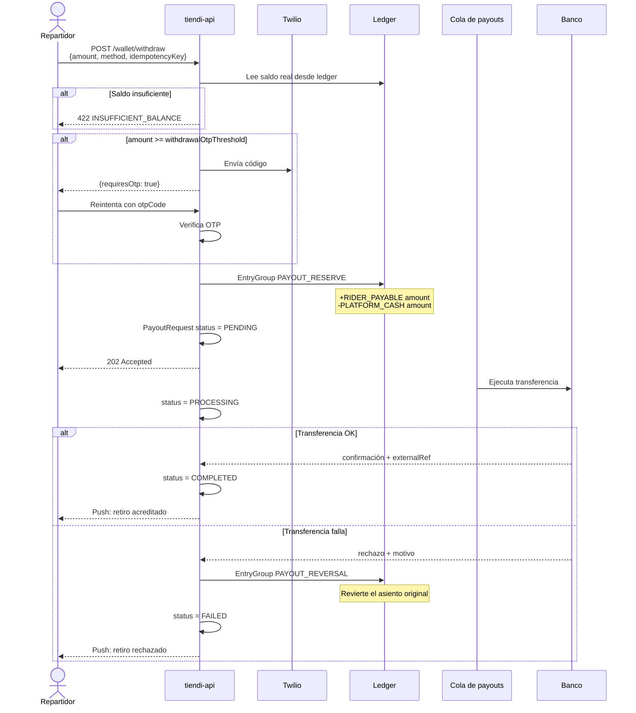
```mermaid
sequenceDiagram
    actor R as Repartidor
    participant API as tiendi-api
    participant OTP as Twilio
    participant L as Ledger
    participant BQ as Cola de payouts
    participant BANK as Banco

    R->>API: POST /wallet/withdraw<br/>{amount, method, idempotencyKey}
    API->>L: Lee saldo real desde ledger

    alt Saldo insuficiente
        API-->>R: 422 INSUFFICIENT_BALANCE
    end

    alt amount >= withdrawalOtpThreshold
        API->>OTP: Envía código
        API-->>R: {requiresOtp: true}
        R->>API: Reintenta con otpCode
        API->>API: Verifica OTP
    end

    API->>L: EntryGroup PAYOUT_RESERVE
    Note over L: +RIDER_PAYABLE  amount<br/>-PLATFORM_CASH  amount
    API->>API: PayoutRequest status = PENDING
    API-->>R: 202 Accepted

    BQ->>BANK: Ejecuta transferencia
    API->>API: status = PROCESSING

    alt Transferencia OK
        BANK-->>API: confirmación + externalRef
        API->>API: status = COMPLETED
        API-->>R: Push: retiro acreditado
    else Transferencia falla
        BANK-->>API: rechazo + motivo
        API->>L: EntryGroup PAYOUT_REVERSAL
        Note over L: Revierte el asiento original
        API->>API: status = FAILED
        API-->>R: Push: retiro rechazado
    end
```

> [!CAUTION]
> **Un retiro NO puede nacer con `status: 'COMPLETED'`.**
> Marcar como completado algo que todavía no salió del banco significa que ante cualquier fallo el sistema **no tiene registro de que el dinero se perdió**. El repartidor ve el saldo descontado, el dinero nunca llega, y no hay ningún estado que permita detectarlo ni revertirlo.

> [!WARNING]
> **Brecha actual:** `requestWithdrawal()` en `wallet.service.ts` hace exactamente eso — resta del `balance` y crea una `Transaction` con `status: 'COMPLETED'` en la misma operación. **No existe ninguna integración bancaria, ninguna cola y ningún estado `PROCESSING`.** El dinero nunca sale realmente; solo baja un número en la base de datos.

> [!NOTE]
> **El OTP es control de fraude, no de autenticación.** Protege contra una sesión robada, no contra un usuario legítimo. El umbral (`withdrawalOtpThreshold`, hoy S/ 100) debe ser configurable y auditado. Recordar que Twilio está en **modo mock** en el entorno actual: el OTP se registra en logs, no se envía por SMS.

---

## 12. Depósito de efectivo del repartidor

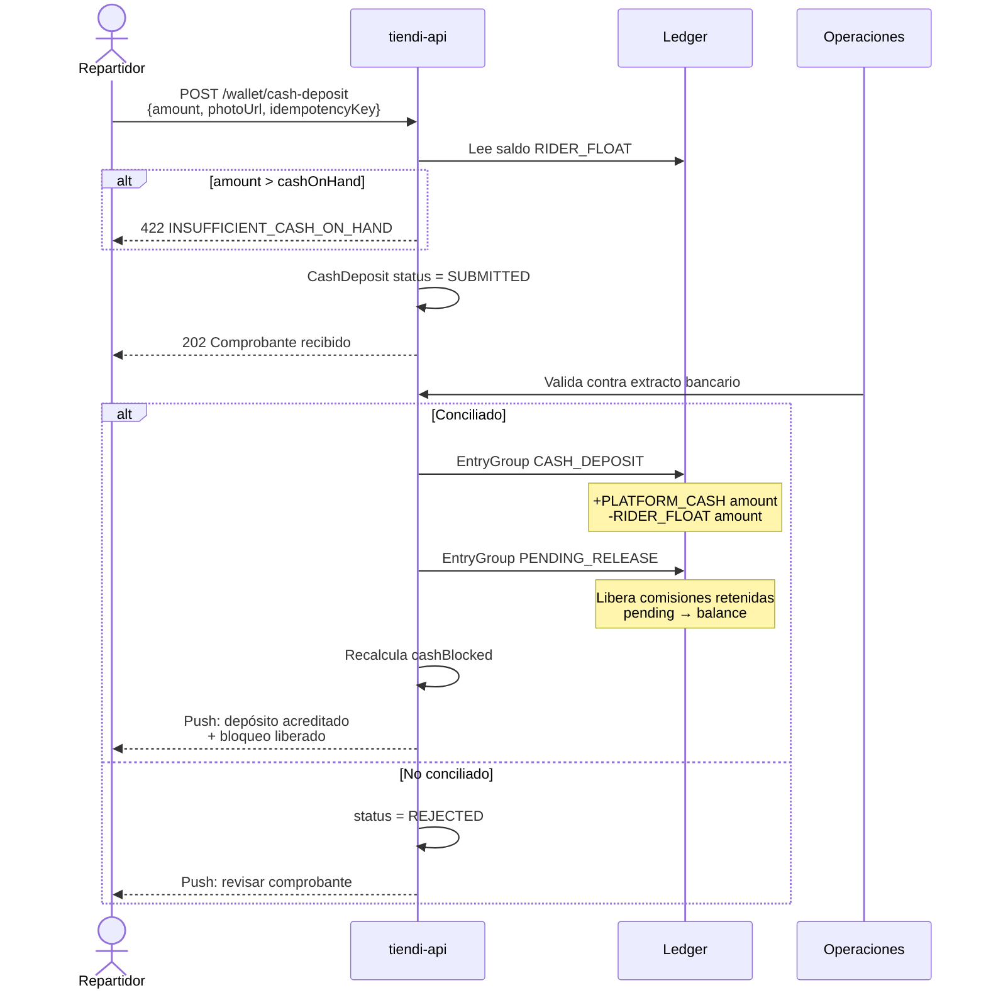
```mermaid
sequenceDiagram
    actor R as Repartidor
    participant API as tiendi-api
    participant L as Ledger
    participant OPS as Operaciones

    R->>API: POST /wallet/cash-deposit<br/>{amount, photoUrl, idempotencyKey}
    API->>L: Lee saldo RIDER_FLOAT

    alt amount > cashOnHand
        API-->>R: 422 INSUFFICIENT_CASH_ON_HAND
    end

    API->>API: CashDeposit status = SUBMITTED
    API-->>R: 202 Comprobante recibido

    OPS->>API: Valida contra extracto bancario
    alt Conciliado
        API->>L: EntryGroup CASH_DEPOSIT
        Note over L: +PLATFORM_CASH   amount<br/>-RIDER_FLOAT     amount
        API->>L: EntryGroup PENDING_RELEASE
        Note over L: Libera comisiones retenidas<br/>pending → balance
        API->>API: Recalcula cashBlocked
        API-->>R: Push: depósito acreditado<br/>+ bloqueo liberado
    else No conciliado
        API->>API: status = REJECTED
        API-->>R: Push: revisar comprobante
    end
```

> [!IMPORTANT]
> **El depósito debe hacer TRES cosas, no una:**
> 1. Reducir `cashOnHand` (bajar `RIDER_FLOAT`)
> 2. Liberar las comisiones retenidas (`pending → balance`)
> 3. Recalcular `cashBlocked`
>
> La implementación actual solo hace la primera, y encima suma el monto depositado directamente al `balance` del repartidor — lo que **le acredita como ganancia dinero que era de la plataforma**.

> [!CAUTION]
> **Un depósito no se acredita contra una foto.** El `photoUrl` es evidencia para una disputa, no una prueba de pago. La acreditación debe ocurrir contra la **conciliación con el extracto bancario real**. Acreditar automáticamente contra una imagen subida por el propio repartidor es un vector de fraude trivial.

---

## 13. Liquidación al vendedor (settlement)

> [!WARNING]
> **Este flujo NO EXISTE en el sistema actual.** No hay modelo, servicio, endpoint ni job de liquidación. El dinero de las ventas con tarjeta queda en la cuenta Culqi de la plataforma y **nunca se transfiere al vendedor**. Es la brecha más grave del sistema.

### 13.1 Ciclo de liquidación

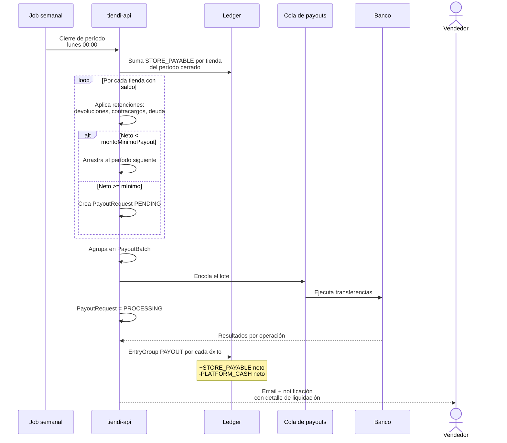
```mermaid
sequenceDiagram
    participant CRON as Job semanal
    participant API as tiendi-api
    participant L as Ledger
    participant BQ as Cola de payouts
    participant BANK as Banco
    actor S as Vendedor

    CRON->>API: Cierre de período<br/>lunes 00:00
    API->>L: Suma STORE_PAYABLE por tienda<br/>del período cerrado

    loop Por cada tienda con saldo
        API->>API: Aplica retenciones:<br/>devoluciones, contracargos, deuda
        alt Neto < montoMinimoPayout
            API->>API: Arrastra al período siguiente
        else Neto >= mínimo
            API->>API: Crea PayoutRequest PENDING
        end
    end

    API->>API: Agrupa en PayoutBatch
    API->>BQ: Encola el lote
    BQ->>BANK: Ejecuta transferencias
    API->>API: PayoutRequest = PROCESSING

    BANK-->>API: Resultados por operación
    API->>L: EntryGroup PAYOUT por cada éxito
    Note over L: +STORE_PAYABLE  neto<br/>-PLATFORM_CASH  neto
    API-->>S: Email + notificación<br/>con detalle de liquidación
```

### 13.2 Estados del lote

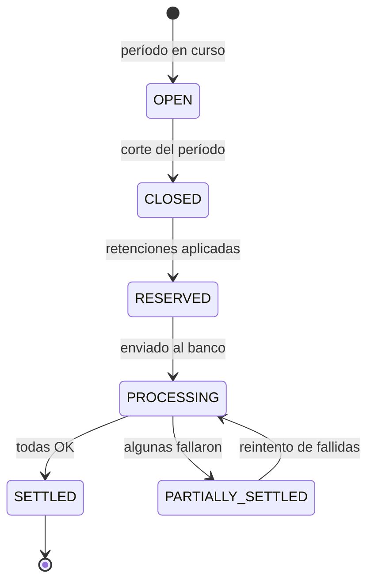
```mermaid
stateDiagram-v2
    [*] --> OPEN: período en curso
    OPEN --> CLOSED: corte del período
    CLOSED --> RESERVED: retenciones aplicadas
    RESERVED --> PROCESSING: enviado al banco
    PROCESSING --> SETTLED: todas OK
    PROCESSING --> PARTIALLY_SETTLED: algunas fallaron
    PARTIALLY_SETTLED --> PROCESSING: reintento de fallidas
    SETTLED --> [*]
```

### 13.3 Parámetros del ciclo

| Parámetro | Valor propuesto | Consideración |
|-----------|-----------------|---------------|
| Frecuencia | Semanal, lunes | Balance entre costo por transferencia y flujo de caja del vendedor |
| Período de retención | 7 días desde la entrega | Ventana de devolución y contracargo |
| Monto mínimo de payout | S/ 50.00 | Debajo del mínimo el costo de transferencia se come el margen |
| Arrastre | Ilimitado | El saldo bajo el mínimo se acumula, nunca se pierde |
| Corte contable | Lunes 00:00 America/Lima | Zona horaria explícita, no la del servidor |

> [!IMPORTANT]
> **La retención de 7 días no es capricho: es gestión de riesgo.** Si se liquida al vendedor el mismo día y el cliente pide devolución al día siguiente, la plataforma tiene que recuperar dinero que ya no controla. La retención garantiza que la ventana de disputa cierre antes de que el dinero salga.

> [!CAUTION]
> **Toda liquidación debe ir acompañada de un detalle desglosado.** El vendedor tiene que poder reconciliar el monto recibido contra sus pedidos, uno por uno: pedido, subtotal, comisión, devoluciones, neto. Una transferencia sin detalle genera disputas que consumen soporte y erosionan confianza.

> [!NOTE]
> **Zona horaria: `America/Lima` explícito, siempre.** Un corte que usa la hora del servidor produce períodos de distinta duración cuando el servidor está en UTC, y pedidos que caen en el período equivocado. Todo cálculo de período debe ser explícito en la zona del negocio.

---

## 14. Suscripciones

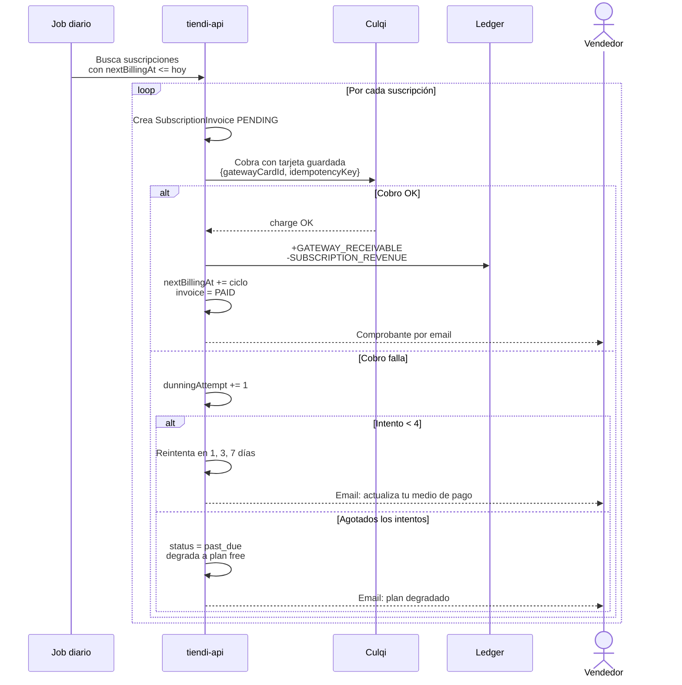
```mermaid
sequenceDiagram
    participant CRON as Job diario
    participant API as tiendi-api
    participant CQ as Culqi
    participant L as Ledger
    actor S as Vendedor

    CRON->>API: Busca suscripciones<br/>con nextBillingAt <= hoy

    loop Por cada suscripción
        API->>API: Crea SubscriptionInvoice PENDING
        API->>CQ: Cobra con tarjeta guardada<br/>{gatewayCardId, idempotencyKey}

        alt Cobro OK
            CQ-->>API: charge OK
            API->>L: +GATEWAY_RECEIVABLE<br/>-SUBSCRIPTION_REVENUE
            API->>API: nextBillingAt += ciclo<br/>invoice = PAID
            API-->>S: Comprobante por email
        else Cobro falla
            API->>API: dunningAttempt += 1
            alt Intento < 4
                API->>API: Reintenta en 1, 3, 7 días
                API-->>S: Email: actualiza tu medio de pago
            else Agotados los intentos
                API->>API: status = past_due<br/>degrada a plan free
                API-->>S: Email: plan degradado
            end
        end
    end
```

### 14.1 Consideraciones

> [!WARNING]
> **Brecha actual:** `changePlan()` en `subscription.service.ts` es un `UPDATE` puro de base de datos. **Cambiar a plan Enterprise no cobra absolutamente nada.** No hay cobro inicial, ni recurrente, ni prorrateo, ni reintentos, ni degradación por impago. El sistema de planes existe solo como metadatos.

> [!IMPORTANT]
> **Prorrateo en cambios de plan a mitad de ciclo.** Subir de Básico a Pro el día 15 de un ciclo de 30 días debe cobrar la diferencia proporcional, no el mes completo ni cero. Bajar de plan acredita saldo a favor para el ciclo siguiente, no genera reembolso en efectivo.

> [!CAUTION]
> **La degradación por impago debe ser gradual, nunca destructiva.** Al pasar a `past_due`: bloquear funciones premium, **jamás borrar datos ni ocultar productos existentes**. Un vendedor que se atrasa dos días en el pago no puede perder su catálogo. La recuperación tras el pago debe ser inmediata y completa.

> [!NOTE]
> **Guardar tarjeta requiere consentimiento explícito y un token del proveedor**, nunca el PAN. Culqi entrega un `card_id` reutilizable. Ese identificador es lo único que se persiste.

---

## 15. Devoluciones, cancelaciones y contracargos

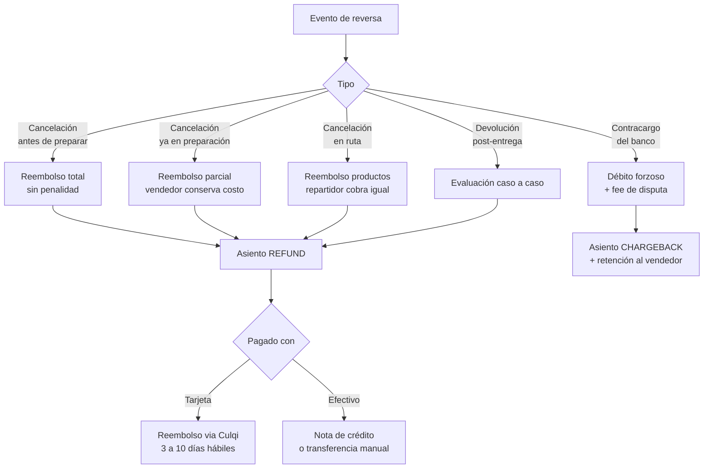
```mermaid
flowchart TD
    EVT["Evento de reversa"] --> TYPE{"Tipo"}

    TYPE -->|"Cancelación<br/>antes de preparar"| C1["Reembolso total<br/>sin penalidad"]
    TYPE -->|"Cancelación<br/>ya en preparación"| C2["Reembolso parcial<br/>vendedor conserva costo"]
    TYPE -->|"Cancelación<br/>en ruta"| C3["Reembolso productos<br/>repartidor cobra igual"]
    TYPE -->|"Devolución<br/>post-entrega"| C4["Evaluación caso a caso"]
    TYPE -->|"Contracargo<br/>del banco"| C5["Débito forzoso<br/>+ fee de disputa"]

    C1 --> LEDGER["Asiento REFUND"]
    C2 --> LEDGER
    C3 --> LEDGER
    C4 --> LEDGER
    C5 --> CB["Asiento CHARGEBACK<br/>+ retención al vendedor"]

    LEDGER --> GW{"Pagado con"}
    GW -->|Tarjeta| RGW["Reembolso via Culqi<br/>3 a 10 días hábiles"]
    GW -->|Efectivo| RCASH["Nota de crédito<br/>o transferencia manual"]
```

### 15.1 Matriz de responsabilidad

| Escenario | Cliente recibe | Vendedor asume | Repartidor cobra | Plataforma asume |
|-----------|----------------|----------------|------------------|------------------|
| Cancela antes de preparar | 100% | Nada | Nada | Fee de pasarela |
| Cancela en preparación | Subtotal | Costo de insumos | Nada | Fee de pasarela |
| Cancela en ruta | Subtotal | Producto perdido | **Comisión completa** | Fee + delivery |
| Producto defectuoso | 100% | Producto + delivery | Comisión completa | Fee de pasarela |
| Cliente ausente | Subtotal menos delivery | Nada | **Comisión completa** | Nada |
| Contracargo perdido | 100% (vía banco) | Monto + fee de disputa | Ya cobró | Gestión |

> [!IMPORTANT]
> **El repartidor cobra siempre que haya recorrido la ruta.** Su trabajo se ejecutó independientemente de que el pedido se haya cancelado o el cliente no estuviera. Descontarle la comisión por un problema ajeno destruye la confianza en la plataforma y provoca deserción de repartidores.

> [!CAUTION]
> **Un reembolso NUNCA se implementa restando del asiento original.** Se crea un `EntryGroup` nuevo con `kind: REFUND` y `reversalOfId` apuntando al grupo original. El asiento original permanece intacto. Esto es el principio P3 (inmutabilidad) y es lo que hace auditable el sistema.

> [!WARNING]
> **Un contracargo puede llegar hasta 120 días después de la venta.** Para entonces el vendedor ya cobró su liquidación. El sistema necesita:
> - Poder generar un saldo **negativo** en `STORE_PAYABLE`
> - Descontarlo automáticamente de la siguiente liquidación
> - Escalar a cobranza si el vendedor no tiene ventas futuras
>
> Sin soporte de saldo negativo, cada contracargo es una pérdida directa e irrecuperable de la plataforma.

---

## 16. Idempotencia, atomicidad y reintentos

### 16.1 Regla de oro

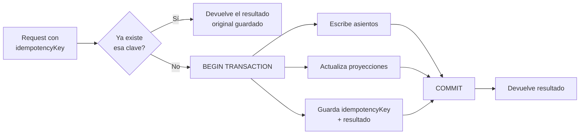
```mermaid
flowchart LR
    REQ["Request con<br/>idempotencyKey"] --> CHK{"Ya existe<br/>esa clave?"}
    CHK -->|Sí| CACHED["Devuelve el resultado<br/>original guardado"]
    CHK -->|No| TX["BEGIN TRANSACTION"]
    TX --> W1["Escribe asientos"]
    TX --> W2["Actualiza proyecciones"]
    TX --> W3["Guarda idempotencyKey<br/>+ resultado"]
    W1 --> COMMIT["COMMIT"]
    W2 --> COMMIT
    W3 --> COMMIT
    COMMIT --> RESP["Devuelve resultado"]
```

### 16.2 Operaciones que exigen `idempotencyKey`

| Operación | Clave sugerida |
|-----------|----------------|
| Cobro de pedido | `order:{orderId}:charge` |
| Webhook de pasarela | `webhook:{provider}:{externalId}` |
| Comisión de entrega | `delivery:{deliveryId}:commission` |
| Retiro | `payout:{ownerId}:{clientNonce}` |
| Depósito de efectivo | `deposit:{riderId}:{clientNonce}` |
| Liquidación | `settlement:{storeId}:{periodo}` |
| Cobro de suscripción | `subscription:{subId}:{periodo}` |

> [!CAUTION]
> **Nunca hacer una llamada de red dentro de una transacción de base de datos.**
> El patrón correcto:
> 1. `BEGIN` → reservar fondos, marcar `PROCESSING` → `COMMIT`
> 2. Llamar al proveedor externo (fuera de la transacción)
> 3. `BEGIN` → registrar el resultado → `COMMIT`
>
> Una transacción abierta esperando una respuesta HTTP mantiene locks de fila durante segundos. Bajo carga eso escala a agotamiento del pool de conexiones y caída del servicio.

> [!IMPORTANT]
> **Todo job que mueve dinero debe poder correr dos veces sin efecto adicional.** Los reintentos van a ocurrir: por timeout, por redeploy, por reinicio del worker. La idempotencia no es una optimización, es el requisito mínimo de corrección.

### 16.3 Concurrencia

> [!NOTE]
> **Bloqueo pesimista sobre la cuenta al escribir asientos.**
> ```sql
> SELECT * FROM ledger_account WHERE id = ? FOR UPDATE;
> ```
> Sin esto, dos entregas completadas simultáneamente por el mismo repartidor pueden leer el mismo `cashOnHand` y ambas concluir que está bajo el límite — dejándolo por encima del límite de custodia sin bloqueo.

---

## 17. Conciliación y cierre diario

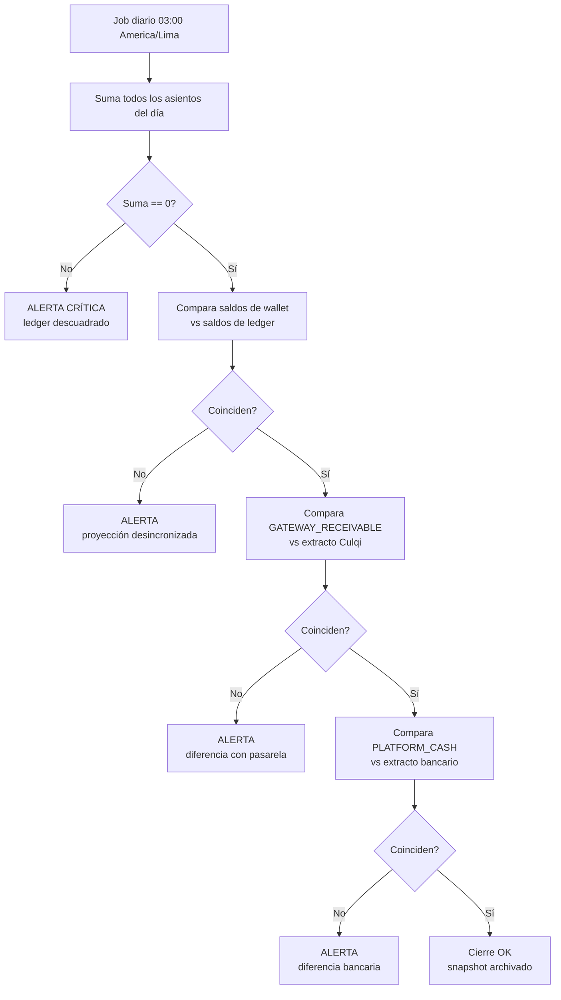
```mermaid
flowchart TD
    START["Job diario 03:00 America/Lima"] --> A["Suma todos los asientos del día"]
    A --> CHK1{"Suma == 0?"}
    CHK1 -->|No| AL1["ALERTA CRÍTICA<br/>ledger descuadrado"]
    CHK1 -->|Sí| B["Compara saldos de wallet<br/>vs saldos de ledger"]

    B --> CHK2{"Coinciden?"}
    CHK2 -->|No| AL2["ALERTA<br/>proyección desincronizada"]
    CHK2 -->|Sí| C["Compara GATEWAY_RECEIVABLE<br/>vs extracto Culqi"]

    C --> CHK3{"Coinciden?"}
    CHK3 -->|No| AL3["ALERTA<br/>diferencia con pasarela"]
    CHK3 -->|Sí| D["Compara PLATFORM_CASH<br/>vs extracto bancario"]

    D --> CHK4{"Coinciden?"}
    CHK4 -->|No| AL4["ALERTA<br/>diferencia bancaria"]
    CHK4 -->|Sí| OK["Cierre OK<br/>snapshot archivado"]
```

### 17.1 Invariantes verificados cada noche

| # | Invariante | Severidad si falla |
|---|-----------|--------------------|
| I1 | `SUM(ledger_entry.amount) == 0` | **Crítica** — detiene payouts |
| I2 | `wallet.balance == saldo de su cuenta payable` | Alta |
| I3 | `SUM(RIDER_FLOAT) == SUM(cashOnHand)` | Alta |
| I4 | `GATEWAY_RECEIVABLE == pendiente según Culqi` | Media |
| I5 | `PLATFORM_CASH == saldo bancario real` | **Crítica** |
| I6 | Ningún `PayoutRequest` en `PROCESSING` por más de 48 h | Alta |
| I7 | Ningún `pending` sin movimiento por más de 30 días | Media |

> [!CAUTION]
> **Si I1 falla, se detienen TODOS los payouts automáticamente.** Un ledger descuadrado significa que el sistema no sabe cuánto dinero tiene. Seguir pagando en ese estado convierte un error de contabilidad en una pérdida real e irreversible.

> [!TIP]
> **I7 es el detector del bug de `pending`.** Un saldo pendiente que lleva 30 días sin moverse es la firma exacta del agujero negro actual: comisiones que entraron y nunca encontraron la salida.

---

## 18. Brechas actuales vs objetivo

| # | Brecha | Severidad | Ubicación | Impacto |
|---|--------|-----------|-----------|---------|
| **B1** | Webhook de Culqi sin verificación HMAC | **Crítica** | `payments.service.ts` (hay un `TODO` explícito) | Cualquiera puede marcar pedidos como pagados |
| **B2** | No existe liquidación al vendedor | **Crítica** | No existe el módulo | El vendedor nunca cobra sus ventas con tarjeta |
| **B3** | `pending` nunca se convierte en `balance` | **Crítica** | `delivery.service.ts:846` es la única escritura | Comisiones de COD congeladas permanentemente |
| **B4** | `cashBlocked` nunca se limpia | **Alta** | `delivery.service.ts:845` lo activa; `wallet.service.ts` nunca lo desactiva | Repartidor bloqueado de por vida al cruzar S/ 200 |
| **B5** | Retiro nace `COMPLETED` sin mover dinero | **Alta** | `wallet.service.ts` → `requestWithdrawal()` | Saldo descontado, dinero nunca transferido |
| **B6** | Suscripciones no cobran | **Alta** | `subscription.service.ts` → `changePlan()` | Todos los planes son gratis de hecho |
| **B7** | Solo los repartidores tienen wallet | **Alta** | `schema.prisma` → `Wallet.riderId @unique` | Imposible acumular saldo del vendedor |
| **B8** | No hay ledger de doble entrada | **Alta** | `Transaction` es un log plano | Sin auditabilidad ni detección de descuadre |
| **B9** | Depósito de efectivo acredita al `balance` del repartidor | **Alta** | `wallet.service.ts` → `confirmCashDeposit()` | Le acredita como ganancia dinero de la plataforma |
| **B10** | Multiplicador usa la fecha de ejecución | Media | `delivery.service.ts` → `new Date().getDay()` | Reprocesos pierden el recargo de fin de semana |
| **B11** | Sin idempotencia en operaciones de dinero | Media | Transversal | Reintentos duplican movimientos |
| **B12** | `tip` hardcodeado en `0` | Baja | `delivery.service.ts` | La propina no existe funcionalmente |
| **B13** | Sin comisión de plataforma sobre la venta | **Alta** | Modelo `Order` | La plataforma solo monetiza el delivery |
| **B14** | Sin flujo de devoluciones ni contracargos | **Alta** | No existe el módulo | Toda disputa se resuelve a mano |

---

## 19. Plan de implementación por fases

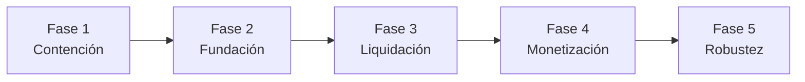
```mermaid
flowchart LR
    F1["Fase 1<br/>Contención"] --> F2["Fase 2<br/>Fundación"]
    F2 --> F3["Fase 3<br/>Liquidación"]
    F3 --> F4["Fase 4<br/>Monetización"]
    F4 --> F5["Fase 5<br/>Robustez"]
```

### Fase 1 — Contención (bloqueantes de producción)

Objetivo: que nada esté roto de forma peligrosa o irrecuperable.

> [!NOTE]
> **Implementada (2026-08-25)** — commits de `tiendi-api`:
>
> - **B1**: `handleWebhook()` verifica `Culqi-Signature` (HMAC-SHA256 de `{id}{timestamp}{rawBody}`, comparación timing-safe) contra la variable nueva **`CULQI_WEBHOOK_SECRET`** (⚠️ setearla en producción es obligatorio: sin ella procesa sin verificar y loguea WARNING por request). Idempotencia vía tabla nueva `WebhookEvent` con `@@unique(provider, eventId)`; reintentos duplicados se ignoran. `main.ts` habilitó `rawBody: true`.
> - **B4**: `cashBlocked` se recalcula como derivada del `cashOnHand` al depositar (`confirmCashDeposit`), límite S/ 200 (§8.2). Ya no hay repartidor bloqueado para siempre.
> - **B9**: el depósito **solo baja `cashOnHand`** — ya no acredita efectivo como ganancia en `balance`. La Transaction nace `SUBMITTED` a la espera de conciliación bancaria; liberar `pending → balance` es la B3 (Fase 2).
> - **B5**: los retiros nacen `PROCESSING`, no `COMPLETED` (el saldo se debita igual). ⚠️ Operativo: hasta que exista el lote bancario (B2, Fase 3) las transacciones quedan en `PROCESSING` indefinidamente — refleja la realidad (dinero debitado, aún no transferido), pero no hay flujo que las cierre.
>
> Tests: 14 nuevos (`payments.service.spec.ts`, `wallet.service.spec.ts`). Suite 466/466, build y migración aplicada.

- [x] **B1** — Verificación HMAC del webhook + `WebhookEvent` con `@@unique`
- [x] **B4** — `cashBlocked` como propiedad derivada de `cashOnHand`
- [x] **B9** — Corregir `confirmCashDeposit()` para no acreditar el efectivo como ganancia
- [x] **B5** — Estado `PROCESSING` en retiros; dejar de nacer `COMPLETED`

> [!IMPORTANT]
> ~~**B1 y B4 son bloqueantes absolutos de producción.**~~ Ambas quedaron resueltas. Recordatorio operativo: B1 exige `CULQI_WEBHOOK_SECRET` en las variables de entorno de producción para ser real.

### Fase 2 — Fundación contable

> [!NOTE]
> **Implementada (2026-08-25)** — commits de `tiendi-api`:
>
> - **B8**: `LedgerAccount`/`EntryGroup`/`LedgerEntry` según §4.1, con `LedgerService.post()` que rechaza grupos que no suman 0 (I1) y es idempotente por `idempotencyKey`. Asientos inmutables.
> - **B7**: `Wallet` polimórfica (`ownerType` + `ownerId`, histórico backfillado como RIDER); `riderId` ahora nullable sin unique para permitir wallets de vendedor. Los saldos siguen siendo columnas proyectadas — la sincronización fina con el ledger llega con los postings reales.
> - **B11**: `Transaction.idempotencyKey` (@@unique); retiros y depósitos aceptan clave opcional — un reintento devuelve el resultado original.
> - **B3**: `POST /admin/riders/:riderId/reconcile-cash-deposit` libera `pending → balance` hasta el monto conciliado (nunca más que el pending).
> - **Job diario**: cola BullMQ `ledger-reconciliation` programada 03:00 Lima (08:00 UTC) ejecutando I1/I3/I7; I4/I5 omitidos hasta integración con Culqi/banco; I6 cuando exista `PayoutRequest`. Trigger manual: `POST /admin/ledger/run-daily-checks`.
>
> Tests: 8 nuevos (`ledger.service.spec.ts`). Suite 474/474, migración aplicada.

- [x] **B8** — Ledger de doble entrada: `LedgerAccount`, `EntryGroup`, `LedgerEntry`
- [x] **B7** — Wallet polimórfica (`ownerType` + `ownerId`)
- [x] **B11** — `idempotencyKey` en todos los endpoints de dinero
- [x] **B3** — Reconciliación `pending → balance` al conciliar el depósito
- [x] Job de conciliación diaria con los invariantes I1–I7

### Fase 3 — Liquidación al vendedor

> [!NOTE]
> **Implementada (2026-08-25)** — commits de `tiendi-api` y `tiendi-vendor`:
>
> - **B2**: modelos `PayoutRequest` + `PayoutBatch` con el ciclo de estados de §13.2; `SettlementService.runWeeklySettlement()` crea lote RESERVED solo para saldos ≥ S/ 50 (debajo se arrastran); job semanal lunes 00:00 Lima (`0 5 * * *` UTC); procesamiento por cola BullMQ. ⚠️ El `transfer()` bancario es un **stub** (responde éxito) — conectar el proveedor real es lo único que falta para dinero en movimiento.
> - **B13**: `Order.platformCommission` + `Order.storeNet` congelados al crear el pedido, calculados sobre el **subtotal sin IGV** (§6.1) según `SubscriptionPlan.commissionPct` (default 5%).
> - Panel del vendor: `/vendor/payouts` lista las liquidaciones de la tienda con período, monto, estado y fecha de pago.
>
> Tests: 4 nuevos (`settlement.service.spec.ts`). Suite 478/478.

- [x] **B2** — `PayoutRequest`, `PayoutBatch`, job semanal, integración bancaria — ⚠️ adapter bancario aún stub
- [x] **B13** — Comisión de plataforma sobre el subtotal, congelada en `Order`
- [x] Panel de liquidaciones en `tiendi-vendor` con desglose por pedido — `/vendor/payouts`

### Fase 4 — Monetización

> [!NOTE]
> **Implementada (2026-08-25)** — commits de `tiendi-api`:
>
> - **B6**: `BillingService.runBillingCycle()` (job diario 06:00 UTC) cobra suscripciones vencidas con la tarjeta guardada (`gatewayCardId`, NUNCA PAN), registra `SUBSCRIPTION_REVENUE` en el ledger, avanza `nextBillingAt`. Dunning: reintentos en 1/3/7 días; al agotar 4 intentos → `pastDue = true` — degradación GRADUAL, jamás borra datos. Cobros idempotentes por `subscription:{id}:{fecha}`.
> - **Prorrateo**: `computeProration()` — subir de plan cobra la diferencia proporcional a los días restantes; bajar acredita saldo a favor (negativo), nunca reembolso.
> - **B12**: campo `Delivery.tip` (default 0) + migración. ⚠️ Pendiente: exponerlo en el DTO de creación y en la UI del cliente para que sea cobrable de verdad.
>
> ⚠️ **Para activar cobros reales**: las suscripciones necesitan `gatewayCustomerId`/`gatewayCardId` (Culqi Customers + Cards API — aún no integrado) y el job diario corre solo con Redis arriba.
>
> Tests: 7 nuevos (`billing.service.spec.ts`). Suite 485/485.

- [x] **B6** — Cobro recurrente de suscripciones + dunning + degradación — ⚠️ requiere Culqi Customers/Cards para capturar tarjetas
- [x] Prorrateo en cambios de plan
- [x] **B12** — Campo `tip` real en `Delivery` — ⚠️ falta exponer en DTO/UI del cliente

### Fase 5 — Robustez

- [ ] **B14** — Módulo de devoluciones y contracargos con saldo negativo
- [ ] **B10** — Multiplicador contra `delivery.completedAt`
- [ ] Reportes fiscales e integración de comprobantes electrónicos

---

## 20. Glosario

| Término | Definición |
|---------|-----------|
| **Asiento** (ledger entry) | Registro inmutable de un movimiento en una cuenta. Positivo = debe, negativo = haber |
| **Grupo de asientos** (entry group) | Conjunto de asientos de un mismo hecho económico. Suma exactamente cero |
| **COD** | Cash on Delivery — pago contra entrega en efectivo |
| **Contracargo** (chargeback) | Reversión forzada por el banco emisor a pedido del titular de la tarjeta |
| **Dunning** | Secuencia de reintentos y avisos ante un cobro recurrente fallido |
| **Float** | Efectivo de la plataforma en custodia física de un repartidor |
| **IGV** | Impuesto General a las Ventas de Perú, 18% |
| **Idempotencia** | Propiedad por la cual repetir una operación no produce efectos adicionales |
| **Liquidación** (settlement) | Transferencia periódica del saldo acumulado a la cuenta bancaria de la contraparte |
| **PAN** | Primary Account Number — el número de tarjeta. Nunca debe tocar el backend |
| **Payout** | Salida efectiva de dinero hacia una cuenta bancaria externa |
| **Proyección** | Vista materializada derivada del ledger. Reconstruible, nunca fuente de verdad |
| **Retención** (hold) | Período durante el cual un saldo existe pero no es retirable |
| **SAQ-A** | Nivel más bajo de cumplimiento PCI-DSS, aplicable cuando la tarjeta nunca toca tus servidores |

---

## Referencias internas

- [[DIAGRAMAS_SECUENCIA_COMISIONES]] — modelo de comisiones y monetización
- [[DIAGRAMAS_SECUENCIA_FACTURACION]] — comprobantes electrónicos
- [[DIAGRAMAS_SECUENCIA_DEVOLUCIONES]] — flujo de devoluciones
- [[COMPLIANCE_LEGAL]] — obligaciones fiscales y regulatorias
- [[SEGURIDAD]] — controles de seguridad transversales
- [[ARCHITECTURE-SONNET]] — arquitectura general de la plataforma
