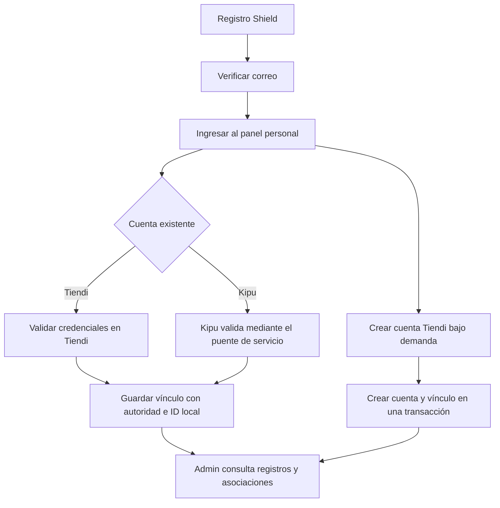

# Guía de implementación: supervisión de Shield en Tiendi Admin

**Fecha:** 2026-10-09. **Estado:** especificación para implementar por otro agente; módulo todavía no implementado por esta entrega.

## 1. Resultado esperado y alcance

Crear la sección **Shield** en Tiendi Admin, accesible desde el menú y desde `/admin/shield`, con el mismo shell, autenticación y lenguaje visual de `/admin/sales`. El administrador debe poder localizar un registro, ver su estado y sus cuentas vinculadas, y comprender cómo se produjo la asociación con los datos realmente disponibles.

URL objetivo de TEST tras implementar y desplegar: `https://admin-test.tiendi.pe/admin/shield`. Esta URL es propuesta, no una página existente verificada.

La primera entrega es de **supervisión de solo lectura**: listado, indicadores, detalle, vínculos y cronología de datos disponibles. La segunda entrega incorpora eventos persistentes para seguir nuevas asociaciones y sus fallos. Completar ambas para considerar terminada esta guía; se pueden revisar por separado.

No incluir suspensión, reactivación, desvinculación, fusión, cambio de contraseñas, impersonación, aprobación de Kipu ni creación de cuentas desde Admin. Esas operaciones requieren especificación de producto propia y no son necesarias para supervisar. No añadir servidor, base de datos, IdP ni infraestructura exclusivos de Shield.

## 2. Evidencia y preparación del agente

El workspace documental usado para esta guía es `C:/Users/punkt/orca/workspaces/ecommcerce-saas-sonet/Astra2`. Sus carpetas de submódulos estaban vacías. Se consultó el código disponible en `G:/PROYECTOS/ecommcerce-saas-sonet/FUENTES`; HEAD de API: `bb8d6aa`; HEAD de Admin: `20f547a`. Son referencias locales de lectura, no prueba de lo desplegado ni garantía de ausencia de cambios sin commit. Revalidar el checkout destino antes de editar; no trabajar automáticamente sobre esa copia externa.

1. Leer instrucciones aplicables, revisar `git status` del repositorio y de cada submódulo y conservar cambios ajenos.
2. Localizar/inicializar los submódulos de la rama objetivo según el flujo del repositorio. Registrar commits y diferencias respecto de esta evidencia.
3. Revisar los archivos de la siguiente tabla y ajustar nombres si cambiaron.
4. Confirmar cómo Admin obtiene la URL de API, cómo autentica TEST y qué prefijo aplica `main.ts`. No copiar dominios de producción a TEST.

Rutas relativas a `FUENTES/`:

| Archivo o carpeta | Qué revisar |
|---|---|
| `tiendi-admin/src/app/admin/admin.routes.ts` | Rutas protegidas; actualmente no incluye Shield. `/admin/orders` tampoco aparece en esta tabla; usar Ventas como referencia real. |
| `tiendi-admin/src/app/admin/core/layout/sidebar.component.ts` | `NAV_ITEMS`: añadir Shield apuntando a `/admin/shield`. |
| `tiendi-admin/src/app/app.routes.ts` | Protección del padre y carga del shell. |
| `tiendi-admin/src/app/admin/features/sales/` | Componentes, estilos, filtros, estados de carga y paginación del producto. |
| `tiendi-admin/src/app/admin/features/kipu/kipu-api.service.ts` | Patrón de cliente administrativo; comprobar implementación, no confiar solo en comentarios. |
| `tiendi-admin/src/environments/` | Selección del backend por entorno. |
| `tiendi-api/src/modules/admin/admin.controller.ts` | Patrón `JwtAuthGuard`, `RolesGuard`, `Role.SUPER_ADMIN`. |
| `tiendi-api/src/modules/admin/admin.module.ts` | Registro de nuevos controller/service. |
| `tiendi-api/src/modules/shield-identity/` | Registro, verificación, sesión y vínculos del titular. |
| `tiendi-api/prisma/schema.prisma` | `GlobalIdentity`, `ShieldIdentityLink`, `ShieldSession`, `AuditLog`. |
| `tiendi-api/src/modules/audit/` | Evaluar persistencia, consulta y garantías antes de reutilizar auditoría. |
| `tiendi-shield/app/panel.html` y `panel.js` | Panel personal y operaciones `/shield/identity/me`, `/link`, `/activate`. |
| `tiendi-kipu/api/src/modules/integraciones/` | Contrato del verificador de control Kipu. |

Documentación de contexto: [contratos Shield](TIENDI_SHIELD-E2-AUDITORIA.md), [visión](TIENDI_LAUNCHER.md) y [plan histórico](TIENDI_LAUNCHER_IMPLEMENTACION.md). Parte de esos documentos precede al código; distinguir acuerdos de comportamiento implementado.

## 3. Modelo real y límites de interpretación

| Entidad | Datos útiles para supervisión | Interpretación |
|---|---|---|
| `GlobalIdentity` | `id`, `email`, `status`, `verifiedAt`, `createdAt`, `updatedAt` | Registro Shield; estados `PENDING_VERIFICATION`, `ACTIVE`, `SUSPENDED`. |
| `ShieldIdentityLink` | `id`, `globalIdentityId`, `authority`, `localUserId`, `status`, `linkedAt`, `revokedAt` | Asociación; estados `ACTIVE`, `REVOKED`. |
| `ShieldSession` | Fechas de emisión, consumo, revocación y expiración | Filas de refresh; no equivalen a personas conectadas ni a sesiones de otras aplicaciones. |

- `tiendi-api` es la autoridad común de Web, Vendor y Go. Presentar una asociación como **Tiendi · Web / Vendor / Go**, sin contar tres vínculos ni inferir permisos o uso de las tres aplicaciones.
- `kipu` es otra autoridad. `localUserId` pertenece a Kipu; nunca buscarlo como `User.id` de Tiendi ni cruzar cuentas por coincidencia de correo o UUID.
- La unicidad actual es la terna `(globalIdentityId, authority, localUserId)`. No garantiza una sola cuenta por autoridad ni una única identidad global por cuenta local. Mostrar todos los vínculos; no añadir nuevas restricciones ni fusionar datos silenciosamente.
- `localUserId` no tiene FK física hacia la cuenta destino. En Tiendi resolver cuentas en lote; si falta una, mostrar «Cuenta local no encontrada» preservando el vínculo. En Kipu mostrar autoridad e ID; no consultar una DB remota ni inventar un endpoint de perfiles.
- `/shield/identity/me` devuelve solo el titular y vínculos activos. No sirve como API administrativa ni muestra revocados.
- `linkedAt` no es un historial: reactivar un vínculo existente cambia su estado y borra `revokedAt`, conservando `linkedAt`. Los ciclos previos no se pueden reconstruir.
- Los logs actuales no constituyen un registro completo de eventos. No presentar «sin errores» cuando lo que falta es instrumentación.
- Hay discrepancias entre comentarios y código: `activateLocalAccount` comenta alta `CUSTOMER`, pero la versión leída usa `dto.role ?? Role.STORE_OWNER`. Verificar DTO y código vigente; esta guía no autoriza cambiar esa política ni etiquetar todas las altas como clientes.

## 4. Experiencia de supervisión

### 4.1 Listado `/admin/shield`

Título «Shield» y descripción «Registros y cuentas vinculadas». Botón Actualizar y fecha de última consulta exitosa. Reutilizar componentes y estilos de Admin.

Indicadores globales, rotulados «Totales globales» para distinguirlos de la búsqueda:

- Registros totales y desglose por los tres estados.
- Registros sin vínculos activos.
- Vínculos activos de Tiendi y de Kipu, contando filas de vínculos.

Tabla: email, ID global abreviado con opción de copiar, estado, fecha de creación, fecha de verificación, cantidad de vínculos activos Tiendi/Kipu y acción «Ver detalle».

Filtros: búsqueda por email parcial o ID global exacto, estado, autoridad con vínculo activo, con/sin vínculos activos, fecha de alta desde/hasta. Búsqueda con debounce y cancelación de respuestas anteriores. Paginación en servidor, 25 filas por defecto. Conservar filtros y página al regresar del detalle; reiniciar página al cambiar filtros.

Estados explícitos: carga, sin registros, sin coincidencias, error con reintento y acceso denegado. En un error no reemplazar datos por ceros que parezcan resultados reales. Responsive sin perder la acción de detalle, controles con etiquetas y navegación por teclado.

### 4.2 Detalle `/admin/shield/:identityId`

Mostrar email, UUID completo, estado, creación, verificación y actualización. Separar:

1. **Cuentas vinculadas:** autoridad, ID local, estado, `linkedAt` y `revokedAt`. Para Tiendi puede añadirse email/nombre/estado local mediante selección explícita; identificarlo como estado de cuenta local, distinto al vínculo. Para Kipu informar «Estado de cuenta local no consultado».
2. **Recorrido del registro:** registro creado, correo verificado si `verifiedAt` existe, asociaciones conservadas en DB. Señalar «Reconstruido a partir del estado actual; puede faltar actividad anterior».
3. **Actividad registrada:** eventos persistentes de la entrega 2, con fecha, operación, resultado y motivo público. Mostrar desde cuándo hay cobertura de instrumentación; historial vacío no significa ausencia de actividad previa.

No presentar `updatedAt` como último login ni `linkedAt` como última reactivación. No mostrar botones de intervención sobre las cuentas.

### 4.3 Explicación del flujo

Incluir una ayuda breve con este recorrido, usando texto del producto:



La sesión Shield gestiona el registro; cada aplicación conserva su autenticación y permisos. Una asociación no equivale a inicio de sesión universal.

## 5. Contrato administrativo propuesto

Nuevas rutas bajo `/api/v1/admin/shield`, si `/api/v1` sigue siendo el prefijo global. Todas usan sesión administrativa con `JwtAuthGuard` + `RolesGuard` + `@Roles(Role.SUPER_ADMIN)`. No reutilizar `ShieldJwtGuard` para conceder acceso al administrador. Aplicar `Cache-Control: no-store` y selección explícita de campos en Prisma y DTO de salida.

| Método y ruta relativa | Respuesta y propósito |
|---|---|
| `GET /summary` | `generatedAt`, `totalIdentities`, `byStatus`, `identitiesWithoutActiveLinks`, `activeLinksByAuthority`. Totales globales. |
| `GET /identities` | `{ items, total, page, pageSize }`, listado filtrado. |
| `GET /identities/:id` | Datos públicos administrativos del registro y resumen de vínculos; 404 si falta. |
| `GET /identities/:id/links` | `{ items, total, page, pageSize }`; activos y revocados, selección por estado opcional. |
| `GET /identities/:id/events` | Entrega 2: `{ items, total, page, pageSize, coverageStartedAt }`. |

Validar query con el patrón Zod existente. Parámetros de listado: `q` (trim, máximo 150 caracteres), `status`, `authority` (`tiendi-api` o `kipu`), `hasActiveLinks` booleano, `createdFrom`, `createdTo`, `page` (entero >= 1), `pageSize` (1–100, default 25). Fechas ISO UTC: desde inclusivo y hasta exclusivo; la UI convierte fechas locales a ese intervalo. Rechazar rango invertido y filtros inválidos con 400.

Combinar filtros con AND. `authority` significa al menos un vínculo ACTIVE de esa autoridad; `hasActiveLinks=false` significa ninguno ACTIVE en cualquier autoridad. La combinación incompatible devuelve cero resultados. Orden fijo `createdAt DESC, id DESC`; vínculos por `linkedAt DESC, id DESC`; eventos por `createdAt DESC, id DESC`.

Cada fila de identidades incluye solo `id`, `email`, `status`, `createdAt`, `verifiedAt`, y conteos de vínculos activos por autoridad. Usar agregación/consultas por lote, evitar N+1 y cargar relaciones completas para contarlas. Paginación también para vínculos y eventos: no asumir cardinalidad pequeña.

Estados HTTP: 401 sin autenticación administrativa válida; 403 para usuario autenticado sin rol; 404 identidad inexistente; 400 parámetros inválidos. Los errores no deben exponer excepciones SQL ni configuración de servicios.

Nunca devolver `passwordHash`, `verificationTokenHash`, `verificationExpiresAt`, `tokenHash`, access/refresh tokens, cabeceras de autorización ni secretos de integración. No serializar modelos Prisma enteros. No enviar `SHIELD_SERVICE_TOKEN` al navegador. No registrar valores de búsquedas con correos en telemetría sin sanitización.

## 6. Historial fiable: segunda entrega

Instrumentar las operaciones existentes después de entregar la consulta de estados. Preferir una tabla aditiva `ShieldIdentityEvent` en PostgreSQL existente: evita forzar una identidad Shield dentro de `AuditLog.userId`, cuya FK apunta a `User`. Si se reutiliza auditoría, demostrar que conserva estos contratos, consulta indexada y atomicidad; no registrar operaciones del titular como `ADMIN_ACTION`.

Campos mínimos propuestos: `id`, `globalIdentityId` (FK), `linkId` nullable, `eventType`, `outcome`, `authority` nullable, `localUserId` nullable, `reasonCode` nullable, `createdAt`. Índice `(globalIdentityId, createdAt, id)`. Tipo y resultado mediante valores permitidos, sin JSON libre del request.

Eventos mínimos:

| Evento | Cuándo y qué significa |
|---|---|
| `REGISTERED` | Creación real de identidad; repetir registro de un email existente no cuenta como nueva alta. |
| `EMAIL_VERIFIED` | Verificación aceptada y persistida. No atribuir tokens inválidos a identidades adivinadas. |
| `LINK_CREATED` | Nuevo vínculo guardado. |
| `LINK_REACTIVATED` | Transición efectiva REVOKED → ACTIVE. |
| `ACCOUNT_ACTIVATED` | Cuenta Tiendi y vínculo creados conjuntamente; incluir el ID del vínculo. |
| `LINK_FAILED` | Intento del titular autenticado fallido; motivos normalizados como control rechazado, identidad no habilitada o puente no disponible. |
| `ACTIVATION_FAILED` | Fallo de activación del titular autenticado, con motivo público normalizado. |

Guardar evento de éxito en la misma transacción que el cambio correspondiente, incluyendo alta y verificación. Validar credenciales y realizar llamadas de red fuera de la transacción; dentro de ella revalidar precondiciones necesarias. Un fallo al guardar el evento debe revertir el cambio para evitar éxito sin historial. El envío de correo ocurre fuera de la transacción y su aceptación no prueba entrega al destinatario.

La vinculación idempotente ya ACTIVE no genera otro `LINK_CREATED`. Resolver carreras usando la restricción única y comprobar transiciones para que dos solicitudes concurrentes no generen dos eventos del mismo cambio. No cambiar reglas de cardinalidad ni permisos como parte de esta instrumentación.

Los fallos se registran fuera de una transacción revertida y solo para una identidad autenticada conocida. Si falla la escritura del evento de fallo, conservar el error original y emitir diagnóstico sanitizado; no fingir cobertura completa durante ese incidente. Nunca guardar contraseñas, hashes, tokens, email/username aportado de cuentas destino, payloads axios ni mensajes crudos de terceros.

No generar retrospectivamente eventos como si hubieran sido observados. Conservar el recorrido reconstruido de la entrega 1 como sección distinta. `coverageStartedAt` procede de una fecha de activación persistida/configurada por entorno al habilitar la instrumentación, no de la fecha del primer evento ni de reinicios del proceso. Documentar esa fecha en la evidencia de despliegue.

Migración aditiva con índices, validada en DB aislada. No ejecutar reset ni modificar datos reales para probarla. En rollback de aplicación conservar la tabla y sus eventos; no borrar auditoría.

## 7. Archivos y secuencia de implementación

1. **Revalidar contratos.** Entregar nota corta con commits de trabajo, rutas reales y diferencias halladas.
2. **API de lectura.** Crear `admin-shield.controller.ts`, `admin-shield.service.ts` y DTO de consultas/salidas bajo `tiendi-api/src/modules/admin/`; registrarlos en su módulo. Implementar summary, listado, detalle y vínculos.
3. **Pruebas de API.** Verificar autorización mediante HTTP real de la app de test; tests unitarios solos del service no prueban guards.
4. **UI.** Crear `tiendi-admin/src/app/admin/features/shield/` con `shield.routes.ts`, `shield-api.service.ts`, modelos, página de listado y detalle. Registrar lazy routes y menú. Reutilizar cliente/interceptor, formato de fechas y componentes de Admin; no crear un login Shield dentro del panel administrativo.
5. **Historia persistente.** Añadir esquema, migración, escritura de eventos y endpoint; conectar actividad en detalle. No marcar historial terminado con una lista simulada o logs parseados.
6. **Validar integración.** Ejecutar casos de aceptación, builds y pruebas pertinentes; preparar evidencia y procedimiento de despliegue TEST con la configuración real.

La copia leída de `tiendi-shield/app/config.js` apunta todos los hosts no locales a `https://api.tiendi.pe/api/v1`. No usar una página con nombre TEST para crear fixtures hasta verificar que realmente llama al backend aislado. La nueva pantalla Admin debe usar la configuración propia de Admin.

Esta guía encarga implementación y validación; no representa autorización de despliegue sobre un entorno compartido. El agente debe dejar el cambio revisable y seguir las instrucciones vigentes del repositorio para publicar.

## 8. Pruebas y aceptación

Fixtures sintéticos en base aislada: identidad pendiente sin vínculos; activa con Tiendi; activa con Tiendi y Kipu; suspendida que conserva vínculos; vínculo revocado; múltiples vínculos de la misma autoridad; misma cuenta local referenciada por dos identidades; referencia local ausente; autoridad desconocida preexistente; reactivación de vínculo.

- [ ] `/admin/shield` aparece en menú; acceso directo y recarga del detalle funcionan con el shell.
- [ ] Sin login y con roles CUSTOMER/STORE_OWNER se rechazan todos los endpoints administrativos; SUPER_ADMIN puede consultar. Un JWT Shield no concede acceso Admin.
- [ ] Totales, filtros combinados, límites de página, orden y rango de fechas coinciden con fixtures; count y listado aplican el mismo filtro.
- [ ] Tiendi se cuenta una vez por vínculo y no por interfaz. Estado de identidad, vínculo y cuenta local se distinguen.
- [ ] Vínculos revocados y referencias ausentes son visibles sin inventar estados ni fusionar identidades.
- [ ] Kipu fuera de línea no bloquea listado ni detalle: las lecturas usan el registro local de vínculos. Un fallo nuevo al vincular produce error sanitizado y evento si corresponde.
- [ ] Pruebas de respuesta HTTP confirman ausencia de hashes, tokens y secretos, también en errores.
- [ ] Repetir o ejecutar concurrentemente una asociación no duplica vínculo ni evento de creación; reactivar produce el evento correcto.
- [ ] Error de escritura de un evento de éxito revierte la mutación; error al guardar un evento de fallo conserva el error original.
- [ ] Actividad anterior a la instrumentación se etiqueta como desconocida/reconstruida. No hay eventos ficticios ni «usuarios conectados» derivados de refresh tokens.
- [ ] E2E cubre búsqueda → detalle → vínculos → actividad → regreso con filtros, más estados vacío, error y acceso denegado; validar en escritorio y viewport móvil.
- [ ] Regresiones: registro, verificación, login, refresh, link y activate de Shield mantienen contratos vigentes; Ventas y navegación Admin siguen funcionando.

Comandos de referencia, ejecutados dentro de cada submódulo y ajustados al runner vigente:

```text
# tiendi-api
npm test -- --runInBand --testPathPatterns="admin-shield|shield-identity"
npm run build
# Con cambios de esquema, en entorno aislado
npx prisma validate
npx prisma generate
# tiendi-admin
npm run build
npm test -- --watch=false
npx playwright test <archivo-e2e-shield>
```

Revisar soporte de flags, scripts y checks exigidos por el repositorio antes de ejecutar. Incluir una prueba de integración sobre PostgreSQL para filtros/agregaciones y atomicidad de eventos; mocks no verifican migraciones ni carreras. No ejecutar suites que dependan de producción ni comandos `db:reset`. Separar fallos previos del repositorio de fallos introducidos, sin declarar éxito si quedan checks obligatorios pendientes.

## 9. Entrega del agente implementador

Entregar código en API/Admin y migración si aplica; commits por submódulo y referencias actualizadas en el repositorio padre según su flujo; resumen de pruebas con resultados, capturas del listado/detalle y límites restantes. Incluir instrucciones para probar con datos sintéticos y variables requeridas por nombre, nunca valores secretos.

Registrar la URL TEST solo cuando esté efectivamente publicada y comprobada. Antes de ello indicar «Implementado localmente; pendiente de despliegue». La supervisión queda completa cuando un administrador puede explicar, desde datos verificables, qué registro existe, qué cuentas tiene asociadas y qué operaciones ocurrieron desde la activación del historial.

## 10. Encargo listo para otro agente

> Implementa DOCS/GUIA-IMPLEMENTACION-SUPERVISION-SHIELD.md en los submódulos tiendi-api y tiendi-admin del checkout de trabajo. Revalida primero la evidencia y las instrucciones del repositorio. Completa API administrativa de solo lectura, listado y detalle en /admin/shield, vínculos activos/revocados e historial persistente de nuevas operaciones con sus pruebas. Conserva las fronteras de autenticación y la cardinalidad vigente; no añadas acciones administrativas sobre cuentas. Usa datos aislados, no inventes historia anterior y entrega cambios revisables con evidencia de validación y estado real del despliegue.
