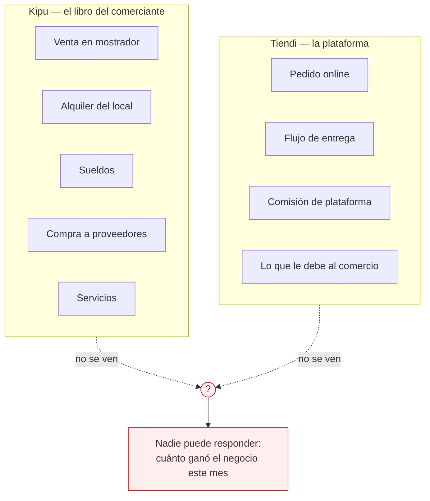
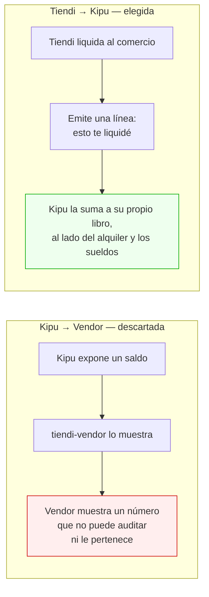
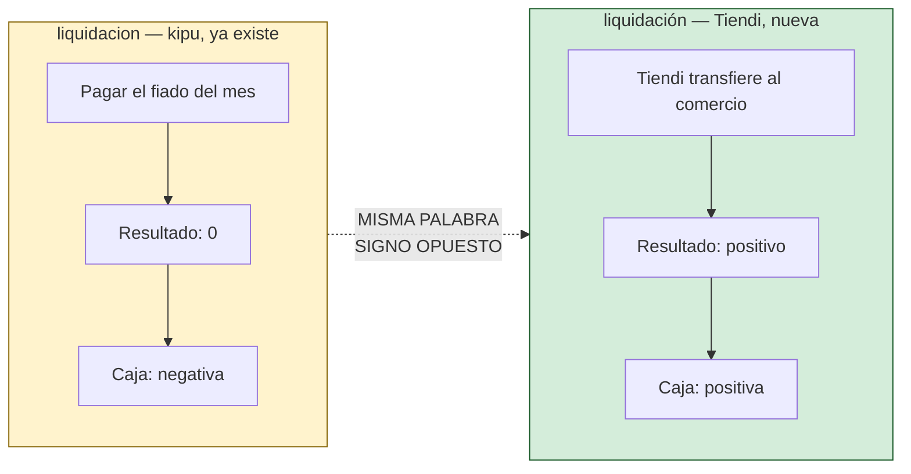
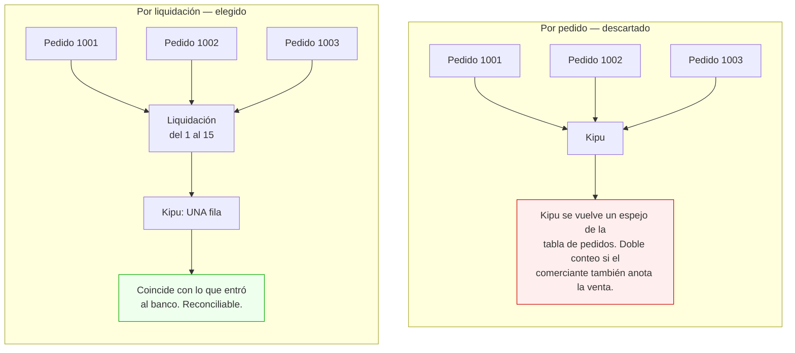
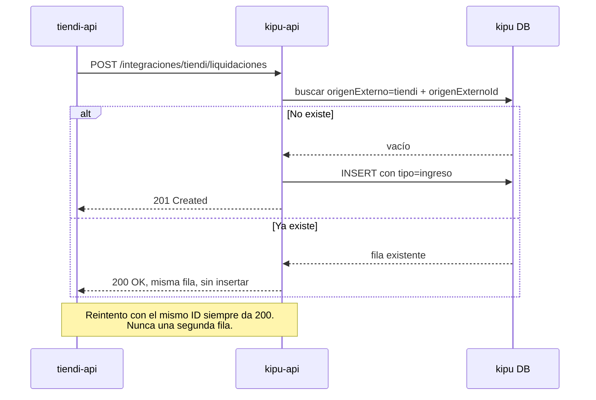
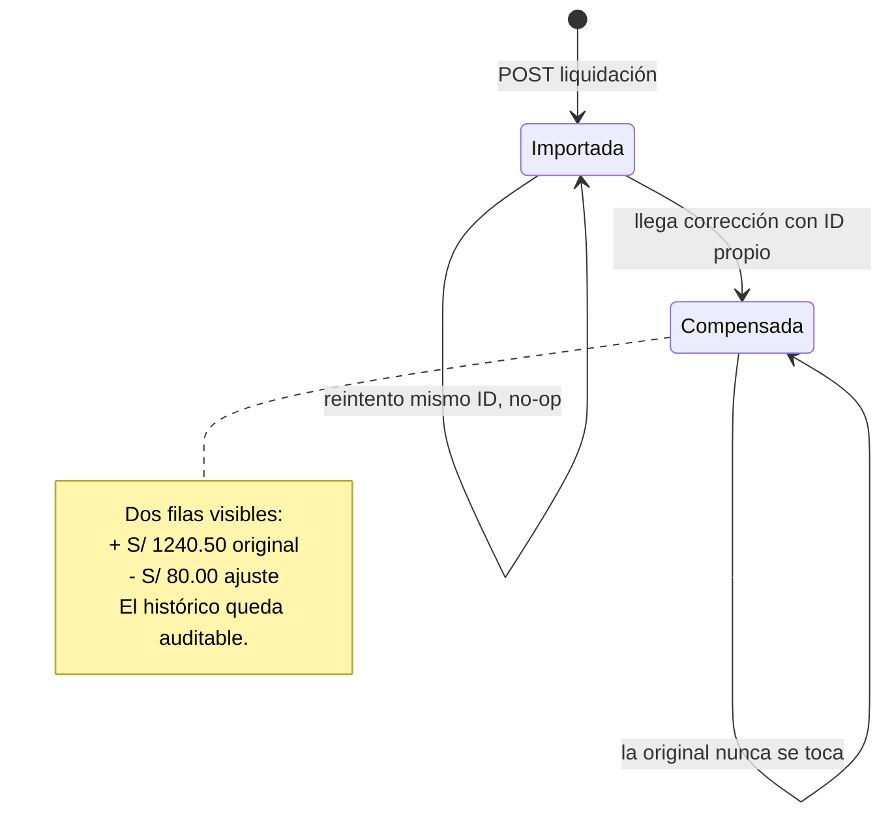
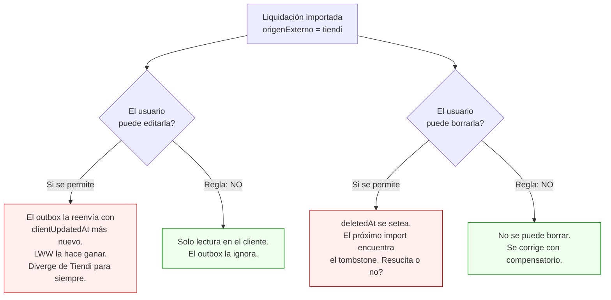
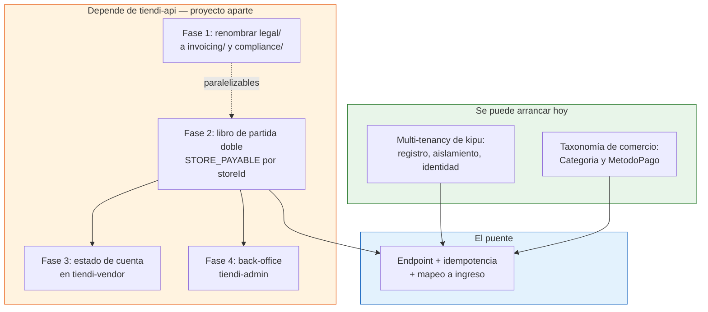

# Integración Tiendi ↔ Kipu — Puente de Liquidación

> [!NOTE]
> Este es un **documento de diseño**, no la descripción de algo construido.
> Nada de lo que está acá existe todavía en el código. Su propósito es fijar la
> dirección, el contrato y —sobre todo— el orden de dependencias, para que
> cuando se empiece a construir no se empiece por el lado equivocado.

---

## 1. Resumen ejecutivo

El puente en sí es **chico**: un endpoint, un identificador de idempotencia y un
mapeo a `ingreso`. Lo caro es todo lo que tiene que existir **antes** dentro de
`tiendi-api`, y eso es un proyecto aparte con su propio plan de cuatro fases
(ver `DOCS/FACTURACION_Y_CONTABILIDAD.md` en la raíz del monorepo).

| Pieza | Dónde vive | Estado | Costo relativo |
| --- | --- | --- | --- |
| Liquidación al vendedor (la fuente) | `tiendi-api` | **No existe** | Alto — Fase 2 del plan contable |
| Multi-tenancy de kipu | `tiendi-kipu` | **No existe** | Medio — independiente, se puede arrancar hoy |
| Taxonomía de comercio en kipu | `tiendi-kipu` | **No existe** | Bajo |
| El puente propiamente dicho | ambos | No existe | **Bajo** |

---

## 2. El problema: nadie tiene el total

Un comercio que usa Tiendi tiene dos flujos de dinero que **nunca se cruzan**.
Alguien entra al mostrador, compra caramelos, paga en efectivo y se va: Tiendi
no se entera. Nunca pasa por el flujo de pedido ni por el de entrega. Del otro
lado, un pedido online sí pasa por Tiendi entero, pero el comercio no lo ve en
su libro de caja.



> [!IMPORTANT]
> **Kipu ya resuelve la mitad de esto hoy, sin ninguna integración.**
> Kipu no es una app de gastos: `TipoMovimiento` incluye `ingreso`, y
> `signedCashFlow()` le asigna signo `+1` (`api/src/common/money.ts:35` y `:57`).
> El toggle gasto/ingreso ya está cableado en la UI
> (`web/src/app/features/expenses/register.page.ts:48`).
> La venta de caramelos del mostrador **se registra hoy**. Lo que falta es el
> otro lado: que la plata que Tiendi le liquida al comercio también caiga en el
> mismo libro.

---

## 3. Dirección: Tiendi → Kipu

Hay dos direcciones posibles y **solo una es correcta**.



El criterio es de **propiedad de la información**. La regla que ya gobierna el
plan contable de Tiendi es *"el vendedor ve su propio dinero, nunca el de la
plataforma"*, y su corolario: *"un saldo no auditable es peor que ninguna
pantalla"*. Si `tiendi-vendor` mostrara un saldo calculado por kipu, estaría
mostrando un número cuyo origen no controla, no puede reconstruir y no puede
explicar cuando el comerciante lo cuestione.

Al revés funciona: Tiendi entrega **un hecho** —"el 15 te transferí S/ 1.240,50
por las ventas del 1 al 15"— y kipu lo trata como cualquier otro movimiento,
reconciliable contra el extracto bancario igual que el alquiler.

---

## 4. Bloqueantes

Cuatro cosas tienen que resolverse antes de que el puente sea siquiera posible.
Están ordenadas por costo, no por importancia.

### 4.1 — La fuente no existe

> [!CAUTION]
> **No hay nada que importar.**
> `rg -i "payout|liquidacion|settlement|STORE_PAYABLE"` sobre todo
> `FUENTES/tiendi-api/src` devuelve **cero coincidencias**. No hay liquidación
> al vendedor, no hay payout, no hay `STORE_PAYABLE`.
>
> Además `Wallet.riderId @unique` significa que **solo los repartidores tienen
> wallet**: los comercios ni siquiera tienen dónde acumular un saldo.
>
> Esto es la **Fase 2** del plan de `DOCS/FACTURACION_Y_CONTABILIDAD.md` (libro
> de partida doble en `tiendi-api`), y no está construida. El puente no tiene de
> dónde leer.

### 4.2 — Colisión de nombre con `liquidacion`

> [!WARNING]
> **`liquidacion` ya existe en kipu y significa lo contrario.**
> En kipu una `liquidacion` es *pagar un fiado*: suma **cero** en el resultado
> del mes y tiene flujo de caja **negativo** (`docs/CUENTAS.md:92` →
> `| liquidacion | 0 | − |`). Suma cero porque el gasto ya se contó cuando
> comiste; si sumara, contarías dos veces.
>
> La liquidación de Tiendi es plata que **entra**. Debe mapear a `ingreso`
> (signo `+1`). **Reusar la palabra rompería el resultado mensual de todos los
> usuarios de fiados que ya existen.**



**Resolución:** el movimiento importado se guarda con `tipo: 'ingreso'`. La
palabra "liquidación" puede usarse en la UI y en la `nota`, pero **nunca** como
valor de `tipo`.

### 4.3 — Kipu es de un solo usuario

> [!CAUTION]
> **Kipu no es multi-tenant.** `docs/FUNCIONAMIENTO-Y-FLUJO-DE-USO.md:37` lo
> dice explícito: *"Autenticación JWT de un solo usuario (personal, no
> multi-tenant)"*. Y el esquema lo confirma —
> `model User { id, username, passwordHash, createdAt }` — sin `tenantId`, sin
> `storeId`, sin organización.
>
> Para ofrecer kipu a los usuarios de Tiendi hace falta, como mínimo: registro,
> aislamiento por tenant en cada consulta, y una identidad que se pueda vincular
> con un comercio de Tiendi.
>
> **Este es el único bloqueante que no depende de `tiendi-api`.**

### 4.4 — La taxonomía es personal, no comercial

> [!WARNING]
> `Categoria` (`web/src/app/core/types.ts:5`) es
> `universidad | comida | alquiler | transporte | servicios | entretenimiento | otros`.
> Es una taxonomía de finanzas personales. **Una liquidación de Tiendi no tiene
> dónde aterrizar**, y `categoria` es obligatorio en `Expense`.
>
> Lo mismo con `MetodoPago`
> (`debito | credito | yape | plin | efectivo | alimentos | fiado`): una
> transferencia de plataforma no es ninguno de esos limpiamente.
>
> Decisión abierta: extender ambas uniones con valores de comercio, o introducir
> un perfil "negocio" con su propio conjunto.

---

## 5. Diseño del puente

### 5.1 Grano: por liquidación, no por pedido



Una fila por liquidación —lo que efectivamente se transfirió— y no una por
pedido. El grano por pedido convierte a kipu en una réplica degradada de la base
de datos de Tiendi, y duplica el ingreso si el comerciante ya anotó esa venta a
mano. El grano por liquidación coincide con el movimiento bancario real, que es
contra lo que el comerciante va a reconciliar.

### 5.2 Idempotencia: identificador externo estable

> [!IMPORTANT]
> **Toda liquidación importada necesita un ID externo estable, y kipu debe
> rechazar duplicados.** Los reintentos están garantizados: cortes de red,
> retries automáticos, doble click. Este es el bug clásico de integración, y acá
> se manifiesta como **plata inventada en los libros de otra persona**.

El identificador lo emite Tiendi y es inmutable. Kipu lo almacena y lo usa como
clave única por usuario.



### 5.3 Correcciones: asientos compensatorios

> [!IMPORTANT]
> Si Tiendi rectifica una liquidación —una devolución, un ajuste de comisión— se
> emite un **asiento compensatorio**, nunca se edita la fila original.
> **Un libro que cambia el pasado no es un libro.**

La corrección llega como una liquidación nueva, con su propio `origenExternoId`,
signo contrario, y una referencia a la original.



### 5.4 Propiedad: unidireccional y de solo lectura

El feed va en **una sola dirección**. Kipu sigue siendo la fuente de verdad del
libro del comerciante; la línea de Tiendi es un movimiento más. Tiendi no lee
nada de kipu, no consulta saldos, no valida nada contra kipu.

---

## 6. Contrato del endpoint (propuesta)

```
POST /integraciones/tiendi/liquidaciones
Authorization: Bearer <token de servicio>
```

```jsonc
{
  "origenExternoId": "stl_2026_08_15_a3f",  // estable, inmutable, emitido por Tiendi
  "tiendaId": "str_9c21",                   // identifica al comercio en Tiendi
  "monto": "1240.50",                       // siempre positivo, string decimal
  "moneda": "PEN",
  "fecha": "2026-08-15",                    // fecha valor de la transferencia
  "periodoDesde": "2026-08-01",
  "periodoHasta": "2026-08-15",
  "compensaA": null,                        // origenExternoId que rectifica, si aplica
  "detalle": {
    "bruto": "1400.00",
    "comision": "159.50"
  }
}
```

Respuestas:

| Código | Significado |
| --- | --- |
| `201` | Creada por primera vez |
| `200` | Ya existía con ese `origenExternoId` — devuelve la misma fila, no inserta |
| `409` | El `origenExternoId` existe pero con datos distintos → alerta, no sobrescribe |
| `422` | El comercio no tiene cuenta kipu vinculada |

> [!NOTE]
> El `409` es deliberado. Si Tiendi manda el mismo ID con otro monto, algo está
> mal del lado de Tiendi. Sobrescribir en silencio sería el peor comportamiento
> posible.

---

## 7. Cambios en el esquema de kipu

Sobre `model Expense` (`api/prisma/schema.prisma:23`), que hoy **no tiene ningún
concepto de origen externo**:

```prisma
// integración Tiendi (docs/INTEGRACION-TIENDI.md) — procedencia del movimiento.
// `origenExterno` null = creado por el usuario en la app.
// La fila importada es de solo lectura desde el cliente.
origenExterno    String?   // "tiendi" | null
origenExternoId  String?   // ID estable emitido por el sistema de origen
compensaA        String?   // origenExternoId de la liquidación rectificada

@@unique([userId, origenExterno, origenExternoId])
```

El `@@unique` compuesto es lo que hace cumplir la idempotencia **a nivel de base
de datos**, no de código de aplicación. Es la única garantía que sobrevive a una
condición de carrera entre dos reintentos concurrentes.

---

## 8. Interacción con el modelo offline-first

Este es el punto que se pasa por alto y el que más caro sale.

Kipu es offline-first: IndexedDB, cola de outbox, sincronización con
last-write-wins sobre `clientUpdatedAt`, y borrado suave con `deletedAt`. Un
movimiento importado es **de origen servidor**, y eso choca con las tres
mecánicas.



> [!WARNING]
> **Reglas no negociables para movimientos con `origenExterno != null`:**
>
> 1. **No editables desde el cliente.** La UI los muestra bloqueados y el outbox
>    nunca los encola.
> 2. **No borrables.** Un error se corrige con un asiento compensatorio (§5.3),
>    no con un tombstone.
> 3. **Exentos de LWW.** El servidor es autoridad única sobre esas filas; el
>    `clientUpdatedAt` del cliente no compite.
>
> Sin estas tres reglas, la primera vez que alguien toque una liquidación
> importada en modo avión, el libro del comerciante deja de coincidir con el de
> Tiendi y no hay forma automática de volver atrás.

Queda además una decisión de producto: **a qué `Cuenta` cae la liquidación**.
Kipu ya tiene el precedente de `SettingsStore.cuentaPorMetodo()` — un mapeo
configurable de método de pago a cuenta. La liquidación de Tiendi debería seguir
el mismo patrón: el comerciante elige, una vez, en qué cuenta entra.
`Cuenta.moneda` es `PEN` por defecto y Tiendi liquida en PEN, así que no hay
conversión involucrada en el caso base.

---

## 9. Orden de dependencias



> [!NOTE]
> Las Fases 1 y 2 son paralelizables entre sí. Las Fases 3 y 4 dependen de la 2.
> El puente depende de la Fase 2 **y** de la multi-tenancy de kipu, que son
> independientes entre sí y pueden avanzar en paralelo.

---

## 10. Qué se puede arrancar hoy

Sin tocar `tiendi-api` y sin esperar a nadie:

1. **Multi-tenancy de kipu** (§4.3). Es el camino crítico más largo del lado de
   kipu y no tiene ninguna dependencia externa.
2. **Taxonomía de comercio** (§4.4). Barato, y desbloquea que un comerciante use
   kipu como libro de negocio aunque el puente no exista.
3. **Campos de procedencia en el esquema** (§7). Se pueden agregar antes de que
   haya nada que importar; una columna nullable no le hace daño a nadie.
4. **Las tres reglas de offline-first** (§8). Se pueden implementar y testear
   contra filas marcadas a mano.

Con esos cuatro puntos, el día que la Fase 2 de `tiendi-api` exista, el puente es
un endpoint.

---

## 11. Checklist

**Kipu — independiente**

- [ ] Multi-tenancy: registro, aislamiento por tenant, identidad vinculable
- [ ] Extender `Categoria` con valores de comercio
- [ ] Extender `MetodoPago` o definir el mapeo de liquidación a cuenta
- [ ] Migración: `origenExterno`, `origenExternoId`, `compensaA` + `@@unique`
- [ ] Movimientos importados: solo lectura en la UI
- [ ] Outbox: nunca encolar filas con `origenExterno != null`
- [ ] Sync: excluir esas filas de la comparación LWW
- [ ] Ajuste: elegir cuenta destino de las liquidaciones

**Tiendi — bloqueado en Fase 2**

- [ ] Wallet o saldo para comercios, no solo repartidores
- [ ] Cálculo de liquidación al vendedor
- [ ] `origenExternoId` estable e inmutable por liquidación
- [ ] Emisión hacia kipu con reintentos

**Puente**

- [ ] `POST /integraciones/tiendi/liquidaciones`
- [ ] Idempotencia por `@@unique` compuesto
- [ ] `409` ante mismo ID con datos distintos
- [ ] Mapeo a `tipo: 'ingreso'` — **nunca** a `liquidacion`
- [ ] Asientos compensatorios para rectificaciones

---

## 12. Referencias

**En este repositorio**

- `docs/CUENTAS.md` — los dos ejes: resultado y caja. §4.1 y §6.3 son la tabla de
  signos. La colisión de `liquidacion` está en la tabla de §4.1.
- `docs/FIADOS.md` — por qué `liquidacion` suma cero.
- `docs/FLUJOS-DE-LA-APP.md` — inventario de tipos de movimiento y flujos.
- `docs/FUNCIONAMIENTO-Y-FLUJO-DE-USO.md` — la línea 37 es el bloqueante de
  multi-tenancy.
- `api/src/common/money.ts` — `TipoMovimiento` y `signedCashFlow()`.
- `api/prisma/schema.prisma` — `model User`, `model Expense`, `model Cuenta`.
- `web/src/app/core/types.ts` — uniones `Categoria`, `MetodoPago`,
  `TipoMovimiento`.

**En la raíz del monorepo**

- `DOCS/FACTURACION_Y_CONTABILIDAD.md` — el plan de cuatro fases,
  `STORE_PAYABLE`, y la regla *"el vendedor ve su propio dinero, nunca el de la
  plataforma"*.
- `DOCS/FLUJO_DINERO.md` — cómo se mueve la plata en Tiendi hoy.
- `DOCS/MODULOS_SISTEMA_TIENDI.md` — mapa de módulos.
