---
tags:
  - tiendi
  - negocio
  - monetizacion
  - mayorista
  - costos
  - estrategia
aliases:
  - Modelo de Negocio Tiendi
  - Monetización Tiendi
  - Estrategia Comercial Tiendi
---

# Modelo de Negocio y Monetización

Este documento analiza **cómo Tiendi puede generar ingresos**, cuánto cuesta operarlo en producción, y evalúa la tesis de convertir la plataforma en un canal de distribución mayorista.

> [!IMPORTANT]
> **Estado del proyecto: pre-lanzamiento.** No hay tiendas activas ni transacciones reales.
> Este es un documento de **decisión estratégica**, no una descripción del estado actual del negocio.
> Las brechas técnicas confirmadas contra el código de hoy están marcadas con callouts `[!WARNING]`.

---

> [!CAUTION]
> ## 🔴 PENDIENTE URGENTE — Catálogo maestro de productos
>
> **La ventaja de datos que sostiene todo el modelo mayorista NO EXISTE en el sistema.**
>
> El modelo `Product` está atado a **una sola tienda** y su campo `sku` es **texto libre opcional**.
> Tres tiendas que venden Coca-Cola 500 ml son, para la base de datos, **tres productos distintos y sin ninguna relación entre sí**.
>
> **La pregunta que origina todo el negocio —"¿qué se vende más en la plataforma?"— hoy el sistema NO la puede responder.**
>
> Sin agregación de demanda entre tiendas no hay poder de compra, no hay pronóstico y no hay ventaja informativa frente a cualquier otro mayorista.
>
> **Prioridad: máxima. Atender ANTES de cargar productos reales.**
> Estar en pre-lanzamiento hace que esto cueste una fracción de lo que costará después: no hay histórico que migrar, y capturar GTIN desde el primer producto elimina por completo la etapa de resolución de identidad.
>
> ➜ Detalle y modelo de datos requerido en **[§8](#8-modelo-mayorista-brecha-técnica-bloqueante)** · Acción **A1** en **[§12](#12-decisiones-pendientes)**
>
> ➤ **Plan de implementación completo:** [[CATALOGO_MAESTRO]] — modelo de datos, validación de GTIN, resolución de identidad, agregación de demanda y checklist de seguimiento por fases.

---

## Índice

1. [Contexto y alcance](#1-contexto-y-alcance)
2. [Estado actual: tres motores, cero ingresos](#2-estado-actual-tres-motores-cero-ingresos)
3. [Palancas de monetización disponibles](#3-palancas-de-monetización-disponibles)
4. [El problema estructural del margen](#4-el-problema-estructural-del-margen)
5. [Costos de operación en producción](#5-costos-de-operación-en-producción)
6. [Los tres costos variables críticos](#6-los-tres-costos-variables-críticos)
7. [Modelo mayorista: la tesis](#7-modelo-mayorista-la-tesis)
8. 🔴 **URGENTE** — [Modelo mayorista: brecha técnica bloqueante](#8-modelo-mayorista-brecha-técnica-bloqueante)
9. [Modelo mayorista: riesgos estructurales](#9-modelo-mayorista-riesgos-estructurales)
10. [La trampa de selección de clientes](#10-la-trampa-de-selección-de-clientes)
11. [Estrategia recomendada por fases](#11-estrategia-recomendada-por-fases)
12. [Decisiones pendientes](#12-decisiones-pendientes)
13. [Glosario](#13-glosario)

---

## 1. Contexto y alcance

Tiendi es una plataforma de comercio electrónico multi-tienda con entrega propia, compuesta por cuatro aplicaciones:

| Aplicación | Rol | Stack |
|------------|-----|-------|
| `tiendi-api` | Backend central | NestJS 11, Prisma 5, PostgreSQL 15, Redis 7, BullMQ, WebSockets |
| `tiendi-web` | Tienda del cliente final | Angular |
| `tiendi-vendor` | Panel del vendedor | Angular |
| `tiendi-go` | App del repartidor | Expo / React Native 56 |

La pregunta que responde este documento: **¿de dónde sale el dinero?**

> [!NOTE]
> Este documento complementa a [[FLUJO_DINERO]], que define **cómo se mueve** el dinero (contabilidad, ledger, liquidaciones).
> Aquí se define **de dónde viene** y **cuánto queda**.

---

## 2. Estado actual: tres motores, cero ingresos

El sistema tiene tres mecanismos de monetización parcialmente construidos. **Ninguno cobra dinero hoy.**

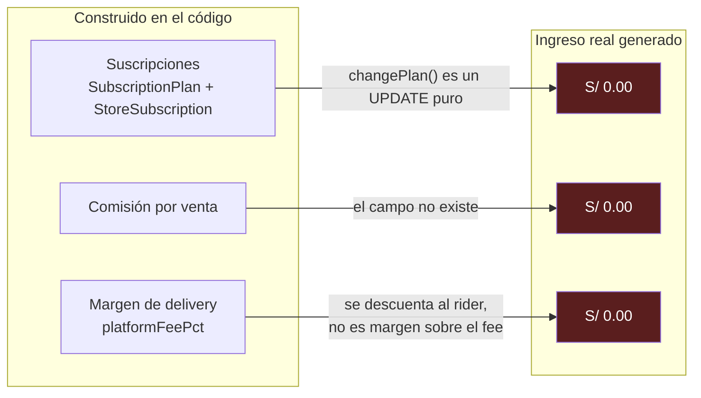

### 2.1 Detalle por motor

| Motor | Qué existe | Qué falta |
|-------|-----------|-----------|
| **Suscripciones** | `SubscriptionPlan` con `price`, `annualPrice`, `billingCycle`, `maxProducts`, `maxOrdersPerMonth`, `maxStaff`, `features` | Todo el cobro: job de facturación, integración con pasarela, prorrateo, reintentos (*dunning*), degradación por impago |
| **Comisión por venta** | Nada | Campo `commissionPct` en el plan, campos `platformCommission` y `storeNet` en `Order`, cálculo, y liquidación al vendedor |
| **Margen de delivery** | `platformFeePct` sobre la tarifa calculada del repartidor | Separar contablemente el margen de plataforma del descuento al repartidor |

> [!WARNING]
> **`changePlan()` en `subscription.service.ts` es un `UPDATE` de base de datos sin cobro.**
> Cambiar a un plan superior no genera ningún cargo. El sistema de planes existe hoy únicamente como metadatos.

> [!WARNING]
> **`SubscriptionPlan` no tiene campo `commissionPct`.**
> El modelo de negocio asume comisión diferenciada por plan (ej. plan Pro = 5%), pero el schema no puede representarlo. Es un campo a agregar antes de cualquier implementación de comisiones.

> [!WARNING]
> **`Order` no registra el reparto del dinero.**
> Tiene `subtotal`, `igv`, `deliveryFee` y `total`, pero ningún campo que indique cuánto corresponde a la plataforma y cuánto al vendedor. Sin eso no hay liquidación auditable.

---

## 3. Palancas de monetización disponibles

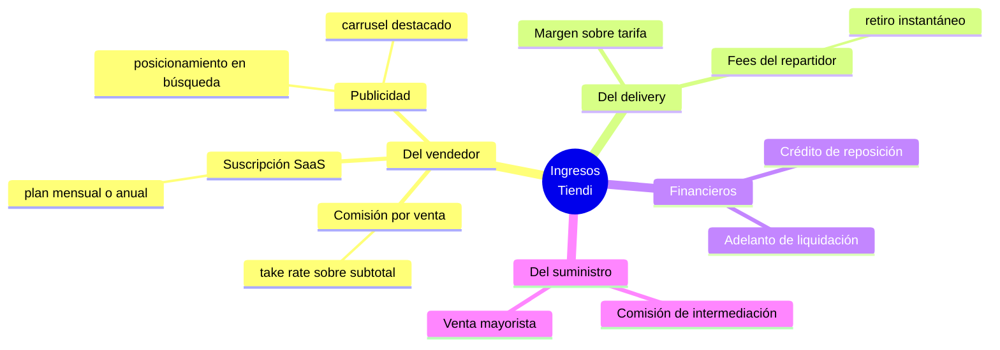

### 3.1 Evaluación por palanca

| # | Palanca | Esfuerzo | Ingreso | Riesgo | Prioridad |
|---|---------|----------|---------|--------|-----------|
| 1 | **Comisión por venta** | Alto | Alto | Bajo | Alta |
| 2 | **Suscripción SaaS** | Medio | Medio | Bajo | Media |
| 3 | **Margen de delivery** | Bajo | Bajo | Bajo | Alta |
| 4 | **Publicidad / posicionamiento** | Bajo | Medio | Bajo | Media |
| 5 | **Fees del repartidor** | Bajo | Bajo | Bajo | Baja |
| 6 | **Servicios financieros** | Muy alto | Muy alto | Muy alto | Tardía |
| 7 | **Venta mayorista** | Muy alto | Muy alto | Alto | Ver §7 |

> [!TIP]
> **Comisión antes que suscripción.** La comisión escala con el éxito del vendedor y no exige pago por adelantado a quien todavía no vendió nada. Una tienda nueva que debe pagar una cuota fija antes de su primera venta simplemente no se registra; una que entrega un porcentaje de lo que vende, sí.
>
> La suscripción funciona mejor como **upgrade**: menos comisión a cambio de una cuota fija. Ese es el mecanismo que convierte tiendas de alto volumen en suscriptores.

> [!CAUTION]
> Ninguna de estas palancas es viable sin el ledger de doble entrada y el ciclo de liquidación descritos en [[FLUJO_DINERO]].
> Cobrar comisión sin poder demostrarle al vendedor **"esto es tuyo, esto es mío, aquí está el detalle"** es prometer dinero que no se puede auditar.

---

## 4. El problema estructural del margen

Este es el hallazgo más importante del documento.

### 4.1 La descomposición

Tomando el pedido de ejemplo de [[FLUJO_DINERO]]: **S/ 118.00 total**.

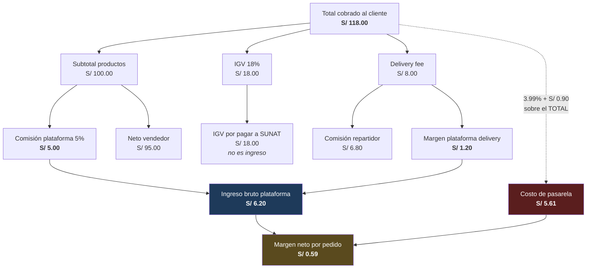

### 4.2 La cuenta

```
INGRESO
  Comisión de plataforma   100.00 × 5%          =  S/ 5.00
  Margen de delivery         8.00 − 6.80        =  S/ 1.20
                                                   ─────────
  Ingreso bruto                                    S/ 6.20

COSTO
  Pasarela (variable)      118.00 × 3.99%       =  S/ 4.71
  Pasarela (fijo)                               =  S/ 0.90
                                                   ─────────
  Costo de pasarela                                S/ 5.61

MARGEN NETO POR PEDIDO                             S/ 0.59
```

> [!CAUTION]
> **Con un take rate del 5% y pago con tarjeta, el margen neto es de 59 céntimos por pedido — menos del 0.5% del ticket.**
>
> La causa es estructural: **la pasarela cobra sobre el `total`** (IGV y delivery incluidos) **mientras que la comisión de plataforma se cobra sobre el `subtotal`**. Es decir, se paga comisión de pasarela por recaudar el IGV de SUNAT y por cobrar un delivery que en su mayor parte va al repartidor.

### 4.3 Sensibilidad del take rate

Manteniendo el resto de variables constantes, sobre un pedido con subtotal de S/ 100 pagado con tarjeta:

| Take rate | Ingreso bruto | Costo pasarela | Margen neto |
|-----------|---------------|----------------|-------------|
| 4.41% | S/ 5.61 | S/ 5.61 | **S/ 0.00** (punto de equilibrio) |
| 5% | S/ 6.20 | S/ 5.61 | S/ 0.59 |
| 8% | S/ 9.20 | S/ 5.61 | S/ 3.59 |
| 10% | S/ 11.20 | S/ 5.61 | S/ 5.59 |
| 12% | S/ 13.20 | S/ 5.61 | S/ 7.59 |
| 15% | S/ 16.20 | S/ 5.61 | S/ 10.59 |

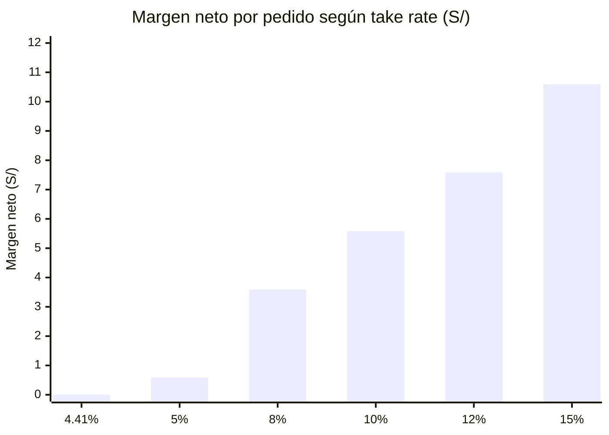

### 4.4 El efecto del método de pago

El pago contra entrega (COD) **no paga pasarela**, lo que cambia la ecuación por completo:

| Método | Ingreso bruto | Costo pasarela | Margen neto | Riesgo adicional |
|--------|---------------|----------------|-------------|------------------|
| Tarjeta (Culqi) | S/ 6.20 | S/ 5.61 | **S/ 0.59** | Contracargos |
| Contra entrega (COD) | S/ 6.20 | S/ 0.00 | **S/ 6.20** | Custodia de efectivo, faltantes |

> [!IMPORTANT]
> **A igualdad de take rate, un pedido COD deja diez veces más margen que uno con tarjeta.**
> Esto debe influir en el diseño del producto: incentivos al COD, o traslado explícito del costo de pasarela al cliente cuando paga con tarjeta.

### 4.5 Salidas posibles

1. **Subir el take rate** a un rango de 8–12%.
2. **Trasladar el costo de pasarela al cliente** como un cargo explícito por procesamiento.
3. **Impulsar el COD** con incentivos, asumiendo el riesgo de custodia de efectivo (ver [[FLUJO_DINERO]] §8 y §12).
4. **Negociar la tarifa con la pasarela** por volumen comprometido.

Lo más probable es que se requieran las cuatro simultáneamente.

> [!NOTE]
> **Las tarifas exactas de Culqi deben verificarse antes de decidir.** Se negocian por volumen y varían según el tipo de tarjeta y el acuerdo comercial. Los valores usados aquí (3.99% + S/ 0.90) son una referencia de tarifa pública y deben confirmarse.

---

## 5. Costos de operación en producción

### 5.1 Inventario de servicios

Servicios que el código ya invoca, detectados en `tiendi-api/src`:

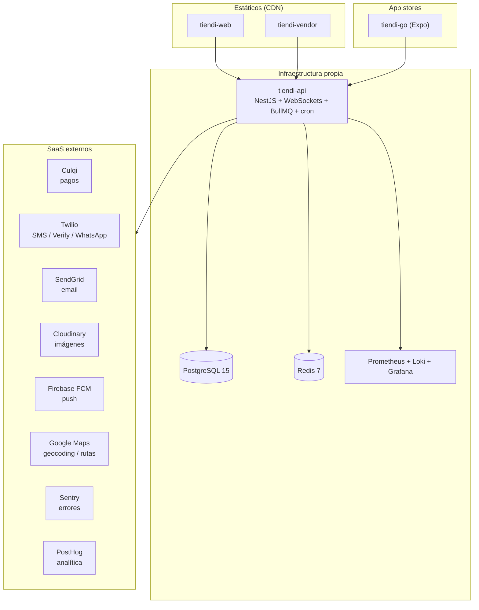

### 5.2 Escenario A — Lanzamiento

Volumen objetivo: **menos de ~100 pedidos/día**. Todo el `docker-compose` en un solo VPS.

| Concepto | USD/mes | Nota |
|----------|---------|------|
| VPS 4 vCPU / 8 GB / 160 GB | 20 | Aloja API, PostgreSQL, Redis y stack de observabilidad |
| Backups gestionados | 5 | No negociable si hay dinero en juego |
| Dominio + SSL | 1.5 | SSL gratuito vía Let's Encrypt |
| Apple Developer Program | 8.25 | USD 99/año |
| Google Play Console | ~0 | USD 25 pago único |
| Angular web + vendor (CDN estático) | 0 | Free tier suficiente |
| Cloudinary / Sentry / PostHog / FCM | 0 | Free tiers |
| Número Twilio + ~500 OTP/SMS | ~35 | Principal costo variable temprano |
| Google Maps | 0–30 | Depende del free tier por SKU |
| Email transaccional | 0–20 | Ver nota sobre free tiers |
| **Total** | **~90–120** | **≈ S/ 340–450 / mes** |

> [!TIP]
> A este volumen, la infraestructura es prácticamente gratis. **Un solo VPS soporta la carga inicial sin dificultad.** No hay razón para desplegar Kubernetes en esta etapa.

### 5.3 Escenario B — Escala

Volumen objetivo: **~1.000 pedidos/día (≈30.000/mes)**.

| Concepto | USD/mes |
|----------|---------|
| 2 instancias de API + balanceador | 60–150 |
| PostgreSQL gestionado | 60–120 |
| Redis gestionado | 15–40 |
| Storage + CDN de imágenes | 20–99 |
| Observabilidad + Sentry Team | 26–50 |
| Licencias de app stores | 8 |
| **Subtotal fijo** | **~190–470** |

> [!CAUTION]
> **A partir de este punto, PostgreSQL no debe auto-hospedarse.** Cuando la base de datos contiene el ledger de dinero, el costo de una restauración fallida supera con creces el ahorro mensual de un servicio gestionado.

### 5.4 Comparación de escenarios

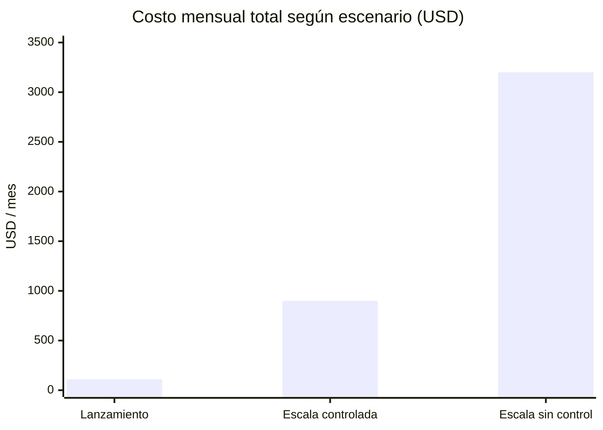

> [!IMPORTANT]
> La diferencia entre "escala controlada" y "escala sin control" **no está en el hosting**. Está en tres costos variables que dependen de decisiones de arquitectura, no de proveedor. Ver §6.

> [!NOTE]
> **Divergencia con [[COSTOS_ESTIMADOS]].** Ese documento estima costos sobre Azure con AKS y arquitectura enterprise multi-cluster. Las cifras de este documento asumen VPS y servicios gestionados económicos, apropiados para pre-lanzamiento y escala temprana. Ambos son válidos en su contexto; el de Azure aplica a una etapa que Tiendi todavía no alcanzó.

---

## 6. Los tres costos variables críticos

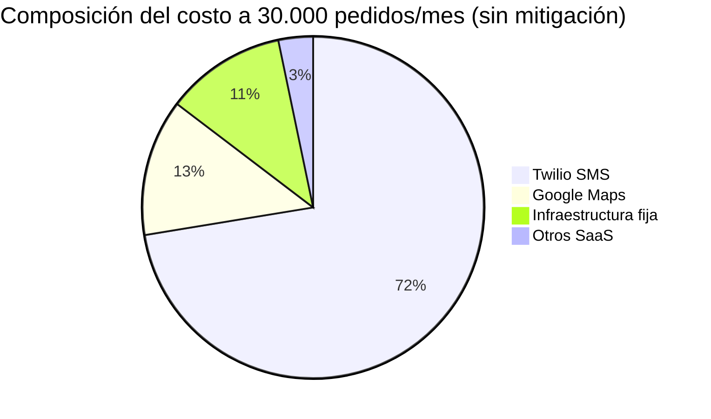

### 6.1 Twilio — el mayor riesgo

A 30.000 pedidos/mes, enviando **un SMS por pedido** a ~USD 0.07:

```
30.000 × 0.07 = USD 2.100 / mes
```

Eso es **más de seis veces** toda la infraestructura fija.

> [!TIP]
> **Mitigación disponible sin trabajo adicional.** El sistema ya integra Firebase Cloud Messaging y `expo-notifications`, y el OTP de entrega ya se envía al chat del cliente además del SMS.
>
> **Push es gratuito. SMS es caro.** Reservando el SMS únicamente como *fallback* cuando el push falla, este costo baja de ~USD 2.100 a menos de USD 200.

Jerarquía de canales por costo, de menor a mayor:

| Canal | Costo aproximado | Uso recomendado |
|-------|------------------|-----------------|
| Push (FCM / Expo) | Gratuito | Canal primario |
| Chat in-app | Gratuito | Canal primario, ya implementado |
| Email | ~USD 0.0007 | Comprobantes, resúmenes |
| WhatsApp Business | ~USD 0.03–0.05 | Secundario |
| SMS | ~USD 0.05–0.09 | Solo fallback y OTP crítico |

### 6.2 Google Maps

A 30.000 pedidos/mes, entre geocoding y cálculo de rutas se generan 60.000–90.000 llamadas ≈ **USD 300–450/mes**.

> [!TIP]
> **Mitigaciones:**
> 1. **Cachear geocoding por dirección.** Una dirección se geocodifica una vez en su vida, no en cada pedido. Persistir `lat`/`lng` en la dirección del cliente elimina la mayoría de las llamadas.
> 2. **Evaluar OSRM auto-hospedado** para cálculo de rutas y distancias, dejando Google solo para autocompletado de direcciones.

> [!NOTE]
> Google Maps Platform modificó su esquema de precios en 2025, reemplazando el crédito mensual universal por cuotas gratuitas diferenciadas por SKU. **Verificar las cuotas vigentes antes de dimensionar este costo.**

### 6.3 Culqi

No es un costo de infraestructura sino una reducción directa del margen. Analizado en §4.

### 6.4 Conclusión

> [!IMPORTANT]
> **Arrancar cuesta ~USD 100/mes. Escalar cuesta lo que se permita que cueste.**
> Aproximadamente el 80% del gasto a escala proviene de decisiones de arquitectura —canal de notificación, caché de geocoding, método de pago— y no de la elección del proveedor de hosting.

---

## 7. Modelo mayorista: la tesis

**Hipótesis:** entregar el software gratuitamente para maximizar la adopción, y monetizar convirtiéndose en el proveedor mayorista de las tiendas de la plataforma, usando los datos de venta para saber exactamente qué abastecer.

### 7.1 Por qué la tesis es sólida

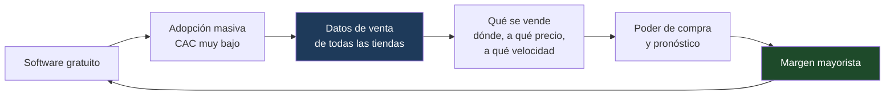

| Argumento | Detalle |
|-----------|---------|
| **El margen es de otra categoría** | Un take rate del 5% deja S/ 0.59 neto por pedido. El margen mayorista sobre los mismos productos es varias veces superior, y **no paga pasarela** porque es una transacción distinta. |
| **El software pasa de costo a canal** | USD 100/mes de infraestructura para captar distribuidores cautivos es un costo de adquisición extraordinariamente bajo. |
| **La ventaja informativa es real** | La plataforma observa cada transacción de cada tienda con velocidad, precio, zona y estacionalidad. Ningún mayorista tradicional tiene ese nivel de visibilidad. |
| **Existe precedente** | Es esencialmente la jugada de Amazon con marca propia, de Alibaba/1688, y de los marketplaces con abastecimiento integrado. |
| **Ya existe la última milla** | La red de repartidores de `tiendi-go` es un activo real para reposición B2B, aunque requiere vehículos distintos para volumen mayorista. |

### 7.2 Por qué la categoría define todo

El margen bruto de distribución varía drásticamente según el rubro. Sobre un pedido minorista de S/ 100 (costo de mercadería ≈ S/ 65):

| Modelo | Margen bruto | Intensidad de capital | Margen neto típico |
|--------|--------------|----------------------|--------------------|
| Take rate SaaS 5% (tarjeta) | S/ 5.00 | Nula | **S/ 0.59** |
| Mayorista consumo masivo (10%) | S/ 6.50 | Muy alta | ~1–3% del bruto |
| Mayorista nicho / especialidad (35%) | S/ 22.75 | Alta | ~8–15% del bruto |

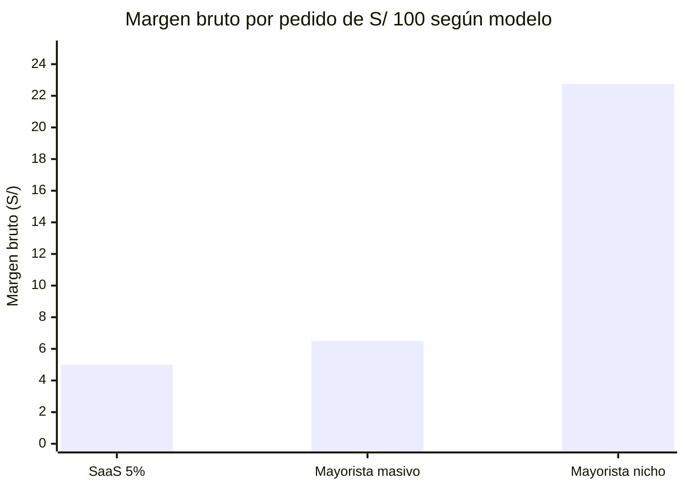

> [!CAUTION]
> **Este es el hallazgo decisivo del análisis del modelo mayorista.**
>
> La distribución de **consumo masivo** (abarrotes, bebidas, limpieza) genera un margen bruto apenas superior al take rate SaaS, pero exige capital de trabajo, depósito, logística y gestión de crédito. En términos de rentabilidad ajustada por esfuerzo y riesgo, **es un peor negocio que el SaaS**.
>
> La distribución de **nicho** (belleza, moda, alimentos especializados, suplementos) genera un margen bruto ~4 veces superior y justifica plenamente la complejidad operativa.
>
> **La selección de categoría no es un detalle de ejecución: es la decisión que determina si el negocio existe.**

---

## 8. Modelo mayorista: brecha técnica bloqueante

> ✅ **RESUELTO — ACCIÓN A1** · `MasterProduct` + `masterProductId` en `Product` y `OrderItem`, resolución de identidad por GTIN, captura de GTIN en el alta de producto y agregación de demanda por SKU/zona/período ya implementados
> ➤ Detalle de implementación: **[[CATALOGO_MAESTRO]]** (Fases 0-7 completas)

> [!CAUTION]
> **La ventaja de datos que sostiene todo el modelo mayorista NO EXISTE todavía en el sistema.**
>
> Esta no es una mejora futura ni un refinamiento: es el **primer ladrillo** del negocio mayorista.
> Mientras no exista, se estaría construyendo un mayorista con exactamente la misma información que cualquier otro mayorista del mercado — es decir, **sin ninguna ventaja**.

### 8.1 El problema

El modelo `Product` vincula cada producto a **una sola tienda**:

```prisma
model Product {
  id         String  @id @default(uuid())
  storeId    String              // ← el producto pertenece a UNA tienda
  categoryId String?
  name       String
  brand      String?             // ← opcional, texto libre
  sku        String?             // ← opcional, texto libre, sin validación
  unit       String?
  price      Decimal @db.Decimal(10, 2)
  stock      Int     @default(0)
}
```

No existen los modelos `Supplier`, `PurchaseOrder`, `InventoryLot` ni un catálogo maestro.

**Consecuencia práctica:** si tres tiendas venden el mismo producto, para la base de datos son **tres productos distintos y sin relación alguna** — nombres escritos de forma diferente, SKU inventado por cada vendedor, marca opcional.

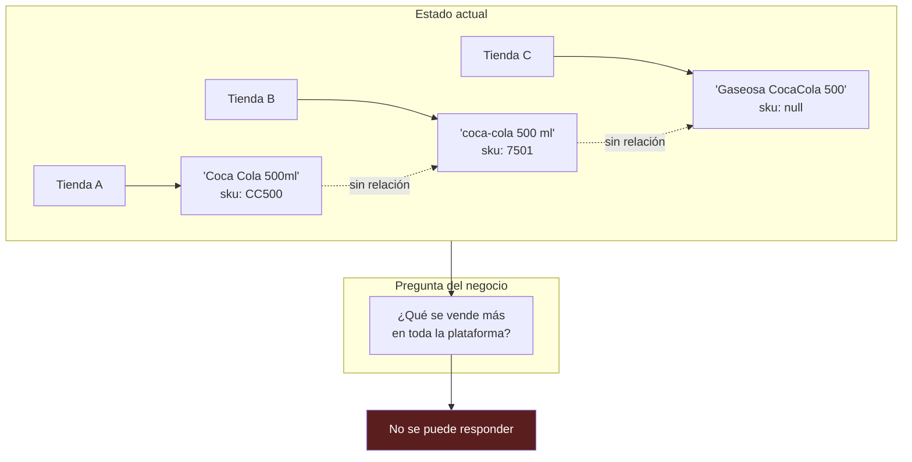

> [!WARNING]
> La pregunta que da origen al negocio mayorista —**"¿qué se está vendiendo más en la plataforma?"**— hoy el sistema **no la puede responder**.
> Puede informar qué vende cada tienda por separado, pero no puede agregar demanda entre tiendas.
> **Sin agregación no hay poder de compra, no hay pronóstico, y no hay ventaja informativa.**

### 8.2 El modelo de datos requerido

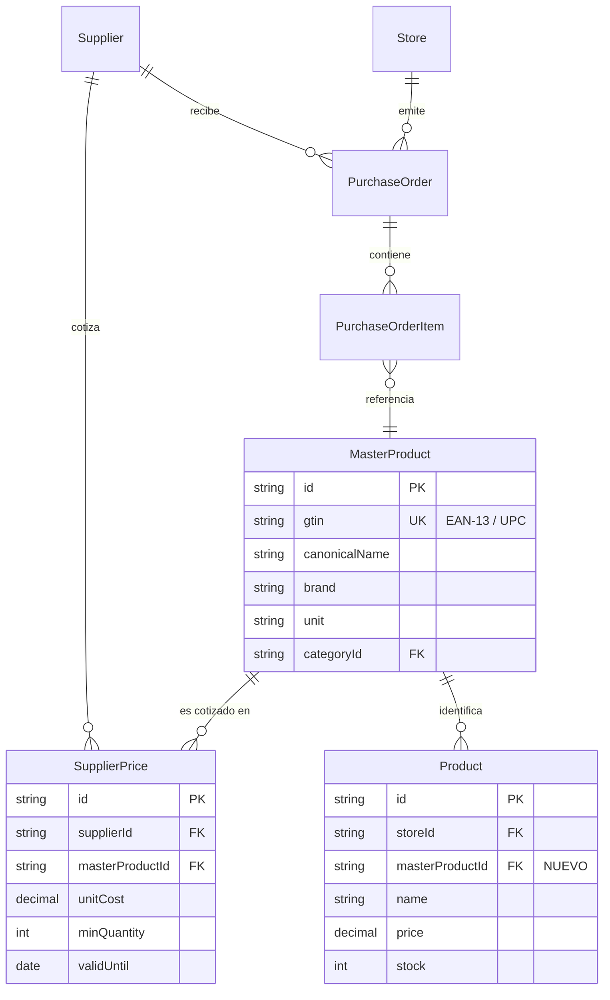

### 8.3 Trabajo requerido

| Paso | Descripción | Bloqueante para |
|------|-------------|-----------------|
| 1 | Crear `MasterProduct` con GTIN/EAN como clave natural | Toda agregación de demanda |
| 2 | Agregar `masterProductId` a `Product` | Mapeo tienda ↔ catálogo |
| 3 | Resolución de identidad (matching por GTIN, y difuso por nombre+marca+unidad) | Datos históricos |
| 4 | Captura de GTIN en el alta de producto del vendedor | Calidad del dato desde el origen |
| 5 | Vistas de demanda agregada por SKU, zona y período | Decisión de compra |

> [!IMPORTANT]
> **Este es el primer ladrillo del negocio mayorista, no un refinamiento posterior.**
> Sin catálogo maestro, se estaría construyendo un mayorista con exactamente la misma información que cualquier otro mayorista — es decir, sin ninguna ventaja.

> [!TIP]
> **Ventaja de estar en pre-lanzamiento:** no hay datos históricos que migrar. Capturar el GTIN desde el primer producto cargado elimina por completo la necesidad del paso 3, que es el más costoso y el de menor precisión.

---

## 9. Modelo mayorista: riesgos estructurales

> [!CAUTION]
> **Adoptar el modelo mayorista no es cambiar de modelo de negocio: es cambiar de empresa.**
>
> El software tiene costo marginal cercano a cero, sin inventario, sin depósito, sin vencimientos y sin capital inmovilizado. La distribución tiene exactamente las cinco características opuestas. Son compañías distintas, con competencias distintas.

### 9.1 Capital de trabajo

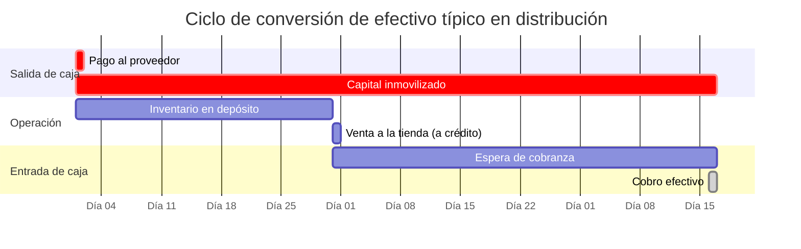

> [!CAUTION]
> **El capital de trabajo es la causa más frecuente de muerte de distribuidores.**
> Se compra inventario por adelantado, se vende a crédito y se cobra a 30–60 días. Un distribuidor en crecimiento acelerado puede ser **rentable en el estado de resultados y quedarse sin caja al mismo tiempo**.
>
> En software este riesgo no existe. En distribución, define la supervivencia.

### 9.2 Riesgo crediticio

Las tiendas pequeñas solicitan plazo de pago de manera prácticamente universal, y una fracción no paga.

> [!TIP]
> **Aquí la plataforma tiene una ventaja poco común.** Con el historial transaccional de cada tienda —volumen, estacionalidad, tasa de cancelación, ticket promedio, tendencia— es posible evaluar riesgo crediticio con mejor información que la de un banco.
>
> Esto constituye un segundo foso defensivo, y potencialmente **el negocio más rentable de los tres** (ver §3, palanca 6).

### 9.3 Escala de compra

El margen mayorista proviene del volumen de compra. En la etapa inicial no hay volumen, por lo que el costo de adquisición es alto y resulta difícil competir con el mayorista que la tienda ya utiliza.

**Se requiere una cuña de entrada:**

| Cuña | Descripción | Costo |
|------|-------------|-------|
| Precio gancho | 10–20 SKU de alta rotación a margen mínimo o nulo | Margen sacrificado |
| Plazo de pago | Condiciones de crédito mejores que el mayorista actual | Capital de trabajo |
| Conveniencia | Reposición integrada al mismo sistema donde ya opera | Desarrollo |
| Fraccionamiento | Vender cantidades menores al mínimo del mayorista tradicional | Costo logístico |

### 9.4 Conflicto de interés con los usuarios

> [!CAUTION]
> **Usar los datos de venta de las tiendas para decidir qué venderle a sus competidores destruye la confianza cuando se hace evidente.**
> Amazon enfrentó escrutinio regulatorio por exactamente esta práctica.
>
> **Mitigación obligatoria:** términos de servicio explícitos, y uso **agregado y anonimizado** de los datos —nunca a nivel de tienda individual—. Esta decisión debe tomarse antes de captar la primera tienda, no después.

> [!NOTE]
> **Decidido (2026-08-25, cierra D5):** los datos de venta **pueden usarse en agregados de plataforma con k-anonimato k ≥ 3** (ningún dato visible proviene de menos de 3 tiendas distintas) y **nunca de forma individualizada ni para beneficiar a una tienda concreta sobre otra**. Esta política ya está materializada en código: `DemandService.getPlatformDemand()` exige `HAVING COUNT(DISTINCT storeId) >= minStores` (default 3) y el término de servicios debe reflejarla antes de captar tiendas.

##### Pendiente operativo — reflejar la política en los Términos y Condiciones

🔲 **Antes de captar la primera tienda**, incorporar al ToS del vendedor:

1. **Cláusula de "Uso de datos de venta"**: la plataforma puede usar datos transaccionales para agregados estadísticos de plataforma; siempre con k-anonimato ≥ 3; nunca individualizados ni para beneficiar a una tienda sobre otra. Borrador técnico a redactar y pasar por revisión legal.
2. **Aceptación registrada**: checkbox obligatorio en el onboarding de `tiendi-vendor` + campo `termsVersion`/`termsAcceptedAt` en `Store` o `User` (migración + endpoint que registre versión y fecha, para poder probar qué versión aceptó cada tienda).

---

## 10. La trampa de selección de clientes

La intuición inicial —"abastecer a las tiendas que más venden"— contiene un problema de selección adversa.

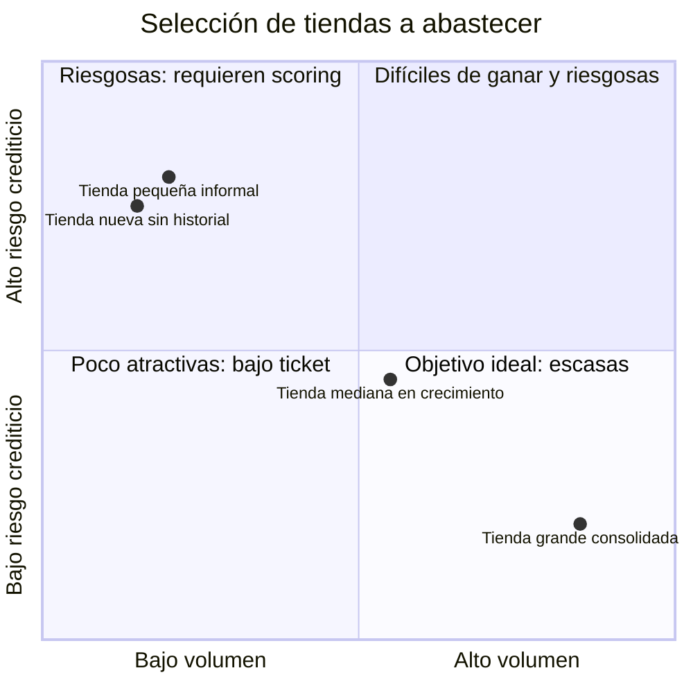

| Segmento | Atractivo | Problema |
|----------|-----------|----------|
| **Tiendas de alto volumen** | Ticket grande, logística eficiente | Ya tienen las mejores condiciones con su proveedor actual y el mayor poder de negociación. Son las más caras de captar y las de menor margen. |
| **Tiendas pequeñas** | Necesitan mejores condiciones, margen más alto | Son las de mayor riesgo crediticio y menor ticket. |

> [!IMPORTANT]
> **Este dilema debe diseñarse deliberadamente, no descubrirse con capital ya comprometido.**
>
> El segmento con mejor relación riesgo/retorno suele ser el **intermedio en crecimiento**: volumen suficiente para ser rentable, historial suficiente para evaluar riesgo, y sin el poder de negociación de las grandes.
>
> La plataforma tiene una ventaja específica para identificar ese segmento: **observa el crecimiento antes que el propio mayorista actual de la tienda.**

---

## 11. Estrategia recomendada por fases

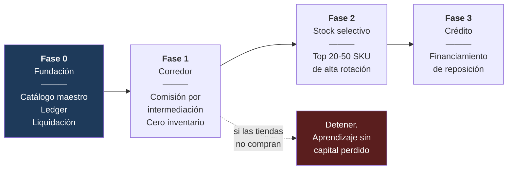

### Fase 0 — Fundación (bloqueante)

| Tarea | Motivo |
|-------|--------|
| Catálogo maestro `MasterProduct` + captura de GTIN | Sin esto no hay ventaja informativa (§8) |
| Ledger de doble entrada | Sin esto no hay liquidación auditable ([[FLUJO_DINERO]]) |
| Campos `commissionPct`, `platformCommission`, `storeNet` | Sin esto no hay comisión (§2) |
| Push como canal primario, SMS como fallback | Evita el costo variable dominante (§6.1) |
| Caché de geocoding | Evita el segundo costo variable (§6.2) |

### Fase 1 — Corredor, no stockista

Conectar tiendas con mayoristas existentes y cobrar una comisión por transacción.

> [!TIP]
> **Cero inventario, cero capital, cero riesgo.** Y valida la única pregunta que realmente importa: **¿las tiendas van a comprar a través de la plataforma?**
> Si la respuesta es negativa, se descubre sin haber comprometido capital.

### Fase 2 — Stock propio selectivo

Inventario propio **exclusivamente** en los 20–50 SKU donde los datos ya demostraron demanda repetida y alta rotación. Es el punto donde el riesgo de inventario es mínimo y la ventaja informativa es máxima.

### Fase 3 — Crédito de reposición

El margen más alto, sin inventario, y aprovecha el dato que solo la plataforma posee (§9.2).

### 11.1 Sobre la gratuidad del software

> [!CAUTION]
> **No anunciar "gratis para siempre".** Es una promesa que no se puede retirar sin costo reputacional.
>
> Alternativa recomendada: un plan gratuito **generoso** —suficiente para ganar adopción— manteniendo la estructura de planes y comisiones implementada aunque configurada en cero. Si el modelo mayorista tarda más de lo previsto en generar ingresos, la palanca de monetización sigue disponible.
>
> **La infraestructura cuesta ~USD 100/mes desde el día uno.** Si el negocio mayorista demora 18 meses en madurar, ese es el período de consumo de caja sin ingresos que debe estar financiado.

---

## 12. Decisiones pendientes

### 12.1 Acciones urgentes

> [!NOTE]
> **A1 ya no es trabajo pendiente: está implementado.**
> Fue lo único de esta lista que no admitía discusión previa — sin catálogo maestro el modelo mayorista carecía de fundamento técnico. Ver [[CATALOGO_MAESTRO]] Fases 0-7.

| # | Acción | Por qué era urgente | Estado |
|---|--------|--------------------|--------|
| **A1** | **Catálogo maestro: `MasterProduct` + GTIN/EAN + `masterProductId` en `Product`** (§8 · plan: [[CATALOGO_MAESTRO]]) | Sin esto la plataforma no podía responder *"¿qué se vende más?"*. Es la base de la agregación de demanda, del poder de compra y de toda la ventaja informativa del modelo mayorista (§7, §8, §11). Se hizo pre-lanzamiento para evitar la migración del histórico. | ✅ **RESUELTO** |

### 12.2 Decisiones abiertas

| # | Decisión | Impacto | Estado |
|---|----------|---------|--------|
| D1 | **Categoría objetivo de las tiendas** (consumo masivo vs. nicho) | Determina la viabilidad del modelo mayorista (§7.2) | **Abierta — bloqueante** |
| D2 | Take rate objetivo | Determina el margen por pedido (§4.3) | Abierta |
| D3 | ¿Se traslada el costo de pasarela al cliente? | Margen y conversión | Abierta |
| D4 | ¿Se incentiva COD sobre tarjeta? | Margen vs. riesgo de efectivo (§4.4) | Abierta |
| D5 | Política de uso de datos de venta de las tiendas | Confianza y riesgo legal (§9.4) | ✅ **RESUELTO (2026-08-25)** — agregados con k ≥ 3, nunca individualizados |
| D6 | Segmento de tiendas objetivo | Riesgo crediticio y margen (§10) | Abierta |
| D7 | ¿Plan gratuito permanente o generoso reversible? | Reversibilidad de la monetización (§11.1) | Abierta |

> [!IMPORTANT]
> **D1 es bloqueante.** Con margen de consumo masivo (~10% bruto), el modelo mayorista rinde apenas más que el take rate SaaS y exige infinitamente más capital y operación. Con margen de nicho (~35%), justifica plenamente la complejidad.
>
> Ninguna inversión significativa en el modelo mayorista debería comprometerse antes de responder D1.
>
> **A1, en cambio, no depende de D1.** El catálogo maestro es necesario en cualquier escenario —consumo masivo o nicho— y es más barato ahora que en cualquier momento futuro. Debe atenderse de inmediato, en paralelo a la discusión de D1.

---

## 13. Glosario

| Término | Definición |
|---------|------------|
| **Take rate** | Porcentaje del valor de la venta que retiene la plataforma como comisión |
| **GMV** | *Gross Merchandise Value*. Valor total transaccionado en la plataforma |
| **COD** | *Cash On Delivery*. Pago contra entrega en efectivo |
| **CAC** | *Customer Acquisition Cost*. Costo de adquirir un cliente |
| **CCC** | *Cash Conversion Cycle*. Días entre pagar al proveedor y cobrar al cliente |
| **GTIN / EAN** | Identificador global de producto comercial. Clave natural para catálogo maestro |
| **SKU** | *Stock Keeping Unit*. Unidad individual de inventario |
| **Dunning** | Proceso de reintentos de cobro ante un pago fallido |
| **FMCG** | *Fast-Moving Consumer Goods*. Bienes de consumo masivo y alta rotación |
| **Selección adversa** | Situación donde los clientes más accesibles son sistemáticamente los menos rentables |

---

## Referencias internas

- [[FLUJO_DINERO]] — Diseño del movimiento de dinero, ledger y liquidaciones
- [[COSTOS_ESTIMADOS]] — Estimación de costos sobre Azure (etapa enterprise)
- [[ARCHITECTURE-SONNET]] — Arquitectura general del sistema
- [[COMPLIANCE_LEGAL]] — Marco legal y cumplimiento
- [[PLANIFICACION]] — Planificación general del proyecto
