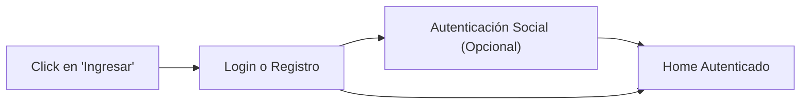
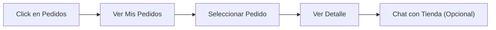
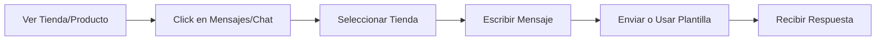
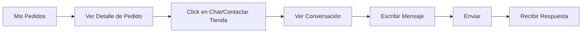
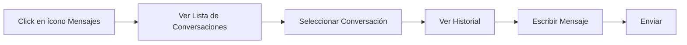

# Análisis de Módulos - Sistema Tiendi

## Descripción General
**Tiendi** es una plataforma SaaS de e-commerce que conecta tiendas locales con clientes a través de búsqueda geolocalizada y compras en línea. El sistema permite a los usuarios encontrar tiendas cercanas, navegar productos, realizar compras y gestionar pedidos.

---

## Módulos Identificados

### 1. **Landing Page / Home**
- **Funcionalidades:**
  - Búsqueda geolocalizada con campo de texto
  - Mapa interactivo con marcadores de tiendas
  - Carrusel de promociones/productos destacados
  - Suscripción a newsletter
  - Enlaces a redes sociales
  - Menú principal: "Sobre nosotros", "Como funciona", "¿Quieres vender?", "Ingresar"

- **Componentes clave:**
  - Buscador principal
  - Mapa de geolocalización (Tiendi SAC © 2021)
  - Card promocional con diferentes medios de pago

---

### 2. **Autenticación de Usuarios**

#### 2.1 Login / Inicio de Sesión
- **Campos:**
  - Correo electrónico
  - Contraseña
  - Checkbox "Mantener sesión iniciada"
- **Opciones:**
  - Inicio de sesión con Google
  - Inicio de sesión con Facebook
  - Link a registro: "¿Aún no te has registrado? Regístrate aquí"

#### 2.2 Registro de Usuario
- **Campos:**
  - Tipo de documento (DNI)
  - Número de documento
  - Nombres
  - Apellido Paterno
  - Apellido Materno
  - Correo electrónico
  - Teléfono
  - Acepto los términos y condiciones (checkbox)
- **Validaciones:**
  - Aceptación de términos y condiciones obligatoria

---

### 3. **Búsqueda y Filtros**

#### 3.1 Búsqueda de Tiendas
- **Funcionalidades:**
  - Búsqueda por texto (ej: "cerveza")
  - Visualización de resultados en lista
  - Visualización de resultados en mapa
  - Información de tienda:
    - Nombre de la tienda
    - Dirección
    - Distancia (ej: "a 1 km")
    - Estado (Abierto/Cerrado)
  - Radio de búsqueda: 5 km

#### 3.2 Filtros de Búsqueda
- **Filtros disponibles:**
  - Abierto/Cerrado
  - Más cerca
  - Medios de pago:
    - Tarjetas de crédito/débito
    - Transferencia
    - Yape
    - Plin
  - Marca
  - Presentación

---

### 4. **Detalle de Tienda**

#### 4.1 Información de la Tienda
- **Datos mostrados:**
  - Horario de atención (ej: "Atendemos 24 hrs")
  - Dirección completa (ej: "Ca. Descripción 3920 Detalles, Provincia")
  - Enlace a dirección en mapa
  - Botón "Ver WhatsApp"
  - Botón "Ver teléfono"

#### 4.2 Navegación en Tienda
- **Elementos:**
  - Logo de la tienda
  - Búsqueda dentro de la tienda
  - Categorías de productos (Ofertas del día, Tortas y postres, etc.)
  - Breadcrumb de navegación
  - Icono de carrito de compras
  - Icono de pedidos
  - Icono de favoritos
  - Icono de mensajes/chat
  - Menú de usuario

---

### 5. **Catálogo de Productos**

#### 5.1 Vista de Productos
- **Elementos del producto:**
  - Imagen del producto
  - Marca
  - Nombre/Descripción
  - Precio actual (ej: S/ 90.00)
  - Precio anterior tachado (ej: S/ 100.00)
  - Badge de descuento (ej: "-10%")
  - Icono de favorito (corazón)
  - Selector de cantidad
  - Botón "Agregar"

#### 5.2 Vista Grid con Categorías
- **Características:**
  - Sidebar con categorías y subcategorías
  - Productos en grid (4 columnas)
  - Botón de filtros
  - Ordenamiento (ej: "Con mayor descuento", "Con menor descuento")
  - Paginación
  - Total de productos encontrados

#### 5.3 Detalle de Producto
- **Componentes:**
  - Galería de imágenes con thumbnails
  - Nombre del producto
  - Marca
  - Precio con descuento
  - Selector de cantidad
  - Botón "Agregar"
  - Icono de favorito
  - Sección "Información adicional" con descripción del producto
  - Breadcrumb completo

---

### 6. **Carrito de Compras**

#### 6.1 Carrito Lateral (Sidebar)
- **Información mostrada:**
  - Título: "Tienes X productos"
  - Lista de productos con:
    - Imagen
    - Nombre/Descripción
    - Marca
    - Precio unitario
    - Selector de cantidad
    - Botón eliminar (X)
  - Subtotal
  - Botón "Ir a bolsa de compras"

#### 6.2 Pedidos Recientes (Sidebar)
- **Información:**
  - Nombre de la tienda
  - Número de pedido
  - Cantidad de productos
  - Total
  - Estados con colores:
    - 🔴 OBI-ENVIAR (rojo)
    - 🔴 RECHAZADO (rojo)
    - 🔵 CONFIRMADO (azul)
    - 🟢 ENTREGADO (verde)
  - Botón "Ver historial"

---

### 7. **Proceso de Checkout**

#### 7.1 Bolsa de Compras - Paso 1: Productos
- **Elementos:**
  - Lista de productos seleccionados
  - Cantidad editable
  - Precio por producto
  - Botón eliminar
  - Subtotal
  - Botón "Continuar"
  - Indicador de pasos (1: Productos → 2: Despacho y pago)

#### 7.2 Bolsa de Compras - Paso 2: Despacho y Pago
- **Forma de despacho:**
  - Opción 1: Recojo en tienda
    - Dirección de recojo
  - Opción 2: Despacho a domicilio

- **Medio de pago:**
  - Efectivo (seleccionado por defecto)
  - Transferencia
  - Pago con tarjeta
  - Mensaje informativo según el medio seleccionado

- **Resumen del pedido:**
  - Lista de productos (imagen, nombre, cantidad, precio)
  - Subtotal
  - Concepto (si aplica)
  - Total
  - Checkbox de términos y condiciones
  - Botón "Enviar pedido"

---

### 8. **Gestión de Pedidos**

#### 8.1 Mis Pedidos
- **Información del pedido:**
  - Nombre de la tienda
  - Número de pedido
  - Estado con color distintivo
  - Total del pedido
  - Cantidad de productos
  - Opción "Ver más pedidos"
  - Buscador de pedidos (por número)

#### 8.2 Detalle de Pedido
- **Componentes:**
  - Número de pedido
  - Botón "Repetir pedido"
  - Resumen del pedido:
    - Lista de productos con imagen, marca, nombre, cantidad y precio
    - Subtotal
    - Despacho
    - Total
  - Información de despacho:
    - Dirección de recojo o entrega
  - Forma de pago seleccionada

---

### 9. **Confirmación de Pedido**
- **Elementos:**
  - Mensaje de confirmación: "Pedido enviado"
  - Texto de confirmación (Lorem ipsum successful message)
  - Notificación toast verde con check
  - Producto marcado como "Agregado" en el catálogo

---

### 10. **Sistema de Mensajería / Chat**

#### 10.1 Lista de Conversaciones
- **Información mostrada:**
  - Avatar de la tienda
  - Nombre de la tienda
  - Número de pedido
  - Timestamp (ej: "Hoy a las 10:08 am")
  - Vista previa del último mensaje

#### 10.2 Chat Individual
- **Características:**
  - Nombre de la tienda
  - Número de pedido
  - Historial de mensajes
  - Mensajes del sistema (ej: "Mensaje de la tienda sobre el pedido realizado")
  - Mensajes del cliente
  - Mensajes de la tienda
  - Botones rápidos:
    - "Mensaje de plantilla para realizar el pedido" (botón turquesa)
    - "¿A granel?" (botón turquesa)
  - Campo de texto para escribir mensaje
  - Botón "Enviar"

---

### 11. **Favoritos**
- **Funcionalidades:**
  - Icono de corazón en cada producto
  - Toggle para agregar/quitar de favoritos
  - Contador de favoritos en el header

---

### 12. **Formulario de Vendedores**
- **Modal: "¿Quieres vender con nosotros?"**
  - Campo: "¿Cómo te llamas?"
  - Campo: "Ingresa tu correo electrónico"
  - Campo: "Ingresa tu nro. de teléfono"
  - Botón "Mandaremos tu información"

---

### 13. **Páginas Legales**

#### 13.1 Términos y Condiciones
- **Contenido:**
  - Título: "Términos y condiciones"
  - Texto Lorem ipsum (contenido legal placeholder)
  - Botón "Volver"
  - Botón "Aceptar"

---

### 14. **Suscripción a Newsletter**
- **Estados:**
  1. Botón "Suscríbete"
  2. Campo de correo electrónico + botón "Suscríbirse"
  3. Mensaje de confirmación: "✓ Gracias por suscribirte"

---

## Componentes Globales

### Header
- **Elementos:**
  - Logo Tiendi
  - Links de navegación
  - Botón "¿Quieres vender?"
  - Botón "Ingresar" / Avatar de usuario
  - Iconos:
    - Carrito de compras (con badge de cantidad)
    - Pedidos
    - Favoritos
    - Mensajes (con badge de notificaciones)

### Footer
- **Secciones:**
  - Servicio al cliente:
    - Preguntas frecuentes
    - Cambios y devoluciones
    - Términos y condiciones
    - Política de privacidad
    - Libro de reclamaciones
  - Sobre la tienda:
    - Horarios de atención
    - Todos los días 24 hrs
    - Email de contacto
    - Ver dirección
    - Ver WhatsApp
  - Medios de pago:
    - Contraentrega
    - Pago en efectivo
    - Todas las tarjetas
    - Íconos: American Express, Mastercard, PayPal, Visa
  - Banner promocional: "Compra antes de las 2:00pm y recibe tu pedido hoy mismo!"
  - Powered by Tiendi © 2021
  - Redes sociales: Facebook, Twitter, LinkedIn, YouTube, Instagram

---

## Flujos de Usuario Principales

### 1. Flujo de Compra

```mermaid
graph LR
    Home[Home] --> Busqueda[Búsqueda]
    Busqueda --> SeleccionTienda[Selección de Tienda]
    SeleccionTienda --> Catalogo[Catálogo]
    Catalogo --> AgregarCarrito[Agregar al Carrito]
    AgregarCarrito --> VerCarrito[Ver Carrito]
    VerCarrito --> Checkout[Checkout]
    Checkout --> SeleccionDespacho[Selección de Despacho]
    SeleccionDespacho --> SeleccionPago[Selección de Pago]
    SeleccionPago --> ConfirmarPedido[Confirmar Pedido]
    ConfirmarPedido --> Confirmacion[Confirmación]
```

### 2. Flujo de Registro/Login

### 3. Flujo de Seguimiento de Pedido

### 4. Flujo de Comunicación con Tienda
#### Opción A: Desde Producto/Tienda

#### Opción B: Desde Pedido Existente

#### Opción C: Desde Lista de Mensajes

---

## Notas Adicionales

- El sistema está diseñado para el mercado peruano (moneda: S/ - Soles)
- Enfoque en tiendas de conveniencia y minimarkets
- Soporte para delivery y recojo en tienda
- Énfasis en geolocalización y proximidad
- Sistema multi-tenant (cada tienda es independiente)
- Necesita panel de administración para vendedores (no visible en prototipo)

---

## Aspectos Críticos a Considerar

### 1. Arquitectura SaaS Multi-Tenant
- **Decisión clave:** ¿Cómo aislar los datos de cada tienda?
  - **Opción A:** Base de datos por tenant (mayor aislamiento, más costoso, complejo de mantener)
  - **Opción B:** Schema por tenant (balance entre aislamiento y costo)
  - **Opción C:** Registro discriminador con campo `tenant_id` (más económico, menos aislamiento)
- **Consideraciones:**
  - Escalabilidad horizontal
  - Backups y recuperación por tenant
  - Migraciones de schema
  - Performance y queries multi-tenant

### 2. Sistema de Inventario en Tiempo Real
- **Problemas críticos:**
  - Sincronización de stock entre múltiples usuarios
  - Prevención de sobreventa (race conditions)
  - Reservas temporales en carrito (¿cuánto tiempo?)
  - Liberación automática de stock reservado
- **Soluciones requeridas:**
  - Sistema de locks optimistas o pesimistas
  - Cola de procesamiento de pedidos
  - Logs de auditoría de inventario
  - Alertas de stock bajo/agotado

### 3. Geolocalización y Performance
- **Costos operativos:**
  - APIs de mapas tienen límites y costos (Google Maps, Mapbox, OpenStreetMap)
  - Búsquedas geoespaciales son intensivas computacionalmente
- **Optimizaciones necesarias:**
  - Implementar PostGIS o MongoDB con índices geoespaciales
  - Caché de búsquedas frecuentes (Redis con TTL)
  - Geocodificación de direcciones en batch
  - Clustering de marcadores en mapa

### 4. Sistema de Pagos y Compliance
- **Integraciones de pago:**
  - Pasarelas peruanas: Niubiz, Culqi, MercadoPago, Izipay
  - Manejo de webhooks para confirmación asíncrona
  - Gestión de reembolsos y contracargos
  - PCI DSS compliance (no almacenar datos de tarjetas)
- **Compliance fiscal:**
  - Facturación electrónica SUNAT
  - Boletas y facturas (CPE)
  - Notas de crédito/débito
  - Reportes fiscales

### 5. Panel de Administración para Vendedores
- **Funcionalidades críticas no diseñadas:**
  - Gestión de catálogo (CRUD productos con imágenes)
  - Gestión de inventario (entradas/salidas/ajustes)
  - Gestión de pedidos (confirmación, rechazo, estados)
  - Configuración de tienda (horarios, medios de pago, delivery)
  - Dashboard de ventas y reportes
  - Gestión de promociones y descuentos
  - Sistema de notificaciones

### 6. Seguridad y Privacidad
- **Autenticación y autorización:**
  - Implementación de RBAC (Role-Based Access Control)
  - Protección contra CSRF, XSS, SQL Injection
  - Rate limiting en APIs críticas
  - Validación de permisos por tenant
- **Privacidad de datos:**
  - Cumplimiento GDPR/Ley de Protección de Datos Personales (Perú)
  - Consentimiento explícito para datos personales
  - Derecho al olvido (eliminación de cuenta)
  - Encriptación de datos sensibles

### 7. Comunicaciones en Tiempo Real
- **Sistema de chat:**
  - WebSockets vs Server-Sent Events vs Polling
  - Persistencia de mensajes
  - Notificaciones push (web y móvil)
  - Indicadores de lectura/escritura
- **Escalabilidad:**
  - Manejo de múltiples conexiones simultáneas
  - Balance de carga para WebSockets
  - Fallback para conexiones inestables

### 8. Gestión de Imágenes y Media
- **Consideraciones:**
  - CDN para delivery rápido
  - Optimización automática (compresión, WebP, lazy loading)
  - Múltiples tamaños (thumbnail, preview, full)
  - Límites de tamaño y formato
  - Protección contra contenido inapropiado

---

## Aspectos Faltantes Importantes

### 1. Sistema de Roles y Permisos
- **Roles requeridos:**
  - **Super Admin** (Tiendi): Control total de la plataforma
  - **Admin de Tienda** (Owner): Gestión completa de su tienda
  - **Empleado de Tienda**: Permisos limitados (gestión de pedidos, inventario)
  - **Cliente**: Compras y gestión de perfil
- **Permisos granulares:**
  - Ver/editar productos
  - Gestionar inventario
  - Ver/confirmar pedidos
  - Acceso a reportes financieros
  - Configuración de tienda

### 2. Modelo de Monetización y Comisiones
- **Estrategias posibles:**
  - Comisión por transacción (ej: 5-15% del valor de venta)
  - Suscripción mensual por tienda (planes: Básico, Pro, Enterprise)
  - Modelo híbrido (suscripción + comisión reducida)
  - Cargos por servicios premium (destacados, publicidad)
- **Sistema requerido:**
  - Cálculo automático de comisiones
  - Dashboard financiero para vendedores
  - Sistema de pagos/retiros para vendedores
  - Facturación automática de comisiones

### 3. Sistema de Valoraciones y Reseñas
- **Para productos:**
  - Calificación de 1-5 estrellas
  - Comentarios de clientes
  - Verificación de compra
  - Moderación de contenido
- **Para tiendas:**
  - Reputación global
  - Tiempo de respuesta
  - Calidad de servicio
  - Impacto en ranking de búsqueda

### 4. Moderación y Control de Calidad
- **Onboarding de vendedores:**
  - Verificación de identidad (RUC/DNI)
  - Aprobación manual de nuevas tiendas
  - Verificación de dirección física
  - Validación de documentos legales
- **Moderación de contenido:**
  - Revisión de productos nuevos
  - Detección de precios/información fraudulenta
  - Imágenes inapropiadas
  - Sistema de reportes de usuarios
- **Sanciones:**
  - Advertencias
  - Suspensión temporal
  - Cierre definitivo de tienda

### 5. Sistema de Cupones y Promociones
- **Tipos de descuentos:**
  - Código de cupón (ej: VERANO2025)
  - Descuento por primera compra
  - Descuento por monto mínimo
  - Promociones por categoría
  - Happy hour / Time-limited offers
- **Gestión:**
  - Creación por vendedor o administrador
  - Límites de uso (por usuario, total)
  - Vigencia (fecha inicio/fin)
  - Exclusiones (productos, categorías)

### 6. Sistema de Notificaciones
- **Canales:**
  - Push notifications (web y móvil)
  - Email
  - SMS (para confirmaciones críticas)
  - WhatsApp Business (opcional)
- **Eventos:**
  - Confirmación de pedido
  - Cambio de estado de pedido
  - Mensaje nuevo en chat
  - Promociones y ofertas
  - Recordatorios de carrito abandonado
- **Configuración:**
  - Preferencias de usuario (opt-in/opt-out)
  - Frecuencia de notificaciones
  - Horarios permitidos

### 7. Analytics y Reportes
- **Dashboard para Vendedores:**
  - Ventas por período (día/semana/mes)
  - Productos más vendidos
  - Ticket promedio
  - Tasa de conversión
  - Productos con bajo stock
  - Pedidos por estado
- **Dashboard para Administradores (Tiendi):**
  - GMV (Gross Merchandise Value) total
  - Comisiones generadas
  - Usuarios activos (DAU/MAU)
  - Tiendas activas
  - Métricas de búsqueda
  - Tasas de conversión globales
  - Análisis geográfico

### 8. SEO y Marketing Digital
- **SEO técnico:**
  - URLs amigables por tienda (/tienda/nombre-tienda)
  - URLs por producto (/producto/nombre-producto)
  - Meta tags dinámicos por página
  - Schema markup (Product, LocalBusiness, Review)
  - Sitemap XML dinámico
- **Marketing:**
  - Landing pages por ciudad/categoría
  - Blog de contenido
  - Integraciones con redes sociales
  - Píxeles de conversión (Facebook, Google Ads)
  - Email marketing (newsletters, carritos abandonados)

### 9. Sistema de Devoluciones y Disputas
- **Proceso de devoluciones:**
  - Solicitud por parte del cliente
  - Evaluación por vendedor
  - Políticas de devolución por tienda
  - Reembolsos automáticos o manuales
  - Estados: Solicitado, Aprobado, Rechazado, Completado
- **Disputas:**
  - Mediación entre cliente y vendedor
  - Escalamiento a soporte Tiendi
  - Sistema de evidencias (fotos, mensajes)
  - Resolución y sanciones

### 10. Gestión de Direcciones y Zonas de Cobertura
- **Direcciones de clientes:**
  - Múltiples direcciones guardadas
  - Geocodificación automática
  - Validación de cobertura por tienda
  - Dirección predeterminada
- **Zonas de delivery:**
  - Definición de áreas de cobertura por tienda
  - Costos de envío por zona
  - Tiempo estimado de entrega
  - Restricciones geográficas

### 11. Sistema de Carrito Persistente
- **Funcionalidades:**
  - Carrito persistente entre sesiones
  - Sincronización entre dispositivos
  - Notificaciones de cambio de precio
  - Alertas de productos agotados
  - Recordatorios de carrito abandonado (24h, 48h)
  - Guardado de "listas de deseos" o "comprar después"

### 12. Soporte al Cliente
- **Canales de soporte:**
  - Chat en vivo (para Tiendi admin)
  - Sistema de tickets
  - Preguntas frecuentes (FAQ)
  - Base de conocimiento
  - Video tutoriales (para vendedores)
- **Para clientes:**
  - Ayuda con pedidos
  - Problemas de pago
  - Reclamos y devoluciones
- **Para vendedores:**
  - Onboarding y capacitación
  - Soporte técnico
  - Consultas sobre comisiones

### 13. Cumplimiento Legal
- **Documentos requeridos:**
  - Términos y condiciones completos
  - Política de privacidad detallada
  - Política de cookies
  - Términos de uso para vendedores
  - Contrato de servicio (SLA)
- **Libro de reclamaciones digital:**
  - Requerido por ley peruana
  - Formulario de reclamo
  - Seguimiento de casos
  - Exportación a INDECOPI

### 14. Sistema de Referidos y Lealtad
- **Programa de referidos:**
  - Código único por usuario
  - Incentivos para referidor y referido
  - Tracking de conversiones
- **Programa de lealtad:**
  - Puntos por compra
  - Niveles de membresía
  - Beneficios exclusivos
  - Canje de puntos

### 15. Modo Offline y PWA
- **Progressive Web App:**
  - Instalable en dispositivos
  - Funcionalidad offline básica
  - Service workers
  - Caché inteligente
- **Sincronización:**
  - Cola de acciones offline
  - Sincronización al recuperar conexión
  - Indicadores de estado de conexión

---

**Fecha de análisis:** 2025-11-23
**Basado en:** 32 imágenes de prototipo del sistema Tiendi
**Última actualización:** 2025-11-24
