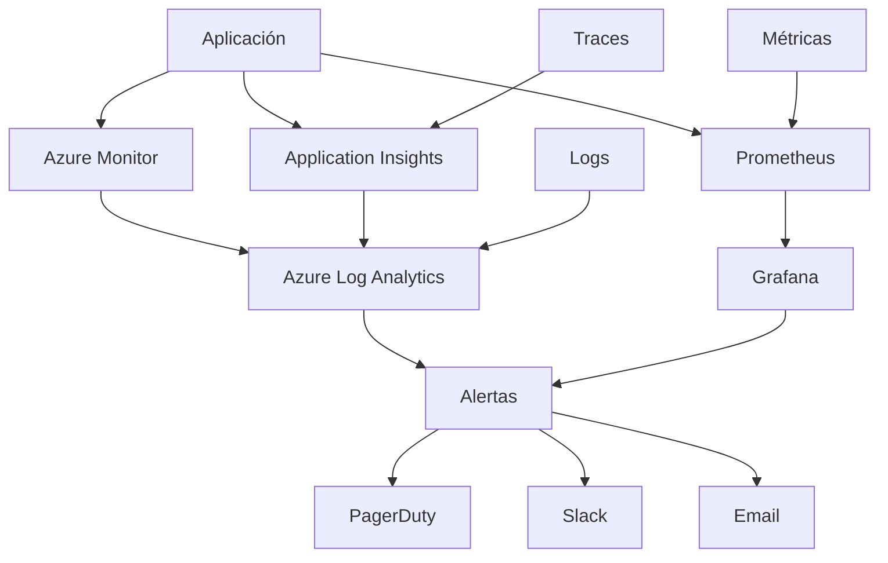
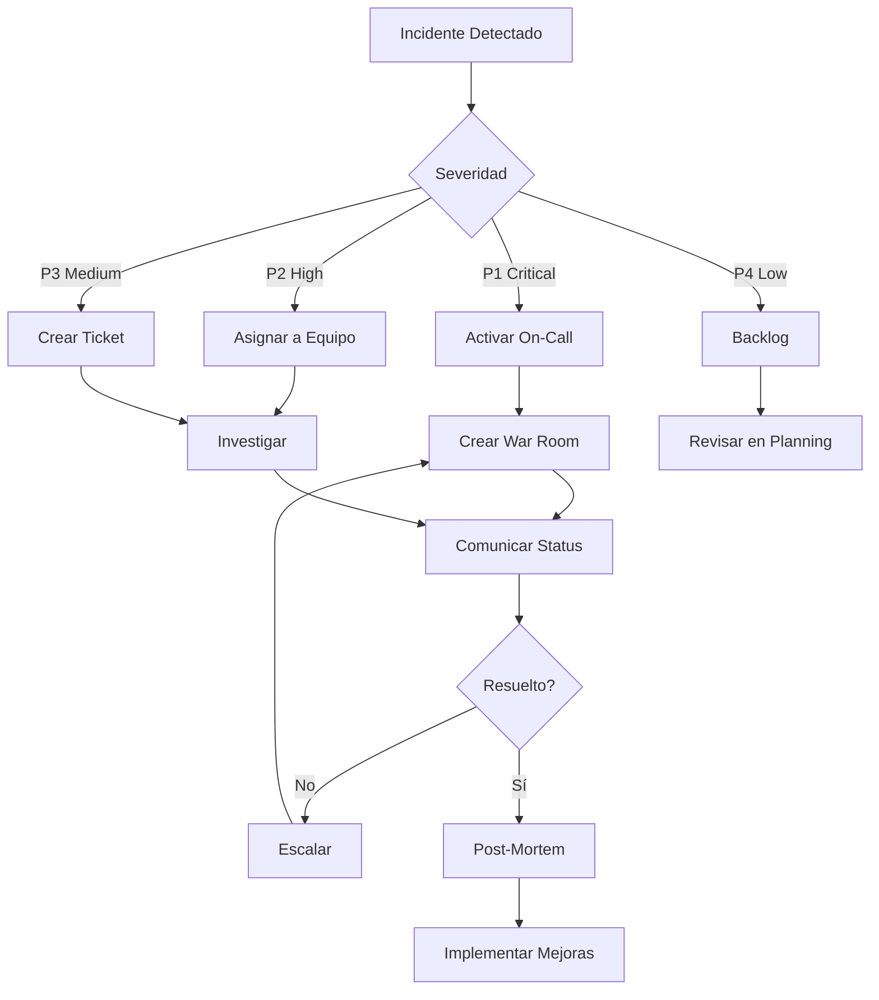

# Runbook de Monitoreo y Operaciones - Tiendi

## Tabla de Contenidos

1. [Visión General](#1-visión-general)
2. [Dashboards](#2-dashboards)
3. [Métricas Clave (SLIs)](#3-métricas-clave-slis)
4. [Objetivos de Nivel de Servicio (SLOs)](#4-objetivos-de-nivel-de-servicio-slos)
5. [Alertas](#5-alertas)
6. [Procedimientos de Incidentes](#6-procedimientos-de-incidentes)
7. [Troubleshooting](#7-troubleshooting)
8. [Mantenimiento](#8-mantenimiento)
9. [On-Call](#9-on-call)
10. [Post-Mortems](#10-post-mortems)

---

## 1. Visión General

### 1.1 Stack de Observabilidad



**Herramientas Utilizadas:**

| Herramienta | Propósito | URL |
|-------------|-----------|-----|
| **Azure Monitor** | Monitoreo de infraestructura | https://portal.azure.com |
| **Application Insights** | APM y traces | https://portal.azure.com |
| **Prometheus** | Métricas de aplicación | http://prometheus.tiendi.internal |
| **Grafana** | Visualización | https://grafana.tiendi.pe |
| **PagerDuty** | Gestión de incidentes | https://tiendi.pagerduty.com |
| **Azure Log Analytics** | Logs centralizados | https://portal.azure.com |

### 1.2 Arquitectura de Monitoreo

```typescript
interface MonitoringStack {
  // Colectores de datos
  collectors: {
    metrics: 'Prometheus + Node Exporter';
    logs: 'Fluentd + Azure Log Analytics';
    traces: 'OpenTelemetry + Application Insights';
    uptime: 'Azure Monitor';
  };

  // Almacenamiento
  storage: {
    metrics: 'Prometheus TSDB (30 días) + Azure Monitor (90 días)';
    logs: 'Azure Log Analytics (90 días)';
    traces: 'Application Insights (30 días)';
  };

  // Visualización
  visualization: {
    realtime: 'Grafana Dashboards';
    historical: 'Azure Monitor Workbooks';
  };

  // Alerting
  alerting: {
    rules_engine: 'Prometheus Alertmanager + Azure Monitor Alerts';
    notification: 'PagerDuty + Slack + Email';
  };
}
```

---

## 2. Dashboards

### 2.1 Dashboard Principal - Overview

**URL**: https://grafana.tiendi.pe/d/overview

**Métricas Incluidas:**

```yaml
# Panel 1: Health Status
- API Health: UP/DOWN
- Database Health: UP/DOWN
- Cache Health: UP/DOWN
- Message Queue Health: UP/DOWN

# Panel 2: Request Rate
- Requests per second (RPS)
- Success rate (%)
- Error rate (%)
- P50, P95, P99 latency

# Panel 3: Infrastructure
- CPU usage (%)
- Memory usage (%)
- Disk usage (%)
- Network I/O

# Panel 4: Business Metrics
- Active users
- Orders per minute
- GMV per hour
- Active stores
```

**Código de Dashboard (JSON):**

```json
{
  "dashboard": {
    "title": "Tiendi - Overview",
    "panels": [
      {
        "title": "Request Rate",
        "targets": [
          {
            "expr": "rate(http_requests_total[5m])",
            "legendFormat": "{{method}} {{endpoint}}"
          }
        ],
        "type": "graph"
      },
      {
        "title": "Error Rate",
        "targets": [
          {
            "expr": "rate(http_requests_total{status=~\"5..\"}[5m]) / rate(http_requests_total[5m])",
            "legendFormat": "Error Rate"
          }
        ],
        "alert": {
          "conditions": [
            {
              "evaluator": {
                "params": [0.01],
                "type": "gt"
              },
              "operator": {
                "type": "and"
              },
              "query": {
                "params": ["A", "5m", "now"]
              },
              "reducer": {
                "type": "avg"
              },
              "type": "query"
            }
          ],
          "name": "High Error Rate"
        }
      }
    ]
  }
}
```

### 2.2 Dashboard de Infraestructura

**URL**: https://grafana.tiendi.pe/d/infrastructure

```yaml
# Kubernetes Cluster
- Node CPU usage
- Node Memory usage
- Pod status
- Deployment replicas
- HPA metrics

# Database (PostgreSQL)
- Connection pool usage
- Query latency
- Active connections
- Replication lag
- Disk I/O

# Redis Cache
- Hit rate
- Memory usage
- Connected clients
- Commands/sec

# Azure Storage
- Blob operations/sec
- Latency
- Availability
```

### 2.3 Dashboard de Negocio

**URL**: https://grafana.tiendi.pe/d/business

```yaml
# Ventas
- GMV por hora/día/mes
- Número de pedidos
- Ticket promedio
- Tasa de conversión

# Usuarios
- Usuarios activos
- Nuevos registros
- Usuarios en checkout
- Carrito abandonado rate

# Vendedores
- Nuevos vendedores
- Vendedores activos
- Productos listados
- Órdenes por vendedor

# Performance
- Tiempo de carga de páginas
- Tasa de rebote
- Tiempo en sitio
```

### 2.4 Dashboard de Seguridad

**URL**: https://grafana.tiendi.pe/d/security

```yaml
# Autenticación
- Login attempts
- Failed logins
- Password resets
- MFA usage

# API Security
- Rate limit hits
- Blocked IPs
- Invalid tokens
- CORS violations

# Threats
- SQL injection attempts
- XSS attempts
- DDoS indicators
- Suspicious patterns
```

---

## 3. Métricas Clave (SLIs)

### 3.1 Service Level Indicators

**Disponibilidad:**

```prometheus
# Uptime del servicio
availability =
  (count(up{job="tiendi-api"} == 1) / count(up{job="tiendi-api"})) * 100

# Queries exitosas vs totales
success_rate =
  sum(rate(http_requests_total{status!~"5.."}[5m]))
  /
  sum(rate(http_requests_total[5m]))
```

**Latencia:**

```prometheus
# P50 latency (mediana)
histogram_quantile(0.50,
  rate(http_request_duration_seconds_bucket[5m]))

# P95 latency
histogram_quantile(0.95,
  rate(http_request_duration_seconds_bucket[5m]))

# P99 latency
histogram_quantile(0.99,
  rate(http_request_duration_seconds_bucket[5m]))
```

**Tasa de Error:**

```prometheus
# Error rate general
error_rate =
  sum(rate(http_requests_total{status=~"5.."}[5m]))
  /
  sum(rate(http_requests_total[5m]))

# Error rate por endpoint
error_rate_by_endpoint =
  sum(rate(http_requests_total{status=~"5.."}[5m])) by (endpoint)
  /
  sum(rate(http_requests_total[5m])) by (endpoint)
```

**Rendimiento:**

```prometheus
# Requests por segundo
requests_per_second = rate(http_requests_total[5m])

# Throughput de base de datos
db_queries_per_second = rate(db_queries_total[5m])

# Throughput de cache
cache_operations_per_second = rate(cache_operations_total[5m])
```

### 3.2 Métricas de Negocio

```typescript
// Métricas customizadas para Prometheus
import { Counter, Histogram, Gauge } from 'prom-client';

// Orders
export const ordersTotal = new Counter({
  name: 'orders_total',
  help: 'Total number of orders created',
  labelNames: ['status', 'store_id']
});

export const orderValue = new Histogram({
  name: 'order_value_pen',
  help: 'Order value in PEN',
  buckets: [10, 20, 50, 100, 200, 500, 1000]
});

// Users
export const activeUsers = new Gauge({
  name: 'active_users',
  help: 'Number of active users',
  labelNames: ['user_type']
});

export const userRegistrations = new Counter({
  name: 'user_registrations_total',
  help: 'Total user registrations',
  labelNames: ['user_type']
});

// Cart
export const cartAbandonment = new Counter({
  name: 'cart_abandonment_total',
  help: 'Number of abandoned carts',
  labelNames: ['reason']
});

// Search
export const searchQueries = new Counter({
  name: 'search_queries_total',
  help: 'Total search queries',
  labelNames: ['type']
});

export const searchLatency = new Histogram({
  name: 'search_latency_seconds',
  help: 'Search query latency',
  buckets: [0.1, 0.5, 1, 2, 5]
});
```

---

## 4. Objetivos de Nivel de Servicio (SLOs)

### 4.1 SLOs Definidos

| Servicio | SLI | SLO Target | Error Budget | Ventana |
|----------|-----|------------|--------------|---------|
| **API** | Disponibilidad | 99.9% | 43.2 min/mes | 30 días |
| **API** | Latencia P95 | < 500ms | - | 7 días |
| **API** | Error rate | < 0.1% | - | 24 horas |
| **Web** | Page Load | < 2s | - | 7 días |
| **Pagos** | Disponibilidad | 99.95% | 21.6 min/mes | 30 días |
| **Búsqueda** | Latencia P95 | < 1s | - | 7 días |
| **DB** | Query Latency | < 100ms | - | 24 horas |

### 4.2 Cálculo de Error Budget

```typescript
interface ErrorBudget {
  slo_target: number;           // 99.9%
  window_hours: number;         // 720 (30 días)
  allowed_downtime_minutes: number;
  consumed_downtime_minutes: number;
  remaining_budget_percentage: number;
}

class ErrorBudgetCalculator {
  calculate(
    sloTarget: number,
    windowHours: number,
    actualUptime: number
  ): ErrorBudget {
    const totalMinutes = windowHours * 60;
    const allowedDowntime = totalMinutes * (1 - sloTarget / 100);
    const actualDowntime = totalMinutes * (1 - actualUptime / 100);
    const remaining = ((allowedDowntime - actualDowntime) / allowedDowntime) * 100;

    return {
      slo_target: sloTarget,
      window_hours: windowHours,
      allowed_downtime_minutes: allowedDowntime,
      consumed_downtime_minutes: actualDowntime,
      remaining_budget_percentage: Math.max(0, remaining)
    };
  }

  shouldAlertOnBudget(budget: ErrorBudget): boolean {
    // Alertar si se consume más del 80% del error budget
    return budget.remaining_budget_percentage < 20;
  }
}

// Ejemplo de uso
const calculator = new ErrorBudgetCalculator();
const budget = calculator.calculate(
  99.9,    // SLO target
  720,     // 30 días
  99.85    // Uptime actual
);

console.log(budget);
// {
//   slo_target: 99.9,
//   window_hours: 720,
//   allowed_downtime_minutes: 43.2,
//   consumed_downtime_minutes: 64.8,
//   remaining_budget_percentage: -50  // Over budget!
// }
```

### 4.3 Dashboard de SLOs

```yaml
# Grafana Dashboard: SLO Compliance
Panels:
  - API Availability vs SLO (99.9%)
    - Current: 99.95% ✅
    - Trend: Last 30 days
    - Status: GOOD

  - API Latency P95 vs SLO (500ms)
    - Current: 320ms ✅
    - Trend: Last 7 days
    - Status: GOOD

  - Error Budget Burn Rate
    - Current consumption: 15% ✅
    - Projected: 60% by end of month
    - Status: WARNING

  - Payment Success Rate vs SLO (99.95%)
    - Current: 99.98% ✅
    - Trend: Last 30 days
    - Status: GOOD
```

---

## 5. Alertas

### 5.1 Niveles de Severidad

| Nivel | Descripción | Respuesta | Ejemplos |
|-------|-------------|-----------|----------|
| **P1 - Critical** | Sistema caído, pérdida de ingresos | Inmediata, 24/7 | API down, DB down, Pagos fallando |
| **P2 - High** | Degradación severa | < 15 min | Alta latencia, error rate > 5% |
| **P3 - Medium** | Degradación leve | < 1 hora | Cache miss rate alto, disco 80% |
| **P4 - Low** | Información | Próximo día hábil | Certificado expira en 30 días |

### 5.2 Reglas de Alertas

**Prometheus Alert Rules:**

```yaml
groups:
  - name: tiendi_critical
    interval: 30s
    rules:
      # API Down
      - alert: APIDown
        expr: up{job="tiendi-api"} == 0
        for: 1m
        labels:
          severity: critical
          team: backend
        annotations:
          summary: "API is down"
          description: "API {{ $labels.instance }} has been down for more than 1 minute"
          runbook: "https://runbook.tiendi.pe/api-down"

      # High Error Rate
      - alert: HighErrorRate
        expr: |
          (
            sum(rate(http_requests_total{status=~"5.."}[5m]))
            /
            sum(rate(http_requests_total[5m]))
          ) > 0.05
        for: 5m
        labels:
          severity: critical
          team: backend
        annotations:
          summary: "High error rate detected"
          description: "Error rate is {{ $value | humanizePercentage }}"
          runbook: "https://runbook.tiendi.pe/high-error-rate"

      # Database Down
      - alert: DatabaseDown
        expr: up{job="postgresql"} == 0
        for: 1m
        labels:
          severity: critical
          team: infrastructure
        annotations:
          summary: "PostgreSQL is down"
          description: "Database {{ $labels.instance }} is unreachable"
          runbook: "https://runbook.tiendi.pe/database-down"

  - name: tiendi_warning
    interval: 1m
    rules:
      # High Latency
      - alert: HighLatency
        expr: |
          histogram_quantile(0.95,
            rate(http_request_duration_seconds_bucket[5m])
          ) > 1
        for: 10m
        labels:
          severity: warning
          team: backend
        annotations:
          summary: "High API latency"
          description: "P95 latency is {{ $value }}s"

      # High CPU Usage
      - alert: HighCPUUsage
        expr: |
          100 - (avg by (instance) (rate(node_cpu_seconds_total{mode="idle"}[5m])) * 100) > 80
        for: 10m
        labels:
          severity: warning
          team: infrastructure
        annotations:
          summary: "High CPU usage on {{ $labels.instance }}"
          description: "CPU usage is {{ $value }}%"

      # Disk Space Low
      - alert: DiskSpaceLow
        expr: |
          (node_filesystem_avail_bytes / node_filesystem_size_bytes) * 100 < 20
        for: 5m
        labels:
          severity: warning
          team: infrastructure
        annotations:
          summary: "Low disk space on {{ $labels.instance }}"
          description: "Only {{ $value }}% available"

      # Error Budget Burn Rate
      - alert: ErrorBudgetBurnRateHigh
        expr: |
          (
            1 - (
              sum(rate(http_requests_total{status!~"5.."}[1h]))
              /
              sum(rate(http_requests_total[1h]))
            )
          ) > 0.001 * 14.4  # 14.4x burn rate
        for: 5m
        labels:
          severity: warning
          team: sre
        annotations:
          summary: "Error budget burning too fast"
          description: "At this rate, error budget will be exhausted"
```

### 5.3 Configuración de Alertmanager

```yaml
# alertmanager.yml
global:
  resolve_timeout: 5m
  pagerduty_url: 'https://events.pagerduty.com/v2/enqueue'

route:
  group_by: ['alertname', 'cluster', 'service']
  group_wait: 10s
  group_interval: 10s
  repeat_interval: 12h
  receiver: 'default'

  routes:
    # Critical alerts → PagerDuty (24/7)
    - match:
        severity: critical
      receiver: pagerduty-critical
      continue: true

    # Critical alerts → Slack también
    - match:
        severity: critical
      receiver: slack-critical

    # Warning alerts → Slack solamente
    - match:
        severity: warning
      receiver: slack-warnings

    # Durante horario laboral
    - match:
        severity: warning
      receiver: slack-warnings
      active_time_intervals:
        - business-hours

receivers:
  - name: 'default'
    webhook_configs:
      - url: 'http://localhost:5001/'

  - name: 'pagerduty-critical'
    pagerduty_configs:
      - service_key: 'YOUR_PAGERDUTY_KEY'
        severity: 'critical'
        description: '{{ .GroupLabels.alertname }}'

  - name: 'slack-critical'
    slack_configs:
      - api_url: 'YOUR_SLACK_WEBHOOK'
        channel: '#alerts-critical'
        title: '🚨 CRITICAL: {{ .GroupLabels.alertname }}'
        text: '{{ range .Alerts }}{{ .Annotations.description }}{{ end }}'

  - name: 'slack-warnings'
    slack_configs:
      - api_url: 'YOUR_SLACK_WEBHOOK'
        channel: '#alerts-warnings'
        title: '⚠️ WARNING: {{ .GroupLabels.alertname }}'
        text: '{{ range .Alerts }}{{ .Annotations.description }}{{ end }}'

time_intervals:
  - name: business-hours
    time_intervals:
      - times:
          - start_time: '09:00'
            end_time: '18:00'
        weekdays: ['monday:friday']
        location: 'America/Lima'
```

### 5.4 Runbooks de Alertas

Cada alerta debe tener un runbook asociado con:

```markdown
# Runbook: High Error Rate

## Severity
P1 - Critical

## Description
Error rate > 5% for more than 5 minutes

## Impact
- Users experiencing failures
- Revenue loss
- Reputation damage

## Diagnosis
1. Check Grafana dashboard: https://grafana.tiendi.pe/d/errors
2. Check recent deployments: `kubectl rollout history deployment/tiendi-api`
3. Check logs: `kubectl logs -l app=tiendi-api --tail=100`
4. Check database status: `kubectl exec -it postgres-0 -- psql -c "SELECT 1"`

## Resolution Steps

### Quick Win
1. Check if recent deployment caused it:
   ```bash
   kubectl rollout undo deployment/tiendi-api
   ```

### Investigation
1. Identify error patterns in logs
2. Check for specific endpoints failing
3. Verify external dependencies (DB, Redis, etc.)

### Fix
1. If code issue: Rollback and deploy hotfix
2. If infrastructure: Scale up or restart affected pods
3. If external service: Enable circuit breaker

## Prevention
- Add integration tests for failing scenarios
- Implement better error handling
- Add circuit breakers for external dependencies

## Escalation
If not resolved in 15 minutes, escalate to:
- Backend Lead: @juan.perez
- CTO: @maria.garcia
```

---

## 6. Procedimientos de Incidentes

### 6.1 Clasificación de Incidentes



### 6.2 Proceso de Respuesta

**Fase 1: Detección (0-5 min)**

```yaml
Acciones:
  - Alerta recibida por PagerDuty
  - On-call reconoce la alerta
  - Verificar si es falsa alarma
  - Clasificar severidad
  - Crear ticket en Jira

Responsable:
  - On-call engineer

Salida:
  - Ticket creado
  - Severidad confirmada
  - Equipo notificado
```

**Fase 2: Triaje (5-15 min)**

```yaml
Acciones:
  - Evaluar impacto en usuarios
  - Identificar sistemas afectados
  - Revisar dashboards relevantes
  - Revisar logs recientes
  - Identificar cambios recientes (deployments, configs)

Herramientas:
  - Grafana: https://grafana.tiendi.pe
  - Kibana: https://logs.tiendi.pe
  - Azure Portal: https://portal.azure.com

Salida:
  - Hipótesis inicial
  - Plan de acción
  - Decision: Escalar o continuar
```

**Fase 3: Mitigación (15-60 min)**

```yaml
Acciones:
  - Implementar fix temporal (workaround)
  - Rollback si fue causado por deployment
  - Scale up/down recursos si es necesario
  - Reiniciar servicios si corresponde
  - Habilitar circuit breakers

Comunicación:
  - Actualizar status page cada 15 min
  - Notificar a stakeholders
  - Mantener timeline del incidente

Salida:
  - Servicio estabilizado
  - Impacto minimizado
```

**Fase 4: Resolución (1-4 horas)**

```yaml
Acciones:
  - Implementar fix permanente
  - Validar en staging
  - Deploy a producción
  - Monitorear métricas
  - Confirmar resolución

Validación:
  - Error rate < 0.1%
  - Latencia dentro de SLO
  - No hay más alertas
  - Usuarios reportan normalidad

Salida:
  - Incidente resuelto
  - Servicio operando normalmente
```

**Fase 5: Post-Mortem (24-48 horas)**

```yaml
Acciones:
  - Programar reunión de post-mortem
  - Documentar timeline del incidente
  - Identificar root cause
  - Definir action items
  - Asignar responsables

Deliverables:
  - Post-mortem document
  - Action items en backlog
  - Mejoras implementadas

Ver: Sección 10 - Post-Mortems
```

### 6.3 War Room

Para incidentes P1, crear un War Room:

**Slack Channel:**
```
#incident-YYYY-MM-DD-description
Ejemplo: #incident-2025-11-25-api-down
```

**Roles:**

| Rol | Responsabilidad | Persona |
|-----|-----------------|---------|
| **Incident Commander** | Coordinar respuesta, tomar decisiones | On-call Lead |
| **Technical Lead** | Investigar y resolver | Backend Lead |
| **Communications Lead** | Actualizar stakeholders | Product Manager |
| **Scribe** | Documentar timeline | Disponible |

**Comandos de Slack:**

```
/incident create - Crear nuevo incidente
/incident status - Actualizar status
/incident timeline - Ver timeline
/incident resolve - Marcar como resuelto
```

### 6.4 Comunicación Durante Incidentes

**Status Page:**

```typescript
// Actualizar status page
interface StatusUpdate {
  component: string;           // 'API', 'Web', 'Payments'
  status: 'operational' | 'degraded' | 'partial_outage' | 'major_outage';
  message: string;
  timestamp: Date;
}

// Ejemplo
const update: StatusUpdate = {
  component: 'API',
  status: 'degraded',
  message: 'Estamos experimentando latencias elevadas. Trabajando en una solución.',
  timestamp: new Date()
};

await statusPageAPI.postUpdate(update);
```

**Plantillas de Comunicación:**

```markdown
## Inicio del Incidente
🔴 **Incidente en Progreso**

Estamos investigando un problema que está afectando [servicio].
Los usuarios pueden experimentar [impacto].

Estamos trabajando en una solución. Próxima actualización en 15 minutos.

---

## Actualización Intermedia
⚠️ **Actualización del Incidente**

Hemos identificado la causa: [descripción breve].
Estamos implementando una solución. ETA: [tiempo estimado].

Los usuarios pueden usar [workaround] mientras tanto.

---

## Resolución
✅ **Incidente Resuelto**

El incidente ha sido resuelto. Los servicios están operando normalmente.

**Causa raíz**: [descripción]
**Tiempo de inactividad**: [duración]
**Usuarios afectados**: [número]

Publicaremos un post-mortem detallado en 48 horas.
```

---

## 7. Troubleshooting

### 7.1 API Lenta o No Responde

**Síntomas:**
- Latencia P95 > 1s
- Timeouts
- 504 Gateway Timeout

**Diagnosis:**

```bash
# 1. Check pod status
kubectl get pods -n production | grep api

# 2. Check pod logs
kubectl logs -f deployment/tiendi-api -n production --tail=100

# 3. Check resource usage
kubectl top pods -n production | grep api

# 4. Check database connections
kubectl exec -it postgres-0 -n production -- psql -U postgres -c "
  SELECT count(*) as connections,
         state
  FROM pg_stat_activity
  GROUP BY state;
"

# 5. Check slow queries
kubectl exec -it postgres-0 -n production -- psql -U postgres -c "
  SELECT query,
         mean_exec_time,
         calls
  FROM pg_stat_statements
  ORDER BY mean_exec_time DESC
  LIMIT 10;
"
```

**Soluciones:**

```bash
# Solución 1: Scale up pods
kubectl scale deployment/tiendi-api -n production --replicas=10

# Solución 2: Restart pods con issues
kubectl delete pod <pod-name> -n production

# Solución 3: Increase database connection pool
kubectl set env deployment/tiendi-api -n production \
  DB_POOL_SIZE=50

# Solución 4: Enable caching
kubectl set env deployment/tiendi-api -n production \
  ENABLE_CACHE=true
```

### 7.2 Base de Datos Lenta

**Síntomas:**
- Query latency > 1s
- High connection count
- Replication lag

**Diagnosis:**

```sql
-- Check active queries
SELECT pid,
       usename,
       application_name,
       client_addr,
       state,
       query_start,
       state_change,
       query
FROM pg_stat_activity
WHERE state != 'idle'
ORDER BY query_start;

-- Check blocking queries
SELECT blocked_locks.pid AS blocked_pid,
       blocked_activity.usename AS blocked_user,
       blocking_locks.pid AS blocking_pid,
       blocking_activity.usename AS blocking_user,
       blocked_activity.query AS blocked_statement,
       blocking_activity.query AS current_statement_in_blocking_process
FROM pg_catalog.pg_locks blocked_locks
JOIN pg_catalog.pg_stat_activity blocked_activity
  ON blocked_activity.pid = blocked_locks.pid
JOIN pg_catalog.pg_locks blocking_locks
  ON blocking_locks.locktype = blocked_locks.locktype
JOIN pg_catalog.pg_stat_activity blocking_activity
  ON blocking_activity.pid = blocking_locks.pid
WHERE NOT blocked_locks.GRANTED;

-- Check table bloat
SELECT schemaname,
       tablename,
       pg_size_pretty(pg_total_relation_size(schemaname||'.'||tablename)) AS size,
       pg_size_pretty(pg_total_relation_size(schemaname||'.'||tablename) -
                     pg_relation_size(schemaname||'.'||tablename)) AS external_size
FROM pg_tables
WHERE schemaname = 'public'
ORDER BY pg_total_relation_size(schemaname||'.'||tablename) DESC;
```

**Soluciones:**

```bash
# Solución 1: Kill long-running queries
kubectl exec -it postgres-0 -n production -- psql -U postgres -c "
  SELECT pg_terminate_backend(pid)
  FROM pg_stat_activity
  WHERE state = 'active'
    AND query_start < NOW() - INTERVAL '5 minutes';
"

# Solución 2: Reindex tables
kubectl exec -it postgres-0 -n production -- psql -U postgres -c "
  REINDEX TABLE orders;
"

# Solución 3: Vacuum analyze
kubectl exec -it postgres-0 -n production -- psql -U postgres -c "
  VACUUM ANALYZE;
"

# Solución 4: Scale up database (si es necesario)
az postgres flexible-server update \
  --resource-group tiendi-prod \
  --name tiendi-db \
  --sku-name Standard_D4ds_v4
```

### 7.3 Alto Uso de Memoria

**Síntomas:**
- OOMKilled pods
- Memory usage > 80%
- Swap usage alto

**Diagnosis:**

```bash
# 1. Check pod memory
kubectl top pods -n production --sort-by=memory

# 2. Check memory leaks
kubectl exec -it <pod-name> -n production -- sh
# Dentro del pod:
node --expose-gc --inspect=0.0.0.0:9229 index.js

# 3. Take heap snapshot
kubectl port-forward <pod-name> 9229:9229
# En local:
node --inspect-brk --inspect=localhost:9229
# Chrome DevTools → Memory → Take Heap Snapshot

# 4. Check for memory leak patterns
kubectl logs <pod-name> -n production | grep -i "heap\|memory"
```

**Soluciones:**

```bash
# Solución 1: Increase memory limits
kubectl set resources deployment/tiendi-api -n production \
  --limits=memory=2Gi

# Solución 2: Enable garbage collection
kubectl set env deployment/tiendi-api -n production \
  NODE_OPTIONS="--max-old-space-size=1536"

# Solución 3: Restart pods
kubectl rollout restart deployment/tiendi-api -n production

# Solución 4: Fix memory leak (código)
# Identificar y fix en el código, luego deploy
```

### 7.4 Pagos Fallando

**Síntomas:**
- Payment success rate < 99%
- Niubiz/Culqi errors
- Timeouts en payment gateway

**Diagnosis:**

```bash
# 1. Check payment service logs
kubectl logs -f deployment/tiendi-payment -n production

# 2. Check Niubiz status
curl https://status.niubiz.com.pe

# 3. Check payment metrics
# Grafana → Payments Dashboard
# - Success rate by gateway
# - Average processing time
# - Error types

# 4. Check recent transactions
kubectl exec -it postgres-0 -n production -- psql -U postgres -c "
  SELECT id,
         order_id,
         gateway,
         status,
         error_message,
         created_at
  FROM payments
  WHERE created_at > NOW() - INTERVAL '1 hour'
    AND status = 'failed'
  ORDER BY created_at DESC
  LIMIT 20;
"
```

**Soluciones:**

```bash
# Solución 1: Retry failed payments
kubectl exec -it tiendi-api-0 -n production -- node scripts/retry-payments.js

# Solución 2: Switch to backup gateway
kubectl set env deployment/tiendi-payment -n production \
  PRIMARY_GATEWAY=culqi

# Solución 3: Increase timeout
kubectl set env deployment/tiendi-payment -n production \
  PAYMENT_TIMEOUT=30000

# Solución 4: Contact payment provider
# Call Niubiz support: +51 1 XXX-XXXX
```

### 7.5 Certificado SSL Expirado

**Síntomas:**
- ERR_CERT_DATE_INVALID
- Browser warnings
- API calls failing

**Diagnosis:**

```bash
# Check certificate expiry
echo | openssl s_client -servername tiendi.pe -connect tiendi.pe:443 2>/dev/null | openssl x509 -noout -dates

# Check Let's Encrypt status
kubectl get certificate -n production
kubectl describe certificate tiendi-tls -n production
```

**Soluciones:**

```bash
# Solución 1: Force cert renewal
kubectl delete certificate tiendi-tls -n production
# Cert-manager recreará automáticamente

# Solución 2: Manual renewal
certbot renew --force-renewal

# Solución 3: Check cert-manager logs
kubectl logs -f deployment/cert-manager -n cert-manager
```

---

## 8. Mantenimiento

### 8.1 Ventanas de Mantenimiento

**Programado:**
- **Frecuencia**: Primer domingo de cada mes
- **Hora**: 02:00 - 04:00 AM (Lima, UTC-5)
- **Duración**: Máximo 2 horas
- **Notificación**: 7 días de anticipación

**Checklist Pre-Mantenimiento:**

```yaml
T-7 días:
  - Publicar notificación en status page
  - Email a todos los usuarios
  - Notificar a vendedores principales

T-24 horas:
  - Reminder en status page
  - Mensaje in-app
  - Post en redes sociales

T-1 hora:
  - Verificar backup completo
  - Verificar rollback plan
  - War room en Slack

Durante:
  - Status updates cada 30 min
  - Monitorear métricas
  - Documentar acciones

Post-Mantenimiento:
  - Smoke tests
  - Verificar SLOs
  - Confirmar en status page
  - Post-mortem si hubo issues
```

### 8.2 Actualizaciones de Kubernetes

```bash
#!/bin/bash
# upgrade-k8s.sh

# 1. Backup current state
kubectl get all --all-namespaces -o yaml > backup-$(date +%F).yaml

# 2. Drain nodes one by one
for node in $(kubectl get nodes -o name); do
  kubectl drain $node --ignore-daemonsets --delete-emptydir-data

  # Upgrade node
  az aks nodepool upgrade \
    --resource-group tiendi-prod \
    --cluster-name tiendi-cluster \
    --name nodepool1 \
    --kubernetes-version 1.28.3

  # Uncordon node
  kubectl uncordon $node

  # Wait for node to be ready
  kubectl wait --for=condition=Ready $node --timeout=5m
done

# 3. Verify all pods are running
kubectl get pods --all-namespaces | grep -v Running
```

### 8.3 Database Maintenance

```sql
-- Weekly maintenance script
-- Run every Sunday at 03:00 AM

-- 1. Vacuum analyze all tables
VACUUM ANALYZE;

-- 2. Reindex tables with bloat
REINDEX TABLE CONCURRENTLY orders;
REINDEX TABLE CONCURRENTLY products;
REINDEX TABLE CONCURRENTLY users;

-- 3. Update statistics
ANALYZE;

-- 4. Check for unused indexes
SELECT schemaname,
       tablename,
       indexname,
       idx_scan as index_scans
FROM pg_stat_user_indexes
WHERE idx_scan = 0
  AND indexname NOT LIKE '%_pkey';

-- 5. Archive old data (>1 year)
INSERT INTO orders_archive
SELECT * FROM orders
WHERE created_at < NOW() - INTERVAL '1 year';

DELETE FROM orders
WHERE created_at < NOW() - INTERVAL '1 year';
```

---

## 9. On-Call

### 9.1 Rotación On-Call

**Esquema:**
- **Duración**: 1 semana (Lunes 09:00 - Lunes 09:00)
- **Primary**: Responde a alertas críticas 24/7
- **Secondary**: Backup del primary, responde si primary no available
- **Handoff**: Lunes 09:00 AM, reunión de 15 min

**Rotación Actual:**

| Semana | Primary | Secondary | Backup |
|--------|---------|-----------|--------|
| Nov 25-Dec 1 | Juan Pérez | María García | Carlos López |
| Dec 2-Dec 8 | María García | Carlos López | Ana Torres |
| Dec 9-Dec 15 | Carlos López | Ana Torres | Juan Pérez |

### 9.2 Responsabilidades del On-Call

```yaml
During On-Call Week:
  - Respond to PagerDuty alerts within 5 minutes
  - Acknowledge alerts in PagerDuty
  - Triage and resolve incidents
  - Escalate if needed
  - Document all actions taken
  - Update status page
  - Handoff to next on-call

Tools Required:
  - Laptop with VPN access
  - PagerDuty app installed
  - Slack app installed
  - kubectl configured
  - Azure CLI configured

Compensation:
  - $500 per week on-call
  - Additional $100 per P1 incident handled
  - Time off in lieu for hours worked outside business hours
```

### 9.3 Playbooks Rápidos

**API Down:**
```bash
# 1. Check pod status
kubectl get pods -n production

# 2. Check recent deployments
kubectl rollout history deployment/tiendi-api -n production

# 3. Rollback if recent deployment
kubectl rollout undo deployment/tiendi-api -n production

# 4. If not recent deployment, check logs
kubectl logs -f deployment/tiendi-api -n production --tail=100

# 5. Restart if needed
kubectl rollout restart deployment/tiendi-api -n production
```

**Database Connection Pool Exhausted:**
```bash
# 1. Check current connections
kubectl exec -it postgres-0 -n production -- psql -U postgres -c \
  "SELECT count(*) FROM pg_stat_activity;"

# 2. Kill idle connections
kubectl exec -it postgres-0 -n production -- psql -U postgres -c \
  "SELECT pg_terminate_backend(pid) FROM pg_stat_activity WHERE state = 'idle' AND state_change < NOW() - INTERVAL '10 minutes';"

# 3. Increase pool size temporarily
kubectl scale deployment/tiendi-api -n production --replicas=5

# 4. Increase max connections
az postgres flexible-server parameter set \
  --resource-group tiendi-prod \
  --server-name tiendi-db \
  --name max_connections \
  --value 200
```

**Redis Down:**
```bash
# 1. Check Redis status
kubectl exec -it redis-0 -n production -- redis-cli ping

# 2. Restart Redis if needed
kubectl delete pod redis-0 -n production

# 3. Check if data persisted
kubectl exec -it redis-0 -n production -- redis-cli DBSIZE

# 4. Disable cache temporarily if Redis won't come up
kubectl set env deployment/tiendi-api -n production \
  ENABLE_CACHE=false
```

---

## 10. Post-Mortems

### 10.1 Plantilla de Post-Mortem

```markdown
# Post-Mortem: [Título del Incidente]

**Fecha del Incidente**: YYYY-MM-DD
**Autores**: [Nombres]
**Status**: Draft / Review / Published
**Severidad**: P1 / P2 / P3

## Resumen Ejecutivo

[Descripción de 2-3 párrafos del incidente, impacto y resolución]

## Timeline

| Hora (UTC-5) | Evento |
|--------------|--------|
| 14:35 | Alert: High error rate detected |
| 14:36 | On-call acknowledges alert |
| 14:38 | Investigation started |
| 14:45 | Root cause identified: DB connection pool exhausted |
| 14:50 | Mitigation: Increased pool size |
| 15:10 | Incident resolved |
| 15:20 | Monitoring confirmed stable |

## Impacto

- **Duración**: 35 minutos (14:35 - 15:10)
- **Usuarios Afectados**: ~5,000 (15% de usuarios activos)
- **Requests Fallidas**: ~12,500 (error rate: 35%)
- **Revenue Impact**: ~$2,500 en ventas perdidas
- **SLO Impact**: Error budget consumido: 15%

## Root Cause

[Análisis detallado de la causa raíz]

**Causa Inmediata**:
- Database connection pool alcanzó límite máximo (100 conexiones)

**Causa Subyacente**:
- No había monitoreo de connection pool usage
- No había auto-scaling del pool basado en carga
- Deployment reciente aumentó queries por request

**Contributing Factors**:
- Traffic spike (Black Friday preparation)
- Lack of load testing before deployment

## Detección

**Cómo se detectó**:
- Prometheus alert: HighErrorRate

**Tiempo de detección**:
- 1 minuto después de inicio del problema

**Cómo podría mejorarse**:
- Alert más temprano en pool usage (75%)
- Synthetic monitoring para detectar antes que usuarios

## Respuesta

**Qué funcionó bien**:
- Alert se disparó correctamente
- On-call respondió rápidamente
- Rollback fue efectivo
- Comunicación fue clara

**Qué no funcionó bien**:
- Initial diagnosis tomó 10 minutos
- No teníamos playbook para este escenario
- Status page no se actualizó rápidamente

## Lessons Learned

### Qué Aprendimos
1. Connection pool monitoring es critical
2. Load testing debe incluir DB load
3. Need better visibility into DB metrics

### Qué Salió Bien
1. Detection was fast
2. Team response was coordinated
3. Fix was effective

### Qué Salió Mal
1. No monitoring para connection pool
2. No automatic scaling
3. Lack of runbook

### Dónde Tuvimos Suerte
1. Incident happened during business hours
2. Team was available
3. Fix was straightforward

## Action Items

| Action | Type | Owner | Deadline | Status |
|--------|------|-------|----------|--------|
| Add connection pool monitoring | Prevent | DevOps | 2025-12-01 | In Progress |
| Create runbook for DB issues | Improve | SRE | 2025-11-30 | Todo |
| Implement auto-scaling pool | Prevent | Backend | 2025-12-15 | Todo |
| Load testing before deploys | Process | QA | 2025-12-01 | Todo |
| Update status page automation | Improve | DevOps | 2025-11-28 | Todo |

## Referencias

- Incident Ticket: JIRA-1234
- Grafana Dashboard: [link]
- PagerDuty Incident: [link]
- Slack Channel: #incident-2025-11-25-db-pool

---

**Aprobado por**: [CTO / VP Engineering]
**Fecha de Publicación**: YYYY-MM-DD
```

### 10.2 Cultura Blameless

**Principios:**

1. **No culpar individuos**: Focus en systems, no en personas
2. **Aprender de errores**: Cada incidente es una oportunidad de mejorar
3. **Transparencia**: Compartir post-mortems públicamente (interna/externamente)
4. **Action items**: Todo post-mortem debe tener mejoras concretas
5. **Follow-up**: Revisar action items en 2 semanas

**Frases a Evitar:**
- ❌ "El desarrollador X causó el incidente"
- ❌ "Si hubieran hecho Y, esto no pasaba"
- ❌ "Fue error humano"

**Frases Correctas:**
- ✅ "El sistema no tenía protección contra..."
- ✅ "Podemos mejorar el proceso agregando..."
- ✅ "El sistema falló porque..."

---

## Recursos Adicionales

### Contactos de Emergencia

| Rol | Nombre | Teléfono | Email |
|-----|--------|----------|-------|
| **CTO** | María García | +51 987 654 321 | maria.garcia@tiendi.pe |
| **Backend Lead** | Juan Pérez | +51 987 654 322 | juan.perez@tiendi.pe |
| **DevOps Lead** | Carlos López | +51 987 654 323 | carlos.lopez@tiendi.pe |
| **On-Call Primary** | Ver rotación | - | oncall@tiendi.pe |

### URLs Importantes

- **Grafana**: https://grafana.tiendi.pe
- **Azure Portal**: https://portal.azure.com
- **PagerDuty**: https://tiendi.pagerduty.com
- **Status Page**: https://status.tiendi.pe
- **Runbook Wiki**: https://wiki.tiendi.pe/runbooks
- **Jira**: https://tiendi.atlassian.net

### Proveedores de Soporte

| Proveedor | Servicio | Teléfono | Portal |
|-----------|----------|----------|--------|
| **Microsoft Azure** | Cloud Infrastructure | +1 800-642-7676 | https://portal.azure.com |
| **Niubiz** | Payment Gateway | +51 1 XXX-XXXX | https://comercios.niubiz.com.pe |
| **SendGrid** | Email Service | Support portal | https://app.sendgrid.com |
| **Twilio** | SMS/WhatsApp | Support portal | https://www.twilio.com/console |

---

**Última actualización**: 2025-11-25
**Versión**: 1.0
**Mantenido por**: SRE Team
