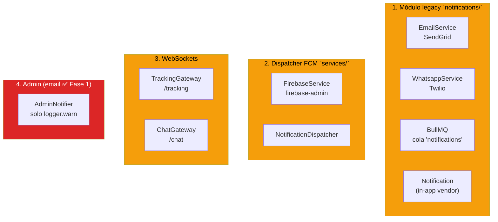
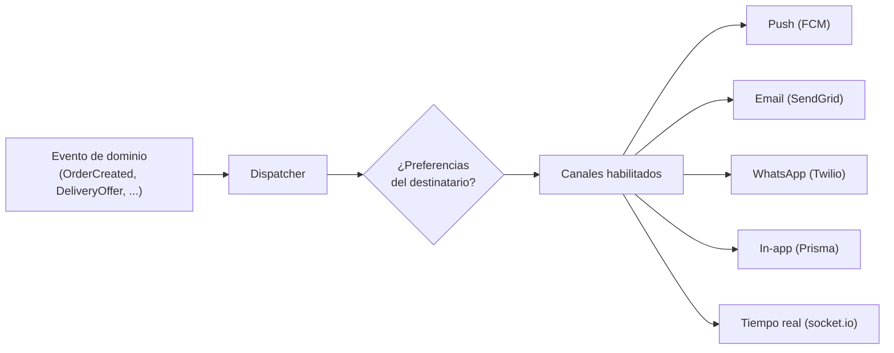
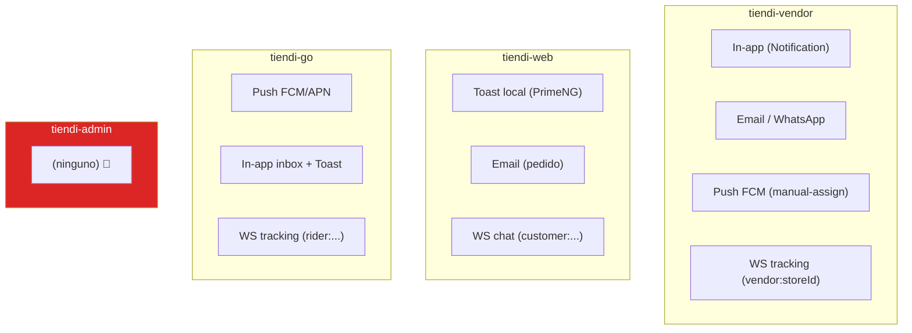
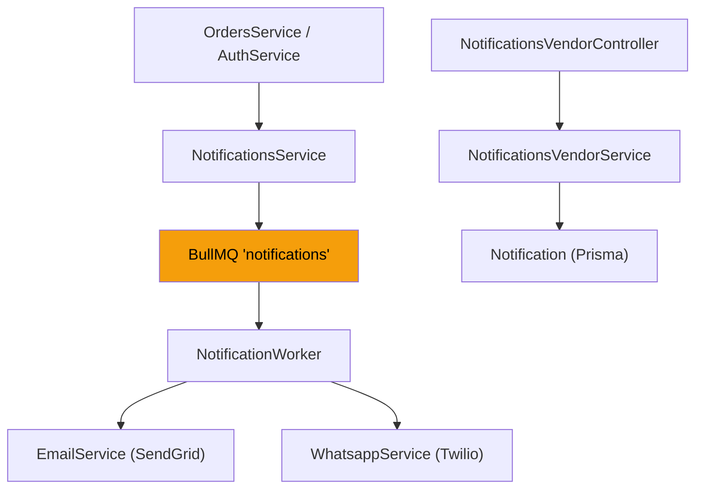
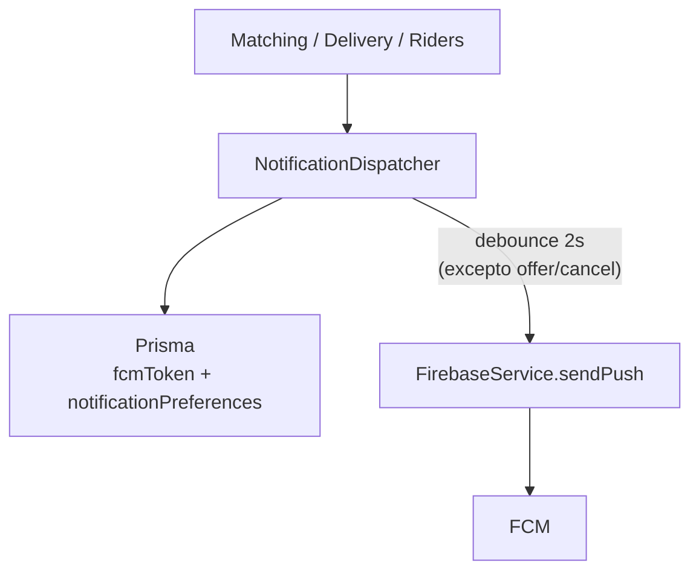
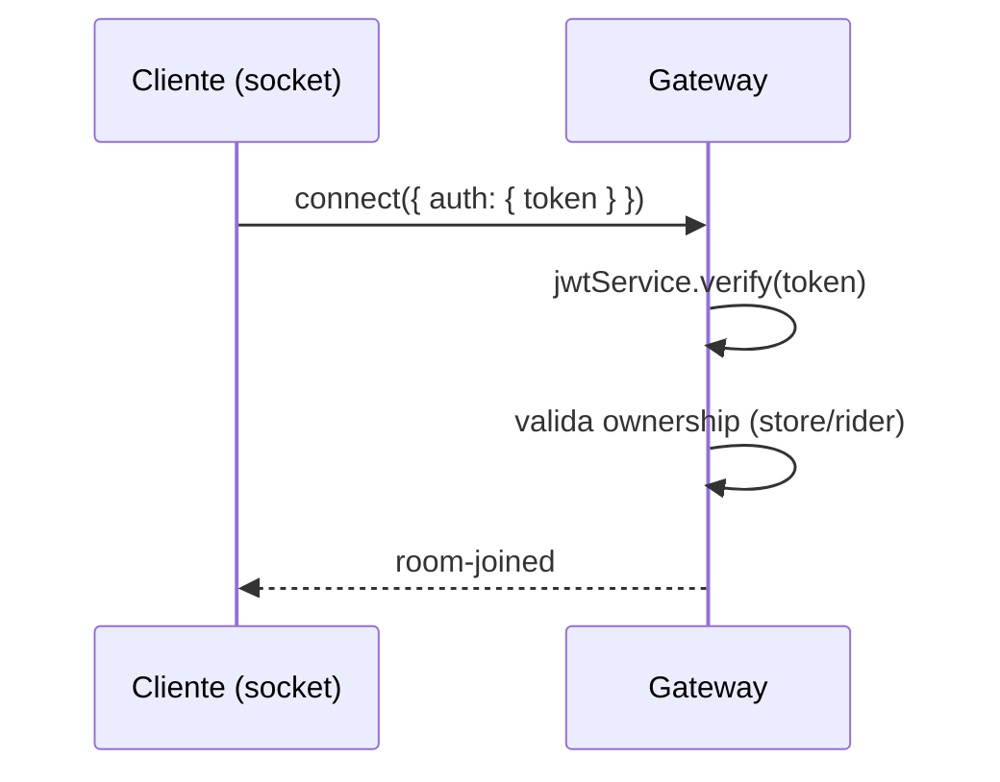
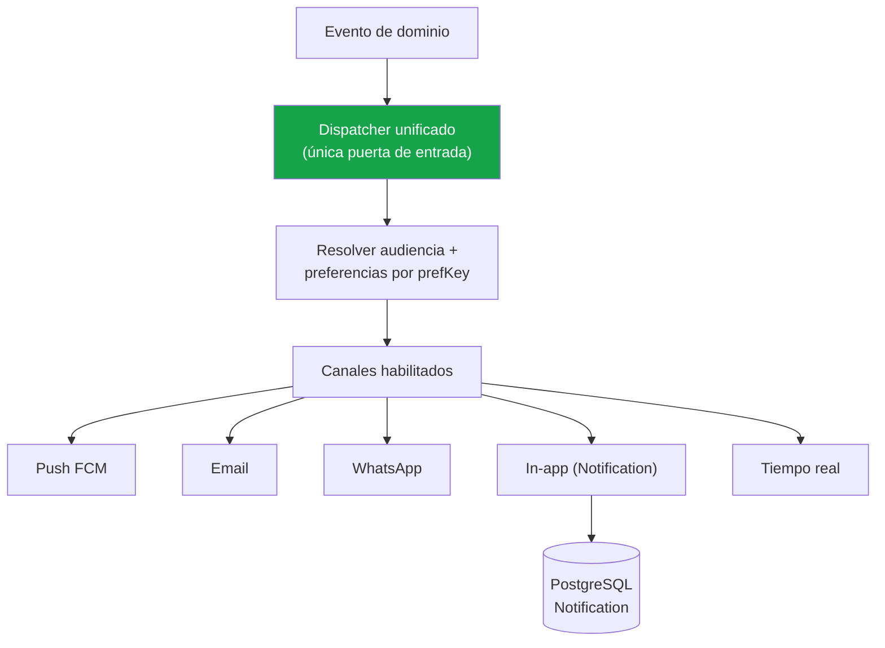

---
tags:
  - tiendi
  - notificaciones
  - arquitectura
  - fcm
  - email
  - websockets
  - tiendi-admin
aliases:
  - Sistema de Notificaciones Tiendi
  - Notificaciones unificadas
  - Notificaciones vendor web go admin
---

# Notificaciones — Sistema unificado (vendor · web · go · admin)

Este documento es la **fuente única de verdad** para todas las notificaciones de la plataforma: quién las recibe, por qué canal, qué evento las dispara y dónde vive el código. Cubre las cuatro aplicaciones — `tiendi-vendor`, `tiendi-web`, `tiendi-go` y `tiendi-admin`.

> [!NOTE]
> Parte de lo descrito es **estado actual verificado contra el código** y parte es **norte de diseño** (marcado 🔲). Lo que ya existe está marcado ✅.

> [!WARNING]
> El diagrama aspiracional [[DIAGRAMA_NOTIFICACIONES]] (en `DOCS/DIAGRAMAS/arquitectura/`) describe RabbitMQ, template engine, campañas y quiet hours que **no existen en el código**. Se mantiene como referencia legada de intención; este documento describe la realidad y el diseño objetivo.

---

## Índice

1. [Objetivo y alcance](#1-objetivo-y-alcance)
2. [Estado actual (verificado)](#2-estado-actual-verificado)
3. [Modelo conceptual](#3-modelo-conceptual)
4. [Mapa de canales por aplicación](#4-mapa-de-canales-por-aplicación)
5. [Infraestructura actual](#5-infraestructura-actual)
6. [Catálogo de eventos por aplicación](#6-catálogo-de-eventos-por-aplicación)
7. [WebSockets](#7-websockets)
8. [Preferencias](#8-preferencias)
9. [El gap del admin](#9-el-gap-del-admin)
10. [Diseño objetivo — dispatcher unificado](#10-diseño-objetivo--dispatcher-unificado)
11. [Decisiones abiertas](#11-decisiones-abiertas)
12. [Checklist de seguimiento](#12-checklist-de-seguimiento)

---

## 1. Objetivo y alcance

### 1.1 Qué es

Notificaciones es el sistema que traduce un evento de dominio (pedido creado, entrega ofrecida, ticket escalado) en mensajes entregados por el canal correcto a la audiencia correcta.

### 1.2 Audiencias

| Audiencia | App | Rol |
|-----------|-----|-----|
| Cliente | `tiendi-web` | Comprador en el storefront |
| Vendedor | `tiendi-vendor` | Owner/staff de la tienda |
| Repartidor | `tiendi-go` | Rider que entrega |
| Super Admin | `tiendi-admin` | Operación de plataforma |

### 1.3 Canales

| Canal | Tecnología | Estado |
|-------|------------|--------|
| Email | SendGrid | ✅ |
| WhatsApp | Twilio | ✅ |
| Push móvil (FCM) | firebase-admin | ✅ |
| In-app persistente | tabla `Notification` (Prisma) | ✅ (solo vendor) |
| Tiempo real (WS) | socket.io (`/tracking`, `/chat`) | ✅ |
| Email al admin (SendGrid) | `ADMIN_ALERT_EMAILS` | ✅ Fase 1 |

---

## 2. Estado actual (verificado)

Hoy existen **tres sistemas en paralelo** que no comparten una única puerta de entrada. Cada uno fue creado para una audiencia y repite responsabilidades.



| Sistema | Archivos | Canales | Audiencia | Estado |
|---------|----------|---------|-----------|--------|
| Legacy | `src/modules/notifications/*` | Email + WhatsApp + in-app | Vendor, cliente | ✅ |
| Dispatcher FCM | `src/services/notification-dispatcher.service.ts`, `firebase.service.ts` | Push FCM | Rider, vendor | ✅ |
| WebSockets | `src/gateways/tracking.gateway.ts`, `src/modules/chat/chat.gateway.ts` | socket.io | Rider, vendor, cliente | ✅ |
| Admin | `src/modules/support/admin-notifier.service.ts` | Email (SendGrid) | Super Admin | ✅ Fase 1 |

> [!CAUTION]
> **La duplicación es la deuda central de este sistema.**
> El módulo legacy maneja email/WhatsApp para el vendor; el dispatcher FCM maneja push para riders; los gateways manejan tiempo real; y el admin no tiene nada. Cada vez que aparece un nuevo evento, hay que decidir en cuál de los cuatro sistemas cablearlo — y la respuesta cambia según quién lo escribió.

---

## 3. Modelo conceptual

### 3.1 Piezas



### 3.2 Vocabulario

| Término | Definición |
|---------|-----------|
| Evento | Hecho de dominio que dispara una o más notificaciones |
| Audiencia | Quién debe recibir el mensaje (cliente, vendedor, rider, admin) |
| Canal | Medio de entrega (push, email, WhatsApp, in-app, WS) |
| Preferencia | Config por destinatario que activa/desactiva un canal o tipo |
| Debounce | Supresión de duplicados en una ventana de tiempo (push de riders) |
| `prefKey` | Clave de preferencia que el dispatcher FCM consulta antes de enviar |

---

## 4. Mapa de canales por aplicación



| App | Email | WhatsApp | Push | In-app | WS |
|-----|-------|----------|------|--------|----|
| `tiendi-vendor` | ✅ | ✅ | ✅ (manual-assign) | ✅ (`Notification`) | ✅ |
| `tiendi-web` | ✅ | — | — | Toast local | ✅ (chat) |
| `tiendi-go` | — | — | ✅ FCM/APN | ✅ inbox + toast | ✅ |
| `tiendi-admin` | 🔲 | — | 🔲 | 🔲 | 🔲 |

---

## 5. Infraestructura actual

### 5.1 Módulo legacy `notifications/`



Archivos y responsabilidades:

| Archivo | Rol |
|---------|-----|
| `notifications.service.ts` | Helpers de dominio: `onUserRegistered`, `onOrderCreated`, `onOrderStatusChanged` |
| `notifications-vendor.service.ts` | In-app persistente: `findAll`, `markRead`, `markAllRead`, `getSettings`, `saveSettings`, `create` |
| `notifications-vendor.controller.ts` | Endpoints REST para el vendor |
| `email.service.ts` | Envío SendGrid |
| `whatsapp.service.ts` | Envío Twilio |
| `workers/notification.worker.ts` | Consumidor BullMQ |
| `notifications.constants.ts` | `NOTIFICATION_QUEUE = 'notifications'` |

Modelo de datos (in-app):

```prisma
model Notification {
  id           String   @id @default(uuid())
  storeId      String
  store        Store    @relation(fields: [storeId], references: [id])
  type         String
  title        String
  body         String
  read         Boolean  @default(false)
  resourceType String?
  resourceId   String?
  createdAt    DateTime @default(now())
}
```

> [!NOTE]
> La tabla `Notification` está **acoplada a `storeId`**. No sirve para riders ni para el admin: solo modela notificaciones de una tienda. Esto es exactamente la limitación que hay que levantar en el diseño objetivo (§10).

### 5.2 Dispatcher FCM `services/`



- `firebase.service.ts` — inicializa firebase-admin y envía `admin.messaging().send()`.
- `notification-dispatcher.service.ts` — `sendToRider` (con `prefKey` y `channelId`), `sendToRiders` (batch), y métodos de dominio (`notifyDeliveryOffer`, `notifyDeliveryCompleted`, etc.).
- Debounce de 2 s por `riderId:eventKey`, con excepción para `order.offered` y `order.cancelled`.

> [!TIP]
> El dispatcher FCM es el único componente que **ya implementa preferencias por clave** (`prefKey` → `Rider.notificationPreferences`) y debounce. Es el candidato natural a ser el núcleo del dispatcher unificado (§10).

### 5.3 WebSockets

| Gateway | Namespace | Rooms | Eventos |
|---------|-----------|-------|---------|
| `TrackingGateway` | `/tracking` | `delivery:{id}`, `rider:{id}`, `vendor:{storeId}` | `rider:position`, `location:request`, `order:offer`, `vendor-room-joined`, `rider-room-joined` |
| `ChatGateway` | `/chat` | `conv:{id}`, `store:{id}`, `customer:{id}` | `message.new` |

> [!WARNING]
> `TrackingGateway.handleJoinDeliveryRoom` **todavía no autentica** (cualquier socket puede unirse a cualquier sala de delivery). `join-vendor-room` y `join-rider-room` sí validan JWT por handshake. Hay un TODO explícito en el código para portar ese patrón.

---

## 6. Catálogo de eventos por aplicación

### 6.1 `tiendi-vendor` (vendedor)

| Evento | Canal | Origen |
|--------|-------|--------|
| Nuevo pedido | Email + WhatsApp | `NotificationsService.onOrderCreated` |
| Repartidor rechazó oferta | Push FCM | `NotificationDispatcher.notifyVendorRiderRejected` |
| Repartidor aceptó oferta | Push FCM | `NotificationDispatcher.notifyVendorRiderAccepted` |
| In-app (varios) | `Notification` | `NotificationsVendorService.create` |
| Estado de pedido en vivo | WS `vendor:{storeId}` | `TrackingGateway.emitToVendor` |

### 6.2 `tiendi-web` (cliente)

| Evento | Canal | Origen |
|--------|-------|--------|
| Pedido confirmado | Email | `NotificationsService.onOrderCreated` |
| Estado de pedido actualizado | Email + WhatsApp | `NotificationsService.onOrderStatusChanged` |
| Mensajes de chat | WS `customer:{id}` | `ChatGateway.emitNewMessage` |
| Feedback local | Toast PrimeNG | `notification.service.ts` |

> [!NOTE]
> `tiendi-web` no tiene push FCM ni in-app persistente. Su `notification.service.ts` es solo un wrapper de `MessageService` de PrimeNG (toasts). Es la app con menor cobertura de notificaciones.

### 6.3 `tiendi-go` (repartidor)

Métodos de `NotificationDispatcher` (todos Push FCM, con `prefKey`):

| Método | `prefKey` | `channelId` |
|--------|-----------|-------------|
| `notifyDeliveryOffer` | `orderOffers` | `offers` |
| `notifyDeliveryAccepted` | `deliveryUpdates` | — |
| `notifyDeliveryCompleted` | `walletCredits` | — |
| `notifyDeliveryIncident` | `deliveryUpdates` | — |
| `notifyAtStore` | `deliveryUpdates` | — |
| `notifyPauseWarning` | `systemMessages` | — |
| `notifyPauseExpired` | `systemMessages` | — |
| `notifyInactivityWarning` | `systemMessages` | — |
| `notifyWithdrawalProcessed` | `walletCredits` | — |
| `notifyRiderStatusChanged` | `systemMessages` | — |
| `notifyDeliveryCancelled` | `orderOffers` | — |
| `notifyCashPendingDeposit` | `walletCredits` | — |

La app maneja el ciclo completo en `useNotificationSetup.ts`: permisos, canales Android (`offers`/`default`), registro de token FCM/APN, rotación de token, cold-start tap, vibrar en ofertas, Toast e inbox.

### 6.4 `tiendi-admin` (Super Admin)

| Evento | Canal | Estado |
|--------|-------|--------|
| Delivery sin rider | Email | ✅ `alertNoRiderFound` |
| Nuevo ticket (P0/P1) | Email | ✅ `alertNewTicket` |
| Ticket escalado | Email | ✅ `alertEscalation` |

---

## 7. WebSockets

### 7.1 Rooms y autenticación



| Sala | Quién puede unirse | Validación |
|------|--------------------|------------|
| `vendor:{storeId}` | Owner o staff ACTIVO de la tienda | JWT + `Store.ownerId` o `StoreEmployee` |
| `rider:{riderId}` | El rider (derivado de JWT) | JWT + `Rider.userId` |
| `delivery:{id}` | Cualquiera (⚠️) | **sin validar** |
| `conv:{id}` / `store:{id}` / `customer:{id}` | Chat | sin validación de JWT |

---

## 8. Preferencias

| Entidad | Campo | Uso |
|---------|-------|-----|
| `Rider` | `notificationPreferences` (Json) | Dispatcher FCM consulta `prefKey` antes de enviar |
| `Store` | `notificationSettings` (Json) | Config del vendor (`getSettings`/`saveSettings`) |

> [!TIP]
> El patrón de preferencias por clave ya existe en el rider (`prefKey`). El diseño objetivo debe **generalizar ese mismo patrón** a las cuatro audiencias, en lugar de inventar uno nuevo para el admin.

---

## 9. El gap del admin

```typescript
// tiendi-api/src/modules/support/admin-notifier.service.ts
@Injectable()
export class AdminNotifier {
  private readonly logger = new Logger(AdminNotifier.name);

  async alertNoRiderFound(deliveryId: string): Promise<void> {
    this.logger.warn(`[ADMIN ALERT] No rider found for delivery ${deliveryId} after 5 min`);
  }
  async alertNewTicket(ticketId, category, priority) {
    this.logger.warn(`[ADMIN ALERT] New ${priority} ticket: ${ticketId} (${category})`);
  }
  async alertEscalation(ticketId, category, priority) {
    this.logger.warn(`[ADMIN ALERT] Ticket ESCALATED: ${ticketId} (${category}, ${priority})`);
  }
}
```

> [!CAUTION]
> ~~**El admin no recibe nada hoy.**~~
> **Resuelto (Fase 1, 2026-08-25):** `AdminNotifier` envía los tres eventos (delivery sin rider, ticket P0/P1 nuevo, ticket escalado) por email a `ADMIN_ALERT_EMAILS`. Queda pendiente setear la variable en producción — mientras falte, degrada a log-only.
>
> Lo que sigue bloqueado:
> 1. La **capa lite móvil** de [[TIENDI_ADMIN]] §14 necesita **push** al Super Admin como gatillo (Fase 4 de este checklist), no solo email.

### 9.1 Norte de diseño para el admin

| Evento | Canal propuesto | Preferencia |
|--------|-----------------|-------------|
| Ticket P0/P1 nuevo | Push + Email | `prefKey: 'support.priority'` |
| Ticket escalado | Push | `prefKey: 'support.escalation'` |
| Delivery sin rider | Push + Email | `prefKey: 'ops.noRider'` |

---

## 10. Diseño objetivo — dispatcher unificado



> [!IMPORTANT]
> **Principio rector: un evento, una puerta de entrada.**
> Todo evento de dominio llama a **un único** `NotificationDispatcher`. El dispatcher resuelve audiencia, consulta preferencias y despacha por canales. Hoy la llamada se dispersa entre `NotificationsService`, `NotificationDispatcher`, los gateways y (a futuro) `AdminNotifier`.

### 10.1 Cambios necesarios

| Cambio | Detalle |
|--------|---------|
| Generalizar `Notification` | Dejar de estar acoplada a `storeId`; soportar rider y admin |
| Unificar dispatcher | `NotificationDispatcher` absorbe email/WhatsApp del módulo legacy |
| Extender `prefKey` | A las 4 audiencias, no solo rider |
| Cablear `AdminNotifier` | ✅ Fase 1: email real al Super Admin |
| Unificar push de vendor | Hoy hay 2 caminos: `NotificationsService` (email/WA) y `NotificationDispatcher` (FCM) |

> [!WARNING]
> La unificación es **incremental, no big-bang**. Se puede cablear el admin sin migrar de golpe el módulo legacy. El orden de menor riesgo: (1) cablear admin, (2) generalizar `Notification`, (3) absorber legacy.

---

## 11. Decisiones abiertas

| # | Decisión | Opciones | Recomendación |
|---|----------|----------|---------------|
| **N1** | ¿Push al admin via web (FCM web) o email primero? | FCM web / email / ambos | **Email primero** (cero config nueva), push después |
| **N2** | ¿`Notification` única tabla multi-audiencia o tablas por audiencia? | Única con `ownerType`/`ownerId` / tablas separadas | **Única con `ownerType`/`ownerId`** (mismo patrón que el ledger) |
| **N3** | ¿El `NotificationDispatcher` absorbe email/WhatsApp o convive con legacy? | Absorber / convivir | **Absorber** de forma incremental |
| **N4** | ¿Qué eventos del admin son push vs email? | Ver §9.1 | Prioridad → push; resto → email |

---

## 12. Checklist de seguimiento

### Fase 1 — Cablear el admin (desbloquea el lite de TIENDI_ADMIN §14)

> [!NOTE]
> **Implementada (2026-08-25).** `AdminNotifier` ya no es un stub: envía emails por SendGrid a las direcciones de `ADMIN_ALERT_EMAILS` (variable opcional, separadas por coma; validada en `env.validation.ts`). Sin la variable configurada, degrada a log-only (comportamiento previo). Cada destinatario se envía individualmente y un fallo de SendGrid **nunca rompe** el flujo de negocio que disparó la alerta.
>
> ⚠️ **Pendiente operativo**: setear `ADMIN_ALERT_EMAILS` en el entorno de producción — mientras no exista, las alertas siguen quedando solo en el log.

- [x] Reemplazar `AdminNotifier` stub por canal real (email SendGrid primero)
- [x] `alertNewTicket` → email al Super Admin para tickets P0/P1 (prioridades menores: solo log, N4)
- [x] `alertEscalation` → email al Super Admin
- [x] `alertNoRiderFound` → email al Super Admin
- [x] Test: un ticket P1 dispara email al admin — `admin-notifier.service.spec.ts` (8 tests: P0/P1 sí, P3 no, múltiples destinatarios, absorción de fallos, degradación sin config)

### Fase 2 — Generalizar `Notification`

- [ ] Agregar `ownerType` + `ownerId` (o equivalente) a la tabla `Notification`
- [ ] Migrar `storeId` a `ownerId` con `ownerType='STORE'` manteniendo compatibilidad
- [ ] Endpoints de inbox para rider y admin
- [ ] Test: una notificación de rider no aparece en el inbox de una tienda

### Fase 3 — Unificar dispatcher

- [ ] `NotificationDispatcher` absorbe `onOrderCreated`/`onOrderStatusChanged` del legacy
- [ ] Extraer `prefKey` a un contrato compartido para las 4 audiencias
- [ ] Unificar los 2 caminos de push del vendor en uno
- [ ] Eliminar el módulo legacy `notifications/` una vez migrado

### Fase 4 — Push web al admin (opcional, post-email)

- [ ] FCM web en `tiendi-admin`
- [ ] Token de dispositivo del Super Admin
- [ ] Push para tickets P0/P1 y escalados

### Criterios de aceptación

- [ ] Un ticket P0/P1 nuevo llega al Super Admin (email o push), no solo al log
- [ ] Un evento de rider respeta su `prefKey`
- [ ] Una notificación de una tienda no se cruza con otra ni con el admin
- [ ] Cada evento de dominio tiene una única puerta de entrada al sistema de notificaciones

---

## Referencias

- [[TIENDI_ADMIN]] — back-office; §14 depende del canal admin de este documento
- [[CATALOGO_MAESTRO]] — eventos de catálogo (merge/verify) que podrían notificar al admin
- [[FACTURACION_Y_CONTABILIDAD]] — frontera por aplicación
- [[DIAGRAMA_NOTIFICACIONES]] — diagrama legado (aspiracional, no coincide con el código)
- [[MONITORING_RUNBOOK]] — observabilidad y alertas

### Archivos afectados (estado objetivo)

| Repositorio | Archivo | Cambio |
|-------------|---------|--------|
| `tiendi-api` | `src/modules/support/admin-notifier.service.ts` | ✅ Fase 1: canal email real (`ADMIN_ALERT_EMAILS`) |
| `tiendi-api` | `src/services/notification-dispatcher.service.ts` | Absorber email/WhatsApp; extender `prefKey` |
| `tiendi-api` | `src/modules/notifications/*` | Migrar a dispatcher unificado y luego eliminar |
| `tiendi-api` | `prisma/schema.prisma` | Generalizar `Notification` (multi-audiencia) |
| `tiendi-admin` | `**` | Suscripción a notificaciones (post-Fase 1) |
