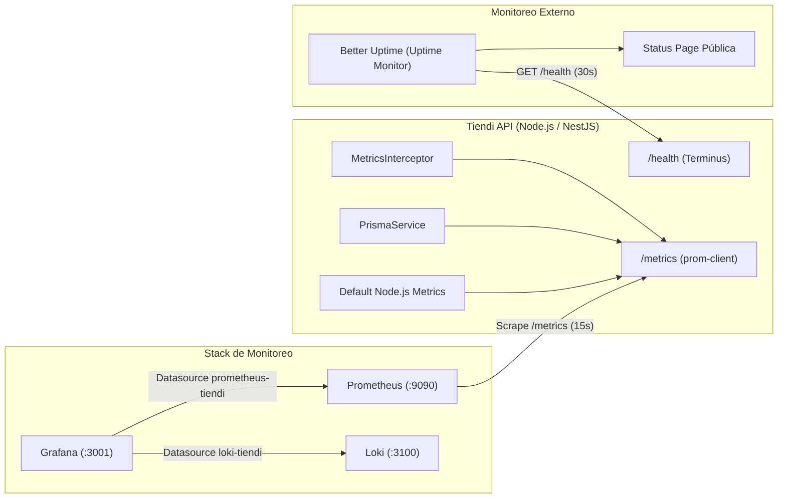

# Observabilidad: Prometheus, Grafana y Better Uptime — Tiendi API

Guía de referencia técnica para métricas, alertas, dashboards aprovisionados y monitoreo sintético externo (Better Uptime) en Tiendi API (Fase 8).

---

## 1. Arquitectura de Observabilidad

---

## 2. Métricas de Prometheus (`GET /metrics`)

El endpoint `GET /metrics` expone las métricas en formato estándar de Prometheus mediante `prom-client`.

### 2.1 Métricas HTTP y Tráfico

| Métrica | Tipo | Etiquetas | Descripción |
|---------|------|-----------|-------------|
| `http_requests_total` | Counter | `method`, `route`, `status` | Total acumulado de requests HTTP recibidos y procesados. |
| `http_request_duration_seconds` | Histogram | `method`, `route`, `le` | Duración de requests HTTP en segundos. Buckets: `[0.01, 0.05, 0.1, 0.3, 0.5, 1, 2, 5]`. |

### 2.2 Métricas de Base de Datos (Prisma & PostgreSQL)

| Métrica | Tipo | Etiquetas | Descripción |
|---------|------|-----------|-------------|
| `prisma_slow_queries_total` | Counter | — | Total de queries ejecutadas por Prisma cuyo tiempo de ejecución superó los 1000ms. |

### 2.3 Métricas de Runtime Node.js (`collectDefaultMetrics`)

| Métrica | Tipo | Descripción |
|---------|------|-------------|
| `process_cpu_seconds_total` | Counter | Tiempo total de CPU consumido por el proceso Node.js (user y system). |
| `nodejs_heap_size_used_bytes` | Gauge | Memoria heap en uso por V8 en bytes. |
| `nodejs_heap_size_total_bytes` | Gauge | Memoria heap total asignada por V8 en bytes. |
| `nodejs_eventloop_lag_seconds` | Gauge | Lag actual del bucle de eventos (Event Loop) en segundos. |
| `process_resident_memory_bytes` | Gauge | Memoria residente (RSS) del proceso. |

### 2.4 Métricas de Negocio (Catálogo Maestro)

| Métrica | Tipo | Etiquetas | Descripción |
|---------|------|-----------|-------------|
| `master_catalog_gtin_capture_total` | Counter | `result="valid"\|"invalid"\|"absent"` | Registro de creación de productos por validez de GTIN. |
| `master_catalog_lookup_total` | Counter | `result="hit"\|"miss"` | Búsquedas de productos maestros por GTIN. |
| `master_catalog_pending_products` | Gauge | — | Productos pendientes de moderación en catálogo maestro. |

---

## 3. Provisioning en Grafana

Grafana se aprovisiona automáticamente desde el directorio `monitoring/grafana/provisioning/` montado en `/etc/grafana/provisioning:ro`.

### 3.1 Datasources Provisionados

- **Prometheus** (`datasources/prometheus.yml`):
  - UID: `prometheus-tiendi`
  - URL interna: `http://prometheus:9090`
  - `isDefault: true`
- **Loki** (`datasources/loki.yml`):
  - UID: `loki-tiendi`
  - URL interna: `http://loki:3100`
  - `isDefault: false`

### 3.2 Dashboards Provisionados

Los dashboards se cargan en la carpeta **Tiendi**:

#### `tiendi-api-overview.json` ("Tiendi · API & Infraestructura")
UID: `tiendi-api-overview`
- **Fila 1 — KPIs Principales**:
  - Total Requests: `sum(http_requests_total)`
  - Error Rate %: `((sum(rate(http_requests_total{status=~"[45].."}[1m])) or vector(0)) / (sum(rate(http_requests_total[1m])) or vector(1)) * 100)`
  - p95 Latency: `histogram_quantile(0.95, sum(rate(http_request_duration_seconds_bucket[1m])) by (le))`
  - Slow Queries: `sum(prisma_slow_queries_total) or vector(0)`
  - Heap Used (MB): `nodejs_heap_size_used_bytes / 1048576`
- **Fila 2 — Tráfico y Latencia**:
  - Request Rate (req/s) desglosado por método y ruta (`sum(rate(http_requests_total[1m])) by (method, route)`).
  - Percentiles de latencia en serie temporal: p50 (mediana), p95 y p99.
- **Fila 3 — Errores y Códigos HTTP**:
  - Tasa de respuestas HTTP por status code (`2xx`, `4xx`, `5xx`).
  - Stream en tiempo real de logs con severidad ERROR desde Loki.
- **Fila 4 — Procesamiento en Segundo Plano (BullMQ)**:
  - Tasa y volumen de ejecución de jobs de workers (matching, billing, kipu).
  - Stream de logs de procesamiento de BullMQ.
- **Fila 5 — Base de Datos y Queries Lentas (PostgreSQL / Prisma)**:
  - Tasa de queries lentas (`rate(prisma_slow_queries_total[5m])`).
  - Stream de logs correlacionados de queries lentas capturados por PrismaService.
- **Fila 6 — Recursos del Runtime (Node.js)**:
  - Utilización de CPU del proceso (`rate(process_cpu_seconds_total[1m]) * 100`).
  - Memoria Heap Usada vs Asignada.
  - Latencia del Event Loop (`nodejs_eventloop_lag_seconds`).

---

## 4. Reglas de Alerta (`monitoring/alerts.yml`)

Prometheus evalúa periódicamente las siguientes reglas de alerta para `tiendi-api`:

### 4.1 HighErrorRate (Crítica)
- **Expresión**: `(sum(rate(http_requests_total{status=~"5.."}[5m])) / sum(rate(http_requests_total[5m]))) * 100 > 5`
- **Duración**: `2m`
- **Severidad**: `critical`
- **Condición**: La proporción de errores 5xx respecto al total de requests supera el 5% de manera sostenida por 2 minutos.

### 4.2 HighLatency (Advertencia)
- **Expresión**: `histogram_quantile(0.95, sum(rate(http_request_duration_seconds_bucket[5m])) by (le)) > 2`
- **Duración**: `5m`
- **Severidad**: `warning`
- **Condición**: El percentil 95 de tiempo de respuesta excede los 2 segundos durante más de 5 minutos.

### 4.3 ServiceDown (Crítica)
- **Expresión**: `up{job="tiendi-api"} == 0`
- **Duración**: `1m`
- **Severidad**: `critical`
- **Condición**: Prometheus no puede contactar al endpoint de métricas de `tiendi-api` por más de 1 minuto.

---

## 5. Integración con Better Uptime (Monitoreo Sintético)

Better Uptime (ahora Better Stack) monitorea externamente la disponibilidad global de la API desde múltiples regiones geográficas.

### 5.1 Endpoint Monitoreado

- **URL**: `https://api.tiendi.pe/health` (o `https://api.staging.tiendi.pe/health` en staging)
- **Método**: `GET`
- **Intervalo de chequeo**: `30 segundos` (o `60 segundos` según el plan de Better Uptime)
- **Ubicaciones de prueba**: US East, US West, South America (São Paulo), Europa.

### 5.2 Criterios de Aceptación (Heartbeat / Health Check)

El endpoint `GET /health` utiliza `@nestjs/terminus` para validar la conectividad de base de datos y estado de memoria:
- **Respuesta HTTP esperada**: `200 OK`
- **Validación de contenido (Keyword / Payload Assertion)**:
  - La respuesta JSON debe contener `"status": "ok"` o `"status": "up"`.
  - Debe incluir comprobación exitosa de base de datos (`"database": { "status": "up" }`).
- **Timeout**: 5 segundos.

### 5.3 Configuración en el Panel de Better Uptime

1. **Crear Monitor**:
   - Iniciar sesión en [Better Stack](https://betterstack.com/).
   - Navegar a **Uptime** > **Monitors** > **Create Monitor**.
   - Tipo de monitor: `URL / API Endpoint`.
   - URL to monitor: `https://api.tiendi.pe/health`.
   - Pronunciable / Friendly name: `Tiendi API - Production Health`.
   - Heartbeat / Check interval: `30s`.
2. **Alerting & Escalation Policy**:
   - Alert after: `1 failure` (notificación inmediata) o `2 consecutive failures` (para evitar falsos positivos por micro-cortes de red).
   - Canales de alerta:
     - **Email**: `devops@tiendi.pe`
     - **Slack Channel**: `#alerts-prod` (vía webhook de Better Stack)
     - **SMS / Phone Call**: Asignado al ingeniero On-Call.
     - **WhatsApp**: Configurado para el equipo de guardia.
3. **Página de Estado (Status Page)**:
   - Añadir el monitor `Tiendi API` a la Status Page pública: `status.tiendi.pe`.
   - Configurar notificaciones automáticas para suscriptores en caso de degradación o interrupción del servicio.
4. **Ventanas de Mantenimiento**:
   - En caso de despliegues mayores o migraciones con downtime programado, programar una "Maintenance Window" en Better Uptime para suspender alertas falsas.
