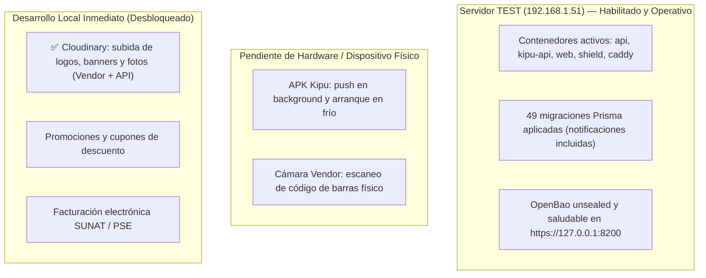

# Relevamiento de Tareas y Pendientes en Documentación (DOCS)

> **Fecha de última actualización:** 2026-10-05  
> **Criterio de orden:** Prioridad operativa y estado actual de ejecución.  
> **Total de documentos analizados:** 46 archivos Markdown en `DOCS/`.

---

## 1. Quick Path: Panorama de Acción y Próximos Pasos

| Frente | Estado | Tareas Clave | Siguiente Acción |
|---|---|---|---|
| **1. Infraestructura / TEST** | 🟢 **Habilitado y Operativo** | Servidor `192.168.1.51` reinstalado, 12 servicios arriba, 49 migraciones aplicadas y OpenBao unsealed. Resta solo configurar CNAMEs en Cloudflare DNS para `*-test.tiendi.pe`. | Agregar CNAMEs en Cloudflare DNS si se requiere acceso por dominio público. |
| **2. Pruebas Móviles** | 🟡 Requiere Hardware | Verificación de push en APK Kipu físico y lectura de código de barras en cámara de smartphone. | Compilar APK Kipu con `google-services.json` propio. |
| **3. Desarrollo en Local** | 🟢 **Desbloqueado** | Cloudinary integrado (API + Vendor, 100% tests verdes). Siguen cupones/promociones y facturación SUNAT/PSE. | **Continuar con Promociones / Cupones o Facturación SUNAT.** |

---

## 2. Resumen Ejecutivo por Documento

| Documento | Última Modif. | Estado Actual y Pendientes Críticos |
|---|---|---|
| [`PLAN-MODULO-CENTRAL-NOTIFICACIONES.md`](PLAN-MODULO-CENTRAL-NOTIFICACIONES.md) | 2026-10-02 | ✅ Fases 0–7 completadas y testeadas (Campañas y Purgas R1–R7 en Admin). Pendiente: migración en TEST/PROD y prueba push en APK Kipu. Fase 8 (Extracción) documentada en SOP independiente. |
| [`RUNBOOK-NOTIFICACIONES-OPERACION.md`](RUNBOOK-NOTIFICACIONES-OPERACION.md) | 2026-10-02 | ✅ Runbook de operaciones, endpoints de monitoreo, métricas y crons diarios de purga documentados. |
| [`PLAN-EXTRACCION-TIENDI-NOTIFICATIONS.md`](PLAN-EXTRACCION-TIENDI-NOTIFICATIONS.md) | 2026-10-02 | ✅ SOP de extracción a microservicio standalone y corte single-authority listo para cuando el tráfico lo exija. |
| [`DISENO-TECNICO-CALENDARIO-CUOTAS-KIPU.md`](DISENO-TECNICO-CALENDARIO-CUOTAS-KIPU.md) | 2026-09-30 | ✅ Diseño técnico completado; implementación archivada en `tiendi-kipu` (SDD commit `1dfd371`). |
| [`DECISIONES-CALENDARIO-CUOTAS-KIPU.md`](DECISIONES-CALENDARIO-CUOTAS-KIPU.md) | 2026-09-30 | ✅ Decisiones C1–C7 cerradas. Reglas de reversión multi-préstamo implementadas. |
| [`PLAN-PRUEBAS-E2E.md`](PLAN-PRUEBAS-E2E.md) | 2026-09-29 | ✅ 8 ejecuciones de integración cruzada completadas (01 a 08). Pendiente: automatización Detox en CI/CD con emulador Android headless y tarjetas staging. |
| [`TIENDI_LAUNCHER_IMPLEMENTACION.md`](TIENDI_LAUNCHER_IMPLEMENTACION.md) | 2026-09-29 | ✅ **Completado y verificado en E2E 08:** Launcher E1 (4210) e Identidad Global E2 con contratos C04–C07 y vinculación multi-app (73/73 tests). |
| [`TIENDI_LAUNCHER.md`](TIENDI_LAUNCHER.md) | 2026-09-29 | ✅ Especificación base implementada y probada contra `tiendi-shield` y `tiendi-api`. |
| [`TIENDI_SHIELD_DISENO.md`](TIENDI_SHIELD_DISENO.md) | 2026-09-29 | ✅ Diseño visual, responsividad y portal de aplicaciones implementados y validados con Playwright. |
| [`OPENBAO_IMPLEMENTATION_GUIDE.md`](OPENBAO_IMPLEMENTATION_GUIDE.md) | 2026-10-03 | ✅ Escaneo de bundles web ejecutado con 0 fugas tras implementar proxy BFF `AdminKipuController`. Pendiente: pruebas en host de recreación de contenedor y unseal. |
| [`OPENTELEMETRY_T6_ROLLOUT.md`](OPENTELEMETRY_T6_ROLLOUT.md) | 2026-10-02 | ✅ Falso positivo de fechas ISO resuelto en `@kanoso/telemetry`. Versión de Git inyectada en builds de `tiendi-admin`. Pendiente: rebuilds de navegador en TEST y rotación SSH. |
| [`OPENTELEMETRY_IMPLEMENTATION_GUIDE.md`](OPENTELEMETRY_IMPLEMENTATION_GUIDE.md) | 2026-09-26 | 10 criterios de entrega formal para informe final de telemetría. |
| [`TIENDI_ADMIN.md`](TIENDI_ADMIN.md) | 2026-10-01 | ✅ Fase 7 completada: Pantallas `/admin/finance/ledger` y `/admin/finance/payouts` integradas y verificadas. |
| [`TAREAS.md`](TAREAS.md) | 2026-10-02 | ✅ Fases 1 a 14 marcadas 100% completadas (102 suites / 1028 tests). Pendiente en módulo tiendas: Cloudinary y promociones. |
| [`CATALOGO_MAESTRO.md`](CATALOGO_MAESTRO.md) | 2026-08-31 | Prueba física pendiente en Chrome Android y Safari iOS para captura de código de barras. |
| [`INTEGRACION-TIENDI.md`](INTEGRACION-TIENDI.md) | 2026-08-29 | Saldo en tiempo real y wallet para comercios (`STORE_PAYABLE`). |
| [`FACTURACION_Y_CONTABILIDAD.md`](FACTURACION_Y_CONTABILIDAD.md) | 2026-08-28 | Fase 4: Conciliación bancaria automatizada con extractos. Fase 5: Integración SUNAT/PSE. |
| [`FLUJO_DINERO.md`](FLUJO_DINERO.md) | 2026-08-28 | Fase 5: Comprobantes electrónicos; Fase 6: Recaudador integrado opcional. |
| [`MODELO_NEGOCIO.md`](MODELO_NEGOCIO.md) | 2026-08-26 | Sección 12: Definición de comisiones de tarjetas, esquemas de delivery y umbrales mínimos. |
| [`GUIA_REINSTALACION_COMPLETA.md`](GUIA_REINSTALACION_COMPLETA.md) | 2026-08-31 | Tareas de endurecimiento en producción (firewall, SSL, backups automatizados). |

---

## 3. Detalle Exhaustivo de Pendientes por Área

### 3.1. Infraestructura, Ops y Despliegue (TEST/PROD)
- **Servidor TEST (`192.168.1.51`):** ✅ **Habilitado, aprovisionado y operativo**
  - Contenedores Docker levantados y saludables (`tiendi-test-api-1`, `kipu-api`, `web`, `shield`, `caddy`, `postgres`, `redis`, `loki`, `prometheus`, `grafana`, `otel-collector`).
  - Las 49 migraciones de Prisma fueron aplicadas exitosamente (incluyendo `notification_request`, `notification_installations_preferences`, `notification_outbox_durable` y `notification_campaigns`).
  - OpenBao inicializado y `unsealed` en `https://127.0.0.1:8200` (cluster healthy).
  - Health check HTTP en `http://192.168.1.51/api/v1/health` respondiendo `{"status":"ok"}`.
  - **Pendiente de Ops / Red:**
    - Crear CNAMEs en Cloudflare DNS para `*-test.tiendi.pe` (apuntando al túnel Cloudflare activo en el servidor).
    - Cargar variables de entorno en producción cuando corresponda (`ADMIN_ALERT_EMAILS`, credenciales Firebase Kipu).
    - Revocar la cuenta de servicio duplicada (`d31cef653b`) en la consola de Firebase.

### 3.2. Mobile y Validación en Dispositivos Físicos
- **Push Notifications (Kipu y Go):**
  - Compilar APK de Kipu con su `google-services.json` propio y validar recepción en foreground, background y arranque en frío.
  - Verificación móvil de `tiendi-go` con registro dual en dispositivo físico.
- **Cámara y Escaneo de Barras:**
  - Validar escáner de código de barras en dispositivos reales (Android/Chrome y iOS/Safari) para [`CATALOGO_MAESTRO.md`](CATALOGO_MAESTRO.md).
- **Detox E2E:**
  - Automatización en CI/CD con emulador Android headless para las suites de `tiendi-go`.

### 3.3. Desarrollo de Software (Features Desbloqueadas en Local)
- **Módulo de Catálogo & Tiendas (`tiendi-api` / `tiendi-vendor`):**
  - **✅ Subida de imágenes con Cloudinary (Completado):** Endpoints seguros con validación de magic bytes (JPEG/PNG/WebP) y límite de 5MB (`POST /stores/:id/logo`, `POST /stores/:id/banner`, `POST /stores/:id/product-images`, `POST /products/:id/images`). Integrado en `tiendi-vendor` con carga reactiva (Signals), spinners, previews y eliminación de blobs temporales y Base64 en base de datos. 100% tests unitarios pasando.
  - **Promociones y Descuentos:** Motor de cupones y reglas de descuento en carrito y checkout.
- **Facturación y SUNAT (`FACTURACION_Y_CONTABILIDAD.md`):**
  - Integración con PSE/SUNAT para emisión de boletas y facturas electrónicas.
  - Conciliación bancaria automatizada contra extractos de Culqi y bancos.
- **Microservicio `tiendi-notifications` (Fase 8):**
  - Desacoplar el módulo a servicio standalone según [`PLAN-EXTRACCION-TIENDI-NOTIFICATIONS.md`](PLAN-EXTRACCION-TIENDI-NOTIFICATIONS.md) una vez estabilizado el tráfico.

### 3.4. Decisiones de Producto y Negocio
- **Modelo de Ingresos (`MODELO_NEGOCIO.md` §12):**
  - Definición de absorción de comisiones de tarjeta (3.99% + IGV) según ticket mínimo.
  - Tarifa dinámica por distancia vs tarifa plana de delivery.
  - Políticas de penalización por cancelaciones tardías.

---

## 4. Documentos 100% Cerrados o Informativos (Sin Tareas Pendientes)

- `TIENDI_LAUNCHER.md` (Verificado y cerrado en E2E 08)
- `TIENDI_LAUNCHER_IMPLEMENTACION.md` (Verificado y cerrado en E2E 08)
- `TIENDI_SHIELD_DISENO.md` (Verificado y cerrado en E2E 08)
- `TIENDI_SHIELD-E2-AUDITORIA.md` (Auditoría técnica de cierre)
- `TIENDI_SHIELD-ADRS-DRAFT.md` (ADRs aprobados)
- `RUNBOOK-NOTIFICACIONES-OPERACION.md` (Runbook operativo de referencia)
- `PLAN-EXTRACCION-TIENDI-NOTIFICATIONS.md` (SOP de extracción de referencia)
- `DISENO-TECNICO-CALENDARIO-CUOTAS-KIPU.md` (Diseño e implementación cerrados)
- `DECISIONES-CALENDARIO-CUOTAS-KIPU.md` (Decisiones C1–C7 cerradas)
- `NOTIFICACIONES.md` (27/27 verificados)
- `TIENDI_ADMIN-LITE-MOBILE.md` (Alineado con especificación de API)
- `DIAGRAMAS_SECUENCIA_MATCHING_RIDERS.md` (Diagramas de referencia)
- `MAPA_RUTAS_APPS.md` (Mapeo completo de URLs)
- `PRODUCTOS_Y_COMERCIALIZACION.md` (Definición conceptual)
- `CATALOGO_MAESTRO-PRELOAD.md` (Script de precarga completado)
- `GUIA_SETUP_PC_NUEVA.md` (Instrucciones de onboarding)
- `MULTI-TENANCY-KIPU.md` (Aislamiento verificado)
- `COMPLIANCE_LEGAL.md` (Términos, condiciones y marco regulatorio)
- `AUTENTICACION.md` (Fases de tokens y middleware implementadas)
- `REVOCACION_SESION.md` (Listas negras en Redis implementadas)
- `MIGRACION-JSONSERVER-API.md` (Migración concluida)
- `ARCHITECTURE-SONNET.md` (Arquitectura base de referencia)
- `MONITORING_RUNBOOK.md` (Guía de incidentes)
- `MODULOS_SISTEMA_TIENDI.md` (Catálogo de módulos)
- `API_DOCUMENTATION.md` (Endpoints documentados)
- `TESTING_STRATEGY.md` (Estrategia de pruebas)
- `COSTOS_ESTIMADOS.md` (Presupuestos de infraestructura)
- `SEGURIDAD.md` (Lineamientos y hardening)
- `USER_STORIES.md` (Historias base implementadas)
- `README.md` (Descripción general)
- `PLANIFICACION.md` (Cronograma inicial)
