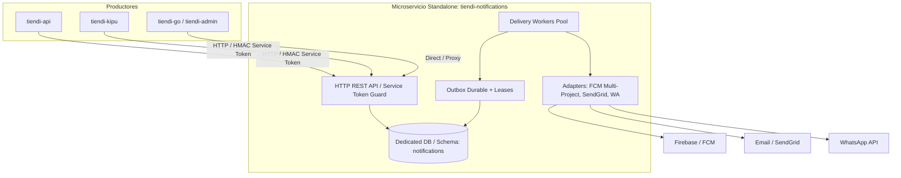

# Plan de Extracción y Corte — tiendi-notifications (Fase 8)

> **Decisión de Arquitectura:** El módulo central de notificaciones reside actualmente dentro del monolito modular `tiendi-api` con arquitectura hexagonal pura (cero claves foráneas hacia tablas de negocio, contratos Zod versionados y límites limpios). Este documento define el **procedimiento operativo estándar (SOP) y estrategia de corte seguro (Single-Authority)** para cuando el volumen de tráfico, SLA de latencia o requerimientos de despliegue independiente justifiquen extraerlo físicamente a un microservicio backend standalone.

---

## 1. Disparadores de Extracción (¿Cuándo ejecutar este plan?)

No se extrae por "moda" de microservicios; se extrae únicamente cuando se cumple al menos una de estas condiciones:
1. **Saturación de I/O o CPU:** El procesamiento de campañas masivas (Fase 6) o el drenado de outbox impacta la latencia de endpoints transaccionales críticos (pedidos, pagos, checkout).
2. **Ciclos de despliegue desacoplados:** Se requieren cambios frecuentes en integraciones de mensajería (FCM, WhatsApp, plantillas de email) sin arriesgar ni desplegar la API transaccional completa.
3. **Escalado asimétrico:** Los workers de entrega necesitan escalar horizontalmente a decenas de instancias para soportar ráfagas de millones de push sin requerir escalar el backend principal.

---

## 2. Topología de Destino y Principios de Diseño



### Principios no negociables durante la extracción
1. **Single Authority (Una sola autoridad emisora):** En ningún momento del tiempo debe existir más de un worker activo despachando entregas para el mismo evento.
2. **Idempotencia durable:** Todos los identificadores (`id`, `idempotencyKey`, `payloadHash`) deben migrarse exactamente iguales; las cancelaciones conservan sus tombstones (invariante A06).
3. **Consumo unificado:** `tiendi-api` reemplazará su `NotificationGateway` interno por un adaptador cliente HTTP que implemente exactamente la misma interfaz pública; el código consumidor (`OrdersService`, `ChatService`, `RidersService`) no cambia una sola línea.

---

## 3. Estrategia de Corte en 5 Etapas (Zero-Downtime)

| Etapa | Nombre | Acción principal | Riesgo | Mitigación |
|---|---|---|---|---|
| **E1** | Scaffold & Parity | Crear proyecto backend standalone con la misma suite de tests y contratos. | Nulo | Verificación 100% verde de contratos en CI. |
| **E2** | Replicación de Datos | Copia inicial de tablas R1–R7 y CDC / sincronización incremental hacia la nueva BD. | Bajo | Scripts de validación de sumas de verificación y conteos. |
| **E3** | Modo Sombra (Shadow) | El nuevo servicio recibe tráfico duplicado con adaptadores silenciados (`MOCK_DISPATCH=true`). | Mínimo | Compara decisiones y destinatarios sin emitir mensajes duplicados reales. |
| **E4** | Switchover (Corte) | Drenar outbox viejo, apagar workers viejos, transferir autoridad y enrutar tráfico. | Medio | Ventana de corte controlada (< 2 min), procedimiento de rollback probado. |
| **E5** | Estabilización & Retiro| Observación por 14 días y posterior retiro del código legacy en el monolito. | Nulo | Preservación de respaldos y métricas APM. |

---

## 4. Detalle de las Etapas Operativas

### Etapa 1: Scaffolding y Paridad de Contratos
1. Inicializar repositorio `tiendi-notifications` (NestJS 10, TypeScript, Prisma, Jest).
2. Copiar módulo `src/modules/notifications/` conservando la arquitectura hexagonal:
   - `contracts/` (Zod schemas y tipos DTO).
   - `domain/` (reglas de políticas, validación de quiet hours, timezones).
   - `application/` (`NotificationGateway`, `NotificationInstallationService`, `NotificationCampaignsService`, `NotificationPurgeService`, `NotificationMetricsService`, `NotificationOutboxService`).
   - `infrastructure/` (adaptadores multi-proyecto Firebase, email, WhatsApp, inbox).
   - `presentation/` (controladores REST).
3. Ejecutar la suite completa de 19 suites / 116 tests: debe pasar al 100% de forma autónoma.

### Etapa 2: Migración de Base de Datos
Tablas a extraer a la nueva base de datos dedicada (o esquema separado `notifications` en PostgreSQL):
- `NotificationInstallation`
- `NotificationPreference`
- `NotificationIdentityLink`
- `NotificationRequest`
- `NotificationDeliveryResult`
- `Notification` (inbox genérico)
- `NotificationCampaign`
- `NotificationCampaignRecipient`

#### Consulta de verificación de integridad previa a la migración:
```sql
-- Verificar que no existan trabajos pendientes en el outbox antes de iniciar snapshot
SELECT status, count(*) 
FROM "NotificationRequest" 
GROUP BY status;

-- Verificar recuento de instalaciones activas por aplicación
SELECT app, status, count(*) 
FROM "NotificationInstallation" 
GROUP BY app, status;
```

### Etapa 3: Modo Sombra (Shadow Testing)
1. Desplegar `tiendi-notifications` en ambiente de staging/producción con la variable:
   `NOTIFICATIONS_SHADOW_MODE=true`
2. En este modo:
   - Las solicitudes entrantes se validan, se resuelven destinatarios e instalaciones, y se escriben en la nueva BD.
   - Los adaptadores de salida (`FirebasePushAdapter`, `EmailChannelAdapter`, etc.) no emiten llamadas a proveedores externos; registran en auditoría el envío proyectado.
3. Se comparan logs entre ambos sistemas para confirmar paridad del 100% en:
   - Cantidad de destinatarios resueltos por campaña.
   - Tiempos de procesamiento y filtros de preferencias / quiet hours.

### Etapa 4: Ventana de Corte (Switchover)

#### Secuencia de ejecución (Tiempo estimado: < 5 minutos):
1. **Paso 4.1 — Pausar ingestión entrante en el monolito:**
   - Activar flag `NOTIFICATIONS_PROXY_TO_REMOTE=true` en `tiendi-api`. A partir de este segundo, toda llamada interna a `NotificationGateway` se redirige vía HTTP a `tiendi-notifications`.
2. **Paso 4.2 — Drenar el outbox antiguo:**
   - Esperar a que el worker local de `tiendi-api` procese cualquier trabajo que haya quedado en estado `PENDING` o `PROCESSING`.
   ```sql
   -- Debe retornar 0 filas antes de avanzar
   SELECT count(*) FROM "NotificationRequest" WHERE status IN ('PENDING', 'PROCESSING');
   ```
3. **Paso 4.3 — Desactivar workers en el monolito:**
   - Detener el cron / runner de `claimJobs` en `tiendi-api`.
4. **Paso 4.4 — Habilitar emisor en el nuevo servicio:**
   - Desactivar `NOTIFICATIONS_SHADOW_MODE` en `tiendi-notifications`.
   - Iniciar el pool de workers del nuevo microservicio.
5. **Paso 4.5 — Re-enrutar Kipu y clientes externos:**
   - Actualizar el balanceador de carga o DNS (`notifications.api.tiendi.app`) o la variable `TIENDI_NOTIFICATIONS_URL` en `tiendi-kipu` hacia el nuevo servicio.

---

## 5. Procedimiento de Rollback (Reversión Inmediata)

Si tras el corte en la Etapa 4 se detectan anomalías críticas (ej. fallos masivos en FCM, indisponibilidad de la nueva BD, latencia > 2000ms):

1. **Inmediato:** Apagar los workers en `tiendi-notifications` para garantizar el principio de Single Authority.
2. **Drenado:** Verificar qué solicitudes fueron aceptadas por el nuevo servicio consultando:
   ```sql
   SELECT id, status, "idempotencyKey", "createdAt" 
   FROM "NotificationRequest" 
   WHERE "createdAt" >= NOW() - INTERVAL '15 minutes';
   ```
3. **Reconciliación incremental:**
   - Exportar e insertar en la base de datos de `tiendi-api` las solicitudes y resultados creados durante la ventana del nuevo servicio (usando `ON CONFLICT (idempotencyKey) DO NOTHING` para no duplicar).
4. **Reactivación:**
   - Desactivar `NOTIFICATIONS_PROXY_TO_REMOTE` en `tiendi-api`.
   - Reactivar los workers de outbox locales de `tiendi-api`.
   - Restablecer DNS / URLs de Kipu a la ruta anterior.

---

## 6. Consultas de Reconciliación Post-Corte

Ejecutar a los 15 minutos, 2 horas y 24 horas del corte para certificar estabilidad:

```sql
-- 1. Verificar salud del outbox (no deben acumularse leases vencidos)
SELECT 
  count(*) FILTER (WHERE status = 'PENDING') AS pending,
  count(*) FILTER (WHERE status = 'PROCESSING' AND "leaseExpiresAt" < NOW()) AS stuck_leases,
  count(*) FILTER (WHERE status = 'PROCESSED' AND "processedAt" > NOW() - INTERVAL '1 hour') AS processed_last_hour,
  count(*) FILTER (WHERE status = 'FAILED' AND "updatedAt" > NOW() - INTERVAL '1 hour') AS failed_last_hour
FROM "NotificationRequest";

-- 2. Tasa de éxito por canal en la última hora
SELECT 
  channel, 
  status, 
  count(*) 
FROM "NotificationDeliveryResult" 
WHERE "createdAt" > NOW() - INTERVAL '1 hour'
GROUP BY channel, status;
```

---

## 7. Checklist de Salida para Declarar Cerrada la Extracción

- [ ] Repositorio `tiendi-notifications` en producción con health check en verde (`GET /notifications/operations/health`).
- [ ] Cero dependencias hacia `tiendi-api` en el nuevo servicio.
- [ ] `tiendi-api` interactúa exclusivamente mediante cliente HTTP remoto autenticado con `NOTIFICATIONS_SERVICE_TOKEN`.
- [ ] Kipu emitiendo y recibiendo recordatorios a través del nuevo host sin errores de autenticación ni timeout.
- [ ] Cron diario de purga R1–R7 (`POST /notifications/operations/purge`) configurado en el nuevo servicio.
- [ ] Procedimiento de rollback documentado y archivado.
- [ ] Código del módulo legado en `tiendi-api` retirado tras 14 días de estabilidad operativa.
