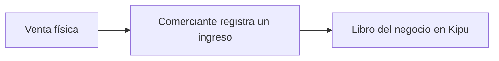
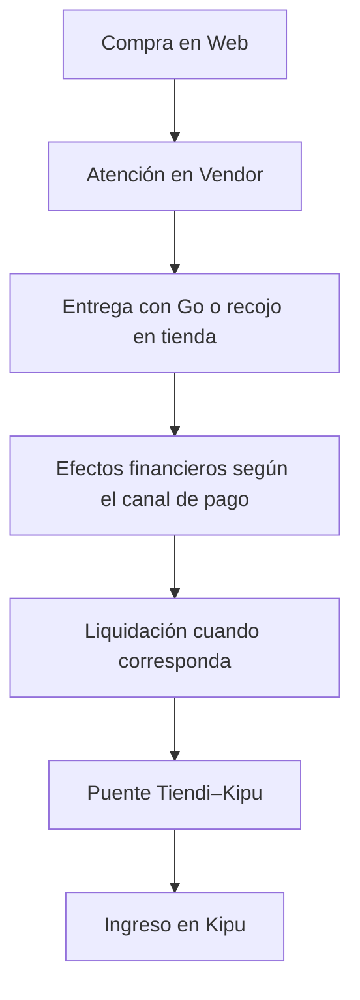

# Plan de pruebas end to end — Tiendi

> Fuentes revisadas el 2026-09-19. Reorganización documental: 2026-09-20, sin revalidación funcional ni ejecución de pruebas.

Este es el **índice general** de pruebas por resultado de negocio de Web, Vendor, Go, Admin, Kipu y sus servicios. Cada caso tiene ahora su propio archivo para ampliarlo sin hacer crecer este plan.

## Cómo retomar

1. Revisar [límites y criterios compartidos](E2E/REFERENCIAS-Y-CRITERIOS.md).
2. Preparar entorno aislado, versiones y datos conocidos sin dinero ni credenciales reales.
3. Completar y ejecutar [KIPU-LOCAL-001](E2E/CASOS/KIPU-LOCAL-001.md), luego [ORDER-DELIVERY-001](E2E/CASOS/ORDER-DELIVERY-001.md).
4. Crear un [registro de ejecución](E2E/PLANTILLAS.md#registro-de-ejecución) independiente del caso.
5. Incorporar variantes de pago, liquidación y cierre según sus dependencias.

**El caso describe lo esperado. La ejecución documenta lo observado.** Un test existente o una revisión de código no acreditan una prueba aprobada.

## Fronteras del negocio

### Venta presencial registrada en Kipu

Kipu registra movimientos de dinero. El modelo revisado no contiene líneas de venta por producto, cantidades ni stock. Por tanto, el caso inicial es **registrar el ingreso de una venta**, no ejecutar una venta POS.

Esta operación no debe interpretarse como la creación automática de un pedido Tiendi, una disminución de inventario o un asiento en el ledger de la plataforma.

### Pedido y liquidación de Tiendi

Go participa cuando el flujo requiere repartidor. El puente Tiendi → Kipu importa **liquidaciones**, no cada pedido. No deben registrarse ambos como si fueran dos ingresos independientes por el mismo hecho económico.

El libro del comerciante y el ledger de Tiendi tienen alcances diferentes. Tampoco todos los canales de pago producen los mismos movimientos en cuentas de la plataforma: cada variante necesita expectativas propias.

Referencias: [integración Tiendi–Kipu](INTEGRACION-TIENDI.md), [flujo del dinero](FLUJO_DINERO.md), [facturación y contabilidad](FACTURACION_Y_CONTABILIDAD.md).

## Catálogo y fichas individuales

Todos los casos están **sin ejecutar** y tienen un diagrama de secuencia en su ficha. KIPU-LOCAL-001 conserva además sus diagramas de flujo y estados. Los otros trece son borradores específicos con pasos y secuencias propuestos, pendientes de validar contra la implementación.

| ID | Prioridad | Escenario | Aplicaciones/superficies | Resultado principal |
|---|---|---|---|---|
| [KIPU-LOCAL-001](E2E/CASOS/KIPU-LOCAL-001.md) | Alta | Registrar ingreso de venta presencial | Kipu y su API | Ingreso persistido una sola vez y resumen correcto |
| [KIPU-SYNC-001](E2E/CASOS/KIPU-SYNC-001.md) | Alta | Registrar sin conexión y reconectar | Kipu y su API | Operación local sincronizada sin duplicación |
| [ORDER-PICKUP-001](E2E/CASOS/ORDER-PICKUP-001.md) | Alta | Comprar con recojo en tienda | Web, Vendor, API | Pedido atendido y entregado; pago verificado aparte |
| [ORDER-DELIVERY-001](E2E/CASOS/ORDER-DELIVERY-001.md) | Alta | Comprar con entrega a domicilio | Web, Vendor, Go, API | Pedido, recojo y entrega coherentes entre actores |
| [PAYMENT-CASH-001](E2E/CASOS/PAYMENT-CASH-001.md) | Alta | Variante de pago en efectivo | Apps participantes según el flujo | Cobro y custodia conciliables según reglas del canal |
| [PAYMENT-WALLET-001](E2E/CASOS/PAYMENT-WALLET-001.md) | Alta | Variante Yape/Plin | Apps participantes según el flujo | Confirmación y efectos propios del canal, sin inventar asientos de plataforma |
| [PAYMENT-CARD-001](E2E/CASOS/PAYMENT-CARD-001.md) | Alta | Variante tarjeta | Web, API y pasarela de pruebas | Pago confirmado y efectos financieros correctos |
| [SETTLEMENT-KIPU-001](E2E/CASOS/SETTLEMENT-KIPU-001.md) | Alta | Liquidar al vendedor e importar en Kipu | API Tiendi, API Kipu, Kipu | Liquidación e ingreso correlacionados, sin duplicación |
| [SETTLEMENT-RETRY-001](E2E/CASOS/SETTLEMENT-RETRY-001.md) | Alta | Reintentar una liquidación importada | APIs Tiendi y Kipu | Idempotencia y errores de contrato verificables |
| [ORDER-REJECT-001](E2E/CASOS/ORDER-REJECT-001.md) | Media | Rechazar un pedido | Web, Vendor, API | Estado, notificación y efectos esperados |
| [ORDER-CANCEL-001](E2E/CASOS/ORDER-CANCEL-001.md) | Media | Cancelar según etapa permitida | Apps participantes, API | Transiciones válidas y efectos compensatorios cuando correspondan |
| [REFUND-001](E2E/CASOS/REFUND-001.md) | Alta | Reembolsar una operación elegible | API y superficies disponibles | Compensación trazable sin duplicar devolución |
| [ACCOUNTING-CLOSE-001](E2E/CASOS/ACCOUNTING-CLOSE-001.md) | Alta | Ejecutar controles de cierre | API contable; futura UI Admin | Saldos, asientos y controles omitidos explícitos |
| [ACCESS-TENANT-001](E2E/CASOS/ACCESS-TENANT-001.md) | Alta | Aislar datos por negocio y rol | Kipu, Vendor, Admin y APIs | Un actor no accede a datos ajenos ni a operaciones no autorizadas |

## Estructura actual y navegación

| Ruta | Contenido y uso |
|---|---|
| PLAN-PRUEBAS-E2E.md | Este índice: alcance, catálogo y guía de continuación |
| [E2E/CASOS/](E2E/CASOS/) | 14 archivos ID.md, uno por caso, enlazados en el catálogo |
| [E2E/PLANTILLAS.md](E2E/PLANTILLAS.md) | Fichas reutilizables de caso y registro de ejecución |
| [E2E/REFERENCIAS-Y-CRITERIOS.md](E2E/REFERENCIAS-Y-CRITERIOS.md) | Hallazgos, límites, criterios financieros y referencias de código/documentación |
| [E2E/EJECUCIONES/README.md](E2E/EJECUCIONES/README.md) | Cómo guardar resultados y evidencias por corrida, sin resultados inventados |

Los datos, precondiciones, pasos, comprobaciones, limpieza y pendientes específicos viven en cada ficha. Cada ficha enlaza de regreso a este índice. No se crearon README general, matriz o archivo de datos duplicados: el catálogo está aquí y los datos requeridos están en cada caso.

### Cómo ampliar un caso o agregar otro

1. Para ampliar un caso existente, editar su archivo y conservar su ID, fuentes y límites.
2. Para un resultado de negocio distinto, copiar la [plantilla](E2E/PLANTILLAS.md#ficha-del-caso) a E2E/CASOS/NUEVO-ID.md.
3. Agregar enlace de vuelta al plan con ../../PLAN-PRUEBAS-E2E.md y una fila en el catálogo de este documento.
4. Preparar datos propios, reglas de negocio, plazos de espera y limpieza. Separar variantes de pago, errores y reintentos.
5. Identificar alcance real: smoke UI, UI con mocks, integración API o E2E integrado. Declarar requisitos no implementados o pendientes.
6. Conservar las ejecuciones en archivos separados, con enlace al caso y su versión. Nunca reemplazar esperado por obtenido.
7. Validar enlaces y renderizado. Solo diagramas usan bloques Mermaid, las plantillas son Markdown normal.

## Límites que no deben perderse

- Kipu local registra dinero, no venta POS ni stock. El resumen necesita conexión.
- El puente importa liquidaciones, no cada pedido. No duplicar ambos como ingresos del mismo hecho económico.
- Dinero en Admin estaba pendiente. Las pruebas de API no equivalen a recorridos de esa interfaz.
- MANUAL-* / MOCK-* y SETTLED no prueban transferencia bancaria real.
- Conciliación ok con skipped no acredita todos los controles. Registrar omisiones.
- Revalidar reglas por nombre y fuente: algunos documentos y tests históricos no reflejan un E2E vigente.

Consultar el [detalle de hallazgos y contratos](E2E/REFERENCIAS-Y-CRITERIOS.md) antes de fijar expectativas financieras.

## Pendientes para la próxima sesión

- [ ] Confirmar entorno, versiones y datos repetibles con limpieza segura.
- [ ] Ejecutar KIPU-LOCAL-001 y crear su primer registro.
- [ ] Resolver políticas y contratos pendientes de los otros trece borradores.
- [ ] Completar el recorrido Web → Vendor → Go separando creación, cobro, recojo y entrega.
- [ ] Fijar expectativas por canal, liquidación y cierre con bloqueos explícitos.
- [ ] Ampliar negativos y permisos por negocio/rol.
- [ ] Actualizar resultados únicamente con evidencia de ejecución.
