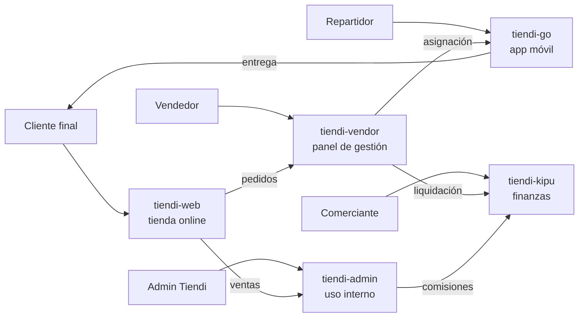
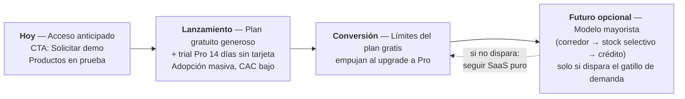
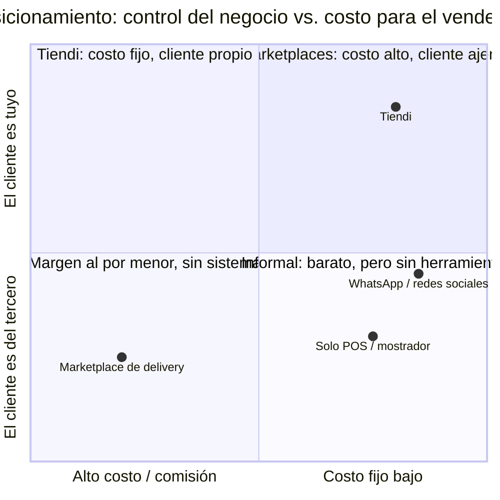

---
tags:
  - tiendi
  - productos
  - negocio
  - comercializacion
  - resumen
aliases:
  - Qué es Tiendi
  - Productos y Comercialización Tiendi
---

# Tiendi — Qué hace, productos, prestaciones y comercialización

> [!IMPORTANT]
> **Estado del proyecto: pre-lanzamiento.** No hay tiendas activas ni transacciones reales. Los productos están en fase de prueba/acceso anticipado. Este documento resume de forma consolidada lo definido en [[MODELO_NEGOCIO]], [[MODULOS_SISTEMA_TIENDI]], [[INTEGRACION-TIENDI]], [[TIENDI-GO/FUNCIONALIDADES]] y [[TIENDI-SITE/PLAN-LANDING-PRODUCTOS]] (fuente autoritativa de planes: [[WEB-VENDOR/VENDOR-PANEL-DEFINITIVO]]).

## Índice

1. [Qué hace Tiendi](#1-qué-hace-tiendi)
2. [Productos de la suite](#2-productos-de-la-suite)
   - [2.1 tiendi-web — la tienda online del cliente final](#21-tiendi-web--la-tienda-online-del-cliente-final)
   - [2.2 tiendi-vendor — el panel del vendedor](#22-tiendi-vendor--el-panel-del-vendedor)
   - [2.3 tiendi-go — la app de repartidores](#23-tiendi-go--la-app-de-repartidores)
   - [2.4 tiendi-kipu — las finanzas del comerciante](#24-tiendi-kipu--las-finanzas-del-comerciante)
   - [2.5 tiendi-admin — plataforma interna (no público)](#25-tiendi-admin--plataforma-interna-no-público)
   - [2.6 Prestaciones transversales de la plataforma](#26-prestaciones-transversales-de-la-plataforma)
3. [Cómo se comercializa](#3-cómo-se-comercializa)
   - [3.1 Estructura de planes (fuente autoritativa)](#31-estructura-de-planes-fuente-autoritativa)
   - [3.2 Política de promoción y gratuidad](#32-política-de-promoción-y-gratuidad)
4. [Personas y segmentos objetivo](#4-personas-y-segmentos-objetivo)
   - [4.1 Buyer personas](#41-buyer-personas)
   - [4.2 Segmento secundario (lado de oferta)](#42-segmento-secundario-lado-de-oferta)
5. [Mensajería comercial](#5-mensajería-comercial)
   - [5.1 Elevator pitch](#51-elevator-pitch)
   - [5.2 Taglines](#52-taglines)
   - [5.3 Benefits (no features)](#53-benefits-no-features)
   - [5.4 Copy permitido y prohibido](#54-copy-permitido-y-prohibido)
   - [5.5 CTAs por fase](#55-ctas-por-fase)
6. [Preguntas frecuentes (FAQ)](#6-preguntas-frecuentes-faq)
7. [Posicionamiento competitivo](#7-posicionamiento-competitivo)
8. [Qué cubre cada producto — resumen en una línea](#8-qué-cubre-cada-producto--resumen-en-una-línea)
9. [Competencia](#9-competencia)
   - [9.1 Mapa por capa del stack](#91-mapa-por-capa-del-stack)
   - [9.2 Ventajas defendibles de Tiendi](#92-ventajas-defendibles-de-tiendi)
   - [9.3 Riesgos competitivos](#93-riesgos-competitivos)
10. [Ver también](#ver-también)

## 1. Qué hace Tiendi

**Tiendi** es una plataforma SaaS de e-commerce **multi-tienda** para el mercado peruano que conecta tiendas locales (bodegas, minimarkets, comercios de barrio) con sus clientes a través de **búsqueda geolocalizada**, catálogo en línea, compra, pago y **entrega con repartidores propios**.

En una frase: *"Un ecosistema completo para vender online: tienda, gestión, delivery y finanzas"*.

Cada tienda es un **tenant independiente** (multi-tenant con aislamiento de datos): tiene su propio catálogo, horarios, zonas de delivery, medios de pago y estadísticas, dentro de una sola plataforma.

---

## 2. Productos de la suite

La suite pública son **4 productos** + 1 herramienta interna:

| Producto | Qué es | Usuarios | Stack |
|---|---|---|---|
| **tiendi-web** | Tienda online pública donde el cliente descubre y compra | Clientes finales | Angular |
| **tiendi-vendor** | Panel de gestión del vendedor (SPA en `/vendor`) | Dueños de tienda y empleados | Angular |
| **tiendi-go** | App móvil de repartidores | Repartidores independientes | Expo / React Native |
| **tiendi-kipu** | Gestión financiera del comerciante (libro de gastos, ventas, fiados, liquidaciones) | Comerciantes | PWA Angular + API NestJS/SQLite |
| *tiendi-admin* | *Administración interna de la plataforma* | *Solo equipo Tiendi* | *Angular — NO se publica en marketing* |

### 2.1 tiendi-web — la tienda online del cliente final

Cubre todo el ciclo de compra del consumidor:

- **Búsqueda geolocalizada**: encuentra tiendas cercanas (radio ~5 km) con mapa interactivo y lista; filtra por abierto/cerrado, distancia, medio de pago, marca y presentación.
- **Catálogo por tienda**: categorías y subcategorías, grid de productos, búsqueda interna, precio con descuento, badges de oferta, favoritos, ordenamiento y paginación.
- **Carrito persistente** (sidebar) con historial de pedidos recientes y estados visibles.
- **Checkout en 2 pasos**: productos → despacho y pago. Despacho a domicilio o recojo en tienda. Medios de pago peruanos: **efectivo, transferencia, Yape, Plin y tarjeta** (Culqi/Niubiz).
- **Gestión de pedidos**: "Mis pedidos", detalle, repetir pedido, buscador por número.
- **Chat en tiempo real** con la tienda (WebSockets), con plantillas rápidas de mensaje.
- Favoritos, newsletter, página de vendedores ("¿Quieres vender?"), términos y condiciones, libro de reclamaciones.

### 2.2 tiendi-vendor — el panel del vendedor

Cubre la operación diaria del negocio:

- **Gestión de catálogo**: CRUD de productos con imágenes (Cloudinary), marcas, categorías, precios y **captura de GTIN/EAN** con validación y vinculación al catálogo maestro (`MasterProduct`).
- **Inventario**: entradas/salidas/ajustes, alertas de stock bajo, prevención de sobreventa.
- **Gestión de pedidos**: confirmación, rechazo, máquina de estados, asignación de repartidores.
- **Promociones y cupones**: descuentos por producto, categoría o código, con vigencias y límites.
- **Dashboard de ventas**: ventas por período, top productos, ticket promedio, conversión.
- **Configuración de tienda**: horarios, zonas de cobertura, medios de pago, empleados con permisos (RBAC).
- **Suscripción**: gestión del plan, cobro, recordatorios de vencimiento, opt-in de pago con tarjeta.
- **Onboarding**: registro con RUC/DNI, aceptación de términos y condiciones (versionada).

### 2.3 tiendi-go — la app de repartidores

La pieza logística: flujo end-to-end desde la notificación del pedido hasta la entrega:

- **Recepción de pedidos** por push, aceptar/rechazar, cola multi-pedido.
- **Flujo de entrega** con máquina de estados: recogida en tienda con QR, navegación GPS en tiempo real, **prueba de entrega (POD)** con foto/firma y OTP, gestión de incidentes.
- **Ganancias y pagos**: wallet interno, liquidación bancaria, manejo de efectivo (COD), comprobantes PDF.
- **Comunicación** con tienda y cliente (chat + notificaciones).
- **Estadísticas**: historial, heatmaps de zonas, horarios pico, calificaciones.
- **Incentivos y gamificación**: programa de incentivos, sistema de puntuación, logros, "repartidores de confianza", admin de flota.

### 2.4 tiendi-kipu — las finanzas del comerciante

PWA offline-first de **gestión financiera del negocio** (puede usarse independiente de la plataforma):

- Registro de **gastos, ingresos y ventas de mostrador** (incluye Yape/Plin P2P, que no pasa por la plataforma).
- **Fiados y liquidaciones**, cuentas por negocio, pagos recurrentes.
- **Multi-tenancy por usuario**: cada comerciante ve solo su libro; vinculación opcional con su tienda Tiendi vía **puente kipu** (las liquidaciones de Tiendi se emiten automáticamente hacia el libro de kipu, con outbox + reintentos, desplegado y verificado en producción).

### 2.5 tiendi-admin — plataforma interna (no público)

Administración global de Tiendi: aprobación de tiendas, gestión de planes de suscripción, estadísticas globales (GMV, tiendas activas, DAU/MAU), moderación y sanciones. **No se comercializa ni se muestra en la landing.**

### 2.6 Prestaciones transversales de la plataforma

| Prestación | Detalle |
|---|---|
| **Multi-tenant** | Aislamiento de datos por tienda; soporte objetivo 10.000+ tiendas |
| **Pagos peruanos** | Yape, Plin, efectivo/contraentrega (COD), transferencia, tarjeta vía Culqi/Niubiz |
| **Ledger de doble entrada** | Contabilidad auditable por pedido, liquidaciones y conciliación |
| **Notificaciones multicanal** | Push (FCM/Expo, canal primario), chat in-app, email (SendGrid), SMS (Twilio, fallback), WhatsApp |
| **Chat en tiempo real** | Cliente ↔ tienda ↔ repartidor vía WebSockets |
| **RBAC** | Super Admin / Owner de tienda / Empleado / Cliente, permisos granulares |
| **Catálogo maestro** | Identidad de productos por GTIN/EAN entre tiendas; demanda agregada con k-anonimato (k ≥ 3) |
| **Facturación SUNAT** | Boletas/facturas electrónicas en planes pagos |
| **Analytics** | Dashboards por tienda y globales; PostHog |
| **Seguridad** | JWT + rotación de refresh, revocación de sesiones, rate limiting, observabilidad (Prometheus/Grafana/Loki/Sentry) |
| **Suscripciones** | Cobro recurrente con dunning, prorrateo, período de gracia y estado `past_due` |

---

## 3. Cómo se comercializa

> [!IMPORTANT]
> **Decisión de monetización (2026-08-26): Tiendi se monetiza exclusivamente por suscripción SaaS. La comisión por venta queda eliminada como concepto** — no existe take rate ni porcentaje sobre el GMV. El neto del vendedor es el subtotal de su venta. Motivo: la venta en mostrador y el Yape/Plin P2P (la mayoría del negocio real de las tiendas) nunca atraviesan la plataforma, y el margen por pedido con comisión era de centavos tras el fee de pasarela.

### 3.1 Estructura de planes (fuente autoritativa)

| Plan | Precio | Productos | Pedidos/mes | Analytics | Soporte | Usuarios | SUNAT |
|---|---|---|---|---|---|---|---|
| **Gratuito** | S/ 0 | 20 | 50 | Básico | Email | 1 | ❌ |
| **Pro** ⭐ (destacado) | S/ 49/mes | 200 | Ilimitado | Avanzado | Chat | 5 | ✅ |
| **Enterprise** | S/ 149/mes | Ilimitado | Ilimitado | Full + Export | Dedicado | Ilimitado | ✅ |

- **Trial de bienvenida**: 14 días gratis del Plan Pro **sin tarjeta**, al completar el onboarding (1 vez por tienda).
- **Cobro**: mensual o anual (descuento), por defecto **fuera de pasarela** (transferencia/Yape/Plin, sin fee). El cobro con tarjeta vía Culqi es **opt-in** y exige que la tienda acepte explícitamente el fee de pasarela visible antes del primer cargo.
- El plan define **límites y features** (`SubscriptionPlan`: `price`, `annualPrice`, `billingCycle`, límites, `features`); vencimiento con recordatorios D-7/3/1 y 3 días de gracia antes de `past_due`.

### 3.2 Política de promoción y gratuidad

> [!CAUTION]
> **Nunca prometer "gratis para siempre".** El plan gratuito es **generoso y reversible** (decisión D7): se comunica como *"Plan Starter gratis"*, con posibilidad de ajustar límites con aviso previo. Prometer permanencia es una promesa que no se puede retirar sin costo reputacional.

Estrategia comercial por fases:

- **Fase actual**: landing pública informativa con badge *"Versión de prueba — acceso anticipado"*; el CTA único es **"Solicitar demo"** (WhatsApp `+51 930 908 749` / `tiendipe@gmail.com` / dominio `tiendi.pe`).
- **Adquisición**: onboarding denso y geográficamente concentrado en 2–3 zonas acotadas (decisión D6), sin filtro por tamaño de tienda.
- **Palancas adicionales de ingreso (futuras, prioridad baja/media)**: publicidad y posicionamiento en búsqueda, fees de repartidor (retiro instantáneo), servicios financieros (adelanto de liquidación / crédito de reposición) y venta mayorista — esta última condicionada a un **gatillo objetivo**: que una categoría de nicho concentre ≥ 25% del GMV agregado (k ≥ 3) por dos meses consecutivos en la zona objetivo.
- **Margen de delivery**: se mantiene el `platformFeePct` sobre la tarifa del repartidor, pero es **economía de entrega**, no monetización sobre las ventas.

---

## 4. Personas y segmentos objetivo

> [!NOTE]
> Derivado de las decisiones D6 (concentración geográfica, sin filtro por tamaño) y §10 de [[MODELO_NEGOCIO]] (segmento con mejor relación riesgo/retorno: **intermedio en crecimiento**).

**Segmento objetivo (D6)**: comercios locales peruanos de perfil **intermedio-informal en crecimiento**, captados de forma densa en 2–3 zonas geográficas acotadas. Sin exclusión por tamaño ni por categoría.

### 4.1 Buyer personas

| Persona | Perfil | Dolor principal | Propuesta de valor Tiendi | Producto clave |
|---|---|---|---|---|
| **La bodega del barrio** | Dueña de bodega/minimarket. Vive de la venta en mostrador y cobra con Yape/Plin. Hace delivery informal ("el motoquero de siempre"). No tiene sistema ni catálogo. | Pierde ventas cuando no está en la tienda; no sabe cuánto gana; el delivery es desorganizado. | Tu tienda online con búsqueda por cercanía, delivery con repartidores de la red y tus finanzas en un solo lugar — **sin comisión por tus ventas**. | tiendi-web + tiendi-go + tiendi-kipu |
| **El emprendedor digital** | Ya vende por WhatsApp/Instagram. Pedidos por chat manual, catálogo en fotos, cobros coordinados uno por uno. | Todo es manual; no hay control de inventario ni de pedidos; se le pierden chats. | Formaliza lo que ya hace: catálogo con inventario real, checkout con pagos peruanos (Yape/Plin/tarjeta/efectivo) y pedidos ordenados. | tiendi-web + tiendi-vendor |
| **El negocio en crecimiento** | Tienda con empleados, necesita reportes, facturación SUNAT y varios usuarios operando. | Sin métricas ni separación de roles; facturación manual. | Analytics avanzado, RBAC con 5+ usuarios, facturación electrónica y soporte prioritario. | Plan Pro / Enterprise |

### 4.2 Segmento secundario (lado de oferta)

- **Repartidores** (motos, bicis, a pie): no pagan suscripción; se suman a la red de tiendi-go por ganancias transparentes, liquidación automática e incentivos. Son parte del valor vendido a las tiendas ("delivery incluido con nuestra red").

---

## 5. Mensajería comercial

### 5.1 Elevator pitch

> **Tiendi** es el ecosistema que convierte tu tienda de barrio en una tienda online con delivery propio: vendes, gestionas, entregas y controlas tus finanzas en un solo lugar — y **te quedás con el 100% de tus ventas, porque no cobramos comisión**.

### 5.2 Taglines

| Contexto | Tagline |
|---|---|
| Ecosistema (hero de la landing) | *"Un ecosistema completo para vender online: tienda, gestión, delivery y finanzas"* |
| tiendi-web | *"Tu tienda de siempre, ahora cerca de todos"* |
| tiendi-vendor | *"Gestioná tu negocio desde el celular"* |
| tiendi-go | *"Entregás, ganás, te liquidás"* |
| tiendi-kipu | *"Las cuentas de tu negocio, en orden"* |
| Diferenciador principal | *"Sin comisión por venta. Solo tu suscripción."* |

### 5.3 Benefits (no features)

| Feature técnica | Beneficio para el vendedor |
|---|---|
| Búsqueda geolocalizada + mapa | Te encuentran los clientes de tu zona cuando buscan lo que vendés |
| Sin comisión por venta (neto = subtotal) | Lo que vendés es tuyo; pagás un precio fijo, no un % de tu esfuerzo |
| Red de repartidores (tiendi-go) | Entregás sin contratar ni coordinar "el motoquero" por teléfono |
| Checkout con Yape/Plin/efectivo/tarjeta | Tu cliente paga como ya paga todos los días |
| Chat en tiempo real | Respondés consultas y coordinás entregas sin salir de la app |
| tiendi-kipu integrado | Sabés cuánto entra y cuánto sale — incluidas las ventas de mostrador y fiados |
| Planes por suscripción con límites claros | Sabés cuánto pagás de antemano; crecés de plan cuando tu negocio lo pida |

### 5.4 Copy permitido y prohibido

> [!CAUTION]
> Reglas de copy extraídas de las decisiones del proyecto. Incumplirlas genera promesas que no se pueden sostener.

| ✅ Se puede decir | ❌ No se puede decir |
|---|---|
| "Plan Starter gratis" | "Gratis para siempre" (decisión D7) |
| "Versión de prueba — acceso anticipado" (badge) | Prometer disponibilidad general o URLs públicas |
| "14 días del Plan Pro sin tarjeta" | "Premium gratis" sin aclarar que es trial de 14 días |
| "Sin comisión por venta" | "Cero costos" (la suscripción y el fee de delivery existen) |
| "Tus datos se usan solo en agregados" | Cualquier insinuación de usar datos de una tienda individual (k ≥ 3) |
| CTA "Solicitar demo" (fase actual) | CTA "Registrate ya" mientras no haya signup público |

### 5.5 CTAs por fase

| Fase | CTA primario | CTA secundario |
|---|---|---|
| **Ahora (pre-lanzamiento)** | "Solicitar demo" → WhatsApp `+51 930 908 749` | "Conocer los productos" (ancla) |
| **Lanzamiento** | "Crear tu tienda gratis" | "Probar el Plan Pro 14 días sin tarjeta" |
| **Conversión** | "Subir al Plan Pro" (cuando toque límites del gratis) | "Hablá con soporte" (chat) |

---

## 6. Preguntas frecuentes (FAQ)

> [!NOTE]
> Respuestas derivadas estrictamente de las fuentes del proyecto. Para uso en material comercial, pasar por revisión de copy antes de publicar.

**¿Es gratis?**
Hay un plan gratuito con 20 productos y 50 pedidos por mes, para siempre disponible al registrarte. Si tu negocio crece, pasás al Plan Pro (S/ 49/mes) o Enterprise (S/ 149/mes). Además, al completar el onboarding tenés 14 días del Plan Pro sin tarjeta.

**¿Cobran comisión por cada venta?**
No. Tiendi no cobra ningún porcentaje sobre tus ventas — lo que vendés es tuyo. Nuestro único ingreso es tu suscripción mensual o anual. La tarifa de delivery se le paga al repartidor que entrega tu pedido.

**¿Necesito tarjeta para probar el Plan Pro?**
No. El trial de 14 días del Plan Pro se activa al completar el onboarding, sin tarjeta.

**¿Cómo pagan mis clientes?**
Como siempre pagan: Yape, Plin, efectivo o contraentrega, transferencia y tarjeta. Tú eliges qué medios aceptas en tu tienda.

**¿Quién entrega los pedidos?**
La red de repartidores de Tiendi (app tiendi-go): reciben el pedido, recogen en tu tienda con QR, navegan con GPS y entregan con prueba de entrega. También puedes ofrecer recojo en tienda.

**¿Puedo vender en mostrador como siempre?**
Sí — y recomendamos que no lo dejes de hacer. Con tiendi-kipu registrás tus ventas de mostrador, fiados y gastos en el mismo libro donde te llegan las liquidaciones de tus ventas online.

**¿Emito facturas y boletas?**
Sí, con facturación electrónica SUNAT en los planes Pro y Enterprise.

**¿Qué pasa con mis datos y los de mis clientes?**
Cada tienda es un tenant aislado. Los datos de venta solo se usan en agregados de la plataforma con anonimato estadístico (ningún dato proviene de menos de 3 tiendas) y nunca de forma individualizada.

**¿Puedo usar tiendi-kipu sin estar en Tiendi?**
Sí, kipu funciona como PWA independiente; si luego abres tienda en Tiendi, se vinculan automáticamente.

---

## 7. Posicionamiento competitivo

> [!NOTE]
> El vendedor peruano hoy tiene tres alternativas reales: seguir informal (WhatsApp/redes), entrar a un marketplace de delivery, o no vender online. Tiendi se posiciona como la **tercera vía**: infraestructura propia sin intermediar la relación con el cliente.

| | **Tiendi** | WhatsApp / redes sociales | Marketplace de delivery |
|---|---|---|---|
| **Costo** | Suscripción fija, **sin comisión por venta** | Gratis, pero todo manual | Comisión sobre cada venta |
| **Catálogo** | Formal: productos, precios, inventario, ofertas | Fotos sueltas en estados/stories | Sí, pero gestionado bajo reglas del marketplace |
| **Delivery** | Red propia de repartidores con tracking | Lo coordinás vos por teléfono | El del marketplace |
| **Relación con el cliente** | **Tuya**: tu tienda, tu marca, tus datos | Tuya, pero sin sistema detrás | Del marketplace: te compara con tus competidores |
| **Pagos** | Yape/Plin/efectivo/tarjeta integrados en checkout | Coordinás el cobro chat por chat | Gestionado por el marketplace |
| **Finanzas** | kipu: mostrador, fiados, gastos y liquidaciones en un libro | Manual o en cuaderno | Extractos del marketplace, sin mostrador |
| **Ventas de mostrador** | Cubiertas (kipu) | El negocio real, sin sistema | No contempladas |

**Mensaje de posicionamiento en una línea**: *"Los marketplaces te cobran por venta y le presentan tu cliente a tus competidores. WhatsApp es gratis pero todo sale de tu cabeza. Tiendi te da la tienda, el delivery y las finanzas por un precio fijo — sin comisión y con tu cliente tuyo."*

---

## 8. Qué cubre cada producto — resumen en una línea

| Producto | Cubre | Hace |
|---|---|---|
| **tiendi-web** | Al cliente comprador | Descubre tiendas cercanas en el mapa, navega el catálogo, compra en 2 pasos, paga (Yape/Plin/tarjeta/efectivo), chatea y sigue sus pedidos |
| **tiendi-vendor** | Al dueño de tienda | Crea su tienda, gestiona catálogo con GTIN, inventario, pedidos, promociones, empleados, estadísticas y su suscripción |
| **tiendi-go** | Al repartidor | Recibe pedidos, recoge con QR, navega GPS, entrega con prueba (POD/OTP), cobra COD, ve ganancias y se liquida |
| **tiendi-kipu** | Al comerciante | Lleva las finanzas del negocio: ingresos, gastos, fiados, ventas de mostrador y liquidaciones de Tiendi en un libro propio |
| **tiendi-admin** *(interno)* | Al equipo Tiendi | Aprueba tiendas, gestiona planes, modera y monitorea métricas globales de la plataforma |

---

## 9. Competencia

> [!CAUTION]
> **Este análisis viene de conocimiento del modelo de negocio, no de una investigación de mercado en vivo.** Nombres y categorías son sólidos, pero **precios, comisiones vigentes y presencia actual en Perú deben verificarse** antes de usar esta sección en material público o decisiones de pricing. Actualizar al momento de armar cualquier pieza comparativa.

No existe un único clon de Tiendi: lo raro en el mercado es la **combinación** de las 4 piezas (tienda online + panel + red de repartidores propia + finanzas del comerciante). Cada competidor cubre una o dos.

### 9.1 Mapa por capa del stack

| Capa | Competidores | Modelo | Frente a Tiendi |
|---|---|---|---|
| **Marketplaces de delivery** | PedidosYa, Rappi, Didi Food | Comisión por venta; el cliente es del marketplace | Comiten por el cliente final (ver §7). Su debilidad: comisión alta + comparación directa con competidores + no cubren mostrador |
| **SaaS de tienda online (sin delivery)** | Tiendanube, Shopify, Jumpseller, VTEX, WooCommerce | Suscripción mensual | Dan tienda + panel, pero el delivery lo resuelve el vendedor; sin Yape/Plin nativo ni chat cliente-tienda integrado |
| **SaaS con red de delivery incluida** | **Justo** (Chile, opera en Perú) | Suscripción + comisión | **El competidor más directo**: tienda + repartidores propios. Enfocado a restaurantes/retail más grande — el hueco de la bodega de barrio sigue abierto |
| **Last-mile on demand** | Chazki, Urbaner (Perú), Shippify, Lalamove | Courier por pedido | Más **partner potencial** que competidor: red complementaria donde Tiendi no tenga repartidores |
| **Finanzas/POS para bodega** | Treinta (gratis), Alegra, Bsale, Siigo | Freemium o suscripción | Comiten con tiendi-kipu. **Treinta es presión real por ser gratuito** — pero ninguna trae venta online con delivery integrada |
| **B2B abarrotes/distribución** | Chiper (Colombia), SIMA (México) | Mayorista con datos | Valida la tesis mayorista de [[MODELO_NEGOCIO]] §7–§11. **En Perú no hay incumbente claro con software de tienda incluido** — ahí está el hueco |

### 9.2 Ventajas defendibles de Tiendi

1. **Sin comisión por venta** — precio fijo de suscripción frente al take rate de marketplaces y de Justo. Es el mensaje más diferenciador (§5.3).
2. **Cubre la venta en mostrador** (kipu: fiados, Yape/Plin P2P) — nadie del grupo anterior contemple la operación real de la bodega.
3. **Cliente propio, marca propia** — a diferencia del marketplace, la tienda no compite dentro de un listado comparativo.
4. **Delivery propio integrado al flujo del pedido** (tiendi-go con POD/OTP) — no es un courier pegado por API.
5. **Hueco de mercado**: las piezas que en Perú se venden separadas (tienda, courier, facturación, libro de fiados) están integradas en un solo ecosistema con precio de barrio.

### 9.3 Riesgos competitivos

| Riesgo | Detalle | Mitigación |
|---|---|---|
| **Justo baja al segmento bodega** | Ya opera en Perú con modelo similar | Velocidad de adopción local + precio de entrada (plan gratuito) |
| **Treinta u otro freemium se expande a Perú** | Presiona el rol de kipu como gancho | kipu no es solo registro: está conectado al flujo de liquidaciones de la plataforma |
| **Un marketplace lanza "tienda propia"** | PedidosYa/Rappi ya tienen herramientas de tienda para sus socios | Su incentivo es la comisión: jamás abandonarán el take rate |
| **WhatsApp B2C se formaliza** (catálogos + pagos) | Meta mejora la experiencia informal que hoy es el estado del arte del competidor más real | Tiendi es formalización con delivery y finanzas — no compite por el chat, compite por el sistema |

---

## Ver también

- [[MODELO_NEGOCIO]] — decisión de monetización y análisis completo
- [[WEB-VENDOR/VENDOR-PANEL-DEFINITIVO]] — fuente autoritativa de planes
- [[TIENDI-SITE/PLAN-LANDING-PRODUCTOS]] — plan de la landing pública
- [[TIENDI-GO/FUNCIONALIDADES]] — detalle completo de la app de repartidores
- [[MODULOS_SISTEMA_TIENDI]] — módulos funcionales del sistema
- [[INTEGRACION-TIENDI]] — puente Tiendi ↔ kipu
- [[FLUJO_DINERO]] — movimiento del dinero, ledger y liquidaciones
