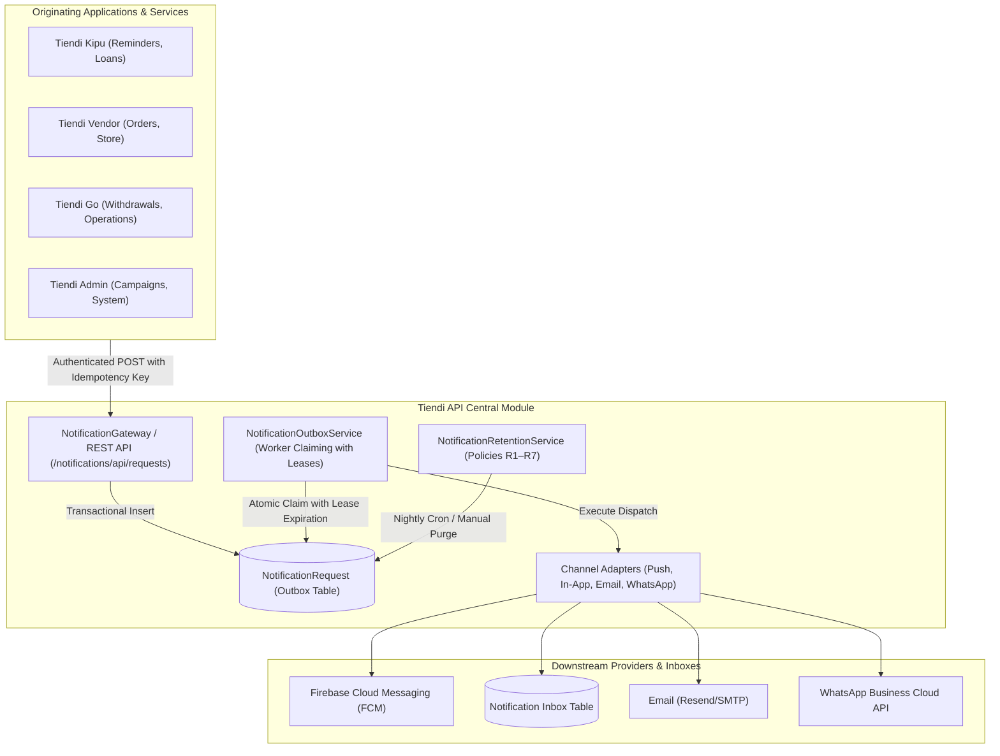

# Central Notifications Module — Operational Runbook

This runbook documents the architecture, operational metrics, incident handling procedures, and automated retention policies for the Central Notifications Module across the Tiendi platform (Tiendi API, Tiendi Admin, Tiendi Kipu, Tiendi Go, and Tiendi Vendor).

---

## 1. Overview & Architecture

The Central Notifications Module provides reliable, multi-channel notification dispatching with transactional durability and deduplication guarantees:



### Core Architecture Principles:
- **Transactional Outbox & Lease Locking:** Multiple API replicas can process pending notification requests concurrently without duplicate execution. Workers claim jobs by leasing them with `leasedUntil` timestamps and a unique `workerId`.
- **Durable Idempotency (A01):** Every dispatch requires a unique `idempotencyKey` scoped by `sourceApp`. Deduplication uses an SHA-256 hash over payload and idempotency key.
- **Fail-Safe Worker Crash Recovery (A03):** If a worker dies while processing a job, the lease expires after 5 minutes and is automatically reclaimed by any active worker.
- **Monotonic Cancellation Tombstones (A06):** Cancelled recurring occurrences or campaigns write immutable `NotificationScheduleTombstone` entries. Older or concurrent dispatches with version numbers $\le$ tombstone version are rejected.
- **Preference & Quiet Hours Enforcement:** Dispatches respect user category preferences, timezone quiet hours (default: 22:00 to 08:00 local time), and delivery policies (`PER_APP` vs `PER_PERSON`).

---

## 2. Metrics Catalog & Operational Dashboard

Operational metrics are accessible via the **Tiendi Admin** UI at `/admin/campaigns/operations` or programmatically via `GET /notifications/metrics` (protected by Admin JWT or `NOTIFICATIONS_SERVICE_TOKEN`).

### 2.1 Request Metrics (`requests`)

| Metric | Field | Description | Normal Range | Alert Threshold |
|---|---|---|---|---|
| **Pending** | `requests.pending` | Jobs waiting in outbox queue to be claimed | 0 – 50 | $> 200$ for $> 5\text{ min}$ |
| **Processing** | `requests.processing` | Jobs actively leased and being dispatched | 0 – 30 | $> 50$ for $> 10\text{ min}$ |
| **Processed** | `requests.processed` | Terminal successfully processed requests | Monotonically increasing | N/A |
| **Failed** | `requests.failed` | Requests that exhausted all retry attempts | $< 1\%$ of total | $> 2\%$ in $1\text{ hour}$ |
| **Expired** | `requests.expired` | Scheduled requests whose deadline passed | 0 | $> 10$ in $1\text{ hour}$ |
| **Total** | `requests.total` | Total recorded requests in outbox | Monotonically increasing | N/A |

### 2.2 Delivery Channel Metrics (`deliveries`)

| Outcome | Field | Meaning & Remediation |
|---|---|---|
| **SENT** | `deliveries.sent` | Message delivered to recipient device or provider. |
| **ACCEPTED** | `deliveries.accepted` | Message accepted by provider (e.g. FCM 200 OK) for downstream delivery. |
| **DISABLED_BY_PREFERENCE** | `deliveries.disabledByPreference` | Filtered intentionally because user opted out of the channel or category. Normal behavior. |
| **NO_RECIPIENT** | `deliveries.noRecipient` | No active device installation or email found for user. Check user registration. |
| **AMBIGUOUS_TIMEOUT** | `deliveries.ambiguousTimeouts` | Provider timed out without confirming acceptance. Treated as ambiguous to prevent duplicates. |
| **NOT_CONFIGURED** | `deliveries.notConfigured` | Provider credentials (FCM token, API key) missing in environment. Configuration issue. |
| **FAILED** | `deliveries.failed` | Provider returned definitive rejection (e.g., bad payload, revoked token). |

### 2.3 Resilience Indicators (`resilience`)

- **`stuckWorkersRecovered`:** Counter of leased jobs recovered from crashed or timed-out workers. An abrupt spike indicates worker process crashes or network partition.
- **`transientRetriesExecuted`:** Counter of automatic exponential backoff retries performed for transient 5xx errors.
- **`workerId`:** Identity string of the node serving the metrics request (`hostname:pid:hash`).

---

## 3. Standard Operating Procedures (SOPs)

### SOP-01: Worker Crash & Expired Lease Recovery

#### Symptoms:
- `requests.processing` remains high while queue throughput stalls.
- Spike in `stuckWorkersRecovered`.

#### Root Cause:
Node process was abruptly terminated (OOM killer, deploy restart, unhandled exception) while holding leases.

#### Remediation Steps:
1. Open **Tiendi Admin** $\rightarrow$ **Campañas** $\rightarrow$ **Operaciones**.
2. Click **Reclamar Outbox (Claim Jobs)**. This scans for `leasedUntil < now()` and claims them immediately.
3. Alternatively, invoke the endpoint via CLI:
   ```bash
   curl -X POST https://api.tiendi.pe/api/v1/notifications/metrics/claim \
     -H "Authorization: Bearer $NOTIFICATIONS_SERVICE_TOKEN"
   ```
4. Verify that recovered jobs transition to `PROCESSED` or `FAILED`.
5. Check PM2 or container logs for memory pressure or unhandled crashes:
   ```bash
   pm2 logs tiendi-api --lines 200
   ```

---

### SOP-02: Ambiguous Timeouts Handling (Criterion A03)

#### Symptoms:
- Increase in `deliveries.ambiguousTimeouts`.
- Network latency spikes between Tiendi API and Google FCM / external providers.

#### Remediation Steps:
1. Do **NOT** blindly re-dispatch unverified requests. Downstream devices may have already received the push notification.
2. Confirm if downstream provider received the message via provider delivery dashboards (Firebase Console $\rightarrow$ Cloud Messaging Reports).
3. If an upstream domain truly requires re-sending an ambiguous notification, it MUST use a new, distinct `idempotencyKey` with an explicit incremented version (e.g. `v2`).
4. Review network egress health and DNS resolution timeouts on the hosting instance.

---

### SOP-03: Provider Outage (FCM / Push Provider Down)

#### Symptoms:
- `deliveries.failed` surges with `provider_error` or HTTP 500/503 from `fcm.googleapis.com`.
- Mobile users report not receiving push notifications.

#### Remediation Steps:
1. Check Google Cloud Status Dashboard (`status.cloud.google.com`) for Firebase Cloud Messaging incidents.
2. The Central Notifications Module automatically retains pending requests in the transactional outbox:
   - Jobs fail with transient retry status and back off exponentially.
   - In-app inbox entries are **unaffected** and continue to be written to the database, ensuring users can still read notifications inside the web/APK apps.
3. If outage persists $> 30\text{ minutes}$, announce to support team that push notifications are delayed.
4. When FCM recovers, click **Reclamar Outbox** in Tiendi Admin or let the cron job drain the pending queue.

---

### SOP-04: Provider Quota Exhaustion or Rate Limiting

#### Symptoms:
- Provider returns HTTP 429 (Too Many Requests) or Quota Exceeded error codes.
- Batch campaign dispatches slow down.

#### Remediation Steps:
1. Pause any running large campaigns:
   - Go to **Campañas** in Tiendi Admin.
   - Select the active campaign and click **Cancelar Campaña**.
2. Adjust campaign batch sizing:
   - Campaigns automatically paginate in chunks of 500 recipients.
   - Rate limiters throttle outbox processing to safe provider quotas.
3. Request quota expansion from provider (Firebase quota tier or email service provider limit).
4. Resume dispatch once quota window resets.

---

### SOP-05: Rollback & Emergency Feature Deactivation

#### Scenario:
A critical regression is identified in notification dispatching requiring immediate cessation of outgoing traffic.

#### Deactivation Procedure:
1. **Disable Outbox Processing (Safe Drain):**
   Set environment variable in `tiendi-api` `.env`:
   ```env
   NOTIFICATIONS_DISPATCH_ENABLED=false
   ```
   Restart service:
   ```bash
   pm2 restart tiendi-api
   ```
   *Effect:* Originating apps can still write to outbox without failing client transactions, but background workers will not dispatch to external networks.
2. **Deny-by-Default Fallback (Kipu / Vendor):**
   In originating apps (e.g. Kipu API), clearing `TIENDI_NOTIFICATIONS_TOKEN` immediately causes `RemindersNotificationClient` to gracefully enter `deny-by-default` mode without crashing loan or expense flows.
3. **Rollback Release:**
   Deploy previous known good Git commit using standard release pipeline.

---

## 4. Automated Retention and Purge Policies (R1–R7)

Data retention policies protect database performance and storage while strictly preserving idempotency and audit guarantees:

| Rule | Target Entity | Retention Window | Purge Action | Idempotency / Safety Impact |
|---|---|---|---|---|
| **R1** | `NotificationInstallation` | INVALID $> 7$ days<br>INACTIVE $> 30$ days<br>ACTIVE inactive $> 60$ days | Hard delete for invalid/inactive; mark INACTIVE if no activity for 60d. | Safe. Prevents sending push to obsolete/revoked FCM tokens. |
| **R2** | `NotificationRequest` | Terminal status $> 30$ days | Scrubs `content` payload JSON (`{ scrubbed: true, scrubbedAt: ... }`). | **A01 Protected:** Keys (`sourceApp`, `idempotencyKey`, `payloadHash`, `status`) remain permanently to prevent duplicate re-dispatches. |
| **R3** | `NotificationScheduleTombstone` | **Indefinite** | **Never deleted.** | **A06 Protected:** Required to permanently reject obsolete versions of recurring reminders or cancelled campaigns. |
| **R4** | `Notification` (In-App Inbox) | Read $> 30$ days<br>Unread $> 90$ days | Hard delete. | Keeps client inbox responsive and lightweight. |
| **R5** | `NotificationDeliveryResult` | Created $> 90$ days | Hard delete. | Operational delivery logs pruned after 90 days. |
| **R6** | External Domain Logs | Managed by respective domains | Outside notification module scope. | N/A |
| **R7** | `NotificationCampaignRecipient`<br>`NotificationCampaign` | Recipients $> 30$ days after finish<br>Campaigns $> 365$ days | Prunes resolved audience rows after 30d; archive metadata kept 12 months. | Frees bulk recipient table space while retaining audit history. |

### Executing the Retention Purge:
- **UI:** Click **Purgar Expirados (R1–R7)** in Tiendi Admin (`/admin/campaigns/operations`) and confirm the prompt.
- **REST API / Cron:**
  ```bash
  curl -X POST https://api.tiendi.pe/api/v1/notifications/metrics/purge \
    -H "Authorization: Bearer $NOTIFICATIONS_SERVICE_TOKEN"
  ```
  Returns a `RetentionPurgeReport` JSON object auditing all affected row counts.

---

## 5. Escalation Matrix

| Level | Role | Contact Channel | Trigger Criteria |
|---|---|---|---|
| **L1** | Support / Ops Admin | Tiendi Admin Operations View | Elevated pending queue ($> 100$), user complaints regarding missing notices |
| **L2** | On-Call Backend Engineer | Slack `#infra-alerts` / PagerDuty | Worker crashes, Ambiguous timeout surge ($> 20/hr$), FCM 5xx errors |
| **L3** | Lead System Architect | Phone / Direct Escalation | Data corruption, permanent idempotency breach, platform-wide notification outage |
