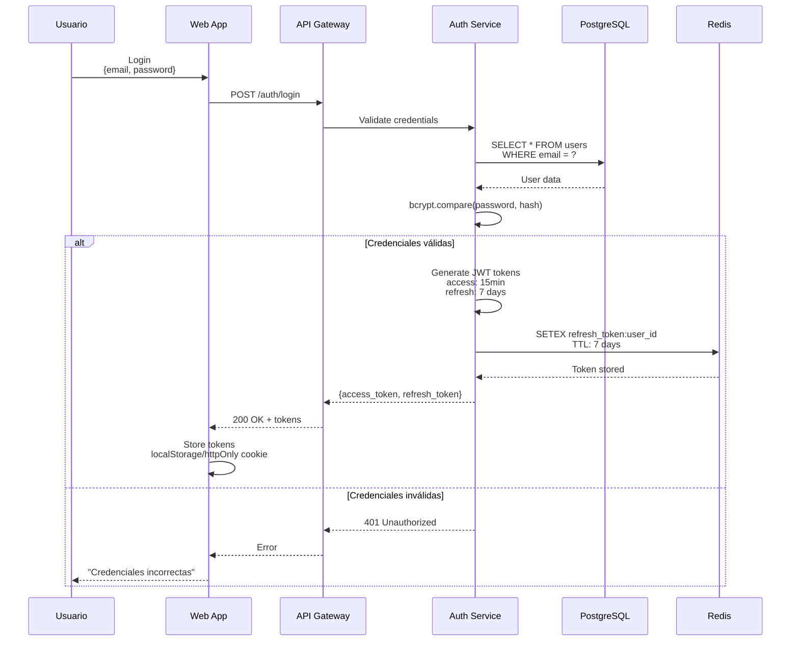
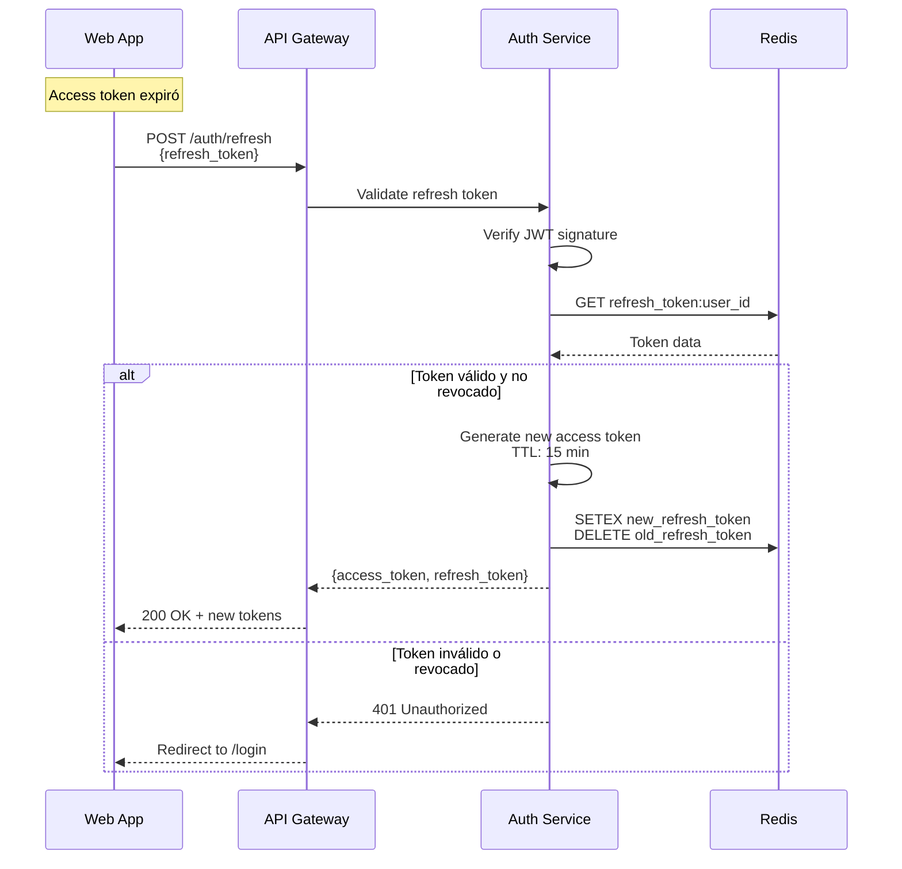
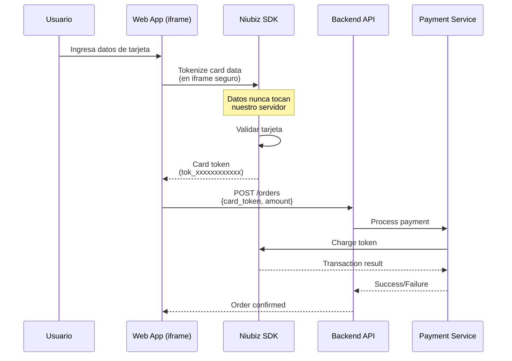
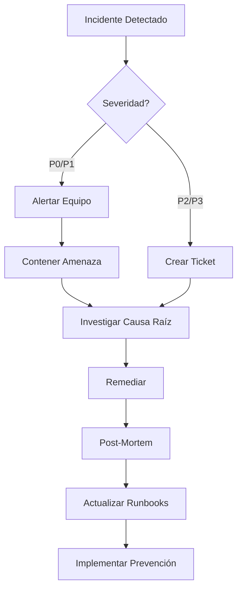

# Estrategia de Seguridad - Sistema Tiendi

Documento que define la estrategia de seguridad completa para el sistema de e-commerce multi-tenant Tiendi.

---

## Índice

1. [Autenticación y Autorización](#1-autenticación-y-autorización)
2. [Seguridad de API](#2-seguridad-de-api)
3. [Protección de Datos](#3-protección-de-datos)
4. [Seguridad de Pagos (PCI-DSS)](#4-seguridad-de-pagos-pci-dss)
5. [Seguridad Multi-Tenant](#5-seguridad-multi-tenant)
6. [Protección contra Ataques](#6-protección-contra-ataques)
7. [Seguridad de Infraestructura](#7-seguridad-de-infraestructura)
8. [Auditoría y Logging](#8-auditoría-y-logging)
9. [OWASP Top 10 Compliance](#9-owasp-top-10-compliance)
10. [Plan de Respuesta a Incidentes](#10-plan-de-respuesta-a-incidentes)

---

## 1. Autenticación y Autorización

### 1.1 Flujo de Autenticación JWT



### 1.2 Estructura de JWT

**Access Token (Expira en 15 minutos):**

```typescript
interface AccessTokenPayload {
  sub: string;              // user_id (UUID)
  email: string;
  role: 'customer' | 'store_owner' | 'admin';
  store_id?: string;        // Solo para store_owners
  permissions: string[];    // ['orders:read', 'products:write', etc.]
  iat: number;             // Issued at
  exp: number;             // Expiration
  jti: string;             // JWT ID (para revocación)
}
```

**Refresh Token (Expira en 7 días):**

```typescript
interface RefreshTokenPayload {
  sub: string;              // user_id
  type: 'refresh';
  iat: number;
  exp: number;
  jti: string;
}
```

### 1.3 Refresh Token Flow



### 1.4 OAuth2 Social Login

**Proveedores soportados:**
- Google
- Facebook
- Apple (para iOS)

```typescript
// Flujo OAuth2
GET /auth/google
  → Redirige a Google OAuth
  → Usuario autoriza
  → Callback: /auth/google/callback?code=xxx
  → Exchange code por tokens
  → Crear/actualizar usuario
  → Generar JWT tokens propios
  → Redirect a dashboard
```

### 1.5 Autorización Basada en Roles (RBAC)

**Roles del Sistema:**

| Rol | Descripción | Permisos Base |
|-----|-------------|---------------|
| `customer` | Cliente comprando productos | Ver productos, crear pedidos, chat |
| `store_owner` | Vendedor con tienda | Gestionar tienda, productos, pedidos |
| `admin` | Administrador de plataforma | Acceso completo, moderación |
| `support` | Soporte al cliente | Ver pedidos, chat, moderación limitada |

**Permisos Granulares:**

```typescript
enum Permission {
  // Productos
  'products:read',
  'products:write',
  'products:delete',

  // Pedidos
  'orders:read',
  'orders:write',
  'orders:manage',

  // Tienda
  'store:read',
  'store:write',
  'store:delete',

  // Usuarios
  'users:read',
  'users:write',
  'users:ban',

  // Admin
  'admin:analytics',
  'admin:moderation',
  'admin:system',
}
```

### 1.6 Revocación de Tokens

```typescript
// Logout - Revocar tokens
async logout(userId: string, refreshToken: string) {
  // 1. Eliminar refresh token de Redis
  await redis.del(`refresh_token:${userId}`);

  // 2. Agregar access token a blacklist (si queda tiempo)
  const decoded = jwt.decode(refreshToken);
  const remainingTime = decoded.exp - Date.now();

  if (remainingTime > 0) {
    await redis.setex(
      `blacklist:${decoded.jti}`,
      remainingTime,
      'revoked'
    );
  }
}

// Middleware para verificar blacklist
async function checkBlacklist(token: string) {
  const decoded = jwt.decode(token);
  const isBlacklisted = await redis.exists(`blacklist:${decoded.jti}`);

  if (isBlacklisted) {
    throw new UnauthorizedException('Token revoked');
  }
}
```

---

## 2. Seguridad de API

### 2.1 Rate Limiting

**Estrategia por IP y por Usuario:**

```typescript
// Rate limits por endpoint
const rateLimits = {
  // Auth endpoints
  'POST /auth/login': {
    windowMs: 15 * 60 * 1000,  // 15 minutos
    max: 5,                     // 5 intentos
    message: 'Demasiados intentos de login'
  },

  'POST /auth/register': {
    windowMs: 60 * 60 * 1000,  // 1 hora
    max: 3,
    message: 'Demasiados registros desde esta IP'
  },

  // API general (autenticado)
  'global_authenticated': {
    windowMs: 60 * 1000,       // 1 minuto
    max: 100,                  // 100 requests
  },

  // API general (no autenticado)
  'global_public': {
    windowMs: 60 * 1000,
    max: 30,
  },

  // Search endpoint
  'GET /search': {
    windowMs: 60 * 1000,
    max: 20,
  },
};
```

**Implementación con Redis:**

```typescript
import rateLimit from 'express-rate-limit';
import RedisStore from 'rate-limit-redis';

const limiter = rateLimit({
  store: new RedisStore({
    client: redisClient,
    prefix: 'rl:',
  }),
  windowMs: 15 * 60 * 1000,
  max: 100,
  standardHeaders: true,
  legacyHeaders: false,
  handler: (req, res) => {
    res.status(429).json({
      error: 'Too Many Requests',
      retryAfter: req.rateLimit.resetTime,
    });
  },
});
```

### 2.2 CORS Configuration

```typescript
const corsOptions = {
  origin: (origin, callback) => {
    const allowedOrigins = [
      'https://tiendi.pe',
      'https://www.tiendi.pe',
      'https://app.tiendi.pe',
      'https://vendor.tiendi.pe',
      process.env.NODE_ENV === 'development' && 'http://localhost:3000',
    ].filter(Boolean);

    if (!origin || allowedOrigins.includes(origin)) {
      callback(null, true);
    } else {
      callback(new Error('Not allowed by CORS'));
    }
  },
  credentials: true,
  methods: ['GET', 'POST', 'PUT', 'DELETE', 'PATCH'],
  allowedHeaders: ['Content-Type', 'Authorization'],
  exposedHeaders: ['X-Total-Count', 'X-Page-Count'],
  maxAge: 86400, // 24 horas
};
```

### 2.3 API Versioning

```
Base URL: https://api.tiendi.pe/v1

Estructura:
/v1/products
/v1/orders
/v1/stores

Headers:
Accept: application/json
Accept-Version: 1.0
```

### 2.4 Input Validation

**Usar class-validator en todos los DTOs:**

```typescript
import { IsEmail, IsString, MinLength, MaxLength } from 'class-validator';

export class CreateUserDto {
  @IsEmail({}, { message: 'Email inválido' })
  email: string;

  @IsString()
  @MinLength(8, { message: 'Contraseña debe tener mínimo 8 caracteres' })
  @MaxLength(100)
  password: string;

  @IsString()
  @MinLength(2)
  @MaxLength(50)
  firstName: string;
}
```

**Sanitización de inputs:**

```typescript
import { escape } from 'validator';
import xss from 'xss';

// Sanitizar HTML
const sanitizeHtml = (input: string) => xss(input);

// Sanitizar SQL (usar parametrized queries siempre)
// TypeORM ya protege contra SQL injection

// Sanitizar comandos
const sanitizeCommand = (input: string) => {
  return input.replace(/[;&|`$()]/g, '');
};
```

---

## 3. Protección de Datos

### 3.1 Encriptación en Reposo

**Datos sensibles que deben encriptarse:**

```typescript
// En PostgreSQL - Transparent Data Encryption (TDE)
// Azure Database for PostgreSQL lo soporta nativamente

// Campos adicionales encriptados a nivel aplicación
interface EncryptedFields {
  // Datos bancarios (si se almacenan)
  bank_account_number: string;  // AES-256-GCM

  // Documentos de identidad
  document_number: string;       // AES-256-GCM

  // Datos de pago tokenizados (no almacenar tarjetas!)
  payment_token: string;         // De Niubiz/Culqi
}
```

**Implementación de encriptación:**

```typescript
import crypto from 'crypto';

class EncryptionService {
  private algorithm = 'aes-256-gcm';
  private key: Buffer;

  constructor() {
    // Obtener key de Azure Key Vault
    this.key = Buffer.from(process.env.ENCRYPTION_KEY, 'hex');
  }

  encrypt(text: string): string {
    const iv = crypto.randomBytes(16);
    const cipher = crypto.createCipheriv(this.algorithm, this.key, iv);

    let encrypted = cipher.update(text, 'utf8', 'hex');
    encrypted += cipher.final('hex');

    const authTag = cipher.getAuthTag();

    // Retornar iv + authTag + encrypted
    return iv.toString('hex') + ':' + authTag.toString('hex') + ':' + encrypted;
  }

  decrypt(encryptedData: string): string {
    const parts = encryptedData.split(':');
    const iv = Buffer.from(parts[0], 'hex');
    const authTag = Buffer.from(parts[1], 'hex');
    const encrypted = parts[2];

    const decipher = crypto.createDecipheriv(this.algorithm, this.key, iv);
    decipher.setAuthTag(authTag);

    let decrypted = decipher.update(encrypted, 'hex', 'utf8');
    decrypted += decipher.final('utf8');

    return decrypted;
  }
}
```

### 3.2 Encriptación en Tránsito

**TLS 1.3 en todas las comunicaciones:**

```nginx
# Nginx configuration
ssl_protocols TLSv1.3 TLSv1.2;
ssl_ciphers 'TLS_AES_128_GCM_SHA256:TLS_AES_256_GCM_SHA384';
ssl_prefer_server_ciphers on;

# HSTS
add_header Strict-Transport-Security "max-age=31536000; includeSubDomains" always;
```

### 3.3 Hashing de Contraseñas

**Usar bcrypt con cost factor alto:**

```typescript
import bcrypt from 'bcrypt';

class PasswordService {
  private readonly saltRounds = 12; // Aumentar a 14 en producción

  async hash(password: string): Promise<string> {
    return bcrypt.hash(password, this.saltRounds);
  }

  async compare(password: string, hash: string): Promise<boolean> {
    return bcrypt.compare(password, hash);
  }

  // Validar complejidad de contraseña
  validateStrength(password: string): boolean {
    const minLength = 8;
    const hasUpperCase = /[A-Z]/.test(password);
    const hasLowerCase = /[a-z]/.test(password);
    const hasNumbers = /\d/.test(password);
    const hasSpecialChar = /[!@#$%^&*(),.?":{}|<>]/.test(password);

    return (
      password.length >= minLength &&
      hasUpperCase &&
      hasLowerCase &&
      hasNumbers &&
      hasSpecialChar
    );
  }
}
```

### 3.4 Manejo de Secretos

**Azure Key Vault para todos los secretos:**

```typescript
import { SecretClient } from '@azure/keyvault-secrets';
import { DefaultAzureCredential } from '@azure/identity';

class SecretsService {
  private client: SecretClient;

  constructor() {
    const vaultUrl = process.env.AZURE_KEYVAULT_URL;
    const credential = new DefaultAzureCredential();
    this.client = new SecretClient(vaultUrl, credential);
  }

  async getSecret(secretName: string): Promise<string> {
    const secret = await this.client.getSecret(secretName);
    return secret.value;
  }
}

// Uso
const dbPassword = await secretsService.getSecret('postgres-password');
const jwtSecret = await secretsService.getSecret('jwt-secret-key');
const stripeKey = await secretsService.getSecret('stripe-api-key');
```

**Variables que NUNCA deben estar en código:**
- ❌ Database passwords
- ❌ JWT secret keys
- ❌ API keys (Niubiz, Culqi, SendGrid, Twilio, Google Maps)
- ❌ Encryption keys
- ❌ OAuth client secrets

---

## 4. Seguridad de Pagos (PCI-DSS)

### 4.1 Compliance PCI-DSS

**Nivel de compliance requerido:** SAQ A (Self-Assessment Questionnaire A)

**Razón:** No almacenamos, procesamos ni transmitimos datos de tarjetas directamente. Usamos Niubiz/Culqi que son PCI-DSS Level 1 compliant.

### 4.2 Tokenización de Tarjetas



**Reglas de seguridad:**

1. ✅ **NUNCA** almacenar número de tarjeta completo
2. ✅ **NUNCA** almacenar CVV
3. ✅ **NUNCA** transmitir datos de tarjeta en claro
4. ✅ Usar iframe de Niubiz/Culqi para captura
5. ✅ Solo almacenar tokens opacos
6. ✅ Logs no deben contener datos de tarjeta

### 4.3 Webhooks de Pago

```typescript
// Verificar firma de webhook
import crypto from 'crypto';

function verifyWebhookSignature(
  payload: string,
  signature: string,
  secret: string
): boolean {
  const expectedSignature = crypto
    .createHmac('sha256', secret)
    .update(payload)
    .digest('hex');

  return crypto.timingSafeEqual(
    Buffer.from(signature),
    Buffer.from(expectedSignature)
  );
}

// Endpoint webhook
@Post('/webhooks/niubiz')
async handleNiubizWebhook(
  @Body() payload: any,
  @Headers('x-niubiz-signature') signature: string,
) {
  // 1. Verificar firma
  const isValid = verifyWebhookSignature(
    JSON.stringify(payload),
    signature,
    process.env.NIUBIZ_WEBHOOK_SECRET
  );

  if (!isValid) {
    throw new UnauthorizedException('Invalid signature');
  }

  // 2. Verificar idempotencia (evitar procesar 2 veces)
  const eventId = payload.id;
  const exists = await redis.exists(`webhook:${eventId}`);

  if (exists) {
    return { status: 'already_processed' };
  }

  // 3. Procesar evento
  await this.processPaymentEvent(payload);

  // 4. Marcar como procesado (24h TTL)
  await redis.setex(`webhook:${eventId}`, 86400, 'processed');

  return { status: 'success' };
}
```

---

## 5. Seguridad Multi-Tenant

### 5.1 Aislamiento de Datos (Row-Level Security)

```sql
-- Habilitar RLS en todas las tablas multi-tenant
ALTER TABLE products ENABLE ROW LEVEL SECURITY;
ALTER TABLE orders ENABLE ROW LEVEL SECURITY;
ALTER TABLE stores ENABLE ROW LEVEL SECURITY;

-- Política: Solo acceder a datos del tenant actual
CREATE POLICY tenant_isolation_policy ON products
  USING (store_id = current_setting('app.tenant_id', true)::uuid);

CREATE POLICY tenant_isolation_policy ON orders
  USING (store_id = current_setting('app.tenant_id', true)::uuid);

-- Para admin: bypass RLS
ALTER TABLE products FORCE ROW LEVEL SECURITY;
GRANT BYPASSRLS ON TABLE products TO admin_role;
```

### 5.2 Middleware de Tenant Context

```typescript
@Injectable()
export class TenantContextMiddleware implements NestMiddleware {
  use(req: Request, res: Response, next: NextFunction) {
    // Extraer tenant_id del token JWT o header
    const user = req.user;

    if (!user) {
      return next();
    }

    let tenantId: string;

    // 1. De subdomain: minimarket.tiendi.pe
    const subdomain = req.hostname.split('.')[0];
    if (subdomain !== 'www' && subdomain !== 'api') {
      tenantId = subdomain;
    }

    // 2. De JWT (store_owner)
    if (user.role === 'store_owner' && user.store_id) {
      tenantId = user.store_id;
    }

    // 3. De header X-Tenant-ID
    if (req.headers['x-tenant-id']) {
      tenantId = req.headers['x-tenant-id'] as string;
    }

    // Validar que el usuario tenga acceso a este tenant
    if (tenantId && !this.hasAccessToTenant(user, tenantId)) {
      throw new ForbiddenException('Access to tenant denied');
    }

    // Establecer contexto en PostgreSQL session
    req.tenantId = tenantId;

    next();
  }

  private hasAccessToTenant(user: any, tenantId: string): boolean {
    // Admin puede acceder a todos
    if (user.role === 'admin') return true;

    // Store owner solo a su tienda
    if (user.role === 'store_owner') {
      return user.store_id === tenantId;
    }

    // Customer puede acceder a cualquier tienda para comprar
    if (user.role === 'customer') return true;

    return false;
  }
}
```

### 5.3 Query Interceptor (Double Check)

```typescript
// Interceptor para validar que queries incluyan tenant_id
@Injectable()
export class TenantQueryInterceptor {
  async intercept(query: string, params: any[]): Promise<void> {
    const tenantId = getTenantIdFromContext();

    // Verificar que queries de SELECT incluyan filtro de tenant
    if (query.toLowerCase().includes('select')) {
      if (!query.includes('store_id') && !query.includes('app.tenant_id')) {
        logger.warn('Query without tenant filter detected', { query });
        // En producción, podría lanzar error
      }
    }

    // Agregar tenant_id automáticamente si no está
    if (tenantId && !params.includes(tenantId)) {
      // Modificar query para agregar WHERE store_id = ?
    }
  }
}
```

---

## 6. Protección contra Ataques

### 6.1 SQL Injection

**Protección:**
- ✅ Usar TypeORM con parametrized queries (nunca concatenar SQL)
- ✅ Validar inputs con class-validator
- ✅ Escape de caracteres especiales

```typescript
// ✅ CORRECTO - TypeORM
const products = await productRepository.find({
  where: { name: Like(`%${searchTerm}%`) }
});

// ❌ INCORRECTO - SQL directo
const query = `SELECT * FROM products WHERE name LIKE '%${searchTerm}%'`;
```

### 6.2 XSS (Cross-Site Scripting)

**Protección:**

```typescript
// 1. Content Security Policy (CSP)
app.use(helmet.contentSecurityPolicy({
  directives: {
    defaultSrc: ["'self'"],
    scriptSrc: ["'self'", "'unsafe-inline'", "https://cdn.tiendi.pe"],
    styleSrc: ["'self'", "'unsafe-inline'"],
    imgSrc: ["'self'", "data:", "https:"],
    connectSrc: ["'self'", "https://api.tiendi.pe"],
    fontSrc: ["'self'", "https://fonts.gstatic.com"],
    objectSrc: ["'none'"],
    upgradeInsecureRequests: [],
  }
}));

// 2. Sanitización de HTML en frontend
import DOMPurify from 'dompurify';

const sanitizedHTML = DOMPurify.sanitize(userInput);

// 3. Escapar outputs en templates
// Next.js lo hace automáticamente con JSX
<div>{userInput}</div> // Automáticamente escapado
```

### 6.3 CSRF (Cross-Site Request Forgery)

```typescript
import csurf from 'csurf';

// CSRF protection
const csrfProtection = csurf({
  cookie: {
    httpOnly: true,
    secure: process.env.NODE_ENV === 'production',
    sameSite: 'strict',
  }
});

app.use(csrfProtection);

// Endpoint para obtener token
app.get('/csrf-token', (req, res) => {
  res.json({ csrfToken: req.csrfToken() });
});

// Frontend debe incluir token en requests
fetch('/api/orders', {
  method: 'POST',
  headers: {
    'Content-Type': 'application/json',
    'X-CSRF-Token': csrfToken,
  },
  body: JSON.stringify(orderData),
});
```

### 6.4 DDoS Protection

**Capas de protección:**

1. **Azure Front Door con WAF**
   - Rate limiting por IP
   - Geo-blocking (bloquear países sospechosos)
   - Bot detection

2. **Application-level rate limiting**
   - Ver sección 2.1

3. **Database connection pooling**
   ```typescript
   // TypeORM connection pool
   {
     type: 'postgres',
     host: process.env.DB_HOST,
     poolSize: 20,
     extra: {
       max: 20,
       min: 5,
       idleTimeoutMillis: 30000,
     }
   }
   ```

### 6.5 Brute Force Protection

```typescript
@Injectable()
export class BruteForceProtection {
  private readonly MAX_ATTEMPTS = 5;
  private readonly BLOCK_DURATION = 15 * 60; // 15 minutos

  async checkLoginAttempts(email: string, ip: string): Promise<void> {
    const key = `login_attempts:${email}:${ip}`;
    const attempts = await redis.get(key);

    if (attempts && parseInt(attempts) >= this.MAX_ATTEMPTS) {
      const ttl = await redis.ttl(key);
      throw new TooManyRequestsException(
        `Demasiados intentos. Intente nuevamente en ${Math.ceil(ttl / 60)} minutos`
      );
    }
  }

  async recordFailedAttempt(email: string, ip: string): Promise<void> {
    const key = `login_attempts:${email}:${ip}`;
    await redis.incr(key);
    await redis.expire(key, this.BLOCK_DURATION);
  }

  async resetAttempts(email: string, ip: string): Promise<void> {
    const key = `login_attempts:${email}:${ip}`;
    await redis.del(key);
  }
}
```

---

## 7. Seguridad de Infraestructura

### 7.1 Azure Security Best Practices

**Network Security:**

```yaml
# Network Security Groups (NSG)
rules:
  - name: allow_https
    priority: 100
    direction: Inbound
    access: Allow
    protocol: Tcp
    sourceAddressPrefix: '*'
    destinationPortRange: 443

  - name: deny_all_inbound
    priority: 4096
    direction: Inbound
    access: Deny
    protocol: '*'
    sourceAddressPrefix: '*'
    destinationPortRange: '*'
```

**Private Endpoints:**
- ✅ PostgreSQL: Solo accesible desde VNet
- ✅ Redis: Solo accesible desde VNet
- ✅ Blob Storage: Solo accesible desde VNet
- ✅ Key Vault: Private endpoint

**Azure Firewall:**
```yaml
# Reglas de salida
outbound_rules:
  - allow_https_to_apis:
      destinations:
        - api.niubiz.com.pe
        - api.sendgrid.com
        - api.twilio.com
      ports: [443]
```

### 7.2 Container Security

```dockerfile
# Dockerfile seguro
FROM node:20-alpine AS builder

# No correr como root
RUN addgroup -g 1001 -S nodejs
RUN adduser -S nextjs -u 1001

# Copiar solo lo necesario
COPY package*.json ./
RUN npm ci --only=production

# Multi-stage build
FROM node:20-alpine AS runner
USER nextjs

# Copiar solo artifacts
COPY --from=builder --chown=nextjs:nodejs /app ./

# No exponer puertos privilegiados
EXPOSE 3000

CMD ["node", "server.js"]
```

**Escaneo de vulnerabilidades:**
```bash
# Trivy scan
trivy image tiendi/api:latest

# Snyk scan
snyk test --docker tiendi/api:latest
```

### 7.3 Kubernetes Security

```yaml
# Security Context
apiVersion: v1
kind: Pod
metadata:
  name: api-pod
spec:
  securityContext:
    runAsNonRoot: true
    runAsUser: 1001
    fsGroup: 1001

  containers:
  - name: api
    image: tiendi/api:latest
    securityContext:
      allowPrivilegeEscalation: false
      readOnlyRootFilesystem: true
      capabilities:
        drop:
          - ALL

    # Resource limits
    resources:
      limits:
        memory: "512Mi"
        cpu: "500m"
      requests:
        memory: "256Mi"
        cpu: "250m"

    # Liveness & Readiness probes
    livenessProbe:
      httpGet:
        path: /health
        port: 3000
      initialDelaySeconds: 30
      periodSeconds: 10

    readinessProbe:
      httpGet:
        path: /ready
        port: 3000
      initialDelaySeconds: 5
      periodSeconds: 5
```

---

## 8. Auditoría y Logging

### 8.1 Audit Logs

```typescript
interface AuditLog {
  id: string;
  timestamp: Date;
  userId: string;
  action: string;           // 'user.login', 'order.create', 'product.delete'
  resource: string;         // 'users', 'orders', 'products'
  resourceId: string;
  changes?: any;            // Diff de cambios
  ip: string;
  userAgent: string;
  status: 'success' | 'failure';
  errorMessage?: string;
}

// Decorador para auditar acciones
function Audit(action: string) {
  return function (target: any, propertyKey: string, descriptor: PropertyDescriptor) {
    const originalMethod = descriptor.value;

    descriptor.value = async function (...args: any[]) {
      const startTime = Date.now();
      const context = this;

      try {
        const result = await originalMethod.apply(context, args);

        await auditService.log({
          action,
          userId: context.request.user?.id,
          resource: target.constructor.name,
          status: 'success',
          duration: Date.now() - startTime,
        });

        return result;
      } catch (error) {
        await auditService.log({
          action,
          userId: context.request.user?.id,
          resource: target.constructor.name,
          status: 'failure',
          errorMessage: error.message,
          duration: Date.now() - startTime,
        });

        throw error;
      }
    };

    return descriptor;
  };
}

// Uso
@Audit('product.delete')
async deleteProduct(id: string) {
  return this.productService.delete(id);
}
```

### 8.2 Security Logging

```typescript
// Eventos de seguridad que SIEMPRE deben loguearse
const securityEvents = [
  'auth.login.success',
  'auth.login.failure',
  'auth.logout',
  'auth.password.reset',
  'auth.token.refresh',
  'permission.denied',
  'rate_limit.exceeded',
  'suspicious.activity',
  'payment.processed',
  'payment.failed',
  'admin.action',
];

// Formato de log
logger.warn('Security event', {
  event: 'auth.login.failure',
  userId: email,
  ip: req.ip,
  userAgent: req.headers['user-agent'],
  timestamp: new Date(),
  metadata: {
    reason: 'invalid_password',
    attemptCount: 3,
  },
});
```

### 8.3 Log Retention

| Tipo de Log | Retention | Ubicación |
|-------------|-----------|-----------|
| Application logs | 30 días | Azure Log Analytics |
| Audit logs | 7 años | Azure Storage (Archive) |
| Security logs | 2 años | Azure Log Analytics |
| Access logs | 90 días | Azure Log Analytics |
| Payment logs | 7 años | Azure Storage (Compliance) |

---

## 9. OWASP Top 10 Compliance

### Checklist de Mitigación

| # | Vulnerabilidad | Estado | Mitigación |
|---|----------------|--------|------------|
| A01 | Broken Access Control | ✅ | RBAC + RLS + JWT validation |
| A02 | Cryptographic Failures | ✅ | TLS 1.3 + AES-256 + bcrypt |
| A03 | Injection | ✅ | TypeORM parametrized + validation |
| A04 | Insecure Design | ✅ | Threat modeling + security reviews |
| A05 | Security Misconfiguration | ✅ | Helmet + CSP + security headers |
| A06 | Vulnerable Components | ✅ | Dependabot + Snyk scanning |
| A07 | Auth & Session Failures | ✅ | JWT + refresh tokens + MFA |
| A08 | Software & Data Integrity | ✅ | Code signing + checksums |
| A09 | Logging & Monitoring | ✅ | Audit logs + alerting |
| A10 | SSRF | ✅ | URL validation + whitelist |

---

## 10. Plan de Respuesta a Incidentes

### 10.1 Severidad de Incidentes

| Nivel | Descripción | Tiempo de Respuesta | Escalación |
|-------|-------------|---------------------|------------|
| **P0 - Critical** | Data breach, sistema caído | 15 minutos | CEO + CTO |
| **P1 - High** | Vulnerabilidad explotada | 1 hora | CTO + Security Lead |
| **P2 - Medium** | Vulnerabilidad detectada | 4 horas | Security Lead |
| **P3 - Low** | Mejora de seguridad | 24 horas | Dev Team |

### 10.2 Proceso de Respuesta



### 10.3 Contactos de Emergencia

```yaml
security_team:
  lead: security@tiendi.pe
  oncall: +51 999 XXX XXX

external_contacts:
  azure_support: Azure Premium Support
  cert_peru: cert@cert.pe (CERT Perú)
  legal: legal@tiendi.pe
```

---

**Fecha de creación:** 2025-11-25
**Versión:** 1.0
**Próxima revisión:** 2026-02-25
**Responsable:** Security Team - Tiendi
