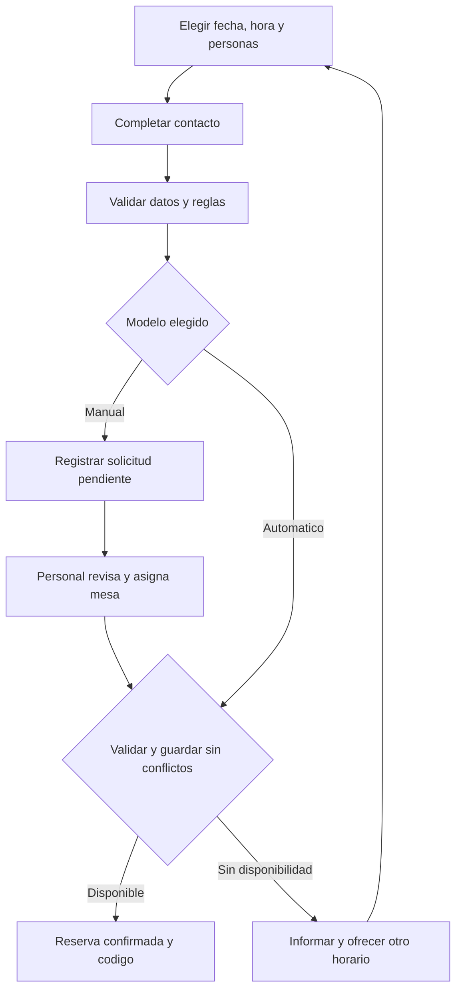
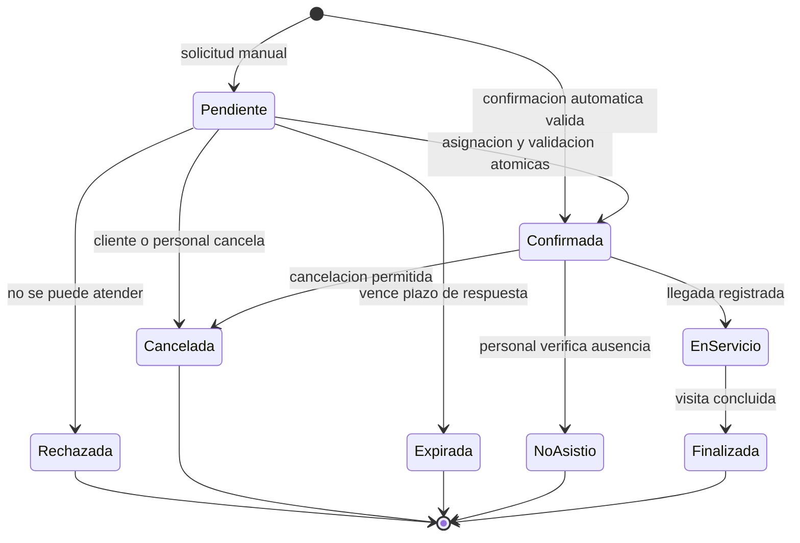

# Propuestas para un sistema de reservas de restaurantes

**Objetivo:** permitir que los clientes soliciten o confirmen una reserva y que el personal gestione la agenda, inicialmente sin pedidos, ventas ni pagos.

> [!TIP]
> **Recomendación preliminar, no aprobada:** comenzar con solicitudes y confirmación manual si todavía no están definidas las reglas de ocupación. Si las mesas y sus capacidades ya son estables, evaluar confirmación automática por mesa desde el inicio.

## 1. Supuestos y alcance inicial

- El cliente indica fecha, hora, cantidad de personas y datos de contacto.
- El personal necesita una agenda compartida y trazabilidad de los cambios.
- Los horarios, la duración y las políticas son configurables por establecimiento.
- No se presupone una tecnología, presupuesto ni fecha de entrega.
- Sigue pendiente definir si operará para un restaurante, varias sedes o negocios independientes.

> [!NOTE]
> Este documento compara alternativas de producto. Los ejemplos y reglas siguientes son propuestas editables, no requisitos ya validados ni una descripción del sistema existente.

## 2. Tres propuestas con diferentes niveles de automatización

### A. Solicitud con aprobación manual

El cliente envía una solicitud. El personal revisa la distribución real del salón y confirma, rechaza o propone otro horario.

| Aspecto | Propuesta |
|---|---|
| Experiencia del cliente | Recibe un código y el estado «Pendiente»; todavía no tiene una reserva confirmada. |
| Disponibilidad pública | Horarios habilitados para solicitar; no se promete disponibilidad real. |
| Trabajo del personal | Revisar solicitudes y asignar mesa al confirmar. |
| Ventaja | Permite iniciar con reglas operativas todavía cambiantes. |
| Costo operativo | Requiere atención y una política clara de respuesta. |
| Mejor encaje | Negocios que reorganizan mesas o necesitan evaluar cada grupo. |

Para este MVP se propone que las solicitudes pendientes **no bloqueen mesas**. Al confirmar, el personal asigna una mesa compatible; el sistema valida y guarda la asignación de forma atómica. Si no puede acomodar al grupo, no confirma. Las combinaciones de mesas quedarían fuera del primer alcance.

### B. Confirmación automática por cupos y franjas

El sistema administra una capacidad compartida, por ejemplo, hasta 20 personas simultáneas. Confirma si existe cupo durante todo el intervalo ocupado.

| Aspecto | Propuesta |
|---|---|
| Experiencia del cliente | Selecciona un horario disponible y recibe confirmación inmediata. |
| Disponibilidad pública | Cupos calculados considerando reservas que se solapan. |
| Trabajo del personal | Mantener cupos y resolver la ubicación física de los grupos. |
| Ventaja | No requiere asignar una mesa concreta al reservar. |
| Riesgo principal | Tener asientos libres no garantiza poder sentar junto a un grupo. |
| Mejor encaje | Operaciones cuya distribución permite atender los grupos admitidos por la regla de cupos. |

> [!WARNING]
> Dos mesas libres de dos personas no garantizan una mesa para cuatro si no se pueden unir. No habilitar confirmación automática por cupos sin validar la distribución, los tamaños de grupo y la operación real. Si esa garantía no existe, usar A o C.

### C. Confirmación automática con asignación de mesa

El sistema busca una mesa habilitada, con capacidad suficiente y sin ocupaciones superpuestas. La asigna al confirmar.

| Aspecto | Propuesta |
|---|---|
| Experiencia del cliente | Confirmación inmediata sin necesidad de elegir mesa. |
| Disponibilidad pública | Horarios con al menos una mesa compatible. |
| Trabajo del personal | Mantener el inventario y bloquear mesas no disponibles. |
| Ventaja | Relaciona cada confirmación con un recurso físico comprobable. |
| Costo de construcción | Exige modelar mesas, asignaciones y conflictos de horario. |
| Mejor encaje | Salones con mesas y capacidades definidas. |

Para mantener el alcance pequeño: una mesa por reserva, sin unión automática de mesas ni plano interactivo. Los grupos que superen la mesa más grande no se confirman por el canal automático.

### Comparación para elegir

| Criterio | A: manual | B: cupos | C: mesas |
|---|---|---|---|
| Confirmación inmediata | No | Sí, bajo condiciones validadas | Sí |
| Dependencia del personal | Alta | Baja para confirmar | Baja para confirmar |
| Modelo de disponibilidad | Asignación revisada por personal | Capacidad compartida por intervalo | Mesa física por intervalo |
| Complejidad relativa propuesta | Baja a media | Media | Media a alta |
| Condición clave | Responder y asignar antes de confirmar | Garantizar acomodo físico | Inventario confiable de mesas |

**Elección sugerida:** A para validar la operación con control humano; C si la confirmación inmediata es esencial y el salón ya está definido. B solo si el restaurante demuestra que su regla de cupos puede cumplirse físicamente. Son alternativas: no se propone construir las tres en el MVP.

## 3. Qué incluye el MVP

| Incluido | Fuera de alcance |
|---|---|
| Formulario público y código de seguimiento | Carta, pedidos, cocina, delivery y punto de venta |
| Agenda del personal y alta de reservas telefónicas | Pagos, anticipos, facturación y cobros por ausencia |
| Confirmación según el modelo elegido | Programa de fidelización y campañas |
| Consulta, cancelación y reprogramación | Lista de espera automática y optimización del salón |
| Horarios, excepciones y bloqueos | Unión automática de mesas y plano gráfico |
| Registro de llegada, finalización y ausencia | Marketplace y administración comercial de un SaaS |
| Accesos por rol e historial de cambios | Integraciones externas no acordadas |

El resultado de cada operación debe verse en pantalla. El envío por correo, SMS o WhatsApp requiere elegir un canal e integración; no se da por incluido. Un fallo de envío no debe crear otra reserva ni revertir una confirmación válida.

## 4. Flujos principales

### Cliente y confirmación

**Personal:** ingresar → consultar agenda → crear o revisar reserva → confirmar o rechazar → registrar llegada → finalizar o marcar ausencia. En A, una propuesta de otro horario requiere aceptación del cliente antes de confirmar; no cambia su solicitud silenciosamente.

### Estados propuestos

Pendiente no ocupa capacidad ni mesas en esta propuesta; su vencimiento cierra la solicitud, no libera una retención. No se incluyen bloqueos temporales mientras el cliente completa el formulario. La reprogramación conserva el identificador y queda en el historial; no es un estado adicional.

## 5. Pantallas y datos necesarios

| Pantalla | Información y acciones |
|---|---|
| Reserva pública | Fecha, horarios, personas, nombre, contacto y política aplicable. |
| Resultado y seguimiento | Código, estado, fecha local, personas y acciones permitidas mediante enlace seguro. |
| Agenda del personal | Vista diaria, filtros por estado, solicitudes pendientes y alta manual. |
| Detalle de reserva | Contacto, mesa si aplica, cambios, confirmación, cancelación y llegada. |
| Configuración | Horarios, cierres, duración, límites y cupos o mesas según modelo. |

**Datos solicitados al cliente:** nombre, un medio de contacto acordado, fecha, hora y número de personas. Observaciones opcionales, con longitud limitada y aviso de no incluir información sensible innecesaria. No se requiere una cuenta de cliente para el MVP propuesto.

| Entidad conceptual | Datos mínimos |
|---|---|
| Establecimiento | Nombre, zona horaria y política vigente; no implica una arquitectura multiempresa. |
| Configuración de disponibilidad | Horarios semanales, cierres excepcionales, duración, margen, anticipación y tamaño máximo de grupo. |
| Reserva | ID, código público no secuencial, estado, origen, inicio, fin previsto, fin de ocupación, personas, contacto, política aplicada y versión. |
| Mesa, para A y C | Identificador, capacidad, estado habilitado y bloqueos por intervalo. |
| Asignación, para A y C | Reserva y mesa; se conserva el historial al cambiarla o cancelarla. |
| Cupo, para B | Capacidad aplicable por intervalo y reducciones excepcionales. |
| Usuario del personal | Identidad, rol y acceso al establecimiento autorizado. |
| Evento de auditoría | Reserva, acción, actor, fecha y cambios relevantes. |

## 6. Reglas que evitan conflictos

### Tiempo y disponibilidad

1. Cada reserva ocupa `[inicio, fin previsto + margen)`: el inicio se incluye y el extremo final no. Otra reserva puede comenzar exactamente cuando termina la ocupación anterior.
2. Dos intervalos se solapan si `inicioA < finOcupacionB` e `inicioB < finOcupacionA`. A y C lo validan por mesa; B suma personas en **cada tramo** de solapamiento, no solo en la hora de inicio.
3. La duración y el margen se guardan en la reserva: cambiar la configuración no debe alterar reservas previas silenciosamente. Se propone que toda la ocupación quede dentro del horario habilitado.
4. Confirmadas y en servicio ocupan el intervalo registrado. Al terminar antes, se propone liberar después del margen de preparación. Canceladas y ausentes liberan su asignación activa; pendientes, rechazadas y expiradas no ocupan.
5. El personal debe registrar retrasos y prolongaciones. Una extensión que afecte la siguiente reserva genera un conflicto para resolver, no una doble asignación silenciosa.
6. Guardar instantes en UTC y la zona horaria IANA del establecimiento; mostrar al cliente la hora local del restaurante. Rechazar horas inexistentes y desambiguar las repetidas si existe cambio estacional.

### Cambios, concurrencia y seguridad

> [!IMPORTANT]
> Consultar disponibilidad y después guardar sin protección no alcanza. Dos clientes o empleados pueden intentar tomar el mismo recurso al mismo tiempo. La validación final y la escritura deben formar una operación atómica.

- **Manual:** guardar una solicitud no promete lugar. La confirmación debe verificar nuevamente la mesa y evitar que dos empleados la asignen al mismo intervalo.
- **Automático:** comprobar y reservar mesa o cupos con transacción y bloqueo o control equivalente sobre los recursos afectados; no alcanza con verificar únicamente la versión de una reserva nueva.
- **Reintentos:** una clave de idempotencia por intento evita duplicados por doble clic o pérdida de conexión. Reutilizarla con datos distintos debe rechazarse; las modificaciones verifican también la versión actual.
- **Reprogramación:** validar y cambiar el intervalo en una sola operación. Si falla, conservar la reserva original; solo liberar el espacio anterior cuando se asegura el nuevo. En A, la nueva propuesta requiere revisión del personal.
- **Cancelación:** permitirla según plazo y estado; registrar actor y motivo. Fuera de plazo, mostrar cómo contactar al restaurante. No eliminar la reserva ni aplicar cargos en este MVP.
- **Permisos:** cliente solo consulta o modifica su reserva mediante un token no adivinable; personal opera la agenda autorizada; administrador cambia políticas y accesos. El código visible no debe ser una credencial suficiente.
- **Privacidad:** limitar acceso a contactos, evitar datos personales en registros técnicos, definir retención y anonimización, y registrar acciones sin duplicar información sensible. Aplicar límites de solicitudes para reducir abuso.

## 7. Configuración de ejemplo para discutir

Los siguientes valores ilustran el comportamiento; deben validarse con el restaurante.

| Parámetro | Ejemplo editable |
|---|---|
| Zona horaria | America/Lima |
| Servicio | 12:00–16:00 y 19:00–23:00 |
| Inicio de reservas | Cada 30 minutos |
| Duración y preparación | 90 minutos + 15 minutos |
| Anticipación | Mínimo 2 horas; máximo 30 días |
| Tamaño del grupo | 1–6 personas, limitado además por recursos compatibles |
| Cancelación por cliente | Hasta 2 horas antes |
| Pendiente manual | Vence a las 2 horas de creada o al inicio solicitado, lo que ocurra antes |
| Ausencia | Personal verifica después de 15 minutos; no cancelar automáticamente por retraso |

Ejemplo: una reserva a las 19:00 termina a las 20:30 y ocupa la mesa hasta las 20:45. Con inicios cada 30 minutos, la siguiente reserva en esa mesa sería a las 21:00. El horario de cierre debe considerar también el margen.

## 8. Criterios de aceptación del MVP

- [ ] El cliente distingue inequívocamente una solicitud pendiente de una reserva confirmada.
- [ ] No se aceptan fechas pasadas, cierres ni ocupaciones fuera del horario permitido.
- [ ] Dos intentos simultáneos sobre la última mesa o cupo generan como máximo una confirmación.
- [ ] Repetir una misma solicitud con su clave de idempotencia devuelve la misma reserva.
- [ ] Cancelar libera el recurso correspondiente y conserva la trazabilidad.
- [ ] Una reprogramación fallida mantiene intacta la reserva original.
- [ ] La agenda refleja reservas públicas y telefónicas con las mismas validaciones.
- [ ] La hora visible corresponde a la zona del establecimiento y las acciones respetan roles.
- [ ] Un fallo de notificación no altera la reserva; el cliente puede consultar su estado.

## 9. Decisiones pendientes antes de diseñar

1. Elegir A, B o C según la operación real y la necesidad de confirmación inmediata.
2. Definir establecimientos involucrados, mesas o cupos, grupos admitidos y horarios.
3. Validar duración, márgenes, respuesta manual, cancelación y manejo de retrasos.
4. Elegir el medio de contacto y si las notificaciones externas entran en la primera entrega.

**Siguiente paso:** validar el modelo de reservas con quien gestiona el salón y convertir únicamente la alternativa elegida en requisitos y pantallas detalladas.

## 10. Prototipos HTML para explorar

Abrir [el índice de prototipos](PROTOTIPO/RESERVAS-RESTAURANTES/index.html) con doble clic en un navegador moderno. No requiere servidor, instalación ni conexión a Internet. Las pantallas ilustran **A: aprobación manual**, sin dar por aprobada esa alternativa.

| Pantalla | Qué se puede probar |
|---|---|
| [Solicitud del cliente](PROTOTIPO/RESERVAS-RESTAURANTES/reserva.html) | Elegir fecha, personas y horario; validar campos; ver un resultado pendiente, nunca una confirmación automática. |
| [Seguimiento](PROTOTIPO/RESERVAS-RESTAURANTES/seguimiento.html) | Consultar ejemplos pendientes y confirmados; cancelar con confirmación o volver sin cancelar. |
| [Agenda del personal](PROTOTIPO/RESERVAS-RESTAURANTES/agenda.html) | Filtrar hoy y mañana por fecha y estado; simular confirmación o rechazo; ver contadores actualizados. |

> [!IMPORTANT]
> Son demos independientes con datos ficticios; usar solo datos inventados. No guardan ni envían información, no se sincronizan y se restablecen al recargar. No hay autenticación, notificaciones, asignación de mesas ni validación de disponibilidad o concurrencia. La fecha usa el reloj del navegador, no la zona horaria del restaurante. Los límites y políticas de la sección 7 no están implementados: estos prototipos sirven para revisar experiencia visual, no para operar reservas ni verificar el MVP.

**Verificación técnica opcional:** `node DOCS/PROTOTIPO/RESERVAS-RESTAURANTES/verify.cjs` revisa enlaces, archivos locales, IDs únicos y lógica de interacciones mediante dobles de DOM. No verifica renderizado, accesibilidad completa ni validación nativa del navegador; esas revisiones quedan pendientes en navegador.
