---
tags:
  - tiendi-go
  - mobile
aliases:
  - Funcionalidades Tiendi Go
---

# Tiendi Go — App de Repartidores

> [!NOTE]
> Aplicación móvil del ecosistema **Tiendi** que conecta repartidores (movilidad) con las tiendas para entregar productos a los clientes finales.

---

## Resumen Ejecutivo

**Tiendi Go** es la pieza logística del ecosistema Tiendi. Conecta a repartidores con tiendas y clientes en un flujo end-to-end: el repartidor recibe una notificación cuando un pedido está listo, lo acepta, recoge en la tienda y entrega al cliente — todo con tracking GPS en tiempo real, prueba de entrega y liquidación automática de comisiones.

| 🎯 Aspecto | 📋 Detalle |
|------------|-----------|
| **Usuarios objetivo** | Repartidores independientes o asociados (motos, bicis, autos, a pie) |
| **Integración** | Se conecta a `tiendi-api` — comparte datos con `tiendi-web` y `tiendi-vendor` |
| **Plataforma** | App móvil nativa (iOS + Android) |
| **Stack** | React Native + Expo |
| **Backend** | Nuevo módulo `delivery` en NestJS + WebSockets + BullMQ |
| **Tiempo al MVP** | ~5 meses |

---

## Índice de Funcionalidades

### 🧭 Navegación rápida

- [Descripción General](#descripción-general)
- [Roles del Sistema](#roles-del-sistema)
- [Módulos Funcionales](#módulos-funcionales)
  - [1. Autenticación y Registro](#1-autenticación-y-registro)
  - [2. Perfil y Estado del Repartidor](#2-perfil-y-estado-del-repartidor)
  - [3. Recepción y Gestión de Pedidos](#3-recepción-y-gestión-de-pedidos)
  - [4. Flujo de Entrega](#4-flujo-de-entrega)
  - [5. Navegación y Geolocalización](#5-navegación-y-geolocalización)
  - [6. Comunicación](#6-comunicación)
  - [7. Ganancias y Pagos](#7-ganancias-y-pagos)
  - [8. Historial y Estadísticas](#8-historial-y-estadísticas)
  - [9. Calificaciones](#9-calificaciones)
  - [10. Configuración](#10-configuración)
  - [11. Soporte y Ayuda](#11-soporte-y-ayuda)
  - [12. Programa de Incentivos](#12-programa-de-incentivos-opcional)
  - [13. Sistema de Puntuación](#13-sistema-de-puntuación)
    - [13.7 Logros Desbloqueables](#137-logros-desbloqueables)
  - [14. Repartidores de Confianza](#14-repartidores-de-confianza)
  - [15. Admin de Flota](#15-admin-de-flota)
- [Flujo Principal (Happy Path)](#flujo-principal-happy-path)
- [Arquitectura Técnica](#arquitectura-técnica)
- [Consideraciones de Seguridad](#consideraciones-de-seguridad)
- [Métricas Clave del Negocio (KPIs)](#métricas-clave-del-negocio-kpis)
- [Roadmap Sugerido](#roadmap-sugerido)
- [Próximos Pasos](#próximos-pasos)

### 🗺️ Mapa visual de funcionalidades

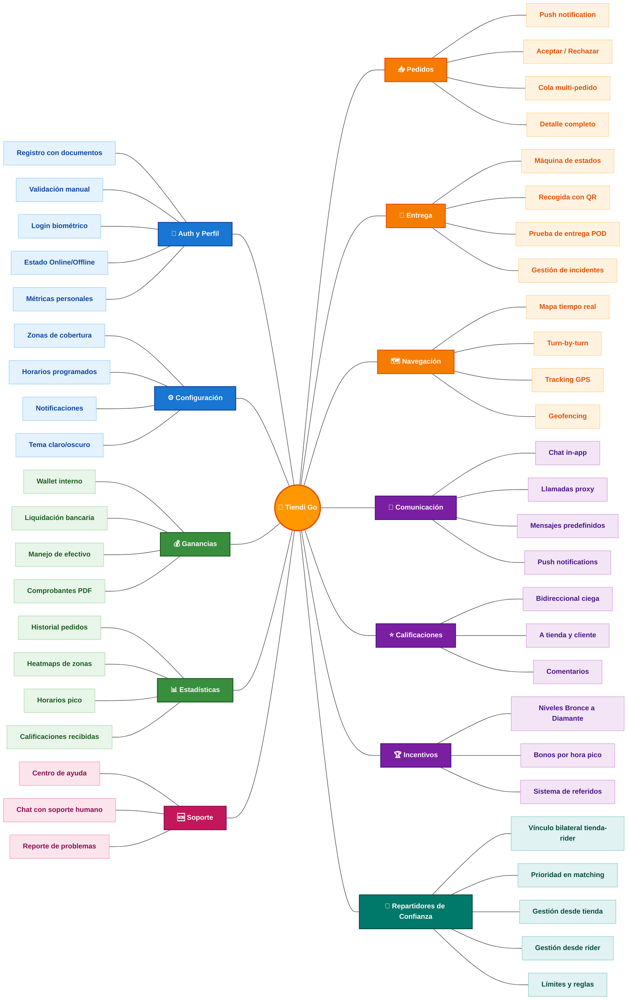

---

### 🧩 Vista por dominios (mindmaps separados)

> [!TIP]
> Cada dominio funcional tiene su propio mapa mental, así cada uno se puede leer enfocado sin saturación visual. Sirven para discutir features puntuales en reuniones de planning.

#### 🔐 Dominio: Core del Repartidor

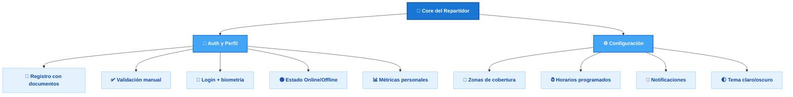

#### 📦 Dominio: Operación de Pedidos

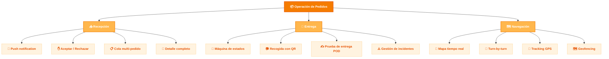

#### 💰 Dominio: Económico

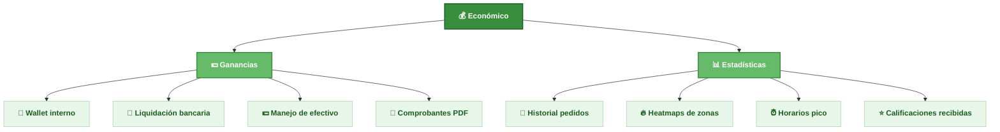

#### 💬 Dominio: Social y Retención

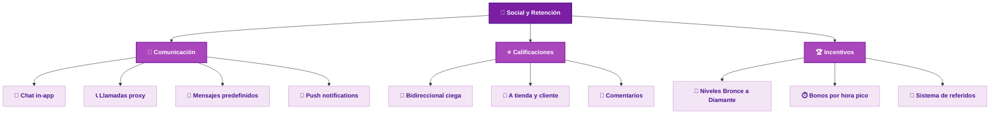

#### 🆘 Dominio: Soporte

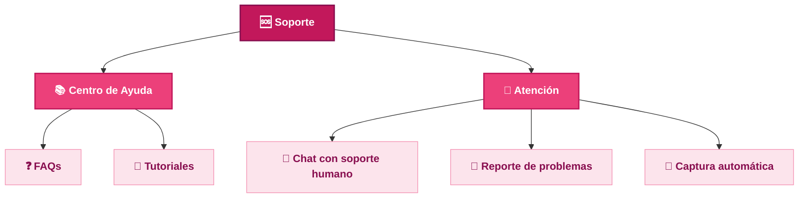

#### 🤝 Dominio: Repartidores de Confianza

```mermaid
flowchart TD
    TRUST["🤝 Repartidores de Confianza"]:::root

    TRUST --> VINCULO["🔗 Vínculo"]:::group
    TRUST --> MATCHING["⚡ Matching"]:::group
    TRUST --> GESTION["⚙️ Gestión"]:::group

    VINCULO --> V1["📩 Invitación bilateral"]:::leaf
    VINCULO --> V2["✅ Aceptar / Rechazar"]:::leaf
    VINCULO --> V3["Estados del vínculo"]:::leaf
    VINCULO --> V4["Historial y auditoría"]:::leaf

    MATCHING --> M1["Fase 1: riders de confianza"]:::leaf
    MATCHING --> M2["Timeout 60s → pool general"]:::leaf
    MATCHING --> M3["Prioridad por orden"]:::leaf

    GESTION --> G1["Vista tienda: lista + disponibilidad"]:::leaf
    GESTION --> G2["Vista rider: tiendas vinculadas"]:::leaf
    GESTION --> G3["Suspender / Revocar vínculo"]:::leaf
    GESTION --> G4["Límite 10 tiendas / 5 riders"]:::leaf

    classDef root fill:#00796b,stroke:#004d40,color:#fff,stroke-width:2px,font-weight:bold
    classDef group fill:#26a69a,stroke:#00796b,color:#fff,stroke-width:2px
    classDef leaf fill:#e0f2f1,stroke:#80cbc4,color:#004d40
```

---

### 📦 Vista general de módulos

| # | Módulo | Descripción | Fase |
|---|--------|-------------|------|
| 1 | 🔐 [Autenticación y Registro](#1-autenticación-y-registro) | Alta de repartidores, validación de documentos, login biométrico | MVP |
| 2 | 👤 [Perfil y Estado del Repartidor](#2-perfil-y-estado-del-repartidor) | Edición de datos, toggle Online/Offline, métricas personales | MVP |
| 3 | 📥 [Recepción y Gestión de Pedidos](#3-recepción-y-gestión-de-pedidos) | Push de pedidos, aceptación con timer, cola y detalle | MVP |
| 4 | 🚚 [Flujo de Entrega](#4-flujo-de-entrega) | Máquina de estados, recogida con QR, prueba de entrega (POD) | MVP |
| 5 | 🗺️ [Navegación y Geolocalización](#5-navegación-y-geolocalización) | Mapa en tiempo real, turn-by-turn, tracking compartido | MVP |
| 6 | 💬 [Comunicación](#6-comunicación) | Chat in-app, llamadas enmascaradas, push notifications | Fase 2 |
| 7 | 💰 [Ganancias y Pagos](#7-ganancias-y-pagos) | Wallet, liquidación bancaria, manejo de efectivo | MVP |
| 8 | 📊 [Historial y Estadísticas](#8-historial-y-estadísticas) | Listado de pedidos, calificaciones, heatmaps de zonas | Fase 2 |
| 9 | ⭐ [Calificaciones](#9-calificaciones) | Sistema bidireccional ciego, comentarios, promedios | Fase 2 |
| 10 | ⚙️ [Configuración](#10-configuración) | Zonas, radio, horarios, notificaciones, tema | MVP |
| 11 | 🆘 [Soporte y Ayuda](#11-soporte-y-ayuda) | FAQs, chat con soporte, reporte de problemas | MVP |
| 12 | 🏆 [Programa de Incentivos](#12-programa-de-incentivos-opcional) | Bonos por volumen, multiplicadores, referidos (los niveles los define el Módulo 13) | Fase 3 |
| 13 | 🎯 [Sistema de Puntuación](#13-sistema-de-puntuación) | Puntos por acción, penalizaciones, umbrales de nivel, multiplicadores | Fase 2 |
| ↳ | 🏅 [Logros Desbloqueables](#137-logros-desbloqueables) | 20 logros en 4 raridades (Común/Raro/Épico/Legendario), badges, bonus pts | Fase 2 |
| 14 | 🤝 [Repartidores de Confianza](#14-repartidores-de-confianza) | Vínculo bilateral tienda-rider, prioridad en matching, gestión desde ambas apps | Fase 2 |
| 15 | 🚚 [Admin de Flota](#15-admin-de-flota) | Panel para empresas de delivery: gestión de riders, splits de comisión, monitoreo en tiempo real | Fase 3 |

> [!TIP]
> Los módulos marcados como **MVP** son los mínimos para lanzar la primera versión funcional. Los de **Fase 2** y **Fase 3** se construyen después de validar el modelo con usuarios reales.

---

## Descripción General

**Tiendi Go** es la app de logística del ecosistema Tiendi. Permite que repartidores independientes o asociados reciban notificaciones cuando un pedido está listo en una tienda, confirmen la recogida, naveguen hasta el cliente y completen la entrega — todo desde su dispositivo móvil.

### Posición en el ecosistema

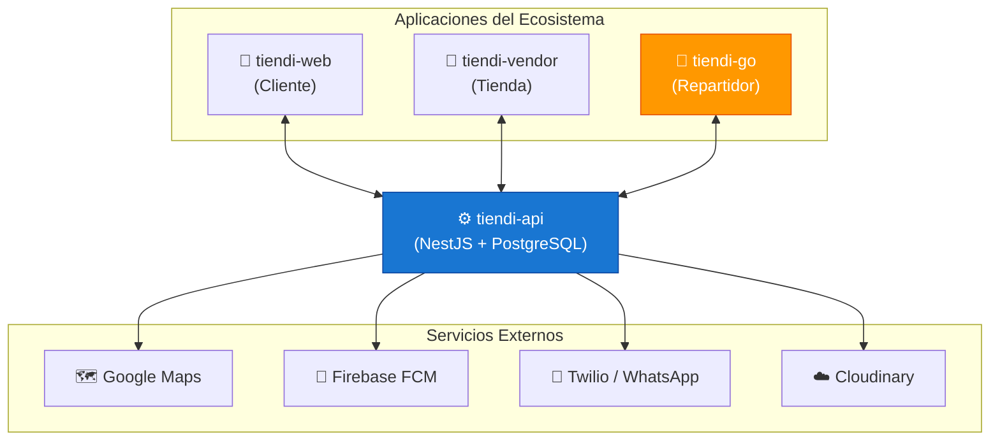

> [!IMPORTANT]
> **Tiendi Go NO tiene base de datos propia.** Toda la información persiste en `tiendi-api` para mantener consistencia con el resto del ecosistema. Solo cachea localmente datos no críticos (sesión, mapas offline, último estado).

---

## Roles del Sistema

| Rol | Descripción | App |
|-----|-------------|-----|
| 🛵 **Repartidor** | Persona física que opera la movilidad y realiza entregas | tiendi-go |
| 🏪 **Tienda** | Origen del pedido — notifica cuándo está listo | tiendi-vendor |
| 👤 **Cliente** | Destinatario final de la entrega | tiendi-web |
| 👔 **Admin de flota** | (Fase 3) Gestiona repartidores asociados a una empresa — ver [Módulo 15](#15-admin-de-flota) | tiendi-vendor (admin) |

---

## Módulos Funcionales

### 1. Autenticación y Registro

> [!NOTE]
> El módulo de autenticación tiene dos flujos completamente distintos: el **onboarding inicial** (que puede tardar días por la validación de documentos) y el **login recurrente** (que debe ser instantáneo). Diseñarlos igual es un error — uno necesita guía paso a paso, el otro necesita velocidad.

#### 1.1 Flujo de Registro

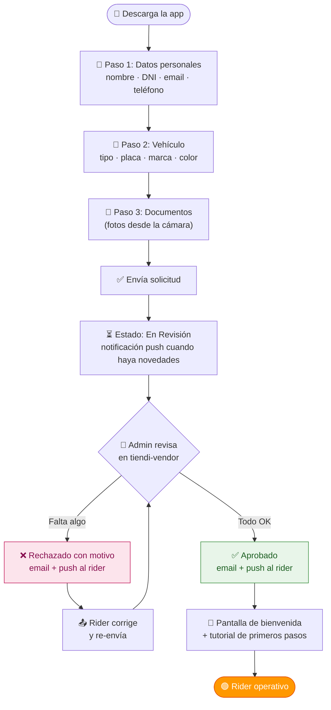

##### Datos personales (Paso 1)

| Campo | Tipo | Validación |
|-------|------|-----------|
| Nombre completo | Texto | Requerido |
| Tipo de documento | Selector (DNI / CE / Pasaporte) | Requerido |
| Número de documento | Texto | Requerido + formato por tipo |
| Email | Email | Requerido + único en el sistema |
| Teléfono | Tel | Requerido + verificación OTP por SMS |
| Foto de perfil | Imagen | Requerida — se toma desde la cámara |
| Contraseña | Password | Mín. 8 chars, 1 mayúscula, 1 número |

> [!IMPORTANT]
> El teléfono se verifica con **OTP por SMS** en el paso 1 antes de continuar. Esto garantiza que el número es real y que el rider puede recibir notificaciones críticas durante la operación.

##### Documentos requeridos (Paso 3)

| Documento | Formato | Validez |
|-----------|---------|---------|
| Licencia de conducir | Foto frente + dorso | Vigente al momento del registro |
| Tarjeta de propiedad | Foto | Coincide con vehículo declarado |
| SOAT | Foto | Vigente — el sistema alerta si vence en < 30 días |
| Antecedentes penales | PDF o foto del documento | Emitido en los últimos 90 días |

> [!WARNING]
> Los documentos se almacenan en **Cloudinary con acceso privado** — no son accesibles públicamente. Solo el admin de la plataforma puede verlos desde el panel de `tiendi-vendor`. El rider solo ve el estado (pendiente / aprobado / rechazado), nunca la URL del archivo.

#### 1.2 Flujo de Revisión por el Admin

> [!NOTE]
> Esta parte ocurre en **tiendi-vendor**, no en tiendi-go. La documentamos aquí porque es bloqueante para que el rider pueda operar.

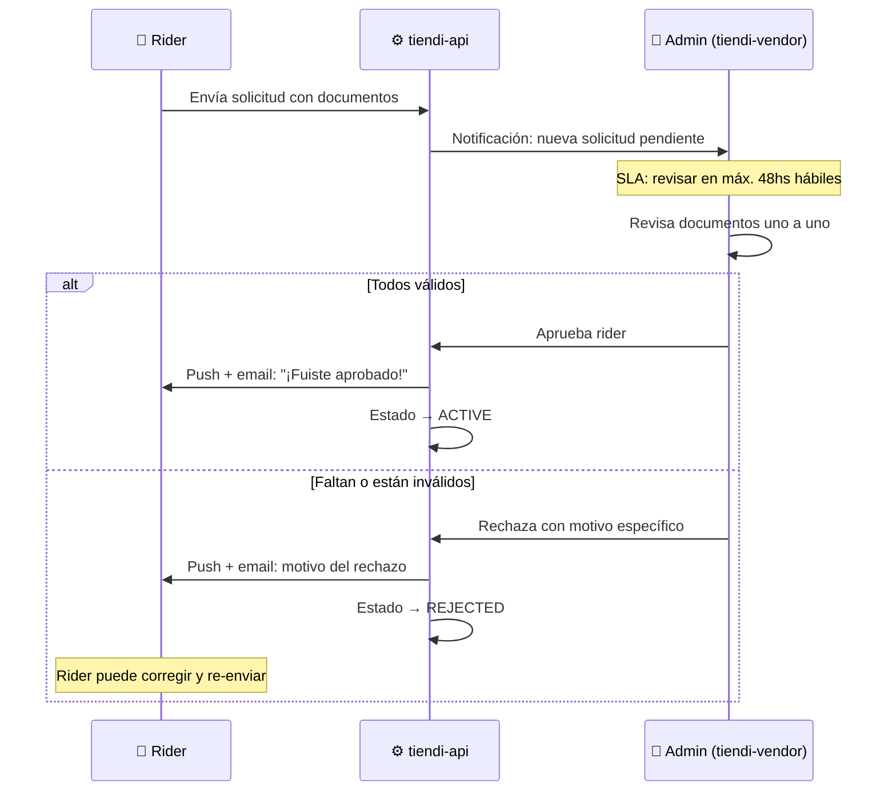

| Regla | Valor |
|-------|-------|
| SLA de revisión | 48 horas hábiles máximo |
| Intentos de re-envío | Sin límite — el rider puede corregir cuantas veces necesite |
| Notificación al rider | Push + email en cada cambio de estado |
| Notificación al admin | Push en tiendi-vendor cuando entra nueva solicitud |
| Documentos con vencimiento | El sistema alerta al admin si el SOAT vence en < 30 días |

#### 1.3 Estados del Repartidor

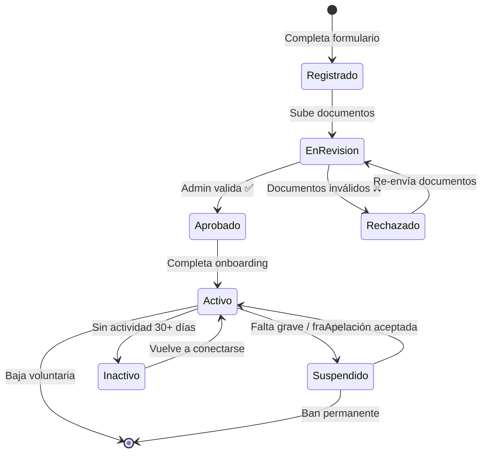

| Estado | Puede operar | Puede ver la app | Descripción |
|--------|:---:|:---:|-------------|
| Registrado | ❌ | ✅ | Completó el form, no subió documentos |
| En Revisión | ❌ | ✅ (modo espera) | Documentos enviados, esperando admin |
| Rechazado | ❌ | ✅ (puede corregir) | Admin rechazó con motivo específico |
| Aprobado | ❌ | ✅ | Aprobado, pendiente de completar onboarding |
| Activo | ✅ | ✅ | Operativo — puede recibir pedidos |
| Inactivo | ❌ | ✅ | Sin actividad 30+ días — se reactiva solo al conectarse |
| Suspendido | ❌ | ✅ (ve motivo) | Suspendido por la plataforma con motivo y fecha de revisión |

#### 1.4 Login recurrente

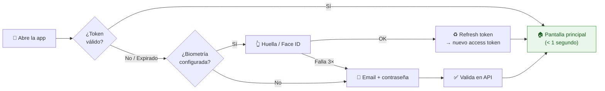

- **Login con Google / Facebook**: OAuth 2.0 — si el email coincide con uno registrado, inicia sesión; si no, crea cuenta nueva con flujo de documentos
- **Biometría**: se configura en el primer login exitoso — la app pregunta si quiere activarla
- **Recordar sesión**: el refresh token dura 7 días — el rider no necesita loguear cada día
- **Recuperación de contraseña**: email con link de un solo uso válido por 15 minutos

#### 1.5 Onboarding post-aprobación

> [!TIP]
> El onboarding es el momento de mayor abandono. Un rider aprobado que no completa el onboarding es tiempo y dinero de revisión perdidos. La app debe guiar paso a paso sin abrumar.

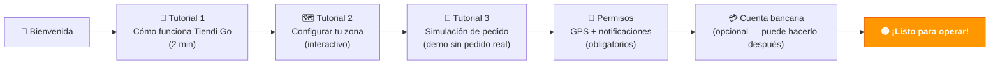

- Tutoriales saltables (excepto la configuración de permisos GPS — es bloqueante)
- La simulación de pedido muestra el flujo completo sin afectar pedidos reales
- La cuenta bancaria es opcional en el onboarding — puede agregarla después desde Configuración
- Si el rider cierra la app durante el onboarding, retoma desde el paso donde quedó

---

### 2. Perfil y Estado del Repartidor

#### 2.1 Pantalla de Perfil

La pantalla de perfil es el centro de gestión de identidad del repartidor. Se divide en secciones con diferentes niveles de permiso de edición.

```mermaid
flowchart TD
    PERFIL["👤 Pantalla de Perfil"]:::root

    PERFIL --> FOTO["📷 Foto de perfil\nEditable libremente"]:::group
    PERFIL --> DATOS["📋 Datos personales"]:::group
    PERFIL --> VEH["🛵 Vehículo activo"]:::group
    PERFIL --> DOCS["📄 Documentos"]:::group
    PERFIL --> BANK["🏦 Cuenta bancaria"]:::group
    PERFIL --> METRICAS["📊 Métricas de desempeño"]:::group

    DATOS --> D1["Nombre completo\n(requiere re-validación)"]:::leaf
    DATOS --> D2["Teléfono\n(requiere OTP)"]:::leaf
    DATOS --> D3["Email\n(requiere confirmación)"]:::leaf
    DATOS --> D4["Zona de trabajo\n(editable)"]:::leaf

    VEH --> V1["Tipo de vehículo"]:::leaf
    VEH --> V2["Placa / matrícula"]:::leaf
    VEH --> V3["Cambiar vehículo activo"]:::leaf

    DOCS --> DO1["Licencia de conducir"]:::leaf
    DOCS --> DO2["SOAT / seguro"]:::leaf
    DOCS --> DO3["Antecedentes penales"]:::leaf
    DOCS --> DO4["Tarjeta de propiedad"]:::leaf

    BANK --> B1["Número de cuenta"]:::leaf
    BANK --> B2["Banco / entidad"]:::leaf
    BANK --> B3["Titular de la cuenta"]:::leaf

    METRICAS --> M1["Rating actual"]:::leaf
    METRICAS --> M2["Pedidos del mes"]:::leaf
    METRICAS --> M3["Nivel de puntuación"]:::leaf

    classDef root fill:#1976d2,stroke:#0d47a1,color:#fff,stroke-width:2px,font-weight:bold
    classDef group fill:#42a5f5,stroke:#1976d2,color:#fff,stroke-width:2px
    classDef leaf fill:#e3f2fd,stroke:#90caf9,color:#0d47a1
```

#### 2.2 Campos editables vs. campos con re-validación

> [!IMPORTANT]
> No todos los campos del perfil se pueden editar libremente. Algunos activan un flujo de re-validación por parte del admin antes de reflejarse en el sistema.

| Campo | ¿Editable libremente? | Requiere re-validación | Motivo |
|-------|-----------------------|------------------------|--------|
| Foto de perfil | ✅ Sí | No | Solo estético |
| Nombre / apellido | ⚠️ Parcial | Sí — admin review | Identidad legal |
| Teléfono | ⚠️ Parcial | Sí — OTP al nuevo número | Contacto crítico |
| Email | ⚠️ Parcial | Sí — link de confirmación | Login alternativo |
| Zona de trabajo | ✅ Sí | No | Afecta matching, no identidad |
| Tipo de vehículo | ❌ No | Sí — ver 2.4 | Implica cambio de documentos |
| Placa / matrícula | ❌ No | Sí — admin review | Dato legal |
| Licencia de conducir | ❌ No | Sí — admin review | Documento regulatorio |
| SOAT / seguro | ❌ No | Sí — admin review | Vencimiento y validez |
| Antecedentes | ❌ No | Sí — admin review | Documento regulatorio |
| Cuenta bancaria | ⚠️ Parcial | Sí — validación IBAN/CBU | Impacto en liquidaciones |

> [!NOTE]
> Mientras una actualización que requiere re-validación está **pendiente de revisión**, el repartidor sigue operando con los datos anteriores. El campo muestra un badge `🕐 Pendiente de aprobación`.

#### 2.3 Estado de disponibilidad

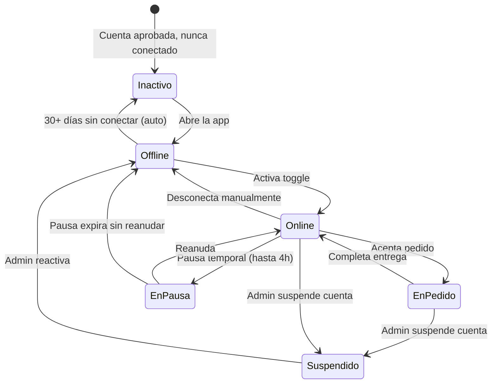

| Estado | ¿Puede operar? | ¿Ve la app? | Detalle |
|--------|---------------|-------------|---------|
| `Inactivo` | ❌ | ✅ | Sin actividad 30+ días. Auto-reactiva al reconectar. |
| `Offline` | ❌ | ✅ | Conectado pero no disponible. No recibe pedidos. |
| `Online` | ✅ | ✅ | Disponible. GPS activo. Recibe ofertas de pedidos. |
| `EnPedido` | ✅ | ✅ | Con una o más entregas activas en curso. |
| `EnPausa` | ❌ | ✅ | Pausa voluntaria (hasta 4h). Sin recibir pedidos nuevos. |
| `Suspendido` | ❌ | ✅ (solo vista) | Acción del admin. Rider ve motivo. No puede reconectar. |

> [!TIP]
> El estado **En Pausa** es clave para la retención. Permite que el rider descanse sin desconectarse, conservando su posición en el matching pool.

**Reglas de pausa:**
- Máximo 4 horas continuas en pausa.
- Si la pausa expira sin que el rider la reanude, el sistema pasa automáticamente a `Offline`.
- Una notificación push se envía 15 minutos antes del vencimiento de la pausa.

#### 2.4 Flujo de cambio de vehículo

El cambio de vehículo activo no es instantáneo — requiere validación de nuevos documentos.

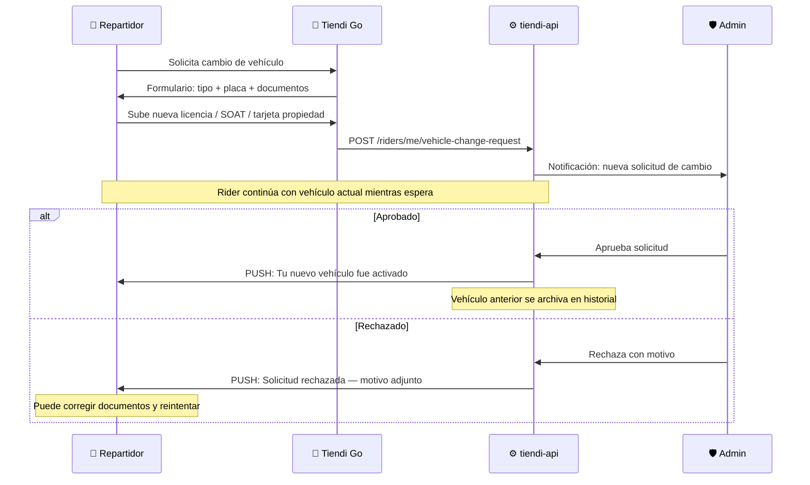

> [!WARNING]
> Si el repartidor tiene un pedido activo al momento de aprobar el cambio de vehículo, el switch al nuevo vehículo se aplica al finalizar el pedido en curso — nunca en medio de una entrega.

**Documentos requeridos según tipo de vehículo:**

| Vehículo | Licencia | SOAT | Tarjeta propiedad | Otros |
|----------|----------|------|-------------------|-------|
| Motocicleta | ✅ (A1/A2) | ✅ | ✅ | — |
| Automóvil | ✅ (B) | ✅ | ✅ | — |
| Bicicleta | ❌ | ❌ | ❌ | Foto del vehículo |
| A pie | ❌ | ❌ | ❌ | — |

#### 2.5 Métricas personales en perfil

La sección de métricas en el perfil ofrece una vista resumida del desempeño del repartidor. El detalle completo vive en el **Módulo 8 — Historial y Estadísticas**.

| Métrica | Periodo | Descripción |
|---------|---------|-------------|
| Rating público | Acumulado | Promedio ponderado. Visible para tiendas. Requiere mín. 5 calificaciones. |
| Pedidos completados | Mes actual / Total | Contador simple. |
| Tasa de aceptación | Últimos 30 días | `pedidos_aceptados / pedidos_ofrecidos × 100` |
| Tasa de cancelación | Últimos 30 días | `cancelaciones_rider / pedidos_aceptados × 100` |
| Tiempo promedio de entrega | Últimos 30 días | Desde `pickup_confirmed` hasta `delivery_confirmed` |
| Nivel de puntuación | Mes actual | Ver [Módulo 13 — Sistema de Puntuación](#13-sistema-de-puntuación) |

> [!NOTE]
> La tasa de aceptación por debajo del **60%** durante 7 días consecutivos activa una alerta al rider. Por debajo del **40%** durante 14 días puede derivar en una revisión de cuenta por el admin.

---

### 3. Recepción y Gestión de Pedidos

#### 3.1 Motor de asignación (Matching Engine)

El matching no es aleatorio — sigue un pipeline con dos fases para priorizar la confianza y la cercanía antes de abrir al pool general.

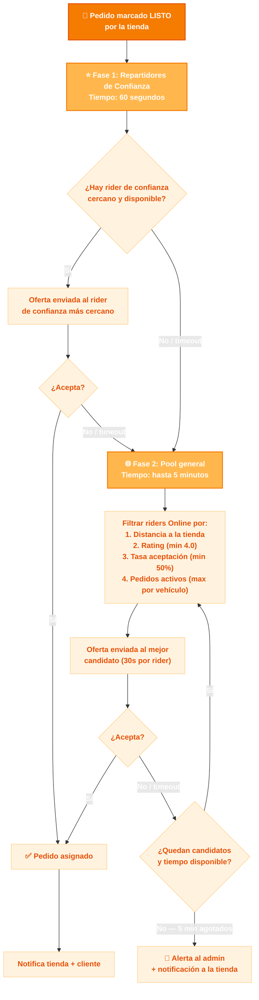

**Criterios de scoring para selección en Fase 2:**

| Criterio | Peso | Detalle |
|----------|------|---------|
| Distancia al punto de recogida | 40% | Menor distancia = mayor score |
| Rating del rider | 30% | Promedio ponderado (ver Módulo 9) |
| Tasa de aceptación (30 días) | 20% | Penaliza a quienes rechazan mucho |
| Pedidos activos actuales | 10% | Prefiere riders con menos carga |

> [!NOTE]
> El algoritmo de Fase 2 es serverside en `tiendi-api`. El rider no puede ver su posición en la cola — solo recibe la oferta cuando le toca.

**Impacto de rechazar una oferta:**

| Acción | Efecto en tasa de aceptación | Efecto en puntuación mensual |
|--------|------------------------------|------------------------------|
| Acepta | Sin efecto negativo | +puntos según entrega |
| Rechaza manualmente | Cuenta como rechazo | Sin penalización directa |
| Timeout (sin respuesta) | Cuenta como rechazo | **-5 pts** (ver §13.3) |
| Ignora estando en pausa | No cuenta — el sistema no ofrece si está en pausa | — |

#### 3.2 Tarjeta de oferta de pedido

Cuando el sistema selecciona a un rider, le muestra una tarjeta emergente con todos los datos relevantes para decidir **antes** de aceptar.

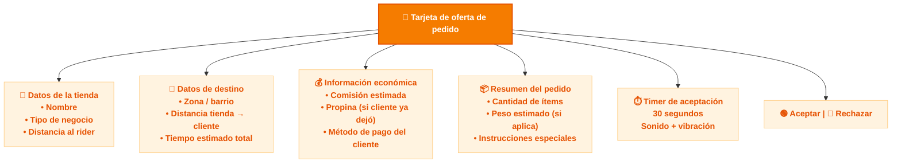

> [!TIP]
> La comisión mostrada en la tarjeta es **estimada** — el valor final se recalcula en el servidor al confirmar la entrega, usando la distancia GPS real recorrida. Esto protege contra manipulaciones de ruta.

#### 3.3 Flujo completo de aceptación

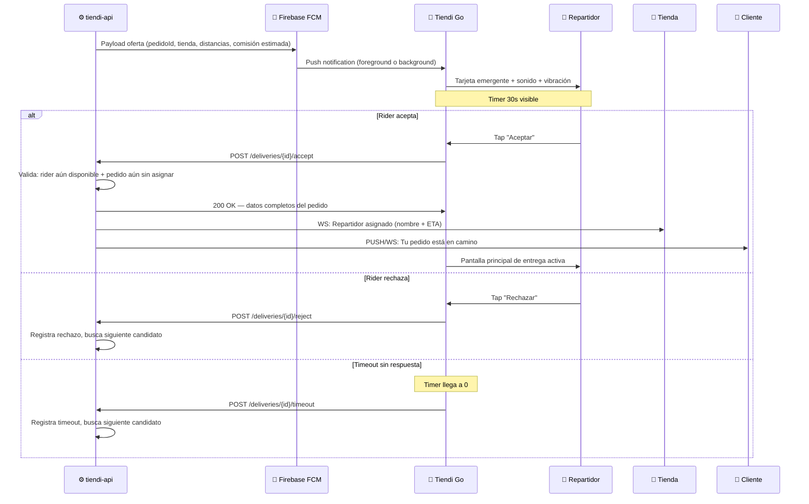

> [!WARNING]
> Existe una condición de carrera: dos riders pueden aceptar el mismo pedido casi simultáneamente. `tiendi-api` usa un **lock optimista** (`UPDATE SET rider_id WHERE rider_id IS NULL`) — solo uno gana. El segundo recibe un `409 Conflict` y la app lo informa como "ya asignado a otro rider".

#### 3.4 Cola de pedidos activos

El rider puede tener más de un pedido en curso simultáneamente (batching), según el tipo de vehículo.

**Límites de batching por vehículo:**

| Vehículo | Pedidos simultáneos máx. | Condición |
|----------|--------------------------|-----------|
| A pie | 1 | Sin batching |
| Bicicleta | 2 | Solo si van a la misma zona |
| Motocicleta | 3 | Ruta optimizada |
| Automóvil | 4 | Ruta optimizada |

**Pantalla de cola de pedidos activos:**

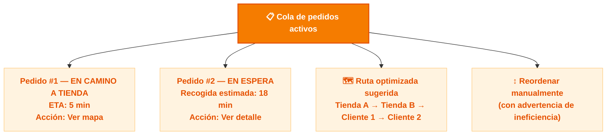

> [!NOTE]
> El algoritmo de ruta sugerida usa el **TSP (Travelling Salesman Problem) aproximado** con heurística greedy — no es el óptimo matemático, pero es suficientemente bueno y se calcula en tiempo real sin demoras perceptibles.

#### 3.5 Pantalla de detalle del pedido

Una vez aceptado, el rider accede a la pantalla de detalle con todos los datos del pedido.

| Sección | Contenido | Restricción |
|---------|-----------|-------------|
| **Tienda** | Nombre, tipo de negocio, dirección | Teléfono → proxy Twilio |
| **Cliente** | Nombre, dirección, referencias de entrega | Teléfono → proxy Twilio |
| **Ítems** | Lista completa: nombre, cantidad, variante | Solo lectura |
| **Instrucciones** | Notas del cliente y de la tienda | Solo lectura |
| **Pago** | Método (efectivo / ya pagado), monto si es contra entrega | Solo lectura |
| **Mapa** | Tienda → Cliente, con la ruta trazada | Interactivo |
| **Comunicación** | Llamar / WhatsApp a tienda o cliente | Números proxy (ver Módulo 6) |

> [!CAUTION]
> Los números reales de tienda y cliente **nunca** se exponen al repartidor. Se usan números proxy de Twilio Voice activos únicamente durante la entrega. Al finalizar el pedido, el número proxy expira.

**Acciones disponibles desde el detalle:**

- `Iniciar ruta a tienda` → abre navegación (Google Maps / Waze / Apple Maps)
- `Confirmar recogida` → activo solo cuando el geofence de 150m detecta al rider en la tienda
- `Reportar problema` → abre flujo de incidente (ver Módulo 11)
- `Ver instrucciones especiales` → modal con notas del cliente y de la tienda
- `Contactar` → llama o escribe al proxy de tienda o cliente

---

### 4. Flujo de Entrega

#### 4.1 Estados del pedido (visión del repartidor)

```mermaid
stateDiagram-v2
    [*] --> Asignado: Acepta pedido
    Asignado --> EnCaminoTienda: Inicia ruta
    EnCaminoTienda --> EnTienda: Llega (geofence 150m)
    EnTienda --> Recogido: Confirma + QR/código
    Recogido --> EnCaminoCliente: Inicia ruta al cliente
    EnCaminoCliente --> EnDestino: Llega (geofence 200m)
    EnDestino --> Entregado: POD completo
    Entregado --> [*]

    Asignado --> Cancelado: Rider cancela antes de salir
    EnCaminoTienda --> Cancelado: Incidente antes de llegar
    EnTienda --> Cancelado: Tienda informa pedido no disponible
    EnCaminoCliente --> Incidente: Problema en ruta
    EnDestino --> Incidente: Cliente no responde / rechaza
    Incidente --> Entregado: Resuelto con POD alternativo
    Incidente --> Cancelado: Escalado a soporte
    Cancelado --> [*]
```

**Tabla de estados — acciones y responsables:**

| Estado | Quién puede dispararlo | Rider puede actuar | Notificación automática |
|--------|----------------------|--------------------|------------------------|
| `Asignado` | Sistema (matching) | Ver detalle, navegar | Tienda + Cliente |
| `EnCaminoTienda` | Rider (inicia ruta) | Navegar, contactar tienda | Tienda (ETA) |
| `EnTienda` | Sistema (geofence 150m) | Confirmar recogida | Tienda |
| `Recogido` | Rider (confirma QR/código) | Iniciar ruta a cliente | Cliente (notif. "en camino") |
| `EnCaminoCliente` | Rider (inicia 2da ruta) | Navegar, contactar cliente | Cliente (ETA actualizado) |
| `EnDestino` | Sistema (geofence 200m) | Confirmar entrega, reportar incidente | Cliente (notif. "llegó") |
| `Entregado` | Rider (POD completo) | Calificar cliente | Tienda + Cliente (confirmación) |
| `Incidente` | Rider (reporta) | Escalar o resolver | Soporte + Tienda |
| `Cancelado` | Rider / Admin | Ver historial | Tienda + Cliente |

#### 4.2 Confirmación de recogida en la tienda

El geofence de 150m activa el botón de confirmación — el rider no puede confirmar recogida si está lejos de la tienda.

```mermaid
sequenceDiagram
    participant R as 🛵 Rider
    participant APP as 📱 Tiendi Go
    participant API as ⚙️ tiendi-api
    participant T as 🏪 Tienda

    Note over R,APP: Rider llega a la tienda
    API->>APP: GPS coords dentro de geofence 150m
    APP->>APP: Activa botón "Confirmar recogida"
    R->>APP: Toca "Confirmar recogida"

    APP->>R: Opciones de verificación
    alt QR disponible en la tienda
        R->>APP: Escanea QR del pedido
        APP->>API: POST /deliveries/{id}/pickup { method: "qr", code }
        API->>API: Valida que el QR corresponde al pedido
    else Sin QR — código verbal
        T->>R: Comunica código de 4 dígitos verbalmente
        R->>APP: Ingresa código manual
        APP->>API: POST /deliveries/{id}/pickup { method: "code", code }
        API->>API: Valida código contra el pedido
    end

    alt Verificación exitosa
        APP->>R: Solicita foto opcional del paquete
        R->>APP: Captura foto (o omite)
        APP->>API: Sube foto a Cloudinary (acceso privado)
        API->>T: WS: Pedido recogido — repartidor en camino al cliente
        API->>APP: Estado → Recogido
    else Código incorrecto
        API->>APP: 422 — Código no coincide
        APP->>R: "Código incorrecto. Pedí el código nuevamente a la tienda."
        Note over R: Puede reintentar hasta 3 veces
    end
```

> [!NOTE]
> Si el rider no puede entrar al geofence porque la dirección de la tienda en el sistema está incorrecta, puede usar el **flujo de excepción de recogida**: reporta el problema → soporte valida manualmente → habilita confirmación manual con foto obligatoria.

#### 4.3 Prueba de Entrega (POD)

> [!IMPORTANT]
> La **Prueba de Entrega (POD)** es legalmente vinculante. Sin un POD válido, la plataforma no puede defender reclamos de "no recibí mi pedido". Es **obligatorio** capturar al menos foto + código OTP. La firma es opcional pero suma peso legal.

**Flujo de POD — pago ya realizado (digital):**

```mermaid
flowchart TD
    DEST["📍 Rider en geofence del cliente\n200m de radio"]:::root

    DEST --> OTP["📱 Sistema envía OTP por SMS\nal número del cliente (proxy)"]:::group
    OTP --> FOTO["📷 Rider toma foto\ndel paquete / lugar de entrega"]:::group
    FOTO --> UPLOAD["☁️ Foto sube a Cloudinary\ncon acceso privado + hash SHA256"]:::group
    UPLOAD --> FIRMA{"¿Cliente presente?"}:::group

    FIRMA -->|Sí, en persona| SIG["✍️ Firma digital en pantalla\n(opcional, peso legal extra)"]:::leaf
    FIRMA -->|No está / deja en puerta| NOSHOW["📝 Nota: 'Dejado en puerta'\no 'Entregado a tercero'"]:::leaf

    SIG & NOSHOW --> CODE["🔢 Rider ingresa código OTP\nque el cliente le comunica"]:::group
    CODE --> SUBMIT["POST /deliveries/{id}/complete\n{ photo_url, otp, signature?, note? }"]:::group
    SUBMIT --> VALID{"Validación\nen tiendi-api"}:::group

    VALID -->|OTP correcto + foto presente| OK["✅ Entrega confirmada\nComisión calculada y acreditada"]:::leaf
    VALID -->|OTP incorrecto| RETRY["Reintentar OTP\n(máx 3 intentos)"]:::leaf
    VALID -->|3 intentos fallidos| INCIDENT["🚨 Abre flujo de incidente\nautomáticamente"]:::leaf
    RETRY --> CODE

    classDef root fill:#f57c00,stroke:#e65100,color:#fff,stroke-width:2px,font-weight:bold
    classDef group fill:#ffb74d,stroke:#f57c00,color:#fff,stroke-width:2px
    classDef leaf fill:#fff3e0,stroke:#ffcc80,color:#e65100
```

> [!NOTE]
> Si el cliente no tiene señal para recibir el OTP, el rider puede usar el **código QR offline** generado al inicio de la entrega (almacenado localmente). Este es el fallback para zonas de cobertura limitada.

**Flujo adicional — pago contra entrega (efectivo):**

```mermaid
flowchart TD
    CASH["💵 Pago contra entrega"]:::root
    CASH --> COBRAR["Rider cobra monto exacto\nindica en app si hay cambio"]:::group
    COBRAR --> VUELTO{"¿Requiere vuelto?"}:::group
    VUELTO -->|Sí| CAMBIO["Rider registra:\n• Monto recibido\n• Cambio entregado"]:::leaf
    VUELTO -->|No| EXACTO["Registra monto cobrado"]:::leaf
    CAMBIO & EXACTO --> POD["Continúa con POD normal\n(foto + OTP)"]:::group
    POD --> WALLET["💼 Monto se registra\nen bucket cash-on-hand\ndel wallet del rider"]:::group

    classDef root fill:#f57c00,stroke:#e65100,color:#fff,stroke-width:2px,font-weight:bold
    classDef group fill:#ffb74d,stroke:#f57c00,color:#fff,stroke-width:2px
    classDef leaf fill:#fff3e0,stroke:#ffcc80,color:#e65100
```

> [!WARNING]
> El efectivo cobrado **no pertenece al rider** — va al bucket `cash_on_hand` del wallet y se liquida con la tienda. El rider actúa como intermediario. Una discrepancia repetida entre monto declarado y monto esperado puede activar una revisión de cuenta.

**Almacenamiento de POD:**

| Elemento | Almacenamiento | Acceso |
|----------|---------------|--------|
| Foto del paquete | Cloudinary (carpeta privada `/pod/`) | Solo admin + tienda + rider (período limitado) |
| Hash SHA256 de la foto | Base de datos (`DELIVERY_EVENT`) | Interno — anti-duplicado |
| Código OTP usado | Base de datos (hashed) | Auditoría interna |
| Firma digital (SVG/PNG) | Cloudinary (carpeta privada `/signatures/`) | Solo admin + tienda |
| Nota de entrega | Base de datos (`DELIVERY.pod_notes`) | Admin + tienda + cliente |

#### 4.4 Gestión de incidentes durante la entrega

Los incidentes son situaciones que impiden completar la entrega en el flujo normal. Cada tipo tiene un protocolo específico.

```mermaid
flowchart TD
    INC["🚨 Rider reporta incidente"]:::root

    INC --> T1["❓ Cliente no responde"]:::group
    INC --> T2["📍 Dirección incorrecta"]:::group
    INC --> T3["📦 Producto dañado\nen tránsito"]:::group
    INC --> T4["🚫 Cliente rechaza\nel pedido"]:::group
    INC --> T5["🛵 Problema con\nel vehículo"]:::group
    INC --> T6["🏪 Tienda no tenía\nel pedido listo"]:::group

    T1 --> A1["Rider espera 10 min\nEnvía 2 mensajes proxy\nLlama 1 vez"]:::leaf
    T1 --> A1B["Si no responde:\nDeja en puerta + foto\no devuelve a tienda"]:::leaf

    T2 --> A2["Rider contacta cliente\nvía proxy para nueva dirección"]:::leaf
    T2 --> A2B["Si inviable:\nAdmin ajusta ruta\no cancela con cargo al cliente"]:::leaf

    T3 --> A3["Foto obligatoria del daño\nTicket automático\nAdmin decide: devolver o POD parcial"]:::leaf

    T4 --> A4["Rider documenta rechazo\nDevuelve a tienda o descarta\nsegún política del negocio"]:::leaf

    T5 --> A5["Rider informa posición\nSoporte consigue reemplazo\no cancela con penalidad reducida"]:::leaf

    T6 --> A6["Estado → CanceladoPorTienda\nRider cobra tarifa mínima\nTienda recibe penalización"]:::leaf

    classDef root fill:#c2185b,stroke:#880e4f,color:#fff,stroke-width:2px,font-weight:bold
    classDef group fill:#ec407a,stroke:#c2185b,color:#fff,stroke-width:2px
    classDef leaf fill:#fce4ec,stroke:#f48fb1,color:#880e4f
```

**Tabla de incidentes — impacto y responsabilidades:**

| Tipo | Causa | Responsable | Rider cobra | Penalización |
|------|-------|-------------|-------------|--------------|
| Cliente no responde | Cliente | Cliente | Tarifa completa | Sin penalidad al rider |
| Dirección incorrecta | Cliente / tienda | Según validación | Tarifa base + extra por espera | Sin penalidad al rider |
| Producto dañado en tránsito | Rider (si se comprueba) / Packaging | Según evidencia | Parcial o ninguno | Posible descuento al rider |
| Cliente rechaza pedido | Cliente | Cliente | Tarifa completa + regreso | Sin penalidad al rider |
| Problema de vehículo | Rider | Rider | Tarifa mínima | Sin penalidad adicional |
| Tienda sin pedido listo | Tienda | Tienda | Tarifa mínima de compensación | Penalización a la tienda |

> [!CAUTION]
> Todos los incidentes se registran en el historial del rider y la tienda. Un patrón de incidentes del mismo tipo en el mismo rider puede escalar a una revisión de cuenta por el admin.

#### 4.5 Cancelación por parte del rider

El rider puede cancelar un pedido aceptado, pero con restricciones crecientes según el estado en que se encuentre.

| Estado al cancelar | ¿Puede cancelar? | Impacto en tasa de cancelación | Penalización en puntuación |
|--------------------|-----------------|-------------------------------|---------------------------|
| `Asignado` (aún no salió) | ✅ Sí | Cuenta como cancelación | Leve (-5 pts) |
| `EnCaminoTienda` | ✅ Sí, con motivo obligatorio | Cuenta como cancelación | Moderada (-15 pts) |
| `EnTienda` | ⚠️ Solo con motivo de fuerza mayor | Cuenta como cancelación | Alta (-30 pts) |
| `Recogido` (tiene el pedido) | ❌ No — debe devolver antes | Requiere flujo de devolución | Alta + revisión de cuenta |
| `EnCaminoCliente` | ❌ No — debe completar o reportar incidente | N/A | N/A |

> [!WARNING]
> Si el rider tiene el pedido físicamente (`Recogido` o posterior) y quiere cancelar, debe activar el **flujo de devolución**: llevar el pedido de regreso a la tienda, confirmar la devolución con foto + código de la tienda, y solo entonces el sistema registra la cancelación. La comisión se pierde pero no se acumula penalización adicional si la devolución se completa correctamente.

---

### 5. Navegación y Geolocalización

> [!NOTE]
> La navegación es el corazón operativo de la app — el rider la usa activamente durante cada entrega. Una mala implementación de GPS o de routing impacta directamente en el tiempo de entrega y en la experiencia del cliente.

#### 5.1 Stack de navegación

| Capa | Tecnología | Responsabilidad |
|------|-----------|----------------|
| **Mapas base** | Google Maps SDK (Android/iOS) | Renderizado del mapa, markers, polylines |
| **Navegación turn-by-turn** | Google Maps App (deep link) / Waze (deep link) | Instrucciones de voz y ruta — app externa |
| **Geolocalización** | expo-location | Lectura del GPS del dispositivo |
| **Tracking en tiempo real** | Socket.IO sobre WebSocket | Envío de coordenadas a tiendi-api |
| **Optimización de rutas** | Google Directions API (multi-waypoint) | Cálculo de ruta óptima para multi-pedido |
| **Geocoding** | Google Geocoding API | Convertir dirección de texto a coordenadas |

> [!IMPORTANT]
> La navegación turn-by-turn se delega a **Google Maps o Waze mediante deep link** — no se implementa dentro de la app. Esto ahorra meses de desarrollo y aprovecha apps que el rider ya conoce y confía. La app solo provee el punto de origen y destino; la navegación ocurre fuera.

#### 5.2 Flujo de tracking GPS

```mermaid
flowchart TD
    GPS["📍 GPS del dispositivo"] --> THROTTLE{"🎚️ Throttling\nadaptativo"}

    THROTTLE -->|"Sin pedido activo"| T1["Cada 30s\n(batería prioritaria)"]
    THROTTLE -->|"En tránsito"| T2["Cada 10s\n(balance)"]
    THROTTLE -->|"Cerca de origen/destino\n< 500m"| T3["Cada 3s\n(precisión prioritaria)"]

    T1 & T2 & T3 --> SEND["📡 Envía coordenadas\nvía WebSocket"]
    SEND --> API["⚙️ tiendi-api"]
    API --> STORE["💾 Guarda en\nDELIVERY_EVENT"]
    API --> BROADCAST["📢 Broadcast"]
    BROADCAST --> TIENDA["🏪 Tienda"]
    BROADCAST --> CLIENTE["👤 Cliente"]

    style T1 fill:#e8f5e9,stroke:#388e3c
    style T2 fill:#fff3e0,stroke:#f57c00
    style T3 fill:#fce4ec,stroke:#c2185b
```

> [!WARNING]
> El GPS continuo a alta frecuencia puede drenar la batería en 3-4 horas en dispositivos de gama baja — los más comunes entre riders. El throttling adaptativo **no es un nice-to-have**, es un requisito para que la app sea usable en jornadas completas de 8+ horas.

#### 5.3 Navegación turn-by-turn

```mermaid
sequenceDiagram
    participant RIDER as 🛵 Rider
    participant APP as 📱 Tiendi Go
    participant DEEP as 🗺️ Google Maps / Waze
    participant API as ⚙️ tiendi-api

    APP->>API: GET coordenadas de tienda/cliente
    API->>APP: { lat, lng, address }
    APP->>RIDER: Botón "Navegar"
    RIDER->>APP: Toca "Navegar"
    APP->>APP: Construye deep link\ngoogleMaps://maps?daddr={lat},{lng}
    APP->>DEEP: Abre app externa con destino
    Note over DEEP: Rider navega en Google Maps / Waze
    Note over APP: App sigue trackeando GPS en background
    DEEP->>RIDER: Instrucciones de voz
    RIDER->>APP: Llega al destino → confirma en Tiendi Go
```

**Deep link formats:**

| App | URL scheme | Fallback |
|-----|-----------|---------|
| Google Maps | `google.maps://maps?daddr={lat},{lng}` | `https://maps.google.com/?daddr=` |
| Waze | `waze://?ll={lat},{lng}&navigate=yes` | `https://waze.com/ul?ll=` |
| Apple Maps (iOS) | `maps://?daddr={lat},{lng}` | — |

#### 5.4 Optimización de rutas para multi-pedido

> [!NOTE]
> Cuando el rider tiene 2+ pedidos activos simultáneamente (batching), el sistema calcula la ruta óptima para minimizar el tiempo total de entrega — no simplemente ir en orden de asignación.

```mermaid
flowchart LR
    ORDERS["📦 2+ pedidos\nasignados"] --> WAYPOINTS["📍 Waypoints:\nTienda A · Tienda B · Cliente A · Cliente B"]
    WAYPOINTS --> DIRECTIONS["🗺️ Google Directions API\n(optimize:waypoints=true)"]
    DIRECTIONS --> OPTIMAL["✅ Ruta óptima\nordenada"]
    OPTIMAL --> DISPLAY["Muestra orden sugerido\nen pantalla al rider"]
    DISPLAY --> OVERRIDE["🔄 Rider puede\nreordenar manualmente"]
```

- El rider ve la lista reordenada con el tiempo estimado total
- Puede ignorar la sugerencia y mantener su propio orden
- Cada parada está numerada en el mapa con marcadores `①②③④`
- Si un pedido se cancela durante la ruta, se recalcula automáticamente

#### 5.5 Manejo de zonas sin señal GPS

> [!CAUTION]
> Las zonas sin señal son un vector de fraude no intencional — el rider puede quedar bloqueado en la confirmación de entrega si el geofencing falla por falta de GPS. Hay que tener un fallback claro.

| Escenario | Comportamiento |
|-----------|---------------|
| GPS impreciso (> 50m de error) | Muestra advertencia en app — el rider puede continuar pero queda registrado |
| Sin GPS por < 2 minutos | Usa última posición conocida + indicador visual "Señal débil" |
| Sin GPS por > 2 minutos | Notifica al rider — sugiere moverse a zona abierta |
| Sin GPS en confirmación de entrega | Permite confirmar con **código OTP** que el cliente genera en su app como alternativa al geofence |
| Sin internet (offline total) | Cola de eventos local — se sincroniza cuando vuelve la conexión. Solo operaciones de lectura disponibles |

#### 5.6 Permisos y consentimiento

```mermaid
flowchart TD
    INSTALL["📲 Primera apertura\nde la app"]:::root --> PERM{"¿Permiso GPS\notorgado?"}:::group

    PERM -->|"Siempre / En uso"| ACTIVE["✅ Tracking activo\ncuando está Online"]:::ok
    PERM -->|"Solo al usar"| WARN["⚠️ Funcionalidad\nlimitada en background"]:::warn
    PERM -->|"Nunca / Denegado"| BLOCK["🚫 App no puede operar\n— GPS es requerido"]:::bad

    ACTIVE --> CONSENT["📋 Pantalla de consentimiento\n(qué datos se recolectan, por qué,\ncómo se almacenan)"]
    CONSENT --> TOGGLE["⚙️ El rider puede desactivar\nel tracking entre pedidos"]

    classDef root fill:#ff9800,stroke:#e65100,color:#fff,stroke-width:2px,font-weight:bold
    classDef group fill:#42a5f5,stroke:#1976d2,color:#fff,stroke-width:2px
    classDef ok fill:#e8f5e9,stroke:#388e3c,color:#1b5e20
    classDef warn fill:#fff3e0,stroke:#f57c00,color:#e65100
    classDef bad fill:#fce4ec,stroke:#c2185b,color:#880e4f
```

- La app requiere permiso de GPS **"Siempre"** para poder trackear en background cuando el dispositivo está bloqueado
- Si el rider solo otorga "En uso", se le explica por qué el tracking en background es necesario (la tienda y el cliente necesitan ver la ubicación aunque el teléfono esté en el bolsillo)
- El consentimiento incluye: qué coordenadas se guardan, por cuánto tiempo, quién las ve y que se pueden eliminar solicitándolo
- Entre pedidos, el rider puede desactivar el tracking — el sistema lo marca como **En Pausa** automáticamente

---

### 6. Comunicación

> [!NOTE]
> La comunicación en Tiendi Go tiene **3 canales** distintos: chat in-app (asíncrono), llamadas proxy (sincrónico) y push notifications (unidireccional del sistema al rider). Cada uno tiene un propósito diferente y una implementación diferente.

#### 6.1 Arquitectura de canales

```mermaid
flowchart TD
    subgraph SYNC["⚡ Sincrónico"]
        CALL["📞 Llamadas proxy\n(Twilio Voice)"]
    end

    subgraph ASYNC["💬 Asíncrono"]
        CHAT["💬 Chat in-app\n(WebSocket / Socket.IO)"]
    end

    subgraph PUSH["🔔 Unidireccional"]
        NOTIF["🔔 Push notifications\n(Firebase FCM)"]
    end

    RIDER["🛵 Rider"] <--> CALL
    RIDER <--> CHAT
    RIDER --> NOTIF

    CALL <--> TIENDA["🏪 Tienda"]
    CALL <--> CLIENTE["👤 Cliente"]
    CHAT <--> TIENDA
    CHAT <--> CLIENTE
    NOTIF -.->|"sistema → rider"| RIDER

    style SYNC fill:#e3f2fd,stroke:#1976d2
    style ASYNC fill:#e8f5e9,stroke:#388e3c
    style PUSH fill:#fff3e0,stroke:#f57c00
```

#### 6.2 Chat in-app

##### Características generales
- Conversaciones separadas por pedido: cada delivery abre su propio hilo
- Dos hilos por pedido: **Rider ↔ Tienda** y **Rider ↔ Cliente**
- Historial disponible durante el pedido activo; archivado 48h después de entrega
- Indicador de "visto" y estado de escritura ("está escribiendo…")
- Soporte de emojis, texto y fotos (ej: foto de la dirección si está confusa)

##### Mensajes predefinidos (quick replies)

> [!TIP]
> Los mensajes predefinidos son críticos para riders que conducen. Permiten comunicarse sin tipear, reducen accidentes y agilizan la operación.

| Contexto | Mensajes disponibles |
|----------|---------------------|
| En camino a tienda | "Estoy en camino 🛵", "Llego en ~X minutos" |
| En la tienda | "Llegué a la tienda", "Esperando el pedido" |
| En camino al cliente | "Salí con tu pedido 📦", "Llego en ~X minutos" |
| En el destino | "Estoy abajo 📍", "No encuentro la dirección, ¿me ayudás?" |
| Problema | "Hubo un inconveniente, me comunico en breve" |

**Restricciones de input por estado del rider (seguridad vial):**

| Estado del rider | Tipeo libre | Quick replies | Fotos |
|-----------------|:-----------:|:-------------:|:-----:|
| `Offline` / `Online` (sin pedido) | ✅ | ✅ | ✅ |
| `EnCaminoTienda` / `EnCaminoCliente` | ❌ bloqueado | ✅ | ❌ |
| `EnTienda` / `EnDestino` | ✅ | ✅ | ✅ |
| `EnPausa` | ✅ | ✅ | ✅ |

> [!WARNING]
> El bloqueo de tipeo libre durante la conducción es una protección de seguridad vial, no una restricción arbitraria. La restricción se levanta automáticamente cuando el sistema detecta velocidad GPS < 5 km/h sostenida por más de 10 segundos (rider parado). El rider que necesite comunicarse mientras conduce usa los quick replies con un solo tap.

##### Modelo de datos del chat

```mermaid
erDiagram
    DELIVERY ||--|{ CHAT_THREAD : "genera"
    CHAT_THREAD ||--|{ MESSAGE : "contiene"
    MESSAGE ||--o| MESSAGE_ATTACHMENT : "puede tener"

    DELIVERY {
        uuid id PK
    }
    CHAT_THREAD {
        uuid id PK
        uuid deliveryId FK
        enum participants
        enum status
    }
    MESSAGE {
        uuid id PK
        uuid threadId FK
        uuid senderId FK
        string content
        enum type
        bool seen
        timestamp sentAt
    }
    MESSAGE_ATTACHMENT {
        uuid id PK
        uuid messageId FK
        string url
        enum attachmentType
    }
```

#### 6.3 Llamadas proxy (enmascaradas)

> [!IMPORTANT]
> Los números reales de tienda y cliente **nunca se exponen** al rider. El sistema usa Twilio Voice para crear números temporales que hacen de puente — el rider llama a un número proxy y Twilio conecta al destinatario real sin revelar el número original.

```mermaid
sequenceDiagram
    participant R as 🛵 Rider
    participant TWILIO as 📞 Twilio Voice
    participant API as ⚙️ tiendi-api
    participant C as 👤 Cliente / 🏪 Tienda

    R->>TWILIO: Llama al número proxy
    TWILIO->>API: Webhook: ¿a quién conectar?
    API->>TWILIO: Número real del destinatario
    TWILIO->>C: Conecta la llamada
    Note over R,C: Conversación directa — ninguno ve el número del otro
    TWILIO->>API: Webhook: llamada finalizada + duración
    API->>API: Registra el evento en delivery_event
```

- Número proxy válido solo durante el pedido activo — expira al completarse la entrega
- Máximo **3 intentos** de llamada por pedido para evitar acoso
- Registro de duración y timestamp de cada llamada para auditoría
- Si el cliente no responde después de 2 intentos: se habilita el flujo de incidente

#### 6.4 Push Notifications

##### Tipos y prioridades

| Tipo | Canal | Prioridad | Acción al tocar |
|------|-------|:---------:|-----------------|
| 🔔 Nuevo pedido disponible | FCM | **Alta** | Abre pantalla de aceptación |
| ❌ Pedido cancelado | FCM | **Alta** | Abre detalle del pedido |
| 💬 Mensaje nuevo en chat | FCM | Media | Abre el chat del pedido |
| 🔄 Cambio en el pedido | FCM | Media | Abre detalle del pedido |
| 💰 Comisión acreditada | FCM | Baja | Abre wallet |
| 🏅 Logro desbloqueado | FCM | Baja | Abre perfil / logros |
| ✅ Vínculo de confianza aceptado | FCM | Baja | Abre tiendas vinculadas |
| 📢 Anuncio de la plataforma | FCM | Baja | Abre centro de notificaciones |
| ⭐ Solicitud de calificación | FCM | Baja | Abre pantalla de calificación |
| 🌙 Bono de hora pico activo | FCM | Baja | Abre mapa de zonas activas |

##### Reglas de entrega

> [!WARNING]
> Las notificaciones de **alta prioridad** (nuevo pedido, cancelación) deben llegar en menos de **2 segundos** o el timer de aceptación pierde sentido. FCM en modo `high` priority hace wake-up del dispositivo incluso con la app cerrada — esto hay que configurarlo explícitamente en el payload.

- Notificaciones de alta prioridad: `priority: high` en el payload FCM — despiertan el dispositivo
- Notificaciones de baja prioridad: se agrupan y se entregan en lote para no saturar
- Centro de notificaciones in-app: historial de las últimas 30 notificaciones con estado (leída / no leída)
- Configuración granular por el rider: puede silenciar tipos específicos (excepto alta prioridad — son obligatorias)

##### Flujo de entrega FCM

```mermaid
sequenceDiagram
    participant API as ⚙️ tiendi-api
    participant FCM as 🔔 Firebase FCM
    participant APP as 📱 Tiendi Go

    API->>FCM: POST /send { token, payload, priority }
    FCM->>APP: Push notification
    alt App en primer plano
        APP->>APP: Muestra banner in-app
    else App en background / cerrada
        APP->>APP: Notificación del SO
        Note over APP: Toque → deep link a pantalla específica
    end
    APP->>API: ACK de lectura (para notifs de alta prioridad)
```

---

### 7. Ganancias y Pagos

> [!NOTE]
> El módulo de ganancias tiene que resolver dos cosas distintas: (1) **qué gana el rider por cada entrega** (tarifa base, distancia, bonos, propina, multiplicadores), y (2) **cómo cobra** (wallet interno → retiro bancario). Son dos flujos con lógica diferente que no deben mezclarse.

> [!TIP]
> **Nota de moneda**: los valores monetarios expresados en soles (S/.) son ejemplos para el mercado peruano. Todos los montos — tarifas base, bonos, límites de retiro, caps de referidos — son **configurables por región** en `tiendi-api` y no son constantes del sistema. Al desplegar en otro mercado, se actualizan en la tabla de configuración sin cambios de código.

#### 7.1 Cálculo de comisión por entrega

```mermaid
flowchart TD
    DELIVERY["📦 Entrega completada"] --> CALC["⚙️ Motor de cálculo\n(server-side, nunca en el cliente)"]

    CALC --> BASE["💵 Tarifa base\n(definida por la tienda o la plataforma)"]
    CALC --> DIST["📍 Componente distancia\n(km recorridos × tarifa/km)"]
    CALC --> MULTI["✖️ Multiplicador activo\n(×1.0 a ×2.0 — ver Módulo 13.5)"]
    CALC --> BONUS["🎯 Bono de nivel\n(+5% Plata / +10% Oro / +15% Diamante)"]
    CALC --> TIP["🙏 Propina del cliente\n(opcional, 100% para el rider)"]

    BASE & DIST --> SUBTOTAL["Subtotal base + distancia"]
    SUBTOTAL --> MULTI2["× Multiplicador"]
    MULTI2 --> PLATFORM["➖ Comisión plataforma\n(% configurable por plan)"]
    PLATFORM --> BONUS2["+ Bono de nivel"]
    BONUS2 --> TIP2["+ Propina"]
    TIP2 --> FINAL["💰 Monto final\nacreditado al rider"]

    style FINAL fill:#e8f5e9,stroke:#388e3c,color:#1b5e20,font-weight:bold
    style PLATFORM fill:#fce4ec,stroke:#c2185b,color:#880e4f
```

##### Quién define qué

| Componente | Lo define | Dónde se configura |
|------------|----------|-------------------|
| Tarifa base | Plataforma (con override por tienda) | Admin de tiendi-vendor |
| Tarifa por km | Plataforma (por zona geográfica) | Admin de tiendi-api |
| Multiplicador | Sistema automático + admin de plataforma | Motor de eventos + dashboard |
| Comisión plataforma | Plataforma (según plan de la tienda) | Config de suscripción |
| Bono de nivel | Sistema (según MONTHLY_SCORE del rider) | Módulo 13 automático |
| Propina | Cliente | Pantalla de calificación en tiendi-web |

> [!IMPORTANT]
> El cálculo de comisión ocurre **100% en el servidor** (`tiendi-api`). El cliente nunca calcula ni valida montos — solo muestra lo que el servidor le devuelve. Esto previene manipulación de comisiones desde la app.

##### Ejemplo de cálculo

```
Tarifa base:          S/ 3.50
Distancia (4.2 km):   S/ 2.10  (0.50/km)
Subtotal:             S/ 5.60
× Multiplicador ×1.5: S/ 8.40  (zona crítica activa)
- Comisión 15%:      -S/ 1.26
  Neto post-fee:      S/ 7.14
+ Bono Oro +10%:     +S/ 0.71  (10% sobre S/ 7.14)
+ Propina:           +S/ 2.00
─────────────────────────────
Total rider:          S/ 9.85
```

---

#### 7.2 Wallet Interno

```mermaid
flowchart LR
    CREDIT["💳 Créditos"] --> WALLET["👛 Wallet\nBalance disponible"]
    DEBIT["📤 Débitos"] --> WALLET

    CREDIT --> C1["✅ Comisión por entrega"]
    CREDIT --> C2["🏅 Bonus de logro desbloqueado"]
    CREDIT --> C3["🎁 Bono referido activo"]

    DEBIT --> D1["🏦 Retiro a cuenta bancaria"]
    DEBIT --> D2["⚖️ Ajuste por disputa\n(si fraude confirmado)"]

    WALLET --> BALANCE["💰 Balance disponible"]
    WALLET --> CASH["💵 Efectivo en mano\n(saldo pendiente a depositar)"]
    WALLET --> PENDING["⏳ Retenido\n(hold de seguridad)"]
```

- **Balance disponible**: fondos listos para retirar
- **Efectivo en mano**: lo cobrado en pedidos en efectivo que aún no depositó — no se puede retirar como transferencia hasta depositar físicamente
- **Retenido**: fondos en hold por primera cuenta bancaria o por disputa activa (ver Seguridad, sección 5)

---

#### 7.3 Liquidación y Retiro

```mermaid
stateDiagram-v2
    [*] --> Disponible: Entrega completada\n→ comisión acreditada
    Disponible --> SolicitadoRetiro: Rider solicita retiro
    SolicitadoRetiro --> EnVerificacion: Monto > umbral\n→ OTP requerido
    SolicitadoRetiro --> EnProceso: Monto normal\n→ procesamiento directo
    EnVerificacion --> EnProceso: OTP válido
    EnVerificacion --> Disponible: OTP inválido / cancelado
    EnProceso --> Transferido: Banco procesa\n(1-2 días hábiles)
    Transferido --> [*]
```

| Modalidad | Plazo | Costo | Condición |
|-----------|-------|-------|-----------|
| Retiro estándar | 1-2 días hábiles | Sin costo | Monto mínimo S/ 20 |
| Retiro express | Inmediato | S/ 2.00 flat | Disponible para nivel Oro y Diamante |
| Retiro programado | Cada lunes 8am | Sin costo | Configurable por el rider |

- Máximo **3 retiros por día** (control de fraude)
- Comprobante PDF descargable por cada retiro
- Notificación push cuando el dinero llega a la cuenta

> [!TIP]
> El **retiro express** es un beneficio de nivel — un rider Oro o Diamante puede cobrar al instante sin esperar 2 días. Es una de las ventajas más valoradas en plataformas de delivery porque el rider puede necesitar el dinero el mismo día para combustible o gastos operativos.

---

#### 7.4 Manejo de Efectivo

> [!CAUTION]
> El efectivo es el **mayor riesgo operacional** del módulo de ganancias. Sin controles claros, un rider puede acumular cientos de soles en efectivo, ser víctima de robo, o simplemente no depositar. El sistema debe hacer que depositar sea el camino de menor resistencia.

```mermaid
flowchart TD
    COBRO["💵 Rider cobra en efectivo\nal cliente"] --> REGISTRO["📝 Registra monto\nen la app"]
    REGISTRO --> SALDO["📊 Suma a\n'Efectivo en mano'"]
    SALDO --> CHECK{"¿Superó\nel límite?"}

    CHECK -->|"No (< S/ 200)"| CONTINUE["✅ Sigue recibiendo\npedidos en efectivo"]
    CHECK -->|"Sí (≥ S/ 200)"| BLOCK["🚫 Bloquea nuevos\npedidos en efectivo"]
    BLOCK --> ALERT["🔔 Notifica: 'Depositá\nantes de continuar'"]
    ALERT --> DEPOSIT["🏦 Rider deposita\nen agente / banco"]
    DEPOSIT --> CONFIRM["✅ Confirma depósito\nen la app (foto del voucher)"]
    CONFIRM --> RESET["↩️ Resetea saldo\nefectivo en mano"]
    RESET --> CONTINUE

    style BLOCK fill:#fce4ec,stroke:#c2185b,color:#880e4f
    style CONTINUE fill:#e8f5e9,stroke:#388e3c,color:#1b5e20
```

| Regla | Valor | Razón |
|-------|-------|-------|
| Límite de efectivo en mano | **S/ 200** (configurable por zona) | Reduce exposición a robos |
| Comprobante de depósito | Foto del voucher requerida | Auditoría y prevención de fraude |
| Plazo para depositar | 24hs desde que supera el límite | Flexibilidad operativa |
| Reconciliación diaria | Cron a las 23:59 | Detecta riders con efectivo sin depositar |

---

#### 7.5 Resumen y Panel de Ganancias

| Vista | Contenido |
|-------|-----------|
| **Hoy** | Total ganado, pedidos completados, propinas, mejor entrega del día |
| **Esta semana** | Gráfico de barras diario, días trabajados, promedio diario |
| **Este mes** | Proyección al cierre del mes, comparación vs mes anterior, nivel actual |
| **Histórico** | Total acumulado, pedido más rentable, mejor mes |

- Desglose por componente en cada período: base + distancia + multiplicadores + bonos + propinas
- **Proyección del mes**: si el rider mantiene el ritmo actual, ¿cuánto cierra el mes? — motiva consistencia
- Exportar reporte mensual en **PDF** con desglose completo (útil para declaración de impuestos)

---

### 8. Historial y Estadísticas

> [!NOTE]
> Esta sección es la **pantalla de inteligencia del rider**. No es solo un log — es donde el repartidor toma decisiones sobre cuándo trabajar, en qué zona y para qué tiendas. Un historial bien diseñado aumenta directamente los ingresos del rider y su retención en la plataforma.

#### 8.1 Historial de Pedidos

##### Listado principal

```mermaid
flowchart LR
    LIST["📋 Lista de pedidos"] --> FILTERS["🔽 Filtros"]
    FILTERS --> F1["📅 Fecha\n(hoy / semana / mes / rango)"]
    FILTERS --> F2["🏷️ Estado\n(completado / cancelado / incidente)"]
    FILTERS --> F3["🏪 Tienda\n(selector de tiendas trabajadas)"]
    FILTERS --> F4["💰 Método de pago\n(efectivo / digital)"]
    FILTERS --> F5["⭐ Calificación recibida\n(1-5 ⭐)"]

    LIST --> SORT["↕️ Ordenar por"]
    SORT --> S1["Fecha (más reciente)"]
    SORT --> S2["Monto de comisión"]
    SORT --> S3["Calificación recibida"]
```

- Paginación de 20 pedidos por página con scroll infinito
- Exportar historial filtrado como **CSV** (para declaraciones impositivas)
- Búsqueda por dirección de entrega o nombre de tienda

##### Detalle de entrega

Al tocar un pedido del listado, el rider ve:

| Campo | Detalle |
|-------|---------|
| 📦 Productos | Lista de ítems del pedido |
| 🏪 Tienda | Nombre, dirección, calificación otorgada |
| 👤 Cliente | Nombre (sin datos de contacto — privacidad) |
| 📍 Ruta recorrida | Mapa con el trayecto real (polyline de GPS) |
| ⏱️ Tiempos | Asignado → Recogido → Entregado (con timestamps) |
| 💰 Comisión | Desglose: base + distancia + bonos + propina + multiplicador |
| ⭐ Calificación | Score recibido + comentario + score otorgado |
| 🏅 Puntos | Puntos ganados en esa entrega con detalle |
| 📷 POD | Foto de prueba de entrega archivada |

---

#### 8.2 Estadísticas Personales

```mermaid
flowchart TD
    STATS["📊 Mis Estadísticas"]:::root

    STATS --> PERIOD["📅 Período"]:::group
    STATS --> PERF["⚡ Performance"]:::group
    STATS --> EARN["💰 Ganancias"]:::group
    STATS --> ZONES["🗺️ Zonas"]:::group

    PERIOD --> P1["Hoy"]:::leaf
    PERIOD --> P2["Esta semana"]:::leaf
    PERIOD --> P3["Este mes"]:::leaf
    PERIOD --> P4["Histórico total"]:::leaf

    PERF --> PE1["Pedidos completados"]:::leaf
    PERF --> PE2["Tasa de aceptación %"]:::leaf
    PERF --> PE3["Tasa de cancelación %"]:::leaf
    PERF --> PE4["Tiempo promedio entrega"]:::leaf
    PERF --> PE5["Rating promedio ⭐"]:::leaf

    EARN --> E1["Total ganado"]:::leaf
    EARN --> E2["Promedio por pedido"]:::leaf
    EARN --> E3["Mejor día del mes"]:::leaf
    EARN --> E4["Propinas recibidas"]:::leaf

    ZONES --> Z1["Zona más rentable"]:::leaf
    ZONES --> Z2["Tienda con más pedidos"]:::leaf
    ZONES --> Z3["Horario más productivo"]:::leaf

    classDef root fill:#1976d2,stroke:#0d47a1,color:#fff,stroke-width:2px,font-weight:bold
    classDef group fill:#42a5f5,stroke:#1976d2,color:#fff,stroke-width:2px
    classDef leaf fill:#e3f2fd,stroke:#90caf9,color:#0d47a1
```

##### Gráficos disponibles

| Gráfico | Tipo | Qué muestra |
|---------|------|-------------|
| Pedidos por día | Barra | Volumen diario en el período seleccionado |
| Ganancias acumuladas | Línea | Curva de ingresos en el mes |
| Distribución por horario | Barras apiladas | Pedidos por franja horaria (mañana / tarde / noche) |
| Rating a lo largo del tiempo | Línea | Evolución del promedio de calificaciones |
| Pedidos por tienda | Torta | Top 5 tiendas por volumen |

---

#### 8.3 Mapa de Calor de Zonas

> [!TIP]
> El mapa de calor es la feature de **inteligencia de negocio** más valiosa para el rider. Le dice dónde ir antes de encender la app — reduce el tiempo muerto entre pedidos y aumenta sus ingresos por hora.

```mermaid
flowchart LR
    DATA["📡 Fuente de datos"] --> AGG["⚙️ Agregación\nen tiendi-api"]
    AGG --> HEAT["🔥 Heatmap layer\nsobre Google Maps"]

    DATA --> D1["Historial de pedidos\nde los últimos 30 días"]
    DATA --> D2["Pedidos activos\nen tiempo real"]
    DATA --> D3["Riders Online\npor zona actual"]

    HEAT --> LAYERS["🎚️ Capas disponibles"]
    LAYERS --> L1["🔥 Demanda histórica"]
    LAYERS --> L2["⚡ Actividad ahora"]
    LAYERS --> L3["💰 Rentabilidad por zona\n(ganancia promedio / pedido)"]
    LAYERS --> L4["🛵 Densidad de riders\n(competencia)"]
```

- Actualización en tiempo real (cada 5 minutos para no saturar)
- Filtro por **franja horaria**: ver cómo cambia el calor a las 12hs vs a las 20hs
- Filtro por **día de la semana**: comparar lunes vs sábado
- El color indica intensidad: 🟡 baja → 🟠 media → 🔴 alta demanda
- Capa de **rentabilidad**: zonas donde el pedido promedio paga más (útil cuando hay varias zonas activas)

> [!IMPORTANT]
> La capa de **densidad de riders** es contraintuitiva pero crucial. Una zona muy demandada con muchos riders disponibles puede ser menos rentable que una zona de demanda media con pocos riders — porque en la segunda, la tasa de asignación es mucho mayor.

> [!NOTE]
> **Privacidad en la capa L4**: la densidad de riders se muestra como un valor **agregado y diferido** por hexágono — no expone posiciones GPS individuales en tiempo real. El cálculo usa la cantidad de riders que estuvieron `Online` en esa zona en los últimos 15 minutos, sin revelar coordenadas exactas ni identidad. Ningún rider puede localizar a otro rider en el mapa.

---

#### 8.4 Sugerencias de Horarios Pico

```mermaid
flowchart TD
    INPUT["📥 Inputs del sistema"] --> MODEL["🤖 Modelo de sugerencias"]
    INPUT --> I1["Historial personal\ndel rider"]
    INPUT --> I2["Patrones de demanda\nde la zona"]
    INPUT --> I3["Día de la semana\nactual"]
    INPUT --> I4["Clima y eventos\nlocales"]

    MODEL --> OUTPUT["💡 Sugerencias personalizadas"]
    OUTPUT --> O1["'Tu mejor horario es\n12:00–14:00 y 19:00–22:00'"]
    OUTPUT --> O2["'Este sábado hay partido —\nzona centro estará activa'"]
    OUTPUT --> O3["'Mañana hay multiplicador\n×1.5 en zona norte'"]
```

| Sugerencia | Fuente de datos | Frecuencia |
|------------|----------------|------------|
| Mejor horario personal | Historial propio últimos 30 días | Semanal |
| Picos de demanda por zona | Datos agregados de la plataforma | Diario |
| Alertas de multiplicador activo | Admin de plataforma | En tiempo real |
| Eventos especiales en la zona | API de eventos / clima | Diario |

> [!NOTE]
> En el **MVP**, las sugerencias son reglas fijas basadas en promedios históricos (MVP rápido, bajo costo). En **Fase 3**, se reemplaza por un modelo de ML que personaliza por rider, zona y contexto. El contrato de la UI no cambia — solo cambia el motor detrás.

---

### 9. Calificaciones

> [!NOTE]
> El sistema de calificaciones tiene **dos propósitos distintos**: (1) dar feedback útil a cada parte sobre su desempeño, y (2) alimentar el `MONTHLY_SCORE` del sistema de puntuación (Módulo 13). Un diseño descuidado de este módulo rompe ambos objetivos.

#### 9.1 Flujo de calificación bidireccional ciega

```mermaid
sequenceDiagram
    participant API as ⚙️ tiendi-api
    participant R as 🛵 Rider
    participant C as 👤 Cliente / 🏪 Tienda

    API->>R: PUSH: "¿Cómo fue la entrega?"
    API->>C: PUSH: "¿Cómo fue tu pedido?"
    Note over R,C: Ventana de 24hs para calificar

    par Calificaciones simultáneas e independientes
        R->>API: Envía calificación a tienda/cliente
        C->>API: Envía calificación al rider
    end

    Note over API: Espera a que ambos califiquen<br/>o a que expire la ventana

    alt Ambos calificaron
        API->>R: Muestra calificación recibida
        API->>C: Muestra calificación recibida
    else Solo uno calificó (venció el plazo)
        API->>R: Muestra lo disponible
        API->>C: Muestra lo disponible
    end

    API->>API: Actualiza ratingAvg en RIDER<br/>Suma puntos en MONTHLY_SCORE
```

> [!TIP]
> Las calificaciones son **ciegas**: ninguna parte ve la del otro hasta que ambas califican o vence el plazo de 24hs. Esto elimina el sesgo de reciprocidad ("te califico bien si me calificás bien") que arruina la utilidad del sistema.

#### 9.2 Quién califica a quién

```mermaid
flowchart LR
    R["🛵 Rider"] -->|"califica"| T["🏪 Tienda"]
    R -->|"califica"| C["👤 Cliente"]
    T -->|"califica"| R
    C -->|"califica"| R

    style R fill:#ff9800,stroke:#e65100,color:#fff
    style T fill:#1976d2,stroke:#0d47a1,color:#fff
    style C fill:#388e3c,stroke:#1b5e20,color:#fff
```

| Calificador | Calificado | Criterios |
|------------|-----------|-----------|
| 🛵 Rider → 🏪 Tienda | Tienda | Tiempo de preparación · Trato · Pedido listo al llegar |
| 🛵 Rider → 👤 Cliente | Cliente | Disponibilidad al recibir · Trato · Propina |
| 🏪 Tienda → 🛵 Rider | Rider | Puntualidad en recogida · Presentación · Comunicación |
| 👤 Cliente → 🛵 Rider | Rider | Tiempo de entrega · Trato · Estado del pedido |

#### 9.3 Pantalla de calificación

##### Estructura del formulario

- **Score principal**: 1 a 5 estrellas (obligatorio)
- **Etiquetas rápidas**: opciones predefinidas según el score seleccionado
- **Comentario libre**: texto opcional, máximo 280 caracteres
- **Denuncia**: checkbox "Reportar problema grave" — abre flujo de soporte

##### Etiquetas por score

| Score | Etiquetas positivas (4-5 ⭐) | Etiquetas negativas (1-2 ⭐) |
|-------|---------------------------|---------------------------|
| 5 ⭐ | Muy puntual · Excelente trato · Pedido perfecto | — |
| 4 ⭐ | Buen trato · Llegó a tiempo | — |
| 3 ⭐ | — | — (solo comentario libre) |
| 2 ⭐ | — | Tardó mucho · Trato descortés · Pedido incompleto |
| 1 ⭐ | — | No llegó · Pedido dañado · Actitud inapropiada |

> [!WARNING]
> Las etiquetas de 1-2 ⭐ **alimentan directamente el sistema de fraude** de la sección de Seguridad. Si un rider acumula etiquetas de "No llegó" o "Pedido dañado" en múltiples entregas, el engine de detección de fraude debe correlacionarlas con los eventos de geolocalización de esas entregas.

#### 9.4 SLA y reglas de cierre

| Regla | Valor | Razón |
|-------|-------|-------|
| Ventana para calificar | **24 horas** desde la entrega | Suficiente tiempo sin olvidarse |
| Cierre automático si nadie califica | Ventana vence → calificaciones nulas | No penalizar por inacción |
| Cierre automático si uno calificó | Ventana vence → se muestra la del que calificó | El que hizo el esfuerzo merece ver el resultado |
| Calificación mínima para el promedio | **5 calificaciones** recibidas | Evitar promedios distorsionados en riders nuevos |
| Peso por recencia | Las últimas 30 tienen **2× más peso** | El comportamiento reciente importa más que el histórico |
| Eliminación de outliers | Se descartan el 5% más alto y 5% más bajo | Reduce el impacto de calificaciones maliciosas |

> [!IMPORTANT]
> El **peso por recencia** es la regla más importante de este módulo. Sin ella, un rider con 1000 entregas históricas puede tener un rating de 4.8 aunque lleve 2 meses entregando mal. Con el peso 2×, las últimas 30 calificaciones representan ~40% del promedio visible.

#### 9.5 Cálculo del promedio

```mermaid
flowchart TD
    RATINGS["⭐ Calificaciones\nrecibidas"] --> FILTER["🔽 Filtrar"]
    FILTER --> F1["Descartar\noutliers 5% extremos"]
    F1 --> WEIGHT["⚖️ Aplicar pesos"]
    WEIGHT --> W1["Últimas 30: peso × 2"]
    WEIGHT --> W2["Anteriores: peso × 1"]
    W1 & W2 --> AVG["📊 Promedio\nponderado"]
    AVG --> MIN{"¿Tiene 5+\ncalificaciones?"}
    MIN -->|"Sí"| SHOW["✅ Mostrar rating\npúblico"]
    MIN -->|"No"| HIDE["🔒 'Sin rating aún'\n(rider nuevo)"]

    style SHOW fill:#e8f5e9,stroke:#388e3c,color:#1b5e20
    style HIDE fill:#e3f2fd,stroke:#1976d2,color:#0d47a1
```

#### 9.6 Impacto del rating en el ecosistema

| Área | Cómo usa el rating |
|------|-------------------|
| **Matching engine** | Riders con rating < 4.0 son excluidos del pool general de Fase 2; entre 3.5 y 3.9 pueden operar solo como repartidores de confianza (Fase 1) |
| **Sistema de puntuación** | Cada calificación otorga o descuenta puntos según el Módulo 13 |
| **Repartidores de confianza** | Las tiendas ven el rating al decidir a quién invitar |
| **Suspensión automática** | Rating < 2.0 con 10+ calificaciones activa revisión de cuenta |
| **Perfil público** | Rating visible para tiendas al asignar por confianza |
| **Logros** | Rating > 4.5 sostenido desbloquea logros del Módulo 13.7 |

---

### 10. Configuración

> [!NOTE]
> La configuración no es solo preferencias estéticas. Varias opciones aquí **afectan directamente al matching engine** — el sistema necesita saber en qué zonas opera el rider, qué tipos de pedidos acepta y cuándo está disponible para no ofrecerle pedidos que no puede o no quiere tomar.

#### 10.1 Zonas de Cobertura

> [!IMPORTANT]
> La zona de cobertura es el dato más crítico para el matching engine. Un rider que no define su zona puede recibir pedidos a 20 km de donde está, lo cual degrada la experiencia del cliente y aumenta la tasa de cancelación.

- **Tipo de definición**: radio circular desde la posición actual, o polígono personalizado dibujado en el mapa
- **Radio mínimo**: 1 km — la plataforma no permite zonas más pequeñas para garantizar cobertura mínima
- **Radio máximo**: 15 km — límite para mantener tiempos de entrega razonables
- **Zonas múltiples**: el rider puede definir hasta 3 zonas distintas (ej: zona de casa + zona de trabajo)
- **Zona activa**: solo una zona está activa a la vez — el rider puede cambiar con un toque

```mermaid
flowchart LR
    RIDER["🛵 Rider define zona"] --> TYPE{"Tipo de zona"}
    TYPE -->|"Radio"| CIRCLE["⭕ Radio circular\n1–15 km desde posición"]
    TYPE -->|"Personalizado"| POLY["🗺️ Polígono dibujado\nen el mapa"]
    CIRCLE & POLY --> SAVE["💾 Guarda en\ntiendi-api"]
    SAVE --> MATCH["⚡ Matching engine\nfiltra pedidos por zona"]
```

#### 10.2 Preferencias de Pedidos

| Preferencia | Opciones | Impacto en el sistema |
|-------------|---------|----------------------|
| **Método de pago** | Solo digital / Solo efectivo / Ambos | El matching engine filtra pedidos según esta preferencia |
| **Radio de aceptación** | 1 – 10 km (deslizador) | Solo ve pedidos dentro de este radio desde su posición actual |
| **Tipo de vehículo activo** | Moto / Bici / Auto / A pie | Afecta qué pedidos puede tomar (ej: pedidos grandes requieren moto o auto) |
| **Multi-pedido** | Activado / Desactivado | Si desactivado, el sistema no le asigna un segundo pedido hasta que termine el primero |

> [!TIP]
> El filtro de **método de pago** es especialmente útil para riders que no quieren manejar efectivo (por seguridad o comodidad). Si está en "Solo digital", el matching engine nunca les ofrece pedidos en efectivo aunque estén en una zona de alta demanda de ese tipo.

#### 10.3 Horarios de Trabajo

```mermaid
flowchart TD
    SCHEDULE["⏰ Horario programado"] --> DAYS["📅 Días activos\n(selector multi-día)"]
    SCHEDULE --> SLOTS["🕐 Franjas horarias\npor día"]
    SLOTS --> S1["Mañana: 08:00–13:00"]
    SLOTS --> S2["Tarde: 14:00–19:00"]
    SLOTS --> S3["Noche: 19:00–23:00"]
    SLOTS --> S4["Personalizado: hora a hora"]

    SCHEDULE --> AUTO["🤖 Modo automático"]
    AUTO --> A1["App se pone Online\nautonómamente al inicio del turno"]
    AUTO --> A2["App se pone Offline\nautónomamente al fin del turno"]
```

- El horario programado es una **sugerencia con automatización opcional** — el rider puede activar el modo automático para que la app lo conecte y desconecte sola
- Si el rider no se conecta manualmente y tiene modo automático desactivado, el horario es solo una referencia visual
- Las notificaciones de bono de hora pico se adaptan al horario configurado — si el rider no trabaja de noche, no recibe alertas de pico nocturno

> [!NOTE]
> **Caso borde — pedido activo al final del turno (modo automático)**: si el rider tiene un pedido en curso cuando el turno programado termina, el sistema **no interrumpe la entrega**. El modo automático espera a que el rider pase a `Online` sin pedido activo para ejecutar el pase a `Offline`. Si el rider sigue en pedido o en pausa, el sistema reintenta cada 5 minutos hasta 30 minutos después del fin de turno. Pasado ese tiempo, envía una notificación manual preguntando si desea continuar o desconectarse.

#### 10.4 Notificaciones

| Tipo | Configurable | Silenciable | Notas |
|------|:---:|:---:|-------|
| 🔔 Nuevo pedido disponible | ❌ | ❌ | Siempre activa — es core del negocio |
| ❌ Pedido cancelado | ❌ | ❌ | Siempre activa — afecta operación |
| 💬 Mensaje nuevo | ✅ | ✅ | Rider puede silenciar fuera del horario |
| 💰 Comisión acreditada | ✅ | ✅ | — |
| 🏅 Logro desbloqueado | ✅ | ✅ | — |
| 📢 Anuncios de plataforma | ✅ | ✅ | — |
| 🌙 Bono hora pico activo | ✅ | ✅ | Se adapta al horario configurado |
| ⭐ Solicitud de calificación | ✅ | ❌ | Silenciable el sonido pero no la notificación |

- **Sonido personalizado** para nuevos pedidos — diferente al sonido estándar del SO para reconocerlo rápido
- **Vibración**: intensidad configurable (suave / normal / fuerte) — útil para riders con casco que no escuchan bien
- **No molestar**: franja horaria donde solo pasan notificaciones de alta prioridad (nuevo pedido, cancelación)

#### 10.5 Privacidad y Cuenta

- **Compartir ubicación entre pedidos**: activar / desactivar el tracking GPS cuando no hay pedido activo
- **Visibilidad del perfil**: controlar si el perfil con logros y rating es visible públicamente o solo para tiendas vinculadas
- **Descargar mis datos**: exporta todos los datos personales y de entregas (cumplimiento GDPR / Ley de Protección de Datos)
- **Cerrar sesión en todos los dispositivos**: invalida todos los tokens activos
- **Eliminar cuenta**: flujo con confirmación en 2 pasos — anonimiza datos personales, conserva datos transaccionales

#### 10.6 Apariencia

| Opción | Valores | Default |
|--------|---------|---------|
| **Tema** | Claro / Oscuro / Automático (sigue el SO) | Automático |
| **Idioma** | Español / Inglés / Portugués | Detectado del SO |
| **Tamaño de texto** | Normal / Grande / Extra grande | Normal |
| **Mapa por defecto** | Google Maps / Waze | Google Maps |

---

### 11. Soporte y Ayuda

#### 11.1 Arquitectura del canal de soporte

El soporte se organiza en tres niveles para contener el volumen de tickets y escalar solo lo necesario a agentes humanos.

```mermaid
flowchart TD
    RIDER["🛵 Rider tiene un problema"]:::root

    RIDER --> L0["Nivel 0 — Autogestión\nCentro de ayuda + FAQs\nTutoriales en video\nDocumentos legales"]:::group

    L0 --> RESUELTO0{"¿Resuelto?"}:::leaf
    RESUELTO0 -->|Sí| FIN["✅ Cerrado sin ticket"]:::leaf
    RESUELTO0 -->|No| L1

    L1["Nivel 1 — Bot de soporte\nRespuestas automáticas\nFlujos guiados por categoría\nDisponible 24/7"]:::group
    L1 --> RESUELTO1{"¿Resuelto?"}:::leaf
    RESUELTO1 -->|Sí| FIN
    RESUELTO1 -->|No| L2

    L2["Nivel 2 — Soporte humano\nChat con agente\nHorario: lun–dom 8am–10pm\nSLA según prioridad"]:::group
    L2 --> RESUELTO2{"¿Resuelto?"}:::leaf
    RESUELTO2 -->|Sí| FIN
    RESUELTO2 -->|No| L3

    L3["Nivel 3 — Admin / Escalación\nCasos complejos o bloqueantes\nRevisión de cuenta\nDisputa de pago"]:::group
    L3 --> FIN2["✅ Cerrado con resolución documentada"]:::leaf

    classDef root fill:#c2185b,stroke:#880e4f,color:#fff,stroke-width:2px,font-weight:bold
    classDef group fill:#ec407a,stroke:#c2185b,color:#fff,stroke-width:2px
    classDef leaf fill:#fce4ec,stroke:#f48fb1,color:#880e4f
```

> [!NOTE]
> **Decisión de herramienta**: Para el MVP se recomienda un bot custom sobre `tiendi-api` (flujos simples de decisión + FAQ estáticos) + chat humano con **Intercom** o **Freshdesk**. Intercom tiene mejor DX pero es más caro; Freshdesk tiene tier gratuito suficiente para un MVP. Escalar a un sistema custom solo si el volumen supera los 500 tickets/mes. Si se elige Intercom, el `rider_id` y `rider_email` se pasan como `user` metadata al inicializar el widget, para que el agente vea el contexto sin pedirlo.

#### 11.2 Centro de ayuda (Nivel 0)

Contenido estático versionado y servido desde la app (sin necesidad de conexión para lo básico).

| Categoría | Contenido |
|-----------|-----------|
| **Primeros pasos** | Cómo registrarse, qué documentos necesito, cuánto tarda la aprobación |
| **Flujo de entrega** | Cómo acepto un pedido, qué es el QR de recogida, cómo funciona el POD |
| **Ganancias y pagos** | Cómo se calcula mi comisión, cuándo se liquida, cómo agrego mi cuenta bancaria |
| **Problemas frecuentes** | El cliente no responde, la dirección está mal, el pedido no estaba en la tienda |
| **Cuenta y perfil** | Cambiar vehículo, actualizar documentos, qué pasa si me suspenden |
| **Puntuación y niveles** | Cómo funciona el score mensual, cómo subo de nivel, qué son los logros |
| **Legal** | Términos y condiciones, política de privacidad, política de cancelaciones |

**Tutoriales en video:**

| Tutorial | Duración aprox. | Cuándo se muestra |
|----------|----------------|-------------------|
| Bienvenida a Tiendi Go | 2 min | Onboarding post-aprobación |
| Tu primera entrega paso a paso | 4 min | Onboarding post-aprobación |
| Cómo usar el POD (foto + código) | 2 min | Onboarding + en contexto al llegar al destino |
| Cómo manejar un incidente | 3 min | En contexto al abrir flujo de incidente |
| Entiende tus ganancias | 2 min | Accesible desde la sección de ganancias |
| Cómo subir de nivel | 2 min | Accesible desde la sección de puntuación |

#### 11.3 SLAs de respuesta por prioridad

| Prioridad | Criterio | Tiempo de primera respuesta | Tiempo de resolución |
|-----------|----------|----------------------------|---------------------|
| **P0 — Diamante** | Exclusivo para riders nivel Diamante. Canal directo con senior agent, sin pasar por el bot. Mismos casos que P1. | **5 minutos** | 30 minutos |
| **P1 — Crítico** | Rider bloqueado con pedido activo (no puede confirmar entrega, no puede contactar cliente) | 15 minutos | 1 hora |
| **P2 — Alto** | Problema de pago / liquidación incorrecta / cuenta suspendida sin aviso | 2 horas | 8 horas |
| **P3 — Medio** | Duda sobre incidente cerrado, disputa de calificación, problema de perfil | 4 horas | 24 horas |
| **P4 — Bajo** | Pregunta general, sugerencia, feedback | 24 horas | 72 horas |

> [!IMPORTANT]
> Los tickets **P1** son los únicos que deben tener un canal directo al agente humano sin pasar por el bot — un rider parado con un pedido físicamente en mano es una emergencia logística que impacta en el cliente y la tienda. El flujo de incidente desde el Módulo 4.4 escala automáticamente a P1 si el rider lo marca como "bloqueante".

#### 11.4 Flujo de reporte de problema in-app

Cuando el rider reporta un problema manualmente, la app captura contexto automáticamente para reducir el tiempo de diagnóstico del agente.

```mermaid
sequenceDiagram
    participant R as 🛵 Rider
    participant APP as 📱 Tiendi Go
    participant API as ⚙️ tiendi-api
    participant SUPPORT as 🎧 Sistema de soporte

    R->>APP: Toca "Reportar problema"
    APP->>APP: Captura automática de contexto:\n• Versión de la app\n• OS y modelo de dispositivo\n• Estado GPS (coords actuales)\n• Pedido activo (si hay)\n• Última acción registrada\n• Logs de los últimos 60s

    APP->>R: Formulario de reporte
    R->>APP: Selecciona categoría del problema
    R->>APP: Describe el problema (texto libre)
    R->>APP: Adjunta captura de pantalla (opcional)
    R->>APP: Confirma geolocalización incluida

    APP->>API: POST /support/tickets\n{ category, description, screenshot?, context_bundle }
    API->>API: Asigna prioridad según categoría
    API->>SUPPORT: Crea ticket con context_bundle adjunto
    API->>APP: Ticket creado — número de referencia
    APP->>R: "Tu reporte fue enviado. Ref: #12345.\nTe contactaremos en menos de {SLA}."

    Note over SUPPORT: Agente ve: versión, OS, GPS,\npedido activo, logs — sin pedir nada al rider
```

**Datos del `context_bundle` capturado automáticamente:**

| Campo | Fuente | Propósito |
|-------|--------|-----------|
| `app_version` | Build config | Detectar bugs de versión específica |
| `os` + `device_model` | Capacitor / Flutter device info | Detectar problemas de hardware |
| `gps_coords` | Geolocation API (si hay permiso) | Saber dónde estaba el rider |
| `gps_accuracy` | Geolocation API | Evaluar si el GPS era confiable |
| `active_delivery_id` | Estado local del store | Asociar el ticket al pedido involucrado |
| `last_action` | Log interno de la app | Reproducir el flujo que causó el error |
| `network_type` | Network Info plugin | Detectar problemas de conectividad |
| `logs_last_60s` | Buffer de logs en memoria | Diagnóstico técnico sin necesidad de reproducción |

> [!NOTE]
> Los logs capturados **no incluyen datos sensibles** (números de teléfono reales, coordenadas del cliente). El `context_bundle` se almacena en el ticket con acceso restringido a soporte y admin — no es visible para el rider ni terceros.

#### 11.5 Escalación de incidentes de entrega

Los incidentes reportados desde el Módulo 4.4 crean tickets automáticamente y se asocian al pedido activo.

```mermaid
flowchart TD
    INC["⚠️ Incidente reportado\ndesde Módulo 4.4"]:::root

    INC --> AUTO["Ticket creado automáticamente\ncategoría = tipo de incidente\nprioridad = P1 si pedido activo"]:::group

    AUTO --> BOT["Bot evalúa tipo de incidente"]:::group

    BOT --> B1{"Cliente\nno responde"}:::leaf
    BOT --> B2{"Dirección\nincorrecta"}:::leaf
    BOT --> B3{"Otro"}:::leaf

    B1 --> R1["Guía automática:\n1. Esperar 10 min\n2. Enviar 2 mensajes\n3. Llamar 1 vez\n4. Si nada → dejar en puerta + foto"]:::leaf

    B2 --> R2["Bot solicita:\n'Contacta al cliente por proxy\npara confirmar nueva dirección'"]:::leaf

    B3 --> HUMAN["Escala a agente humano\ncon context_bundle"]:::leaf

    R1 & R2 --> RESOLVED{"¿Resuelto\ncon guía del bot?"}:::leaf
    RESOLVED -->|Sí| CLOSE["✅ Ticket cerrado\nEntrega completada o cancelada"]:::leaf
    RESOLVED -->|No| HUMAN

    classDef root fill:#c2185b,stroke:#880e4f,color:#fff,stroke-width:2px,font-weight:bold
    classDef group fill:#ec407a,stroke:#c2185b,color:#fff,stroke-width:2px
    classDef leaf fill:#fce4ec,stroke:#f48fb1,color:#880e4f
```

#### 11.6 Documentos legales

Los documentos legales se versionan y requieren re-aceptación del rider cuando hay cambios materiales.

| Documento | Acceso | Requiere aceptación | Re-aceptación al actualizar |
|-----------|--------|--------------------|-----------------------------|
| Términos y condiciones | En app, sin login | ✅ Al registrarse | ✅ Si cambian condiciones clave |
| Política de privacidad | En app, sin login | ✅ Al registrarse | ✅ Si cambian datos recolectados |
| Política de cancelaciones | En app, post-login | ❌ Informativa | ❌ |
| Acuerdo de comisiones | En app, post-login | ✅ Al registrarse | ✅ Si cambian porcentajes |

> [!WARNING]
> Si un rider rechaza re-aceptar los T&C actualizados, su cuenta pasa a estado `Suspendido — pendiente aceptación`. No puede operar hasta aceptar. Esta es una protección legal de la plataforma, no una sanción al rider. El rider recibe una notificación push explicando el motivo antes de que el bloqueo se active.

---

### 12. Programa de Incentivos (Opcional)

> [!NOTE]
> Este módulo define los **bonos, multiplicadores y referidos**. Los niveles Bronce / Plata / Oro / Diamante y sus umbrales de puntos están definidos en el **Módulo 13 — Sistema de Puntuación**, que es el motor que los alimenta. Módulo 12 y 13 son dependientes: el 13 debe estar completo antes de lanzar el 12.

**Mapa de incentivos disponibles:**

```mermaid
flowchart TD
    NIVEL["🏆 Nivel del repartidor\n(ver Módulo 13)"]:::root

    NIVEL -->|"Todos los niveles"| BONOS["💰 Bonos operativos"]:::group
    NIVEL -->|"Todos los niveles"| REFE["🤝 Programa de referidos"]:::group
    NIVEL -->|"Oro y Diamante"| PRIO["⭐ Prioridad en matching"]:::group
    NIVEL -->|"Solo Diamante"| EXCL["💎 Bonos exclusivos"]:::group

    BONOS --> B1["Desafío diario\n(entregas por día)"]:::leaf
    BONOS --> B2["Bono horario pico\n(ventana de alta demanda)"]:::leaf
    BONOS --> B3["Bono zona caliente\n(zona de alta demanda)"]:::leaf

    REFE --> R1["Código de referido único"]:::leaf
    REFE --> R2["Comisión por entrega\ndel referido (90 días)"]:::leaf
    REFE --> R3["Panel de seguimiento"]:::leaf

    EXCL --> E1["Acceso anticipado a pedidos\nde alto valor"]:::leaf
    EXCL --> E2["Bono de fidelidad mensual\n(si mantiene Diamante 3 meses)"]:::leaf
    EXCL --> E3["Soporte prioritario P0"]:::leaf

    classDef root fill:#7b1fa2,stroke:#4a148c,color:#fff,stroke-width:2px,font-weight:bold
    classDef group fill:#ab47bc,stroke:#7b1fa2,color:#fff,stroke-width:2px
    classDef leaf fill:#f3e5f5,stroke:#ce93d8,color:#4a148c
```

#### 12.1 Desafío diario de entregas

El desafío diario es un objetivo de cantidad de entregas con un bono monetario escalonado. Se resetea a medianoche todos los días.

| Meta diaria | Bono fijo | Puntos extra | Requisito |
|-------------|-----------|--------------|-----------|
| 5 entregas  | S/. 5.00  | +10 pts      | Ninguno |
| 10 entregas | S/. 15.00 | +25 pts      | Completar el tramo anterior |
| 15 entregas | S/. 30.00 | +50 pts      | Completar el tramo anterior |
| 20 entregas | S/. 55.00 | +80 pts      | Solo disponible para nivel Plata+ |

> [!NOTE]
> Los bonos son **acumulativos**: un rider que completa 15 entregas cobra S/. 5 + S/. 15 + S/. 30 = **S/. 50** en total, no solo el tramo de 15. El progreso se muestra en tiempo real en la pantalla de inicio con una barra de avance hacia la siguiente meta.

**Pantalla de desafío diario (UI):**
- Barra de progreso: `████████░░ 8/10 entregas`
- Meta próxima + monto a ganar si la alcanza
- Tiempo restante del día (countdown hasta medianoche)
- Historial de bonos cobrados esta semana

#### 12.2 Bono por horario pico

Las ventanas de alta demanda son definidas por el admin por zona geográfica y pueden variar según el día de la semana.

```mermaid
sequenceDiagram
    participant ADMIN as 🛡️ Admin
    participant API as ⚙️ tiendi-api
    participant APP as 📱 Tiendi Go
    participant R as 🛵 Rider

    ADMIN->>API: Configura ventana pico\n{ zona, días, hora_inicio, hora_fin, bono_extra }
    Note over API: Ejemplo: Zona Centro, lun–vie, 12:00–14:00, +S/.2 por entrega

    API->>APP: Notificación push 30 min antes\n"⚡ Hora pico en 30 minutos — zona Centro"
    APP->>R: Muestra alerta + mapa con zona resaltada

    Note over R: Rider se conecta y entra a la zona
    R->>API: Entrega completada dentro de la ventana
    API->>API: Detecta: hora ∈ ventana + pickup dentro de zona
    API->>API: Aplica bono extra al wallet + +6 pts al score mensual (ver §13.2)
    API->>APP: Notificación: "🌙 +S/.2.00 bono pico aplicado"
```

**Reglas del bono pico:**

| Condición | Detalle |
|-----------|---------|
| Activación | El pickup de la tienda debe estar dentro de la zona pico activa |
| Ventana de tiempo | Ambos: la recogida Y la entrega deben ocurrir dentro de la ventana |
| Stackable con desafío | ✅ Sí — ambos bonos se acumulan |
| Stackable con zona caliente | ✅ Sí — si la zona pico y la zona caliente coinciden, ambos aplican |
| Notificación previa | Push 30 min antes del inicio de la ventana |
| Visibilidad en mapa | Zona resaltada en naranja en el mapa principal |

#### 12.3 Bono por zona de alta demanda

Las zonas calientes son calculadas **dinámicamente** por `tiendi-api` cada 4 horas, basándose en la densidad de pedidos histórica de los últimos 7 días en ese bloque horario.

```mermaid
flowchart TD
    CALC["⚙️ tiendi-api\ncalcula zonas calientes\ncada 4 horas"]:::root

    CALC --> ALGO["Algoritmo:\n1. Toma pedidos completados\nde los últimos 7 días\n2. Agrupa por cuadrícula H3\n(hexágonos de ~500m)\n3. Calcula densidad por hexágono\n4. Top 20% densidad → zona caliente"]:::group

    ALGO --> ZONA["Zona caliente activa\n(hasta la próxima recalculación)"]:::group
    ZONA --> MAPA["🗺️ Mapa muestra hexágonos\nresaltados en rojo/naranja"]:::leaf
    ZONA --> NOTIF["Push a riders Offline/Pausa\ncercanos a la zona"]:::leaf
    ZONA --> BONO["Entrega con pickup en zona:\n+S/.1.50 fijo\n+4 pts (ver §13.2)"]:::leaf

    classDef root fill:#7b1fa2,stroke:#4a148c,color:#fff,stroke-width:2px,font-weight:bold
    classDef group fill:#ab47bc,stroke:#7b1fa2,color:#fff,stroke-width:2px
    classDef leaf fill:#f3e5f5,stroke:#ce93d8,color:#4a148c
```

> [!TIP]
> La indexación geoespacial con **H3 (Uber's hexagonal grid)** es la opción recomendada para el cálculo de zonas calientes — es eficiente, tiene librerías en Node.js y permite agregar datos a nivel de celda sin joins complejos. Alternativa más simple: cuadrículas rectangulares con ST_MakeGrid en PostGIS.

#### 12.4 Programa de Referidos

El programa de referidos incentiva a los riders activos a reclutar nuevos repartidores para la plataforma.

**Flujo completo del referido:**

```mermaid
sequenceDiagram
    participant RA as 🛵 Rider A (referidor)
    participant APP as 📱 Tiendi Go
    participant API as ⚙️ tiendi-api
    participant RB as 🆕 Rider B (referido)

    RA->>APP: Accede a "Mi código de referido"
    APP->>RA: Muestra código único: TIENDIGO-A7X3\n+ botón compartir (WhatsApp / link)

    RA->>RB: Comparte código por cualquier medio
    RB->>API: Se registra con campo referral_code = "TIENDIGO-A7X3"
    API->>API: Asocia RB.referred_by = RA.id

    Note over RB,API: RB completa registro → documentos → aprobación admin
    API->>API: RB aprobado → estado Activo
    API->>RA: PUSH: "🎉 Tu referido fue aprobado. Empezás a ganar."

    loop Por cada entrega completada por RB\ndurante los primeros 90 días
        RB->>API: Entrega completada
        API->>API: Calcula comisión de referido:\nS/. 1.00 por entrega de RB\n(hasta máximo S/. 300 por referido)
        API->>API: Acredita S/. 1.00 al wallet de RA\n(bucket: available)
        API->>APP: Notificación silenciosa (batched diariamente)
    end

    Note over RA,API: A los 90 días, el referido expira\nRA deja de ganar por las entregas de RB
```

**Parámetros del programa de referidos:**

| Parámetro | Valor | Justificación |
|-----------|-------|---------------|
| Comisión por entrega del referido | S/. 1.00 | Bajo enough para ser sostenible; meaningful para el referidor |
| Duración de la comisión | 90 días desde aprobación del referido | Tiempo suficiente para validar retención del nuevo rider |
| Cap máximo por referido | S/. 300 (≈ 300 entregas) | Evita abuso con cuentas fantasma |
| Referidos activos simultáneos | Máx. 10 | Limita el riesgo de fraude organizado |
| Cap total ganado por referidos/mes | S/. 500 | Protege el modelo financiero |
| Acreditación | Diaria (batch nocturno) | Reduce carga de writes en tiempo real |
| Bucket de destino | `available` (wallet) | Retirable en próxima liquidación |

> [!WARNING]
> Si el referido es detectado como **cuenta fraudulenta** (mismos documentos, mismo dispositivo, mismo GPS que el referidor), ambas cuentas se suspenden y las comisiones de referido se revierten. El sistema compara `device_fingerprint` y documentos al momento de la aprobación.

**Panel de seguimiento de referidos (en la app):**

| Campo visible | Descripción |
|---------------|-------------|
| Código de referido | `TIENDIGO-A7X3` + botón compartir |
| Referidos registrados | Cantidad de riders que usaron el código (sin revelar identidad) |
| Referidos activos | Cuántos están aún en período de comisión |
| Ganado este mes | Total acreditado por referidos en el mes actual |
| Ganado total | Acumulado histórico |
| Próximo batch | Fecha del próximo crédito diario |

#### 12.5 Bonos exclusivos nivel Diamante

Los riders que alcanzan y **mantienen** el nivel Diamante durante 3 meses consecutivos desbloquean beneficios adicionales permanentes (mientras conserven el nivel).

| Beneficio | Detalle |
|-----------|---------|
| Acceso anticipado a pedidos de alto valor | Pedidos con comisión estimada > S/. 15 se ofrecen primero a riders Diamante (ventana de 15s exclusiva) |
| Bono de fidelidad mensual | S/. 50 fijo al inicio de cada mes si el rider mantuvo Diamante el mes anterior |
| Soporte P0 | SLA de respuesta < 5 minutos vía canal exclusivo (chat directo con senior agent) |
| Badge visible en perfil | El perfil del rider muestra `💎 Diamante` — las tiendas lo ven al recibir la asignación |
| Aumento de cap de batching | +1 pedido simultáneo adicional respecto al límite estándar de su vehículo |

> [!IMPORTANT]
> Si un rider Diamante baja de nivel (score mensual cae por debajo de 1300 pts), pierde los beneficios Diamante al inicio del mes siguiente. El bono de fidelidad **no se paga** el mes en que bajó. Recibe una notificación de advertencia cuando su score cae por debajo de 1400 pts (margen de 100 pts antes del umbral).

---

### 13. Sistema de Puntuación

> [!IMPORTANT]
> El sistema de puntuación es el **motor central de gamificación**. Conecta las calificaciones (sección 9) con los incentivos (sección 12): los puntos se ganan por acciones reales, determinan el nivel del repartidor y afectan su prioridad en el matching de pedidos.

#### 13.1 Cómo fluyen los puntos

```mermaid
flowchart LR
    subgraph FUENTES["⚡ Fuentes de puntos"]
        A1["✅ Entrega completada"]
        A2["⭐ Calificación del cliente"]
        A3["⏱️ Entrega a tiempo"]
        A4["🌙 Hora pico cubierta"]
        A5["🤝 Referido activo"]
    end

    subgraph PENALIZACIONES["🔻 Penalizaciones"]
        B1["❌ Cancelación injustificada"]
        B2["⚠️ Incidente reportado"]
        B3["👎 Calificación negativa"]
        B4["📵 No responder (timeout)"]
    end

    subgraph SCORE["🎯 Score del Repartidor"]
        SC["Puntos acumulados<br/>del mes"]
    end

    subgraph EFECTOS["🏆 Efectos del Score"]
        E1["Nivel actual<br/>Bronce/Plata/Oro/Diamante"]
        E2["Prioridad en matching"]
        E3["% de comisión aplicado"]
        E4["Acceso a bonos exclusivos"]
    end

    FUENTES --> SC
    PENALIZACIONES --> SC
    SC --> EFECTOS
```

#### 13.2 Tabla de puntos por acción

| Acción | Puntos | Condición |
|--------|--------|-----------|
| ✅ Entrega completada | **+10 pts** | Siempre |
| ⭐ Calificación 5 estrellas | **+8 pts** | Rating del cliente |
| ⭐ Calificación 4 estrellas | **+4 pts** | Rating del cliente |
| ⭐ Calificación 3 estrellas | **+0 pts** | Neutro |
| ⏱️ Entrega dentro del tiempo estimado | **+5 pts** | Llegó antes del ETA |
| 🌙 Entrega en hora pico | **+6 pts** | Horario definido por zona |
| 📍 Entrega en zona de alta demanda | **+4 pts** | Zona activa ese día |
| 🤝 Referido activo (1er mes) | **+20 pts** | Por cada rider referido activo |

#### 13.3 Tabla de penalizaciones

| Acción | Puntos | Condición |
|--------|--------|-----------|
| ❌ Cancelación injustificada | **-15 pts** | Sin incidente reportado |
| 📵 Timeout sin respuesta | **-5 pts** | No aceptó en 30s |
| ⭐ Calificación 2 estrellas | **-5 pts** | Rating del cliente |
| ⭐ Calificación 1 estrella | **-12 pts** | Rating del cliente |
| ⚠️ Incidente culpa del repartidor | **-10 pts** | Validado por soporte |
| 🛑 Fraude de entrega | **-100 pts + suspensión** | Verificado por geofencing |

> [!WARNING]
> El **fraude de entrega** (marcar entregado sin entregar, manipulación de GPS) resulta en penalización máxima y revisión de cuenta. El geofencing valida automáticamente que el repartidor estuvo en la ubicación del cliente.

#### 13.4 Ciclo de puntos y umbrales de nivel

```mermaid
flowchart TD
    START(["🗓️ Inicio del mes"]):::root
    START --> ACC["Acumula puntos<br/>durante el mes"]:::leaf

    ACC --> B{"¿Puntos<br/>acumulados?"}:::group

    B -->|"0 – 299 pts"| LV1["🥉 Bronce"]:::bronze
    B -->|"300 – 699 pts"| LV2["🥈 Plata"]:::silver
    B -->|"700 – 1299 pts"| LV3["🥇 Oro"]:::gold
    B -->|"1300+ pts"| LV4["💎 Diamante"]:::diamond

    LV1 --> R1["Comisión estándar<br/>Sin prioridad extra"]:::bronze
    LV2 --> R2["+5% comisión<br/>Prioridad media"]:::silver
    LV3 --> R3["+10% comisión<br/>Prioridad alta"]:::gold
    LV4 --> R4["+15% comisión<br/>Prioridad máxima<br/>Bonos exclusivos"]:::diamond

    R1 & R2 & R3 & R4 --> END(["🔄 Reset al siguiente mes<br/>(se guardan puntos históricos)"]):::root

    classDef root fill:#ff9800,stroke:#e65100,color:#fff,stroke-width:2px,font-weight:bold
    classDef group fill:#42a5f5,stroke:#1976d2,color:#fff,stroke-width:2px
    classDef leaf fill:#e3f2fd,stroke:#90caf9,color:#0d47a1
    classDef bronze fill:#cd7f32,stroke:#8b4513,color:#fff,stroke-width:2px
    classDef silver fill:#9e9e9e,stroke:#616161,color:#fff,stroke-width:2px
    classDef gold fill:#f9a825,stroke:#f57f17,color:#fff,stroke-width:2px
    classDef diamond fill:#7b1fa2,stroke:#4a148c,color:#fff,stroke-width:2px
```

> [!NOTE]
> Los puntos **se resetean mensualmente**, pero el historial acumulado total queda guardado para estadísticas personales y ranking global. Un repartidor que baja de nivel un mes no pierde su historial.

**Beneficios completos por nivel:**

| Nivel | Pts requeridos | Comisión extra | Prioridad matching | Retiro express | Otros |
|-------|---------------|---------------|-------------------|----------------|-------|
| 🥉 Bronce | 0 – 299 | +0% | Estándar | ❌ | — |
| 🥈 Plata | 300 – 699 | +5% | Media | ❌ | — |
| 🥇 Oro | 700 – 1299 | +10% | Alta | ✅ (S/. 2 flat) | Desafío diario nivel 20 habilitado |
| 💎 Diamante | 1300+ | +15% | Máxima | ✅ (S/. 2 flat) | Bonos exclusivos (ver §12.5) · Soporte P0 |

#### 13.5 Multiplicadores activos

Ciertos contextos aplican un **multiplicador** al valor base de los puntos:

| Contexto | Multiplicador | Activado por |
|----------|:---:|-------------|
| Fin de semana | **×1.2** | Automático (sáb–dom) |
| Día lluvioso | **×1.5** | Condición climática API |
| Evento especial (feriado) | **×2.0** | Admin de plataforma |
| Zona crítica sin cobertura | **×1.8** | Matching engine |
| Racha de 10 entregas seguidas sin cancelación | **×1.3** | Sistema automático |

> [!TIP]
> Los multiplicadores son la palanca más efectiva para **incentivar cobertura** en zonas o momentos de alta demanda sin subir las tarifas base. Podés activar el multiplicador de zona crítica desde el dashboard de operaciones en `tiendi-vendor` sin tocar código.

#### 13.6 Ranking y visibilidad

- **Ranking mensual**: top 10 repartidores por zona, visible para todos (nombre + avatar + puntos)
- **Ranking global**: top 50 histórico en toda la plataforma
- **Logros desbloqueables**: medallas por hitos específicos — ver sección 13.7
- **Perfil público**: cada repartidor tiene una página de perfil con sus logros visibles para tiendas

```mermaid
flowchart LR
    P["📊 Puntos del mes"] --> R["🏆 Ranking por zona"]
    P --> N["🎖️ Nivel actual"]
    P --> L["🏅 Logros desbloqueados"]
    R --> VIS["👁️ Visibilidad pública"]
    N --> PRIO["⚡ Prioridad en matching"]
    N --> COM["💵 % Comisión"]
    L --> VIS
    L --> MOT["🔥 Motivación / Retención"]

    style P fill:#ff9800,stroke:#e65100,color:#fff
    style N fill:#7b1fa2,stroke:#4a148c,color:#fff
    style PRIO fill:#1976d2,stroke:#0d47a1,color:#fff
```

---

#### 13.7 Logros Desbloqueables

> [!NOTE]
> Los logros son **permanentes** — no se resetean con el ciclo mensual. Una vez obtenida, la medalla queda en el perfil del repartidor para siempre. Son el componente de **identidad y orgullo** del sistema de gamificación.

Los logros se organizan en 4 raridades. Cada raridad otorga puntos bonus únicos al momento de desbloqueo y un badge visible en el perfil público.

```mermaid
flowchart TD
    ROOT["🏅 Logros Desbloqueables"]:::root

    ROOT --> C["⚪ Comunes"]:::common
    ROOT --> R["🟢 Raros"]:::rare
    ROOT --> E["🟣 Épicos"]:::epic
    ROOT --> L["🟡 Legendarios"]:::legendary

    C --> C1["Primera entrega"]:::commonLeaf
    C --> C2["10 entregas completadas"]:::commonLeaf
    C --> C3["Primera calificación 5⭐"]:::commonLeaf
    C --> C4["Primer día Online completo\n(8+ horas)"]:::commonLeaf
    C --> C5["Primera entrega en hora pico"]:::commonLeaf

    R --> R1["50 entregas completadas"]:::rareLeaf
    R --> R2["Semana sin cancelaciones"]:::rareLeaf
    R --> R3["Rating promedio mayor a 4.5"]:::rareLeaf
    R --> R4["Primer referido activo"]:::rareLeaf
    R --> R5["Entrega en día de lluvia"]:::rareLeaf

    E --> E1["100 entregas completadas"]:::epicLeaf
    E --> E2["Mes sin cancelaciones"]:::epicLeaf
    E --> E3["Primer nivel Oro alcanzado"]:::epicLeaf
    E --> E4["500 entregas completadas"]:::epicLeaf
    E --> E5["3 meses consecutivos Plata o mayor"]:::epicLeaf

    L --> L1["1000 entregas completadas"]:::legendaryLeaf
    L --> L2["Primer nivel Diamante"]:::legendaryLeaf
    L --> L3["6 meses consecutivos Oro o mayor"]:::legendaryLeaf
    L --> L4["Top 1 del ranking mensual"]:::legendaryLeaf
    L --> L5["5 referidos activos simultáneos"]:::legendaryLeaf

    classDef root fill:#ff9800,stroke:#e65100,color:#fff,stroke-width:3px,font-weight:bold
    classDef common fill:#757575,stroke:#424242,color:#fff,stroke-width:2px
    classDef commonLeaf fill:#f5f5f5,stroke:#bdbdbd,color:#424242
    classDef rare fill:#388e3c,stroke:#1b5e20,color:#fff,stroke-width:2px
    classDef rareLeaf fill:#e8f5e9,stroke:#a5d6a7,color:#1b5e20
    classDef epic fill:#7b1fa2,stroke:#4a148c,color:#fff,stroke-width:2px
    classDef epicLeaf fill:#f3e5f5,stroke:#ce93d8,color:#4a148c
    classDef legendary fill:#f9a825,stroke:#f57f17,color:#fff,stroke-width:2px
    classDef legendaryLeaf fill:#fff8e1,stroke:#ffe082,color:#f57f17
```

##### Tabla completa de logros

| Raridad | Logro | Condición | Bonus pts | Badge |
|---------|-------|-----------|:---------:|-------|
| ⚪ Común | Primera entrega | 1ª entrega completada | +15 | 🛵 |
| ⚪ Común | Despegando | 10 entregas completadas | +20 | 🚀 |
| ⚪ Común | Perfeccionista | 1ª calificación 5⭐ | +15 | ⭐ |
| ⚪ Común | Día completo | Primer día Online 8+ horas | +25 | ☀️ |
| ⚪ Común | Noctámbulo | Primera entrega después de las 22hs | +20 | 🌙 |
| 🟢 Raro | Medio centenar | 50 entregas completadas | +80 | 🎯 |
| 🟢 Raro | Semana limpia | 7 días seguidos sin cancelaciones | +100 | 🧹 |
| 🟢 Raro | Bien valorado | Rating promedio mayor a 4.5 en el mes | +90 | 💫 |
| 🟢 Raro | Reclutador | Primer referido activo | +120 | 🤝 |
| 🟢 Raro | Bajo la lluvia | Entrega completada en día lluvioso | +60 | 🌧️ |
| 🟣 Épico | Centenario | 100 entregas completadas | +200 | 💯 |
| 🟣 Épico | Inquebrantable | Mes completo sin cancelaciones | +300 | 🛡️ |
| 🟣 Épico | Escalando | Primer nivel Oro alcanzado | +250 | 🥇 |
| 🟣 Épico | Medio millar | 500 entregas completadas | +500 | 🏆 |
| 🟣 Épico | Consistente | 3 meses consecutivos en Plata o mayor | +350 | 📈 |
| 🟡 Legendario | Millar | 1000 entregas completadas | +1000 | 👑 |
| 🟡 Legendario | Diamante puro | Primer nivel Diamante alcanzado | +800 | 💎 |
| 🟡 Legendario | Élite | 6 meses consecutivos en Oro o mayor | +1200 | 🌟 |
| 🟡 Legendario | Número uno | Top 1 del ranking mensual en su zona | +1500 | 🏅 |
| 🟡 Legendario | Red builder | 5 referidos activos simultáneos | +1000 | 🕸️ |

> [!TIP]
> Los logros **legendarios** son los más importantes para la retención a largo plazo. Un repartidor con varios badges legendarios en su perfil genera confianza inmediata en las tiendas y tiene mayor probabilidad de ser seleccionado en el matching cuando hay empate de puntos.

##### Visibilidad en el perfil

```mermaid
flowchart LR
    LOGRO["🏅 Logro desbloqueado"]:::root

    LOGRO --> PUSH["🔔 Push notification\n'¡Nuevo logro desbloqueado!'"]:::action
    LOGRO --> PERFIL["👤 Badge en perfil público"]:::action
    LOGRO --> PUNTOS["➕ Bonus pts acreditados"]:::action
    LOGRO --> FEED["📢 Aparece en feed\nde la comunidad"]:::action

    PERFIL --> TIENDA["🏪 Visible para tiendas\nal asignar pedido"]:::effect
    FEED --> SOCIAL["💬 Otros riders\npueden reaccionar"]:::effect
    PUNTOS --> NIVEL["📊 Impacta el nivel\nactual del mes"]:::effect

    classDef root fill:#f9a825,stroke:#f57f17,color:#fff,stroke-width:2px,font-weight:bold
    classDef action fill:#1976d2,stroke:#0d47a1,color:#fff,stroke-width:2px
    classDef effect fill:#e3f2fd,stroke:#90caf9,color:#0d47a1
```

---

### 14. Repartidores de Confianza

> [!NOTE]
> Las tiendas pueden vincular repartidores específicos como **repartidores de confianza**. Cuando un pedido está listo, el sistema los prioriza antes de abrir la asignación al pool general. Es una relación bilateral: el rider debe aceptar la invitación.

#### 14.1 Concepto y flujo de vinculación

```mermaid
sequenceDiagram
    participant T as 🏪 Tienda<br/>(tiendi-vendor)
    participant API as ⚙️ tiendi-api
    participant R as 🛵 Repartidor<br/>(tiendi-go)

    T->>API: Invita a rider como "de confianza"
    API->>R: PUSH: Invitación de tienda
    Note over R: El rider puede aceptar o rechazar
    alt Acepta
        R->>API: Acepta invitación
        API->>T: Vínculo activo ✅
        Note over T,R: Relación store_rider_trust ACTIVE
    else Rechaza
        R->>API: Rechaza invitación
        API->>T: Invitación rechazada ❌
    end
```

#### 14.2 Cómo afecta al matching engine

```mermaid
flowchart TD
    START(["📦 Pedido LISTO en tienda"]):::root

    START --> CHECK{"¿Tienda tiene\nriders de confianza?"}:::group

    CHECK -->|No| POOL["🌐 Pool general\n(todos los riders Online cercanos)"]:::leaf
    CHECK -->|Sí| TRUST["⭐ Fase 1: Riders de confianza\n(primeros 60 segundos)"]:::trust

    TRUST --> AVAIL{"¿Algún rider\nde confianza disponible?"}:::group

    AVAIL -->|Sí| ASSIGN["✅ Asignar al rider\nde confianza disponible"]:::success
    AVAIL -->|No - timeout| POOL

    POOL --> MATCH["🎯 Matching general\n(distancia + rating + nivel)"]:::leaf
    MATCH --> ASSIGN2["✅ Asignar al\nmejor candidato"]:::success

    classDef root fill:#ff9800,stroke:#e65100,color:#fff,stroke-width:2px,font-weight:bold
    classDef group fill:#42a5f5,stroke:#1976d2,color:#fff,stroke-width:2px
    classDef trust fill:#f9a825,stroke:#f57f17,color:#fff,stroke-width:2px
    classDef leaf fill:#e3f2fd,stroke:#90caf9,color:#0d47a1
    classDef success fill:#388e3c,stroke:#1b5e20,color:#fff,stroke-width:2px
```

> [!IMPORTANT]
> Si ningún rider de confianza está disponible después de **60 segundos**, el pedido se abre automáticamente al pool general. La tienda **no pierde tiempo** esperando indefinidamente — el sistema hace el fallback solo.

#### 14.3 Gestión desde tiendi-vendor (lado tienda)

- **Buscar repartidor**: por nombre, teléfono o código de rider
- **Enviar invitación**: con mensaje opcional personalizado
- **Lista de confianza**: ver todos los riders vinculados con su estado de disponibilidad en tiempo real
- **Nivel de prioridad**: ordenar riders de confianza (quién recibe el pedido primero si hay varios disponibles)
- **Suspender / Revocar**: desactivar el vínculo sin eliminarlo (historial se conserva)
- **Historial de entregas**: ver cuántos pedidos hizo ese rider para la tienda y con qué rating

#### 14.4 Gestión desde tiendi-go (lado rider)

- **Invitaciones pendientes**: bandeja de invitaciones con info de la tienda (nombre, dirección, volumen de pedidos, rating)
- **Tiendas vinculadas**: lista de tiendas donde el rider es de confianza
- **Activar / Desactivar por tienda**: el rider puede pausar el vínculo con una tienda sin romperlo
- **Estadísticas por tienda**: cuántos pedidos hizo para esa tienda, promedio de puntos ganados, calificación media

#### 14.5 Estados del vínculo

```mermaid
stateDiagram-v2
    [*] --> Invitado: Tienda envía invitación
    Invitado --> Activo: Rider acepta
    Invitado --> Rechazado: Rider rechaza
    Rechazado --> [*]
    Activo --> Suspendido: Tienda o rider suspende
    Suspendido --> Activo: Se reactiva
    Activo --> Revocado: Tienda revoca
    Suspendido --> Revocado: Tienda revoca
    Revocado --> [*]
```

#### 14.6 Modelo de datos

```mermaid
erDiagram
    STORE ||--o{ STORE_RIDER_TRUST : "tiene"
    RIDER ||--o{ STORE_RIDER_TRUST : "pertenece a"
    STORE_RIDER_TRUST ||--o{ TRUST_DELIVERY : "genera"
    DELIVERY ||--|| TRUST_DELIVERY : "puede ser"

    STORE {
        uuid id PK
        string name
    }
    RIDER {
        uuid id PK
        string name
        decimal rating
    }
    STORE_RIDER_TRUST {
        uuid id PK
        uuid storeId FK
        uuid riderId FK
        enum status
        int priorityOrder
        timestamp invitedAt
        timestamp activatedAt
    }
    TRUST_DELIVERY {
        uuid id PK
        uuid deliveryId FK
        uuid trustId FK
        bool assignedAsTrusted
    }
```

#### 14.7 Reglas de negocio

| Regla | Detalle |
|-------|---------|
| **Límite de confianza** | Una tienda puede tener máximo **10 riders de confianza** activos |
| **Límite por rider** | Un rider puede ser de confianza en máximo **5 tiendas** simultáneamente |
| **Timeout fase 1** | 60 segundos esperando rider de confianza antes de abrir al pool general |
| **Prioridad múltiple** | Si hay 2+ riders de confianza disponibles, gana el de mayor `priorityOrder` y mayor cercanía |
| **Historial** | Los vínculos revocados se guardan con fecha — sirven para auditoría y para re-invitar |
| **Notificación de disponibilidad** | La tienda ve en tiempo real qué riders de confianza están Online/Offline desde su dashboard |

> [!TIP]
> El **límite de 10 riders por tienda** y **5 tiendas por rider** es intencional. Sin límite, los riders de alta demanda quedan atados a muchas tiendas y el sistema de confianza pierde sentido — todos los pedidos terminarían compitiendo por los mismos 3 riders populares.

#### 14.8 Decisión de diseño — Por qué existen los límites

> [!IMPORTANT]
> Los límites de **10 riders por tienda** y **5 tiendas por rider** no son arbitrarios. Son una decisión de producto deliberada para proteger el ecosistema completo.
>
> **Sin estos límites, el sistema derivaría en un monopolio:**
> - Las tiendas grandes invitarían a todos los riders disponibles para garantizar cobertura
> - Los mejores riders quedarían atados a 10, 15, 20 tiendas simultáneamente
> - Los riders nuevos o de nivel bajo nunca recibirían pedidos de calidad — solo los que nadie quiere
> - El sistema de confianza dejaría de ser un privilegio para convertirse en una obligación
>
> **El límite fuerza a las tiendas a elegir bien:** solo pueden tener 10, entonces van a seleccionar los riders con los que realmente tienen una relación de trabajo. Eso eleva la calidad promedio del vínculo.
>
> **El límite protege al rider:** no puede quedar "secuestrado" por más de 5 tiendas. Sigue siendo libre de tomar pedidos del pool general y de construir su propio historial.

---

## Flujo Principal (Happy Path)

```mermaid
sequenceDiagram
    autonumber
    participant C as 👤 Cliente<br/>(tiendi-web)
    participant T as 🏪 Tienda<br/>(tiendi-vendor)
    participant API as ⚙️ tiendi-api
    participant R as 🛵 Repartidor<br/>(tiendi-go)

    R->>API: Toggle Online
    C->>API: Crea pedido
    API->>T: Nuevo pedido
    T->>T: Prepara pedido
    T->>API: Marca como "Listo"
    API->>API: Matching engine busca rider
    API->>R: PUSH: Pedido disponible
    R->>API: Acepta (timer 30s)
    API->>C: Repartidor asignado
    API->>T: Repartidor en camino
    R->>R: Navega a tienda
    R->>API: Confirma recogida + QR
    API->>C: Pedido en camino
    R->>R: Navega a cliente
    R->>API: Confirma entrega + POD
    API->>C: Pedido entregado
    API->>C: Solicita calificación
    API->>R: Solicita calificación
    API->>R: Acredita comisión en wallet
```

---

### 15. Admin de Flota

> [!NOTE]
> El Admin de Flota es una funcionalidad **Fase 3** dirigida a empresas de delivery que operan múltiples repartidores como una unidad. A diferencia del rider independiente, los riders de flota están agrupados bajo una empresa que gestiona sus operaciones y recibe una parte de sus comisiones. El panel de administración de flota vive en **tiendi-vendor** (no en tiendi-go), pero los riders lo experimentan dentro de la app.

#### 15.1 Concepto de flota

```mermaid
flowchart TD
    PLAT["🏛️ Tiendi (plataforma)"]:::root

    PLAT --> IND["🛵 Rider independiente\n• Opera solo\n• Comisión directa de la plataforma\n• Gestiona sus propios documentos"]:::group

    PLAT --> FLEET["🚚 Flota (empresa de delivery)\n• Agrupa N riders\n• La empresa recibe comisión colectiva\n• Rider negocia con su empresa"]:::group

    FLEET --> FA["👔 Admin de flota\n(en tiendi-vendor)"]:::leaf
    FLEET --> R1["🛵 Rider 1"]:::leaf
    FLEET --> R2["🛵 Rider 2"]:::leaf
    FLEET --> RN["🛵 Rider N"]:::leaf

    FA --> DASH["Panel de control:\n• Mapa en tiempo real\n• Pedidos activos\n• Desempeño diario\n• Comisiones generadas"]:::leaf

    classDef root fill:#00796b,stroke:#004d40,color:#fff,stroke-width:2px,font-weight:bold
    classDef group fill:#26a69a,stroke:#00796b,color:#fff,stroke-width:2px
    classDef leaf fill:#e0f2f1,stroke:#80cbc4,color:#004d40
```

**Diferencias clave entre rider independiente y rider de flota:**

| Aspecto | Rider independiente | Rider de flota |
|---------|--------------------|--------------------|
| Registro | Directamente en tiendi-go | A través de la empresa — la empresa lo da de alta |
| Documentos | Los gestiona el rider | La empresa puede cargar documentos del rider |
| Comisión | Plataforma → rider | Plataforma → empresa → rider (split configurable) |
| Matching | Pool general o repartidor de confianza individual | Pool de flota (la tienda vincula la flota entera) |
| Supervisión | Solo admin de Tiendi | Admin de Tiendi + Admin de flota |
| Horarios | El rider define los propios | La empresa puede definir turnos |
| Badge en app | Sin badge | `🚚 Flota: [Nombre empresa]` visible en su perfil |

#### 15.2 Creación y gestión de la flota

El proceso de crear una flota lo inicia la empresa y lo aprueba el admin de Tiendi.

```mermaid
sequenceDiagram
    participant EMP as 🏢 Empresa
    participant VENDOR as 💻 tiendi-vendor
    participant API as ⚙️ tiendi-api
    participant ADMIN as 🛡️ Admin Tiendi

    EMP->>VENDOR: Solicita crear flota\n(razón social, RUC, documentos legales)
    VENDOR->>API: POST /fleets { empresa, documentos }
    API->>ADMIN: Notificación: nueva solicitud de flota

    alt Aprobada
        ADMIN->>API: Aprueba flota
        API->>EMP: Cuenta de Admin de Flota activada
        EMP->>VENDOR: Configura comisión para riders\n(ej: 70% para el rider, 30% para la empresa)
        EMP->>VENDOR: Invita riders a la flota\n(por email o código de flota)
    else Rechazada
        ADMIN->>API: Rechaza con motivo
        API->>EMP: Notificación de rechazo
    end
```

**Documentos requeridos para crear una flota:**

| Documento | Descripción |
|-----------|-------------|
| Razón social / RUC | Identificación legal de la empresa |
| Partida registral | Constancia de constitución de empresa |
| Poder del representante | Quién firma en nombre de la empresa |
| Seguro de flota | Cobertura para los riders como empleados o asociados |
| Contrato tipo con riders | Modelo de relación laboral / comercial |

> [!WARNING]
> Una flota sin seguro de flota aprobado **no puede operar**. Este es un requisito no negociable — si un rider sufre un accidente y no hay seguro activo, la plataforma podría tener exposición legal.

#### 15.3 Gestión de riders en la flota

```mermaid
flowchart TD
    FADMIN["👔 Admin de flota\n(tiendi-vendor)"]:::root

    FADMIN --> INV["📩 Invitar rider\n(email o código de flota)"]:::group
    FADMIN --> LIST["📋 Lista de riders\ncon estado en tiempo real"]:::group
    FADMIN --> DOC["📄 Gestión de documentos\ndel rider (carga en nombre del rider)"]:::group
    FADMIN --> SCHED["📅 Asignación de turnos\n(opcional)"]:::group
    FADMIN --> REMOVE["❌ Desvinculación\ndel rider de la flota"]:::group

    INV --> I1["Rider recibe PUSH en tiendi-go:\n'Invitación de flota: [Empresa]'"]:::leaf
    INV --> I2["Rider acepta o rechaza\n(la flota no puede forzar)"]:::leaf

    LIST --> L1["Online / Offline / En Pedido / En Pausa"]:::leaf
    LIST --> L2["Posición GPS en mapa\n(solo mientras opera)"]:::leaf
    LIST --> L3["Entregas del día / semana"]:::leaf

    DOC --> D1["Licencia, SOAT, antecedentes\n(sube la empresa, valida Tiendi admin)"]:::leaf

    SCHED --> S1["Turno mañana / tarde / noche\n(informativo — no bloquea al rider)"]:::leaf

    REMOVE --> R1["Rider pasa a independiente\n(si no está en otra flota)"]:::leaf

    classDef root fill:#00796b,stroke:#004d40,color:#fff,stroke-width:2px,font-weight:bold
    classDef group fill:#26a69a,stroke:#00796b,color:#fff,stroke-width:2px
    classDef leaf fill:#e0f2f1,stroke:#80cbc4,color:#004d40
```

> [!IMPORTANT]
> Los turnos asignados por la empresa son **informativos**, no restrictivos. Un rider puede conectarse fuera de su turno asignado y la app no lo bloquea. Esto protege el modelo de rider independiente/asociado. Si la empresa quiere control estricto de horarios, ese es un modelo laboral diferente que cambia la relación contractual.

#### 15.4 Matching engine con flotas

Cuando una tienda vincula una **flota** como de confianza (en lugar de un rider individual), el comportamiento del matching engine se adapta:

```mermaid
flowchart TD
    LISTO["🏪 Pedido LISTO"]:::root

    LISTO --> FASE1["⭐ Fase 1 — 60 segundos\nOfertas simultáneas a todos los pools vinculados"]:::group

    FASE1 --> PF["🚢 Pool de la flota\n(si tienda tiene flota vinculada)"]:::leaf
    FASE1 --> PR["🤝 Pool de riders de confianza\nindividuales (si los tiene)"]:::leaf

    PF & PR -->|"Primer rider en aceptar — gana\nsin importar de qué pool"| ASIGN["✅ Asignado"]:::leaf

    FASE1 -->|"60s sin ninguna aceptación"| FASE2["🌐 Fase 2: Pool general"]:::group
    FASE2 --> ASIGN

    ASIGN --> NOTIF["Notifica tienda + cliente"]:::leaf

    classDef root fill:#00796b,stroke:#004d40,color:#fff,stroke-width:2px,font-weight:bold
    classDef group fill:#26a69a,stroke:#00796b,color:#fff,stroke-width:2px
    classDef leaf fill:#e0f2f1,stroke:#80cbc4,color:#004d40
```

> [!NOTE]
> Una tienda puede tener **ambos**: una flota de confianza Y riders de confianza individuales. Ambos pools reciben la oferta **simultáneamente** durante los 60 segundos de Fase 1 — gana el primer rider que acepta, sin importar si es de la flota o individual. Si la tienda no tiene ningún vínculo de confianza, va directo a Fase 2.

#### 15.5 Modelo financiero de flota

La comisión se distribuye en tres niveles. El split empresa/rider es configurable por la empresa (con mínimo garantizado para el rider definido por la plataforma).

```mermaid
flowchart LR
    ORDEN["💰 Comisión total\nde la entrega"]:::root

    ORDEN --> PLAT["🏛️ Fee de plataforma\n(ej: 15% fijo)"]:::group
    ORDEN --> NETO["💵 Neto disponible\n(85%)"]:::group

    NETO --> EMP["🏢 Parte de la empresa\n(configurable, ej: 25% del neto)"]:::leaf
    NETO --> RIDER["🛵 Parte del rider\n(configurable, ej: 75% del neto)"]:::leaf

    RIDER --> BONOS["+ Bonos (pico, zona,\ndesafío diario, nivel)"]:::leaf

    classDef root fill:#00796b,stroke:#004d40,color:#fff,stroke-width:2px,font-weight:bold
    classDef group fill:#26a69a,stroke:#00796b,color:#fff,stroke-width:2px
    classDef leaf fill:#e0f2f1,stroke:#80cbc4,color:#004d40
```

**Reglas del split:**

| Parámetro | Valor | Quién lo define |
|-----------|-------|-----------------|
| Fee de plataforma | Fijo (ej: 15%) | Tiendi admin |
| Split empresa/rider | Configurable por la empresa | Admin de flota (dentro de rangos permitidos) |
| Mínimo garantizado para el rider | 60% del neto (no negociable) | Tiendi admin — protege al rider |
| Bonos operativos (pico, zona, desafío) | 100% van al rider | No se reparten con la empresa |
| Bono de nivel (Módulo 13) | 100% van al rider | No se reparten con la empresa |

> [!IMPORTANT]
> El **mínimo garantizado del 60% del neto para el rider** es una protección de la plataforma — ninguna empresa puede configurar un split más agresivo. Si la empresa intenta modificarlo fuera del rango, `tiendi-api` rechaza la configuración con `422 Unprocessable Entity`.

**Liquidación en flota:**

La liquidación sigue el mismo ciclo que los riders independientes (ver Módulo 7), pero con dos liquidaciones separadas:
1. **Plataforma → empresa**: pago semanal por banco al RUC de la empresa
2. **Empresa → rider**: la empresa es responsable de pagar a sus riders — Tiendi no interviene en este tramo

> [!WARNING]
> Tiendi **no es responsable** del pago empresa→rider. Esta responsabilidad recae en la empresa de delivery. El contrato entre empresa y rider (modelo laboral/comercial) es externo a la plataforma. El admin de Tiendi solo audita el split configurado y que no viole el mínimo garantizado.

#### 15.6 Panel de monitoreo de flota (tiempo real)

El Admin de Flota tiene en tiendi-vendor un dashboard de operaciones en tiempo real.

| Sección | Contenido |
|---------|-----------|
| **Mapa en vivo** | Posición GPS de todos sus riders Online/EnPedido |
| **Tabla de riders** | Estado, pedido activo, entregas del día, comisión generada hoy |
| **Alertas activas** | Riders con incidentes abiertos, riders sin actividad, documentos por vencer |
| **Métricas del día** | Total entregas de la flota, ingresos brutos, tiempo promedio de entrega |
| **Historial semanal** | Exportable a CSV/PDF para reporte interno |

> [!NOTE]
> El mapa en vivo solo muestra la posición del rider **mientras está Online o EnPedido**. Cuando el rider pasa a Offline o EnPausa, su posición desaparece del mapa. Esto respeta la privacidad del rider fuera de su jornada activa.

---

## Arquitectura Técnica

### Stack Tecnológico

> [!IMPORTANT]
> Stack definido: **React Native + Expo**. Ecosistema maduro para apps de delivery (Uber, DoorDash), amplia comunidad, y las APIs de Expo cubren exactamente los requisitos de Tiendi Go sin fricciones.

```mermaid
flowchart TB
    subgraph Frontend["📱 Frontend — React Native + Expo"]
        RN[React Native]
        EXPO[Expo SDK]
        ROUTER[Expo Router]
        ZUSTAND[Zustand]
    end

    subgraph ExpoAPIs["🔌 Expo APIs"]
        LOC[expo-location]
        CAM[expo-camera]
        NOTIF[expo-notifications]
        SEC[expo-secure-store]
        DOC[expo-document-picker]
    end

    subgraph Maps["🗺️ Mapas"]
        GMAPS[react-native-maps\n+ Google Maps SDK]
        DIRECTIONS[Google Directions API]
    end

    Frontend --> ExpoAPIs
    Frontend --> Maps
```

| Capa | Tecnología | Responsabilidad |
|------|-----------|----------------|
| **Framework** | React Native + Expo SDK | Base de la app multiplataforma (iOS + Android) |
| **Navegación** | Expo Router (file-based) | Rutas y navegación entre pantallas |
| **Estado global** | Zustand | Estado de sesión, pedido activo, wallet |
| **Mapas** | react-native-maps + Google Maps SDK | Renderizado del mapa, markers, polylines |
| **GPS** | expo-location | Lectura y tracking de ubicación en background |
| **Cámara / fotos** | expo-camera | Escaneo QR, POD, documentos de registro |
| **Push notifications** | expo-notifications + FCM | Ofertas de pedidos, alertas del sistema |
| **Almacenamiento seguro** | expo-secure-store | Tokens JWT, datos de sesión |
| **Biometría** | expo-local-authentication | Login con huella / Face ID |
| **Build / distribución** | EAS Build + EAS Submit | CI/CD y publicación en stores |

#### Backend (extensión de tiendi-api)
- Nuevo módulo `delivery` en NestJS
- WebSockets (Socket.IO) para tracking en tiempo real
- Cola de asignación de pedidos (BullMQ)
- Algoritmo de matching (repartidor más cercano + mejor rating disponible)
- Eventos:
  - `order.ready` → dispara búsqueda de repartidor
  - `delivery.assigned` → notifica al repartidor
  - `delivery.picked_up` → notifica a tienda y cliente
  - `delivery.completed` → cierra el ciclo

#### Infraestructura
- Firebase (auth opcional + FCM + Crashlytics)
- Google Maps API (Directions, Distance Matrix, Places)
- Twilio / WhatsApp Business API (llamadas enmascaradas + mensajes)
- Cloudinary (fotos de pruebas de entrega)

---

### Modelo de Datos (Módulo Delivery)

> [!NOTE]
> El modelo está dividido en 4 dominios para mantener legibilidad. Las entidades de **Comunicación** y **Confianza** tienen su propio ER detallado en las secciones 6.2 y 14.6 respectivamente — aquí se referencian en la tabla resumen.

#### Vista completa de entidades

| Dominio | Entidades | Sección |
|---------|-----------|---------|
| 🚚 **Core** | `USER`, `RIDER`, `VEHICLE`, `DELIVERY`, `DELIVERY_EVENT`, `WALLET`, `TRANSACTION`, `RATING` | ↓ ver abajo |
| 🎯 **Gamificación** | `MONTHLY_SCORE`, `ACHIEVEMENT`, `RIDER_ACHIEVEMENT` | ↓ ver abajo |
| 💬 **Comunicación** | `CHAT_THREAD`, `MESSAGE`, `MESSAGE_ATTACHMENT` | [6.2 Chat in-app](#62-chat-in-app) |
| 🤝 **Confianza** | `STORE_RIDER_TRUST`, `TRUST_DELIVERY` | [14.6 Modelo de datos](#146-modelo-de-datos) |
| 🚢 **Flota** | `FLEET`, `FLEET_RIDER`, `FLEET_STORE_TRUST` | ↓ ver abajo |

---

#### Dominio Core

```mermaid
erDiagram
    USER ||--o| RIDER : "es un"
    RIDER ||--|{ VEHICLE : "tiene"
    RIDER ||--o{ DELIVERY : "realiza"
    RIDER ||--|| WALLET : "tiene"
    RIDER ||--o{ MONTHLY_SCORE : "acumula"
    ORDER ||--|| DELIVERY : "genera"
    DELIVERY ||--|{ DELIVERY_EVENT : "produce"
    DELIVERY ||--o{ RATING : "recibe"
    WALLET ||--o{ TRANSACTION : "registra"

    USER {
        uuid id PK
        string email
        string role
        timestamp createdAt
    }
    RIDER {
        uuid id PK
        uuid userId FK
        enum status
        decimal ratingAvg
        enum documentStatus
        enum vehicleType
        timestamp activatedAt
    }
    VEHICLE {
        uuid id PK
        uuid riderId FK
        enum type
        string plate
        string brand
        string color
        bool active
    }
    DELIVERY {
        uuid id PK
        uuid orderId FK
        uuid riderId FK
        enum status
        bool assignedAsTrusted
        timestamp assignedAt
        timestamp pickedUpAt
        timestamp deliveredAt
    }
    DELIVERY_EVENT {
        uuid id PK
        uuid deliveryId FK
        enum eventType
        json metadata
        decimal lat
        decimal lng
        timestamp createdAt
    }
    RATING {
        uuid id PK
        uuid deliveryId FK
        uuid fromId FK
        enum fromType
        uuid toId FK
        enum toType
        int score
        string comment
        bool seen
        timestamp createdAt
    }
    WALLET {
        uuid id PK
        uuid riderId FK
        decimal balance
        decimal cashOnHand
        decimal totalEarned
    }
    TRANSACTION {
        uuid id PK
        uuid walletId FK
        uuid deliveryId FK
        decimal amount
        enum type
        decimal multiplierApplied
        timestamp createdAt
    }
```

---

#### Dominio Gamificación

```mermaid
erDiagram
    RIDER ||--o{ MONTHLY_SCORE : "acumula"
    RIDER ||--o{ RIDER_ACHIEVEMENT : "desbloquea"
    ACHIEVEMENT ||--o{ RIDER_ACHIEVEMENT : "es obtenido por"

    MONTHLY_SCORE {
        uuid id PK
        uuid riderId FK
        string month
        int totalPoints
        enum level
        int deliveriesCompleted
        int cancellations
        int timeouts
        decimal acceptanceRate
        int peakHourDeliveries
        decimal bonusEarned
        decimal referralEarned
        decimal multiplierApplied
        decimal totalCommissionEarned
        timestamp createdAt
    }
    ACHIEVEMENT {
        uuid id PK
        string slug
        string name
        string description
        enum rarity
        int bonusPoints
        string badge
        enum conditionType
        int conditionValue
        bool active
    }
    RIDER_ACHIEVEMENT {
        uuid id PK
        uuid riderId FK
        uuid achievementId FK
        timestamp unlockedAt
        int bonusPointsGranted
    }
```

> [!TIP]
> `ACHIEVEMENT` es una tabla de **catálogo** — la define el equipo de producto y no cambia frecuentemente. `RIDER_ACHIEVEMENT` es la tabla transaccional que registra cuándo cada rider desbloqueó cada logro. Separar catálogo de instancias permite agregar nuevos logros sin migrar datos existentes.

> [!IMPORTANT]
> `MONTHLY_SCORE` se genera con un **cron mensual** que corre el día 1 de cada mes y cierra el período anterior. El campo `month` usa formato `YYYY-MM` (ej: `2026-06`). No se borra el registro anterior — se acumula historial para estadísticas y rankings globales.

---

#### Dominio Flota

```mermaid
erDiagram
    FLEET ||--o{ FLEET_RIDER : "agrupa"
    RIDER ||--o| FLEET_RIDER : "pertenece a"
    FLEET ||--o{ FLEET_STORE_TRUST : "tiene confianza con"

    FLEET {
        uuid id PK
        string name
        string ruc
        string legalName
        enum status
        decimal platformFeeOverride
        decimal minRiderShare
        uuid adminUserId FK
        timestamp approvedAt
        timestamp createdAt
    }

    FLEET_RIDER {
        uuid id PK
        uuid fleetId FK
        uuid riderId FK
        decimal riderSharePct
        enum status
        timestamp joinedAt
        timestamp leftAt
    }

    FLEET_STORE_TRUST {
        uuid id PK
        uuid fleetId FK
        uuid storeId FK
        enum status
        timestamp createdAt
    }
```

> [!NOTE]
> `FLEET_RIDER.riderSharePct` es el porcentaje del neto que recibe el rider (mínimo 60%, definido en `FLEET.minRiderShare` que la plataforma valida en cada update). `FLEET_STORE_TRUST` modela el vínculo entre una tienda y una flota completa — análogo a `STORE_RIDER_TRUST` pero a nivel de empresa.

#### Relaciones entre dominios

```mermaid
flowchart LR
    subgraph CORE["🚚 Core"]
        DELIVERY["DELIVERY"]
        RIDER["RIDER"]
        WALLET["WALLET"]
        RATING["RATING"]
    end

    subgraph GAMI["🎯 Gamificación"]
        SCORE["MONTHLY_SCORE"]
        ACH["ACHIEVEMENT"]
        RIDER_ACH["RIDER_ACHIEVEMENT"]
    end

    subgraph COMM["💬 Comunicación"]
        THREAD["CHAT_THREAD"]
        MSG["MESSAGE"]
    end

    subgraph TRUST["🤝 Confianza"]
        SRT["STORE_RIDER_TRUST"]
    end

    subgraph FLEET_DOM["🚢 Flota"]
        FL["FLEET"]
        FLR["FLEET_RIDER"]
        FLST["FLEET_STORE_TRUST"]
    end

    RIDER --> SCORE
    RIDER --> RIDER_ACH
    ACH --> RIDER_ACH
    DELIVERY --> RATING
    RATING -.->|"score alimenta"| SCORE
    DELIVERY --> THREAD
    DELIVERY --> SRT
    WALLET -.->|"crédito desde"| SCORE
    RIDER --> FLR
    FL --> FLR
    FL --> FLST

    style CORE fill:#e3f2fd,stroke:#1976d2
    style GAMI fill:#f3e5f5,stroke:#7b1fa2
    style COMM fill:#e8f5e9,stroke:#388e3c
    style TRUST fill:#e0f2f1,stroke:#00796b
    style FLEET_DOM fill:#fce4ec,stroke:#c2185b
```

---

## Consideraciones de Seguridad

> [!CAUTION]
> Una app de delivery maneja **dinero, datos personales y geolocalización en tiempo real**. Es vector de ataque ideal para fraudes. La seguridad NO es opcional — cada punto de esta sección tiene un vector de ataque real detrás.

### Superficie de ataque

```mermaid
flowchart TD
    subgraph VECTORS["⚠️ Vectores de ataque principales"]
        V1["💰 Fraude económico\nEntregas falsas · Manipulación de wallet"]
        V2["📍 Fraude de geolocalización\nGPS spoofing · Mock location"]
        V3["🔐 Acceso no autorizado\nToken robo · Session hijacking"]
        V4["📞 Privacidad\nExposición de números reales"]
        V5["💬 Manipulación de datos\nCalificaciones falsas · Puntos inflados"]
        V6["💵 Fraude con efectivo\nNo depositar · Cobrar de más"]
    end

    subgraph MITIGATIONS["🛡️ Mitigaciones"]
        M1["Geofencing + validación POD"]
        M2["GPS anomaly detection"]
        M3["JWT rotation + biometría"]
        M4["Twilio proxy numbers"]
        M5["Server-side scoring + auditoría"]
        M6["Límite de saldo + alertas"]
    end

    V1 --> M1
    V2 --> M2
    V3 --> M3
    V4 --> M4
    V5 --> M5
    V6 --> M6

    style VECTORS fill:#fce4ec,stroke:#c2185b
    style MITIGATIONS fill:#e8f5e9,stroke:#388e3c
```

---

### 1. Autenticación y Sesión

- **JWT de corta duración**: access token expira en 15 minutos, refresh token en 7 días
- **Refresh token rotation**: cada refresh invalida el token anterior — si hay robo, el atacante queda bloqueado al primer uso legítimo
- **Biometría como segundo factor** en operaciones sensibles: retiro de wallet, cambio de cuenta bancaria, cambio de contraseña
- **Detección de sesiones concurrentes**: un rider no puede estar Online en dos dispositivos simultáneamente — el segundo login invalida el primero con notificación al usuario
- **Rate limiting en login**: bloqueo progresivo tras 5 intentos fallidos (1min → 5min → 30min → cuenta suspendida)

```mermaid
flowchart LR
    LOGIN["🔑 Login exitoso"] --> AT["Access Token\n15 min"]
    LOGIN --> RT["Refresh Token\n7 días · httpOnly cookie"]
    AT -->|"expira"| REFRESH["♻️ Refresh"]
    REFRESH -->|"válido"| AT2["Nuevo Access Token"]
    REFRESH -->|"inválido / robado"| LOGOUT["🚫 Logout forzado\n+ notificación"]
    RT -->|"rotado en cada uso"| RT2["Nuevo Refresh Token\n(anterior invalidado)"]
```

---

### 2. Geofencing y Validación de Ubicación

> [!IMPORTANT]
> El **GPS spoofing** (apps que falsifican la ubicación) es el fraude más común en apps de delivery. Un rider puede marcar "entregado" sin haber ido al domicilio. El geofencing del lado del servidor es la única defensa efectiva.

- **Radio de tolerancia**: recogida válida si el rider está a ≤ 150m de la tienda; entrega válida si está a ≤ 200m del cliente
- **Validación server-side**: el GPS del dispositivo es una referencia, pero la validación ocurre en `tiendi-api` — el cliente no puede auto-aprobar
- **Detección de mock location**: la app verifica si el dispositivo tiene activado "Opciones de desarrollador / ubicación simulada" — si sí, muestra advertencia y registra el evento
- **Velocidad imposible**: si el rider reporta dos posiciones separadas por 10km en 1 minuto, se genera una alerta automática de fraude
- **Historial de coordenadas**: cada `DELIVERY_EVENT` guarda `lat` y `lng` — trazabilidad completa de la ruta real

```mermaid
flowchart TD
    RIDER["📍 Rider confirma entrega"] --> CHECK{"¿Está dentro\ndel radio 200m?"}
    CHECK -->|"✅ Sí"| VALID["Entrega confirmada\nPOD requerido"]
    CHECK -->|"❌ No"| BLOCK["🚫 Acción bloqueada"]
    BLOCK --> ALERT["⚠️ Alerta a soporte\n+ registro en DELIVERY_EVENT"]
    ALERT --> INCIDENT["Rider debe reportar\nincidente manualmente"]

    classDef ok fill:#e8f5e9,stroke:#388e3c,color:#1b5e20
    classDef bad fill:#fce4ec,stroke:#c2185b,color:#880e4f
    classDef warn fill:#fff3e0,stroke:#f57c00,color:#e65100
    class VALID ok
    class BLOCK,ALERT bad
    class INCIDENT warn
```

---

### 3. Privacidad de Datos

- **Proxy telefónico (Twilio)**: tienda y cliente nunca ven el número real del rider y viceversa — número proxy válido solo durante el pedido activo
- **Datos mínimos en el token**: el JWT solo lleva `riderId`, `role` y `exp` — nada de datos personales en el payload
- **Enmascaramiento en logs**: teléfonos, emails y coordenadas exactas se enmascaran en los logs de producción (`+54911****1234`, `lat: -34.6xx`)
- **Acceso por scope**: el rider solo puede leer sus propios datos — no puede consultar datos de otros riders, stores ni clientes vía API
- **Derecho al olvido**: proceso de baja que anonimiza datos personales pero conserva los transaccionales (wallet, deliveries) para auditoría fiscal

---

### 4. Detección de Fraude

> [!CAUTION]
> El fraude más rentable para un rider malicioso es marcar entregas como completadas sin realizarlas. Cada señal aquí es un patrón real detectado en plataformas de delivery.

| Señal | Umbral de alerta | Acción automática |
|-------|-----------------|-------------------|
| Velocidad de desplazamiento imposible | > 150 km/h entre dos eventos | Suspensión temporal + revisión manual |
| Confirmación fuera de geofence | > 200m del destino | Bloqueo de confirmación + alerta |
| Mock location activo | Cualquier entrega | Warning en app + registro |
| 3+ cancelaciones en 1 hora | 3 cancelaciones | Suspensión automática 2 horas |
| Patrón de entrega sin movimiento GPS | Posición estática en entrega | Alerta a soporte |
| POD con foto de stock / duplicada | Hash de imagen repetido | Rechazo automático + revisión |
| Retiro masivo de wallet | > 3 retiros en 24hs | Hold de 24hs + verificación |

```mermaid
flowchart LR
    EVENTS["📡 DELIVERY_EVENT\nstream"] --> ENGINE["🔍 Fraud Detection\nEngine"]
    ENGINE --> RULES["📋 Reglas\nconfigurables"]
    RULES -->|"sin alerta"| OK["✅ Operación normal"]
    RULES -->|"alerta baja"| LOG["📝 Registra + monitorea"]
    RULES -->|"alerta alta"| SUSPEND["⛔ Suspensión\nautomática"]
    SUSPEND --> NOTIFY["🔔 Notifica a soporte\n+ al rider"]
    NOTIFY --> REVIEW["👁️ Revisión manual"]
    REVIEW -->|"falso positivo"| RESTORE["🔓 Restaura cuenta"]
    REVIEW -->|"fraude confirmado"| BAN["🚫 Ban permanente"]

    style SUSPEND fill:#fce4ec,stroke:#c2185b
    style BAN fill:#b71c1c,color:#fff,stroke:#7f0000
    style OK fill:#e8f5e9,stroke:#388e3c
```

---

### 5. Seguridad del Wallet y Efectivo

- **Saldo máximo de efectivo en mano**: configurable por zona (ej: S/ 200 para Lima) — si lo supera, el sistema no asigna más pedidos en efectivo hasta que deposite
- **Retiro con verificación**: montos mayores a un umbral (ej: S/ 500) requieren OTP por SMS antes de procesar
- **Límite diario de retiros**: máximo 3 retiros por día — frena bots y robos de cuenta
- **Hold de 24hs en primera cuenta bancaria**: la primera vez que se registra una cuenta bancaria, los retiros quedan en hold 24 horas (previene cambio rápido de cuenta tras robo de sesión)
- **Auditoría completa**: cada `TRANSACTION` tiene `deliveryId FK` — se puede trazar el origen de cada crédito

---

### 6. Seguridad de Comunicación

- **TLS 1.3** en todas las conexiones HTTP y WebSocket
- **Certificate pinning** en la app móvil — previene ataques man-in-the-middle con certificados falsos
- **WebSocket con token**: la conexión de Socket.IO requiere el JWT en el handshake — sin autenticación no hay canal de tiempo real
- **Mensajes no persistidos en el cliente**: el historial de chat vive en el servidor, no en SQLite local — si el dispositivo es robado, no hay datos sensibles en el storage local
- **Expiración de número proxy**: el número Twilio se invalida automáticamente cuando la entrega se marca como `DELIVERED` o `CANCELLED`

---

## Métricas Clave del Negocio (KPIs)

| KPI | Objetivo | Frecuencia |
|-----|----------|------------|
| ⏱️ Tiempo de asignación | < 60s | Tiempo real |
| 🚚 Tiempo total de entrega | < 30 min | Diario |
| ❌ Tasa de cancelación | < 5% | Semanal |
| 🛵 Repartidores activos / hora | > umbral por zona | Tiempo real |
| 📦 Pedidos por repartidor / día | > 8 | Diario |
| ⭐ NPS del cliente sobre entrega | > 50 | Semanal |
| 🗺️ Cobertura geográfica | 95% del área objetivo | Mensual |
| 🔄 Retención mensual de riders | > 80% | Mensual |
| 📉 Churn rate de riders | < 10% mensual | Mensual |
| 📈 Riders que suben de nivel | > 20% del total | Mensual |
| 🤝 Pedidos asignados vía confianza | > 30% del total | Semanal |
| 🏅 Logros desbloqueados / rider | > 3 en primeros 90 días — base: riders con 10+ entregas | Mensual |
| 🚢 Riders activos en flota | Crecimiento > 5% mensual | Mensual |
| 🏢 Pedidos asignados vía pool de flota | > 15% del total (una vez Fase 3 activa) | Semanal |
| 💼 Split promedio empresa/rider | Rider recibe ≥ 65% del neto (promedio de flotas) | Mensual |

---

## Roadmap Sugerido

```mermaid
gantt
    title Roadmap Tiendi Go
    dateFormat YYYY-MM-DD
    axisFormat %b %Y

    section MVP (Fase 1)
    Setup proyecto + Auth         :a1, 2026-06-01, 30d
    Recepción pedidos via push    :a2, after a1, 25d
    Flujo recogida/entrega        :a3, after a2, 30d
    Mapa + navegación             :a4, after a2, 25d
    Ganancias básicas             :a5, after a3, 15d
    Testing + lanzamiento beta    :a6, after a5, 20d

    section Fase 2
    Multi-pedido (batching)       :b1, after a6, 30d
    Chat in-app                   :b2, after a6, 25d
    Sistema de calificaciones     :b3, after b1, 20d
    Liquidación automatizada      :b4, after b3, 25d
    Sistema de puntuación         :b5, after b3, 30d
    Repartidores de confianza     :b6, after b4, 35d

    section Fase 3
    Programa de incentivos        :c1, after b4, 30d
    Heatmaps de demanda           :c2, after b4, 25d
    IA para asignación óptima     :c3, after c2, 45d
    Soporte para flotas           :c4, after c1, 35d
```

### MVP (Fase 1) — ~5 meses
- Auth + registro con validación manual
- Recepción de pedidos via push
- Flujo básico de recogida y entrega
- Mapa con ruta y navegación
- Ganancias básicas

### Fase 2 — ~4-5 meses
- Multi-pedido (batching)
- Chat in-app
- Sistema de calificaciones
- Liquidación automatizada
- Sistema de puntuación y logros desbloqueables
- Repartidores de confianza (vínculo tienda-rider + prioridad en matching)

### Fase 3 — ~4-5 meses
- Programa de incentivos
- Heatmaps de demanda
- IA para asignación óptima
- Soporte para flotas (admin de flota)

---

## Próximos Pasos

> [!IMPORTANT]
> Antes de tirar una sola línea de código, hay **3 decisiones de producto** que deben estar resueltas:
>
> 1. **Modelo laboral**: ¿repartidores propios (empleados) o asociados (marketplace)? Cambia todo: comisiones, responsabilidad legal, beneficios.
> 2. **Manejo de efectivo**: ¿quién asume el riesgo si el cliente no paga al recibir? ¿Plataforma o tienda?
> 3. **Algoritmo de asignación**: ¿más cercano, mejor rating, round-robin, subasta? Define la experiencia del repartidor y del cliente.

> [!TIP]
> Una vez decidido esto, lo siguiente es diseñar el **esquema de base de datos del módulo `delivery`** en `tiendi-api` y un prototipo de baja fidelidad de las pantallas críticas (notificación de pedido, navegación, confirmación de entrega).

---

## Ver también

- [[PROTOTIPOS-CHECKLIST]] — checklist de prototipos de Tiendi Go
- [[../PLANIFICACION]] — planificación por fases del proyecto
- [[../PROTOTIPO/DATABASE_SCHEMA]] — esquema de base de datos
- [[../API_DOCUMENTATION]] — documentación de la API REST
- [[../WEB-VENDOR/VENDOR-PANEL-DEFINITIVO]] — panel de vendedor (contraparte web)
