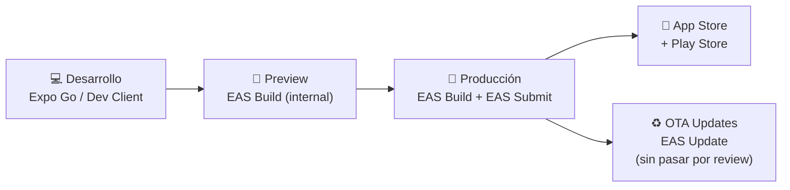

---
tags:
  - tiendi-go
  - mobile
  - stack
  - react-native
  - expo
aliases:
  - Stack Tiendi Go
---

# Tiendi Go — Stack Tecnológico

> Documento de referencia del stack definitivo para la app de repartidores de Tiendi.
> Stack elegido: **React Native + Expo**.

---

## Índice

- [Decisión y justificación](#decisión-y-justificación)
- [Frontend](#frontend)
- [Navegación](#navegación)
- [Estado global](#estado-global)
- [Mapas y geolocalización](#mapas-y-geolocalización)
- [Comunicación con el backend](#comunicación-con-el-backend)
- [Servicios externos](#servicios-externos)
- [Persistencia local](#persistencia-local)
- [Testing](#testing)
- [Build y distribución](#build-y-distribución)
- [Backend (referencia)](#backend-referencia)
- [Costos](#costos)
- [Estructura de carpetas sugerida](#estructura-de-carpetas-sugerida)

---

## Decisión y justificación

| Criterio | Decisión |
|----------|----------|
| **Framework** | React Native + Expo |
| **Lenguaje** | TypeScript (strict) |
| **Plataformas** | iOS + Android |
| **Distribución** | EAS Build + EAS Submit |

**Por qué React Native + Expo y no las alternativas:**

| | React Native + Expo ✅ | Ionic + Angular | Flutter |
|---|---|---|---|
| Ecosistema delivery | Maduro (Uber, DoorDash) | Escaso | Creciendo |
| APIs nativas necesarias | Cubiertas por Expo SDK | Capacitor (overhead) | Plugins nativos |
| Curva de aprendizaje | Media (JS/TS) | Baja (Angular ya conocido) | Alta (Dart) |
| Performance GPS | Excelente | Buena | Excelente |
| OTA updates | EAS Update | — | Shorebird (pago) |
| Comunidad | Enorme | Pequeña | Grande |

> [!IMPORTANT]
> La decisión es definitiva. No evaluar Ionic ni Flutter para Tiendi Go.

---

## Frontend

### Core

| Paquete | Versión mínima | Rol |
|---------|---------------|-----|
| `react-native` | 0.74+ | Runtime base |
| `expo` | SDK 51+ | Gestión de APIs nativas y build |
| `typescript` | 5.x | Tipado estático (strict mode) |
| `react` | 18.x | UI layer |

### UI y estilos

| Paquete | Rol |
|---------|-----|
| `react-native` StyleSheet | Estilos base — sin librerías externas de CSS |
| `@expo/vector-icons` | Iconografía (Feather, Material, Ionicons) |
| `expo-linear-gradient` | Gradientes en tarjetas de oferta y wallet |
| `react-native-reanimated` | Animaciones fluidas (60fps) — tarjeta de oferta, bottom sheets |
| `react-native-gesture-handler` | Gestos (swipe, drag) — requiere Reanimated |
| `react-native-safe-area-context` | Insets para notch / Dynamic Island / barra de navegación |

> [!NOTE]
> No se usa ninguna librería de componentes UI (no NativeBase, no Tamagui). Los componentes se construyen desde cero para tener control total sobre la experiencia del rider.

### Formularios y validación

| Paquete | Rol |
|---------|-----|
| `react-hook-form` | Manejo de formularios (registro, perfil, documentos) |
| `zod` | Validación de esquemas — schemas compartidos con tiendi-api |
| `@hookform/resolvers` | Integración RHF + Zod |

### Utilidades

| Paquete | Rol |
|---------|-----|
| `date-fns` | Formateo de fechas, cálculo de duraciones, countdown |
| `react-native-mmkv` | Storage key-value de alta performance (reemplaza AsyncStorage donde importa velocidad) |

---

## Navegación

**Stack elegido: Expo Router** (file-based routing, basado en React Navigation).

```
app/
├── (auth)/
│   ├── login.tsx
│   ├── register/
│   │   ├── step-1-personal.tsx
│   │   ├── step-2-vehicle.tsx
│   │   └── step-3-documents.tsx
│   └── pending-approval.tsx
├── (app)/
│   ├── _layout.tsx          ← tab navigator
│   ├── home.tsx             ← mapa principal + toggle online/offline
│   ├── delivery/
│   │   ├── [id].tsx         ← detalle del pedido activo
│   │   └── offer.tsx        ← tarjeta de oferta (modal)
│   ├── earnings/
│   │   ├── index.tsx
│   │   └── history.tsx
│   ├── profile/
│   │   └── index.tsx
│   └── settings/
│       └── index.tsx
└── _layout.tsx              ← root layout (auth guard)
```

**Ventajas de Expo Router sobre React Navigation puro:**
- Tipado de rutas automático (`href` con autocomplete)
- Deep linking configurado sin setup manual
- Layouts anidados nativos (Tab dentro de Stack)

---

## Estado global

**Zustand** — sin Redux, sin Context API para estado global.

### Stores principales

```typescript
// Stores a implementar
useAuthStore      // session, user, rider profile, token
useDeliveryStore  // pedido activo, estado, cola de pedidos
useLocationStore  // coords actuales, tracking activo
useWalletStore    // balance, transacciones recientes
useNotifStore     // notificaciones no leídas
```

> [!NOTE]
> Zustand con `persist` middleware para auth store (usa expo-secure-store como storage adapter). El resto de stores son en memoria — se rehidratan desde la API al montar.

---

## Mapas y geolocalización

### Mapas

| Paquete | Rol |
|---------|-----|
| `react-native-maps` | Componente de mapa (`<MapView>`) — usa Google Maps SDK en Android y Apple Maps / Google Maps en iOS |
| Google Maps SDK (Android) | Configurar en `app.json` con API key |
| Google Maps SDK (iOS) | Configurar en `app.json` con API key |

**Features implementadas con react-native-maps:**
- Marcadores de tienda y cliente
- Polyline de ruta activa
- Círculo de geofence (150m tienda, 200m cliente)
- Overlay de zona caliente (hexágonos coloreados)
- Marcador animado de posición del rider (heading + velocidad)

### Geolocalización

| Paquete | Rol |
|---------|-----|
| `expo-location` | GPS del dispositivo, tracking en background, permisos |

**Configuración de tracking adaptativo:**

| Situación | Frecuencia | Accuracy |
|-----------|-----------|---------|
| Sin pedido activo | Cada 30s | `Balanced` |
| En tránsito | Cada 10s | `High` |
| Cerca del origen/destino (< 500m) | Cada 3s | `BestForNavigation` |

```json
// app.json — permisos requeridos
{
  "ios": {
    "infoPlist": {
      "NSLocationAlwaysAndWhenInUseUsageDescription": "Tiendi Go necesita tu ubicación para asignarte pedidos y mostrar tu posición a la tienda y al cliente durante la entrega.",
      "NSLocationAlwaysUsageDescription": "Tiendi Go rastrea tu ubicación en segundo plano mientras estés Online para que puedas recibir pedidos."
    }
  },
  "android": {
    "permissions": [
      "ACCESS_FINE_LOCATION",
      "ACCESS_BACKGROUND_LOCATION",
      "FOREGROUND_SERVICE"
    ]
  }
}
```

### Navegación turn-by-turn

Se delega a apps externas mediante deep link — **no se implementa dentro de la app**.

| App | Deep link |
|-----|----------|
| Google Maps | `google.maps://maps?daddr={lat},{lng}` |
| Waze | `waze://?ll={lat},{lng}&navigate=yes` |
| Apple Maps (iOS) | `maps://?daddr={lat},{lng}` |
| Fallback (browser) | `https://maps.google.com/?daddr={lat},{lng}` |

### Optimización de rutas (multi-pedido)

Llamada directa a **Google Directions API** desde `tiendi-api` (no desde la app). La app solo consume el resultado.

```
GET /deliveries/active/route
→ { waypoints: [...], optimizedOrder: [2,0,1], estimatedTime: 1800 }
```

---

## Comunicación con el backend

### HTTP — tiendi-api REST

| Paquete | Rol |
|---------|-----|
| `axios` | Cliente HTTP con interceptors para JWT y refresh |

**Patrón de interceptors:**
1. Request: adjunta `Authorization: Bearer {accessToken}`
2. Response 401: intenta refresh → reintenta request original → si falla, logout

### WebSocket — tracking y eventos en tiempo real

| Paquete | Rol |
|---------|-----|
| `socket.io-client` | Conexión persistente con tiendi-api para tracking GPS y eventos de pedido |

**Eventos emitidos por la app:**

| Evento | Payload | Cuándo |
|--------|---------|--------|
| `rider:location` | `{ lat, lng, heading, speed }` | Según throttling adaptativo |
| `delivery:accept` | `{ deliveryId }` | Rider acepta oferta |
| `delivery:reject` | `{ deliveryId, reason }` | Rider rechaza |
| `delivery:pickup` | `{ deliveryId, method, code }` | Confirma recogida |
| `delivery:complete` | `{ deliveryId, podData }` | Confirma entrega |

**Eventos recibidos por la app:**

| Evento | Payload | Acción en app |
|--------|---------|--------------|
| `order:offer` | Datos del pedido + comisión estimada | Muestra tarjeta de oferta |
| `delivery:cancelled` | `{ deliveryId, reason }` | Limpia pedido activo |
| `chat:message` | Mensaje del cliente o tienda | Badge + notificación in-app |

---

## Servicios externos

### Firebase

| Servicio | Uso | Costo |
|----------|-----|-------|
| **FCM** (Firebase Cloud Messaging) | Push notifications para ofertas de pedidos, actualizaciones de estado | Gratis |
| **Crashlytics** | Reporte de crashes en producción | Gratis |

Integración: `expo-notifications` maneja el token FCM — no se usa `react-native-firebase` directamente.

### Google Maps Platform

| API | Uso | Precio (post free tier) |
|-----|-----|------------------------|
| Maps SDK Android/iOS | Renderizado del mapa | Gratis (SDK) |
| Directions API | Ruta óptima multi-pedido (server-side) | $5 / 1.000 req |
| Distance Matrix API | Estimación de tiempos para el matching | $5 / 1.000 elem |
| Geocoding API | Texto → coordenadas en registro de dirección | $5 / 1.000 req |

> [!WARNING]
> Las llamadas a Google Maps Platform se hacen **desde tiendi-api**, nunca desde la app. Esto protege la API key y centraliza el control de costos.

### Twilio

| Servicio | Uso |
|----------|-----|
| **Twilio Voice** | Llamadas proxy — el rider llama a un número temporal que Twilio enruta al cliente/tienda real |
| **Twilio Verify** | OTP por SMS para verificación de teléfono en registro |

### Cloudinary

| Uso | Carpeta |
|-----|---------|
| Fotos de documentos de registro | `/riders/documents/` (acceso privado) |
| Fotos de recogida (pickup) | `/pod/pickup/` (acceso privado) |
| Fotos de entrega (POD) | `/pod/delivery/` (acceso privado) |
| Firmas digitales | `/pod/signatures/` (acceso privado) |

---

## Persistencia local

| Necesidad | Solución |
|-----------|---------|
| Tokens JWT (access + refresh) | `expo-secure-store` (Keychain iOS / Keystore Android) |
| Preferencias del usuario (tema, zona) | `react-native-mmkv` |
| Cache de mapa offline | `react-native-maps` (tiles automáticos del OS) |
| Cola de eventos offline (GPS, confirmaciones) | `react-native-mmkv` + sync al reconectar |
| Código QR offline de entrega | `expo-secure-store` (generado al aceptar pedido) |

> [!IMPORTANT]
> **Nunca** usar `AsyncStorage` para datos sensibles. Tokens y datos de sesión van siempre en `expo-secure-store`.

---

## Testing

| Capa | Herramienta | Qué cubre |
|------|------------|-----------|
| **Unit** | Jest + `@testing-library/react-native` | Stores de Zustand, lógica de negocio, validaciones Zod |
| **Componentes** | `@testing-library/react-native` | Renderizado y comportamiento de componentes aislados |
| **E2E** | Detox | Flujo completo: login → aceptar pedido → confirmar entrega |

**Cobertura mínima esperada para MVP:**
- Stores (Zustand): 90%
- Validaciones (Zod schemas): 100%
- Flujo de entrega (E2E Detox): happy path + OTP incorrecto + timeout de oferta

---

## Build y distribución

**EAS (Expo Application Services)** — pipeline completo.



### Perfiles de build (`eas.json`)

```json
{
  "build": {
    "development": {
      "developmentClient": true,
      "distribution": "internal"
    },
    "preview": {
      "distribution": "internal",
      "android": { "buildType": "apk" }
    },
    "production": {
      "autoIncrement": true
    }
  }
}
```

### OTA Updates (EAS Update)

Permite publicar actualizaciones JS sin pasar por review de las stores — válido para bugfixes y cambios de UI. Cambios que modifican código nativo (nuevos plugins de Expo, permisos nuevos) requieren un build nuevo.

---

## Backend (referencia)

Tiendi Go **no tiene backend propio**. Consume `tiendi-api` (NestJS existente) con un nuevo módulo `delivery`.

| Capa | Tecnología |
|------|-----------|
| Framework | NestJS |
| Base de datos | PostgreSQL (compartida con el resto del ecosistema) |
| Cola de tareas | BullMQ (matching de pedidos, liquidaciones) |
| Tiempo real | Socket.IO (tracking GPS, eventos de delivery) |
| Push | Firebase Admin SDK → FCM |
| Llamadas proxy | Twilio Voice SDK |
| SMS / OTP | Twilio Verify |
| Almacenamiento | Cloudinary SDK |

---

## Costos

### Fijos (desde el día 1)

| Concepto | Costo |
|----------|-------|
| Apple Developer Program | $99 / año |
| Google Play Console | $25 pago único |

### Variables (según uso)

| Concepto | Free tier | Costo adicional |
|----------|-----------|----------------|
| EAS Build | ~30 builds/mes | Desde $99/mes (más velocidad y concurrencia) |
| EAS Update | 1.000 MAU / mes | Desde $99/mes (10.000 MAU) |
| Google Maps Platform | $200 crédito / mes | $5 por 1.000 requests según API |
| Firebase FCM | Gratis siempre | — |
| Firebase Crashlytics | Gratis siempre | — |
| Twilio Voice | Sin free tier | ~$0.013 / min (varía por país) |
| Twilio Verify (OTP SMS) | Sin free tier | ~$0.05 / verificación |
| Cloudinary | 25 GB storage + 25 GB bandwidth / mes | Según plan |

> [!TIP]
> Para el MVP con < 50 riders, el costo mensual adicional al fijo de Apple es prácticamente $0. Los costos de Twilio y Google Maps son los primeros en aparecer conforme crece el volumen de entregas.

---

## Estructura de carpetas sugerida

```
tiendi-go/
├── app/                        ← Expo Router (rutas)
│   ├── (auth)/
│   └── (app)/
├── src/
│   ├── components/             ← Componentes reutilizables
│   │   ├── ui/                 ← Botones, inputs, cards base
│   │   ├── map/                ← MapView wrappers, markers
│   │   └── delivery/           ← Tarjeta de oferta, POD, etc.
│   ├── stores/                 ← Zustand stores
│   ├── services/               ← axios instances, socket client
│   ├── hooks/                  ← Custom hooks (useLocation, useDelivery)
│   ├── schemas/                ← Zod schemas compartidos
│   ├── utils/                  ← Helpers, formatters, deep links
│   └── constants/              ← URLs, keys, config
├── assets/                     ← Imágenes, fuentes, splash
├── app.json                    ← Config de Expo
├── eas.json                    ← Config de EAS Build
└── tsconfig.json               ← TypeScript strict
```

---

## Ver también

- [[FUNCIONALIDADES]] — Especificación completa de módulos y pantallas
- [[PROTOTIPOS-CHECKLIST]] — Estado de los prototipos HTML por módulo
