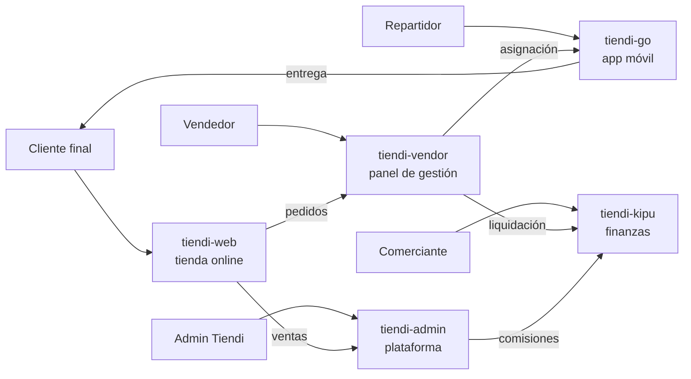
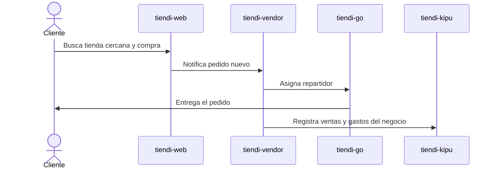
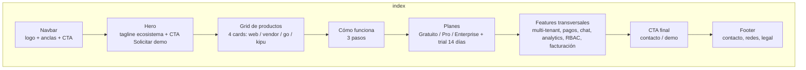
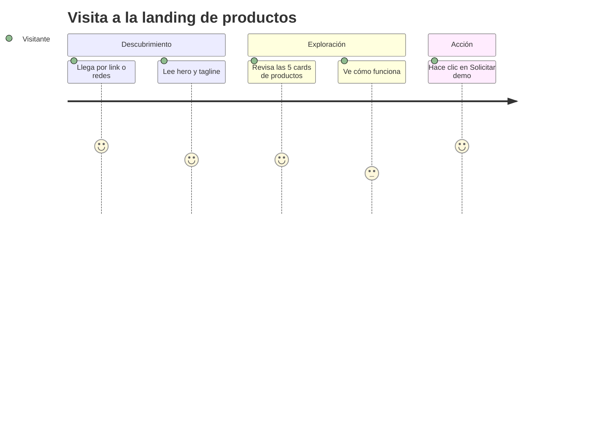

# Plan: Landing Estática "Productos Tiendi"

> [!IMPORTANT]
> Página publicitaria informativa del ecosistema Tiendi. Los productos están en fase de prueba — el copy y los CTAs deben reflejar ese estado (sin prometer disponibilidad general).

## Ver también
- [[MODULOS_SISTEMA_TIENDI]]
- [[MODELO_NEGOCIO]]
- [[TIENDI-WEB/LANDING-B2B-BRIEF]] — brief de landing B2B para comerciantes (otro entregable, aún vacío)
- [[TIENDI-CHAT/PLAN-CHAT-LIBRARY]]

---

## 1. Objetivo

Presentar de forma clara y atractiva los 5 productos de la suite Tiendi para:

- Dar a conocer el ecosistema completo a comerciantes, socios e interesados.
- Generar contactos (CTA "Solicitar demo") mientras los productos están en pruebas.
- Servir como página de referencia oficial para compartir por link, WhatsApp y redes.

> [!NOTE]
> No es la landing B2B de "Vendé en Tiendi" (esa vive en [[TIENDI-WEB/LANDING-B2B-BRIEF]]). Esta página es un showcase de productos, independiente de las apps.

---

## 2. Decisión de stack

| Decisión | Valor |
|---|---|
| Tipo | Página estática, sin build ni dependencias |
| Ubicación | `FUENTES/tiendi-site/` |
| Stack | HTML5 + CSS3 + JS vanilla |
| Idioma | Español (mercado peruano) |
| Deploy | Cualquier hosting estático (GitHub Pages, Vercel, Netlify) |

> [!TIP]
> Al no acoplarse a `tiendi-web`, esta página puede publicarse y evolucionar sin depender del ciclo de release de las apps Angular.

---

## 3. Estructura de archivos

```text
FUENTES/tiendi-site/
├── index.html          # Página completa (una sola ruta)
├── css/
│   └── styles.css      # Design system + layout + responsive
├── js/
│   └── main.js         # Menú mobile, reveal on scroll, FAQ accordion
└── assets/             # (opcional) favicon, og-image
```

> [!NOTE]
> Los íconos van inline como SVG dentro del HTML. No se dependen imágenes externas salvo favicon/og-image opcionales.

---

## 4. Ecosistema de productos (contenido de la página)

> [!WARNING]
> **tiendi-admin NO se publica en la landing.** Es una herramienta interna de administración de la plataforma (uso exclusivo del equipo Tiendi, no visible para las tiendas). La página pública muestra solo 4 productos.

### 4.1 Descripción por producto

| Producto | Qué es | Features clave para la card |
|---|---|---|
| **tiendi-web** | Tienda online pública (Angular) | Búsqueda geolocalizada con mapa interactivo, catálogo por categorías, carrito persistente, checkout en 2 pasos, favoritos y chat con la tienda |
| **tiendi-vendor** | Panel del vendedor (SPA Angular en `/vendor`) | Gestión de catálogo, inventario, pedidos, promociones, dashboard de ventas |
| **tiendi-go** | App móvil de repartidores (Expo / React Native) | Pedidos asignados, entrega con navegación, comunicación, ganancias, calificaciones, incentivos y flota |
| **tiendi-kipu** | Gestión financiera del comerciante | Gastos, cuentas y pagos recurrentes por negocio, vinculado a la tienda Tiendi |

> [!NOTE]
> ~~tiendi-admin~~ — excluido de la página pública (interno). El diagrama de abajo se mantiene como referencia del sistema completo, pero la landing muestra únicamente los 4 productos de la tabla.

### 4.2 Mapa del ecosistema



### 4.3 Flujo comercial que soporta la suite



---

## 5. Diseño

### 5.1 Tokens de marca

| Token | Valor | Origen |
|---|---|---|
| `--color-primary` | `#9C27B0` | `tiendi-web/src/styles.scss` (tema default) |
| Tipografía | Inter + system-ui fallback | nueva para marketing |
| Estilo | Mobile-first, dark hero con gradientes violeta | nuevo, alineado a marca |

> [!WARNING]
> Extraer los tokens reales de `tiendi-web/src/styles.scss` al momento de maquetar, no de este documento. Si el tema default cambió, manda el valor actual.

### 5.2 Wireframe de la página



### 5.3 Journey del visitante



---

## 6. Secciones y copy base

1. **Navbar** — logo Tiendi + anclas (`#productos`, `#como-funciona`, `#planes`, `#features`, `#contacto`) + botón CTA.
2. **Hero** — tagline sugerido: *"Un ecosistema completo para vender online: tienda, gestión, delivery y finanzas"*. Subtítulo + CTA "Solicitar demo" + CTA secundario "Conocer los productos".
3. **Productos** — grid responsive de 4 cards (descripciones de §4.1), cada una con ícono SVG y lista corta de features.
4. **Cómo funciona** — 3 pasos: *Creás tu tienda → Cargás tu catálogo → Vendé y entregá con repartidores*.
5. **Planes** — 3 cards (Gratuito / Pro / Enterprise) + banner de trial (ver §6.1).
6. **Features transversales** — multi-tenant, pagos peruanos (Yape/Plin/tarjetas/efectivo), chat en tiempo real, analytics, RBAC, facturación electrónica.
7. **CTA final** — banner de cierre con contacto (WhatsApp o mail).
8. **Footer** — redes sociales, links legales (términos, privacidad), © Tiendi.

### 6.1 Planes (fuente autoritativa)

> [!IMPORTANT]
> Fuente: `DOCS/WEB-VENDOR/VENDOR-PANEL-DEFINITIVO.md` (§ Planes), coherente con la decisión de `MODELO_NEGOCIO.md` (2026-08-26): **suscripción como único ingreso, sin comisión por venta**. Modelos viejos con comisión (Básico 99+8% en DIAGRAMAS_SECUENCIA_COMISIONES) y precios en dólares (PLANIFICACION $29/$79) están **descartados**.

| Plan | Precio | Productos | Pedidos/mes | Analytics | Soporte | Usuarios | SUNAT |
|---|---|---|---|---|---|---|---|
| Gratuito | S/ 0 | 20 | 50 | Básico | Email | 1 | ❌ |
| **Pro** (destacado) | S/ 49 | 200 | Ilimitado | Avanzado | Chat | 5 | ✅ |
| Enterprise | S/ 149 | Ilimitado | Ilimitado | Full + Export | Dedicado | Ilimitado | ✅ |

- **Trial:** 14 días gratis del Plan Pro sin tarjeta, al completar onboarding (1 vez por tienda).
- **Copy prohibido:** "gratis para siempre" — el plan gratuito es *generoso reversible* (decisión D7); nunca prometer permanencia.

> [!TIP]
> CTA primario único: "Solicitar demo". Los botones de producto pueden anclar a `#contacto` también, pero no fragmentar en CTAs distintos mientras no existan URLs públicas de cada app.

---

## 7. SEO y metadatos

- `<title>`, `meta description` con keywords: ecommerce, tiendas locales, delivery, Perú, SaaS.
- Open Graph + Twitter Card (imagen `assets/og-image.png` opcional).
- HTML semántico: `header`, `main`, `section`, `footer`, un solo `h1`.
- Favicon opcional en `assets/`.

---

## 8. Checklist de actividades

> [!NOTE]
> Marcar cada casilla al completar. Las fases son secuenciales; dentro de cada fase el orden es sugerido.

### Fase 0 — Preparación
- [x] Crear carpeta `FUENTES/tiendi-site/` con subcarpetas `css/` y `js/`
- [x] Extraer tokens reales de marca desde `tiendi-web/src/styles.scss` (primary `#9C27B0`, accent `#0cc2a9`, paleta 1 default)
- [x] Confirmar dato de contacto para el CTA — WhatsApp `+51 930 908 749`, email `tiendipe@gmail.com`, dominio `tiendi.pe`, redes: Facebook/Instagram `tiendi.pe`, X `@tiendipe`, TikTok `@tiendi.pe`

### Fase 1 — HTML
- [x] Estructura base `index.html` (doctype, lang es, head con meta)
- [x] Navbar con anclas y CTA
- [x] Hero con tagline + CTAs
- [x] Grid de 4 cards de productos con íconos SVG inline (tiendi-admin excluido por ser interno; grid 2×2 en desktop)
- [x] Sección "Cómo funciona" (3 pasos)
- [x] Sección planes: 3 cards (Gratuito S/0 / Pro S/49 destacado / Enterprise S/149) + trial Pro 14 días sin tarjeta, según VENDOR-PANEL-DEFINITIVO.md
- [x] Sección features transversales
- [x] CTA final (banner de contacto)
- [x] Footer (productos, legal, contacto, copyright)

### Fase 2 — CSS
- [x] Design system: variables (colores, tipografía, spacing, radios)
- [x] Estilos navbar + menú mobile
- [x] Estilos hero (gradiente violeta, dark)
- [x] Estilos grid de productos (responsive: 1 col mobile → 2 tablet → 3+ desktop)
- [x] Estilos "cómo funciona" + features
- [x] Estilos CTA final + footer
- [x] Media queries en 768 / 1024 px (base mobile-first 320+; revisión visual pendiente en Fase 5)

### Fase 3 — JS
- [x] Toggle de menú mobile (con cierre por Escape y al clickear un link)
- [x] Reveal on scroll (IntersectionObserver, con fallback sin JS vía clase `.js` y `prefers-reduced-motion`)
- [x] Accordion FAQ — *no aplica: la página final no incluye sección FAQ*
- [x] Smooth scroll para anclas (CSS `scroll-behavior` + `scroll-padding-top`)

### Fase 4 — SEO
- [x] Meta title + description + keywords
- [x] Open Graph + Twitter Card
- [x] Un solo `h1`, jerarquía semántica revisada
- [x] Favicon SVG inline — *og-image pendiente (opcional)*

### Fase 5 — Verificación
- [x] Servir la página (`python -m http.server`) — index/css/js responden HTTP 200
- [ ] Revisar visual en desktop, tablet y mobile — *requiere browser: abrir `index.html` o servir con `python -m http.server`*
- [x] Validar HTML (sin tags sin cerrar, 1 solo h1, anclas resueltas, braces CSS/JS balanceados)
- [x] Probar menú mobile, anclas y reveal on scroll (lógica verificada; prueba manual pendiente junto al check anterior)
- [x] Revisar copy: sin promesas de disponibilidad (badge "Versión de prueba — acceso anticipado" en hero)

### Fase 6 — Entrega
- [x] Limpieza de código (sin estilos/JS muertos)
- [ ] Decidir hosting estático y dejar instrucciones de deploy
- [ ] (Opcional) Completar `DOCS/TIENDI-WEB/LANDING-B2B-BRIEF.md` como siguiente paso

---

## 9. Criterios de aceptación

- [ ] La página carga sin build ni dependencias externas críticas (solo fuente web opcional)
- [ ] Los 5 productos están descriptos con precisión según la funcionalidad real
- [ ] Responsive sin roturas en 320 / 768 / 1024 px
- [ ] CTA funcional hacia contacto
- [ ] Sin links muertos ni placeholders visibles

---

## 10. Riesgos y pendientes abiertos

| Riesgo / pendiente | Impacto | Mitigación |
|---|---|---|
| Sin dato de contacto confirmado para CTA | CTA muerto | Fase 0 lo bloquea |
| Sin logo oficial en alta calidad para marketing | Marca débil | Usar wordmark tipográfico provisional |
| Screenshots de producto con datos de prueba | Imagen poco profesional | Usar mockups SVG estilizados en vez de screenshots reales |
| Productos en pruebas → features pueden cambiar | Copy desactualizado | Revisar copy en cada release mayor |
