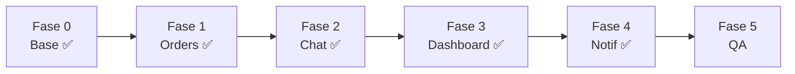

# Checklist Responsive — `tiendi-vendor` (pantallas operativas)

> [!info] Cómo usar este documento
> Documento de **trabajo vivo**. Alcance: **pantallas operativas del día a día** (pedidos, chat, notificaciones, dashboard). La config pesada queda para desktop en esta fase. El porqué y el diagnóstico están en [[PLAN-MOBILE-VENDOR]]. El shell ya es responsive — **no se toca**.

> [!note] Leyenda
> `- [ ]` pendiente · `- [x]` hecho · 🔴 alta · 🟠 media · 🟢 baja. Cada tarea referencia el archivo real.

---

## Fase 0 — Base (rápida) ✅

> [!success] Completada 2026-06-30

- [x] 🟠 Crear `shared/layout/layout.service.ts` — expone `isMobile` y `isTablet` signals (`BreakpointObserver` con `Breakpoints.Handset`). Features lo inyectan directamente con `inject(LayoutService).isMobile`.
- [x] 🟠 Convención definida: tabla→cards por debajo de `md` (768px). `LayoutService` es la única fuente de verdad para breakpoints en features.
- [x] 🟢 Tablas `<table>` nativas inventariadas: `order-list-table` (7 col), `recent-orders-widget` (5 col). Ambas migradas.

---

## Fase 1 — 🔴 Orders (pantalla #1) ✅

> [!success] Completada 2026-06-30

- [x] `order-list-table.component.ts` — agrego `isMobile = input<boolean>(false)`.
- [x] `order-list-table.component.html` — `@if (isMobile())` → cards apiladas. `@else` → tabla desktop sin cambios.
- [x] `order-list-table.component.scss` — `.table-wrapper` cambiado de `overflow: hidden` → `overflow-x: auto`. Estilos de `.card`, `.card__header`, `.card__customer`, `.card__meta`, `.card__actions` (botones `min-height: 44px`).
- [x] `order-list.page.ts` — inyecta `LayoutService`, expone `isMobile`. `[isMobile]="isMobile()"` al `td-order-list-table`.
- [x] `order-detail.page.scss` — `@media (max-width: 640px) { padding: 16px; gap: 16px; }` (la grilla ya colapsaba a 1 col en 900px).
- [x] `assign-rider-dialog` — componente usa flex col internamente, OK en pantalla chica. Botones 44px+.

---

## Fase 2 — 🔴 Chat widget ✅

> [!success] Completada 2026-06-30

- [x] `chat-widget.component.ts` — agrego `isMobile = input<boolean>(false)`. Lo paso a `[isViewportOnMobileEnabled]="isMobile()"` en `NgChatTiendi` (el componente ya tenía este input en la librería).
- [x] `shell.component.html` — agrego `[isMobile]="isMobile()"` a `<td-chat-widget>`. El shell ya tiene la signal `isMobile` de su propio `BreakpointObserver`.

---

## Fase 3 — 🟠 Dashboard ✅

> [!success] Completada 2026-06-30

- [x] `dashboard-kpi-grid.component.scss` — **ya tenía** `@media (max-width: 1023px) { 2 cols }` y `@media (max-width: 640px) { 1 col }`. Sin cambios.
- [x] `dashboard.page.scss` — **ya tenía** `@media (max-width: 1023px) { grid 1 col }` y `@media (max-width: 640px) { padding 16px }`. Sin cambios.
- [x] `recent-orders-widget.component.ts` — agrego `isMobile = input<boolean>(false)`.
- [x] `recent-orders-widget.component.html` — `@if (isMobile())` → cards. `@else` → tabla 5 col original. Mismo patrón que orders.
- [x] `recent-orders-widget.component.scss` — estilos `.card` / `.card__header` / `.card__row` / `.card__actions`.
- [x] `sales-chart-widget.component.scss` — `.chart-wrap` ya tenía `height: 220px`. Agrego `@media (max-width: 640px) { height: 180px }`. `responsive: true` y `maintainAspectRatio: false` ya estaban en el TS.
- [x] `dashboard.page.ts` — inyecta `LayoutService`, `[isMobile]="isMobile()"` a `recent-orders-widget`.

---

## Fase 4 — 🟢 Notifications ✅

> [!success] Completada 2026-06-30

- [x] `notification-list.component.scss`:
  - `.notif__icon` — `40px` → `44px` (cumple WCAG táctil).
  - `.notif` button — agrego `min-height: 44px`.
  - `.notif__action` — padding mínimo `10px 14px` + `min-height: 44px` + `display: inline-flex; align-items: center`.
- [x] `notifications.page.scss` — **ya tenía** `@media (max-width: 640px) { padding: 16px }`. Sin cambios.

---

## Fase 5 — Validación (QA)

- [x] `npx tsc --noEmit` — **0 errores** (verificado 2026-06-30).
- [ ] Probar en 360px, 390px, 768px en DevTools o dispositivo real.
- [ ] **Sin scroll horizontal** en ninguna operativa.
- [ ] **Desktop sin regresiones** (es el uso principal del panel).
- [ ] Patrón de cards **consistente** entre orders y dashboard.
- [ ] Charts no rotos al rotar / redimensionar.

---

## Bitácora de avance

> [!note] Registrar cada sesión: `YYYY-MM-DD — qué se hizo — pendiente`.

- 2026-06-30 — Documento creado. Alcance: operativas (pedidos, chat, notif, dashboard). Próximo: Fase 1 (orders tabla→cards).
- 2026-06-30 — Fases 0–4 implementadas en rama `feat/vendor-responsive-mobile`. TypeScript sin errores. Pendiente: QA visual en navegador.

---

## Ver también

- [[PLAN-MOBILE-VENDOR]] — diagnóstico, stack y estrategia (vendor)
- [[CHECKLIST-RESPONSIVE-WEB]] — checklist equivalente de `tiendi-web`
- [[MODULOS_SISTEMA_TIENDI]] — módulos del sistema
