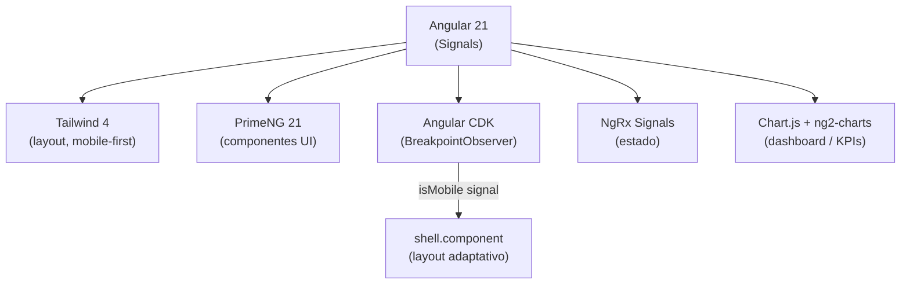
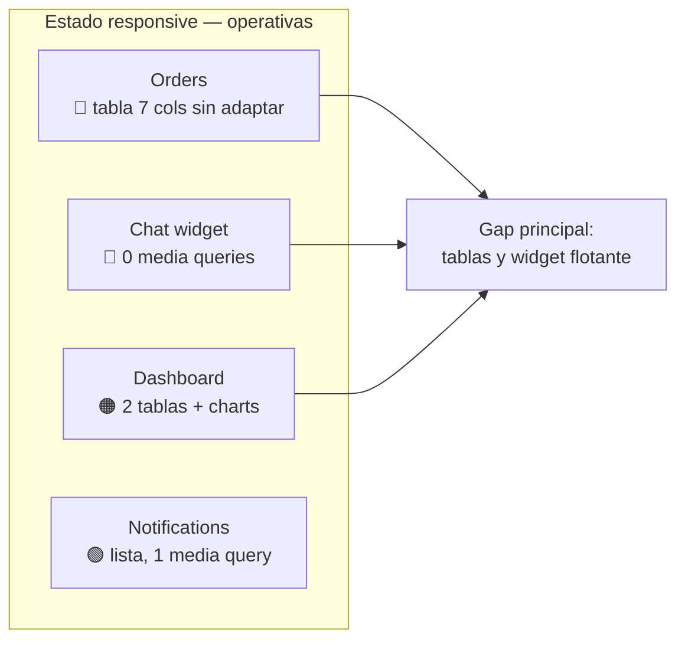
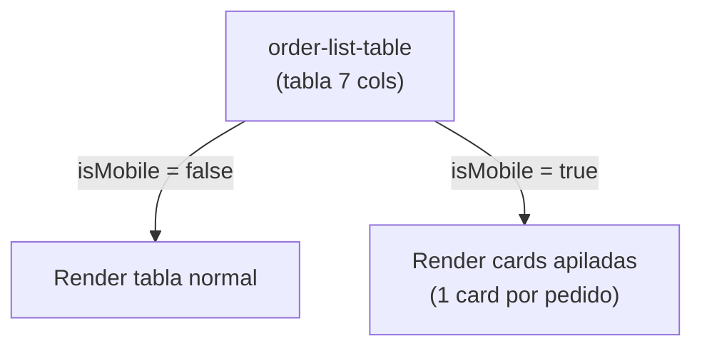

# Plan de versión Mobile — `tiendi-vendor`

> [!abstract] Resumen ejecutivo
> `tiendi-vendor` es el **panel del vendedor** (el dueño/staff administra su tienda). A diferencia de `tiendi-web`, **ya tiene una base responsive real**: Tailwind 4 (mobile-first por diseño), Angular CDK `BreakpointObserver`, un shell que ya renderiza distinto en mobile, y ~43 media queries. **El trabajo NO es construir responsive desde cero — es cerrar huecos.** Y el alcance elegido es: **priorizar las pantallas operativas del día a día** (pedidos, chat, notificaciones, dashboard), dejando la configuración pesada para desktop.

---

## 1. Diferencia clave con `tiendi-web`

| | `tiendi-web` (storefront) | `tiendi-vendor` (panel) |
|---|---|---|
| Público | Comprador | Dueño / staff |
| CSS layout | PrimeFlex (casi sin usar) | **Tailwind 4** (mobile-first) |
| Viewport detection | ninguna | **CDK `BreakpointObserver`** + signal `isMobile` |
| Media queries | ~2 | **~43** |
| Render | SSR (SEO importa) | SPA (sin SSR — no necesita SEO) |
| Estado mobile | construir desde cero | **completar gaps** |

> [!success] La fundación ya está hecha
> `shared/layout/shell.component.ts` ya inyecta `BreakpointObserver`, observa `Breakpoints.Handset`/`Tablet` y expone `isMobile` como signal. El template (`shell.component.html`) ya hace `@if (isMobile())` y renderiza un sidebar distinto. **No hay que tocar el shell.**

---

## 2. Stack tecnológico

| Categoría | Librería | Nota mobile |
|-----------|----------|-------------|
| Framework | `@angular/core` 21 | Signals |
| Layout CSS | `tailwindcss` 4 | Utilidades responsive (`md:`, `lg:`) ya disponibles |
| UI | `primeng` 21 | Componentes con modos responsive |
| Viewport | `@angular/cdk` | `BreakpointObserver` ya en uso |
| Estado | `@ngrx/signals` | — |
| Gráficos | `chart.js` + `ng2-charts` | Charts necesitan contenedor responsive |

---

## 3. Diagnóstico de las pantallas operativas

> [!note] Alcance acordado
> Foco en lo que un dueño hace desde el teléfono: **pedidos, chat, notificaciones, dashboard**. La config pesada (store-config, legal, subscription, staff) queda para desktop en esta fase.

### 3.1 🔴 Orders — el gap #1

> [!danger] Tabla de 7 columnas sin responsive
> `order-list-table.component.html` es una `<table>` HTML nativa con 7 columnas (N° Pedido, Cliente, Fecha, Productos, Total, Estado, Acciones). Su `.scss` solo tiene `overflow: hidden`, **ninguna media query**. En un teléfono de 360px es ilegible o desborda.

Pedidos es **la** pantalla operativa central. Acá se juega todo.

### 3.2 🔴 Chat widget

> [!warning] Sin lógica responsive
> `chat/chat-widget.component.ts` tiene **0 media queries** y no consume `isMobile`. Un widget flotante de escritorio en mobile suele tapar contenido o quedar inusable. Necesita modo full-screen en mobile.

### 3.3 🟠 Dashboard

- 2 tablas (`recent-orders-widget`) con el mismo problema que orders.
- KPIs con **Chart.js** → los charts necesitan contenedor fluido (no romper en ancho chico).

### 3.4 🟢 Notifications

- Es una lista (`notification-list.component`), ya tiene 1 media query. **Probablemente el mejor estado** — solo verificar touch targets (≥44px) y settings card.

---

## 4. Estrategia

> [!important] Patrón recomendado: "tabla en desktop, cards en mobile"
> El antipatrón es forzar scroll horizontal en una tabla de 7 columnas. La solución estándar para paneles admin: **debajo de `md`, la tabla se transforma en una lista de cards apiladas** (una card por pedido, con los campos como filas label/valor). Esto reutiliza el signal `isMobile` que ya existe.

No reescribir nada del shell ni del estado. Solo capa de presentación, condicionada por `isMobile`.

---

## 5. Plan por fases

| Fase | Qué | Resultado |
|------|-----|-----------|
| **0** | Verificar/normalizar uso de `isMobile` y breakpoints Tailwind | Base consistente |
| **1** | 🔴 Orders: tabla → cards en mobile (list + detail) | Pantalla #1 usable |
| **2** | 🔴 Chat widget full-screen en mobile | Comunicación usable |
| **3** | 🟠 Dashboard: tablas → cards + charts fluidos | Visión operativa |
| **4** | 🟢 Notifications: pulido touch targets | Cierre |
| **5** | Validación en breakpoints reales + regresión desktop | QA |

El paso a paso ejecutable y marcable vive en [[CHECKLIST-RESPONSIVE-VENDOR]].

---

## 6. Riesgos

> [!warning] Puntos de atención
> - **No romper desktop:** el panel se usa mayormente en escritorio. Todo cambio mobile va condicionado, no reemplaza.
> - **Charts (Chart.js):** redimensionan mal si el contenedor no tiene tamaño definido; usar `responsive: true` + contenedor fluido.
> - **Tablas custom:** son `<table>` nativas, no `p-table` — el patrón cards va a mano, no hay prop mágica.
> - **Consistencia:** que orders, dashboard y futuras tablas usen el **mismo patrón** de cards, no soluciones distintas por pantalla.

---

## Ver también

- [[CHECKLIST-RESPONSIVE-VENDOR]] — checklist ejecutable de esta migración
- [[PLAN-MOBILE-WEB]] — plan equivalente para `tiendi-web` (storefront)
- [[ARCHITECTURE-SONNET]] — arquitectura general del sistema Tiendi
- [[MODULOS_SISTEMA_TIENDI]] — módulos del sistema
