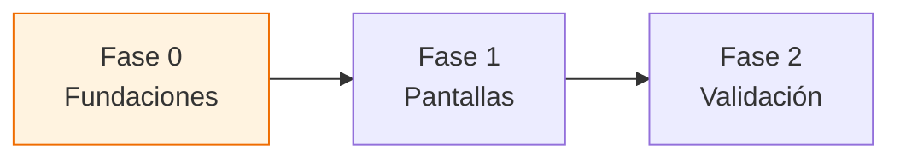

# Checklist Responsive — `tiendi-web`

> [!info] Cómo usar este documento
> Es el documento de **trabajo vivo** de la migración a mobile-first. Marcá cada `- [ ]` a medida que avanzamos. La estrategia y el porqué están en [[PLAN-MOBILE-WEB]]; **acá vive el paso a paso**. Avanzamos de arriba hacia abajo: **Fase 0 desbloquea todo lo demás**.

> [!note] Leyenda de estados
> - `- [ ]` pendiente · `- [x]` hecho
> - 🔴 alta prioridad · 🟠 media · 🟢 baja
> - Cada tarea referencia el archivo real cuando aplica (`ruta:línea`).

---

## Fase 0 — Fundaciones

> [!important] Sin esto, cada componente reinventa sus breakpoints
> Es transversal. Hacerlo primero evita reescribir media queries más adelante.

- [ ] 🔴 Definir **breakpoints estándar** alineados a PrimeFlex (`sm 576 · md 768 · lg 992 · xl 1200`) en un único `_breakpoints.scss`.
- [ ] 🔴 Crear `BreakpointService` (signal) con `isMobile` / `isTablet` / `isDesktop`, usando `isPlatformBrowser` para no romper SSR.
- [ ] 🟠 Consolidar la detección de tamaño aislada que hoy vive en `shared/components/ui/carousel/carousel.ts` dentro del nuevo `BreakpointService`.
- [ ] 🟠 Documentar la **convención SCSS mobile-first**: estilos base = mobile, `@media (min-width)` para escalar hacia arriba.
- [ ] 🟢 Auditar y listar todos los anchos fijos (`px` de 3+ dígitos) en un inventario para reemplazo sistemático.
- [ ] 🟢 Agregar `<meta name="viewport" content="width=device-width, initial-scale=1">` y verificar que esté en `index.html`.

---

## Fase 1 — Pantallas (de mayor a menor impacto)

### 🔴 1. Header / navegación

> [!warning] Hoy no hay navegación mobile
> `header.html` arma logo + search + user + categorías en flex horizontal, sin hamburguesa ni colapso.

- [ ] Diseñar patrón mobile: menú hamburguesa **o** bottom-nav.
- [ ] Colapsar buscador y barra de categorías en pantallas chicas (`shared/components/layout/header/`).
- [ ] Logo en versión compacta para mobile (`shared/components/ui/logo/`).
- [ ] Verificar que `category-bar` sea scrollable horizontal o se mueva a un menú.

### 🔴 2. Drawer del carrito

> [!danger] Ancho fijo que rompe en mobile
> `styles.scss:241` → `width: 680px`. En un teléfono de 360px desborda.

- [ ] Cambiar el drawer a `width: 100%` (o `fullScreen` de PrimeNG Drawer) por debajo de `md`.
- [ ] Revisar el resto de drawers (`bag-drawer`, `orders-drawer`, `sidebar_right`) en `styles.scss`.
- [ ] Botones de acción del carrito full-width y touch-friendly (≥44px).

### 🔴 3. Grid de productos

- [ ] Aplicar PrimeFlex al grid: `col-12 sm:col-6 lg:col-4` (`shared/components/ui/product-grid/`).
- [ ] `product-card` fluido, sin ancho fijo (`features/products/components/product-card/`).
- [ ] Verificar `product-category` y `category-selector` en mobile.

### 🔴 4. Checkout

> [!important] Es donde se pierde o se gana la venta
> El flujo de pago en mobile tiene que ser impecable.

- [ ] Layout de checkout en **una sola columna** por debajo de `md` (`features/checkout/`).
- [ ] Inputs y selects touch-friendly (alto ≥44px, fuentes legibles sin zoom).
- [ ] CTA de pago full-width, idealmente fijo abajo.
- [ ] Revisar `payment-and-delivery` y `cart-summary` (anchos en `styles.scss`).

### 🟠 5. Layout / sidebar

- [ ] Sidebar `250px` fijo (`layout.scss:22-23`) → colapsable / off-canvas en mobile.
- [ ] `max-width: 1800px` (`layout.scss:2`) no debe forzar scroll horizontal en mobile.

### 🟠 6. Detalle de producto

- [ ] Galería full-width en mobile (`features/products/components/product-gallery/`, hoy `max-width: 420px`).
- [ ] CTA "agregar al carrito" accesible (fijo abajo).

### 🟠 7. Landing + mapa

- [ ] Paneles fijos a fluidos: `landing-panel 370px`, `auth-panel 460px`, paneles 420px (`features/landing/`).
- [ ] Mapa Leaflet adaptado a mobile (alto y controles).
- [ ] **Lazy-load de Leaflet** (es pesado) y guarda SSR con `isPlatformBrowser`.

### 🟢 8. Footer / about / policies

- [ ] Apilar columnas del footer en mobile (`shared/components/layout/footer/`).
- [ ] Revisar `pages/about` y `features/policies` en pantalla chica.

---

## Fase 2 — Validación

- [ ] Probar en breakpoints reales: 360px, 390px, 768px, 1024px.
- [ ] Verificar que **no haya scroll horizontal** en ninguna pantalla.
- [ ] Confirmar que **desktop no haya regresionado**.
- [ ] Auditoría **Lighthouse mobile** (objetivo Performance y Best Practices > 90) — guardar números antes/después.
- [ ] Revisar métricas reales de mobile en **PostHog** (ya integrado): % tráfico, drop-off en checkout.
- [ ] Verificar render SSR correcto en mobile (sin errores de `window`/`navigator`).

---

## Bitácora de avance

> [!note] Registrar acá cada sesión de trabajo
> Formato: `YYYY-MM-DD — qué se hizo — qué quedó pendiente`.

- 2026-06-30 — Documento creado. Estrategia confirmada: responsive mobile-first. Próximo: Fase 0.

---

## Ver también

- [[PLAN-MOBILE-WEB]] — diagnóstico, stack y estrategia (el porqué de este checklist)
- [[ARCHITECTURE-SONNET]] — arquitectura general del sistema Tiendi
- [[MODULOS_SISTEMA_TIENDI]] — módulos del sistema
