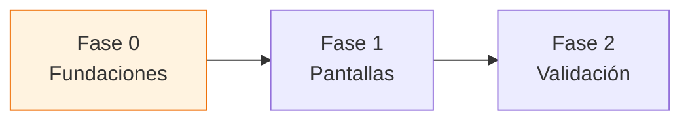

# Checklist Responsive — `tiendi-web`

> [!info] Cómo usar este documento
> Es el documento de **trabajo vivo** de la migración a mobile-first. Marcá cada `- [ ]` a medida que avanzamos. La estrategia y el porqué están en [[PLAN-MOBILE-WEB]]; **acá vive el paso a paso**. Avanzamos de arriba hacia abajo: **Fase 0 desbloquea todo lo demás**.

> [!note] Leyenda de estados
> - `- [ ]` pendiente · `- [x]` hecho
> - 🔴 alta prioridad · 🟠 media · 🟢 baja
> - Cada tarea referencia el archivo real cuando aplica (`ruta:línea`).

---

## Fase 0 — Fundaciones

> [!important] Sin esto, cada componente reinventa sus breakpoints
> Es transversal. Hacerlo primero evita reescribir media queries más adelante.

- [x] 🔴 Definir **breakpoints estándar** alineados a PrimeFlex (`sm 576 · md 768 · lg 992 · xl 1200`) en un único `_breakpoints.scss` → `src/styles/_breakpoints.scss` (+ `includePaths` en `angular.json`).
- [x] 🔴 Crear `BreakpointService` (signal) con `isMobile` / `isTablet` / `isDesktop`, usando `isPlatformBrowser` para no romper SSR → `src/app/core/services/breakpoint.service.ts` (con spec).
- [ ] 🟠 ~~Consolidar la detección de tamaño aislada del carousel~~ **N/A**: `carousel.ts` usa `responsiveOptions` nativo de PrimeNG, no un resize listener manual — nada que consolidar.
- [x] 🟠 Documentar la **convención SCSS mobile-first**: estilos base = mobile, `@media (min-width)` para escalar hacia arriba (en `_breakpoints.scss` y `layout/README.md`).
- [x] 🟢 Auditar y listar todos los anchos fijos (`px` de 3+ dígitos) — inventario:
  - `styles.scss:241` drawer `680px` · `layout.scss:38` `max-width:1800px` · `layout.scss:62-63` sidebar `250px`
  - `product-gallery.scss:9/14/37` `max-width:420px` · `landing-panel.scss:2` + `landing-page.scss:64` `370px`
  - `auth-panel.scss:14` `460px` · `como-funciona`/`sobre-nosotros-panel` `420px` · `landing-navbar.scss:13` `1680px`
  - Menores (dropdowns/carousel/toolbar): `carousel 180px`, `grid-toolbar 240/160`, `recent-order-more 220`, `payment-filter-dropdown 260`
- [x] 🟢 Agregar `<meta name="viewport" content="width=device-width, initial-scale=1">` y verificar que esté en `index.html` → ya estaba presente.

---

## Fase 1 — Pantallas (de mayor a menor impacto)

### 🔴 1. Header / navegación

> [!warning] Hoy no hay navegación mobile
> `header.html` arma logo + search + user + categorías en flex horizontal, sin hamburguesa ni colapso.

- [x] Diseñar patrón mobile: hamburguesa existente + categorías scrollables (no bottom-nav).
- [x] Colapsar buscador y barra de categorías en pantallas chicas (`shared/components/layout/header/`) → search a fila completa bajo `md`; `min-width:0` para que el saludo no se corte.
- [x] Logo en versión compacta para mobile (`shared/components/ui/logo/`) → solo ícono (44px), nombre oculto bajo `md`.
- [x] Verificar que `category-bar` sea scrollable horizontal o se mueva a un menú → scrollable + fade de affordance en el borde derecho.

### 🔴 2. Drawer del carrito

> [!danger] Ancho fijo que rompe en mobile
> `styles.scss:241` → `width: 680px`. En un teléfono de 360px desborda.

- [x] Cambiar el drawer a `width: 100%` por debajo de `md` → regla global en `styles.scss` para `.p-drawer-left/right` (con `!important` que gana al `[style]` inline).
- [x] Revisar el resto de drawers (`bag-drawer`, `orders-drawer`, `sidebar_right`) → cubiertos por la misma regla; popovers de 360px capados a `94vw`.
- [x] Botones de acción del carrito full-width → ya existía en `bag.scss:74` (`button { width:100% }` bajo 960px).

### 🔴 3. Grid de productos

- [x] Grid responsive → ya usa `grid-template-columns: repeat(auto-fill, minmax(160px,1fr))` (más robusto que cols de PrimeFlex) + breakpoint 480px a 140px.
- [x] `product-card` fluido, sin ancho fijo → confirmado (solo `quantity-display min-width:60px`).
- [x] Verificar `product-category` y `category-selector` en mobile → sin anchos fijos, fluidos.

### 🔴 4. Checkout

> [!important] Es donde se pierde o se gana la venta
> El flujo de pago en mobile tiene que ser impecable.

- [x] Layout de checkout en una sola columna → el `bag` ya es flujo vertical (steps → contenido → CTA); drawer full-width en mobile.
- [x] Inputs touch-friendly → `.delivery-input` a `font-size:16px` (evita zoom iOS) + `min-height:44px`.
- [x] CTA de pago full-width → `bag.scss:74` ya hace `button{width:100%}` bajo 960px. (Sticky-bottom: no, el flujo es corto).
- [x] Revisar `payment-and-delivery` y `cart-summary` → sin anchos fijos de 3 dígitos; paddings de card ya ajustados.

### 🟠 5. Layout / sidebar

- [x] Sidebar `250px` fijo → mobile-first: `.navbar-column` full-width bajo `md` (250px desde `md`) + `.content-row` apila la fila para no aplastar el contenido.
- [x] `max-width: 1800px` no fuerza scroll horizontal → es `max-width` centrado; el scroll horizontal se evitó atacando los desbordes de cada hijo (pendiente de confirmar visualmente en Fase 2).

### 🟠 6. Detalle de producto

- [x] Galería full-width en mobile → ya es fluida (`width:100%; max-width:420px`); el detalle ahora apila galería + info (`flex-column md:flex-row`) y reduce padding (`px-3 md:px-6`).
- [x] CTA "agregar al carrito" accesible → accesible por scroll al apilar. (Sticky-bottom: no implementado, requiere internals de product-detail).

### 🟠 7. Landing + mapa

- [x] Paneles fijos a fluidos → `min(370px, calc(100vw-32px))`, `min(460px,100vw)`, `min(420px,100vw)` + bloque mobile en `landing-page.scss` reacomoda los slots flotantes.
- [x] Mapa Leaflet adaptado a mobile → el slot del mapa es `inset:0` (full-screen), controles nativos de Leaflet; los paneles que lo tapaban ahora entran en pantalla.
- [x] **Lazy-load de Leaflet** + guarda SSR → **ya estaba** en `landing-map.ts` (`isPlatformBrowser` + `await import('leaflet')`).

### 🟢 8. Footer / about / policies

- [x] Apilar columnas del footer en mobile → `footer.html` + `user-info.html` usan `flex-column md:flex-row` y `w-full md:w-6/w-4` (+ `pl-3 md:pl-6`).
- [x] Revisar `pages/about` y `features/policies` → sin anchos fijos de 3 dígitos; son páginas de texto fluidas.

---

## Fase 2 — Validación

- [x] Probar en breakpoints reales: 360px, 390px, 768px, 1024px, 1140px, 1440px → verificado con Playwright (login real, sesión autenticada) en los 6 anchos. Sin clipping visible.
- [x] Verificar que **no haya scroll horizontal** → confirmado con sesión autenticada real: `document.documentElement.scrollWidth - clientWidth === 0` en los 6 breakpoints. El guard `html,body{overflow-x:hidden}` en `styles.scss` es efectivo; `app-ng-chat-tiendi` no es el causante (host de `0x0`, su contenido visual vive en otro nodo). El "worst offender" detectado (`p-carousel-item-clone`) es el patrón normal de PrimeNG para su loop infinito, contenido por su propio wrapper — no genera scroll de página real. No hace falta fix quirúrgico adicional.
- [x] Confirmar que **desktop no haya regresionado** → enfoque mobile-first (los estilos `md-up` restauran el desktop previo); tests 69/70 verde. La 1 falla (`NgChatTiendi.onShopClickedFromShopList`) es de la lib de chat, ajena a estos cambios.
- [ ] Auditoría **Lighthouse mobile** — pendiente (requiere tu corrida).
- [ ] Revisar métricas reales de mobile en **PostHog** — pendiente (requiere datos reales).
- [x] Render SSR sin errores de `window`/`navigator` → **compila** el bundle de servidor; `BreakpointService` y `landing-map` usan `isPlatformBrowser`. Render SSR en vivo pendiente de confirmar.

---

## Bitácora de avance

> [!note] Registrar acá cada sesión de trabajo
> Formato: `YYYY-MM-DD — qué se hizo — qué quedó pendiente`.

- 2026-06-30 — Documento creado. Estrategia confirmada: responsive mobile-first. Próximo: Fase 0.
- 2026-07-06 — **Fase 0 completa** (`_breakpoints.scss`, `BreakpointService` + spec, `includePaths`, audit de anchos fijos) y **Fase 1 completa** (header, drawers/popovers, grid, checkout, layout/sidebar, detalle, landing/mapa, footer). Todo compila limpio; tests 69/70 (la falla es de la lib de chat). Pendiente: verificación visual en breakpoints reales (Fase 2) con Playwright MCP tras reiniciar la sesión.

---

## Ver también

- [[PLAN-MOBILE-WEB]] — diagnóstico, stack y estrategia (el porqué de este checklist)
- [[ARCHITECTURE-SONNET]] — arquitectura general del sistema Tiendi
- [[MODULOS_SISTEMA_TIENDI]] — módulos del sistema
