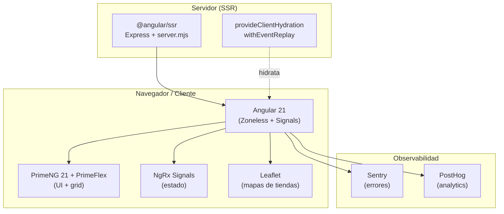
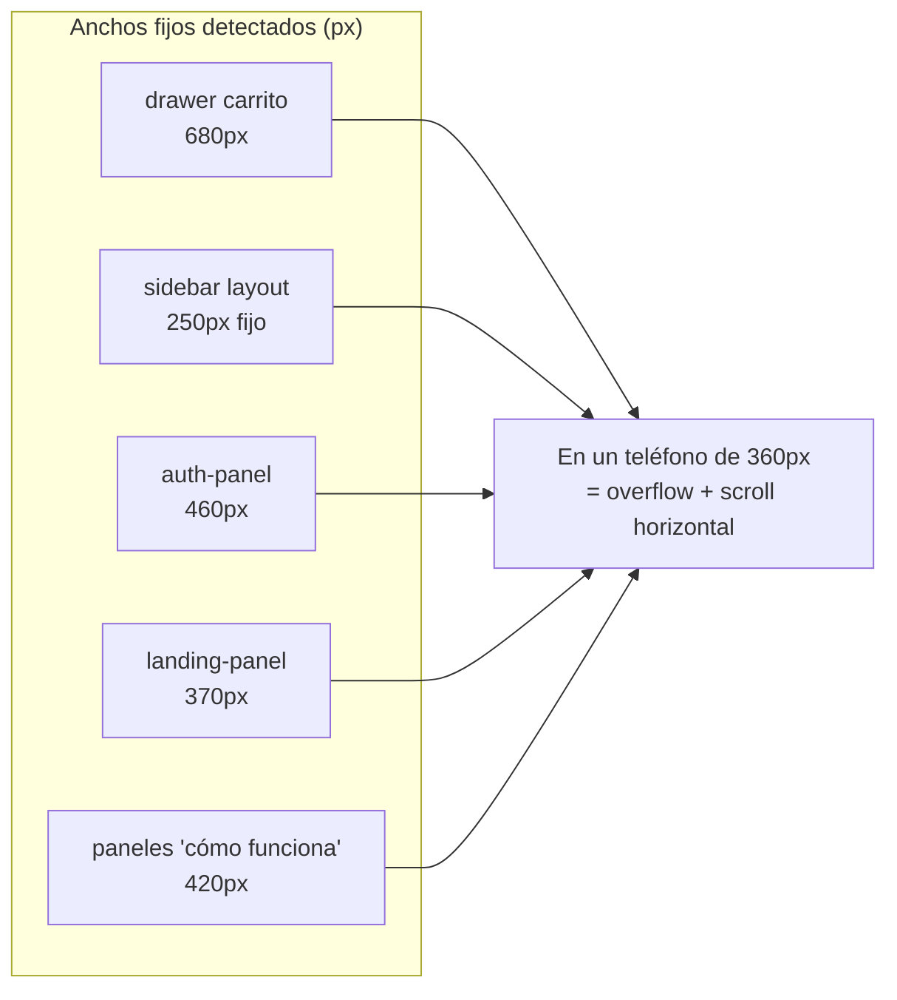
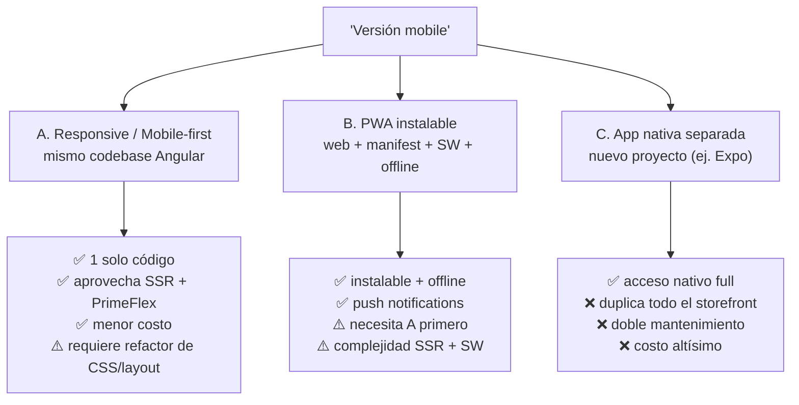
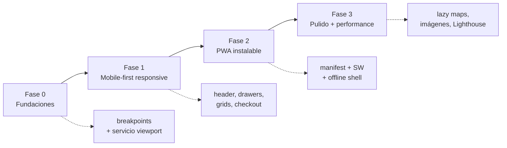

# Plan de versión Mobile — `tiendi-web`

> [!abstract] Resumen ejecutivo
> `tiendi-web` es el **storefront público** (la tienda que ve el comprador) construido en **Angular 21 con SSR**. Hoy el front es **desktop-first**: tiene anchos fijos, drawers de `680px`, un header pensado para pantalla grande y **prácticamente cero media queries** (2 en todo `src/`). No es responsive. Este documento diagnostica el estado real, define qué significa "versión mobile" y propone un plan por fases. **Recomendación: mobile-first responsive sobre el mismo codebase (Fase 1) + PWA instalable (Fase 2). No una app nativa separada.**

---

## 1. ¿Qué es `tiendi-web` dentro del ecosistema?

Tiendi es un SaaS de e-commerce multi-tienda. El monorepo de fuentes tiene varias piezas:

| Proyecto | Rol | Stack |
|----------|-----|-------|
| **`tiendi-web`** | Storefront público (comprador) | Angular 21 + SSR |
| `tiendi-vendor` | Panel del vendedor/tienda | Angular 21 |
| `tiendi-api` | Backend / API | Node |
| `tiendi-go` | App del rider (delivery) | React Native + Expo |

> [!note] Foco de este documento
> Solo `tiendi-web`. La app del comprador. Es la cara pública que necesita funcionar bien en el teléfono, porque **ahí es donde compra la gente**.

---

## 2. Stack tecnológico actual

### Dependencias clave (de `package.json`)

| Categoría | Librería | Versión | Nota mobile |
|-----------|----------|---------|-------------|
| Framework | `@angular/core` | 21 | Zoneless change detection |
| SSR | `@angular/ssr` | 21 | Hydration con event replay |
| UI | `primeng` | 21.1.9 | Componentes tienen variantes responsive nativas |
| Layout CSS | `primeflex` | (CSS) | Grid responsive **ya disponible, casi sin usar** |
| Tema | `@primeuix/themes` (Aura) | — | `darkModeSelector: .dark-mode` ya configurado |
| Estado | `@ngrx/signals` | — | — |
| Mapas | `leaflet` | 1.9 | Pesado en mobile; revisar lazy-load |
| Analytics | `posthog-js` | — | Útil para medir uso mobile real |
| Errores | `@sentry/angular` | — | — |

> [!tip] La base tecnológica es moderna y juega a favor
> Angular 21 zoneless, SSR con hidratación y **PrimeFlex ya instalado** (que trae un sistema de grid responsive completo). El problema **no es el stack** — es que el CSS y los layouts se escribieron desktop-first. Eso se corrige, no se reescribe.

---

## 3. Diagnóstico del estado mobile actual

Esto es lo que encontré leyendo el código, no suposiciones:

> [!danger] Hallazgo crítico: el front NO es responsive
> Hay **solo ~2 media queries en todo `src/`**. Una app de e-commerce sin breakpoints no se adapta al teléfono: se ve la versión de escritorio encogida, con scroll horizontal y elementos cortados.

### 3.1 Anchos fijos por todos lados

| Archivo | Valor | Síntoma en mobile |
|---------|-------|-------------------|
| `styles.scss:241` | `width: 680px` (drawer carrito) | El carrito tapa toda la pantalla y desborda |
| `layout.scss:22-23` | `width/min-width: 250px` (sidebar) | Sidebar fijo come el viewport |
| `landing/.../auth-panel.scss:14` | `460px` | Panel no entra en pantalla angosta |
| `landing-panel.scss:2` | `370px` | Idem |
| `layout.scss:2` | `max-width: 1800px` | Pensado para monitores, no teléfonos |

### 3.2 Header desktop-first

El `header.html` arma logo + buscador + dropdown de usuario + barra de categorías en un **flex horizontal** sin menú hamburguesa ni colapso. En mobile, todo eso compite por ~360px de ancho.

> [!warning] No hay navegación mobile
> No existe patrón de menú hamburguesa, bottom-nav ni colapso del header. La navegación está pensada para mouse y pantalla ancha.

### 3.3 Sin PWA

No hay `manifest.webmanifest`, ni service worker (`ngsw`), ni `@angular/pwa` en dependencias. **Hoy la web no es instalable ni funciona offline.**

### 3.4 Lo que SÍ juega a favor

> [!success] Activos que aceleran el trabajo
> - **PrimeFlex** ya está importado → grid responsive listo para usar (`col-12 md:col-6 lg:col-4`).
> - **PrimeNG 21** trae componentes con comportamiento responsive (Drawer con `fullScreen`, DataView con layout list/grid, etc.).
> - **SSR + hydration** → buen First Contentful Paint en redes móviles lentas.
> - **Dark mode** ya cableado (`darkModeSelector`).
> - **Sistema de temas por tienda** (`theme-1..5` con CSS variables) → no se toca, es ortogonal al responsive.

---

## 4. ¿Qué significa "versión mobile"? — Tres estrategias

Esta es la decisión que define todo. No son excluyentes en el tiempo, pero hay que elegir por dónde empezar.

| Criterio | A. Responsive | B. PWA | C. Nativa |
|----------|--------------|--------|-----------|
| Costo inicial | Medio | Medio-alto | Muy alto |
| Codebases a mantener | 1 | 1 | 2 |
| Instalable en home screen | No | **Sí** | Sí |
| Funciona offline | No | **Sí** | Sí |
| Push notifications | No | Sí (web push) | Sí |
| Reusa SSR/SEO actual | **Sí** | Sí | No |
| Time-to-value | **Rápido** | Medio | Lento |

> [!important] Recomendación
> **Empezar por A (responsive mobile-first) y luego sumar B (PWA).**
>
> 1. **Fase 1 — Responsive:** es el cuello de botella real. Sin esto, ninguna otra estrategia sirve: una PWA de una web rota en mobile sigue rota.
> 2. **Fase 2 — PWA:** una vez que la experiencia mobile es buena, hacerla instalable y offline es incremental sobre el mismo código.
> 3. **Descartar C (nativa) por ahora:** ya existe `tiendi-go` (Expo) para riders. Duplicar el storefront del comprador en nativo significa **dos codebases del mismo producto**, perdiendo el SSR/SEO que hoy es un activo. La PWA cubre el 90% de "parece una app" sin ese costo.

---

## 5. Plan por fases

### Fase 0 — Fundaciones (antes de tocar pantallas)

> [!note] Sin esto, cada componente reinventa sus breakpoints
> - [ ] Definir **breakpoints estándar** (alinear con PrimeFlex: `sm 576`, `md 768`, `lg 992`, `xl 1200`).
> - [ ] Crear un **servicio/signal de viewport** (`BreakpointService` con `isMobile`, `isTablet`) reutilizable — hoy solo `carousel.ts` detecta tamaño, de forma aislada.
> - [ ] Convención de SCSS mobile-first: estilos base = mobile, `@media (min-width)` para escalar hacia arriba.
> - [ ] Auditar y mapear todos los anchos fijos (`px` de 3+ dígitos) para reemplazo sistemático.

### Fase 1 — Mobile-first responsive (el corazón)

Por área, de mayor a menor impacto:

| Prioridad | Área | Trabajo |
|-----------|------|---------|
| 🔴 Alta | **Header / navegación** | Menú hamburguesa o bottom-nav, colapsar buscador/categorías, logo compacto |
| 🔴 Alta | **Drawer carrito** | `680px` → `width: 100%` / `fullScreen` en mobile (PrimeNG Drawer lo soporta) |
| 🔴 Alta | **Grid de productos** | `product-grid` con PrimeFlex `col-12 sm:col-6 lg:col-4` |
| 🔴 Alta | **Checkout** | Flujo de pago en una columna, botones full-width, inputs touch-friendly (≥44px) |
| 🟠 Media | **Layout / sidebar** | Sidebar `250px` fijo → colapsable / off-canvas en mobile |
| 🟠 Media | **Detalle de producto** | Galería full-width, CTA fijo abajo |
| 🟠 Media | **Landing + mapa** | Paneles fijos (`370/420/460px`) → fluidos; mapa Leaflet adaptado |
| 🟢 Baja | **Footer / about / policies** | Apilar columnas |

> [!tip] Aprovechá PrimeNG en vez de pelear con CSS
> Muchos componentes (Drawer, DataView, Menubar) ya tienen modo responsive. Antes de escribir media queries a mano, revisá la prop responsive del componente.

### Fase 2 — PWA instalable

- [ ] `ng add @angular/pwa` → genera `manifest.webmanifest` + service worker (`ngsw-config.json`).
- [ ] Íconos y splash por tienda (ojo con el **multi-tema** `theme-1..5`).
- [ ] Estrategia de caché (app shell + assets; API con network-first).
- [ ] **Cuidado con SSR + service worker** → conviven, pero hay que configurar bien el orden de registro.
- [ ] Web push notifications (opcional, integra con backend).

### Fase 3 — Pulido y performance mobile

- [ ] **Lazy-load de Leaflet** (es pesado; cargar solo en vistas con mapa).
- [ ] Imágenes responsive (`srcset`, `NgOptimizedImage`, formatos modernos).
- [ ] Auditoría **Lighthouse mobile** (objetivo: Performance y Best Practices > 90).
- [ ] Medir uso real con **PostHog** (ya integrado): % tráfico mobile, drop-off en checkout.

---

## 6. Riesgos y cuidados

> [!warning] Puntos de atención
> - **SSR + responsive:** evitar `window`/`navigator` en detección de viewport sin guardas de plataforma (`isPlatformBrowser`) — rompe el render en servidor.
> - **Multi-tema:** el responsive no debe pisar el sistema `theme-N`. Son capas distintas (layout vs. color).
> - **Leaflet en SSR:** ya es delicado; en mobile + lazy-load hay que verificar que no se cargue en servidor.
> - **Regresión desktop:** mobile-first bien hecho no rompe desktop, pero hay que testear ambos. Tener visual testing o checklist por pantalla.
> - **Touch targets:** mínimo 44×44px por accesibilidad (WCAG) — varios botones actuales son chicos para dedo.

---

## 7. Próximos pasos sugeridos

1. **Confirmar la estrategia** (recomendado: A → B, descartar C).
2. Arrancar por **Fase 0** (breakpoints + `BreakpointService`) — es transversal y desbloquea todo.
3. Atacar **Fase 1** por prioridad: header → drawer carrito → grid → checkout.
4. Medir con Lighthouse mobile **antes y después** para tener evidencia del progreso.

> [!success] Decisión tomada (2026-06-30)
> Se elige **responsive mobile-first sobre el mismo codebase** (Estrategia A). PWA queda como Fase 2. El paso a paso ejecutable vive en [[CHECKLIST-RESPONSIVE-WEB]].

---

## Ver también

- [[CHECKLIST-RESPONSIVE-WEB]] — checklist ejecutable paso a paso de esta migración responsive
- [[ARCHITECTURE-SONNET]] — arquitectura general del sistema Tiendi
- [[MODULOS_SISTEMA_TIENDI]] — módulos del sistema
- [[PLANIFICACION]] — planificación general del proyecto
