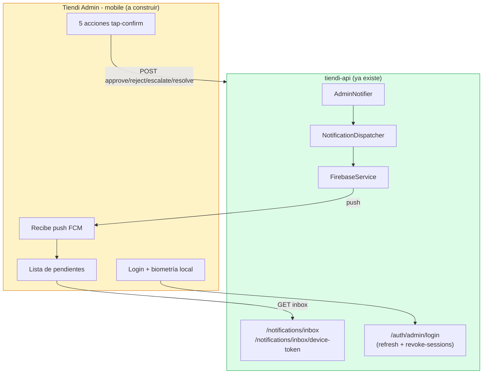
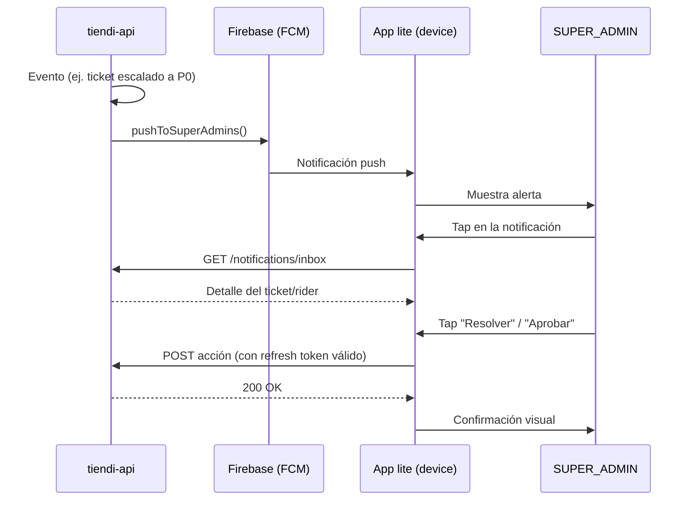

# Tiendi Admin Lite — Consideraciones para el mobile

> [!NOTE]
> Este documento consolida **todo lo que hay que decidir y construir** para llevar la capa de aprobaciones descrita en [[TIENDI_ADMIN]] §14 ("Norte de diseño — capa de aprobaciones móviles lite") a una app real. No reemplaza esa sección — la desarrolla y la corrige donde quedó desactualizada.

## Índice

1. [Corrección de estado — leer antes de todo](#0-corrección-de-estado--leer-antes-de-todo)
2. [Alcance — qué entra y qué no](#1-alcance--qué-entra-y-qué-no)
3. [Decisiones confirmadas (L1-L5)](#2-decisiones-confirmadas-l1-l5)
4. [Stack tecnológico](#3-stack-tecnológico)
5. [Arquitectura propuesta](#4-arquitectura-propuesta)
6. [Infraestructura a reutilizar (no reinventar)](#5-infraestructura-a-reutilizar-no-reinventar)
7. [Lo que falta construir — desde cero](#6-lo-que-falta-construir--desde-cero)
8. [Riesgos](#7-riesgos)
9. [Checklist de seguimiento](#8-checklist-de-seguimiento)

---

## 0. Corrección de estado — leer antes de todo

> [!WARNING]
> [[TIENDI_ADMIN]] §14.2 y §14.3 describen `AdminNotifier` como un stub que bloquea esta capa. **Eso ya no es así.** Verificado contra código (`admin-notifier.service.ts`) y checklist de [[NOTIFICACIONES]] §12: Fases 1-4 están **"Implementada (2026-08-25)"** — email vía SendGrid y push FCM a todos los `SUPER_ADMIN` con `fcmToken` registrado ya están en producción. Lo único pendiente es configuración operativa (`ADMIN_ALERT_EMAILS`, proyecto Firebase web + VAPID key).

Esto cambia el punto de partida real:

| Bloqueaba antes | Estado real hoy |
|---|---|
| `AdminNotifier` solo hacía `logger.warn` | ✅ Envía email + push reales (2026-08-25) |
| No había endpoint de inbox genérico | ✅ `GET /notifications/inbox`, `POST /notifications/inbox/mark-all-read` |
| No había forma de registrar el token del dispositivo | ✅ `POST /notifications/inbox/device-token` (gateado a `SUPER_ADMIN`) |
| **La app mobile en sí** | ✅ Scaffolding + cliente code-complete (2026-08-31); falta build/firma/distribución y config operativa |

> [!IMPORTANT]
> Lo que falta **no es backend de notificaciones** — eso ya está. Lo que falta es el **cliente mobile** que reciba el push, muestre el inbox y ejecute las 5 acciones de aprobación con un tap.

## 1. Alcance — qué entra y qué no

Retomado de [[TIENDI_ADMIN]] §14.1, sin cambios de fondo:

| # | Acción | Por qué es "lite" (tap, no pantalla completa) |
|---|--------|------------------------------------------------|
| 1 | Aprobar / rechazar rider | Sí/no sobre un registro ya validado en desktop |
| 2 | Suspender rider | Acción binaria de emergencia |
| 3 | Escalar ticket de soporte | Cambia prioridad, no requiere formulario |
| 4 | Resolver ticket de soporte | Cierre rápido con nota corta opcional |
| 5 | Reaccionar a alerta "delivery sin rider" | Confirmar que se está atendiendo, no resolverla desde el celular |

**Fuera de scope explícito** (igual que en TIENDI_ADMIN.md, y por la misma razón):

- Merge / verificación de catálogo — demasiado denso visualmente para mobile.
- Ledger / conciliación de wallet — requiere tablas y contexto que no entran en una pantalla chica.

> [!TIP]
> Si en algún momento se quiere agregar una sexta acción a este lite, la prueba de admisión es la misma: **¿se resuelve con un tap y sin scroll de tabla?** Si la respuesta es no, no es "lite" — es una pantalla más de `tiendi-admin` desktop.

## 2. Decisiones confirmadas (L1-L5)

Siguiendo la numeración de decisiones de [[TIENDI_ADMIN]] (D1-D5), pero con prefijo `L` para no confundirlas — estas son específicas del lite mobile.

> [!IMPORTANT]
> **Confirmadas por Hector Lopez (product owner) el 2026-08-31.** Dejan de ser recomendación: son la base de diseño sobre la que cualquier equipo debe construir sin volver a discutirlas. Si alguna deja de tener sentido durante la implementación, se revisa acá y se actualiza esta fecha — no se cambia en silencio en el código.

| # | Decisión | Opciones evaluadas | Decisión confirmada |
|---|----------|----------|---------------|
| **L1** | Tecnología de cliente | PWA instalable / Capacitor (WebView + plugins nativos) / nativo (Flutter, RN) | Capacitor — reutiliza los componentes Angular/Tailwind de `tiendi-admin`, y push FCM nativo es plugin de primera clase (`@capacitor/push-notifications`), a diferencia de una PWA pura donde iOS todavía tiene soporte limitado de Web Push |
| **L2** | Repo / módulo | App nueva independiente vs. carpeta `mobile/` dentro de `tiendi-admin` | Carpeta dentro de `tiendi-admin` — mismo patrón que D2 de TIENDI_ADMIN.md (app propia, no vendor module), pero esta vez el mobile SÍ comparte auth/RBAC/inbox con el desktop, así que separarlo en otro repo duplicaría lógica sin necesidad |
| **L3** | Autenticación en el device | Reusar `POST /auth/admin/login` + refresh token normal vs. sesión biométrica local sobre un token ya emitido | Login normal + biometría **local** (Face ID / huella) solo para desbloquear la sesión ya guardada en el device — no reemplaza el login del backend, solo evita reescribir la contraseña cada vez |
| **L4** | Modelo offline | Requiere conexión siempre vs. cache de últimas N notificaciones + acciones en cola | Requiere conexión — las 5 acciones son estados críticos (aprobar rider, resolver ticket); ejecutar una acción "en cola" sobre un estado que pudo cambiar en desktop mientras tanto es un riesgo de datos mayor al beneficio de UX offline |
| **L5** | Distribución del cliente | Store pública (App Store/Play Store) / MDM corporativo / distribución privada por invitación | Distribución privada por invitación (**TestFlight** en iOS + **Firebase App Distribution** en Android) — los SUPER_ADMIN usan celular personal, así que un MDM corporativo queda descartado (implicaría enrolar el device personal en gestión de la empresa); una store pública tampoco corresponde, porque expondría la existencia de la herramienta admin sin necesidad, dado que la lista de SUPER_ADMIN es acotada |

> [!TIP]
> **Nomenclatura de la app** (deriva de L5, mismo patrón que ya usa `tiendi-go` en el repo):
> - **Repo**: sin cambios — sigue siendo `tiendi-admin` (L2), no hay repo nuevo.
> - **appName** (Capacitor): `Tiendi Admin`
> - **appId / bundle ID** (iOS `bundleIdentifier`, Android `applicationId`): `com.tiendi.admin` — reverse-DNS obligatorio para stores, sigue el mismo patrón `com.tiendi.<producto>` que `com.tiendi.go` (app del rider).

## 3. Stack tecnológico

### 3.1 Cliente móvil — sobre Angular existente

| Capa | Tecnología | Justificación |
|------|------------|----------------|
| Wrapper nativo | **Capacitor** (decisión L1) | Envuelve el Angular/Tailwind ya existente de `tiendi-admin`; no reescribe UI |
| Push | `@capacitor/push-notifications` | Integra con el FCM que ya usa `FirebaseService` en el backend — mismo proyecto Firebase, mismo token |
| Biometría | `@capacitor-community/biometric-auth` (o equivalente Face ID/huella) | Decisión L3 — desbloqueo local de una sesión ya autenticada, no reemplaza el login |
| Almacenamiento seguro | `@capacitor/preferences` sobre Keychain (iOS) / Keystore (Android) | El refresh token **nunca** va a `localStorage` — mismo estándar que cualquier app nativa que persiste credenciales |
| Permisos runtime | Capacitor `Permissions` API | Android 13+ exige permiso explícito de notificaciones |
| UI | Angular 21 (standalone, signals) + Tailwind CSS 4 | Reuso directo — cero librería de UI nueva, cero design system paralelo |

### 3.2 Backend — una corrección al respecto

> [!WARNING]
> **Corrección (2026-08-31, durante la implementación):** esta sección decía "tiendi-api no necesita ni una línea nueva". Eso era **inexacto**: `AdminNotifier` enviaba email + push pero **nunca persistía** filas `Notification` con `ownerType=ADMIN` — el inbox del SUPER_ADMIN estaba siempre vacío y `GET /notifications/inbox` no devolvía nada. Como el inbox es la fuente de verdad del mobile (§7), se agregó: `AdminNotifier.persistAdminInbox()` persiste una fila por SUPER_ADMIN activo en cada alerta (y `alertRiderPendingReview()` nueva, disparada por `RidersService.registerStep3` al pasar a `UNDER_REVIEW` — alimenta las acciones de rider). Verificados con tests.

Con esa corrección aplicada, el resto sigue siendo cierto: `NotificationDispatcher`, `FirebaseService` y los endpoints de inbox/device-token ya estaban en producción. El mobile es, desde la perspectiva del backend, **un cliente más** consumiendo lo que `tiendi-admin` desktop ya consume.

### 3.3 Excluido a propósito

| Descartado | Motivo |
|---|---|
| React Native / Flutter | Reescribiría desde cero componentes que ya existen en Angular — contradice L1 |
| Proveedor de push alternativo (OneSignal, etc.) | FCM ya está integrado en el backend (`FirebaseService`); agregar otro proveedor duplicaría infraestructura sin necesidad |
| PWA / Web Push puro | Soporte de iOS para Web Push sigue siendo limitado — razón central de L1 |

> [!TIP]
> Todo lo de esta sección es **cliente**. El backend no aparece en la tabla de la §3.1 porque no hay nada que decidir ahí: ya está resuelto (§0).

## 4. Arquitectura propuesta

> [!NOTE]
> Todo lo verde ya existe en producción. Todo lo amarillo es el trabajo pendiente de este documento.

### Flujo de una aprobación (push → tap → confirmación)

## 5. Infraestructura a reutilizar (no reinventar)

- **RBAC**: `AdminRole = Extract<Role, 'SUPER_ADMIN'>` de `@kanoso/auth-types` — el mobile no necesita un modelo de permisos nuevo, hereda el mismo guard que ya protege `/auth/admin/login` y el resto de endpoints admin.
- **Revocación de sesión**: Fase 5 de [[AUTENTICACION]] (refresh rotation + reuse-detection + `POST /admin/users/:userId/revoke-sessions`) — si se pierde un celular, la sesión se mata desde desktop sin tocar nada nuevo.
- **Inbox genérico**: `NotificationOwner` enum (`STORE`/`RIDER`/`ADMIN`) + `ownerId` ya generalizado en Fase 2 de [[NOTIFICACIONES]] — el mobile consume el mismo `GET /notifications/inbox` que cualquier otro rol, filtrado por `ADMIN`.
- **Registro de push token**: `POST /notifications/inbox/device-token` ya gateado a `SUPER_ADMIN` — el mobile solo necesita llamarlo una vez tras el login.

> [!TIP]
> Esta lista es la razón por la que L2 recomienda no separar el mobile en otro repo: reusar esta infraestructura vía imports/servicios compartidos es mucho más simple si vive dentro del mismo workspace que `tiendi-admin`.

## 6. Lo que falta construir — desde cero

> [!CAUTION]
> `tiendi-admin` hoy es Angular puro, desktop-only. No hay Capacitor, Ionic, React Native ni Cordova en el proyecto. **Todo el lado cliente del mobile arranca en cero.**

Trabajo real pendiente:

1. Scaffolding de Capacitor sobre Angular (o carpeta nueva, según L2) — config de `capacitor.config.ts`, iOS/Android shells.
2. Integración de `@capacitor/push-notifications` + manejo de permisos (Android 13+ pide permiso runtime).
3. Pantalla de login mobile + almacenamiento seguro del refresh token (`Capacitor Preferences` o Keychain/Keystore vía plugin, **no** `localStorage`).
4. Biometría local (L3) vía `@capacitor-community/biometric-auth` o similar.
5. Lista de inbox + las 5 acciones tap-confirm (UI nueva, pero puede reusar componentes Tailwind ya existentes en `tiendi-admin`).
6. Build/release pipeline: firma de APK/IPA, alta en TestFlight (iOS) y Firebase App Distribution (Android), gestión de la lista de invitados (decisión L5).

## 7. Riesgos

| Riesgo | Impacto | Mitigación |
|--------|---------|------------|
| Acción tomada en el celular sobre un estado ya cambiado en desktop (carrera) | Alto — decisión de negocio duplicada/contradictoria | Cada endpoint de acción debe validar estado actual server-side y devolver 409 si ya fue resuelto por otro canal |
| Push no llega (token FCM vencido, permisos revocados) | Medio — admin no se entera a tiempo | El inbox (`GET /notifications/inbox`) sigue siendo la fuente de verdad; el push es solo el disparador, no el único canal |
| Pérdida o robo de un celular personal con la app instalada (no hay MDM que permita borrado remoto forzado, por L5) | Alto — superficie de exposición si se pierde el device | L3 (biometría local) + revocación de sesión (Fase 5 AUTENTICACION) cubren el acceso; falta documentar como requisito operativo que el admin reporte la pérdida de inmediato para revocar la sesión desde desktop |

## 8. Checklist de seguimiento

- [x] **L1-L5** — Decisiones tomadas y documentadas (confirmadas 2026-08-31)
- [x] Scaffolding de Capacitor sobre `tiendi-admin` (`capacitor.config.ts` con `appId: com.tiendi.admin` + shell Android; 2026-08-31)
- [x] Login mobile + almacenamiento seguro de token (`@capacitor/preferences`, biometría local vía `@aparajita/capacitor-biometric-auth`; 2026-08-31)
- [x] Backend: `AdminNotifier` persiste inbox ADMIN + alerta de rider pendiente (corrección de §3.2; 2026-08-31)
- [x] Registro de `fcmToken` vía `POST /notifications/inbox/device-token` (`MobilePushService`; 2026-08-31)
- [x] Recepción de push + deep link al inbox (`pushNotificationActionPerformed` → `/mobile/inbox`; 2026-08-31)
- [x] UI de las 5 acciones tap-confirm (`/mobile/inbox`, mapeo por `type` de notificación; 2026-08-31)
- [x] Manejo de 409 (estado ya resuelto por otro canal) → toast + reload del inbox (2026-08-31)
- [ ] URL de API en el build del APK: `environment.prod.ts` hoy apunta a `localhost:3001` (config de desktop); el APK necesita la URL pública de `tiendi-api`
- [ ] Config operativa pendiente heredada de [[NOTIFICACIONES]] §12: `ADMIN_ALERT_EMAILS` en prod, proyecto Firebase Android (google-services.json) para el `appId com.tiendi.admin` + proyecto Firebase web + VAPID key
- [ ] Pipeline de build/firma/distribución (`npx cap sync` ya verificado; falta firma de APK, TestFlight iOS y Firebase App Distribution — decisión L5)

## Referencias

- [[TIENDI_ADMIN]] — §14 (norte de diseño original), §7 (auth y seguridad), §13 (checklist general)
- [[NOTIFICACIONES]] — §9 (gap del admin, resuelto), §12 (checklist de fases 1-4)
- [[AUTENTICACION]] — Fase 3 (AdminRole), Fase 5 (revocación de sesión)

## Archivos afectados (estado objetivo)

| Archivo | Estado actual | Cambio esperado |
|---|---|---|
| `tiendi-admin/capacitor.config.ts` | ✅ Creado (2026-08-31) | `appId: "com.tiendi.admin"`, `appName: "Tiendi Admin"` |
| `tiendi-admin/src/app/mobile/**` | ✅ Creado (2026-08-31) | Login + biometría, inbox con las 5 acciones tap-confirm, push nativo, storage seguro |
| `tiendi-admin/android/` | ✅ Creado (`npx cap add android`) | Shell nativo Android; iOS queda para cuando haya macOS (TestFlight) |
| `tiendi-api/src/modules/support/admin-notifier.service.ts` | ✅ Actualizado (2026-08-31) | Además de email+push, persiste inbox ADMIN (`persistAdminInbox`) y agrega `alertRiderPendingReview` |
| `tiendi-api/.../notifications/inbox.controller.ts` | ✅ Sin cambios | Reusado tal cual |
