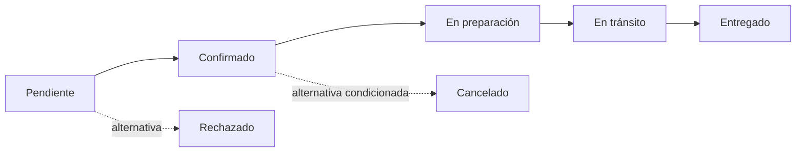

# Tiendi Admin: guía de implementación del seguimiento de pedidos

Fecha: 2026-10-08. Estado: especificación para otro agente; funcionalidad pendiente de implementación.

## 1. Objetivo y alcance

En el detalle de un pedido de Tiendi Admin, implementar una sección **Seguimiento del pedido** que permita responder:

- ¿Cuál es el estado actual y por cuáles pasó realmente?
- ¿Quién realizó cada cambio, desde qué aplicación y en qué fecha y hora?
- ¿Cuánto tiempo permaneció en cada estado?
- ¿Qué otros estados y transiciones contempla su flujo, aunque no se hayan utilizado?

La entrega incluye persistencia de auditoría, integración de todos los productores de cambios, API de consulta y visualización en Admin. Conservar las operaciones existentes de los otros clientes. Esta sección es de consulta: no añadir botones para forzar estados ni redefinir el negocio.

Separar el estado del pedido de los estados de pago y reparto. Mostrar sus indicadores actuales cuando existan; no convertir, por ejemplo, `pagado` en una etapa del pedido. El historial detallado de esos otros dominios puede incorporarse después, salvo que el modelo actual ya lo proporcione.

## 2. Evidencia y límites de esta guía

Se revisó documentación y la configuración de submódulos, no el código de las aplicaciones. En este checkout los submódulos no están inicializados. Los nombres de tablas, servicios, estados y endpoints propuestos aquí deberán adaptarse a la implementación real.

Referencias que debe leer el agente:

- [Tiendi Admin](TIENDI_ADMIN.md): back-office de plataforma, reutiliza `tiendi-api`; el rol documentado es `SUPER_ADMIN`. No crear nuevos roles para esta tarea.
- [Planificación, sección 7.3](PLANIFICACION.md): estados documentados Pendiente, Confirmado, Preparar, En tránsito, Entregado, Cancelado y Rechazado. No asumir que son el enum vigente.
- [Secuencias de compra, secciones 7 y 8](DIAGRAMAS/secuencia/DIAGRAMAS_SECUENCIA_COMPRA.md): propone actualizar pedido e insertar `order_status_history` dentro de una transacción.
- [Prototipo Vendor](WEB-VENDOR/prototype/orders-detail.html): referencia visual de historial simple; no prueba que exista auditoría en producción.
- [Guía multitienda](../FUENTES/GUIA-ADECUACION-MULTITIENDA.md): contexto de aislamiento entre tiendas; su alcance es distinto del back-office de plataforma.

El código y los contratos vigentes prevalecen sobre ejemplos documentales. Registrar discrepancias y la decisión tomada. No declarar una tabla, endpoint o control como existente sin comprobarlo.

## 3. Paso 1: preparar e inventariar

1. Leer los `AGENTS.md` aplicables al workspace y a cada submódulo antes de modificarlo.
2. Revisar `git status` en el repositorio raíz y en los submódulos; conservar cambios ajenos.
3. Si faltan las fuentes, inicializar los submódulos necesarios con las referencias fijadas por el repositorio:

   ```powershell
   git submodule update --init --recursive FUENTES/tiendi-api FUENTES/tiendi-admin FUENTES/tiendi-vendor FUENTES/tiendi-go FUENTES/tiendi-web
   ```

   Si no se dispone de acceso, documentar ese bloqueo; no implementar contra estructuras inventadas ni actualizar a otra rama de forma silenciosa.
4. Identificar stack, scripts de validación, esquema de datos, migraciones y pruebas reales.
5. Buscar todas las escrituras del estado: creación, aceptación, preparación, asignación/recogida/entrega si afectan al pedido, cancelación, rechazo, tareas programadas, webhooks, integraciones, importaciones y herramientas administrativas.
6. Localizar auditoría existente, reglas de transición, guardas de Admin, contexto de autenticación, idempotencia, publicación de eventos y pantalla de detalle.

Completar este inventario en la entrega del agente:

| Operación | Archivo/método real | Estado afectado | Actor | Origen | Ruta de escritura compartida | Prueba |
|---|---|---|---|---|---|---|
| Crear pedido | Por completar | Por confirmar | Cliente/sistema | Web/app/integración | Por completar | Por completar |
| Cambiar/cancelar/rechazar | Una fila por productor | Por confirmar | Por confirmar | Por confirmar | Por completar | Por completar |
| Automatización/webhook | Una fila por productor | Por confirmar | Sistema/integración | Por confirmar | Por completar | Por completar |

**Salida requerida:** lista de productores completa y decisión de reutilizar/extender el historial existente o crear uno. No duplicar una auditoría que ya cubre esta necesidad.

## 4. Paso 2: definir el flujo y su significado visual

1. Reutilizar las reglas de transición del backend. Si están dispersas, centralizar su definición sin cambiar sus resultados.
2. Distinguir modalidad de entrega, recogida y cualquier variante que ya exista. No mostrar etapas de reparto a un pedido de recogida si no aplican.
3. Mantener una definición del flujo identificable por versión. Los eventos nuevos deben indicar qué versión aplicaba. Conservar las definiciones necesarias para interpretar pedidos anteriores.
4. Distinguir tres conceptos en la respuesta y la interfaz:

   | Concepto | Significado |
   |---|---|
   | Recorrido real | Eventos persistidos, incluyendo retrocesos y estados repetidos |
   | Flujo aplicable | Estados y conexiones posibles para esa modalidad y versión |
   | Siguientes transiciones | Posibilidades desde el estado actual sujetas a las reglas actuales; no equivalen a permiso para ejecutarlas |

5. Para datos antiguos sin versión conocida, mostrar el flujo actual como **referencia**, indicando que no se conoce el flujo histórico. No afirmar qué alternativas estuvieron disponibles en una fecha pasada.
6. Si las transiciones dependen de condiciones, incluir una explicación legible. No representar todas las rutas como disponibles ahora.

Ejemplo conceptual, a sustituir por las reglas verificadas:



Este diagrama no autoriza transiciones. No añadir sus aristas al backend sin validarlas contra el negocio existente.

## 5. Paso 3: persistir una auditoría permanente

Extender la tabla existente si es suficiente. Como mínimo, cada evento debe conservar:

| Campo conceptual | Regla |
|---|---|
| `id`, `orderId`, `storeId`/ámbito real | Identidad y vinculación verificadas en servidor |
| `sequence` | Orden creciente por pedido, único dentro del pedido y asignado con control de concurrencia |
| `eventType` | Creación, cambio de estado o referencia inicial de pedido antiguo |
| `fromStatus`, `toStatus` | Códigos reales; origen nulo solo para creación/referencia explícita |
| `occurredAt` | Momento del cambio aceptado por el backend, en UTC, según reloj del servidor/base de datos |
| `actorType`, `actorId` | Usuario, sistema o integración; identificar procesos automáticos |
| `actorNameSnapshot`, `actorRoleSnapshot` | Nombre y rol efectivos al ocurrir el evento, sin depender solo del perfil actual |
| `sourceApp`, `sourceAssurance` | Aplicación identificada y procedencia verificada, declarada o desconocida |
| `reasonCode`, `comment` | Motivo estructurado y observación opcional; conservar requisitos actuales de cancelación/rechazo |
| `workflowVersion` | Versión de reglas cuando se conoce |
| `operationId`/idempotencia, `correlationId` | Distinguir reintento de una nueva operación y relacionar procesamiento asíncrono |

Aplicar estas reglas:

- Los registros son acumulativos: no ofrecer edición/eliminación desde la funcionalidad. Una corrección posterior agrega un evento, nunca reescribe el recorrido.
- Un usuario eliminado no debe borrar sus eventos en cascada. Conservar una identificación mínima compatible con la política vigente; mostrar un fallback si falta el nombre.
- No almacenar tokens, credenciales ni payloads completos. Los comentarios tienen límite de longitud y se renderizan como texto.
- Crear índices para consulta por pedido y secuencia, y restricciones de unicidad para secuencia e idempotencia según el ámbito real.
- Calcular duraciones a partir de tiempos persistidos. Para historial incompleto o referencia inicial, devolver duración desconocida, no cero ni una estimación presentada como real.
- Para registros importados con un tiempo histórico acreditado, conservar también cuándo se registraron y su procedencia. No sustituirlo por una fecha inventada.

Preparar migración aditiva y compatible con versiones anteriores de los clientes. No reconstruir estados intermedios a partir de `updatedAt`.

## 6. Paso 4: verificar quién y desde dónde cambia el pedido

Resolver el actor en la sesión o identidad de servicio autenticada; nunca tomar `changedBy`, nombre o rol del body del cliente.

Para el origen:

1. Usar identidad de cliente verificada por el backend (sesión vinculada a una app, claim emitido y validado por servidor, credencial de integración o proceso interno conocido).
2. No tratar un header `X-App`, `Origin`, `Referer` o `User-Agent` como prueba de la aplicación. Si es la única señal disponible, marcarla como **declarada/no verificada** o usar **Origen desconocido**.
3. Si todos los clientes comparten hoy sesiones indistinguibles, documentar esa limitación e incorporar identificación de cliente en el mecanismo de autenticación existente cuando sea viable. No fabricar certeza ni romper clientes antiguos.
4. Para tareas automáticas mostrar **Sistema · nombre del proceso**. Para webhooks mostrar la integración realmente autenticada.
5. Si un usuario inicia una operación que luego ejecuta un job, conservar ejecutor e iniciador como datos distintos cuando estén disponibles; no atribuir al usuario acciones autónomas posteriores del sistema.

Catálogo orientativo: Tiendi Admin, Tiendi Vendor, Tiendi Go, Tiendi Web, Sistema e Integración. Incluir otras apps solo si el inventario confirma que producen cambios.

## 7. Paso 5: integrar todas las escrituras

Implementar o reutilizar un servicio de transición compartido:

```text
Autenticar y construir contexto confiable de actor/origen
Iniciar transacción
  Cargar pedido en su ámbito y controlar concurrencia
  Verificar permisos y reglas sobre el estado vigente
  Resolver reintento mediante la clave de idempotencia existente
  Actualizar estado/versionado del pedido
  Insertar evento con estado anterior real, secuencia y contexto
  Registrar publicación pendiente si existe patrón outbox
Confirmar transacción
Publicar/iniciar los efectos posteriores mediante el mecanismo existente
```

- Registrar la creación junto con el pedido nuevo.
- Si falla el registro del evento, revertir el cambio de estado. No depender de que un consumidor asíncrono construya después la única auditoría.
- Usar bloqueo de fila u operación condicional por versión para evitar que dos cambios concurrentes graben el mismo estado anterior. Revalidar tras conflicto; no sobrescribir a ciegas.
- Un reintento exitoso no crea otro cambio ni repite efectos. Una solicitud al mismo estado no crea una transición ficticia; respetar la semántica existente del endpoint.
- Un intento rechazado no forma parte del recorrido real. Si se registra por seguridad, hacerlo en el mecanismo correspondiente.
- Conservar las integraciones de stock, pagos y notificaciones. No ejecutar llamadas externas dentro de la transacción de base de datos; usar la coordinación/reintentos existentes. No introducir event sourcing ni un broker nuevo solo para esta vista.
- Propagar el contexto confiable por colas. Volver a buscar escrituras directas y cubrir cada productor inventariado.

**Salida requerida:** no queda una ruta conocida de cambio de estado sin auditoría, o se declara explícitamente el faltante como trabajo pendiente que impide dar la implementación por completa.

## 8. Paso 6: exponer consultas para Admin

Reutilizar rutas existentes o proponer, siguiendo convenciones reales:

- `GET /admin/orders/:orderId/tracking`: resumen, estado actual, cobertura histórica y flujo aplicable.
- `GET /admin/orders/:orderId/history?cursor=...&limit=...`: eventos paginados.

No son endpoints existentes confirmados. Ambos deben aplicar el guard de Admin y la política vigente; actualmente la documentación limita la app a `SUPER_ADMIN`. La consulta de plataforma puede cruzar tiendas por autorización de plataforma, no por omitir controles. No abrir acceso a Vendor/Go/Web por compartir modelo.

El contrato de seguimiento debe incluir:

```text
orderId, storeId, currentStatus, statusSince (nullable)
asOfSequence, serverTime
historyCoverage: complete | partial | unavailable
historyAvailableFrom (nullable)
workflow: version, mode, historicalAccuracy, nodes[], edges[]
visitedStates[], traversedEdges[], nextTransitions[]
paymentStatus y deliveryStatus cuando existan
```

El contrato de historial debe incluir:

```text
items[]: campos públicos del evento + previousStateDurationMs (nullable)
nextCursor (nullable), asOfSequence
```

- El resumen del recorrido se calcula sobre todo el historial disponible, nunca solo sobre la página visible.
- Usar secuencia como orden estable. Definir explícitamente historial descendente (más reciente primero) y cursor sin duplicados cuando llegan nuevos eventos.
- Anclar la lectura a `asOfSequence` para mantener consistencia entre resumen y páginas; al actualizar, obtener una nueva vista coherente. El cursor debe conservar ese límite.
- Calcular la duración con el evento anterior real, aunque quede en otra página.
- Fechas ISO 8601 con zona UTC; códigos de estado separados de las etiquetas de presentación.
- Limitar tamaño de página, validar cursor y aplicar las convenciones existentes para errores de acceso, recurso inexistente y parámetros inválidos.
- No exponer metadatos internos innecesarios. Documentar el contrato mediante el mecanismo del proyecto.

## 9. Paso 7: implementar la sección visual

Usar el sistema de diseño y librerías existentes de Admin. No instalar una librería de diagramas si una representación sencilla con componentes/SVG basta.

Orden de pantalla:

1. **Cabecera:** pedido, tienda, estado actual y tiempo en ese estado si se conoce.
2. **Recorrido resumido:** etapas completadas, actual y pendientes claramente etiquetadas.
3. **Ver estados posibles:** panel desplegable con nodos/aristas del flujo, recorrido real destacado y alternativas diferenciadas con líneas discontinuas y leyenda.
4. **Historial de cambios:** línea de tiempo, más reciente primero, con paginación mediante “Cargar anteriores”.

Ejemplo de tarjeta ficticia:

```text
En preparación → En tránsito
08 oct 2026 · 10:42:18 a. m. · America/Lima (UTC−05:00)
Carlos Pérez · Repartidor
Desde Tiendi Go · Origen verificado
Tiempo en el estado anterior: 17 min
Comentario: Pedido recogido en tienda.
```

Comportamientos obligatorios:

- Conservar cada repetición y retroceso en la línea de tiempo. El mapa resume; la línea de tiempo explica todas las ocurrencias.
- En cancelación/rechazo, mostrar el desenlace real y las etapas restantes como **No recorridas**, no como pendientes de ejecución.
- Una etapa posible no es un hecho ocurrido. Nunca generar tarjetas históricas a partir de la lista de estados.
- Mostrar segundos y zona horaria explícita. Usar la configuración de la app; si falta, `America/Lima` como valor inicial. No convertir manualmente restando horas.
- El tiempo del estado actual puede actualizarse en pantalla tomando como referencia `serverTime`. Si se desconoce el inicio, mostrar “Duración no disponible”.
- Mostrar “Origen no verificado” cuando corresponda y “Usuario no disponible”/“Origen desconocido” si faltan datos.
- Para historial parcial, mostrar desde cuándo existe cobertura y advertir la ausencia de registros anteriores. Para historial inexistente: “Historial no disponible para este pedido”. El estado actual sigue visible.
- Incluir estados de carga, error con reintento, acceso denegado y pedido inexistente; un error de red no se presenta como historial vacío.
- Usar texto/iconos además del color; el panel y paginación deben funcionar con teclado, lectores de pantalla y ancho móvil.
- Reutilizar el canal de actualización existente si lo hay. Tras reconexión, volver a consultar; no confiar únicamente en eventos recibidos. Si no hay canal, ofrecer “Actualizar” y mostrar hora de última actualización.
- Claves de caché con pedido y ámbito correctos; limpiar datos al cambiar pedido/sesión. No mostrar temporalmente el historial de otro pedido.

## 10. Paso 8: resolver pedidos anteriores

1. Si existe historial confiable, migrarlo conservando identidad, orden y fechas; marcar origen/actor desconocidos donde corresponda.
2. Si solo existe el estado actual, no generar eventos de creación, confirmación o entrega retrospectivos.
3. Se puede registrar una **Referencia inicial** en el momento de activar auditoría, con el estado observado. No etiquetarla como cambio de estado ni usar su fecha como inicio real de ese estado.
4. Clasificar cobertura como parcial o no disponible. Un pedido nuevo solo puede marcarse completo si se audita desde su creación y todos sus productores están cubiertos.
5. El backfill, si hace falta, debe ser reiniciable e idempotente, con conteos verificables y una estrategia que evite carreras con las escrituras activas.

## 11. Paso 9: pruebas y criterios de aceptación

Ejecutar los comandos de lint, tipos, pruebas y build definidos en cada repositorio afectado. Agregar pruebas que cubran los invariantes, usando base de datos real de pruebas para atomicidad y concurrencia cuando el proyecto lo permita.

| Caso | Resultado esperado |
|---|---|
| Creación y recorrido normal | Evento inicial y un evento por transición, actor/origen/fecha correctos |
| Cambio desde cada productor inventariado | Se conserva la procedencia correspondiente y se ve en Admin |
| Cancelación y rechazo | Estado anterior, motivo y desenlace visibles; etapas restantes no pendientes |
| Retroceso o repetición permitidos | Todas las ocurrencias se conservan y sus duraciones corresponden |
| Transición inválida | No cambia pedido ni aparece evento de éxito |
| Falla al insertar historial | Se revierte también el estado |
| Dos cambios simultáneos | Se serializan o uno falla por conflicto; cadena anterior/nuevo coherente |
| Reintento de la misma operación | Un único evento y sin efectos duplicados |
| Body/header con actor o app falsos | No suplanta actor ni obtiene origen verificado |
| Job y webhook | Sistema/integración identificados; iniciador distinto si aplica |
| Usuario renombrado/eliminado | Historial sigue interpretable y no desaparece |
| Usuario no Admin e ID de otra tienda | Se aplica la política de acceso, sin filtración de historial |
| Historial largo y nuevos eventos | Páginas coherentes sin duplicados; resumen basado en historial completo |
| Pedido antiguo sin registros | Estado actual visible; cobertura y duraciones desconocidas explícitas |
| Modalidad de recogida | No se inventan etapas de transporte que no apliquen |
| Distintas zonas horarias y medianoche | Fecha/hora correctas y zona explícita |
| Error de API y reconexión | Reintento funcional y recuperación del historial perdido |
| Navegación entre pedidos | No se mezclan datos ni cachés |
| Accesibilidad y pantalla estrecha | Lectura completa, teclado y estados distinguibles sin color |

Preparar datos de demostración ficticios para recorrido normal, cancelación, automatización y pedido antiguo. La verificación visual debe usar datos provenientes de la API de pruebas, además de cualquier mock de componentes.

## 12. Paso 10: despliegue y cierre

Secuencia de entrega:

1. Aplicar migración aditiva en el entorno de pruebas.
2. Desplegar backend que escribe auditoría y sirve las consultas; durante un despliegue mixto no prometer cobertura completa si quedan escritores antiguos.
3. Actualizar productores o autenticación de clientes solo donde sea necesario para identificar origen, manteniendo compatibilidad.
4. Verificar transiciones de todos los productores y ejecutar backfill controlado si corresponde.
5. Desplegar la sección de Admin y verificar con los escenarios de demostración.
6. Promover según el proceso existente y la autorización de despliegue aplicable; esta guía no concede autorización adicional para publicar en producción.

Monitorear fallos de escritura de auditoría, conflictos de transición, orígenes desconocidos y errores/latencia de consulta. Los logs operativos no sustituyen los eventos persistidos.

Reversión: ocultar/revertir la interfaz si es necesario, conservar tablas y eventos. Mantener un backend compatible que siga auditando; si una reversión vuelve a un escritor antiguo, registrar el intervalo de cobertura perdida y no anunciar historial completo. No borrar datos de auditoría como parte del rollback.

El agente debe entregar:

- Inventario de productores y decisiones sobre flujo, origen y cobertura histórica.
- Migración, integración del backend, contrato documentado y sección visual implementada.
- Pruebas ejecutadas con resultados reales, comandos y cualquier bloqueo; no declarar pruebas omitidas como aprobadas.
- Evidencia visual de los escenarios principales y rutas para reproducirlos.
- Lista de archivos/repositorios modificados y pendientes concretos, si los hay.
- Si el trabajo incluye commits: cambios dentro de cada submódulo y referencias del repositorio padre coherentes con la estrategia de entrega; no dejar únicamente referencias a commits inaccesibles para el siguiente agente.

## 13. Checklist para dar por terminada la implementación

- [ ] Fuentes reales inspeccionadas y todos los productores inventariados.
- [ ] Flujo basado en reglas reales, con modalidades y precisión histórica explícitas.
- [ ] Cambio e historial atómicos, concurrencia e idempotencia verificadas.
- [ ] Actor confiable y origen verificado o claramente calificado como desconocido/declarado.
- [ ] Consulta protegida y paginada, con resumen consistente sobre todo el historial.
- [ ] Recorrido, mapa de alternativas y línea de tiempo disponibles en Admin.
- [ ] Fecha, hora, zona, responsable, aplicación y duración visibles cuando se conocen.
- [ ] Cancelaciones, repeticiones y pedidos antiguos representados sin fabricar hechos.
- [ ] Pruebas funcionales, acceso, atomicidad y verificación visual aprobadas.
- [ ] Instrucciones de despliegue/reversión y evidencia de entrega documentadas.

## 14. Instrucción lista para el siguiente agente

> Implementa el seguimiento visual y auditable de pedidos en Tiendi Admin siguiendo `DOCS/TIENDI_ADMIN-SEGUIMIENTO-PEDIDOS-IMPLEMENTACION.md`. Comienza por leer las instrucciones locales e inspeccionar las fuentes reales: los contratos de esta guía son propuestas. Reutiliza las reglas de estados y mecanismos de auditoría existentes. Cubre todos los productores de cambios, no solo Admin, y entrega persistencia atómica, consultas protegidas y la vista con recorrido, alternativas e historial. Conserva compatibilidad, evita atribuciones de origen no verificadas y no inventes historia de pedidos antiguos. Ejecuta las pruebas indicadas, documenta resultados y pendientes, y conserva los cambios ajenos al trabajo.
