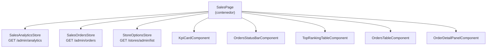

# Tiendi Admin - Módulo "Ventas" (monitoreo de ventas de la plataforma)

> **Estado:** especificación lista para implementar · **Fecha:** 2026-10-05
> **App:** `FUENTES/tiendi-admin` (Angular 21 + `@ngrx/signals` + SCSS/Tailwind 4)
> **Backend:** `FUENTES/tiendi-api` — **sin cambios obligatorios** para el MVP
> **Documento padre:** [[TIENDI_ADMIN]]

---

## Índice

1. [Objetivo](#1-objetivo)
2. [Encaje con la frontera del admin](#2-encaje-con-la-frontera-del-admin)
3. [Decisiones abiertas (resolver antes o durante la implementación)](#3-decisiones-abiertas)
4. [Contratos de API (ya existen)](#4-contratos-de-api-ya-existen)
5. [Gotchas verificados en el código](#5-gotchas-verificados-en-el-código)
6. [Diseño de la pantalla](#6-diseño-de-la-pantalla)
7. [Arquitectura frontend](#7-arquitectura-frontend)
8. [Archivos a crear y modificar](#8-archivos-a-crear-y-modificar)
9. [Tests](#9-tests)
10. [Criterios de aceptación](#10-criterios-de-aceptación)
11. [Fuera de alcance / Fase 2](#11-fuera-de-alcance--fase-2)
12. [Orden de implementación sugerido](#12-orden-de-implementación-sugerido)

---

## 1. Objetivo

Dar al Super Admin una pantalla donde vea **qué está vendiendo la plataforma**:

- KPIs del período: ventas totales, número de pedidos, ticket promedio, cada uno comparado con el período anterior.
- Distribución de pedidos por estado (incluye rechazados y pendientes, para detectar problemas operativos).
- Totales de la plataforma: tiendas (activas/suspendidas), usuarios por rol, productos (activos).
- Top 5 tiendas por ingresos y top 5 productos por ingresos.
- Listado paginado de **todos los pedidos** de la plataforma con filtros (estado, estado de pago, tienda, fechas, búsqueda) y detalle de cada pedido.
- Auto-refresco opcional para monitorear "en vivo" cuando el período es `today`.

Hoy el `DashboardPage` es solo un lanzador de módulos sin métricas y ningún módulo consume `/admin/analytics` ni `/admin/orders`, aunque ambos endpoints existen.

---

## 2. Encaje con la frontera del admin

[[TIENDI_ADMIN]] §1.2: *"¿cuánto tiene Tiendi?" → tiendi-admin*. §1.4 excluye **"Analytics por tienda (es del vendedor)"**.

Este módulo respeta esa frontera así:

| Sí (este módulo) | No (sigue siendo del vendor) |
|---|---|
| Métricas agregadas de **toda la plataforma** | Dashboard analítico de **una tienda** (gráfico de ventas, horas pico, categorías de una tienda) |
| Ranking top 5 de tiendas por volumen (operativo) | Drill-down analítico por tienda |
| Lista de pedidos de la plataforma, filtrable por tienda (operación/soporte) | Gestión de pedidos (confirmar, despachar, rechazar) |

> [!IMPORTANT]
> El módulo es **solo lectura**. No se agrega ninguna acción que mute pedidos.

---

## 3. Decisiones abiertas

> [!WARNING]
> **D-V1 — Datos individualizados por tienda vs. política D5 de [[MODELO_NEGOCIO]] §9.4.**
> La política dice que los datos de venta se usan "en agregados con k = 3 y **nunca de forma individualizada ni para beneficiar a una tienda concreta**". `topStores`, `topProducts` y la lista de pedidos muestran datos de tiendas individuales.
>
> **Postura recomendada:** la política regula el **uso comercial** de los datos (qué venderle a quién), no la visibilidad operativa interna del Super Admin, que ya ve datos por tienda en Ledger y Payouts. Se permite en el admin con estas condiciones:
> 1. Sin exportación (CSV/Excel) en el MVP.
> 2. Leyenda visible en la sección de top tiendas/productos: *"Uso operativo interno. No usar para decisiones comerciales entre tiendas (política D5)."*
> 3. Nada de esta pantalla se reutiliza en superficies visibles por tiendas.
>
> ✅ **APROBADA por el dueño del producto (2026-10-05)** con las tres condiciones anteriores. `topStores`/`topProducts` forman parte del MVP.

**D-V2 — Zona horaria de "hoy".** Ver §5.2. MVP: aceptar el comportamiento actual y mostrar el rango real devuelto por la API. Corregir en el backend como tarea aparte (Fase 2).

**D-V3 — Actualizar [[TIENDI_ADMIN]].** Agregar el módulo "Ventas" en §1.3, §4.1, §4.2, §9.1 y §9.2, y aclarar en §1.4 que "Analytics por tienda" sigue excluido pero que las métricas de plataforma sí están incluidas.

---

## 4. Contratos de API (ya existen)

Todos bajo `environment.apiUrl`. Protegidos con `JwtAuthGuard + RolesGuard` y `@Roles(SUPER_ADMIN)` a nivel de controller (`tiendi-api/src/modules/admin/admin.controller.ts`). El `auth.interceptor` del admin ya inyecta el bearer.

### 4.1 `GET /admin/analytics`

Fuente: `AdminController.getPlatformAnalytics` → `AnalyticsService.getPlatformAnalytics` (`tiendi-api/src/modules/analytics/analytics.service.ts` L410-601).

**Query** (`admin-analytics-query.dto.ts`, Zod):

| Param | Tipo | Default | Notas |
|---|---|---|---|
| `period` | `'today' \| 'week' \| 'month' \| 'year' \| 'custom'` | `'month'` | `week` = últimos 7 días, `month` = últimos 30 días, `year` = últimos 365 días (ventanas móviles, **no** calendario) |
| `from` | ISO string | — | Solo se usa si `period=custom` **y** `to` está presente |
| `to` | ISO string | — | Ídem |

> [!CAUTION]
> Si se envía `period=custom` sin `from` **y** `to`, el backend cae silenciosamente al caso `month`. El frontend debe impedir enviar `custom` incompleto.

**Response** (todos los montos ya son `number`, redondeados a 2 decimales; los `change` son enteros en %):

```ts
export interface MetricWithDelta {
  current: number;
  previous: number;
  change: number; // % entero; si previous === 0 → 100 si current > 0, si no 0
}

export interface PlatformAnalytics {
  period: 'today' | 'week' | 'month' | 'year' | 'custom';
  range: { start: string; end: string; prevStart: string; prevEnd: string }; // ISO UTC
  financials: {
    totalSales: MetricWithDelta;   // suma de Order.total
    totalOrders: MetricWithDelta;
    avgTicket: MetricWithDelta;
  };
  stores: { total: number; active: number; suspended: number }; // NO depende del período
  users: { total: number; byRole: Partial<Record<'SUPER_ADMIN' | 'STORE_OWNER' | 'EMPLOYEE' | 'CUSTOMER' | 'RIDER', number>> }; // NO depende del período
  products: { total: number; active: number }; // NO depende del período
  ordersByStatus: Record<'PENDING' | 'CONFIRMED' | 'DISPATCHED' | 'DELIVERED' | 'REJECTED', number>; // SÍ depende del período, todos los estados
  topStores: Array<{
    rank: number; storeId: string; name: string; // 'Tienda eliminada' si no existe
    slug?: string; logoUrl?: string | null; revenue: number; orders: number;
  }>; // máx 5
  topProducts: Array<{
    rank: number; productId: string; name: string; // 'Producto eliminado' si no existe
    revenue: number; units: number;
  }>; // máx 5
}
```

**Semántica clave:** `financials`, `topStores` y `topProducts` solo cuentan pedidos con estado **contable** `CONFIRMED | DISPATCHED | DELIVERED` (constante `COUNTABLE`). `PENDING` y `REJECTED` **no** suman ventas. `ordersByStatus` sí cuenta todos los estados. La UI debe explicarlo con un tooltip en "Ventas totales": *"Incluye pedidos confirmados, despachados y entregados."*

### 4.2 `GET /admin/orders`

Fuente: `AdminController.listOrders` → `OrdersService.listOrdersForAdmin` (`tiendi-api/src/modules/orders/orders.service.ts` L523-623).

**Query** (`list-admin-orders-query.dto.ts`, Zod):

| Param | Tipo | Default | Validación |
|---|---|---|---|
| `page` | int | 1 | ≥ 1 |
| `limit` | int | 20 | 1..100 |
| `status` | `PENDING\|CONFIRMED\|DISPATCHED\|DELIVERED\|REJECTED` | — | opcional |
| `paymentStatus` | `PENDING\|PAID\|FAILED\|REFUNDED` | — | opcional |
| `storeId` | string | — | **debe ser UUID**, si no → 400 |
| `search` | string | — | trim, min 1 → **no enviar string vacío** (400). Busca en `orderNumber` y en nombre, apellido, email y teléfono del cliente |
| `from` / `to` | ISO string | — | filtran `createdAt` (gte/lte) |

Orden fijo: `createdAt desc`.

**Response:**

```ts
type DecimalString = string; // Prisma Decimal se serializa como string en JSON (ver §5.1)

export interface AdminOrder {
  id: string;
  storeId: string;
  customerId: string;
  orderNumber: string;
  status: 'PENDING' | 'CONFIRMED' | 'DISPATCHED' | 'DELIVERED' | 'REJECTED';
  paymentStatus: 'PENDING' | 'PAID' | 'FAILED' | 'REFUNDED';
  paymentMethod: string;            // enum PaymentMethod del schema Prisma
  deliveryType: string;             // enum DeliveryType (default PICKUP)
  deliveryAddress: unknown | null;  // Json
  subtotal: DecimalString;
  igv: DecimalString;
  deliveryFee: DecimalString;
  total: DecimalString;
  gatewayChargeId: string | null;
  rejectionReason: string | null;
  statusHistory: Array<{ status: string; at: string }> | null;
  createdAt: string;
  updatedAt: string;
  store: { id: string; name: string; slug: string; logoUrl: string | null };
  customer: { id: string; firstName: string; lastName: string; email: string; phone: string | null };
  items: Array<{
    id: string; productId: string; quantity: number;
    unitPrice: DecimalString; originalPrice: DecimalString | null;
    discountAmount: DecimalString | null; subtotal: DecimalString;
    product: { id: string; name: string; images: unknown };
  }>;
  delivery: {
    id: string; status: string; pickupCode: string | null;
    rider: { id: string; user: { firstName: string; lastName: string; phone: string | null } } | null;
  } | null;
}

export interface Paginated<T> {
  data: T[];
  meta: { total: number; page: number; limit: number; totalPages: number };
}
```

> [!NOTE]
> Los tipos de `paymentMethod`, `deliveryType`, `delivery.status`, la nulabilidad de `phone`/`originalPrice`/`discountAmount` y la forma de `images` deben confirmarse contra `tiendi-api/prisma/schema.prisma` antes de cerrar los tipos. Si `api.types.ts` ya define `Paginated<T>` o similar, reutilizarlo.

### 4.3 `GET /stores/admin/list` (para el filtro de tienda)

Fuente: `StoresController.findAllAdmin` (`tiendi-api/src/modules/stores/stores.controller.ts` L100-110). SUPER_ADMIN.

- Query: `page`, `limit` (**tope 50 en el service**), `city`, `status` (default `ACTIVE`).
- **No acepta `search`.**
- Respuesta paginada con `data` y `meta` (confirmar la forma exacta en `stores.service.ts` `findAll`). Campos útiles: `id`, `name`, `slug`, `logoUrl`, `status`.

---

## 5. Gotchas verificados en el código

### 5.1 Decimales como string en `/admin/orders`

`/admin/orders` devuelve el modelo Prisma crudo: `total`, `subtotal`, `igv`, `deliveryFee` e `items[].unitPrice/subtotal` son `Decimal` → **string** en el JSON (no hay interceptor global de serialización de Decimal en `src/main.ts` ni en `src/common`). Convertir con `Number(x)` solo para formatear. `/admin/analytics`, en cambio, ya devuelve `number`.

### 5.2 Zona horaria

`AnalyticsService.getRange()` usa `setHours(0,0,0,0)` en la **hora local del servidor**. Si el contenedor corre en UTC, "Hoy" arranca a las 19:00 del día anterior en Lima (UTC-5). La UI **debe** mostrar el rango real (`range.start` → `range.end`) formateado en `America/Lima` debajo del selector de período, para que el dato no engañe.

Para las fechas que envía el frontend (`custom` y filtros de pedidos) **no** copiar el `toIso()` de `platform-ranking.page.ts`, que usa `T00:00:00.000Z` (medianoche UTC). Usar el offset de Lima:

```ts
// 'YYYY-MM-DD' → ISO con offset de Lima
function limaDayStart(date: string): string { return `${date}T00:00:00.000-05:00`; }
function limaDayEnd(date: string): string { return `${date}T23:59:59.999-05:00`; }
```

(Perú no tiene horario de verano, así que el offset fijo -05:00 es correcto.)

### 5.3 Top stores no filtrable

`/admin/analytics` **no** acepta `storeId`. No intentar mostrar KPIs filtrados por tienda; eso es Fase 2 (§11) y además roza la frontera de §2.

### 5.4 Períodos móviles

`week`/`month`/`year` son ventanas móviles hasta *ahora* (7/30/365 días), no "esta semana" ni "este mes". Las etiquetas de la UI deben decir **"Últimos 7 días"**, **"Últimos 30 días"**, **"Últimos 12 meses"**, y la comparación **"vs. período anterior"**.

---

## 6. Diseño de la pantalla

Ruta: **`/admin/sales`**. Título: **"Ventas"**. Desktop-first ([[TIENDI_ADMIN]] D1). Toda la copy de la UI va en español.

```
┌───────────────────────────────────────────────────────────────────────────┐
│ Ventas                                           [⟳ Auto (60 s)] [Actualizar] │
│ Monitoreo de ventas de toda la plataforma                                  │
│ [Hoy][Últimos 7 días][Últimos 30 días][Últimos 12 meses][Personalizado]     │
│ Rango: 04/10/2026 00:00 – 05/10/2026 00:15 (hora Lima) · Actualizado 00:15  │
├───────────────┬───────────────┬───────────────┬───────────────────────────┤
│ Ventas totales│ Pedidos       │ Ticket prom.  │ Tiendas                   │
│ S/ 12 340.50  │ 412           │ S/ 29.95      │ 38 activas · 2 suspend.   │
│ ▲ 12 % vs ant.│ ▼ 3 %         │ ▲ 15 %        │ 40 total                  │
├───────────────┴───────────────┴───────────────┴───────────────────────────┤
│ Pedidos por estado (barra apilada + leyenda con conteo y %)               │
│ ■ Pendiente 10 ■ Confirmado 30 ■ Despachado 20 ■ Entregado 340 ■ Rechaz. 12 │
├─────────────────────────────────────┬─────────────────────────────────────┤
│ Top 5 tiendas                       │ Top 5 productos                     │
│ # Tienda        Pedidos  Ingresos   │ # Producto       Unid.   Ingresos   │
│ (fila clickeable → filtra pedidos)  │                                     │
│ ⓘ Uso operativo interno (D5)        │                                     │
├─────────────────────────────────────┴─────────────────────────────────────┤
│ Usuarios: 1 230 (clientes 1 100 · dueños 40 · empleados 60 · riders 30)    │
│ Productos: 3 400 (activos 3 100)                                           │
├───────────────────────────────────────────────────────────────────────────┤
│ Pedidos                                                                   │
│ [Buscar n.º/cliente] [Estado ▾] [Pago ▾] [Tienda ▾] [Desde] [Hasta] [Limpiar] │
│ N.º  Fecha  Tienda  Cliente  Estado  Pago  Método  Entrega  Total          │
│ … filas clickeables → panel lateral de detalle …                          │
│ ‹ 1 2 3 … › · 20 por página · 1 234 pedidos                               │
└───────────────────────────────────────────────────────────────────────────┘
```

### 6.1 Sección KPIs (`/admin/analytics`)

- Selector de período (segmented control). Default: **`today`**, porque el caso de uso es monitorear.
- "Personalizado" muestra dos `input[type=date]` y un botón "Aplicar", deshabilitado hasta que estén las dos fechas y `desde ≤ hasta`.
- Tarjetas: Ventas totales, Pedidos, Ticket promedio (con delta) y Tiendas (sin delta).
- Delta: `▲` verde si `change > 0`, `▼` rojo si `< 0`, gris "sin cambio" si `0`. Si `previous === 0 && current > 0` mostrar **"nuevo"** en lugar de "▲ 100 %" (el 100 del backend es artificial).
- Montos: `Intl.NumberFormat('es-PE', { style: 'currency', currency: 'PEN' })` → "S/ 1 234,50" según la locale. Centralizar en un helper `formatPen()`; no repetir el `money()` ad-hoc de la página de demanda.
- Línea "Rango: …" con `range.start`/`range.end` en `America/Lima` y "Actualizado HH:mm".

### 6.2 Pedidos por estado

- Barra horizontal apilada hecha con CSS (flex con anchos en %). **No agregar librería de gráficos** ([[TIENDI_ADMIN]] D4: no introducir tecnología nueva).
- Etiquetas en español: Pendiente, Confirmado, Despachado, Entregado, Rechazado.
- Si el total es 0 → "Sin pedidos en el período".
- Click en un segmento → aplica `status` al filtro de la lista de pedidos y hace scroll hasta ella.

### 6.3 Top tiendas / Top productos

- Tablas compactas: logo (fallback a iniciales) + nombre, pedidos/unidades, ingresos.
- Click en una fila de tienda → filtra la lista de pedidos por `storeId` y además por el rango del período (`from = range.start`, `to = range.end`) para que los números cuadren.
- Leyenda D5 (§3) debajo de ambas tablas.
- Vacío → "Sin ventas en el período".

### 6.4 Totales de plataforma

Línea de resumen con usuarios por rol (etiquetas: Clientes, Dueños de tienda, Empleados, Repartidores, Super admins) y productos. Se aclara "(totales históricos)" porque no dependen del período.

### 6.5 Lista de pedidos (`/admin/orders`)

- Filtros: búsqueda (debounce 400 ms, no enviar si queda vacía tras `trim`), Estado, Estado de pago, Tienda, Desde/Hasta (con conversión Lima, §5.2), botón "Limpiar filtros".
- Selector de tienda: carga `GET /stores/admin/list?status=ACTIVE&limit=50&page=1` y las páginas siguientes hasta `totalPages` (tope de seguridad: 10 páginas = 500 tiendas). Filtrado client-side por nombre dentro del dropdown. Si se alcanza el tope, mostrar la nota "Mostrando las primeras 500 tiendas". La opción "Todas" quita `storeId`.
- Los filtros de la lista son **independientes** del selector de período de los KPIs, salvo cuando se llega por un click en un top o en un estado (§6.2, §6.3).
- Columnas: N.º (`orderNumber`), Fecha (`createdAt` en Lima, `dd/MM/yyyy HH:mm`), Tienda, Cliente (`firstName lastName`), Estado (badge), Pago (badge), Método, Entrega (`deliveryType`), Total (PEN, alineado a la derecha).
- Paginación: anterior/siguiente + página actual / total, tamaño 20 (selector 20/50/100), contador total.
- Estados de carga/error/vacío con el mismo patrón que `platform-ranking.page.html` (`.loading`, `.error-state` con `role="alert"`, `.empty`).
- Los filtros se sincronizan con los **query params de la URL** (`?status=&paymentStatus=&storeId=&search=&from=&to=&page=`) para que la vista se pueda compartir y recargar.

### 6.6 Detalle de pedido (panel lateral)

Se abre al hacer click en una fila. No requiere endpoint nuevo: usa el objeto ya cargado.

- Cabecera: N.º, badges de estado y de pago, fecha.
- Tienda, cliente (nombre, email, teléfono), método de pago, tipo de entrega, dirección (si existe `deliveryAddress`, mostrar los campos legibles, si no "—").
- Items: producto, cantidad, precio unitario, descuento, subtotal.
- Totales: subtotal, IGV, delivery, **total**.
- Delivery: estado, repartidor (nombre + teléfono), `pickupCode`.
- `rejectionReason` si existe.
- Timeline de `statusHistory` (si es `null` → ocultar).
- Cerrar con `Esc`, con click fuera o con el botón ✕. Foco atrapado dentro del panel mientras está abierto (accesibilidad).

> [!NOTE]
> PII: email y teléfono del cliente se muestran **solo** en el panel de detalle, no en la tabla.

### 6.7 Auto-refresco

- Toggle "Auto (60 s)", **activado por defecto solo si `period === 'today'`**. Se apaga automáticamente al cambiar a otro período.
- Refresca **KPIs y página 1 de la lista** solo si el usuario está en la página 1 sin el panel de detalle abierto (para no mover la tabla bajo el cursor).
- Se pausa con `document.visibilityState === 'hidden'` y reanuda al volver.
- Se limpia en `DestroyRef.onDestroy`.
- No disparar un refresh si hay una petición en vuelo (guard con `isLoading`).

---

## 7. Arquitectura frontend

Seguir el patrón existente de `features/demand` y `features/finance` (signal stores con `@ngrx/signals`, `firstValueFrom`, `environment.apiUrl`, componentes standalone `OnPush`, `templateUrl` + `styleUrl` SCSS, prefijo de selector `td-`).



- **Contenedor/presentacional:** `SalesPage` es la única que inyecta stores y Router. Los componentes hijos son presentacionales (`input()` / `output()`) y no inyectan servicios.
- **Stores** (`providedIn: 'root'`, como `DemandStore`):
  - `SalesAnalyticsStore`: estado `{ data: PlatformAnalytics | null, period, from, to, isLoading, error, lastUpdatedAt }`. Método `load(opts?)`.
  - `SalesOrdersStore`: estado `{ items: AdminOrder[], meta, filters: OrdersFilters, isLoading, error }`. Métodos `load(filters?)`, `setPage(n)`, `setFilters(partial)` (resetea `page` a 1), `reset()`. Descartar respuestas viejas si cambian los filtros mientras una petición está en vuelo (token de request incremental o `switchMap`).
  - `StoreOptionsStore`: carga perezosa y cacheada de la lista de tiendas (§6.5).
- **Mensajes de error** en español, como en `DemandStore`: "No se pudieron cargar las métricas de ventas.", "No se pudieron cargar los pedidos.", "No se pudo cargar la lista de tiendas.". El `error.interceptor` existente se mantiene; no duplicar toasts.
- **Helpers puros** (testeables): `formatPen`, `formatLimaDateTime`, `limaDayStart`, `limaDayEnd`, `deltaDirection(metric)`, `statusLabel`, `paymentStatusLabel`, `toNumber(decimalString)`.

---

## 8. Archivos a crear y modificar

### Crear (`FUENTES/tiendi-admin/src/app/admin/features/sales/`)

| Archivo | Contenido |
|---|---|
| `types/sales.types.ts` | `PlatformAnalytics`, `MetricWithDelta`, `AdminOrder`, `OrdersFilters`, `StoreOption`, enums de estado y labels |
| `utils/sales-format.ts` | Helpers puros de §7 |
| `stores/sales-analytics.store.ts` | `SalesAnalyticsStore` |
| `stores/sales-orders.store.ts` | `SalesOrdersStore` |
| `stores/store-options.store.ts` | `StoreOptionsStore` |
| `sales.page.ts/.html/.scss` | Contenedor `td-sales-page` |
| `components/kpi-card.component.*` | Tarjeta con valor + delta |
| `components/orders-status-bar.component.*` | Barra apilada + leyenda (output `statusSelected`) |
| `components/top-ranking-table.component.*` | Tabla genérica top N (output `rowSelected`) |
| `components/orders-table.component.*` | Tabla + paginación (outputs `orderSelected`, `pageChange`) |
| `components/order-detail-panel.component.*` | Panel lateral (output `closed`) |
| Specs `*.spec.ts` | Ver §9 |

### Modificar

| Archivo | Cambio |
|---|---|
| `src/app/admin/admin.routes.ts` | Hijo `{ path: 'sales', loadComponent: () => import('./features/sales/sales.page').then(c => c.SalesPage) }` |
| `src/app/admin/core/layout/sidebar.component.ts` | `{ label: 'Ventas', icon: 'monitoring', route: '/admin/sales' }` **justo después de Dashboard** |
| `src/app/admin/pages/dashboard/dashboard.page.ts` | Agregar `{ label: 'Ventas', icon: 'monitoring', route: '/admin/sales', ready: true }` como primer módulo |
| `DOCS/TIENDI_ADMIN.md` | D-V3 (§3) |

> [!NOTE]
> Confirmar que el icono `monitoring` existe en la fuente de Material Symbols/Icons cargada en `index.html`. Si no existe, usar `trending_up`.

**Backend:** sin cambios para el MVP.

---

## 9. Tests

Runner: **Vitest** (ya configurado; ver `finance.stores.spec.ts` como referencia de cómo se mockea `HttpClient`). E2E: **Playwright** (`e2e/riders-review.spec.ts` como referencia).

### Unit

- `sales-format.spec.ts`: `formatPen` (0, decimales, miles), `limaDayStart/End`, `deltaDirection` (positivo, negativo, 0, previous=0 → "nuevo"), `toNumber('12.50') === 12.5`.
- `sales-analytics.store.spec.ts`: envía `period`; con `custom` envía `from`/`to`; **no** envía `custom` sin las dos fechas; guarda `lastUpdatedAt`; en error setea el mensaje y `isLoading=false`.
- `sales-orders.store.spec.ts`: omite params vacíos (no envía `search=""`); `setFilters` resetea `page` a 1; descarta respuestas obsoletas; mapea `meta`.
- `store-options.store.spec.ts`: pagina hasta `totalPages`, respeta el tope de 10 páginas, cachea (segunda llamada no hace HTTP).
- `orders-status-bar.component.spec.ts`: porcentajes, estado vacío, emite `statusSelected`.
- `kpi-card.component.spec.ts`: clases de delta y la etiqueta "nuevo".
- `sales.page.spec.ts`: el auto-refresco arranca con `today`, se detiene al cambiar de período y al destruir (fake timers); el click en una top store aplica `storeId` + rango a la lista; los query params se reflejan en los filtros.

### E2E (con la API mockeada vía `page.route`)

- Navegar desde el sidebar a "Ventas", ver KPIs y la tabla.
- Filtrar por estado → la URL tiene `?status=…` y la petición lleva el param.
- Abrir el detalle de un pedido y cerrarlo con `Esc`.

---

## 10. Criterios de aceptación

- [ ] `/admin/sales` accesible desde el sidebar y desde el dashboard; protegido por el `adminGuard` existente (ruta hija del shell).
- [ ] Al entrar, se muestran los KPIs de "Hoy" con el delta vs. el período anterior y el rango real en hora Lima.
- [ ] Los 5 períodos funcionan; "Personalizado" no permite enviar un rango incompleto o invertido.
- [ ] "Pedidos por estado" suma todos los estados; "Ventas totales" tiene un tooltip que aclara que solo cuenta confirmados, despachados y entregados.
- [ ] Top 5 tiendas/productos con la leyenda D5 (si D-V1 se aprueba).
- [ ] La lista de pedidos pagina y filtra por estado, pago, tienda, fechas y búsqueda; los filtros viven en la URL.
- [ ] Los montos de `/admin/orders` (strings) se muestran correctamente como PEN.
- [ ] El panel de detalle muestra items, totales, delivery e historial; se cierra con `Esc`; email/teléfono solo aparecen ahí.
- [ ] Auto-refresco de 60 s solo con "Hoy", que se pausa con la pestaña oculta y no corre con el detalle abierto ni fuera de la página 1.
- [ ] Estados de carga, vacío y error en cada sección, sin romper las demás si una falla (KPIs y lista son independientes).
- [ ] No se agregaron dependencias nuevas a `package.json`.
- [ ] Vitest y Playwright en verde; `ng build` sin errores.
- [ ] `DOCS/TIENDI_ADMIN.md` actualizado (D-V3).

---

## 11. Fuera de alcance / Fase 2

| Item | Motivo / requisito |
|---|---|
| Gráfico de serie temporal de ventas de la plataforma | No existe endpoint de plataforma (`/analytics/sales-chart` es por tienda, del vendor). Requiere `GET /admin/analytics/sales-chart` nuevo |
| Ranking completo de tiendas (más allá del top 5) con paginación | Requiere endpoint nuevo `GET /admin/analytics/stores` (groupBy `storeId` paginado). Evaluar contra D-V1 |
| KPIs filtrados por tienda | Roza la frontera de §2; requiere `storeId` en `/admin/analytics` |
| Corrección de zona horaria en `getRange()` | Backend: calcular los límites en `America/Lima`. Afecta también a los analytics del vendor → coordinar |
| `search` en `/stores/admin/list` | Para escalar el selector de tiendas más allá de 500 |
| Exportación CSV | Bloqueado por D-V1 |
| Tiempo real por WebSocket/SSE en lugar de polling | El polling de 60 s alcanza para el MVP |
| GMV vs. ingreso de Tiendi (suscripciones, delivery) | Pertenece a Finanzas/Ledger, no a Ventas |

---

## 12. Orden de implementación sugerido

Commits pequeños y revisables (conventional commits):

1. `feat(admin-sales): add sales types and formatting helpers` + tests.
2. `feat(admin-sales): add analytics, orders and store-options signal stores` + tests.
3. `feat(admin-sales): add presentational components` (kpi-card, status-bar, top-ranking, orders-table, detail-panel) + tests.
4. `feat(admin-sales): add sales page, route, sidebar and dashboard entry`.
5. `feat(admin-sales): add auto-refresh and URL-synced filters` + tests.
6. `test(admin-sales): add e2e coverage for sales page`.
7. `docs(admin): document sales module in TIENDI_ADMIN`.
