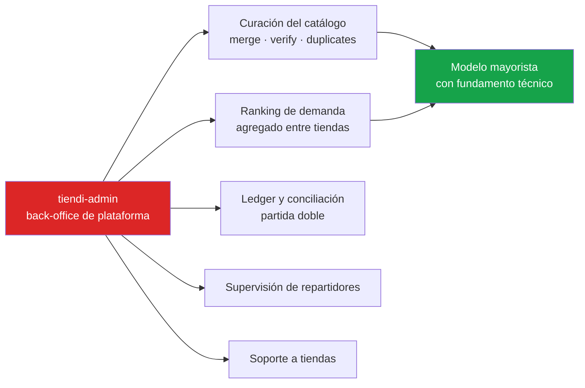
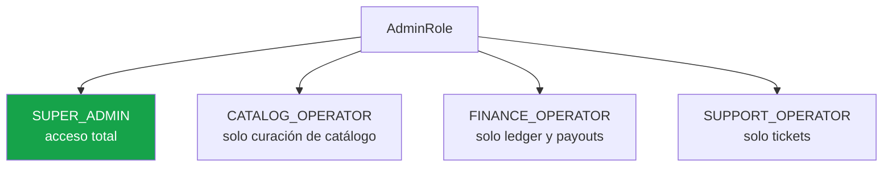
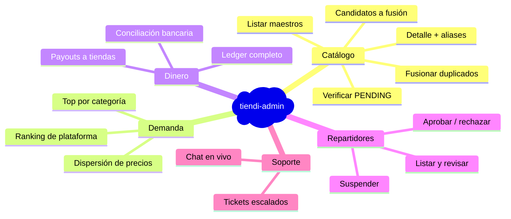
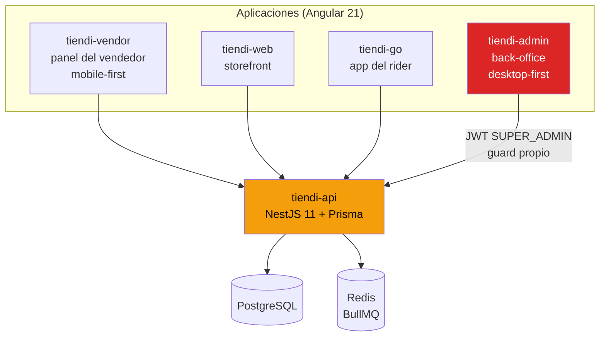
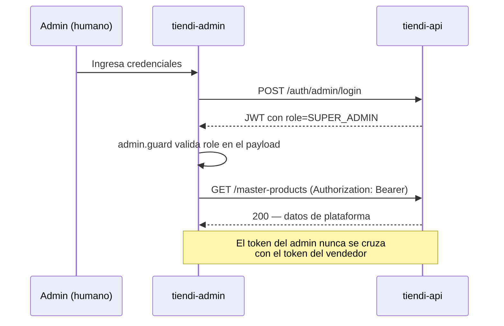
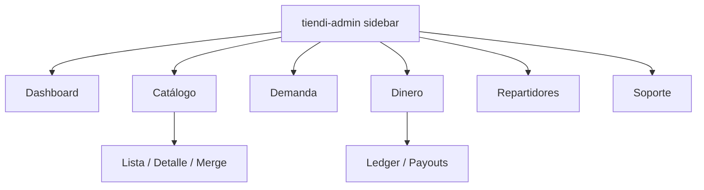
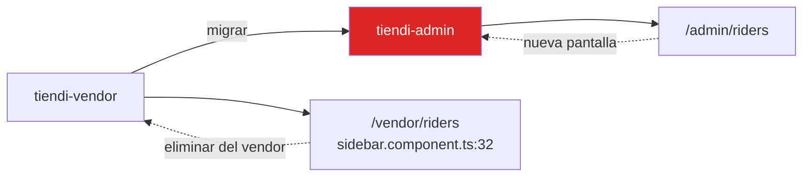
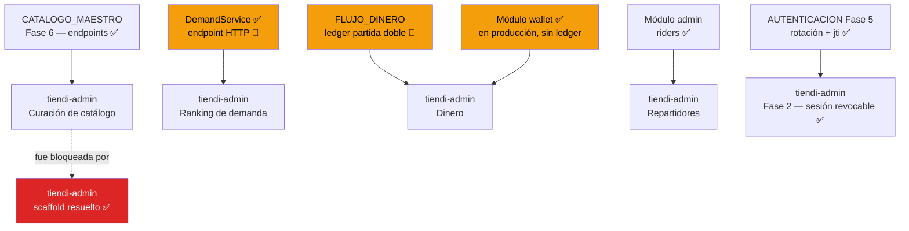
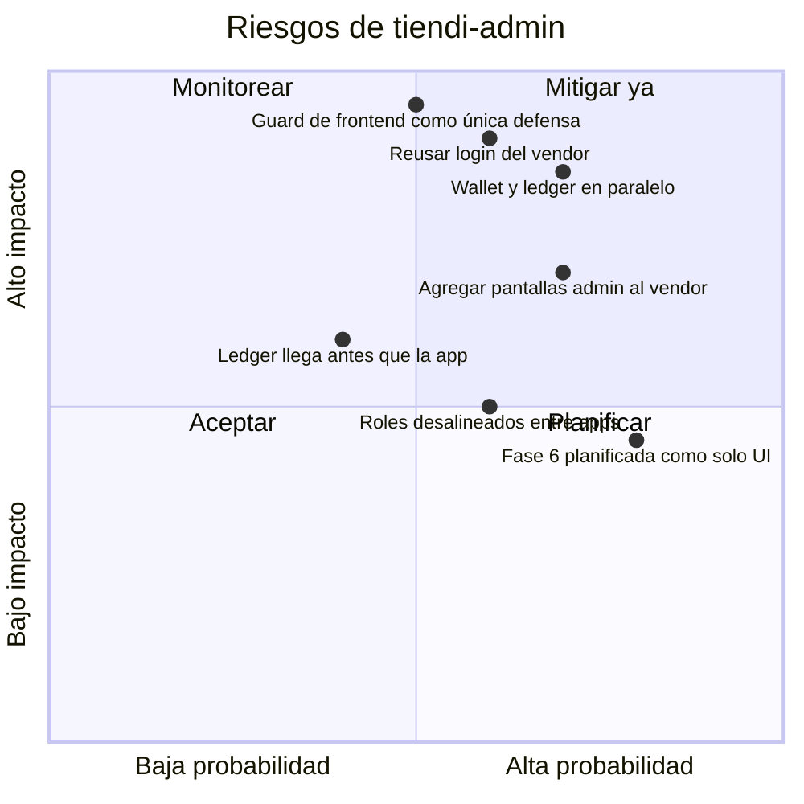
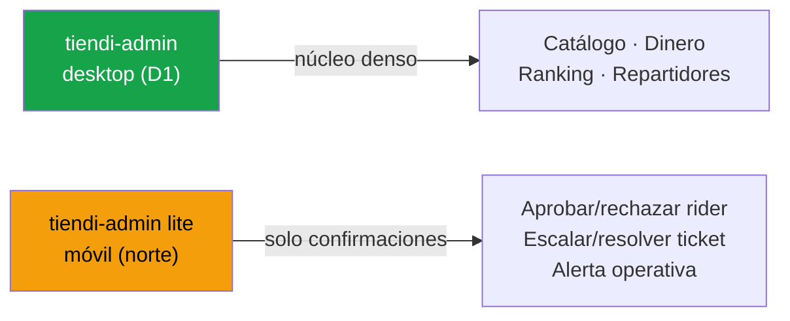

---
tags:
  - tiendi
  - tiendi-admin
  - backoffice
  - arquitectura
  - aplicaciones
  - super-admin
aliases:
  - Tiendi Admin
  - Back-office Tiendi
  - Panel de Administración de la Plataforma
  - App back-office
related:
  - "[[AUTENTICACION]]"
  - "[[REVOCACION_SESION]]"
---

# Tiendi Admin — Back-office de la plataforma

Este documento define `tiendi-admin`, la aplicación de back-office de Tiendi para el equipo de operación de la plataforma (Super Admin). Es la pieza que hoy **no existe** y que bloquea la Fase 6 de [[CATALOGO_MAESTRO]] y la Fase 4 de [[FACTURACION_Y_CONTABILIDAD]].

> [!IMPORTANT]
> Este documento complementa a [[FACTURACION_Y_CONTABILIDAD]] (que define **dónde vive cada pantalla** de dinero y quién la ve) y a [[CATALOGO_MAESTRO]] (que define la **identidad de producto** que acá se cura). Acá se define **qué es la app, con qué stack y cómo se construye**.

> [!NOTE]
> Parte de lo descrito es **estado objetivo**. Lo ya implementado está marcado con ✅ y lo pendiente con 🔲 en [§8 Estado actual vs objetivo](#8-estado-actual-vs-objetivo).

---

## Índice

1. [Objetivo y frontera](#1-objetivo-y-frontera)
2. [Decisiones de diseño ya tomadas](#2-decisiones-de-diseño-ya-tomadas)
3. [Roles y permisos](#3-roles-y-permisos)
4. [Alcance funcional](#4-alcance-funcional)
5. [Stack tecnológico](#5-stack-tecnológico)
6. [Arquitectura](#6-arquitectura)
7. [Autenticación y seguridad](#7-autenticación-y-seguridad)
8. [Estado actual vs objetivo](#8-estado-actual-vs-objetivo)
9. [Pantallas y rutas](#9-pantallas-y-rutas)
10. [Migraciones desde `tiendi-vendor`](#10-migraciones-desde-tiendi-vendor)
11. [Dependencias cruzadas](#11-dependencias-cruzadas)
12. [Riesgos](#12-riesgos)
13. [Checklist de seguimiento](#13-checklist-de-seguimiento)
14. [Norte de diseño — capa de aprobaciones móviles (lite)](#14-norte-de-diseño--capa-de-aprobaciones-móviles-lite)

---

## 1. Objetivo y frontera

### 1.1 Qué es

`tiendi-admin` es la aplicación web de **escritorio** donde el equipo de Tiendi (Super Admin) opera la plataforma: concilia dinero, cura el catálogo maestro, supervisa repartidores y atiende el soporte de tiendas.

### 1.2 La regla de la frontera

> [!IMPORTANT]
> **El vendedor ve su propio negocio, nunca el de la plataforma. El Super Admin ve la plataforma entera.**

Toda duda sobre dónde va una pantalla se resuelve con la pregunta de [[FACTURACION_Y_CONTABILIDAD]]:

- Responde *"¿cuánto tengo yo?"* → `tiendi-vendor`
- Responde *"¿cuánto tiene Tiendi?"* → `tiendi-admin`

### 1.3 Qué habilita



### 1.4 Alcance

| Incluye | No incluye |
|---------|------------|
| Curación del catálogo maestro | Alta/edición de productos de tienda (es del vendedor) |
| Ranking de demanda de plataforma | Analytics por tienda (es del vendedor) |
| Ledger completo, conciliación, payouts | Estado de cuenta del vendedor (es del vendedor) |
| Supervisión de repartidores | Onboarding del repartidor (es del rider) |
| Soporte escalado a tiendas | Chat comprador-vendedor (es de tiendi-web) |

---

## 2. Decisiones de diseño ya tomadas

Estas decisiones fueron acordadas antes de redactar este documento y son la base de todo lo que sigue.

| # | Decisión | Elección | Razón |
|---|----------|----------|-------|
| **D1** | ¿Mobile-first o desktop-first? | **Desktop-first** | Tareas densas de escritorio: tablas anchas, conciliación, comparar duplicados lado a lado |
| **D2** | ¿App nueva o módulo dentro de `tiendi-vendor`? | **App Angular nueva e independiente** | Compartir bundle con el tenant es el anti-patrón de `/vendor/riders` |
| **D3** | ¿Backend nuevo o reusar `tiendi-api`? | **Reusar `tiendi-api`** | Ya tiene `Role.SUPER_ADMIN`, módulo `admin` y endpoints de catálogo |
| **D4** | ¿Stack del frontend? | **Espejo de `tiendi-vendor`** | No introducir tecnología nueva; el equipo ya lo domina |
| **D5** | ¿Autenticación? | **Login propio de Super Admin** | Nunca reusar el token del vendedor |

> [!NOTE]
> D1 y D2 son decisiones de arquitectura que definen el contorno de la app. D3, D4 y D5 son de implementación. Todas son revisables, pero cambiarlas después de arrancar tiene costo alto.

> [!WARNING]
> **La numeración D1–D5 es local a este documento.** [[MODELO_NEGOCIO]] tiene su propia D5 (política de uso de datos de venta, §9.4) que no tiene relación con la D5 de acá (autenticación); esa fue **resuelta el 2026-08-25** (agregados con k ≥ 3, nunca individualizados). Al citar una decisión entre documentos, nombrar siempre el documento de origen.

---

## 3. Roles y permisos

### 3.1 El único rol de esta app

`tiendi-admin` es para **`SUPER_ADMIN`** exclusivamente. No hay tenants, no hay sub-roles de tienda.

> [!WARNING]
> ~~**No replicar el error de los roles desalineados.**~~
> **Resuelto por la Fase 1 de [[AUTENTICACION]]**: el vendor ya no define su propio enum inflado; `user.types.ts` re-exporta el `Role` compartido de `@kanoso/auth-types` (5 valores, alineado al backend) con `StoreRole` como dimensión separada.
>
> Estado actual:
>
> | Fuente | Roles |
> |--------|-------|
> | `tiendi-api/prisma/schema.prisma` | `SUPER_ADMIN`, `STORE_OWNER`, `EMPLOYEE`, `CUSTOMER`, `RIDER` |
> | `@kanoso/auth-types` | Idéntico al backend (fuente única compartida) |
>
> `tiendi-admin` deriva su `AdminRole = Extract<Role, 'SUPER_ADMIN'>` del paquete compartido (decisión **A5**), no lo redefine.

### 3.2 Futuro: operadores con alcance parcial

Si más adelante se necesitan operadores que solo vean catálogo o solo tesorería, se agrega un enum propio:



> [!NOTE]
> No implementar C/D/E todavía. Es un espacio de diseño reservado para no pintarse en una esquina. Hoy el único rol es `SUPER_ADMIN`.

---

## 4. Alcance funcional

### 4.1 Módulos



### 4.2 Mapa de pantallas por módulo

| Módulo | Pantalla | Estado |
|--------|----------|--------|
| Catálogo | Lista de maestros (filtros por `status`, `brand`, búsqueda) | 🔲 |
| Catálogo | Detalle de maestro (productos vinculados + aliases) | 🔲 |
| Catálogo | Fusión de duplicados (comparar lado a lado) | 🔲 |
| Demanda | Ranking de plataforma | 🔲 |
| Dinero | Ledger completo y conciliación | 🔲 |
| Dinero | Payouts / liquidaciones | 🔲 |
| Repartidores | Revisión de repartidores | 🔲 |
| Soporte | Tickets escalados | 🔲 |

> [!NOTE]
> Los **endpoints** de catálogo y repartidores ya existen en el backend (Fase 6 de [[CATALOGO_MAESTRO]] y módulo `admin`). Lo que falta es la interfaz.
> El de **demanda no existe**: `DemandService.getPlatformDemand()` está implementado pero ningún controller lo expone (§5.3).
> Los endpoints de **dinero no existen** y dependen del ledger de [[FLUJO_DINERO]]. Ojo: el módulo `wallet` ya mueve dinero hoy sin ledger (§13, Fase 7).

---

## 5. Stack tecnológico

### 5.1 Frontend — espejo de `tiendi-vendor`

| Capa | Tecnología | Justificación |
|------|------------|---------------|
| Framework | **Angular 21** (standalone, signals) | Idéntico a `tiendi-vendor` |
| Estado | **NgRx Signals** | Mismo patrón de stores |
| UI | **PrimeNG 21** | `Table` server-side (paginación/orden) es el caballo de batalla del back-office |
| Estilos | **Tailwind CSS 4** + PrimeUI themes | Layout desktop y consistencia |
| Charts | **Chart.js + ng2-charts** | Ranking y conciliación |
| Testing | **Vitest** (unit) + **Playwright** (e2e) | Igual que el vendor |
| Observabilidad | **Sentry** | Errores del back-office |
| Tooling | ESLint + Prettier + Husky + lint-staged | Mismas reglas del repo |

### 5.2 Excluidos a propósito

| Librería | Motivo de exclusión |
|----------|---------------------|
| `posthog-js` | Analytics de producto para usuarios externos, no para el propio back-office |
| `@zxing/browser` | No se escanean códigos de barras en el admin |
| `socket.io-client` | Solo si se implementa chat en vivo de soporte (Fase 9); no es parte del núcleo |

### 5.3 Backend — reusar `tiendi-api`

No se crea un backend nuevo. Se consume `tiendi-api`, que ya tiene:

- `enum Role` con `SUPER_ADMIN` (`prisma/schema.prisma:14`)
- Módulo `admin` (backend, sin frontend): `src/modules/admin/admin.controller.ts` — solo repartidores y escalado de tickets
- Endpoints de catálogo con guard `SUPER_ADMIN`: `src/modules/master-catalog/master-products.controller.ts` (Fase 6 de [[CATALOGO_MAESTRO]])
- `DemandService` (`src/modules/master-catalog/demand.service.ts:46`) — **método de servicio, sin endpoint HTTP**: su único consumidor es el job `demand-rollup.processor.ts` de BullMQ

Lo que se agrega a `tiendi-api` cuando corresponda:

- Un endpoint HTTP que exponga `DemandService.getPlatformDemand()` (hoy no existe)
- Endpoints de ledger cuando [[FLUJO_DINERO]] se implemente
- Lo necesario para soporte en vivo (ya hay `socket.io`)

---

## 6. Arquitectura

### 6.1 Diagrama de contexto



### 6.2 Módulos de la app

```
tiendi-admin/src/app/admin/
├── core/
│   ├── auth/
│   │   ├── auth.store.ts          # NgRx Signals: token, adminRole
│   │   └── admin.guard.ts         # Guard funcional: solo SUPER_ADMIN
│   ├── services/
│   │   └── api.client.ts          # HTTP con interceptor de token
│   ├── types/
│   │   ├── admin-role.ts          # enum AdminRole propio (D5 / §3)
│   │   └── master-product.types.ts
│   └── layout/
│       ├── shell.component.ts     # Sidebar + topbar + outlet
│       └── sidebar.component.ts   # Nav específica del admin
├── features/
│   ├── catalog/
│   │   ├── catalog.store.ts
│   │   ├── master-list.page.ts
│   │   ├── master-detail.page.ts
│   │   └── merge.page.ts
│   ├── demand/
│   │   ├── demand.store.ts
│   │   └── platform-ranking.page.ts
│   ├── finance/
│   │   ├── ledger.page.ts
│   │   └── payouts.page.ts
│   ├── riders/
│   │   ├── riders.store.ts
│   │   └── riders.page.ts
│   └── support/
│       ├── support.store.ts
│       └── tickets.page.ts
└── app.routes.ts                  # Lazy-loaded por feature
```

### 6.3 Flujo de autenticación



> [!CAUTION]
> **El endpoint de login del admin es distinto del login del vendedor.**
> No se reusa `POST /auth/login` del tenant. Se crea un `POST /auth/admin/login` que solo acepta `SUPER_ADMIN` y emite un token con el claim correspondiente. Reusar el login del vendedor abriría la puerta a que un token de tienda acceda a endpoints admin si algún guard falla.

---

## 7. Autenticación y seguridad

| Control | Dónde | Detalle |
|---------|-------|---------|
| Guard de rol | Backend | `@Roles(Role.SUPER_ADMIN)` + `RolesGuard` en cada controlador admin |
| Guard de ruta | Frontend | `admin.guard.ts` valida el claim del JWT antes de renderizar |
| Login separado | Backend | `POST /auth/admin/login`, sin compartir ruta ni token con el tenant |
| Alcance del dato | Backend | Endpoints admin devuelven datos **de todas las tiendas**; nunca filtrar por `storeId` de sesión |

> [!WARNING]
> **Defensa en profundidad.** El guard del backend es la única barrera real de seguridad. El guard del frontend solo evita renderizar pantallas que el usuario no debería ver; no protege datos. Nunca se confía en el guard del frontend para autorización.

---

## 8. Estado actual vs objetivo

| Componente | Estado | Ubicación |
|------------|--------|-----------|
| Módulo `admin` (backend) | ✅ Existe, sin frontend | `tiendi-api/src/modules/admin/` |
| Endpoints de catálogo (Fase 6) | ✅ Existe, con guard `SUPER_ADMIN` | `tiendi-api/src/modules/master-catalog/` |
| Endpoints de repartidores admin | ✅ Existe | `GET/PATCH /admin/riders/*` |
| App `tiendi-admin` | ✅ Scaffold pusheado | `kanoso/tiendi-admin` (submódulo), commit `d928f24`, 43 `.ts` en `src/` |
| Auth de Super Admin separada | ✅ Existe, **sesión revocable** (Fase 5 de [[AUTENTICACION]]) | `core/auth/auth.store.ts` + `admin.guard.ts` |
| Pantalla de curación de catálogo | 🔲 No existe | — |
| `DemandService.getPlatformDemand()` | ✅ Existe, **sin endpoint HTTP** | `tiendi-api/src/modules/master-catalog/demand.service.ts:46` |
| Endpoint HTTP de demanda | 🔲 No existe | Único consumidor actual: `demand-rollup.processor.ts` (BullMQ) |
| Ranking de demanda (UI) | 🔲 No existe | — |
| Ledger y conciliación (UI + API) | 🔲 Solo diseñado | [[FLUJO_DINERO]] |
| `/vendor/riders` migrado | 🔲 Pendiente | `tiendi-vendor/src/app/vendor/shared/layout/sidebar.component.ts:32` |

---

## 9. Pantallas y rutas

### 9.1 Tabla de rutas

| Ruta | Módulo | Pantalla | Dependencia |
|------|--------|----------|-------------|
| `/admin/login` | auth | Login de Super Admin | — |
| `/admin/catalog` | catalog | Lista de maestros | Fase 6 catálogo (✅ backend) |
| `/admin/catalog/:id` | catalog | Detalle, corrección manual + aliases | Fase 6 catálogo (✅ backend) |
| `/admin/catalog/merge` | catalog | Fusión de duplicados | Fase 6 catálogo (✅ backend) |
| `/admin/demand` | demand | Ranking de plataforma | `DemandService` existe, **falta el endpoint HTTP** (🔲) |
| `/admin/finance/ledger` | finance | Ledger y conciliación | [[FLUJO_DINERO]] (🔲) |
| `/admin/finance/payouts` | finance | Payouts | [[FLUJO_DINERO]] (🔲) |
| `/admin/riders` | riders | Supervisión de repartidores | Módulo `admin` (✅ backend) |
| `/admin/support` | support | Tickets escalados | Módulo `support` (✅ backend) |

### 9.2 Navegación (sidebar del admin)



> [!NOTE]
> La sidebar del admin **no comparte** `NavItem[]` con `tiendi-vendor`. Son dos superficies con permisos y rutas distintos. Compartirlas reintroduce el acoplamiento que D2 elimina.

---

## 10. Migraciones desde `tiendi-vendor`

### 10.1 Qué sale del vendor



| Ítem | Hoy en `tiendi-vendor` | Destino en `tiendi-admin` |
|------|------------------------|---------------------------|
| Pantalla de repartidores | `/vendor/riders` (`src/app/vendor/shared/layout/sidebar.component.ts:32`, `roles: ['SUPER_ADMIN']`) | `/admin/riders` |

> [!CAUTION]
> **`/vendor/riders` es el anti-patrón documentado.** Funcionalidad de plataforma dentro de la app del inquilino, protegida solo por un flag de rol en un array. Si hoy es repartidores, mañana puede ser tesorería. Debe migrar al back-office antes de agregar más pantallas admin al vendor.

### 10.2 Orden de migración

1. Crear la pantalla `/admin/riders` en `tiendi-admin` (consume el backend que ya existe).
2. Eliminar `/vendor/riders` y su entrada en la sidebar del vendor.
3. Dejar una redirección temporal solo si es estrictamente necesario.

---

## 11. Dependencias cruzadas



> [!IMPORTANT]
> **Dependencias explícitas:**
> - La curación de catálogo (Fase 6 de [[CATALOGO_MAESTRO]]) **depende de que exista `tiendi-admin`**. Sus endpoints están listos; solo falta la interfaz.
> - El ranking de demanda **depende de un endpoint que todavía no existe**. El cálculo (`DemandService`) está implementado, pero sin superficie HTTP no hay nada que consumir (§5.3).
> - El módulo de Dinero **depende del ledger** de [[FLUJO_DINERO]], que aún no está implementado, y de resolver su relación con el módulo `wallet`, que ya está en producción moviendo dinero.
> - La migración de repartidores **solo depende de `tiendi-admin`**, porque el backend ya existe.
> - ~~La Fase 2 (autenticación) depende de la Fase 5 de [[AUTENTICACION]]~~ — **dependencia resuelta**: la Fase 5 está implementada (rotación + `jti` + reuse-detection + kill switch), así que la sesión de `SUPER_ADMIN` es revocable.

---

## 12. Riesgos



| Riesgo | Impacto | Mitigación |
|--------|---------|------------|
| Reusar login del vendedor para el admin | Token de tienda accede a endpoints admin | Login propio `POST /auth/admin/login` (§7) |
| Guard de frontend como única defensa | Datos de plataforma expuestos | Guard `SUPER_ADMIN` en el backend es la barrera real (§7) |
| Agregar pantallas admin al vendor | Reaparece el anti-patrón de `/vendor/riders` | D2: app independiente; nunca compilar pantallas admin en el vendor |
| Roles desalineados entre apps | Confusión de permisos | **Resuelto**: `AdminRole` deriva del `Role` compartido de `@kanoso/auth-types` (A5, §3) |
| `Wallet` y ledger como fuentes paralelas de verdad | Descuadres que el invariante `SUM(asientos) == 0` no detecta | **Decidido**: wallet es proyección del ledger ([[FLUJO_DINERO]] P1); queda implementar la migración según su plan (Fase 7) |
| Ranking de demanda apoyado en una decisión abierta | ~~Retrabajo o exposición legal~~ | **Riesgo cerrado**: D5 de [[MODELO_NEGOCIO]] resuelta (agregados con k ≥ 3, nunca individualizados); el k-anonimato (`minStores`) es ahora la política materializada en código |
| Planificar la Fase 6 como si fuera solo interfaz | La fase se bloquea apenas arranca | El endpoint de demanda no existe: la fase incluye trabajo de backend (§13) |

---

## 13. Checklist de seguimiento

> [!TIP]
> Cada fase es desplegable de forma independiente. La Fase 4 (migrar repartidores) es la primera que entrega valor visible y de bajo riesgo, porque el backend ya está listo.

### Fase 0 — Decisiones previas

- [x] Definir desktop-first vs mobile-first (**D1**: desktop-first)
- [x] Definir app nueva vs módulo en el vendor (**D2**: app nueva e independiente)
- [x] Definir backend nuevo vs reusar `tiendi-api` (**D3**: reusar `tiendi-api`)
- [x] Definir stack del frontend (**D4**: espejo de `tiendi-vendor`)
- [x] Definir modelo de autenticación (**D5**: login propio de Super Admin)

### Fase 1 — Scaffold de la app

- [x] Crear `tiendi-admin` con Angular CLI (standalone, signals)
- [x] Instalar dependencias: Tailwind 4, NgRx Signals, Sentry (PrimeNG y Chart.js/ng2-charts descartados por no usarse — ver nota Fase 3)
- [x] Configurar ESLint + Prettier + Husky + lint-staged (copiar config del vendor)
- [x] Configurar puerto propio (ej. `4202`) y `angular.json`
- [x] Configurar Vitest y Playwright
- [x] Verificar que la app compila y los tests base corren

### Fase 2 — Autenticación independiente

> [!WARNING]
> **Histórico — resuelto el 2026-08-25.** Los checks de abajo significaban "el login funciona", no "la sesión es revocable". El JWT era stateless y un refresh token robado vivía **30 días** aunque se cambiara la contraseña.
>
> La **Fase 5 de [[AUTENTICACION]]** ya está implementada y despliega exactamente lo que A4 exigía: rotación de refresh tokens con reuse-detection, persistencia hasheada por `jti`, cutoff de revocación y kill switch por usuario (`POST /admin/users/:userId/revoke-sessions`). Una sesión de `SUPER_ADMIN` comprometida hoy se mata al instante desde el back-office. Además, el logout del admin envía su refresh token para revocación por dispositivo.

- [x] Backend: `POST /auth/admin/login` que solo acepta `SUPER_ADMIN`
- [x] Backend: emitir JWT con claim de rol `SUPER_ADMIN`
- [x] Frontend: `AdminRole` propio (`admin-role.ts`), sin importar tipos del vendor — **hecho, pero superado por la decisión A5**
- [x] Frontend: migrar `AdminRole` al `Role` unificado — **hecho** con la Fase 3 de [[AUTENTICACION]]: `AdminRole = Extract<Role, 'SUPER_ADMIN'>` derivado de `@kanoso/auth-types` y la copia local de `ApiAuthResponse` eliminada (`auth.types.ts` re-exporta la del paquete)
- [x] Frontend: `auth.store.ts` con NgRx Signals (token + rol)
- [x] Frontend: `admin.guard.ts` que valida el claim antes de renderizar
- [x] Test: un token de vendedor es rechazado por `admin.guard`
- [x] Test: `POST /auth/admin/login` rechaza credenciales que no sean `SUPER_ADMIN`

### Fase 3 — Shell y navegación

- [x] `shell.component.ts` con sidebar + topbar + router outlet
- [x] `sidebar.component.ts` específica del admin (sin compartir `NavItem[]` con el vendor)
- [x] Rutas lazy-loaded por feature en `app.routes.ts`
- [x] Tema coherente con el vendor: Tailwind 4 + CSS propio. PrimeNG se descartó (el vendor lo declara pero no lo usa; la UI usa componentes CSS propios)
- [x] Layout desktop-first (sidebar colapsable, tablas anchas)

### Fase 4 — Repartidores (migración desde el vendor)

- [x] Pantalla `/admin/riders` que consume `GET /admin/riders`
- [x] Detalle de repartidor (`GET /admin/riders/:riderId`)
- [x] Cambio de estado (`PATCH /admin/riders/:riderId/status`)
- [x] Eliminar `/vendor/riders` de `tiendi-vendor`
- [x] Eliminar la entrada `Repartidores` de `src/app/vendor/shared/layout/sidebar.component.ts:32`
- [x] Test e2e: el flujo de revisión de repartidor funciona en el admin — `tiendi-admin/e2e/riders-review.spec.ts` (Playwright con API mockeada vía `page.route`; lista → detalle → aprobar verifica el PATCH `{status:'APPROVED'}` + expulsión de no-SUPER_ADMIN). Encontró y corrigió un bug de copy en el toast

### Fase 5 — Curación del catálogo

- [x] Pantalla `/admin/catalog` con `GET /master-products` (filtros por `status`, `brand`, búsqueda)
- [x] Pantalla `/admin/catalog/:id` con productos vinculados y aliases
- [x] Pantalla `/admin/catalog/merge` que consume `GET /master-products/duplicates`
- [x] Acción de corrección manual (`PATCH /master-products/:id`) dentro del detalle: `name`, `brand`, `netContent`, `uom`, `imageUrl`, `categoryId`
- [x] Acción de verificación (`POST /master-products/:id/verify`)
- [x] Acción de fusión (`POST /master-products/merge`) con comparación lado a lado
- [x] Test e2e: fusionar dos duplicados no altera el `OrderItem` (snapshot intacto) — cubierto a nivel servicio: `master-catalog.service.spec.ts` ("no modifica ningún OrderItem"); la invariante vive en `merge()`, no en la UI
- [x] Test: el formulario de corrección no expone `gtin` ni `matchKey` — `master-detail.page.spec.ts` (payload ⊆ campos editables)
- [x] Test: enviar el formulario sin cambios no dispara request — mismo spec (`buildPayload()` devuelve null → toast info)

### Fase 6 — Ranking de demanda

> [!WARNING]
> **Esta fase no es solo de interfaz.** `DemandService.getPlatformDemand()` existe (`demand.service.ts:46`), pero es un método de servicio interno: su único consumidor es el job `demand-rollup.processor.ts` de BullMQ. Ningún controller lo expone, así que el frontend no tiene qué consumir hasta que se cree el endpoint.

- [x] Backend: exponer `GET /admin/demand` con `@Roles(Role.SUPER_ADMIN)` sobre `DemandService.getPlatformDemand()`
- [x] Backend: parametrizar rango de fechas, `limit` y `minStores` (k-anonimato) desde el endpoint
- [x] Backend: documentar el endpoint en Swagger
- [x] Pantalla `/admin/demand` con el ranking de plataforma
- [x] `demand.store.ts` consumiendo el endpoint nuevo
- [x] Visualizar `storeCount`, `unitsSold`, `grossRevenue`, `avgUnitPrice`
- [x] Test: el ranking respeta el k-anonimato (`minStores`) — `demand.service.spec.ts`: default 3, propagación del parámetro custom y `HAVING COUNT(DISTINCT storeId)` presente en la consulta

### Fase 7 — Ledger y conciliación

> [!CAUTION]
> **No se arranca de cero.** El módulo `wallet` ya está en producción moviendo dinero: `GET /wallet/me`, `GET /wallet/me/transactions`, `POST /wallet/me/withdraw`, `POST /wallet/me/cash-deposit`. Además tiene dos brechas activas documentadas en [[FLUJO_DINERO]] §9: `pending` solo recibe sumas (nunca pasa a `balance`) y `cashBlocked` nunca vuelve a `false`.
>
> ~~Antes de escribir el primer asiento hay que decidir si `Wallet`/`Transaction` pasa a ser proyección del ledger o si conviven.~~ **Decidido en [[FLUJO_DINERO]] (Principio P1): el ledger es la única fuente de verdad; los saldos son proyecciones derivadas.** La migración del modelo ya está especificada ahí (§ migraciones: quitar `riderId @unique` → `ownerType`+`ownerId`; saldos como campos derivados; invariantes I1/I2 con job de conciliación).

- [x] Decidir la relación entre `Wallet`/`Transaction` y el ledger — **proyección** ([[FLUJO_DINERO]] P1); la coexistencia quedó descartada por el riesgo de descuadre estructural
- [x] Plan de migración del histórico de `Transaction` a asientos — documentado en [[FLUJO_DINERO]] Fase 7 (F7.1–F7.6, resuelto 2026-08-26)
- [x] Implementar el ledger de partida doble de [[FLUJO_DINERO]] — módulo `ledger` con EntryGroups, idempotencia por key e invariantes I1/I2 (Fases 1/3/6); migración de wallets = Fase 7 (pendiente)
- [x] Endpoints de ledger en `tiendi-api` — `GET /stores/:storeId/account-statement` y `POST /admin/ledger/run-daily-checks`
- [ ] Pantalla `/admin/finance/ledger` con conciliación contra extracto de Culqi
- [ ] Pantalla `/admin/finance/payouts` — el API ya expone `GET /stores/:storeId/payouts`
- [x] Test: `SUM(asientos) == 0` como invariante — `ledger.service.spec.ts`: invariante I1 por grupo y suma global
- [ ] Test: el saldo de `Wallet` coincide con el saldo derivado del ledger — invariante I8, planificado como [[FLUJO_DINERO]] F7.4

> [!NOTE]
> Los ítems abiertos de esta fase **no se implementan desde tiendi-admin**: son el plan de [[FLUJO_DINERO]]. Este documento los lista solo como frontera de consumo: cuando existan endpoints de ledger, acá van las pantallas.

### Fase 8 — Soporte

- [x] Pantalla `/admin/support` con tickets escalados (`POST /admin/tickets/:ticketId/escalate` ya existe)
- [x] Chat en vivo — **decisión: deferido**. No se habilita `socket.io` en el admin por ahora; el canal `AdminNotifier` sigue siendo un stub y sin push real no hay gatillo de tiempo real (§14). Reevaluar cuando [[NOTIFICACIONES]] resuelva el canal admin — habilitarlo después es barato porque la plataforma ya corre socket.io para el chat comprador-vendedor

### Fase 9 — Observabilidad y cierre

- [x] Sentry configurado y reportando errores del admin
- [x] Documentar los endpoints nuevos en el Swagger de `tiendi-api`
- [x] Actualizar [[FACTURACION_Y_CONTABILIDAD]] §8 marcando `tiendi-admin` como ✅
- [x] Actualizar [[CATALOGO_MAESTRO]] Fase 6 marcando el panel admin como resuelto
- [x] Registrar en Engram la decisión D1–D5

### Criterios de aceptación

- [x] Un token de vendedor no puede acceder a ninguna pantalla del admin
- [x] `/vendor/riders` ya no existe en `tiendi-vendor`
- [x] Fusionar dos duplicados de catálogo no altera ningún reporte histórico
- [x] El ranking de plataforma muestra datos reales, no un array vacío
- [ ] El ledger concilia contra el extracto de Culqi y es auditable línea por línea
- [x] Ninguna pantalla del admin se compila dentro del bundle del vendor

---

## 14. Norte de diseño — capa de aprobaciones móviles (lite)

> [!NOTE]
> Esta sección es un **norte de diseño**, no un plan de construcción. Reserva el espacio para que, cuando el back-office esté maduro, exista una capa móvil de confirmaciones. No se construye ahora.

### 14.1 Qué es

Una versión **lite** de `tiendi-admin` accesible desde el celular, limitada a **confirmaciones de "tap"**: acciones delgadas, de bajo contenido, sensibles al tiempo. No es el back-office completo.



| Acción | Naturaleza | ¿Justifica móvil? |
|--------|------------|-------------------|
| Aprobar/rechazar repartidor (`UNDER_REVIEW` → `APPROVED`/`REJECTED`) | Revisar documento + tap | Sí |
| Suspender repartidor | Tap urgente | Sí |
| Escalar ticket (`POST /admin/tickets/:id/escalate`) | Tap (P0/P1 = 15 min) | Sí |
| Resolver ticket | Tap | Sí |
| Alerta "delivery sin rider" | Reaccionar | Sí |
| Fusionar/verificar maestros del catálogo | Comparar lado a lado | **No** |
| Ledger y conciliación | Densidad de escritorio | **No** |

### 14.2 La dependencia que lo bloquea

> [!CAUTION]
> **El lite no tiene gatillo sin push.**
> Hoy el canal de notificación al Super Admin es un stub que solo loguea:
>
> ```typescript
> // tiendi-api/src/modules/support/admin-notifier.service.ts
> async alertNewTicket(...) { this.logger.warn(`[ADMIN ALERT] ...`); } // ← STUB
> ```
>
> Sin push/email real al admin, el celular no recibe nada que justifique abrir la app. El lite depende de resolver este stub primero (ver [[NOTIFICACIONES]] §9).

### 14.3 Orden lógico

1. Cablear `AdminNotifier` (push al Super Admin) — sin esto no hay gatillo.
2. Recién después, la capa lite de confirmaciones (riders + soporte).

> [!NOTE]
> El lite **no contradice** D1 (desktop-first). El escritorio sigue siendo la casa de las operaciones densas; el lite es mejora progresiva para los flujos de "tap" urgente, análogo al escáner de código de barras del vendor.

---

## Referencias

- [[AUTENTICACION]] — deuda de autenticación duplicada en las cuatro apps. Su **Fase 0** (repo de `tiendi-admin` en control de versiones + distribución de paquetes) y su **decisión A5** (destino de `AdminRole`) impactan directo en la Fase 2 de este documento
- [[CATALOGO_MAESTRO]] — identidad de producto y Fase 6 (endpoints de curación)
- [[FACTURACION_Y_CONTABILIDAD]] — frontera por aplicación y Fase 4 (back-office)
- [[FLUJO_DINERO]] — ledger de partida doble y liquidaciones
- [[MODELO_NEGOCIO]] — modelo mayorista y su decisión **D5 sobre uso de datos de venta** (§9.4, resuelta: agregados con k ≥ 3). No confundir con la D5 de este documento, que es de autenticación
- [[MODULOS_SISTEMA_TIENDI]] — roles y dashboard de administración (conceptual)
- [[NOTIFICACIONES]] — sistema de notificaciones unificado (incluye el canal admin que habilita el lite)
- [[REVOCACION_SESION]] — mitigación de revocación de sesión (cutoff `auth:revoked_before:{userId}` en Redis). Su mitigación fue absorbida por la **Fase 5 de [[AUTENTICACION]]** (rotación + reuse-detection + kill switch), ya implementada

### Archivos afectados (estado objetivo)

| Repositorio | Archivo | Cambio |
|-------------|---------|--------|
| `tiendi-admin` | `**` | App nueva |
| `tiendi-api` | `src/modules/auth/**` | `POST /auth/admin/login` |
| `tiendi-api` | `src/modules/admin/**` | Ampliar según necesidad |
| `tiendi-api` | `src/modules/master-catalog/**` | Exponer `GET /admin/demand` sobre `DemandService` |
| `tiendi-api` | `src/modules/wallet/**` | Definir su relación con el ledger (Fase 7) |
| `tiendi-vendor` | `src/app/vendor/shared/layout/sidebar.component.ts:32` | Eliminar `/vendor/riders` |
| `tiendi-vendor` | `src/app/vendor/features/riders/**` | Migrar al admin |
