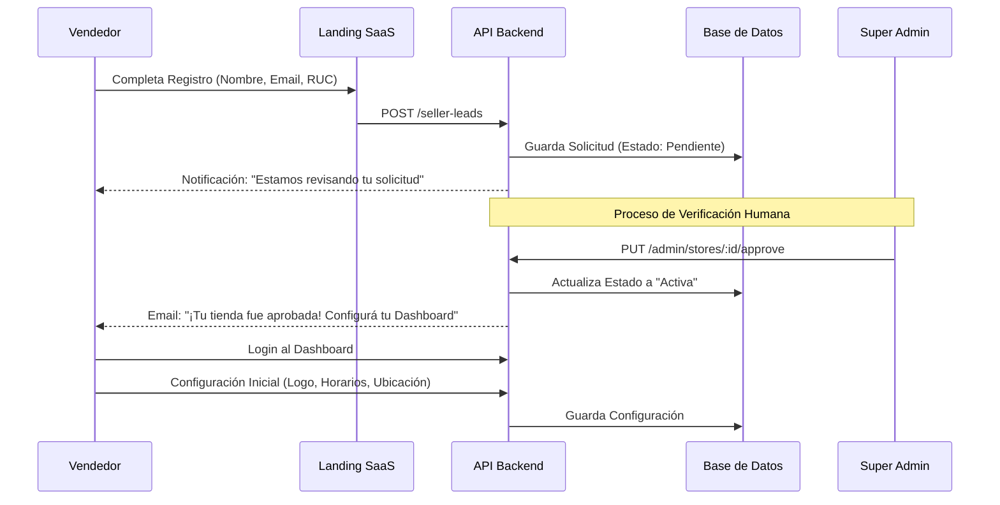
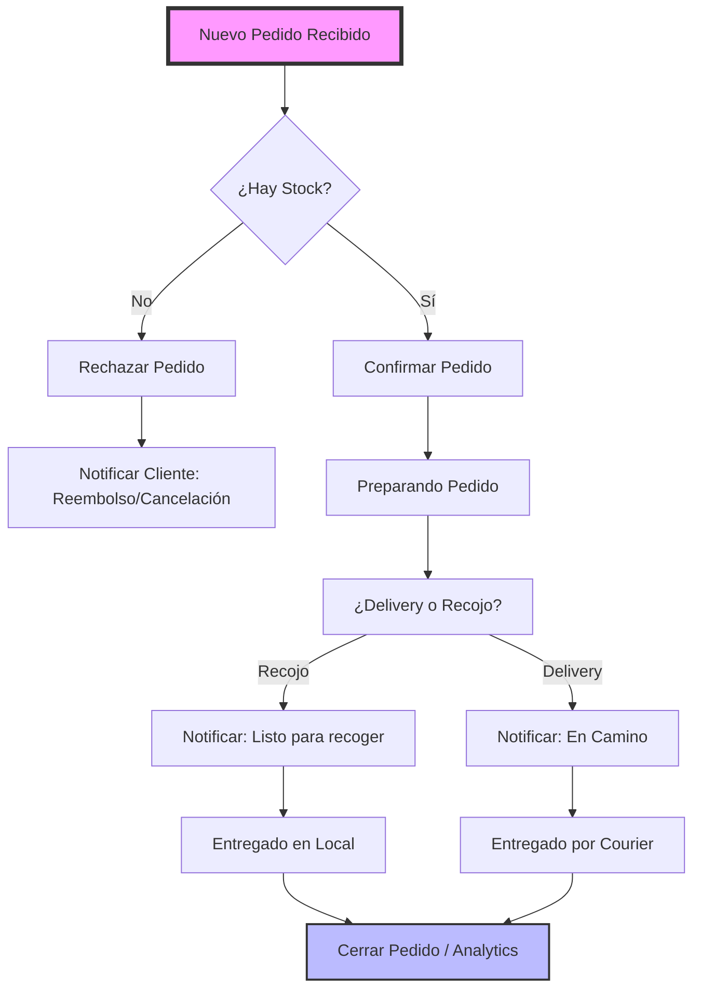
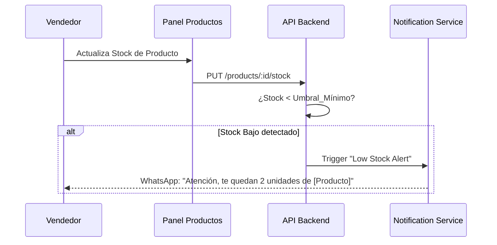
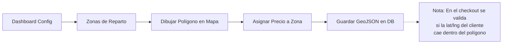

> [!CAUTION]
> # ⚠️ DOCUMENTO ARCHIVADO — 2026-04-16
>
> Este documento quedó **obsoleto** el 16 de abril de 2026.
> Toda la información fue consolidada, actualizada y expandida en:
>
> 👉 **[`VENDOR-PANEL-DEFINITIVO.md`](./VENDOR-PANEL-DEFINITIVO.md)**
>
> No usar este archivo como referencia. Se mantiene solo por trazabilidad histórica y será eliminado en una próxima limpieza.

---

# Flujos de Usuario — Panel del Vendedor (Store Manager Dashboard)

Este documento detalla los módulos que componen el Panel del Vendedor y los flujos críticos que se realizan dentro del dashboard de **Tiendi**.

---

## 🗺️ Mapa de Módulos del Panel del Vendedor
Para una implementación exitosa, el dashboard debe contemplar los siguientes módulos:

1.  **Dashboard de Analytics:** Resumen de ventas, ticket promedio, productos top y métricas en tiempo real.
2.  **Gestión de Pedidos:** Consola operativa con WebSockets para recepción y cambio de estados de ventas.
3.  **Catálogo e Inventario:** Gestión de productos (SKUs), variantes, carga masiva y alertas de stock bajo.
4.  **Configuración y Logística:** Perfil de tienda, horarios, branding y dibujo de polígonos de reparto (Geofencing).
5.  **Gestión de Staff:** Administración de empleados y asignación de permisos granulares.
6.  **Fidelización y Clientes (CRM):** Base de datos de clientes, historial de compras y creación de cupones propios.
7.  **Facturación y Legal:** Integración con SUNAT para boletas/facturas y Libro de Reclamaciones (INDECOPI).

---

## 1. Registro y Onboarding Inicial
El flujo desde que un emprendedor llega a la landing hasta que tiene su tienda lista para vender.

> [!IMPORTANT]
> **Momento de la Verdad:** El onboarding debe ser "frictionless". Si el vendedor no puede subir su primer producto en menos de 5 minutos, la tasa de abandono se dispara.

---

## 2. Gestión de Pedidos (Order Life Cycle)
Cómo el vendedor interactúa con las ventas que entran en tiempo real.

> [!TIP]
> **Alertas Sonoras:** El dashboard debe emitir un sonido distintivo para nuevos pedidos para que el vendedor no necesite estar mirando la pantalla constantemente.

---

## 3. Gestión de Inventario y Alertas
Flujo para evitar vender productos sin stock.

---

## 4. Configuración Logística y Zonas de Reparto
El flujo para definir dónde y cuánto cobrar por el envío.

> [!WARNING]
> **Geofencing:** No usar solo radios circulares. Las ciudades en Perú son irregulares y el tráfico define las zonas, no la distancia lineal. El vendedor debe poder dibujar sus propias zonas.

---

## 5. Reportes y Cierre de Caja
Métricas de fin de día para el vendedor.

| Acción | Descripción | Impacto |
|---|---|---|
| **Ver Ventas Netas** | Total vendido descontando comisiones de Tiendi. | Flujo de Caja |
| **Top 5 Productos** | Identificar qué productos rotan más. | Compras a proveedores |
| **Mapa de Calor** | Ver en qué barrios se vende más. | Inversión en Marketing |

---
**Documento generado para:** Tiendi SaaS Project
**Ubicación:** `WEB-VENDOR/DIAGRAMAS_FLUJO_VENDEDOR.md`
