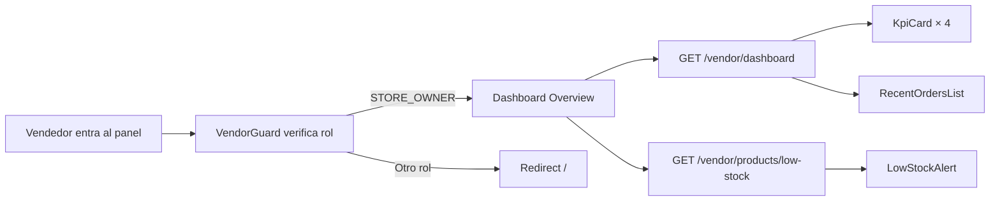
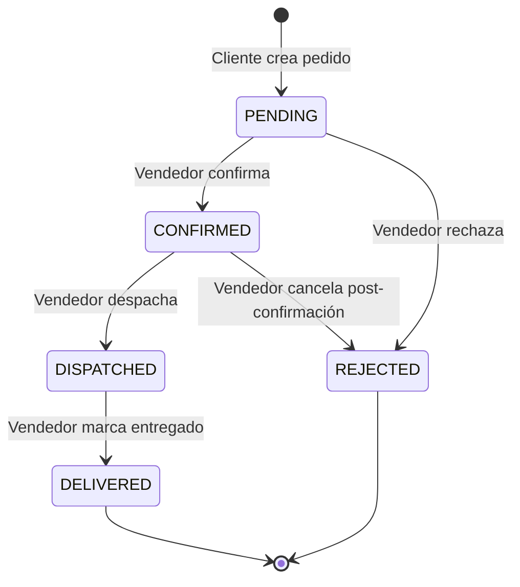
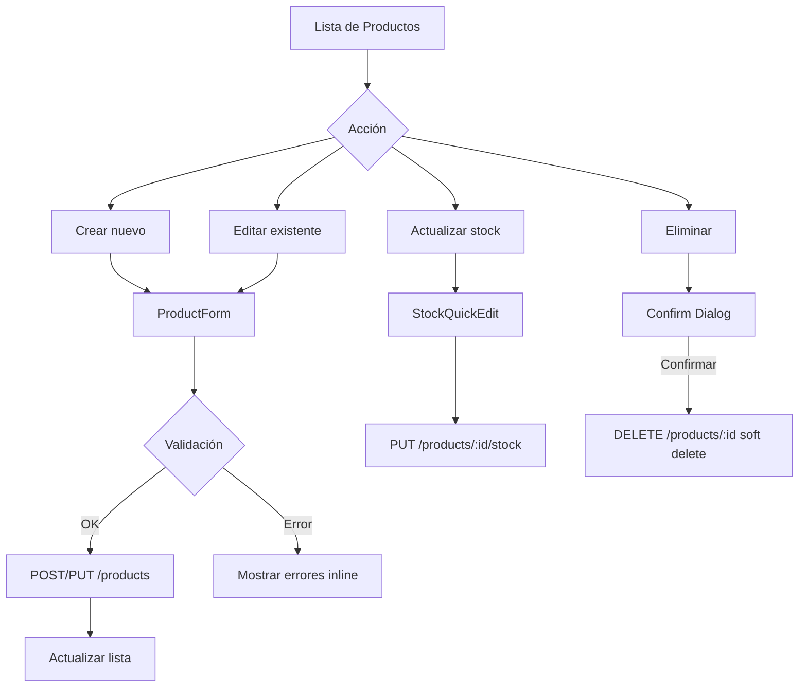
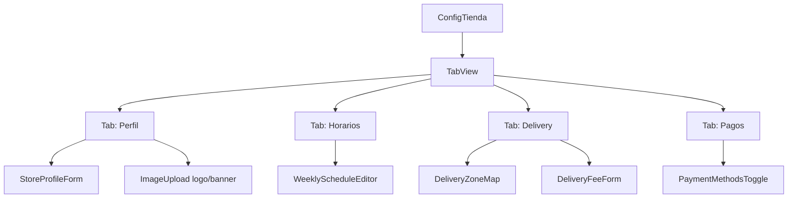
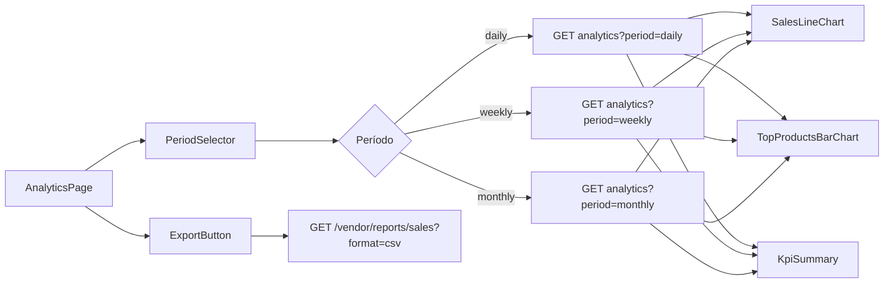
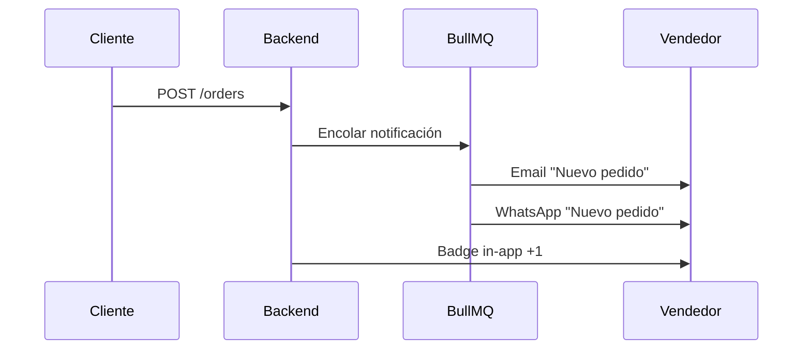
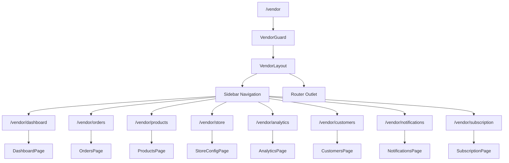
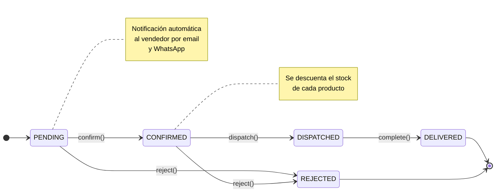
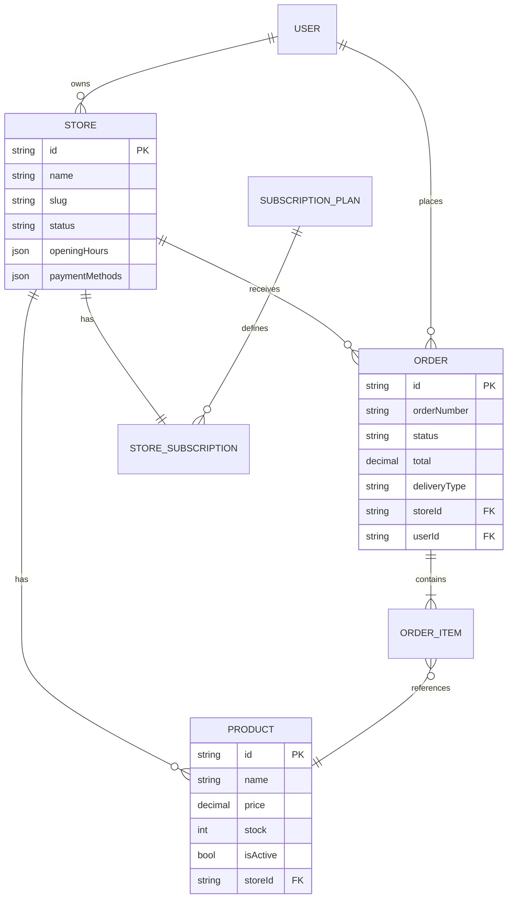

> [!CAUTION]
> # ⚠️ DOCUMENTO ARCHIVADO — 2026-04-16
>
> Este documento quedó **obsoleto** el 16 de abril de 2026.
> Toda la información fue consolidada, actualizada y expandida en:
>
> 👉 **[`VENDOR-PANEL-DEFINITIVO.md`](./VENDOR-PANEL-DEFINITIVO.md)**
>
> No usar este archivo como referencia. Se mantiene solo por trazabilidad histórica y será eliminado en una próxima limpieza.

---

# Panel del Vendedor — Store Manager Dashboard

> Especificación de módulos, flujos y arquitectura para el dashboard del vendedor en Tiendi.

---

## Índice

- [Visión general](#visión-general)
- [Módulos](#módulos)
  - [M1 — Dashboard Overview](#m1--dashboard-overview)
  - [M2 — Gestión de Pedidos](#m2--gestión-de-pedidos)
  - [M3 — Gestión de Productos](#m3--gestión-de-productos)
  - [M4 — Configuración de Tienda](#m4--configuración-de-tienda)
  - [M5 — Analytics y Reportes](#m5--analytics-y-reportes)
  - [M6 — Clientes](#m6--clientes)
  - [M7 — Notificaciones](#m7--notificaciones)
  - [M8 — Suscripción y Plan](#m8--suscripción-y-plan)
- [Arquitectura de navegación](#arquitectura-de-navegación)
- [Flujo de estados de pedido](#flujo-de-estados-de-pedido)
- [Modelo de datos relevante](#modelo-de-datos-relevante)

---

## Visión general

El **Panel del Vendedor** es la interfaz principal que usan los dueños de tienda (`STORE_OWNER`) para gestionar su negocio dentro de Tiendi. Es una SPA Angular separada del ecommerce público, accesible desde `/vendor`.

> [!NOTE]
> El panel solo es accesible para usuarios con rol `STORE_OWNER`. El guard `VendorGuard` valida el rol antes de cargar cualquier ruta del módulo.

> [!IMPORTANT]
> Toda la data del panel usa el `storeId` del usuario autenticado — nunca se expone data de otras tiendas. La autorización es doble: JWT en el frontend + validación de ownership en cada endpoint del backend.

---

## Módulos

### M1 — Dashboard Overview

Resumen ejecutivo del día. Primera pantalla al entrar al panel.

**Componentes:**
- `KpiCard` — métricas clave (ventas del día, pedidos pendientes, productos con stock bajo, ingresos del mes)
- `RecentOrdersList` — últimos 5 pedidos con estado y monto
- `LowStockAlert` — productos con stock ≤ umbral configurado
- `SalesSparkline` — mini-gráfico de ventas últimos 7 días

**Endpoints:**
- `GET /vendor/dashboard` — resumen del día
- `GET /vendor/products/low-stock?threshold=5`

> [!TIP]
> Los KPIs se actualizan cada 60 segundos con polling liviano. No se usa WebSocket para el MVP — se agrega en v2 si hay demanda.

---

### M2 — Gestión de Pedidos

Módulo principal de operación diaria. El vendedor acepta, despacha y completa pedidos desde acá.

**Vistas:**
- Lista de pedidos con filtros (estado, fecha, método de pago)
- Detalle de pedido (productos, dirección, forma de pago, historial de estados)
- Acciones rápidas: confirmar, despachar, completar, rechazar

**Endpoints:**
- `GET /vendor/orders?storeId=&status=&page=&limit=`
- `GET /orders/:id`
- `PUT /orders/:id/confirm`
- `PUT /orders/:id/dispatch`
- `PUT /orders/:id/complete`
- `PUT /orders/:id/reject`

> [!WARNING]
> La transición `CONFIRMED → REJECTED` solo es posible dentro de las primeras 2 horas de confirmación. Pasado ese tiempo, el pedido debe completarse o escalarse a soporte.

**Filtros disponibles:**

| Filtro | Valores |
|--------|---------|
| Estado | `PENDING`, `CONFIRMED`, `DISPATCHED`, `DELIVERED`, `REJECTED` |
| Período | Hoy, Ayer, Últimos 7 días, Este mes |
| Pago | Efectivo, Transferencia, Tarjeta |
| Entrega | Pickup, Delivery |

---

### M3 — Gestión de Productos

CRUD completo de productos de la tienda. Incluye stock, imágenes y categorías.

**Vistas:**
- Listado con búsqueda, filtro por categoría y estado
- Formulario de creación/edición (datos, precio, stock, imágenes)
- Vista de stock bajo con edición rápida de cantidad

**Endpoints:**
- `GET /stores/:id/products?page=&limit=&search=&categoryId=`
- `POST /stores/:id/products`
- `PUT /products/:id`
- `DELETE /products/:id`
- `PUT /products/:id/stock`
- `POST /products/:id/images` *(pendiente — Cloudinary)*

> [!NOTE]
> El `DELETE` es un **soft delete** — el producto se marca como `isActive: false` y desaparece del catálogo público, pero queda en el historial de pedidos.

> [!TIP]
> El límite de productos activos depende del plan de suscripción. Si el vendedor alcanza el límite, el botón "Crear producto" se deshabilita y muestra un prompt de upgrade.

---

### M4 — Configuración de Tienda

Personalización del perfil público de la tienda y parámetros operativos.

**Secciones:**
- **Perfil** — nombre, descripción, logo, banner, dirección, teléfono, WhatsApp
- **Horarios** — horarios de atención por día de la semana
- **Delivery** — zonas de cobertura, costo de envío, monto mínimo
- **Métodos de pago** — cuáles acepta la tienda (efectivo, Yape, Plin, transferencia, tarjeta)

**Endpoints:**
- `PUT /stores/:id` — perfil general
- `PUT /stores/:id/hours`
- `PUT /stores/:id/delivery`
- `PUT /stores/:id/payment-methods`
- `POST /stores/:id/logo`
- `POST /stores/:id/banner`

> [!IMPORTANT]
> El logo y el banner se suben a **Cloudinary**. El backend almacena solo la URL. Tamaño máximo: logo 500KB, banner 2MB. Formatos: JPG, PNG, WebP.

---

### M5 — Analytics y Reportes

Visualización de métricas de negocio para la toma de decisiones.

**Métricas:**
- Ventas por período (diario, semanal, mensual)
- Productos más vendidos (top 10)
- Ticket promedio
- Tasa de pedidos rechazados
- Ingresos por método de pago

**Endpoints:**
- `GET /vendor/analytics?period=daily|weekly|monthly&from=&to=`
- `GET /vendor/reports/sales?format=csv|pdf`

> [!NOTE]
> Los gráficos usan **Chart.js** via `ng2-charts`. No se agrega una librería de BI completa para el MVP — los reportes exportables en CSV/PDF cubren el caso de análisis profundo.

---

### M6 — Clientes

Listado de compradores que realizaron pedidos en la tienda. Solo lectura — sin edición de datos de clientes.

**Vistas:**
- Lista de clientes con total de pedidos y último pedido
- Detalle de cliente: historial de pedidos en esta tienda

**Endpoints:**
- `GET /vendor/customers?storeId=` *(pendiente — endpoint a crear)*
- `GET /vendor/customers/:id/orders`

> [!WARNING]
> Por privacidad (GDPR/LGPD), el vendedor solo puede ver el nombre, email y historial de compras **en su propia tienda**. No tiene acceso a pedidos en otras tiendas ni a datos sensibles como contraseña o documentos.

---

### M7 — Notificaciones

Centro de alertas operativas del vendedor.

**Tipos de notificaciones:**
- 🛒 Nuevo pedido recibido
- ⚠️ Producto con stock bajo (≤ umbral)
- ✅ Pago manual confirmado por el sistema
- 📦 Recordatorio de pedido pendiente sin atender (+30 min)

**Canales:**
- In-app (badge en navbar + lista de notificaciones)
- Email (SendGrid)
- WhatsApp (Twilio)

> [!TIP]
> El vendedor puede configurar qué canales quiere activar por tipo de notificación desde la sección de Configuración. Por defecto: Email ON, WhatsApp ON para nuevos pedidos.

---

### M8 — Suscripción y Plan

Gestión del plan activo de la tienda y su ciclo de facturación.

**Vistas:**
- Plan actual con límites de uso (productos activos, pedidos del mes)
- Comparación de planes disponibles
- Historial de pagos
- Botón de upgrade

**Endpoints:**
- `GET /subscriptions/my`
- `GET /subscription-plans`
- `POST /subscriptions` — cambiar de plan

| Plan | Productos | Pedidos/mes | Analytics | Soporte |
|------|-----------|-------------|-----------|---------|
| **Gratuito** | 20 | 50 | Básico | Email |
| **Pro** | 200 | Ilimitado | Avanzado | Chat |
| **Enterprise** | Ilimitado | Ilimitado | Full + Export | Dedicado |

> [!IMPORTANT]
> El downgrade de plan solo aplica al siguiente ciclo de facturación. Si el vendedor tiene más productos activos que el límite del plan destino, debe archivar productos antes de poder hacer downgrade.

---

## Arquitectura de navegación

---

## Flujo de estados de pedido

---

## Modelo de datos relevante

---

## Notas de implementación

> [!NOTE]
> El panel del vendedor es un módulo **lazy-loaded** en Angular. Se carga solo cuando el usuario navega a `/vendor`, reduciendo el bundle inicial del ecommerce público.

> [!WARNING]
> El `VendorGuard` debe verificar tanto el JWT (expiración) como el rol (`STORE_OWNER`). Un `CUSTOMER` con token válido no debe poder acceder aunque manipule la URL.

> [!TIP]
> Para el MVP, el panel comparte el mismo `app.module.ts` y los mismos servicios core (auth, session, http). En una arquitectura futura se puede separar en un micro-frontend independiente.

---

*Última actualización: 2026-04-15*
