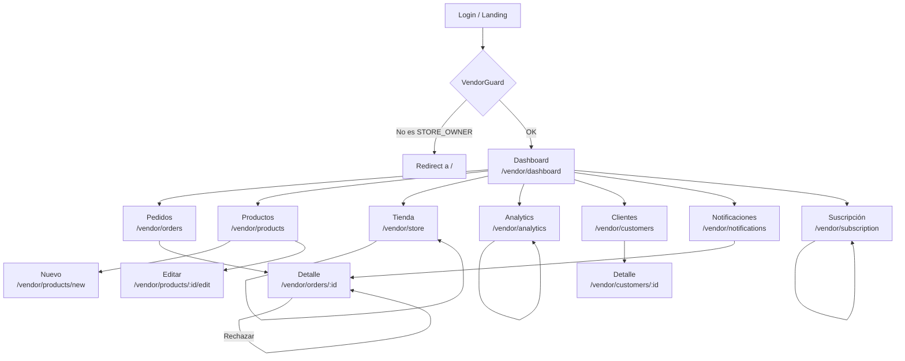

> [!CAUTION]
> # ⚠️ DOCUMENTO ARCHIVADO — 2026-04-16
>
> Este documento quedó **obsoleto** el 16 de abril de 2026.
> Toda la información fue consolidada, actualizada y expandida en:
>
> 👉 **[`VENDOR-PANEL-DEFINITIVO.md`](./VENDOR-PANEL-DEFINITIVO.md)**
>
> No usar este archivo como referencia. Se mantiene solo por trazabilidad histórica y será eliminado en una próxima limpieza.

---

# Tiendi Vendor — Especificaciones de Pantallas

> Documento de referencia para el diseño e implementación del Panel del Vendedor.
> Incluye layout, componentes, interacciones y flujos de cada pantalla.

---

## Convenciones

| Elemento | Descripción |
|----------|-------------|
| `[BTN]` | Botón primario |
| `[BTN-SEC]` | Botón secundario |
| `[BTN-GHOST]` | Botón sin fondo |
| `[INPUT]` | Campo de texto |
| `[SELECT]` | Dropdown |
| `[TAG]` | Etiqueta de estado |
| `[CARD]` | Tarjeta contenedora |
| `→` | Navega a pantalla |
| `⚡` | Acción que llama a la API |
| `🔔` | Dispara notificación |

---

## Layout General (Shell)

Todas las pantallas comparten este shell:

```
┌─────────────────────────────────────────────────────────┐
│  TOPBAR                                                  │
│  [≡ Menu]   Tiendi Vendor          [🔔 3] [Avatar ▼]   │
├──────────────┬──────────────────────────────────────────┤
│              │                                          │
│  SIDEBAR     │   CONTENT AREA (Router Outlet)          │
│              │                                          │
│  📊 Dashboard│                                          │
│  🛒 Pedidos  │                                          │
│  📦 Productos│                                          │
│  🏪 Tienda   │                                          │
│  📈 Analytics│                                          │
│  👥 Clientes │                                          │
│  🔔 Notif.   │                                          │
│  💳 Plan     │                                          │
│              │                                          │
│  ──────────  │                                          │
│  [Cerrar     │                                          │
│   sesión]    │                                          │
└──────────────┴──────────────────────────────────────────┘
```

**Comportamiento del Sidebar:**
- Desktop (>1024px): siempre visible, 240px de ancho
- Tablet (768–1024px): colapsado a iconos, 64px
- Mobile (<768px): oculto, se abre con botón `[≡]` como drawer overlay

**Topbar:**
- `[🔔 N]` — badge con cantidad de notificaciones no leídas. Clic → abre panel lateral de notificaciones
- `[Avatar ▼]` — dropdown con: "Mi perfil", "Configuración", "Cerrar sesión"
- El nombre de la tienda activa se muestra en el topbar

---

## Pantalla 1 — Dashboard Overview

**Ruta:** `/vendor/dashboard`
**API calls al cargar:** `GET /vendor/dashboard`, `GET /vendor/products/low-stock?threshold=5`

### Layout

```
┌─────────────────────────────────────────────────────────┐
│  Buenos días, Carlos 👋  —  Bodega Don Carlos           │
│  Martes 15 de abril, 2026                               │
├──────────────┬──────────────┬──────────────┬────────────┤
│  [CARD]      │  [CARD]      │  [CARD]      │  [CARD]   │
│  💰 Ventas   │  🛒 Pedidos  │  ⚠️ Stock    │  📦 Prod. │
│  S/ 1,240    │  Pendientes  │  Bajo        │  Activos  │
│  Hoy         │  5           │  3           │  47       │
│  +12% ayer   │              │  productos   │           │
├──────────────┴──────────────┴──────────────┴────────────┤
│                                                         │
│  Pedidos Recientes                    [Ver todos →]     │
│  ┌────────────────────────────────────────────────────┐ │
│  │ #PED-001  Juan P.   S/85.00  [TAG: PENDIENTE]  ⋯  │ │
│  │ #PED-002  Maria L.  S/32.50  [TAG: CONFIRMADO] ⋯  │ │
│  │ #PED-003  Luis M.   S/120.00 [TAG: DESPACHADO] ⋯  │ │
│  │ #PED-004  Ana R.    S/45.00  [TAG: ENTREGADO]  ⋯  │ │
│  │ #PED-005  Carlos V. S/67.00  [TAG: PENDIENTE]  ⋯  │ │
│  └────────────────────────────────────────────────────┘ │
│                                                         │
│  Ventas últimos 7 días                                  │
│  ┌────────────────────────────────────────────────────┐ │
│  │  📈 [LINE CHART — S/ por día]                      │ │
│  │                                                    │ │
│  └────────────────────────────────────────────────────┘ │
│                                                         │
│  ⚠️ Productos con stock bajo                            │
│  ┌────────────────────────────────────────────────────┐ │
│  │  Leche Gloria 400ml    Stock: 2   [BTN: +Stock]    │ │
│  │  Arroz Costeño 1kg     Stock: 1   [BTN: +Stock]    │ │
│  │  Aceite Primor 900ml   Stock: 4   [BTN: +Stock]    │ │
│  └────────────────────────────────────────────────────┘ │
└─────────────────────────────────────────────────────────┘
```

### Componentes y estados

| Componente | Estado vacío | Estado cargando | Estado error |
|------------|-------------|-----------------|--------------|
| KPI Cards | `S/ 0.00` / `0` | Skeleton | `—` con tooltip |
| Pedidos recientes | "Sin pedidos hoy" + ilustración | Skeleton rows | "Error al cargar" + [Reintentar] |
| Line Chart | "Sin datos aún" | Spinner centrado | "Error al cargar gráfico" |
| Stock bajo | "¡Todo el stock está en buen nivel! ✅" | Skeleton rows | Oculto |

### Interacciones

| Acción | Comportamiento |
|--------|---------------|
| Clic en KPI "Pedidos Pendientes" | → `/vendor/orders?status=PENDING` |
| Clic en KPI "Stock Bajo" | → `/vendor/products?stock=low` |
| Clic en KPI "Ventas Hoy" | → `/vendor/analytics` |
| Clic en `[Ver todos →]` de pedidos | → `/vendor/orders` |
| Clic en fila de pedido | → `/vendor/orders/:id` (detalle) |
| Clic en `⋯` de pedido | Abre menú contextual: "Ver detalle", "Confirmar", "Rechazar" |
| Clic en `[BTN: +Stock]` | Abre dialog inline para ingresar cantidad ⚡ `PUT /products/:id/stock` |
| Auto-refresh | Polling cada 60s — actualiza KPIs y pedidos recientes sin recargar página |

### Menú contextual del pedido (`⋯`)

```
┌─────────────────┐
│ 👁 Ver detalle  │
│ ✅ Confirmar    │  (solo si PENDING)
│ ❌ Rechazar     │  (solo si PENDING o CONFIRMED)
└─────────────────┘
```

---

## Pantalla 2 — Gestión de Pedidos

**Ruta:** `/vendor/orders`
**Ruta detalle:** `/vendor/orders/:id`
**API calls al cargar:** `GET /vendor/orders?storeId=&page=1&limit=20`

### Layout — Lista

```
┌─────────────────────────────────────────────────────────┐
│  Pedidos                                                │
│                                                         │
│  [SELECT: Estado ▼]  [SELECT: Período ▼]               │
│  [SELECT: Pago ▼]    [SELECT: Entrega ▼]  [BTN: Limpiar]│
│                                                         │
│  ┌────────────────────────────────────────────────────┐ │
│  │ N°        Cliente    Total    Pago      Estado  Act │ │
│  ├────────────────────────────────────────────────────┤ │
│  │ PED-001   Juan P.   S/85.00  Efectivo  PENDIENTE ⋯ │ │
│  │ PED-002   Maria L.  S/32.50  Yape      CONFIRMADO⋯ │ │
│  │ PED-003   Luis M.   S/120.00 Tarjeta   DESPACHADO⋯ │ │
│  │ PED-004   Ana R.    S/45.00  Transfer. ENTREGADO ⋯ │ │
│  └────────────────────────────────────────────────────┘ │
│                                                         │
│  Mostrando 1-20 de 87 pedidos          [< 1 2 3 4 5 >] │
└─────────────────────────────────────────────────────────┘
```

### Layout — Detalle de Pedido

```
┌─────────────────────────────────────────────────────────┐
│  [← Volver]   Pedido #PED-2026-001234                   │
│                                    [TAG: PENDIENTE]     │
├───────────────────────────┬─────────────────────────────┤
│  PRODUCTOS                │  RESUMEN                    │
│  ┌─────────────────────┐  │  Cliente: Juan Pérez        │
│  │ Leche Gloria  x2    │  │  Email: juan@mail.com       │
│  │ S/ 4.50 c/u S/9.00  │  │  Tel: +51 999 111 222      │
│  │─────────────────────│  │                             │
│  │ Arroz 1kg     x1    │  │  Entrega: DELIVERY          │
│  │ S/ 3.20       S/3.20│  │  Dir: Jr. Lima 123, Barranco│
│  │─────────────────────│  │                             │
│  │ Aceite 900ml  x1    │  │  Pago: Efectivo             │
│  │ S/ 8.50       S/8.50│  │  Subtotal:       S/ 85.00  │
│  └─────────────────────┘  │  Delivery:       S/  5.00  │
│                           │  TOTAL:          S/ 90.00  │
│  HISTORIAL                │                             │
│  ● Creado    10:23am      │  [BTN: Confirmar pedido]    │
│  ○ Pendiente acción...    │  [BTN-SEC: Rechazar]        │
│                           │                             │
└───────────────────────────┴─────────────────────────────┘
```

### Interacciones — Lista

| Acción | Comportamiento |
|--------|---------------|
| Cambiar filtro Estado | ⚡ Re-fetch `GET /vendor/orders?status=X` |
| Cambiar filtro Período | ⚡ Re-fetch con `from=&to=` |
| Clic en fila | → `/vendor/orders/:id` |
| Clic `⋯` → "Confirmar" | Abre confirm dialog → ⚡ `PUT /orders/:id/confirm` → 🔔 notifica al comprador → actualiza TAG en tabla |
| Clic `⋯` → "Rechazar" | Abre dialog con campo "Motivo del rechazo" (obligatorio) → ⚡ `PUT /orders/:id/reject` → actualiza tabla |
| Paginación | ⚡ `GET /vendor/orders?page=N` |

### Interacciones — Detalle

| Acción | Comportamiento |
|--------|---------------|
| `[BTN: Confirmar pedido]` | Confirm dialog "¿Confirmás este pedido?" → ⚡ `PUT /orders/:id/confirm` → TAG cambia a CONFIRMADO → botones cambian a "Despachar" / "Rechazar" |
| `[BTN: Despachar]` | ⚡ `PUT /orders/:id/dispatch` → TAG cambia a DESPACHADO → botón cambia a "Marcar entregado" |
| `[BTN: Marcar entregado]` | ⚡ `PUT /orders/:id/complete` → TAG cambia a ENTREGADO → botones desaparecen |
| `[BTN-SEC: Rechazar]` | Dialog con textarea "Motivo" (min 10 chars) → ⚡ `PUT /orders/:id/reject` |
| `[← Volver]` | → `/vendor/orders` preservando filtros activos |

### Tags de estado

| Estado | Color | Etiqueta |
|--------|-------|---------|
| PENDING | 🟡 Amarillo | Pendiente |
| CONFIRMED | 🔵 Azul | Confirmado |
| DISPATCHED | 🟣 Violeta | En camino |
| DELIVERED | 🟢 Verde | Entregado |
| REJECTED | 🔴 Rojo | Rechazado |

---

## Pantalla 3 — Gestión de Productos

**Ruta:** `/vendor/products`
**Ruta creación:** `/vendor/products/new`
**Ruta edición:** `/vendor/products/:id/edit`
**API calls al cargar:** `GET /stores/:id/products?page=1&limit=20`

### Layout — Lista

```
┌─────────────────────────────────────────────────────────┐
│  Productos                          [BTN: + Nuevo]      │
│                                                         │
│  [INPUT: Buscar producto...]  [SELECT: Categoría ▼]    │
│  [SELECT: Estado ▼]           [SELECT: Stock ▼]        │
│                                                         │
│  ┌────────────────────────────────────────────────────┐ │
│  │ □  Img  Nombre           Cat.    Precio  Stock  Act│ │
│  ├────────────────────────────────────────────────────┤ │
│  │ □  🖼   Leche Gloria     Lácteos S/4.50   8   ✏ 🗑│ │
│  │ □  🖼   Arroz Costeño    Abarrotes S/3.20 1⚠  ✏ 🗑│ │
│  │ □  🖼   Aceite Primor    Abarrotes S/8.50 12  ✏ 🗑│ │
│  │ □  🖼   Azúcar Rubia     Abarrotes S/2.80 0🔴 ✏ 🗑│ │
│  └────────────────────────────────────────────────────┘ │
│                                                         │
│  □ Seleccionar todo    [BTN-SEC: Eliminar selección]    │
│  Mostrando 1-20 de 47             [< 1 2 3 >]          │
└─────────────────────────────────────────────────────────┘
```

### Layout — Formulario (Creación / Edición)

```
┌─────────────────────────────────────────────────────────┐
│  [← Volver]   Nuevo Producto                            │
├─────────────────────────────┬───────────────────────────┤
│  INFORMACIÓN GENERAL        │  IMÁGENES                 │
│                             │  ┌─────────────────────┐  │
│  Nombre *                   │  │   [Zona de drop]    │  │
│  [INPUT: Ej. Leche Gloria]  │  │   📎 Subir imágenes │  │
│                             │  │   (máx 5, 2MB c/u)  │  │
│  Descripción                │  └─────────────────────┘  │
│  [TEXTAREA: Descripción...] │                           │
│                             │  [img1] [img2] [img3]     │
│  Categoría *                │  ✕      ✕      ✕          │
│  [SELECT: Seleccionar ▼]    │                           │
│                             │  ESTADO                   │
│  SKU / Código               │  ○ Activo                 │
│  [INPUT: Ej. GLO-001]       │  ○ Inactivo               │
│                             │                           │
│  PRECIO                     │  DESTACADO                │
│  Precio regular *           │  □ Oferta del día         │
│  [INPUT: 0.00]  S/          │                           │
│                             │                           │
│  Precio con descuento       │                           │
│  [INPUT: 0.00]  S/          │                           │
│  (dejar vacío si no aplica) │                           │
│                             │                           │
│  STOCK                      │                           │
│  Cantidad *                 │                           │
│  [INPUT: 0]  unidades       │                           │
│                             │                           │
├─────────────────────────────┴───────────────────────────┤
│           [BTN-GHOST: Cancelar]  [BTN: Guardar]         │
└─────────────────────────────────────────────────────────┘
```

### Interacciones — Lista

| Acción | Comportamiento |
|--------|---------------|
| `[BTN: + Nuevo]` | → `/vendor/products/new` |
| Escribir en buscador | Debounce 400ms → ⚡ `GET /stores/:id/products?search=X` |
| Cambiar categoría | ⚡ Re-fetch con `categoryId=X` |
| Filtro Stock "Bajo" | ⚡ `GET /vendor/products/low-stock` |
| Clic `✏` | → `/vendor/products/:id/edit` |
| Clic `🗑` | Confirm dialog "¿Eliminar este producto? Esta acción no se puede deshacer." → ⚡ `DELETE /products/:id` → remueve de lista con animación |
| Checkbox individual | Selecciona fila, aparece barra de acciones masivas |
| Checkbox "Seleccionar todo" | Selecciona todos los de la página |
| `[BTN-SEC: Eliminar selección]` | Confirm dialog con cantidad → ⚡ DELETE múltiple |
| Clic en stock `⚠` o `🔴` | Abre popover inline con `[INPUT cantidad]` + `[BTN: Actualizar]` ⚡ `PUT /products/:id/stock` |

### Interacciones — Formulario

| Acción | Comportamiento |
|--------|---------------|
| Drop/subir imagen | Preview inmediato, ⚡ `POST /products/:id/images` al guardar |
| Reordenar imágenes | Drag & drop entre previews |
| Clic `✕` en imagen | Elimina preview (marcada para borrar al guardar) |
| Campo "Precio con descuento" | Si se completa, muestra badge "% de descuento" calculado en tiempo real |
| `[BTN: Guardar]` (nuevo) | Valida campos required → ⚡ `POST /stores/:id/products` → toast "Producto creado" → → `/vendor/products` |
| `[BTN: Guardar]` (edición) | ⚡ `PUT /products/:id` → toast "Producto actualizado" → queda en la misma pantalla |
| `[BTN-GHOST: Cancelar]` | Si hay cambios sin guardar → dialog "¿Descartás los cambios?" → → `/vendor/products` |

### Validaciones del formulario

| Campo | Regla |
|-------|-------|
| Nombre | Required, min 3 chars, max 100 |
| Categoría | Required |
| Precio regular | Required, > 0 |
| Precio descuento | Opcional, debe ser < precio regular |
| Stock | Required, ≥ 0, entero |
| Imágenes | Máx 5, formato JPG/PNG/WebP, máx 2MB c/u |

---

## Pantalla 4 — Configuración de Tienda

**Ruta:** `/vendor/store`
**API calls al cargar:** `GET /stores/:id`

### Layout

```
┌─────────────────────────────────────────────────────────┐
│  Mi Tienda                                              │
│                                                         │
│  [Tab: Perfil] [Tab: Horarios] [Tab: Delivery] [Tab: Pagos]│
├─────────────────────────────────────────────────────────┤
│                                                         │
│  TAB ACTIVO: PERFIL                                     │
│                                                         │
│  ┌──────────────────────────────────────────────────┐   │
│  │  LOGO               BANNER                       │   │
│  │  ┌────────┐         ┌──────────────────────────┐ │   │
│  │  │  🏪   │         │                          │ │   │
│  │  │ 200x200│         │       800x200            │ │   │
│  │  └────────┘         └──────────────────────────┘ │   │
│  │  [Cambiar logo]     [Cambiar banner]             │   │
│  └──────────────────────────────────────────────────┘   │
│                                                         │
│  Nombre de la tienda *                                  │
│  [INPUT: Bodega Don Carlos              ]               │
│                                                         │
│  Descripción                                            │
│  [TEXTAREA: Describe tu tienda...       ]               │
│                                                         │
│  Dirección *                                            │
│  [INPUT: Jr. Tarapacá 340, Barranco     ]               │
│                                                         │
│  Teléfono           WhatsApp                            │
│  [INPUT: +51 999...]  [INPUT: +51 999...]               │
│                                                         │
│  Slug (URL pública)                                     │
│  tiendi.app/tienda/[INPUT: bodega-don-carlos]           │
│                                                         │
│             [BTN-GHOST: Cancelar]  [BTN: Guardar]       │
└─────────────────────────────────────────────────────────┘
```

### Tab: Horarios

```
┌─────────────────────────────────────────────────────────┐
│  Horarios de atención                                   │
│                                                         │
│  Lunes      [TOGGLE: ON]  [08:00 ▼] a [22:00 ▼]        │
│  Martes     [TOGGLE: ON]  [08:00 ▼] a [22:00 ▼]        │
│  Miércoles  [TOGGLE: ON]  [08:00 ▼] a [22:00 ▼]        │
│  Jueves     [TOGGLE: ON]  [08:00 ▼] a [22:00 ▼]        │
│  Viernes    [TOGGLE: ON]  [08:00 ▼] a [22:00 ▼]        │
│  Sábado     [TOGGLE: ON]  [09:00 ▼] a [21:00 ▼]        │
│  Domingo    [TOGGLE: OFF] ─────── Cerrado ───────        │
│                                                         │
│  □ Marcar como feriado hoy (cierra temporalmente)       │
│                                                         │
│                              [BTN: Guardar horarios]    │
└─────────────────────────────────────────────────────────┘
```

### Tab: Delivery

```
┌─────────────────────────────────────────────────────────┐
│  Configuración de Delivery                              │
│                                                         │
│  [TOGGLE: Ofrezco delivery]                             │
│                                                         │
│  Radio de cobertura                                     │
│  [SLIDER: ────●──── 5 km]                               │
│                                                         │
│  Costo de envío                                         │
│  S/ [INPUT: 5.00]                                       │
│                                                         │
│  Pedido mínimo para delivery                            │
│  S/ [INPUT: 20.00]                                      │
│                                                         │
│  Tiempo estimado de entrega                             │
│  [INPUT: 30] — [INPUT: 60] minutos                      │
│                                                         │
│  [TOGGLE: Delivery gratis desde]  S/ [INPUT: 80.00]     │
│                                                         │
│                              [BTN: Guardar]             │
└─────────────────────────────────────────────────────────┘
```

### Tab: Métodos de Pago

```
┌─────────────────────────────────────────────────────────┐
│  Métodos de pago aceptados                              │
│                                                         │
│  [TOGGLE: ON ] 💵 Efectivo                              │
│  [TOGGLE: ON ] 📱 Yape                                  │
│  [TOGGLE: ON ] 📱 Plin                                  │
│  [TOGGLE: OFF] 🏦 Transferencia bancaria                │
│  [TOGGLE: OFF] 💳 Tarjeta de crédito/débito             │
│                                                         │
│  Mensaje para pago en efectivo                          │
│  [TEXTAREA: Ej. "Tener cambio exacto"  ]               │
│                                                         │
│  Mensaje para transferencia                             │
│  [TEXTAREA: Ej. "BCP cuenta 123-456..." ]               │
│                                                         │
│                              [BTN: Guardar]             │
└─────────────────────────────────────────────────────────┘
```

### Interacciones — Configuración

| Acción | Comportamiento |
|--------|---------------|
| Cambiar de tab | Guarda automáticamente si hay cambios pendientes (pregunta) |
| Subir logo | Preview inmediato circular, ⚡ `POST /stores/:id/logo` al guardar |
| Subir banner | Preview inmediato rectangular, ⚡ `POST /stores/:id/banner` al guardar |
| Toggle día (Horarios) | Deshabilita los selectores de hora de ese día |
| Toggle "Feriado hoy" | ⚡ `PUT /stores/:id` con `Feriado: true` — efecto inmediato |
| Toggle Delivery | Muestra/oculta los campos de configuración con animación |
| Guardar (cualquier tab) | ⚡ `PUT /stores/:id` o endpoint específico → toast "Guardado" |
| Slug field | Valida unicidad en tiempo real (debounce 800ms) → muestra ✅ o ❌ |

---

## Pantalla 5 — Analytics y Reportes

**Ruta:** `/vendor/analytics`
**API calls al cargar:** `GET /vendor/analytics?period=weekly`

### Layout

```
┌─────────────────────────────────────────────────────────┐
│  Analytics                                              │
│                                                         │
│  [BTN: Hoy] [BTN: Semana ●] [BTN: Mes] [BTN: Año]     │
│  Período personalizado: [DATE] al [DATE]                │
│                                      [BTN: Exportar CSV]│
├──────────┬──────────┬──────────┬───────────────────────┤
│ Ingresos │ Pedidos  │ Ticket   │ Tasa rechazo          │
│ S/8,420  │ 127      │ promedio │ 3.2%                  │
│ +8% sem  │ +15%     │ S/66.30  │ -1.1%                 │
├──────────┴──────────┴──────────┴───────────────────────┤
│                                                         │
│  Ventas por día                                         │
│  ┌────────────────────────────────────────────────────┐ │
│  │                                                    │ │
│  │    📈 [LINE CHART con área — Ingresos diarios]     │ │
│  │                                                    │ │
│  └────────────────────────────────────────────────────┘ │
│                                                         │
│  Top 10 Productos más vendidos                          │
│  ┌────────────────────────────────────────────────────┐ │
│  │  1. Leche Gloria    ████████████████  42 uds S/189 │ │
│  │  2. Arroz Costeño   ████████████     35 uds S/112  │ │
│  │  3. Aceite Primor   ██████████       28 uds S/238  │ │
│  └────────────────────────────────────────────────────┘ │
│                                                         │
│  Ingresos por método de pago                            │
│  ┌────────────────────────────────────────────────────┐ │
│  │  [🍩 DONUT CHART]   Efectivo    65%  S/5,473       │ │
│  │                     Yape        20%  S/1,684       │ │
│  │                     Transferenc 15%  S/1,263       │ │
│  └────────────────────────────────────────────────────┘ │
└─────────────────────────────────────────────────────────┘
```

### Interacciones

| Acción | Comportamiento |
|--------|---------------|
| Cambiar período (Hoy/Semana/Mes/Año) | ⚡ Re-fetch `GET /vendor/analytics?period=X` → actualiza todos los gráficos y KPIs |
| Período personalizado | Habilita date pickers → al seleccionar rango → ⚡ Re-fetch con `from=&to=` |
| `[BTN: Exportar CSV]` | ⚡ `GET /vendor/reports/sales?format=csv&period=X` → descarga directa del archivo |
| Hover en chart | Tooltip con valor exacto del día/semana |
| Clic en barra del top productos | → `/vendor/products?id=X` (detalle del producto) |

---

## Pantalla 6 — Clientes

**Ruta:** `/vendor/customers`
**Ruta detalle:** `/vendor/customers/:id`
**API calls al cargar:** `GET /vendor/customers?storeId=`

### Layout — Lista

```
┌─────────────────────────────────────────────────────────┐
│  Clientes                                               │
│                                                         │
│  [INPUT: Buscar por nombre o email...]                  │
│                                                         │
│  ┌────────────────────────────────────────────────────┐ │
│  │ Avatar  Nombre       Email          Pedidos  Total │ │
│  ├────────────────────────────────────────────────────┤ │
│  │  👤    Juan Pérez   juan@mail.com   8       S/420  │ │
│  │  👤    Maria López  mari@mail.com   3       S/156  │ │
│  │  👤    Luis Mamani  luis@mail.com   12      S/890  │ │
│  │  👤    Ana Ríos     ana@mail.com    1       S/45   │ │
│  └────────────────────────────────────────────────────┘ │
│                                                         │
│  Total: 34 clientes                    [< 1 2 >]        │
└─────────────────────────────────────────────────────────┘
```

### Layout — Detalle de Cliente

```
┌─────────────────────────────────────────────────────────┐
│  [← Volver]   Juan Pérez                                │
├──────────────────────────┬──────────────────────────────┤
│  DATOS                   │  ESTADÍSTICAS                │
│  👤 Juan Pérez           │  Total gastado: S/ 420.00    │
│  juan@mail.com           │  Pedidos: 8                  │
│  +51 999 111 222         │  Ticket promedio: S/ 52.50   │
│  Cliente desde: Ene 2026 │  Último pedido: 10 abr 2026  │
├──────────────────────────┴──────────────────────────────┤
│  Historial de pedidos en esta tienda                    │
│  ┌────────────────────────────────────────────────────┐ │
│  │ #PED-001  15 abr  S/85.00  [TAG: ENTREGADO]    →  │ │
│  │ #PED-002  10 abr  S/32.50  [TAG: ENTREGADO]    →  │ │
│  │ #PED-003  01 abr  S/120.00 [TAG: RECHAZADO]    →  │ │
│  └────────────────────────────────────────────────────┘ │
└─────────────────────────────────────────────────────────┘
```

### Interacciones

| Acción | Comportamiento |
|--------|---------------|
| Buscar cliente | Debounce 400ms → ⚡ `GET /vendor/customers?search=X` |
| Clic en fila | → `/vendor/customers/:id` |
| Clic en `→` del pedido | → `/vendor/orders/:id` |
| Ordenar columna (Pedidos, Total) | Reordena client-side |

---

## Pantalla 7 — Notificaciones

**Ruta:** `/vendor/notifications`
**API calls al cargar:** `GET /vendor/notifications?page=1&limit=30`

### Layout

```
┌─────────────────────────────────────────────────────────┐
│  Notificaciones              [BTN-GHOST: Marcar todo ✓] │
│                                                         │
│  [Tab: Todas ●] [Tab: Sin leer (3)] [Tab: Pedidos]     │
│  [Tab: Stock] [Tab: Sistema]                            │
├─────────────────────────────────────────────────────────┤
│                                                         │
│  HOY                                                    │
│  ┌────────────────────────────────────────────────────┐ │
│  │ 🔵 🛒  Nuevo pedido #PED-007 — S/45.00    10:23am │ │
│  │        Juan Pérez · Efectivo · Delivery       →   │ │
│  ├────────────────────────────────────────────────────┤ │
│  │ 🔵 ⚠️  Stock bajo: Arroz Costeño (1 unidad) 09:15am│ │
│  │        Actualizá el stock antes de aceptar    →   │ │
│  ├────────────────────────────────────────────────────┤ │
│  │    🛒  Pedido #PED-006 entregado — S/90.00  08:40am│ │
│  │        Maria López · Confirmado por vendedor  →   │ │
│  └────────────────────────────────────────────────────┘ │
│                                                         │
│  AYER                                                   │
│  ┌────────────────────────────────────────────────────┐ │
│  │    🛒  Pedido #PED-005 rechazado — S/32.00  6:20pm │ │
│  │        Sin stock suficiente                   →   │ │
│  └────────────────────────────────────────────────────┘ │
│                                                         │
│  Configuración de alertas          [BTN-GHOST: ⚙ Config]│
└─────────────────────────────────────────────────────────┘
```

### Panel de configuración de notificaciones (drawer lateral)

```
┌───────────────────────────────────┐
│  Configuración de notificaciones  │
│                                   │
│  NUEVOS PEDIDOS                   │
│  Email        [TOGGLE: ON]        │
│  WhatsApp     [TOGGLE: ON]        │
│  In-app       [TOGGLE: ON]        │
│                                   │
│  STOCK BAJO                       │
│  Email        [TOGGLE: ON]        │
│  WhatsApp     [TOGGLE: OFF]       │
│  Umbral       [INPUT: 5] uds      │
│                                   │
│  PEDIDOS SIN ATENDER              │
│  Recordatorio [TOGGLE: ON]        │
│  A los        [INPUT: 30] min     │
│                                   │
│              [BTN: Guardar]       │
└───────────────────────────────────┘
```

### Interacciones

| Acción | Comportamiento |
|--------|---------------|
| Clic en notificación no leída | Marca como leída → ⚡ `PUT /vendor/notifications/:id/read` → el punto 🔵 desaparece → navega al recurso relacionado |
| Clic `→` en notificación de pedido | → `/vendor/orders/:id` |
| Clic `→` en notificación de stock | → `/vendor/products?stock=low` |
| `[BTN-GHOST: Marcar todo ✓]` | ⚡ `PUT /vendor/notifications/read-all` → todos los puntos 🔵 desaparecen → badge en topbar → 0 |
| Cambiar tab | Filtra notificaciones client-side por tipo |
| `[BTN-GHOST: ⚙ Config]` | Abre drawer lateral de configuración |
| Guardar config notificaciones | ⚡ `PUT /vendor/notification-settings` → toast "Preferencias guardadas" |
| Scroll al fondo | Infinite scroll → ⚡ carga siguiente página |

---

## Pantalla 8 — Suscripción y Plan

**Ruta:** `/vendor/subscription`
**API calls al cargar:** `GET /subscriptions/my`, `GET /subscription-plans`

### Layout

```
┌─────────────────────────────────────────────────────────┐
│  Suscripción                                            │
│                                                         │
│  PLAN ACTUAL                                            │
│  ┌────────────────────────────────────────────────────┐ │
│  │  [TAG: PRO]  Plan Pro                              │ │
│  │  Renovación: 15 de mayo, 2026                      │ │
│  │  S/ 49.00 / mes                                    │ │
│  │                                                    │ │
│  │  Uso del mes:                                      │ │
│  │  Productos activos   [████████░░] 47/200           │ │
│  │  Pedidos del mes     [██████████] 127/∞            │ │
│  │                                                    │ │
│  │  [BTN-SEC: Cancelar plan]  [BTN: Cambiar plan]     │ │
│  └────────────────────────────────────────────────────┘ │
│                                                         │
│  PLANES DISPONIBLES                                     │
│                                                         │
│  ┌──────────┐  ┌──────────┐  ┌──────────────────────┐  │
│  │ GRATUITO │  │ PRO ✓    │  │ ENTERPRISE           │  │
│  │          │  │          │  │                      │  │
│  │ S/ 0     │  │ S/ 49    │  │ S/ 149               │  │
│  │ /mes     │  │ /mes     │  │ /mes                 │  │
│  │──────────│  │──────────│  │──────────────────────│  │
│  │ 20 prods │  │200 prods │  │ Sin límite           │  │
│  │ 50 ped.  │  │ Sin lím. │  │ Sin límite           │  │
│  │Analytics │  │Analytics │  │ Analytics Full       │  │
│  │ básico   │  │avanzado  │  │ + Export             │  │
│  │Email     │  │ Chat     │  │ Soporte dedicado     │  │
│  │──────────│  │──────────│  │──────────────────────│  │
│  │[Downgrade│  │[Actual]  │  │[BTN: Upgrade]        │  │
│  └──────────┘  └──────────┘  └──────────────────────┘  │
│                                                         │
│  HISTORIAL DE PAGOS                                     │
│  ┌────────────────────────────────────────────────────┐ │
│  │  15 abr 2026   Plan Pro   S/49.00   [TAG: PAGADO] │ │
│  │  15 mar 2026   Plan Pro   S/49.00   [TAG: PAGADO] │ │
│  │  15 feb 2026   Plan Pro   S/49.00   [TAG: PAGADO] │ │
│  └────────────────────────────────────────────────────┘ │
└─────────────────────────────────────────────────────────┘
```

### Interacciones

| Acción | Comportamiento |
|--------|---------------|
| `[BTN: Cambiar plan]` | Scroll suave a la sección "Planes disponibles" |
| `[BTN: Upgrade]` (a Enterprise) | Abre dialog de confirmación con resumen de costos → ⚡ `POST /subscriptions` → toast "Plan actualizado" → actualiza sección "Plan actual" |
| `[Downgrade]` (a Gratuito) | Abre dialog "El cambio aplica desde el próximo ciclo. Tenés X productos activos, deberás archivar Y para cumplir el límite de 20." → Confirmar → ⚡ `POST /subscriptions` |
| `[BTN-SEC: Cancelar plan]` | Abre dialog "¿Confirmás la cancelación? Tu plan sigue activo hasta el 15 de mayo." → Confirmar → ⚡ `DELETE /subscriptions/my` |
| Barra de uso al límite | Se pone en rojo con tooltip "Límite alcanzado — Actualizá tu plan para agregar más" |

---

## Flujo de navegación completo



---

## Estados globales de la UI

| Estado | Comportamiento |
|--------|---------------|
| **Sin conexión** | Banner amarillo "Sin conexión — los cambios se guardarán cuando se restaure" |
| **Session expirada** | Dialog "Tu sesión expiró" + `[BTN: Iniciar sesión]` → redirect a login |
| **Plan limitado** | Elementos bloqueados con candado `🔒` + tooltip "Actualizá tu plan" |
| **Tienda inactiva** | Banner rojo "Tu tienda está suspendida — contactá soporte" + bloquea acciones |
| **Primera vez** | Tour guiado paso a paso destacando los módulos principales |

---

## Paleta de colores y tipografía

| Token | Valor | Uso |
|-------|-------|-----|
| `--primary` | `#10B981` (verde esmeralda) | Botones primarios, tags activos |
| `--secondary` | `#6366F1` (índigo) | Acentos, gráficos |
| `--warning` | `#F59E0B` | Alertas, stock bajo |
| `--danger` | `#EF4444` | Rechazado, errores, stock cero |
| `--surface` | `#F9FAFB` | Fondo general |
| `--card` | `#FFFFFF` | Fondo de cards |
| `--text-primary` | `#111827` | Títulos |
| `--text-secondary` | `#6B7280` | Subtítulos, labels |
| **Tipografía** | Inter / Geist Sans | Toda la UI |
| **Tamaño base** | 14px | Body |
| **Título página** | 24px bold | H1 de cada pantalla |

---

*Última actualización: 2026-04-15*
