---
tags:
  - tiendi-vendor
  - frontend
  - angular
aliases:
  - Panel Vendedor Definitivo
---

# Tiendi — Panel del Vendedor: Documento Definitivo

> **Fuente única de verdad** para el diseño, arquitectura y especificación del Store Manager Dashboard de Tiendi.
> Este documento reemplaza y supera a `PANEL-VENDEDOR.md`, `PANTALLAS-SPECS.md` y `DIAGRAMAS_FLUJO_VENDEDOR.md`.

**Última actualización:** 2026-04-16
**Versión:** 1.0.0

---

## Índice

1. [Visión general](#1-visión-general)
2. [Decisiones de arquitectura para el MVP](#2-decisiones-de-arquitectura-para-el-mvp)
3. [Módulos del panel](#3-módulos-del-panel)
   - [M1 — Dashboard Overview](#m1--dashboard-overview)
   - [M2 — Gestión de Pedidos](#m2--gestión-de-pedidos)
   - [M3 — Gestión de Productos e Inventario](#m3--gestión-de-productos-e-inventario)
   - [M4 — Configuración de Tienda](#m4--configuración-de-tienda)
   - [M5 — Analytics y Reportes](#m5--analytics-y-reportes)
   - [M6 — Clientes (CRM básico)](#m6--clientes-crm-básico)
   - [M7 — Notificaciones](#m7--notificaciones)
   - [M8 — Suscripción y Plan](#m8--suscripción-y-plan)
   - [M9 — Staff y Empleados](#m9--staff-y-empleados) *(nuevo)*
   - [M10 — Cupones y Descuentos](#m10--cupones-y-descuentos) *(nuevo — v2)*
   - [M11 — Facturación y Legal](#m11--facturación-y-legal) *(nuevo — obligatorio)*
4. [Onboarding — Primera configuración](#4-onboarding--primera-configuración)
5. [Arquitectura de navegación](#5-arquitectura-de-navegación)
6. [Flujos de usuario críticos](#6-flujos-de-usuario-críticos)
7. [Especificaciones de pantallas](#7-especificaciones-de-pantallas)
   - [7.11 Adaptación Mobile — wireframes críticos](#711-adaptación-mobile--wireframes-críticos)
8. [Modelo de datos relevante](#8-modelo-de-datos-relevante)
9. [Estados globales de la UI](#9-estados-globales-de-la-ui)
10. [Error Handling y Degradación](#10-error-handling-y-degradación)
11. [Accesibilidad (WCAG 2.1 AA)](#11-accesibilidad-wcag-21-aa)
12. [Arquitectura del frontend Angular](#12-arquitectura-del-frontend-angular)
13. [Performance budgets](#13-performance-budgets)
14. [Analytics de producto y tracking de eventos](#14-analytics-de-producto-y-tracking-de-eventos)
15. [Paleta de colores y tipografía](#15-paleta-de-colores-y-tipografía)
16. [Roadmap MVP vs v2](#16-roadmap-mvp-vs-v2)

---

## 1. Visión general

El **Panel del Vendedor** es la interfaz principal que usan los dueños de tienda (`STORE_OWNER`) y sus empleados (`EMPLOYEE`) para gestionar su negocio dentro de Tiendi. Es una SPA Angular separada del ecommerce público, accesible desde `/vendor`.

**Características clave:**
- Solo accesible para usuarios con rol `STORE_OWNER` o `EMPLOYEE`
- El guard `VendorGuard` valida el rol antes de cargar cualquier ruta del módulo
- Toda la data usa el `storeId` del usuario autenticado — nunca se expone data de otras tiendas
- La autorización es doble: JWT en el frontend + validación de ownership en cada endpoint del backend
- Módulo **lazy-loaded** en Angular — se carga solo cuando el usuario navega a `/vendor`

> [!IMPORTANT]
> Un `CUSTOMER` con token válido **no debe poder acceder** aunque manipule la URL. El `VendorGuard` verifica tanto el JWT (expiración) como el rol.

---

## 2. Decisiones de arquitectura para el MVP

Estas decisiones resuelven contradicciones entre documentos anteriores y establecen la línea base del MVP.

### 2.1 Tiempo real: Polling en MVP, WebSocket en v2

| | MVP | v2 |
|--|-----|----|
| **Mecanismo** | Polling cada 60 segundos | WebSocket (Socket.io) |
| **Notificaciones** | Badge in-app + email/WhatsApp via BullMQ | Push in-app instantáneo + audio alert |
| **Motivación MVP** | Menor complejidad de infraestructura; BullMQ ya maneja los canales externos | Experiencia de operación en tiempo real para tiendas con alto volumen |

> [!NOTE]
> El polling cubre el 95% de los casos para una bodega o tienda pequeña. La alerta de nuevo pedido llega por WhatsApp/Email casi instantáneamente gracias a BullMQ — el polling solo actualiza el estado visual del panel.

### 2.2 Delivery: Radio circular en MVP, Geofencing en v2

| | MVP | v2 |
|--|-----|----|
| **Zonas de reparto** | Radio circular con slider (km) | Polígonos dibujados manualmente (GeoJSON + PostGIS) |
| **Precio de envío** | Precio fijo único | Tarifario variable por zona |
| **Motivación MVP** | Simple de implementar; cubre el 80% de los casos de bodegas urbanas | Necesario para tiendas con zonas irregulares o cobertura multi-distrito |

### 2.3 Variantes de producto: Básico en MVP, completo en v2

| | MVP | v2 |
|--|-----|----|
| **Variantes** | Campo de texto libre "Presentación" (ej: "500ml", "1kg") | SKUs completos con precio y stock por variante |
| **Motivación MVP** | Las bodegas peruanas raramente necesitan gestión de variantes compleja | Necesario para tiendas de ropa, tecnología, etc. |

### 2.4 Empleados: Módulo incluido en MVP

El módulo de Staff (M9) se incluye en el MVP porque es una necesidad real incluso para negocios pequeños (el dueño necesita que su cajero pueda atender pedidos sin acceso a las finanzas).

---

## 3. Módulos del panel

---

### M1 — Dashboard Overview

Resumen ejecutivo del día. Primera pantalla al entrar al panel.

**Componentes:**
- `KpiCard` — métricas clave (ventas del día, pedidos pendientes, productos con stock bajo, ingresos del mes)
- `RecentOrdersList` — últimos 5 pedidos con estado y monto
- `LowStockAlert` — productos con stock ≤ umbral configurado (default: 5)
- `SalesSparkline` — mini-gráfico de ventas últimos 7 días

**Endpoints:**
- `GET /vendor/dashboard` — resumen del día
- `GET /vendor/products/low-stock?threshold=5`

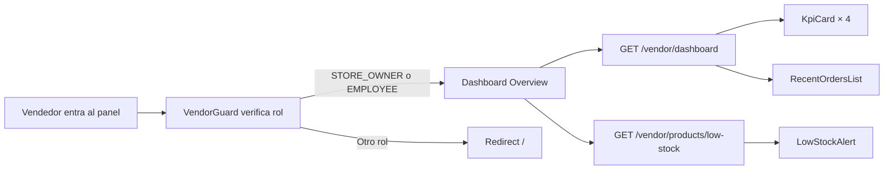

> [!TIP]
> Los KPIs se actualizan cada 60 segundos con polling liviano (MVP). WebSocket se incorpora en v2.

**✅ Criterios de aceptación**

- [ ] **AC1** — El Dashboard muestra los 4 KPIs con datos del día actual para el `storeId` del usuario autenticado
- [ ] **AC2** — Los KPIs se refrescan vía polling cada 60s sin reload de página y sin perder la posición de scroll
- [ ] **AC3** — Tap en KPI "Pedidos pendientes" navega a `/vendor/orders?status=PENDING`
- [ ] **AC4** — Tap en KPI "Stock bajo" navega a `/vendor/products?stock=low`
- [ ] **AC5** — Tap en KPI "Ventas hoy" navega a `/vendor/analytics`
- [ ] **AC6** — "Pedidos recientes" muestra los últimos 5 pedidos con tag de estado correcto por color
- [ ] **AC7** — El sparkline de ventas 7 días se renderiza con al menos 1 día de data; sino muestra empty state
- [ ] **AC8** — "Stock bajo" muestra productos con `stock ≤ stockAlert` (default 5)
- [ ] **AC9** — El botón `[+Stock]` abre dialog inline, ejecuta `PUT /products/:id/stock` y refresca la lista
- [ ] **AC10** — Si `GET /vendor/dashboard` falla 5xx → skeleton se mantiene + retry automático (3x backoff 1/2/4s)
- [ ] **AC11** — Sin pedidos del día → empty state "Sin pedidos hoy" + ilustración
- [ ] **AC12** — Accesible para rol STORE_OWNER, MANAGER y CASHIER; WAREHOUSE recibe 403

---

### M2 — Gestión de Pedidos

Módulo principal de operación diaria. El vendedor acepta, despacha y completa pedidos desde acá.

**Vistas:**
- Lista de pedidos con filtros (estado, fecha, método de pago, tipo de entrega)
- Detalle de pedido (productos, dirección, forma de pago, historial de estados)
- Acciones rápidas: confirmar, despachar, completar, rechazar

**Endpoints:**
- `GET /vendor/orders?storeId=&status=&page=&limit=`
- `GET /orders/:id`
- `PUT /orders/:id/confirm`
- `PUT /orders/:id/dispatch`
- `PUT /orders/:id/complete`
- `PUT /orders/:id/reject`

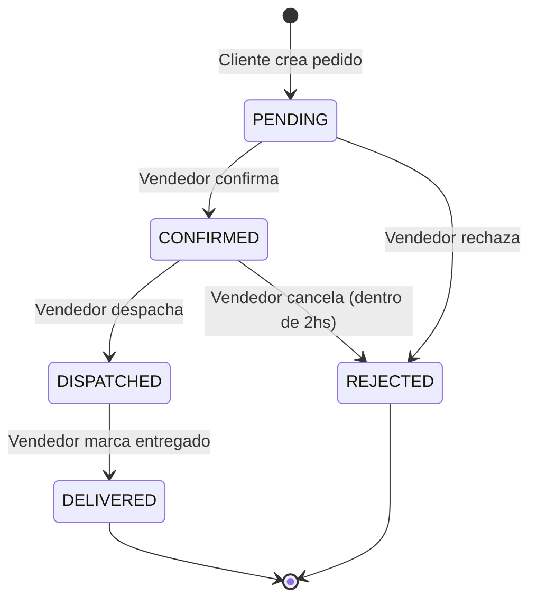

> [!WARNING]
> La transición `CONFIRMED → REJECTED` solo es posible dentro de las primeras **2 horas** de confirmación. Pasado ese tiempo, el pedido debe completarse o escalarse a soporte.

**Filtros disponibles:**

| Filtro | Valores |
|--------|---------|
| Estado | `PENDING`, `CONFIRMED`, `DISPATCHED`, `DELIVERED`, `REJECTED` |
| Período | Hoy, Ayer, Últimos 7 días, Este mes |
| Pago | Efectivo, Yape, Plin, Transferencia, Tarjeta |
| Entrega | Pickup, Delivery |

**✅ Criterios de aceptación**

- [ ] **AC1** — La lista respeta los 4 filtros (estado, período, pago, entrega) combinables simultáneamente
- [ ] **AC2** — Los filtros persisten al navegar al detalle y volver con `[← Volver]`
- [ ] **AC3** — Las transiciones respetan la máquina de estados: `PENDING → CONFIRMED/REJECTED`, `CONFIRMED → DISPATCHED/REJECTED`, `DISPATCHED → DELIVERED`
- [ ] **AC4** — La transición `CONFIRMED → REJECTED` solo es posible dentro de 2h (validación en backend, no solo frontend)
- [ ] **AC5** — El motivo de rechazo es obligatorio con mínimo 10 caracteres
- [ ] **AC6** — Al confirmar un pedido, el stock de cada producto se descuenta automáticamente
- [ ] **AC7** — Cada transición dispara notificación al cliente (email + WhatsApp según config del vendedor)
- [ ] **AC8** — La paginación es server-side con `?page=&limit=` y preserva filtros activos
- [ ] **AC9** — Un CASHIER puede hacer todas las transiciones; WAREHOUSE no ve este módulo
- [ ] **AC10** — El TAG de estado se colorea según la tabla de colores (PENDING amarillo, CONFIRMED azul, etc.)
- [ ] **AC11** — Intentar una transición inválida (ej: PENDING → DELIVERED) retorna 400 con mensaje claro
- [ ] **AC12** — Si Plan Pro+ y SUNAT configurado, marcar DELIVERED emite comprobante automáticamente
- [ ] **AC13** — Mobile: swipe derecha en card PENDING confirma; swipe izquierda rechaza (con confirm dialog)

---

### M3 — Gestión de Productos e Inventario

CRUD completo de productos de la tienda. Incluye stock, imágenes, categorías, presentación básica y carga masiva.

**Vistas:**
- Listado con búsqueda, filtro por categoría, estado y nivel de stock
- Formulario de creación/edición (datos, precio, presentación, stock, imágenes)
- Vista de stock bajo con edición rápida de cantidad
- Modal de importación masiva (CSV/Excel)

**Endpoints:**
- `GET /stores/:id/products?page=&limit=&search=&categoryId=`
- `POST /stores/:id/products`
- `PUT /products/:id`
- `DELETE /products/:id` *(soft delete)*
- `PUT /products/:id/stock`
- `POST /products/:id/images` *(Cloudinary)*
- `POST /stores/:id/products/import` *(CSV/Excel — MVP)*
- `GET /stores/:id/products/export` *(CSV — MVP)*

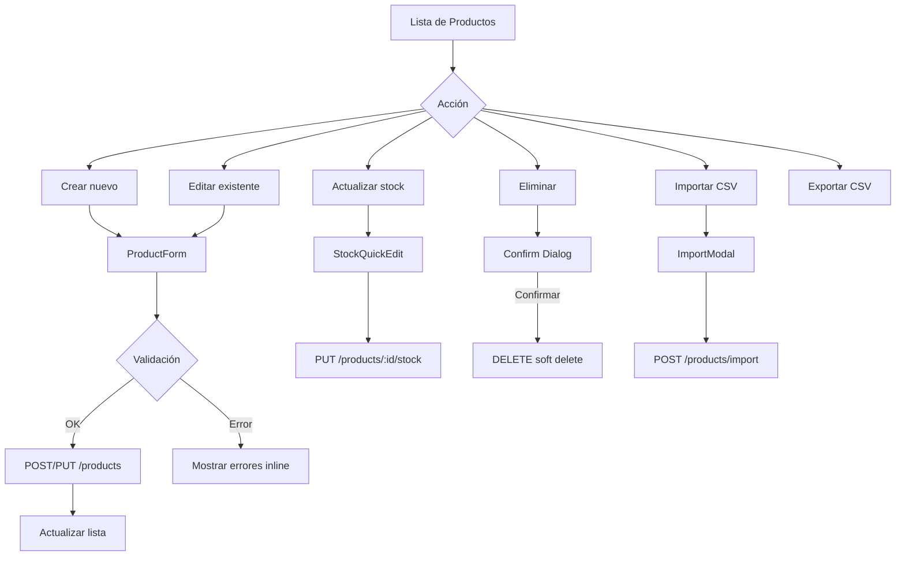

> [!NOTE]
> El `DELETE` es un **soft delete** — el producto se marca como `isActive: false` y desaparece del catálogo público, pero queda en el historial de pedidos.

> [!TIP]
> El límite de productos activos depende del plan de suscripción. Si el vendedor alcanza el límite, el botón "Crear producto" se deshabilita y muestra un prompt de upgrade.

**Campo "Presentación" (MVP — variantes básicas):**
Campo de texto libre para indicar la presentación del producto. Ej: `"500ml"`, `"1kg"`, `"Pack x6"`. No genera SKUs separados — es informativo para el comprador. Las variantes completas con stock y precio independiente se implementan en v2.

**✅ Criterios de aceptación**

- [ ] **AC1** — CRUD completo con validaciones: nombre min 3 / max 100, precio regular > 0, precio descuento < precio regular, stock ≥ 0 entero
- [ ] **AC2** — DELETE es soft delete (`isActive=false`); el producto desaparece del catálogo público pero queda en historial de pedidos
- [ ] **AC3** — Imágenes se suben a Cloudinary con límite 2MB, formatos JPG/PNG/WebP, máx 5 por producto
- [ ] **AC4** — El SKU es opcional pero único dentro de la tienda (validación backend retorna 409 si duplicado)
- [ ] **AC5** — Import CSV acepta hasta 500 filas y hace upsert por SKU
- [ ] **AC6** — El reporte post-import muestra fila, campo y motivo de error por cada fila inválida
- [ ] **AC7** — Al alcanzar el límite del plan, el botón "Crear producto" se deshabilita + prompt de upgrade
- [ ] **AC8** — Al actualizar stock a 0, `isAvailable` se marca false automáticamente
- [ ] **AC9** — Al cruzar el umbral `stockAlert`, se dispara notificación "Low stock" (según config del vendedor)
- [ ] **AC10** — La búsqueda tiene debounce de 400ms y es case-insensitive + accent-insensitive
- [ ] **AC11** — El rol WAREHOUSE solo puede ver productos y actualizar stock; no puede CRUD completo
- [ ] **AC12** — Si Cloudinary falla → el producto se guarda sin imagen + toast "La imagen no se pudo subir" (no bloqueante)
- [ ] **AC13** — Selección múltiple permite eliminar hasta 50 productos en una sola operación

---

### M4 — Configuración de Tienda

Personalización del perfil público de la tienda y parámetros operativos.

**Secciones:**
- **Perfil** — nombre, descripción, logo, banner, dirección, teléfono, WhatsApp, slug
- **Horarios** — horarios de atención por día de la semana + cierre temporal por feriado
- **Delivery (MVP)** — radio de cobertura (km), costo de envío, monto mínimo, delivery gratis desde
- **Métodos de pago** — cuáles acepta la tienda (efectivo, Yape, Plin, transferencia, tarjeta) + mensaje personalizado por método

**Endpoints:**
- `PUT /stores/:id` — perfil general
- `PUT /stores/:id/hours`
- `PUT /stores/:id/delivery`
- `PUT /stores/:id/payment-methods`
- `POST /stores/:id/logo` *(Cloudinary)*
- `POST /stores/:id/banner` *(Cloudinary)*

> [!IMPORTANT]
> El logo y el banner se suben a **Cloudinary**. El backend almacena solo la URL pública. Límites: logo 500KB, banner 2MB. Formatos: JPG, PNG, WebP.

> [!NOTE]
> **v2 — Geofencing:** La sección Delivery en v2 reemplaza el slider de radio por una herramienta para dibujar polígonos en un mapa (Google Maps / Mapbox). Cada polígono tendrá un precio de envío asociado. Se almacena como GeoJSON en PostgreSQL con extensión PostGIS. El checkout validará si la lat/lng del cliente cae dentro de algún polígono de cobertura.

**✅ Criterios de aceptación**

- [ ] **AC1** — Cada tab (Perfil, Horarios, Delivery, Pagos, Facturación) guarda independientemente
- [ ] **AC2** — Logo se sube a Cloudinary con límite 500KB; banner con límite 2MB; ambos permiten JPG/PNG/WebP
- [ ] **AC3** — El slug se valida en tiempo real con debounce 800ms; debe ser único global, kebab-case, sin espacios
- [ ] **AC4** — El toggle "Feriado hoy" tiene efecto inmediato en el catálogo público (tienda aparece como cerrada)
- [ ] **AC5** — El toggle Delivery muestra/oculta campos dependientes con animación
- [ ] **AC6** — El tab Facturación muestra estado "gated" cuando el vendedor está en Plan Gratuito
- [ ] **AC7** — El OSE Token se guarda encriptado AES-256 at-rest y nunca retorna al frontend tras guardar (solo `****`)
- [ ] **AC8** — Cambios no guardados al cambiar de tab disparan prompt "¿Descartar cambios?"
- [ ] **AC9** — El rol CASHIER no ve este módulo; sidebar oculta el ítem + backend retorna 403 si se manipula URL
- [ ] **AC10** — Los horarios permiten toggle por día y rangos válidos (hora fin > hora inicio)
- [ ] **AC11** — Dirección se valida con formato básico (no vacío, min 10 chars) — no se geocodifica en MVP
- [ ] **AC12** — Al cambiar métodos de pago, el checkout público refleja los cambios en <60s

---

### M5 — Analytics y Reportes

Visualización de métricas de negocio para la toma de decisiones.

**Métricas disponibles:**
- Ventas por período (diario, semanal, mensual, anual, rango personalizado)
- Top 10 productos más vendidos (unidades + ingresos)
- Ticket promedio
- Tasa de pedidos rechazados
- Ingresos por método de pago
- Embudo de conversión (v2)
- Mapa de calor por barrio (v2)

**Endpoints:**
- `GET /vendor/analytics?period=daily|weekly|monthly|yearly&from=&to=`
- `GET /vendor/reports/sales?format=csv|pdf&period=X&from=&to=`

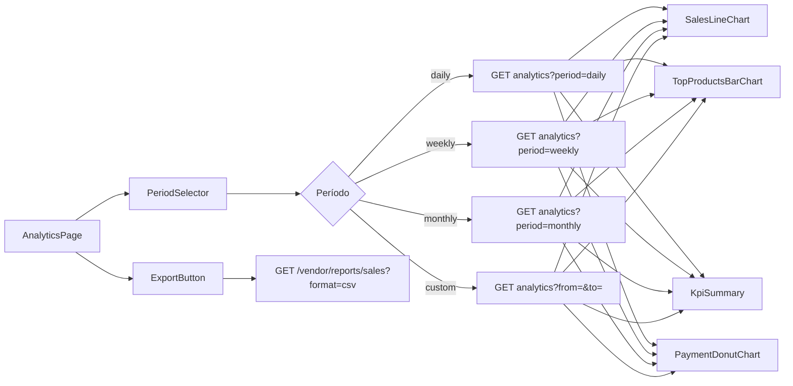

> [!NOTE]
> Los gráficos usan **Chart.js** via `ng2-charts`. Los reportes exportables en CSV/PDF cubren el caso de análisis profundo para el MVP.

**Disponibilidad por plan:**

| Métrica | Gratuito | Pro | Enterprise |
|---------|----------|-----|------------|
| Dashboard resumen | ✅ | ✅ | ✅ |
| Analytics diario/semanal | ✅ | ✅ | ✅ |
| Analytics mensual/anual | ❌ | ✅ | ✅ |
| Rango personalizado | ❌ | ✅ | ✅ |
| Exportar CSV | ❌ | ✅ | ✅ |
| Exportar PDF | ❌ | ❌ | ✅ |

**✅ Criterios de aceptación**

- [ ] **AC1** — Los 4 períodos (Hoy / Semana / Mes / Año) y el rango custom (con date pickers) funcionan
- [ ] **AC2** — Los gráficos se renderizan con datos reales del `storeId` del usuario
- [ ] **AC3** — Export CSV descarga archivo con encoding UTF-8 y separador `,`; PDF solo en Enterprise
- [ ] **AC4** — La disponibilidad por plan se respeta en frontend (UI) y backend (403 si se pide un período no permitido)
- [ ] **AC5** — El donut de métodos de pago distribuye el 100% de ingresos; si no hay ventas muestra empty state
- [ ] **AC6** — La tasa de rechazo se calcula como `rejected / (rejected + delivered) × 100`, redondeada a 1 decimal
- [ ] **AC7** — Los gráficos muestran tooltip con valor exacto en hover (desktop) y tap (mobile)
- [ ] **AC8** — Click en barra del top productos navega a `/vendor/products/:id/edit`
- [ ] **AC9** — Los KPIs comparan contra período anterior equivalente (ej: esta semana vs semana anterior) mostrando % con flecha ↑↓
- [ ] **AC10** — Si no hay datos en el período seleccionado, cada gráfico muestra empty state con texto claro
- [ ] **AC11** — Solo STORE_OWNER y MANAGER acceden; CASHIER/WAREHOUSE reciben 403

---

### M6 — Clientes (CRM básico)

Directorio de compradores que realizaron pedidos en la tienda.

**Vistas:**
- Lista de clientes con total de pedidos, monto total y último pedido
- Detalle de cliente: datos + historial de pedidos en esta tienda + estadísticas

**Endpoints:**
- `GET /vendor/customers?storeId=&search=`
- `GET /vendor/customers/:id/orders`

> [!WARNING]
> Por privacidad (LGPD), el vendedor solo puede ver el nombre, email y teléfono del cliente, más su historial de compras **en su propia tienda**. No tiene acceso a pedidos en otras tiendas ni a datos sensibles.

**v2 — Fidelización:**
- Segmentación de clientes (frecuentes, inactivos, nuevos)
- Exportar lista de clientes (CSV)
- Historial de cupones usados por cliente
- Notas privadas del vendedor sobre el cliente

**✅ Criterios de aceptación**

- [ ] **AC1** — La búsqueda acepta nombre o email con debounce 400ms
- [ ] **AC2** — Solo se muestran clientes que realizaron al menos 1 pedido en la tienda (no todos los usuarios de Tiendi)
- [ ] **AC3** — El detalle muestra únicamente pedidos dentro de esta tienda (LGPD compliance — nunca mostrar pedidos en otras tiendas)
- [ ] **AC4** — El total gastado es la suma de `total` de pedidos DELIVERED (excluye REJECTED y PENDING)
- [ ] **AC5** — El orden por columnas "Pedidos" y "Total" funciona client-side
- [ ] **AC6** — Click en un pedido del historial navega a `/vendor/orders/:id`
- [ ] **AC7** — La fecha "Cliente desde" es la fecha del primer pedido realizado en esta tienda
- [ ] **AC8** — No hay acción de editar ni eliminar cliente (vista solo lectura)
- [ ] **AC9** — Solo STORE_OWNER y MANAGER acceden a este módulo

---

### M7 — Notificaciones

Centro de alertas operativas del vendedor.

**Tipos de notificaciones:**
| Tipo | Ícono | Descripción |
|------|-------|-------------|
| Nuevo pedido | 🛒 | Se recibió un pedido nuevo |
| Stock bajo | ⚠️ | Producto llegó al umbral mínimo |
| Pago confirmado | ✅ | Pago manual validado por el sistema |
| Pedido sin atender | ⏰ | Pedido PENDING sin acción por más de X minutos |
| Plan por vencer | 💳 | Suscripción vence en 7/3/1 días |
| Tienda aprobada | 🏪 | Super admin aprobó la tienda |

**Canales por tipo (configurables por el vendedor):**

| Tipo | In-app | Email | WhatsApp |
|------|--------|-------|----------|
| Nuevo pedido | ✅ ON | ✅ ON | ✅ ON |
| Stock bajo | ✅ ON | ✅ ON | ❌ OFF |
| Sin atender | ✅ ON | ❌ OFF | ✅ ON |
| Plan por vencer | ✅ ON | ✅ ON | ❌ OFF |

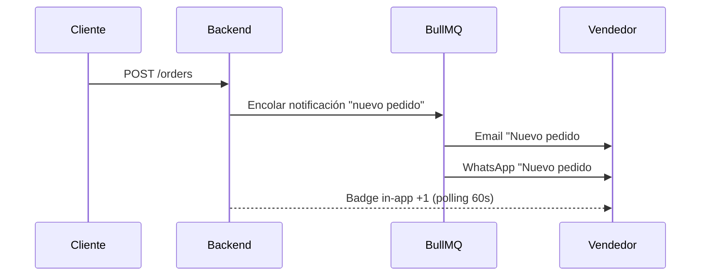

**✅ Criterios de aceptación**

- [ ] **AC1** — El badge en topbar muestra el count de notificaciones no leídas (máx "99+")
- [ ] **AC2** — Tap en notificación no leída la marca como leída y navega al recurso relacionado
- [ ] **AC3** — "Marcar todo ✓" marca todas como leídas con una sola llamada `PUT /vendor/notifications/read-all`
- [ ] **AC4** — Los 6 tipos de notificaciones (nuevo pedido, stock bajo, pago confirmado, sin atender, plan vence, tienda aprobada) se disparan según triggers documentados
- [ ] **AC5** — La configuración por canal (in-app/email/WhatsApp) se respeta al encolar notificaciones en BullMQ
- [ ] **AC6** — Los tabs (Todas, Sin leer, Pedidos, Stock, Sistema) filtran client-side sin reload
- [ ] **AC7** — Infinite scroll carga siguiente página automáticamente al llegar al fondo del listado
- [ ] **AC8** — El drawer de configuración guarda con `PUT /vendor/notification-settings` y persiste al reload
- [ ] **AC9** — Si SendGrid/Twilio fallan, la notificación queda encolada en BullMQ con retry (3 intentos)
- [ ] **AC10** — Las notificaciones expiran en la UI después de 90 días (backend las archiva)
- [ ] **AC11** — Un EMPLOYEE ve solo las notificaciones relevantes a sus permisos (ej: un WAREHOUSE solo ve "stock bajo")

---

### M8 — Suscripción y Plan

Gestión del plan activo de la tienda y su ciclo de facturación.

**Vistas:**
- Plan actual con indicadores de uso (productos activos / pedidos del mes)
- Comparativa de planes disponibles
- Historial de pagos
- Flujo de upgrade / downgrade / cancelación

**Endpoints:**
- `GET /subscriptions/my`
- `GET /subscription-plans`
- `POST /subscriptions` — cambiar de plan
- `DELETE /subscriptions/my` — cancelar plan

**Planes disponibles:**

| Plan | Precio | Productos | Pedidos/mes | Analytics | Soporte | Staff | Facturación SUNAT |
|------|--------|-----------|-------------|-----------|---------|-------|-------------------|
| **Gratuito** | S/ 0 | 20 | 50 | Básico | Email | 1 (solo dueño) | ❌ No incluida |
| **Pro** | S/ 49 | 200 | Ilimitado | Avanzado | Chat | 5 | ✅ Incluida |
| **Enterprise** | S/ 149 | Ilimitado | Ilimitado | Full + Export | Dedicado | Ilimitado | ✅ Incluida |

**Trial del Plan Pro — 14 días sin tarjeta**

Al completar el onboarding, el vendedor recibe automáticamente **14 días gratis del Plan Pro** sin pedirle tarjeta de crédito. Esto permite que pruebe el valor completo (facturación SUNAT, analytics avanzado, 200 productos, 5 empleados) antes de decidir pagar.

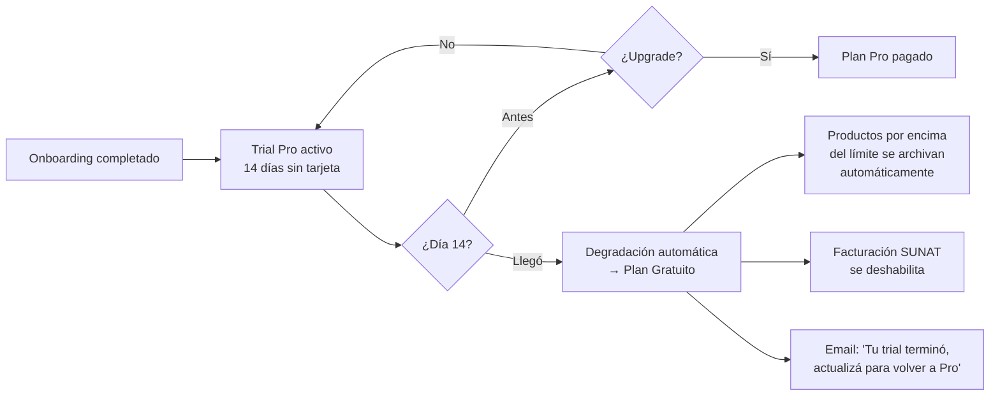

**Reglas del trial:**

| Regla | Detalle |
|-------|---------|
| **Duración** | 14 días corridos desde la activación |
| **Elegibilidad** | Solo tiendas que completaron onboarding; 1 trial único por tienda (no se puede re-activar) |
| **Requisito de tarjeta** | Ninguno — friction-free |
| **Features incluidas** | TODAS las del Plan Pro (200 prods, staff ×5, SUNAT, analytics avanzado) |
| **Notificaciones** | Día 7 (recordatorio "llevás 7 días, ¿qué tal la experiencia?"), Día 12 (CTA de upgrade), Día 14 (degradación) |
| **Conversión** | Si upgradea durante el trial → cobro inmediato + extensión del ciclo desde la fecha de upgrade |
| **Expiración** | Día 14 a las 00:00 UTC−5 (hora Perú) → degradación automática a Gratuito |

**Comportamiento al degradarse:**

- **Productos por encima de 20:** los más recientes se mantienen activos, el resto se archivan automáticamente (`isActive=false`). El vendedor puede reactivarlos al upgradear.
- **Staff por encima de 1:** los empleados se desactivan en orden de invitación (último invitado, primero desactivado). Se reactivan al upgradear.
- **Facturación SUNAT:** se deshabilita; los comprobantes ya emitidos quedan en el historial.
- **Banner permanente:** "Tu trial terminó. Actualizá a Pro para recuperar tus productos y empleados archivados."

> [!IMPORTANT]
> El **Plan Gratuito NO incluye emisión de comprobantes electrónicos (boletas/facturas SUNAT)**. Es un plan de prueba y onboarding — el vendedor puede recibir pedidos y operar, pero debe emitir sus comprobantes por fuera del sistema (manualmente o con su proveedor actual). Para operación legal plena, se requiere el Plan Pro o Enterprise.

> [!IMPORTANT]
> El **downgrade** solo aplica al siguiente ciclo de facturación. Reglas específicas:
> - Si el vendedor tiene **más productos activos** que el límite del plan destino → debe archivarlos antes
> - Si el vendedor tiene **más staff activo** que el límite del plan destino → debe desactivar empleados antes
> - Al pasar a **Gratuito desde Pro/Enterprise** → la facturación SUNAT queda deshabilitada al siguiente ciclo; los comprobantes ya emitidos se conservan en el historial
>
> La **cancelación** mantiene el plan activo hasta el fin del período pagado.

**✅ Criterios de aceptación**

- [ ] **AC1** — La vista muestra plan actual con fecha de próxima renovación y uso vs límites (productos, pedidos, staff)
- [ ] **AC2** — Las barras de uso cambian a color `danger` cuando se alcanza el 100% del límite
- [ ] **AC3** — Upgrade aplica inmediatamente y dispara cobro por la pasarela configurada
- [ ] **AC4** — Downgrade se programa para el siguiente ciclo; valida que cantidad actual de productos activos, staff y pedidos entren en el plan destino
- [ ] **AC5** — Si el downgrade no es viable (ej: tiene 100 productos y el plan destino permite 20) → muestra dialog con lista de items a archivar
- [ ] **AC6** — Cancelación mantiene el plan activo hasta el fin del período pagado; no hay reembolso parcial
- [ ] **AC7** — El historial de pagos muestra al menos los últimos 12 meses con estado (Pagado / Fallido / Pendiente)
- [ ] **AC8** — Plan Gratuito muestra banner persistente recordando emisión manual de comprobantes
- [ ] **AC9** — El botón `[Cambiar plan]` hace scroll suave a la sección "Planes disponibles"
- [ ] **AC10** — Solo STORE_OWNER puede ver y modificar este módulo; todos los demás roles reciben 403
- [ ] **AC11** — Al pasar a Gratuito desde Pro/Enterprise, la facturación SUNAT queda deshabilitada al siguiente ciclo; comprobantes históricos se conservan
- [ ] **AC12** — Trial Pro se activa automáticamente al completar onboarding (14 días, sin tarjeta, una sola vez por tienda)
- [ ] **AC13** — Durante el trial, el vendedor tiene acceso a TODAS las features del Plan Pro
- [ ] **AC14** — Notificaciones de trial se disparan en día 7, 12 y 14 con CTAs progresivos
- [ ] **AC15** — Al expirar el trial sin upgrade, la tienda degrada a Gratuito y se archivan productos/staff excedentes
- [ ] **AC16** — Si el vendedor upgradea durante el trial, el cobro es inmediato y el ciclo empieza desde ese día (no pierde los días restantes del trial)
- [ ] **AC17** — Productos y staff archivados por degradación se restauran automáticamente si el vendedor upgradea a Pro

---

### M9 — Staff y Empleados

Gestión de colaboradores y sus permisos dentro de la tienda.

**Roles de staff:**

| Rol | Descripción |
|-----|-------------|
| `STORE_OWNER` | Dueño: acceso total |
| `MANAGER` | Gerente: acceso a todo excepto facturación y cancelación de plan |
| `CASHIER` | Cajero: solo puede ver y gestionar pedidos |
| `WAREHOUSE` | Depósito: solo puede actualizar stock de productos |

**Vistas:**
- Lista de empleados con rol y estado (activo / inactivo)
- Formulario de invitación (email + rol)
- Detalle de empleado con historial de acciones (v2)

**Endpoints:**
- `GET /stores/:id/employees`
- `POST /stores/:id/employees` — invitar por email
- `PUT /stores/:id/employees/:userId` — cambiar rol
- `DELETE /stores/:id/employees/:userId` — remover empleado

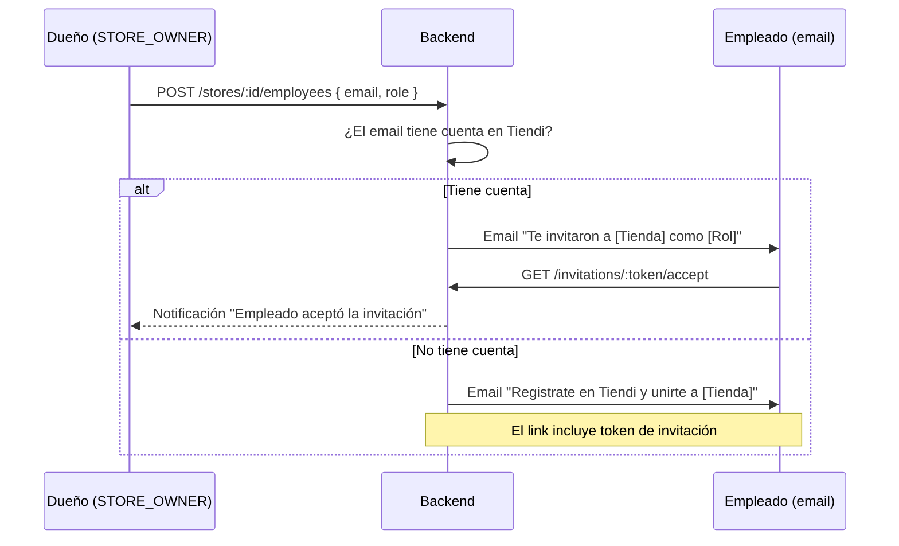

**Matriz de permisos:**

| Módulo | STORE_OWNER | MANAGER | CASHIER | WAREHOUSE |
|--------|:-----------:|:-------:|:-------:|:---------:|
| Dashboard | ✅ | ✅ | ✅ | ❌ |
| Pedidos — ver | ✅ | ✅ | ✅ | ❌ |
| Pedidos — gestionar | ✅ | ✅ | ✅ | ❌ |
| Productos — ver | ✅ | ✅ | ❌ | ✅ |
| Productos — editar | ✅ | ✅ | ❌ | ✅ |
| Stock — actualizar | ✅ | ✅ | ❌ | ✅ |
| Configuración tienda | ✅ | ✅ | ❌ | ❌ |
| Analytics | ✅ | ✅ | ❌ | ❌ |
| Clientes | ✅ | ✅ | ❌ | ❌ |
| Staff | ✅ | ❌ | ❌ | ❌ |
| Suscripción | ✅ | ❌ | ❌ | ❌ |
| Facturación | ✅ | ✅ | ❌ | ❌ |

> [!IMPORTANT]
> Los permisos se validan en el **backend** en cada endpoint — no solo en el frontend. Un CASHIER que manipule la URL para acceder a `/vendor/analytics` debe recibir un `403 Forbidden`.

**✅ Criterios de aceptación**

- [ ] **AC1** — El STORE_OWNER puede invitar empleados por email; el token de invitación expira en 72h
- [ ] **AC2** — Si el email no tiene cuenta en Tiendi, el link de invitación incluye registro pre-cargado con el email
- [ ] **AC3** — La matriz de permisos se valida en cada endpoint del backend (un CASHIER accediendo a `/vendor/analytics` recibe 403)
- [ ] **AC4** — Cambio de rol afecta al próximo login del empleado (su token actual sigue válido hasta expirar)
- [ ] **AC5** — Remover empleado deshabilita su acceso inmediatamente (el token queda invalidado aunque no haya expirado)
- [ ] **AC6** — El límite de slots por plan se respeta: al alcanzar el límite, botón "Invitar" se deshabilita + tooltip de upgrade
- [ ] **AC7** — Solo el STORE_OWNER ve y puede editar este módulo; MANAGER/CASHIER/WAREHOUSE reciben 403
- [ ] **AC8** — Invitaciones pendientes se pueden reenviar (nuevo email, mismo token) o revocar (invalida el token)
- [ ] **AC9** — El empleado invitado recibe email con asunto claro y link con CTA visible
- [ ] **AC10** — Un mismo email no puede tener dos invitaciones activas simultáneamente en la misma tienda
- [ ] **AC11** — La lista muestra estado visible: Activo / Invitación pendiente / Desactivado
- [ ] **AC12** — Un empleado puede trabajar en múltiples tiendas a la vez (relación N:N con rol distinto por tienda)

---

### M10 — Cupones y Descuentos

> **Estado: v2** — No se incluye en el MVP. Se documenta para planificación futura.

El módulo permite al vendedor crear sus propios códigos de descuento para sus clientes.

**Tipos de cupón:**
- Descuento fijo (ej: S/ 10 off)
- Descuento porcentual (ej: 15% off)
- Envío gratis
- Primer pedido (solo para clientes nuevos)

**Configuraciones:**
- Código personalizado o generado automáticamente
- Fecha de inicio / vencimiento
- Límite de usos totales
- Límite de usos por cliente
- Monto mínimo de compra
- Aplicable a: todos los productos / categorías específicas / productos específicos

**Endpoints (v2):**
- `GET /stores/:id/coupons`
- `POST /stores/:id/coupons`
- `PUT /coupons/:id`
- `DELETE /coupons/:id`
- `GET /coupons/:code/validate?storeId=&cartTotal=` *(usado por el checkout público)*

---

### M11 — Facturación y Legal

> **Estado: OBLIGATORIO — MVP** — Requerido por ley para operar en Perú.
>
> **Disponibilidad por plan:**
> - ⚠️ **Plan Gratuito** — ver sección 11.0 "Modelo legal del Plan Gratuito" (**PENDIENTE DE VALIDACIÓN LEGAL**)
> - ✅ **Plan Pro y Enterprise** — emisión completa de boletas y facturas

#### 11.0 Modelo legal del Plan Gratuito

> [!CAUTION]
> **⛔ BLOQUEADO — Requiere validación de abogado peruano antes de implementar.**
> Esta sección documenta dos modelos alternativos. El equipo legal debe elegir uno (o proponer un tercero) antes de que el Plan Gratuito se habilite en producción.

**Contexto del problema:**
SUNAT obliga a emitir comprobante de venta (boleta o factura) en toda operación comercial en Perú. Si el Plan Gratuito permite al vendedor recibir pagos por pedidos reales sin incluir emisión automática de comprobantes, Tiendi podría ser considerado **facilitador de informalidad tributaria**, con potencial responsabilidad solidaria.

**Opción A — "Responsabilidad transferida" (actual, más arriesgada):**

El Plan Gratuito permite recibir pedidos y pagos reales. Se muestra un disclaimer explícito antes del primer pedido y en cada DELIVERED, transfiriendo al vendedor la responsabilidad de emitir comprobantes por fuera del sistema. Tiendi conserva logs de aceptación del disclaimer.

**Texto del disclaimer (borrador — pendiente revisión legal):**

> "Al operar en el Plan Gratuito de Tiendi, usted declara conocer que:
> (1) Tiendi **no emite ni procesa comprobantes electrónicos SUNAT** en su nombre bajo este plan.
> (2) Usted es el **único responsable legal** de emitir boletas y/o facturas electrónicas por cada venta concretada, cumpliendo con la Resolución de Superintendencia N° 300-2014/SUNAT y sus modificatorias.
> (3) El incumplimiento de esta obligación puede generar **multas y sanciones** conforme al Código Tributario, que **son de su exclusiva responsabilidad**.
> (4) Para emisión automática de comprobantes, debe actualizar al Plan Pro o superior.
> Al hacer clic en "Acepto y continuar", declaro haber leído y comprendido esta información."

**Opción B — "Modo catálogo" (recomendada por conservadurismo legal):**

El Plan Gratuito se limita a **vitrina digital sin transacciones**. Los pedidos del cliente se envían al vendedor por WhatsApp/email pero **Tiendi no procesa ni media el pago**. Tiendi actúa como mero intermediario de contacto, sin participar de la transacción comercial.

**Diferencias operativas:**

| Feature | Opción A (Responsabilidad transferida) | Opción B (Modo catálogo) |
|---------|----------------------------------------|--------------------------|
| Cliente ve productos | ✅ | ✅ |
| Cliente agrega al carrito en Tiendi | ✅ | ❌ — botón "Consultar por WhatsApp" reemplaza al carrito |
| Cliente paga en Tiendi | ✅ | ❌ — se coordina fuera de plataforma |
| Tiendi registra el pedido | ✅ | ❌ — solo registra "consultas" (leads) |
| Tiendi procesa webhooks de pago | ✅ | ❌ |
| Riesgo legal para Tiendi | Alto — requiere disclaimer robusto + logs | Bajo — Tiendi es intermediario de contacto |
| Fricción de upgrade a Pro | Baja | Media-alta (cambio operativo para el vendedor) |

**Checklist para la revisión legal (preguntas al abogado):**

- [ ] ¿El disclaimer de Opción A es legalmente suficiente para transferir la responsabilidad tributaria al vendedor? ¿Protege a Tiendi frente a SUNAT?
- [ ] ¿Qué evidencia de aceptación del disclaimer se necesita conservar? (timestamp, IP, hash de firma digital)
- [ ] ¿Existe jurisprudencia peruana sobre responsabilidad solidaria de plataformas que intermedian ventas sin emitir comprobantes?
- [ ] ¿El "modo catálogo" de Opción B realmente evita la intermediación comercial, o SUNAT igual podría considerar a Tiendi responsable?
- [ ] ¿Hay un umbral de facturación mensual bajo el cual el vendedor está exento de emitir comprobantes (Nuevo RUS)? Si existe, ¿se puede declarar el Plan Gratuito apto solo para ese segmento?
- [ ] ¿El banner permanente en el Dashboard debe incluir texto específico exigido por INDECOPI bajo Ley 29571?
- [ ] ¿Qué redacción debe tener el email de onboarding para ser legalmente vinculante?
- [ ] ¿Hay implicancias para la Ley 29733 (Protección de Datos Personales) al compartir el contacto del cliente con el vendedor sin transacción intermediada?

> [!IMPORTANT]
> **Recomendación técnica (no legal):** La Opción B ("modo catálogo") reduce el riesgo sustancialmente pero también reduce el valor percibido del Plan Gratuito como "probador" de todas las features de Tiendi. Un híbrido razonable puede ser: Plan Gratuito = modo catálogo durante los primeros 30 días; al llegar al trial Pro, se habilitan transacciones reales por 14 días; al expirar el trial sin upgrade, vuelve a modo catálogo.

#### 11.1 Facturación Electrónica (SUNAT)

Integración para emitir comprobantes electrónicos al concretar una venta.
**Requiere Plan Pro o Enterprise activo.**

**Tipos de comprobante:**
- **Boleta de Venta Electrónica** — para consumidores finales (personas naturales)
- **Factura Electrónica** — para empresas (requieren RUC del cliente)

**Flujo de emisión:**

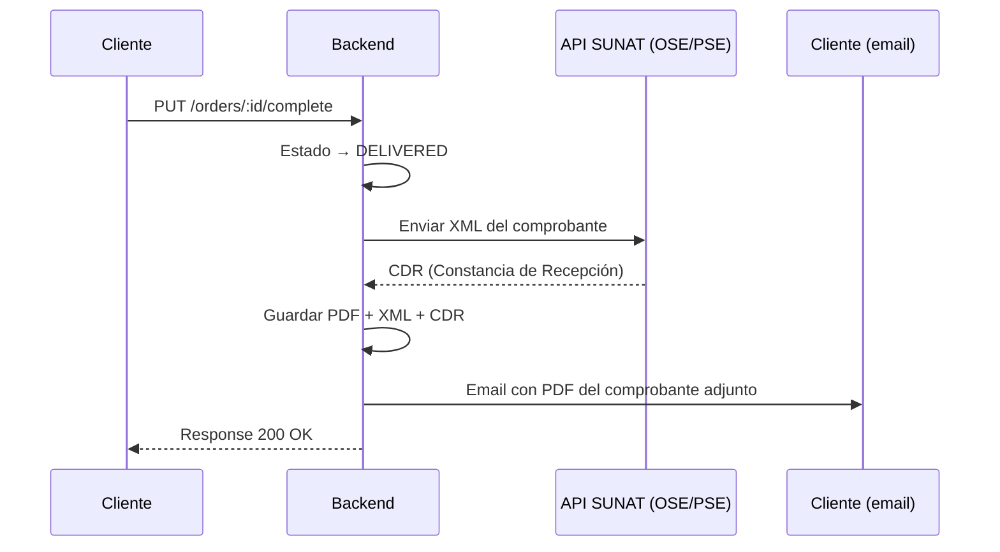

**Campos requeridos para la emisión:**
- RUC del vendedor (configurado en perfil de tienda)
- Razón social del vendedor
- Dirección fiscal del vendedor
- Nombre/RUC del comprador (si pide factura)
- Detalle de productos con IGV desglosado

**Endpoints:**
- `POST /invoices/emit` — emitir comprobante post-entrega
- `GET /invoices?orderId=` — consultar comprobante de un pedido
- `GET /invoices/:id/pdf` — descargar PDF
- `GET /invoices/:id/xml` — descargar XML
- `GET /vendor/invoices?from=&to=` — historial de comprobantes del vendedor

**Integración recomendada:** Proveedor OSE/PSE como **Nubefact**, **FacturaloPerú** o **Efact** — abstraen la comunicación directa con SUNAT.

> [!IMPORTANT]
> Los comprobantes emitidos **no pueden modificarse ni eliminarse**. Si hay un error, se emite una Nota de Crédito. Todo esto es obligación del proveedor OSE.

**Configuración en el panel (sección dentro de M4 — Configuración de Tienda):**

```
┌──────────────────────────────────────────────────────────┐
│  Facturación Electrónica                                  │
│                                                          │
│  RUC *                                                   │
│  [INPUT: 20XXXXXXXXX              ]                      │
│                                                          │
│  Razón Social *                                          │
│  [INPUT: Bodega Don Carlos E.I.R.L.]                     │
│                                                          │
│  Dirección Fiscal *                                      │
│  [INPUT: Jr. Tarapacá 340, Barranco, Lima]               │
│                                                          │
│  Régimen Tributario                                      │
│  [SELECT: RUS / Régimen Especial / MYPE / General ▼]    │
│                                                          │
│  Credenciales OSE (Nubefact / Efact / etc.)             │
│  Token de API: [INPUT: ****************************]     │
│                                                          │
│  [TOGGLE: Emitir comprobante automáticamente al         │
│           marcar pedido como entregado]                  │
│                                                          │
│  Número de serie por tipo:                              │
│  Boleta: [INPUT: B001]   Factura: [INPUT: F001]         │
│                                                          │
│                        [BTN: Guardar configuración]      │
└──────────────────────────────────────────────────────────┘
```

#### 11.2 Libro de Reclamaciones Digital

Obligatorio por INDECOPI (Ley N° 29571 — Código de Protección al Consumidor).

**Flujo:**

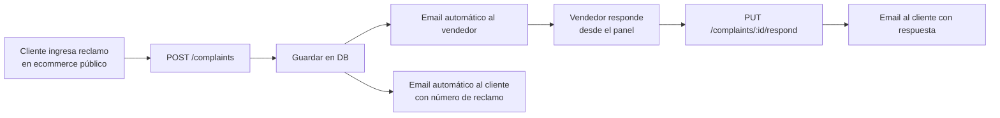

**Plazo legal:** 30 días hábiles para responder. El sistema debe alertar cuando se acerca el vencimiento.

**Vistas en el panel:**
- Lista de reclamaciones con estado (Pendiente, En revisión, Respondido, Cerrado)
- Detalle de reclamo + formulario de respuesta
- Badge en sidebar si hay reclamos pendientes

**Endpoints:**
- `GET /vendor/complaints?storeId=`
- `GET /complaints/:id`
- `PUT /complaints/:id/respond`
- `PUT /complaints/:id/close`

**Campos del reclamo (completados por el cliente):**
- Tipo: Reclamo (disconformidad con servicio/producto) o Queja (disconformidad con atención)
- Descripción del bien contratado
- Detalle del reclamo/queja
- Pedido de acción al proveedor
- Datos del consumidor (nombre, DNI, email, teléfono)

**✅ Criterios de aceptación**

- [ ] **AC1** — La emisión SUNAT solo está disponible en Plan Pro y Enterprise (backend retorna 402 si Plan Gratuito intenta `POST /invoices/emit`)
- [ ] **AC2** — En Plan Gratuito, el tab de Facturación muestra estado gated con CTA de upgrade
- [ ] **AC3** — Con toggle "Emitir automáticamente" ON, al marcar DELIVERED se emite comprobante sin intervención del vendedor
- [ ] **AC4** — Si el OSE rechaza el XML, el comprobante queda en estado "Pendiente" + botón "Reintentar emisión" + alerta al vendedor
- [ ] **AC5** — El cliente recibe el PDF del comprobante por email dentro de los 5 minutos posteriores al DELIVERED exitoso
- [ ] **AC6** — Los comprobantes emitidos son inmutables: no se puede editar ni eliminar (correcciones vía Nota de Crédito en v2)
- [ ] **AC7** — El Libro de Reclamaciones alerta cuando un reclamo tiene ≤5 días hábiles para vencer (badge rojo + notificación)
- [ ] **AC8** — Los reclamos respondidos o cerrados salen del badge de alertas
- [ ] **AC9** — CASHIER y WAREHOUSE no ven este módulo; STORE_OWNER y MANAGER sí
- [ ] **AC10** — El filtro de comprobantes por tipo (Boleta/Factura) y rango de fechas funciona en listado
- [ ] **AC11** — El OSE Token se guarda encriptado AES-256 y nunca se expone al frontend tras guardar
- [ ] **AC12** — El plazo legal de respuesta de reclamos (30 días hábiles) se calcula excluyendo sábados, domingos y feriados peruanos
- [ ] **AC13** — El número correlativo de boleta/factura se incrementa de forma atómica por serie (sin duplicados ni saltos)
- [ ] **AC14** — La respuesta a un reclamo dispara email al cliente con el contenido completo de la respuesta

---

## 4. Onboarding — Primera configuración

Cuando el vendedor entra al panel por primera vez (después de que el Super Admin aprobó su tienda), se muestra un wizard de configuración inicial. El objetivo: **tener la tienda lista para vender en menos de 5 minutos**.

### Flujo completo de registro y aprobación

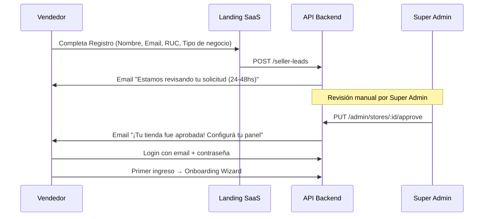

### Pantalla de Onboarding

**Ruta:** `/vendor/setup`
**Acceso:** Solo si `store.onboardingCompleted === false`. Después de completarlo, redirige a `/vendor/dashboard`.

```
┌─────────────────────────────────────────────────────────┐
│  ¡Bienvenido a Tiendi, Carlos! 🎉                       │
│  Configuremos tu tienda en 4 pasos simples.             │
│                                                         │
│  ●─────○─────○─────○                                    │
│  Paso 1 de 4                                            │
├─────────────────────────────────────────────────────────┤
│                                                         │
│  PASO 1 — Perfil de tu tienda                          │
│                                                         │
│  Logo de la tienda                                      │
│  ┌───────────────┐                                      │
│  │     🏪        │  [BTN: Subir logo]                   │
│  │   200×200     │  JPG, PNG, WebP — máx 500KB          │
│  └───────────────┘                                      │
│                                                         │
│  Nombre de la tienda *                                  │
│  [INPUT: Bodega Don Carlos           ]                  │
│                                                         │
│  ¿Qué vendés? (Descripción corta)                      │
│  [INPUT: Abarrotes, bebidas y snacks ]                  │
│                                                         │
│  Dirección *                                            │
│  [INPUT: Jr. Tarapacá 340, Barranco  ]                  │
│                                                         │
│  WhatsApp de contacto                                   │
│  [INPUT: +51 999 111 222             ]                  │
│                                                         │
│         [BTN-GHOST: Hacer esto después]  [BTN: Siguiente →]│
└─────────────────────────────────────────────────────────┘
```

```
┌─────────────────────────────────────────────────────────┐
│  ○─────●─────○─────○                                    │
│  Paso 2 de 4                                            │
├─────────────────────────────────────────────────────────┤
│  PASO 2 — Tu primer producto                           │
│                                                         │
│  Agregá al menos un producto para que tu tienda        │
│  aparezca en el catálogo público.                      │
│                                                         │
│  Nombre del producto *                                  │
│  [INPUT: Ej. Leche Gloria 400ml      ]                  │
│                                                         │
│  Precio *                                               │
│  S/ [INPUT: 4.50]                                       │
│                                                         │
│  Stock *                                                │
│  [INPUT: 10]  unidades                                  │
│                                                         │
│  Foto del producto (recomendado)                       │
│  [──────── Arrastrá una imagen ──────]                  │
│                                                         │
│         [BTN-GHOST: Omitir por ahora]  [BTN: Siguiente →]│
└─────────────────────────────────────────────────────────┘
```

```
┌─────────────────────────────────────────────────────────┐
│  ○─────○─────●─────○                                    │
│  Paso 3 de 4                                            │
├─────────────────────────────────────────────────────────┤
│  PASO 3 — Horarios y delivery                          │
│                                                         │
│  ¿Cuándo abrís? (podés ajustar después)               │
│                                                         │
│  Lun–Vie  [INPUT: 08:00] a [INPUT: 22:00]              │
│  Sáb      [INPUT: 09:00] a [INPUT: 21:00]              │
│  Dom      [TOGGLE: Cerrado]                             │
│                                                         │
│  ¿Ofrecés delivery?                                     │
│  [TOGGLE: SÍ ●]                                         │
│                                                         │
│  Radio de cobertura: [SLIDER: ──●── 3 km]              │
│  Costo de envío: S/ [INPUT: 5.00]                      │
│  Pedido mínimo: S/ [INPUT: 20.00]                      │
│                                                         │
│         [BTN-GHOST: Omitir por ahora]  [BTN: Siguiente →]│
└─────────────────────────────────────────────────────────┘
```

```
┌─────────────────────────────────────────────────────────┐
│  ○─────○─────○─────●                                    │
│  Paso 4 de 4                                            │
├─────────────────────────────────────────────────────────┤
│  PASO 4 — Métodos de pago                              │
│                                                         │
│  ¿Cómo aceptás pagos?                                  │
│                                                         │
│  [TOGGLE: ON ] 💵 Efectivo                              │
│  [TOGGLE: ON ] 📱 Yape                                  │
│  [TOGGLE: OFF] 📱 Plin                                  │
│  [TOGGLE: OFF] 🏦 Transferencia bancaria                │
│  [TOGGLE: OFF] 💳 Tarjeta (requiere Culqi)              │
│                                                         │
│  ┌────────────────────────────────────────────────────┐ │
│  │  ✅ Perfil configurado                             │ │
│  │  ✅ Primer producto agregado                       │ │
│  │  ✅ Horarios y delivery                            │ │
│  │  ○  Métodos de pago (paso actual)                  │ │
│  └────────────────────────────────────────────────────┘ │
│                                                         │
│                    [BTN: ¡Listo! Ver mi panel →]        │
└─────────────────────────────────────────────────────────┘
```

**Checklist de bienvenida (persiste en el Dashboard hasta completarse):**

```
┌──────────────────────────────────────────────────────┐
│  Completá tu tienda — 60% listo                      │
│  [████████████░░░░░░░░]                              │
│                                                      │
│  ✅ Perfil y logo configurados                       │
│  ✅ Primer producto agregado                         │
│  ✅ Horarios configurados                            │
│  ○  Subir banner (mejora la conversión +23%)         │
│  ○  Agregar 5+ productos                             │
│  ○  Configurar facturación electrónica               │
└──────────────────────────────────────────────────────┘
```

---

## 5. Arquitectura de navegación

```mermaid
graph TD
    Login[Login / Landing] --> Guard{VendorGuard}
    Guard -->|No es STORE_OWNER / EMPLOYEE| Redirect[Redirect a /]
    Guard -->|Primera vez| Onboarding[/vendor/setup]
    Guard -->|OK| Dashboard

    Dashboard[Dashboard\n/vendor/dashboard] --> Orders
    Dashboard --> Products
    Dashboard --> Store
    Dashboard --> Analytics
    Dashboard --> Customers
    Dashboard --> Notifications
    Dashboard --> Subscription
    Dashboard --> Staff
    Dashboard --> Legal

    Orders[Pedidos\n/vendor/orders] --> OrderDetail[Detalle\n/vendor/orders/:id]

    Products[Productos\n/vendor/products] --> ProductNew[Nuevo\n/vendor/products/new]
    Products --> ProductEdit[Editar\n/vendor/products/:id/edit]
    Products --> ProductImport[Importar\n/vendor/products/import]

    Store[Tienda\n/vendor/store] --> Store
    Analytics[Analytics\n/vendor/analytics] --> Analytics
    Customers[Clientes\n/vendor/customers] --> CustomerDetail[Detalle\n/vendor/customers/:id]
    Notifications[Notificaciones\n/vendor/notifications] --> OrderDetail
    Subscription[Suscripción\n/vendor/subscription] --> Subscription
    Staff[Staff\n/vendor/staff] --> StaffInvite[Invitar\n/vendor/staff/invite]
    Legal[Facturación\n/vendor/legal] --> Complaints[Reclamos\n/vendor/legal/complaints]
    Legal --> Invoices[Comprobantes\n/vendor/legal/invoices]
```

**Sidebar — navegación completa:**

```
📊  Dashboard
🛒  Pedidos
📦  Productos
🏪  Mi Tienda
📈  Analytics
👥  Clientes
🔔  Notificaciones  [badge]
👨‍💼  Staff
🧾  Facturación y Legal
💳  Plan y Suscripción
────────────────────
⬡   Cerrar sesión
```

> [!NOTE]
> Los ítems del sidebar se muestran u ocultan según el rol del usuario que ha iniciado sesión (ver matriz de permisos en M9).

---

## 6. Flujos de usuario críticos

### 6.1 Registro y Onboarding Inicial

Ver sección [4 — Onboarding](#4-onboarding--primera-configuración).

### 6.2 Ciclo de vida de un pedido

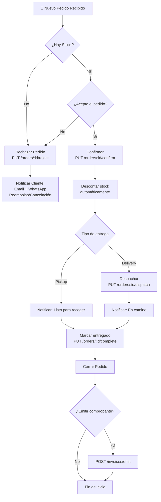

### 6.3 Gestión de inventario y alertas

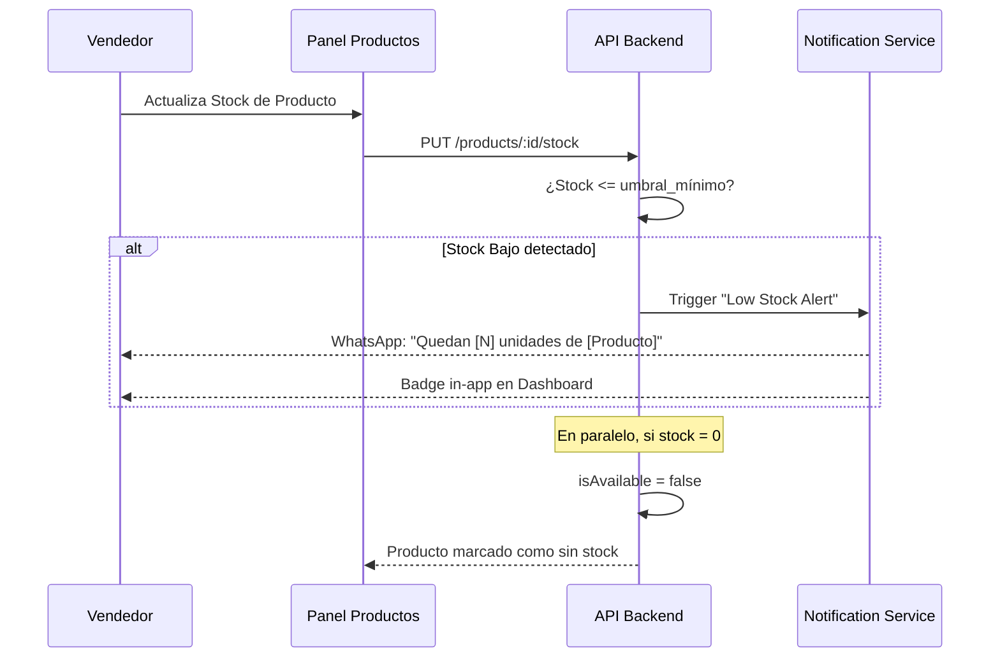

### 6.4 Invitar un empleado

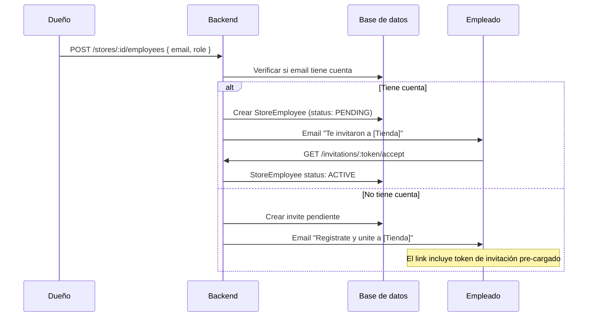

### 6.5 Emitir comprobante electrónico

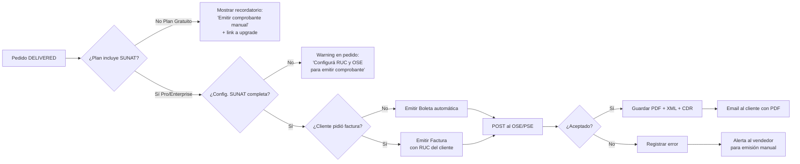

**Reglas de negocio:**

| Situación | Comportamiento del sistema |
|-----------|---------------------------|
| Plan Gratuito + pedido DELIVERED | Banner "Recordá emitir tu comprobante manualmente" + link a upgrade |
| Plan Pro/Enterprise sin RUC configurado | Warning al completar pedido: "Configurá facturación para emitir automáticamente" |
| Plan Pro/Enterprise + config completa + toggle OFF | Emisión manual desde botón "Emitir comprobante" en detalle de pedido |
| Plan Pro/Enterprise + config completa + toggle ON | Emisión automática al marcar DELIVERED |
| Downgrade de Pro → Gratuito | Los comprobantes históricos se conservan; la emisión queda deshabilitada desde el siguiente ciclo |

---

## 7. Especificaciones de pantallas

### Convenciones

| Elemento | Descripción |
|----------|-------------|
| `[BTN]` | Botón primario |
| `[BTN-SEC]` | Botón secundario |
| `[BTN-GHOST]` | Botón sin fondo |
| `[INPUT]` | Campo de texto |
| `[SELECT]` | Dropdown |
| `[TAG]` | Etiqueta de estado |
| `[CARD]` | Tarjeta contenedora |
| `→` | Navega a pantalla |
| `⚡` | Acción que llama a la API |
| `🔔` | Dispara notificación |

---

### Layout General (Shell)

```
┌─────────────────────────────────────────────────────────┐
│  TOPBAR                                                  │
│  [≡ Menu]   Tiendi Vendor          [🔔 3] [Avatar ▼]   │
├──────────────┬──────────────────────────────────────────┤
│              │                                          │
│  SIDEBAR     │   CONTENT AREA (Router Outlet)          │
│              │                                          │
│  📊 Dashboard│                                          │
│  🛒 Pedidos  │                                          │
│  📦 Productos│                                          │
│  🏪 Tienda   │                                          │
│  📈 Analytics│                                          │
│  👥 Clientes │                                          │
│  🔔 Notif.   │                                          │
│  👨‍💼 Staff    │                                          │
│  🧾 Legal    │                                          │
│  💳 Plan     │                                          │
│              │                                          │
│  ──────────  │                                          │
│  [Cerrar     │                                          │
│   sesión]    │                                          │
└──────────────┴──────────────────────────────────────────┘
```

**Comportamiento del Sidebar:**
- Desktop (>1024px): siempre visible, 240px de ancho
- Tablet (768–1024px): colapsado a iconos, 64px
- Mobile (<768px): oculto, se abre con `[≡]` como drawer overlay

**Topbar:**
- `[🔔 N]` — badge con notificaciones no leídas → clic abre panel lateral de notificaciones
- `[Avatar ▼]` — dropdown: "Mi perfil", "Configuración", "Cerrar sesión"
- Nombre de la tienda activa visible en topbar

---

### Pantalla 0 — Onboarding

Ver sección [4 — Onboarding](#4-onboarding--primera-configuración) para wireframes completos.

---

### Pantalla 1 — Dashboard Overview

**Ruta:** `/vendor/dashboard`

```
┌─────────────────────────────────────────────────────────┐
│  Buenos días, Carlos 👋  —  Bodega Don Carlos           │
│  Miércoles 16 de abril, 2026                            │
├──────────────┬──────────────┬──────────────┬────────────┤
│  [CARD]      │  [CARD]      │  [CARD]      │  [CARD]   │
│  💰 Ventas   │  🛒 Pedidos  │  ⚠️ Stock    │  📦 Prod. │
│  S/ 1,240    │  Pendientes  │  Bajo        │  Activos  │
│  Hoy         │  5           │  3 productos │  47/200   │
│  +12% ayer   │              │              │           │
├──────────────┴──────────────┴──────────────┴────────────┤
│  Pedidos Recientes                    [Ver todos →]     │
│  ┌──────────────────────────────────────────────────┐   │
│  │ #PED-001  Juan P.    S/85.00  [PENDIENTE]    ⋯  │   │
│  │ #PED-002  Maria L.   S/32.50  [CONFIRMADO]   ⋯  │   │
│  │ #PED-003  Luis M.    S/120.00 [DESPACHADO]   ⋯  │   │
│  │ #PED-004  Ana R.     S/45.00  [ENTREGADO]    ⋯  │   │
│  │ #PED-005  Carlos V.  S/67.00  [PENDIENTE]    ⋯  │   │
│  └──────────────────────────────────────────────────┘   │
│  Ventas últimos 7 días                                  │
│  ┌──────────────────────────────────────────────────┐   │
│  │  📈 [LINE CHART — S/ por día]                    │   │
│  └──────────────────────────────────────────────────┘   │
│  ⚠️ Productos con stock bajo                            │
│  ┌──────────────────────────────────────────────────┐   │
│  │  Leche Gloria 400ml    Stock: 2   [BTN: +Stock]  │   │
│  │  Arroz Costeño 1kg     Stock: 1   [BTN: +Stock]  │   │
│  │  Aceite Primor 900ml   Stock: 4   [BTN: +Stock]  │   │
│  └──────────────────────────────────────────────────┘   │
└─────────────────────────────────────────────────────────┘
```

| Componente | Estado vacío | Cargando | Error |
|------------|-------------|----------|-------|
| KPI Cards | `S/ 0.00` / `0` | Skeleton | `—` con tooltip |
| Pedidos recientes | "Sin pedidos hoy" + ilustración | Skeleton rows | "Error al cargar" + [Reintentar] |
| Line Chart | "Sin datos aún" | Spinner | "Error al cargar gráfico" |
| Stock bajo | "¡Todo el stock está en buen nivel! ✅" | Skeleton | Oculto silencioso |

| Acción | Comportamiento |
|--------|---------------|
| Clic KPI "Pedidos Pendientes" | → `/vendor/orders?status=PENDING` |
| Clic KPI "Stock Bajo" | → `/vendor/products?stock=low` |
| Clic KPI "Ventas Hoy" | → `/vendor/analytics` |
| Clic en fila de pedido | → `/vendor/orders/:id` |
| Clic en `⋯` de pedido | Menú: "Ver detalle" / "Confirmar" (si PENDING) / "Rechazar" (si PENDING/CONFIRMED) |
| Clic `[BTN: +Stock]` | Dialog inline con `[INPUT cantidad]` → ⚡ `PUT /products/:id/stock` |
| Auto-refresh | Polling cada 60s — actualiza KPIs y lista sin recargar |

---

### Pantalla 2 — Gestión de Pedidos

**Ruta:** `/vendor/orders` | **Detalle:** `/vendor/orders/:id`

#### Lista

```
┌─────────────────────────────────────────────────────────┐
│  Pedidos                                                │
│  [SELECT: Estado ▼]  [SELECT: Período ▼]               │
│  [SELECT: Pago ▼]    [SELECT: Entrega ▼]  [Limpiar]    │
│  ┌────────────────────────────────────────────────────┐ │
│  │ N°       Cliente   Total    Pago      Estado    Act │ │
│  │ PED-001  Juan P.   S/85.00  Efectivo  PENDIENTE  ⋯ │ │
│  │ PED-002  Maria L.  S/32.50  Yape      CONFIRMADO ⋯ │ │
│  │ PED-003  Luis M.   S/120.00 Tarjeta   DESPACHADO ⋯ │ │
│  │ PED-004  Ana R.    S/45.00  Transfer. ENTREGADO  ⋯ │ │
│  └────────────────────────────────────────────────────┘ │
│  Mostrando 1-20 de 87 pedidos          [< 1 2 3 4 5 >] │
└─────────────────────────────────────────────────────────┘
```

#### Detalle

```
┌─────────────────────────────────────────────────────────┐
│  [← Volver]   Pedido #PED-2026-001234  [TAG: PENDIENTE] │
├──────────────────────────┬──────────────────────────────┤
│  PRODUCTOS               │  RESUMEN                    │
│  ┌────────────────────┐  │  Cliente: Juan Pérez        │
│  │ Leche Gloria  x2   │  │  Email: juan@mail.com       │
│  │ S/4.50 c/u  S/9.00 │  │  Tel: +51 999 111 222      │
│  │ Arroz 1kg    x1    │  │                             │
│  │ S/3.20       S/3.20│  │  Entrega: DELIVERY          │
│  │ Aceite 900ml x1    │  │  Dir: Jr. Lima 123, Barranco│
│  │ S/8.50       S/8.50│  │                             │
│  └────────────────────┘  │  Pago: Efectivo             │
│                          │  Subtotal:       S/ 85.00   │
│  HISTORIAL               │  Delivery:       S/  5.00   │
│  ● Creado    10:23am     │  TOTAL:          S/ 90.00   │
│  ○ Esperando acción...   │                             │
│                          │  [BTN: Confirmar pedido]    │
│                          │  [BTN-SEC: Rechazar]        │
└──────────────────────────┴──────────────────────────────┘
```

**Tags de estado:**

| Estado | Color | Etiqueta |
|--------|-------|---------|
| PENDING | 🟡 Amarillo | Pendiente |
| CONFIRMED | 🔵 Azul | Confirmado |
| DISPATCHED | 🟣 Violeta | En camino |
| DELIVERED | 🟢 Verde | Entregado |
| REJECTED | 🔴 Rojo | Rechazado |

| Acción | Comportamiento |
|--------|---------------|
| `[BTN: Confirmar]` | Dialog → ⚡ `PUT /orders/:id/confirm` → TAG cambia → botones: "Despachar" / "Rechazar" |
| `[BTN: Despachar]` | ⚡ `PUT /orders/:id/dispatch` → TAG: DESPACHADO → botón: "Marcar entregado" |
| `[BTN: Marcar entregado]` | ⚡ `PUT /orders/:id/complete` → TAG: ENTREGADO → si SUNAT activo → emite comprobante |
| `[BTN-SEC: Rechazar]` | Dialog con textarea "Motivo" (min 10 chars, obligatorio) → ⚡ `PUT /orders/:id/reject` |
| `[← Volver]` | → `/vendor/orders` preservando filtros activos |

---

### Pantalla 3 — Gestión de Productos

**Ruta:** `/vendor/products` | `/vendor/products/new` | `/vendor/products/:id/edit` | `/vendor/products/import`

#### Lista

```
┌─────────────────────────────────────────────────────────┐
│  Productos                [BTN: + Nuevo]  [BTN: Importar]│
│                                                         │
│  [INPUT: Buscar...] [SELECT: Categoría ▼] [SELECT: Stock ▼]│
│  ┌────────────────────────────────────────────────────┐ │
│  │ □  Img  Nombre           Cat.   Precio  Stock   Act│ │
│  │ □  🖼   Leche Gloria     Lácteos S/4.50  8    ✏ 🗑│ │
│  │ □  🖼   Arroz Costeño    Abarrotes S/3.20 1⚠  ✏ 🗑│ │
│  │ □  🖼   Aceite Primor    Abarrotes S/8.50 12   ✏ 🗑│ │
│  │ □  🖼   Azúcar Rubia     Abarrotes S/2.80 0🔴  ✏ 🗑│ │
│  └────────────────────────────────────────────────────┘ │
│  □ Seleccionar todo    [BTN-SEC: Eliminar selección]    │
│  Mostrando 1-20 de 47              [< 1 2 3 >]         │
└─────────────────────────────────────────────────────────┘
```

#### Formulario (Creación / Edición)

```
┌─────────────────────────────────────────────────────────┐
│  [← Volver]   Nuevo Producto                            │
├────────────────────────────┬────────────────────────────┤
│  INFORMACIÓN GENERAL       │  IMÁGENES                  │
│                            │  ┌──────────────────────┐  │
│  Nombre *                  │  │   [Zona de drop]     │  │
│  [INPUT: Ej. Leche Gloria] │  │   📎 Subir imágenes  │  │
│                            │  │   (máx 5, 2MB c/u)   │  │
│  Descripción               │  └──────────────────────┘  │
│  [TEXTAREA: Descripción...│  [img1] [img2] [img3]       │
│                            │   ✕      ✕      ✕           │
│  Categoría *               │                            │
│  [SELECT: Seleccionar ▼]  │  ESTADO                    │
│                            │  ○ Activo  ○ Inactivo      │
│  Presentación              │                            │
│  [INPUT: Ej. 500ml, 1kg]  │  DESTACADO                 │
│  (informativo)             │  □ Oferta del día          │
│                            │                            │
│  SKU / Código interno      │                            │
│  [INPUT: Ej. GLO-001]     │                            │
│                            │                            │
│  PRECIO                    │                            │
│  Precio regular *          │                            │
│  S/ [INPUT: 0.00]         │                            │
│                            │                            │
│  Precio con descuento      │                            │
│  S/ [INPUT: 0.00]         │                            │
│  → Descuento: 0%  (en     │                            │
│    tiempo real)            │                            │
│                            │                            │
│  STOCK                     │                            │
│  Cantidad *                │                            │
│  [INPUT: 0]  unidades     │                            │
│                            │                            │
│  Umbral alerta stock bajo  │                            │
│  [INPUT: 5]  unidades     │                            │
│                            │                            │
├────────────────────────────┴────────────────────────────┤
│          [BTN-GHOST: Cancelar]   [BTN: Guardar]         │
└─────────────────────────────────────────────────────────┘
```

#### Modal de Importación Masiva

```
┌─────────────────────────────────────────────────────────┐
│  Importar productos                                  [✕] │
├─────────────────────────────────────────────────────────┤
│                                                         │
│  1. Descargá la plantilla:                             │
│     [BTN-GHOST: ⬇ Descargar plantilla CSV]             │
│                                                         │
│  2. Completá la plantilla con tus productos.           │
│     Columnas: nombre, descripción, categoría, precio,  │
│     precio_descuento, stock, sku, activo               │
│                                                         │
│  3. Subí el archivo:                                   │
│     ┌────────────────────────────────────────────────┐ │
│     │   📎 Arrastrá tu archivo CSV o Excel aquí     │ │
│     │        o hacé clic para buscarlo               │ │
│     └────────────────────────────────────────────────┘ │
│                                                         │
│  Máximo 500 productos por importación.                  │
│  Los productos existentes con el mismo SKU             │
│  se actualizarán (upsert).                             │
│                                                         │
│     [BTN-GHOST: Cancelar]  [BTN: Importar →]           │
└─────────────────────────────────────────────────────────┘
```

#### Resultado de importación

```
┌─────────────────────────────────────────────────────────┐
│  Importación completada                              [✕] │
├─────────────────────────────────────────────────────────┤
│  ✅  47 productos creados                               │
│  🔄  3 productos actualizados (mismo SKU)               │
│  ❌  2 filas con errores:                               │
│                                                         │
│  ┌────────────────────────────────────────────────────┐ │
│  │  Fila 12: Precio inválido ("abc")                  │ │
│  │  Fila 28: Categoría no encontrada ("Tecnología")   │ │
│  └────────────────────────────────────────────────────┘ │
│                                                         │
│  [BTN-GHOST: Descargar reporte de errores]              │
│                               [BTN: Cerrar]             │
└─────────────────────────────────────────────────────────┘
```

**Validaciones del formulario:**

| Campo | Regla |
|-------|-------|
| Nombre | Required, min 3 chars, max 100 |
| Categoría | Required |
| Precio regular | Required, > 0 |
| Precio descuento | Opcional, debe ser < precio regular |
| Stock | Required, ≥ 0, entero |
| Umbral alerta | Opcional, ≥ 0, entero (default: 5) |
| Imágenes | Máx 5, JPG/PNG/WebP, máx 2MB c/u |
| Presentación | Opcional, max 50 chars |
| SKU | Opcional, único dentro de la tienda |

---

### Pantalla 4 — Configuración de Tienda

**Ruta:** `/vendor/store`

```
┌─────────────────────────────────────────────────────────┐
│  Mi Tienda                                              │
│  [Tab: Perfil ●] [Tab: Horarios] [Tab: Delivery]       │
│  [Tab: Pagos]    [Tab: Facturación]                     │
├─────────────────────────────────────────────────────────┤
│  TAB: PERFIL                                            │
│  ┌──────────────────────────────────────────────────┐   │
│  │  LOGO               BANNER                       │   │
│  │  ┌────────┐         ┌──────────────────────────┐ │   │
│  │  │  🏪   │  [Edit] │        800×200            │ │   │
│  │  └────────┘         └──────────────────────────┘ │   │
│  │                     [Cambiar banner]             │   │
│  └──────────────────────────────────────────────────┘   │
│                                                         │
│  Nombre *  [INPUT: Bodega Don Carlos              ]     │
│  Descripción  [TEXTAREA: Describe tu tienda...   ]     │
│  Dirección *  [INPUT: Jr. Tarapacá 340, Barranco ]     │
│  Teléfono     [INPUT: +51 999...]                       │
│  WhatsApp     [INPUT: +51 999...]                       │
│  Slug         tiendi.app/[INPUT: bodega-don-carlos]     │
│               ✅ Disponible                             │
│                                                         │
│       [BTN-GHOST: Cancelar]   [BTN: Guardar cambios]   │
└─────────────────────────────────────────────────────────┘
```

```
│  TAB: HORARIOS                                          │
│  Lunes      [TOGGLE: ON]   [08:00 ▼] a [22:00 ▼]      │
│  Martes     [TOGGLE: ON]   [08:00 ▼] a [22:00 ▼]      │
│  Miércoles  [TOGGLE: ON]   [08:00 ▼] a [22:00 ▼]      │
│  Jueves     [TOGGLE: ON]   [08:00 ▼] a [22:00 ▼]      │
│  Viernes    [TOGGLE: ON]   [08:00 ▼] a [22:00 ▼]      │
│  Sábado     [TOGGLE: ON]   [09:00 ▼] a [21:00 ▼]      │
│  Domingo    [TOGGLE: OFF]  ─────── Cerrado ─────────   │
│                                                         │
│  □ Marcar como feriado hoy (cierra temporalmente)      │
│                         [BTN: Guardar horarios]         │
```

```
│  TAB: DELIVERY (MVP — radio circular)                  │
│  [TOGGLE: Ofrezco delivery]                            │
│                                                         │
│  Radio de cobertura   [SLIDER: ────●──── 5 km]        │
│  Costo de envío       S/ [INPUT: 5.00]                 │
│  Pedido mínimo        S/ [INPUT: 20.00]                │
│  Tiempo estimado      [INPUT: 30] — [INPUT: 60] min    │
│  [TOGGLE: Delivery gratis desde] S/ [INPUT: 80.00]     │
│                                                         │
│  ⚙ Zonas con polígonos personalizados — Disponible en │
│    Plan Pro. Definí áreas de cobertura exactas.        │
│    [BTN-GHOST: Ver planes]                              │
│                         [BTN: Guardar]                  │
```

```
│  TAB: MÉTODOS DE PAGO                                  │
│  [TOGGLE: ON ] 💵 Efectivo                              │
│  [TOGGLE: ON ] 📱 Yape                                  │
│  [TOGGLE: ON ] 📱 Plin                                  │
│  [TOGGLE: OFF] 🏦 Transferencia bancaria                │
│  [TOGGLE: OFF] 💳 Tarjeta (requiere Culqi API Key)     │
│                                                         │
│  Mensaje para efectivo                                 │
│  [TEXTAREA: "Tener cambio exacto"     ]                │
│  Mensaje para transferencia                            │
│  [TEXTAREA: "BCP cuenta 123-456..."   ]                │
│                         [BTN: Guardar]                  │
```

```
│  TAB: FACTURACIÓN ELECTRÓNICA  (Plan Pro / Enterprise) │
│  (Ver especificación completa en M11)                  │
│                                                         │
│  RUC *        [INPUT: 20XXXXXXXXX      ]               │
│  Razón Social [INPUT: Bodega Don Carlos E.I.R.L.]      │
│  Dirección fiscal [INPUT: Jr. Tarapacá 340...]         │
│  Régimen      [SELECT: RUS ▼]                          │
│  OSE Token 🔒 [INPUT: ****************************]    │
│              (encriptado at-rest — nunca retornado     │
│               al frontend tras guardar)                │
│  [TOGGLE: Emitir comprobante automáticamente]          │
│  Boleta serie [INPUT: B001]  Factura [INPUT: F001]     │
│                         [BTN: Guardar]                  │
```

**Estado del tab si el vendedor está en Plan Gratuito:**

```
│  TAB: FACTURACIÓN ELECTRÓNICA  🔒                      │
│                                                         │
│  ┌────────────────────────────────────────────────┐    │
│  │  🔒 Función disponible desde el Plan Pro        │    │
│  │                                                 │    │
│  │  Tu plan actual no incluye emisión automática  │    │
│  │  de boletas y facturas electrónicas.           │    │
│  │                                                 │    │
│  │  Mientras tanto, sos responsable de emitir     │    │
│  │  tus comprobantes manualmente.                 │    │
│  │                                                 │    │
│  │        [BTN: Ver planes y actualizar]          │    │
│  └────────────────────────────────────────────────┘    │
```

---

### Pantalla 5 — Analytics y Reportes

**Ruta:** `/vendor/analytics`

```
┌─────────────────────────────────────────────────────────┐
│  Analytics                                              │
│  [BTN: Hoy] [BTN: Semana ●] [BTN: Mes] [BTN: Año]     │
│  Personalizado: [DATE] al [DATE]  [BTN: Exportar CSV]  │
├──────────┬──────────┬──────────┬──────────────────────┤
│ Ingresos │ Pedidos  │  Ticket  │  Tasa rechazo        │
│ S/8,420  │  127     │  prom.   │  3.2%                │
│ +8% sem  │  +15%    │  S/66.30 │  -1.1%               │
├──────────┴──────────┴──────────┴──────────────────────┤
│  Ventas por día                                        │
│  [LINE CHART con área — Ingresos diarios]              │
│                                                        │
│  Top 10 Productos más vendidos                         │
│  1. Leche Gloria    ████████████████  42 uds  S/189   │
│  2. Arroz Costeño   ████████████      35 uds  S/112   │
│                                                        │
│  Ingresos por método de pago                           │
│  [DONUT CHART]   Efectivo 65% S/5,473                  │
│                  Yape     20% S/1,684                  │
│                  Transfer 15% S/1,263                  │
└─────────────────────────────────────────────────────────┘
```

| Acción | Comportamiento |
|--------|---------------|
| Cambiar período | ⚡ Re-fetch `GET /vendor/analytics?period=X` |
| Rango personalizado | Date pickers → ⚡ con `from=&to=` |
| `[BTN: Exportar CSV]` | ⚡ `GET /vendor/reports/sales?format=csv` → descarga directa |
| Hover en chart | Tooltip con valor exacto |
| Clic en barra top producto | → `/vendor/products/:id/edit` |

---

### Pantalla 6 — Clientes

**Ruta:** `/vendor/customers` | **Detalle:** `/vendor/customers/:id`

#### Lista

```
┌─────────────────────────────────────────────────────────┐
│  Clientes                                               │
│  [INPUT: Buscar por nombre o email...]                  │
│  ┌────────────────────────────────────────────────────┐ │
│  │ Avatar  Nombre      Email          Pedidos  Total  │ │
│  │  👤    Juan Pérez  juan@mail.com   8       S/420  │ │
│  │  👤    Maria López mari@mail.com   3       S/156  │ │
│  │  👤    Luis Mamani luis@mail.com   12      S/890  │ │
│  └────────────────────────────────────────────────────┘ │
│  Total: 34 clientes                     [< 1 2 >]      │
└─────────────────────────────────────────────────────────┘
```

#### Detalle

```
┌─────────────────────────────────────────────────────────┐
│  [← Volver]   Juan Pérez                                │
├──────────────────────────┬──────────────────────────────┤
│  DATOS                   │  ESTADÍSTICAS                │
│  👤 Juan Pérez           │  Total gastado:  S/ 420.00  │
│  juan@mail.com           │  Pedidos:        8           │
│  +51 999 111 222         │  Ticket promedio: S/ 52.50  │
│  Cliente desde: Ene 2026 │  Último pedido: 10 abr 2026 │
├──────────────────────────┴──────────────────────────────┤
│  Historial de pedidos en esta tienda                    │
│  ┌────────────────────────────────────────────────────┐ │
│  │ #PED-001  15 abr  S/85.00   [ENTREGADO]        →  │ │
│  │ #PED-002  10 abr  S/32.50   [ENTREGADO]        →  │ │
│  │ #PED-003  01 abr  S/120.00  [RECHAZADO]        →  │ │
│  └────────────────────────────────────────────────────┘ │
└─────────────────────────────────────────────────────────┘
```

---

### Pantalla 7 — Notificaciones

**Ruta:** `/vendor/notifications`

```
┌─────────────────────────────────────────────────────────┐
│  Notificaciones           [BTN-GHOST: Marcar todo ✓]   │
│  [Tab: Todas ●] [Tab: Sin leer (3)] [Tab: Pedidos]     │
│  [Tab: Stock] [Tab: Sistema]                            │
├─────────────────────────────────────────────────────────┤
│  HOY                                                    │
│  ┌────────────────────────────────────────────────────┐ │
│  │ 🔵 🛒  Nuevo pedido #PED-007 — S/45.00   10:23am  │ │
│  │        Juan Pérez · Efectivo · Delivery        →  │ │
│  │ 🔵 ⚠️  Stock bajo: Arroz Costeño (1 ud)  09:15am  │ │
│  │        Actualizá el stock antes de aceptar    →  │ │
│  │    🛒  Pedido #PED-006 entregado — S/90.00 08:40am │ │
│  └────────────────────────────────────────────────────┘ │
│  AYER                                                   │
│  ┌────────────────────────────────────────────────────┐ │
│  │    🛒  Pedido #PED-005 rechazado — S/32.00  6:20pm │ │
│  └────────────────────────────────────────────────────┘ │
│                    [BTN-GHOST: ⚙ Configurar alertas]   │
└─────────────────────────────────────────────────────────┘
```

#### Drawer de configuración

```
┌───────────────────────────────────┐
│  Configuración de notificaciones  │
│  NUEVOS PEDIDOS                   │
│  Email        [TOGGLE: ON]        │
│  WhatsApp     [TOGGLE: ON]        │
│  In-app       [TOGGLE: ON]        │
│  STOCK BAJO                       │
│  Email        [TOGGLE: ON]        │
│  WhatsApp     [TOGGLE: OFF]       │
│  Umbral       [INPUT: 5] uds      │
│  PEDIDOS SIN ATENDER              │
│  Recordatorio [TOGGLE: ON]        │
│  A los        [INPUT: 30] min     │
│  PLAN POR VENCER                  │
│  Email        [TOGGLE: ON]        │
│  Con          [INPUT: 7] días     │
│               [BTN: Guardar]      │
└───────────────────────────────────┘
```

---

### Pantalla 8 — Suscripción y Plan

**Ruta:** `/vendor/subscription`

```
┌─────────────────────────────────────────────────────────┐
│  Suscripción                                            │
│  PLAN ACTUAL                                            │
│  ┌────────────────────────────────────────────────────┐ │
│  │  [TAG: PRO]  Plan Pro — S/ 49.00 / mes             │ │
│  │  Renovación: 15 de mayo, 2026                      │ │
│  │  Productos activos  [████████░░] 47/200            │ │
│  │  Pedidos del mes    [██████████] 127/∞             │ │
│  │  Staff activo       [███░░░░░░░] 2/5               │ │
│  │  [BTN-SEC: Cancelar plan]  [BTN: Cambiar plan]     │ │
│  └────────────────────────────────────────────────────┘ │
│  PLANES DISPONIBLES                                     │
│  ┌──────────┐  ┌──────────┐  ┌────────────────────┐    │
│  │ GRATUITO │  │ PRO ✓    │  │ ENTERPRISE         │    │
│  │  S/ 0    │  │  S/ 49   │  │  S/ 149            │    │
│  │ 20 prods │  │ 200 prods│  │ Sin límite         │    │
│  │ 50 ped.  │  │ Sin lím. │  │ Sin límite         │    │
│  │ 1 staff  │  │ 5 staff  │  │ Staff ilimitado    │    │
│  │ Analytics│  │ Analytics│  │ Analytics Full     │    │
│  │ básico   │  │ avanzado │  │ + PDF Export       │    │
│  │[Downgrade│  │[Actual]  │  │[BTN: Upgrade]      │    │
│  └──────────┘  └──────────┘  └────────────────────┘    │
│  HISTORIAL DE PAGOS                                     │
│  ┌────────────────────────────────────────────────────┐ │
│  │ 15 abr 2026  Plan Pro  S/49.00  [PAGADO]          │ │
│  │ 15 mar 2026  Plan Pro  S/49.00  [PAGADO]          │ │
│  └────────────────────────────────────────────────────┘ │
└─────────────────────────────────────────────────────────┘
```

---

### Pantalla 9 — Staff y Empleados

**Ruta:** `/vendor/staff` | `/vendor/staff/invite`

#### Lista

```
┌─────────────────────────────────────────────────────────┐
│  Staff                           [BTN: + Invitar]       │
│                                                         │
│  ┌────────────────────────────────────────────────────┐ │
│  │ Avatar  Nombre        Email          Rol      Estado│ │
│  │  👤    Carlos García  carlos@...     OWNER    Activo│ │
│  │  👤    Maria López    maria@...      CASHIER  Activo│ │
│  │  👤    Juan Quispe    juan@...       WAREHOUSE Activo│
│  │  📧    pedro@mail.com  ─            MANAGER  Invit.│ │
│  └────────────────────────────────────────────────────┘ │
│                                                         │
│  Usando 3 de 5 slots de staff disponibles en tu plan.  │
└─────────────────────────────────────────────────────────┘
```

#### Modal de Invitación

```
┌─────────────────────────────────────────────────────────┐
│  Invitar colaborador                                 [✕] │
├─────────────────────────────────────────────────────────┤
│                                                         │
│  Email *                                               │
│  [INPUT: correo@ejemplo.com                   ]        │
│                                                         │
│  Rol *                                                 │
│  [SELECT: Seleccionar rol ▼]                           │
│                                                         │
│  ○ Manager — acceso a todo excepto facturación y plan  │
│  ○ Cashier — solo puede gestionar pedidos              │
│  ○ Warehouse — solo puede actualizar stock             │
│                                                         │
│  Le llegará un email con el link de invitación.        │
│  La invitación vence en 72 horas.                      │
│                                                         │
│      [BTN-GHOST: Cancelar]   [BTN: Enviar invitación]  │
└─────────────────────────────────────────────────────────┘
```

| Acción | Comportamiento |
|--------|---------------|
| `[BTN: + Invitar]` | Abre modal de invitación |
| Enviar invitación | ⚡ `POST /stores/:id/employees` → email al invitado → fila en tabla con estado "Invitación pendiente" |
| Reenviar invitación | ⚡ Re-envío del email → toast "Invitación reenviada" |
| Cambiar rol | Dialog confirmar → ⚡ `PUT /stores/:id/employees/:userId` |
| Desactivar empleado | Dialog "¿Eliminar acceso a [Nombre]?" → ⚡ `DELETE /stores/:id/employees/:userId` |
| Límite de plan alcanzado | Botón "Invitar" deshabilitado + tooltip "Límite de X staff en tu plan — Actualizá" |

---

### Pantalla 10 — Facturación y Legal

**Ruta:** `/vendor/legal` | `/vendor/legal/invoices` | `/vendor/legal/complaints`

#### Comprobantes emitidos

```
┌─────────────────────────────────────────────────────────┐
│  Comprobantes Electrónicos                              │
│  [SELECT: Tipo ▼]  [DATE: desde] [DATE: hasta]          │
│  [BTN: Exportar reporte]                               │
│  ┌────────────────────────────────────────────────────┐ │
│  │ N° Serie  Fecha    Cliente      Tipo    Total  Act │ │
│  │ B001-001  15 abr   Juan Pérez   Boleta  S/90  ⬇ 👁│ │
│  │ B001-002  15 abr   Maria López  Boleta  S/32  ⬇ 👁│ │
│  │ F001-001  14 abr   Empresa SAC  Factura S/150 ⬇ 👁│ │
│  └────────────────────────────────────────────────────┘ │
│  ⬇ Descargar PDF  👁 Ver detalle                        │
└─────────────────────────────────────────────────────────┘
```

#### Libro de Reclamaciones

```
┌─────────────────────────────────────────────────────────┐
│  Libro de Reclamaciones                                 │
│  [SELECT: Estado ▼]  [DATE: desde] [DATE: hasta]        │
│  ┌────────────────────────────────────────────────────┐ │
│  │ N°   Fecha   Cliente     Tipo      Estado     Vence│ │
│  │ R001 10 abr  Juan Pérez  Reclamo   PENDIENTE ⚠14d  │ │
│  │ R002 08 abr  Maria L.   Queja     RESPONDIDO  ─   │ │
│  │ R003 01 abr  Luis M.    Reclamo   CERRADO     ─   │ │
│  └────────────────────────────────────────────────────┘ │
│                                                         │
│  ⚠ R001 vence en 14 días hábiles (deadline legal)      │
└─────────────────────────────────────────────────────────┘
```

#### Detalle de reclamo + respuesta

```
┌─────────────────────────────────────────────────────────┐
│  [← Volver]  Reclamo #R001 — Juan Pérez    [PENDIENTE] │
├─────────────────────────────────────────────────────────┤
│  DATOS DEL CONSUMIDOR                                   │
│  Nombre: Juan Pérez  DNI: 12345678  Tel: +51 999...    │
│  Email: juan@mail.com                                   │
│                                                         │
│  RECLAMO                                               │
│  Pedido relacionado: #PED-001                           │
│  Tipo: Reclamo (disconformidad con producto)           │
│  Descripción: "El arroz vino en mal estado..."         │
│  Fecha de ingreso: 10 de abril, 2026                   │
│  Fecha límite de respuesta: 24 de abril, 2026 ⚠        │
│                                                         │
│  RESPUESTA DEL VENDEDOR                                │
│  [TEXTAREA: Describí cómo vas a resolver el reclamo...│
│                                                   ]    │
│                                                         │
│  [BTN-GHOST: Guardar borrador]  [BTN: Enviar respuesta]│
└─────────────────────────────────────────────────────────┘
```

---

### 7.11 Adaptación Mobile — wireframes críticos

> [!IMPORTANT]
> **El 90% de las bodegas y tiendas pequeñas en Perú operan desde celular.** El vendedor no corre a la PC cuando entra un pedido — atiende desde el mostrador con el teléfono en la mano. Las 3 pantallas de esta sección (Dashboard, Pedidos, Detalle de Pedido) concentran el uso diario y **deben estar perfectas en mobile**, no ser adaptaciones pobres del desktop.

**Breakpoint mobile:** `<768px`
**Target primario:** Android (Chrome), resoluciones 360×640 a 414×896
**Orientación:** portrait (vertical) — el landscape funciona pero no se optimiza

---

#### Patrones mobile generales

**Shell mobile (reemplaza sidebar desktop):**

```
┌─────────────────────────────┐
│  TOPBAR                     │
│  [🏪 Tiendi]  [🔔 3] [👤]  │  ← 56px altura
├─────────────────────────────┤
│                             │
│                             │
│   CONTENT AREA              │
│   (scroll vertical)         │
│                             │
│                             │
├─────────────────────────────┤
│  BOTTOM NAV                 │  ← 64px altura (pinned)
│ 📊 🛒(3) 📦 🔔 ⋯           │
└─────────────────────────────┘
```

**Bottom Navigation (siempre visible):**

| Ítem | Icono | Badge | Destino |
|------|-------|-------|---------|
| Dashboard | 📊 | — | `/vendor/dashboard` |
| Pedidos | 🛒 | Pedidos pendientes | `/vendor/orders` |
| Productos | 📦 | — | `/vendor/products` |
| Notificaciones | 🔔 | Sin leer | `/vendor/notifications` |
| Más | ⋯ | — | Drawer lateral con Tienda, Analytics, Clientes, Staff, Legal, Plan |

> [!TIP]
> El botón "Más" abre un **drawer lateral** con el resto de las opciones del sidebar desktop. Esto mantiene el bottom nav corto (regla UX: máximo 5 ítems) y accesible con el pulgar.

**Patrones táctiles:**

| Patrón | Uso |
|--------|-----|
| **Pull-to-refresh** | En Dashboard y Lista de pedidos — refresca sin esperar polling |
| **Bottom sheet** | Filtros, menú contextual de pedido (⋯), acciones rápidas |
| **Sticky action bar** | Botones de acción primarios al pie de la pantalla (confirmar, despachar) |
| **Swipe en cards** | Deslizar pedido a la derecha → confirmar · a la izquierda → rechazar (con confirm) |
| **Long press** | Seleccionar múltiples productos para eliminación masiva |
| **Tap target mínimo** | 44×44px (WCAG) — botones, iconos tappables |

---

#### Mobile 1 — Dashboard

```
┌─────────────────────────────┐
│ 🏪 Tiendi      [🔔 3] [👤] │
├─────────────────────────────┤
│                             │
│  Hola, Carlos 👋            │
│  Bodega Don Carlos          │
│  Miércoles 16 de abril      │
│                             │
│  ┌───────────┐ ┌──────────┐ │
│  │ 💰        │ │ 🛒       │ │
│  │ Ventas    │ │ Pedidos  │ │
│  │ S/ 1,240  │ │ pend.    │ │
│  │ Hoy       │ │ 5        │ │
│  │ +12%↑     │ │          │ │
│  └───────────┘ └──────────┘ │
│  ┌───────────┐ ┌──────────┐ │
│  │ ⚠️ Stock  │ │ 📦 Prod. │ │
│  │ Bajo      │ │ Activos  │ │
│  │ 3         │ │ 47 / 200 │ │
│  └───────────┘ └──────────┘ │
│                             │
│  Pedidos recientes   Ver →  │
│  ┌─────────────────────────┐│
│  │ #PED-001  Juan P.   ⋯  ││
│  │ S/85.00   [PENDIENTE]  ││
│  ├─────────────────────────┤│
│  │ #PED-002  Maria L.  ⋯  ││
│  │ S/32.50   [CONFIRMADO] ││
│  ├─────────────────────────┤│
│  │ #PED-003  Luis M.   ⋯  ││
│  │ S/120.00  [DESPACHADO] ││
│  └─────────────────────────┘│
│                             │
│  Ventas 7 días              │
│  ┌─────────────────────────┐│
│  │ 📈 [sparkline compacto] ││
│  └─────────────────────────┘│
│                             │
│  ⚠️ Stock bajo              │
│  ┌─────────────────────────┐│
│  │ Leche Gloria 400ml      ││
│  │ Stock: 2  [+ Stock]     ││
│  ├─────────────────────────┤│
│  │ Arroz Costeño 1kg       ││
│  │ Stock: 1  [+ Stock]     ││
│  └─────────────────────────┘│
│                             │
│ ↓ scroll                    │
├─────────────────────────────┤
│ 📊 🛒(5) 📦 🔔(3) ⋯         │
└─────────────────────────────┘
```

**Adaptaciones clave:**
- KPIs en **grid 2×2** (no 4 en fila como desktop)
- Pedidos en **cards verticales**, no tabla — cada card tiene número, cliente, monto, tag, menú
- Gráfico de ventas = **sparkline compacto**, no line chart grande
- Pull-to-refresh en top → fuerza refresh sin esperar polling
- Tap en card de pedido → `/vendor/orders/:id`
- Tap en `⋯` → **bottom sheet** con: Ver detalle / Confirmar / Rechazar

**Bottom sheet de acciones rápidas (al tap en `⋯`):**

```
┌─────────────────────────────┐
│       ━━━━ (handle)         │
│                             │
│  #PED-001 — Juan P.         │
│  S/ 85.00  [PENDIENTE]      │
│                             │
│  👁  Ver detalle            │
│  ✅  Confirmar pedido       │
│  ❌  Rechazar pedido        │
│                             │
│         [Cancelar]          │
└─────────────────────────────┘
```

---

#### Mobile 2 — Lista de Pedidos

```
┌─────────────────────────────┐
│ [←] Pedidos      [⚙ Filtros]│
├─────────────────────────────┤
│  Estado activo:             │
│  [chip: Todos ●] [Pendiente]│
│  [Confirmado] [Despachado]… │
│  ← scroll horizontal →      │
├─────────────────────────────┤
│                             │
│  HOY                        │
│  ┌─────────────────────────┐│
│  │ #PED-001  10:23am       ││
│  │ Juan Pérez              ││
│  │ S/85.00   Efectivo      ││
│  │ 🚚 Delivery             ││
│  │         [PENDIENTE] →  ││
│  ├─────────────────────────┤│
│  │ #PED-002  10:45am       ││
│  │ Maria López             ││
│  │ S/32.50   Yape          ││
│  │ 🏪 Pickup               ││
│  │         [CONFIRMADO] →  ││
│  └─────────────────────────┘│
│                             │
│  AYER                       │
│  ┌─────────────────────────┐│
│  │ #PED-005  6:20pm        ││
│  │ Luis Mamani             ││
│  │ S/120.00  Tarjeta       ││
│  │ 🚚 Delivery             ││
│  │         [ENTREGADO] →  ││
│  └─────────────────────────┘│
│                             │
│  ↓ Cargar más               │
│                             │
├─────────────────────────────┤
│ 📊 🛒(5)● 📦 🔔 ⋯           │
└─────────────────────────────┘
```

**Adaptaciones clave:**
- Filtros de estado como **chips horizontales scrollables** (no selects)
- Filtros avanzados (período, pago, entrega) → botón `[⚙ Filtros]` abre **bottom sheet**
- Pedidos agrupados por **fecha (HOY / AYER / FECHA)** — más natural en mobile
- Cada pedido es una card vertical con toda la info visible sin scroll horizontal
- **Swipe a la derecha** en un pedido PENDIENTE → acción rápida "Confirmar"
- **Swipe a la izquierda** en cualquier pedido no-final → "Rechazar" con confirm
- Infinite scroll al final — "Cargar más" visible si JS está degradado

**Bottom sheet de filtros avanzados:**

```
┌─────────────────────────────┐
│       ━━━━ (handle)         │
│  Filtros                [✕] │
├─────────────────────────────┤
│  Período                    │
│  ○ Hoy  ● Últ. 7 días       │
│  ○ Este mes  ○ Rango        │
│                             │
│  Método de pago             │
│  □ Efectivo  □ Yape         │
│  □ Plin      □ Transfer.    │
│  □ Tarjeta                  │
│                             │
│  Tipo de entrega            │
│  □ Delivery  □ Pickup       │
│                             │
│  [BTN-GHOST: Limpiar]       │
│  [BTN: Aplicar filtros]     │
└─────────────────────────────┘
```

---

#### Mobile 3 — Detalle de Pedido

Esta es **la pantalla más crítica** del mobile porque es donde el vendedor toma decisiones operativas (confirmar, despachar, rechazar) con el cliente esperando. Los botones de acción **deben estar siempre visibles al fondo** — sin importar el scroll.

```
┌─────────────────────────────┐
│ [←] #PED-2026-001234        │
│             [TAG:PENDIENTE] │
├─────────────────────────────┤
│                             │
│  CLIENTE                 ▼  │
│  Juan Pérez                 │
│  juan@mail.com              │
│  +51 999 111 222  [📞] [💬] │
│                             │
├─────────────────────────────┤
│  ENTREGA                    │
│  🚚 Delivery                │
│  Jr. Lima 123, Barranco     │
│  [📍 Ver en mapa]           │
│                             │
├─────────────────────────────┤
│  PRODUCTOS (3)           ▼  │
│  ┌─────────────────────────┐│
│  │ Leche Gloria 400ml  x2  ││
│  │ S/ 4.50 c/u    S/ 9.00  ││
│  ├─────────────────────────┤│
│  │ Arroz Costeño 1kg   x1  ││
│  │ S/ 3.20        S/ 3.20  ││
│  ├─────────────────────────┤│
│  │ Aceite Primor 900ml x1  ││
│  │ S/ 8.50        S/ 8.50  ││
│  └─────────────────────────┘│
│                             │
│  RESUMEN                    │
│  Subtotal       S/ 85.00    │
│  Delivery       S/  5.00    │
│  ─────────────────────────  │
│  TOTAL          S/ 90.00    │
│                             │
│  PAGO                       │
│  💵 Efectivo                │
│                             │
│  HISTORIAL                  │
│  ● Creado       10:23am     │
│  ○ Esperando tu acción...   │
│                             │
│ ↓ scroll                    │
├─────────────────────────────┤
│  [❌ Rechazar] [✅ Confirmar]│  ← STICKY
└─────────────────────────────┘
```

**Adaptaciones clave:**
- Header con **back + número + tag** — el tag queda siempre visible aunque se scrollee
- Secciones colapsables (Cliente, Productos) con ▼ — el vendedor experimentado las colapsa para ver totales más rápido
- **Acciones rápidas al cliente:** tap `[📞]` dispara `tel:` — tap `[💬]` abre WhatsApp con el número precargado
- **Dirección:** tap `[📍 Ver en mapa]` abre Google Maps con la dirección — crítico si el vendedor hace el delivery él mismo
- **Action bar STICKY al fondo:** los botones cambian según el estado del pedido
- Los textos largos truncan con `…` y se expanden al tap

**Action bar según estado (siempre sticky al fondo):**

| Estado del pedido | Botones visibles |
|-------------------|------------------|
| PENDING | `[❌ Rechazar]` `[✅ Confirmar]` |
| CONFIRMED | `[❌ Cancelar]` `[🚚 Despachar]` |
| DISPATCHED | `[📦 Marcar entregado]` |
| DELIVERED | `[🧾 Ver comprobante]` (si Plan Pro+) |
| REJECTED | — (solo historial, sin acciones) |

**Dialog de confirmación (modal full-screen en mobile):**

```
┌─────────────────────────────┐
│  ¿Confirmás este pedido?    │
│                             │
│  Se va a descontar el stock │
│  de los productos.          │
│                             │
│  Juan Pérez se va a         │
│  notificar por WhatsApp.    │
│                             │
│                             │
│  [Cancelar]  [Sí, confirmar]│
└─────────────────────────────┘
```

---

#### Responsive — el resto de pantallas

Para las pantallas que NO están en este top-3 crítico, se aplican reglas generales de adaptación:

| Elemento desktop | Adaptación mobile |
|------------------|-------------------|
| Sidebar | Drawer lateral desde `[≡]` o Bottom nav |
| Tabla con N columnas | Cards verticales con labels `Campo: Valor` |
| Filtros en línea | Botón `[Filtros]` → bottom sheet |
| Tabs horizontales | Tabs scrollables horizontalmente |
| Formularios en 2 columnas | 1 columna full-width |
| Modal centrado | Full-screen o bottom sheet según criticidad |
| Botones secundarios | Sticky al fondo o dentro de scroll |
| Charts grandes | Charts compactos + opción "Ver detalle" expandido |

> [!WARNING]
> **No usar zoom / `user-scalable=no`** — es anti-patrón de accesibilidad y molesta a usuarios con baja visión. El layout debe funcionar a 200% de zoom del sistema operativo.

---

## 8. Modelo de datos relevante

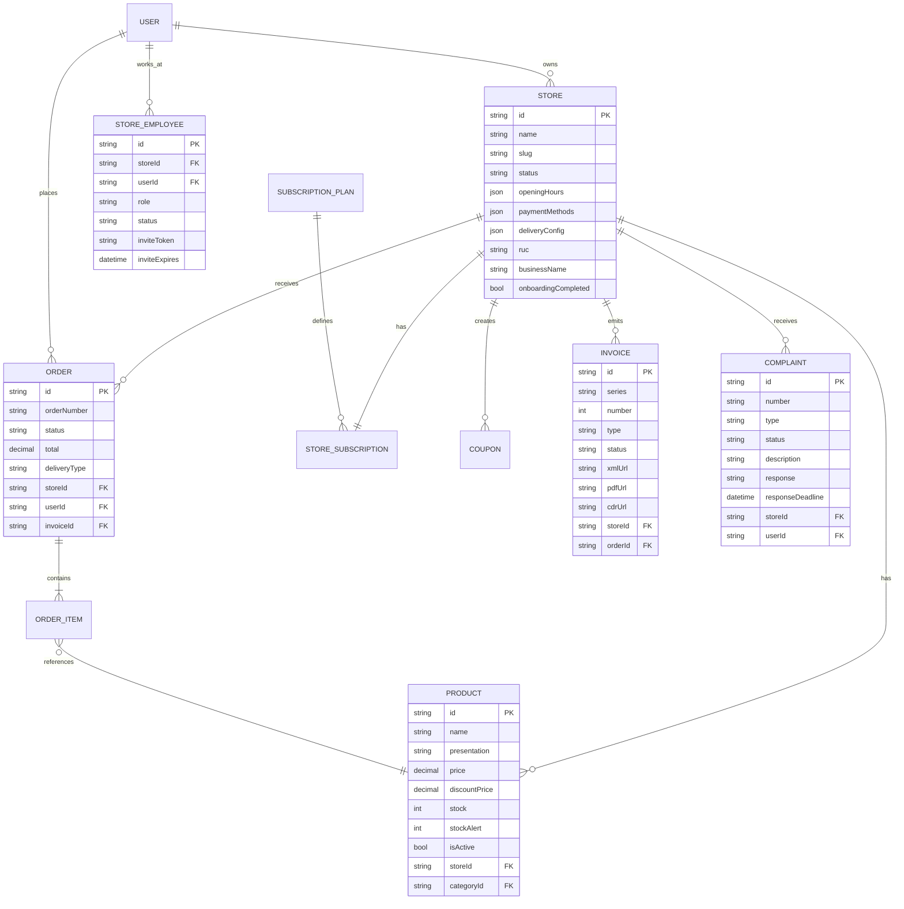

---

## 9. Estados globales de la UI

| Estado | Comportamiento |
|--------|---------------|
| **Sin conexión** | Banner amarillo persistente "Sin conexión — revisá tu internet" |
| **Session expirada** | Dialog modal "Tu sesión expiró" + `[BTN: Iniciar sesión]` → redirect a login |
| **Plan limitado** | Elementos bloqueados con `🔒` + tooltip "Actualizá tu plan para acceder" + link a `/vendor/subscription` |
| **Tienda suspendida** | Banner rojo bloqueante "Tu tienda está suspendida — contactá soporte" + deshabilita acciones de escritura |
| **Primera vez** | Redirect a `/vendor/setup` (wizard de onboarding) |
| **Onboarding incompleto** | Checklist de configuración visible en el Dashboard hasta completarse |
| **Sin staff disponible** | Botón "Invitar" deshabilitado + prompt de upgrade |
| **SUNAT no configurado (Pro/Enterprise)** | Warning en Pedidos: "Configurá tu facturación para emitir comprobantes" + link a `/vendor/store#facturacion` |
| **Plan Gratuito — sin facturación** | Banner permanente en Dashboard: "Tu plan no incluye emisión SUNAT. Recordá emitir comprobantes por fuera del sistema o [actualizá a Pro]." |
| **Plan Gratuito — al completar pedido** | Modal recordatorio post-DELIVERED: "Este pedido fue marcado como entregado. Recordá emitir tu comprobante fiscal manualmente — tu plan actual no incluye esta función." Con opción "No mostrar de nuevo hoy". |
| **Reclamo por vencer** | Badge en sidebar de "Facturación y Legal" + alerta en lista de reclamos |
| **Invitación pendiente de staff** | Fila con estado "Invitación pendiente" + opción de reenviar |

---

## 10. Error Handling y Degradación

Esta sección define **cómo se comporta el panel cuando algo falla** — red inestable, servicios externos caídos, validaciones del backend, sesión expirada. El objetivo es que el vendedor **nunca se quede sin poder operar lo esencial** (atender pedidos), incluso si servicios secundarios están degradados.

### 10.1 Clasificación de errores

| Categoría | Origen | Impacto | Estrategia |
|-----------|--------|---------|-----------|
| **Red** | Sin internet, timeout | Todo el panel | Banner offline + queue local |
| **API backend** | 5xx, 4xx | Feature específica | Retry + toast contextual |
| **Auth** | 401 (token expirado) | Toda la sesión | Refresh token → si falla, logout |
| **Permisos** | 403 (rol insuficiente) | Feature específica | Mensaje claro, sin retry |
| **Validación** | 400 con detalle | Formulario activo | Errores inline por campo |
| **Externos** | SUNAT, Cloudinary, Culqi, SendGrid, Twilio caídos | Feature afectada | Degradación graceful + retry diferido |
| **Límite de plan** | 402 / 429 | Acción bloqueada | Prompt de upgrade |

### 10.2 Matriz de degradación por servicio externo

> [!IMPORTANT]
> **Principio rector:** el vendedor debe poder **recibir y gestionar pedidos** aunque todo servicio externo esté caído. Lo demás es secundario.

| Servicio | Si está caído, ¿qué se cae? | Qué sigue funcionando | UX visible |
|----------|----------------------------|----------------------|------------|
| **Cloudinary** (imágenes) | Subida de logos, banners, fotos de producto | CRUD de productos sin imágenes, pedidos, analytics | Toast "Las imágenes no se pueden subir ahora — se reintentará automáticamente" + el producto se crea sin imagen |
| **SUNAT / OSE** (Nubefact, Efact) | Emisión automática de comprobantes | Pedidos se marcan DELIVERED normalmente | Banner en detalle del pedido: "Comprobante pendiente de emisión — reintentando..." + botón "Emitir manualmente" |
| **SendGrid** (email) | Notificaciones por email | Pedidos, in-app notifications, WhatsApp | Silencioso — se encola en BullMQ y reintenta |
| **Twilio** (WhatsApp) | Notificaciones por WhatsApp | Pedidos, in-app notifications, email | Silencioso — se encola en BullMQ y reintenta |
| **Culqi** (tarjeta) | Pago con tarjeta en checkout público | Pagos en efectivo / Yape / Plin / transferencia | El vendedor ve banner "Pagos con tarjeta temporalmente fuera de servicio" |
| **BullMQ / Redis** | Cola de notificaciones | CRUD, pedidos se registran | Las notificaciones se pierden — incidente crítico, alerta a ops |
| **PostgreSQL** | Todo | Nada | Página de mantenimiento; incidente P0 |

### 10.3 Retry policy

```mermaid
flowchart LR
    A[Request falla] --> B{Tipo de error}
    B -- 5xx / Timeout / Network --> C[Retry automático]
    B -- 4xx --> D[NO retry\nMensaje al usuario]
    B -- 401 --> E[Intentar refresh token\n1 vez]

    C --> F[Exponential backoff:\n1s, 2s, 4s]
    F --> G{¿3er intento falló?}
    G -- Sí --> H[Toast con [Reintentar]]
    G -- No --> I[OK — operación exitosa]

    E --> J{¿Refresh OK?}
    J -- Sí --> K[Re-ejecutar request original]
    J -- No --> L[Logout + redirect a login]
```

**Valores por defecto:**

| Parámetro | Valor |
|-----------|-------|
| Timeout de request | 15s (mutations), 10s (reads) |
| Reintentos automáticos | 3 (solo para 5xx / network) |
| Backoff inicial | 1s |
| Backoff factor | 2x (exponential) |
| Jitter | ±20% (evita thundering herd) |
| Refresh token retry | 1 intento único |

> [!WARNING]
> **Nunca hacer retry automático de mutations que no sean idempotentes** (ej: `POST /orders/:id/confirm`). El backend debe exponer idempotency keys o el frontend debe pedir confirmación explícita del usuario.

### 10.4 Mensajes al usuario — templates

**Tono:** directo, honesto, accionable. Nunca técnico, nunca culpar al usuario. Ofrecer siempre una acción o un workaround.

| Situación | Mensaje | Acciones |
|-----------|---------|----------|
| Sin conexión | "Sin conexión a internet. Tus últimos cambios se guardarán cuando vuelvas a estar en línea." | Icono offline persistente |
| Error 5xx al cargar | "No pudimos cargar esta sección. Intentá de nuevo en unos segundos." | `[Reintentar]` |
| Error 5xx al guardar | "No pudimos guardar los cambios. Intentá de nuevo." | `[Reintentar]` · `[Descartar]` |
| Error 403 | "No tenés permiso para hacer esto. Contactá al dueño de la tienda si creés que es un error." | — |
| Sesión expirada | "Tu sesión expiró por seguridad. Iniciá sesión de nuevo." | `[Iniciar sesión]` |
| SUNAT caído | "El servicio de comprobantes no está disponible ahora. Se va a emitir automáticamente cuando se restablezca." | `[Emitir manualmente]` |
| Cloudinary caído | "No pudimos subir la imagen. El producto se guardó sin foto — podés agregarla después." | `[Reintentar]` · `[Continuar sin foto]` |
| Límite de plan | "Alcanzaste el límite de 20 productos del Plan Gratuito. Actualizá tu plan para seguir agregando." | `[Ver planes]` |
| Validación (400) | Errores inline por campo, nunca en toast | — |

### 10.5 Modo Offline (PWA-ready)

> [!NOTE]
> En el MVP, el offline es **solo lectura** con queue mínima de acciones críticas. El modo offline completo (con CRDTs, sync conflict resolution) queda para v2.

**Qué funciona offline en MVP:**
- Visualización del Dashboard (última data cacheada)
- Lista de pedidos (últimos 20 cacheados)
- Detalle de pedidos ya abiertos en la sesión

**Qué se encola para cuando vuelva la red:**
- Cambios de estado de pedido (`confirm`, `dispatch`, `complete`) — con indicador "Sincronizando..."
- Actualización de stock

**Qué NO funciona offline:**
- Crear productos, subir imágenes, configuración de tienda, analytics, staff, facturación

**Indicador visual:** banner amarillo en topbar + icono de estado de sync al lado del botón que disparó la acción encolada.

### 10.6 Errores críticos por pantalla

| Pantalla | Escenario | Comportamiento |
|----------|-----------|----------------|
| **Dashboard** | Falla `/vendor/dashboard` | Cada KPI card muestra `—` con tooltip "Error al cargar — se reintentará". Polling sigue activo. |
| **Pedidos — Lista** | Falla `/vendor/orders` | Mensaje full-page "No pudimos cargar tus pedidos" + `[Reintentar]`. Filtros siguen funcionales. |
| **Pedidos — Detalle** | Falla acción (`confirm`, `dispatch`, etc.) | Toast error, TAG no cambia, botón queda disponible para retry manual. |
| **Productos — Subir imagen** | Falla Cloudinary | Permite guardar el producto sin imagen + toast "La imagen no se pudo subir". |
| **Productos — Import CSV** | Archivo inválido | Modal de resultado con filas con error detalladas (fila, campo, motivo) + `[Descargar reporte]`. |
| **Tienda — Guardar config** | Falla `PUT /stores/:id` | Form mantiene valores, toast error + `[Reintentar]`. Nunca se pierden los cambios. |
| **Analytics** | Falla `/vendor/analytics` | Gráficos muestran "Sin datos" con `[Reintentar]`. KPIs arriba siguen mostrando última data cacheada. |
| **Staff — Invitar** | Email inválido o ya invitado | Error 400 inline en el campo email con el motivo exacto. |
| **Facturación — Emitir** | Falla OSE | Badge "Pendiente" en el pedido + botón "Reintentar emisión" en detalle. El pedido queda DELIVERED sin comprobante. |

### 10.7 Observabilidad y logging del frontend

> [!IMPORTANT]
> El frontend debe enviar errores no controlados a **Sentry** (o equivalente) con contexto útil: ruta actual, rol del usuario, `storeId`, última acción del usuario. **Nunca enviar**: tokens, contraseñas, datos de tarjeta, emails completos de clientes.

**Qué logear:**

| Evento | Nivel | Contexto |
|--------|-------|---------|
| Uncaught exception | `error` | Stack, ruta, rol, storeId anonimizado |
| API 5xx tras 3 retries | `error` | Endpoint, status, request ID |
| API 4xx inesperado (no 400/401/403) | `warn` | Endpoint, status, rol |
| Sesión expirada | `info` | Tiempo desde último refresh |
| Límite de plan alcanzado | `info` | Plan actual, acción intentada |

**Qué NO logear:** cuerpo de requests con datos personales, tokens JWT, credenciales OSE, números de tarjeta, mensajes personales.

### 10.8 Checklist de implementación

Antes de considerar "listo" un módulo, validar:

- [ ] Cada endpoint tiene estado de loading (skeleton, no spinner genérico)
- [ ] Cada endpoint tiene estado de error con `[Reintentar]` cuando aplica
- [ ] Cada endpoint tiene estado vacío (empty state) con ilustración + CTA
- [ ] Cada mutation tiene confirm dialog si es destructiva
- [ ] Cada mutation tiene toast de éxito y error
- [ ] Cada formulario valida inline (no en toast)
- [ ] Cada interacción costosa (>2s) muestra feedback de progreso
- [ ] Si hay dependencia de servicio externo → definido qué pasa si está caído
- [ ] Errores no controlados se envían a Sentry (sin PII)

---

## 11. Accesibilidad (WCAG 2.1 AA)

> [!IMPORTANT]
> **Obligación legal en Perú:** la Ley 29973 (Ley General de la Persona con Discapacidad) y su reglamento exigen que los servicios digitales sean accesibles. El estándar de referencia es **WCAG 2.1 nivel AA**. No cumplirlo es riesgo legal + pérdida de usuarios reales.

El panel del vendedor debe ser operable con:
- Lector de pantalla (NVDA en Windows, VoiceOver en iOS, TalkBack en Android)
- Solo teclado (sin mouse)
- Zoom hasta 200% sin pérdida de funcionalidad
- Con `prefers-reduced-motion` activado
- Con alto contraste del sistema operativo

### 11.1 Principios POUR aplicados al panel

WCAG se organiza en 4 principios: **P**erceivable, **O**perable, **U**nderstandable, **R**obust.

#### Perceivable — la información debe ser percibible

| Requisito | Aplicación en el panel |
|-----------|------------------------|
| **Alt text en imágenes** | Todas las fotos de producto, logos, banners — con texto descriptivo; imágenes decorativas con `alt=""` |
| **Transcripción/labels en iconos** | Cada icono accionable (🛒, ⚠️, ✏, 🗑) lleva `aria-label` describiendo la acción |
| **Contraste de texto** | Ratio mínimo 4.5:1 para texto normal, 3:1 para texto grande (≥18px o ≥14px bold) |
| **Contraste de componentes** | Ratio mínimo 3:1 para borders de inputs, iconos accionables, indicadores de estado |
| **Color no es el único indicador** | Los tags de estado combinan color + texto (ej: "PENDIENTE" amarillo). Un gráfico de donut incluye etiquetas, no solo colores |
| **Redimensionar hasta 200%** | El layout debe seguir siendo usable; nada desaparece ni se corta |
| **Reflow** | A 320px de ancho y 256px de alto, sin scroll horizontal (excepto tablas con scroll explícito) |

#### Operable — la interfaz debe ser operable

| Requisito | Aplicación |
|-----------|-----------|
| **Navegable por teclado** | Todos los elementos interactivos accesibles con `Tab`; orden lógico top-bottom / left-right |
| **Sin trampas de teclado** | En modales, el focus queda circulado dentro; `Esc` siempre cierra |
| **Foco visible** | Outline de 2px, color `--secondary` (#6366F1), nunca remover con `outline: none` sin reemplazo |
| **Atajos de teclado** | `Esc` cierra modales y drawers; `Enter` submite formularios; `Space` activa toggles |
| **Skip to content** | Link "Saltar al contenido principal" al primer Tab |
| **Tiempo suficiente** | El polling de 60s NO interrumpe ni refresca elementos en foco; los toast de éxito duran ≥5s (configurable) |
| **Pausable** | Sparklines y animaciones se detienen con `prefers-reduced-motion: reduce` |
| **Sin flash** | Ningún contenido parpadea más de 3 veces por segundo |
| **Target size** | Mínimo 44×44px en mobile, 24×24px en desktop (WCAG 2.2 AA) |

#### Understandable — el contenido y operación deben ser comprensibles

| Requisito | Aplicación |
|-----------|-----------|
| **Idioma del documento** | `<html lang="es-PE">` |
| **Labels claros en forms** | Cada input tiene `<label>` asociado con `for`; placeholders nunca reemplazan labels |
| **Errores de validación descriptivos** | "El precio debe ser mayor a 0" (no "Campo inválido"); siempre asociados al input con `aria-describedby` |
| **Instrucciones visibles** | Reglas complejas (ej: "Mínimo 8 caracteres, 1 mayúscula") visibles antes del input, no solo como error |
| **Confirmación de acciones destructivas** | Dialog "¿Eliminar este producto?" obligatorio antes de DELETE |
| **Prevenir pérdida de datos** | Prompt "¿Descartar cambios?" al navegar fuera con formulario dirty |
| **Navegación consistente** | El sidebar mantiene el mismo orden en todas las pantallas |

#### Robust — compatible con tecnologías asistivas

| Requisito | Aplicación |
|-----------|-----------|
| **HTML semántico** | Usar `<button>` para acciones, `<a>` para navegación, `<nav>`, `<main>`, `<header>` |
| **Roles ARIA correctos** | Solo cuando HTML semántico no alcanza (`role="alert"`, `role="status"`, `role="dialog"`) |
| **Estados dinámicos anunciados** | Toast de éxito con `role="status"`; toast de error con `role="alert"` |
| **Parsing válido** | HTML sin errores de anidación, atributos únicos |
| **Actualización de live regions** | Cambios de datos en polling anunciados con `aria-live="polite"` |

### 11.2 Validación de la paleta de colores

> [!NOTE]
> La paleta fue auditada y corregida contra WCAG 2.1 AA el 2026-04-16. Todos los pares texto/fondo usados en componentes interactivos y textos críticos cumplen los ratios requeridos. Herramienta de verificación: [webaim.org/resources/contrastchecker](https://webaim.org/resources/contrastchecker).

**Contrastes verificados:**

| Par | Ratio requerido | Ratio actual | Estado |
|-----|-----------------|--------------|--------|
| `--text-primary` sobre `--card` (#111827 / #FFFFFF) | ≥4.5:1 | 16.6:1 | ✅ |
| `--text-secondary` sobre `--card` (#6B7280 / #FFFFFF) | ≥4.5:1 | 4.83:1 | ✅ |
| `--text-secondary` sobre `--surface` (#6B7280 / #F9FAFB) | ≥4.5:1 | 4.62:1 | ✅ |
| Texto blanco sobre `--primary` (#FFFFFF / **#047857**) | ≥4.5:1 | 5.15:1 | ✅ |
| Texto blanco sobre `--primary-dark` (hover #FFFFFF / #065F46) | ≥4.5:1 | 6.86:1 | ✅ |
| **Texto negro** sobre `--warning` (#111827 / #F59E0B) | ≥4.5:1 | 11.57:1 | ✅ |
| **Texto negro** sobre `--danger` (#111827 / #EF4444) | ≥4.5:1 | 6.87:1 | ✅ |
| Texto blanco sobre `--info` (#FFFFFF / #3B82F6) | ≥4.5:1 | 4.54:1 | ✅ |

> [!IMPORTANT]
> **Reglas de uso obligatorias:**
> - Botones primarios: fondo `--primary` (#047857) con texto blanco — **NO usar `--primary-light` (#10B981)** para botones, solo para decoración/badges
> - Tags y botones `warning`: fondo amarillo con **texto negro** (`--text-primary`)
> - Tags y botones `danger`: fondo rojo con **texto negro** (`--text-primary`)
> - El color `#10B981` original queda disponible como `--primary-light` para ilustraciones, sparklines y elementos no-textuales

### 11.3 Formularios accesibles

Patrón obligatorio para cada input del panel:

```html
<div class="form-field">
  <label for="product-name">Nombre del producto *</label>
  <input
    id="product-name"
    type="text"
    required
    aria-required="true"
    aria-invalid="false"
    aria-describedby="product-name-hint product-name-error"
    minlength="3"
    maxlength="100"
  />
  <small id="product-name-hint">Entre 3 y 100 caracteres</small>
  <span id="product-name-error" role="alert" hidden>
    El nombre debe tener al menos 3 caracteres
  </span>
</div>
```

**Reglas:**
- Cada input tiene `<label>` explícito (nunca solo placeholder)
- Campo requerido: asterisco visual + `required` + `aria-required="true"`
- Instrucciones vía `aria-describedby`, no placeholder
- Errores via `role="alert"` para que el screen reader los anuncie al fallar la validación
- `aria-invalid="true"` se activa al fallar, no antes

### 11.4 Tablas accesibles

Patrón para listas (pedidos, productos, clientes, comprobantes):

```html
<table>
  <caption>Pedidos recientes de Bodega Don Carlos</caption>
  <thead>
    <tr>
      <th scope="col">Número</th>
      <th scope="col">Cliente</th>
      <th scope="col">Total</th>
      <th scope="col">Estado</th>
      <th scope="col"><span class="sr-only">Acciones</span></th>
    </tr>
  </thead>
  <tbody>
    <tr>
      <th scope="row">#PED-001</th>
      <td>Juan Pérez</td>
      <td>S/ 85.00</td>
      <td><span class="tag tag-pending">Pendiente</span></td>
      <td>
        <button aria-label="Acciones del pedido PED-001">⋯</button>
      </td>
    </tr>
  </tbody>
</table>
```

### 11.5 Modales y drawers

```html
<div
  role="dialog"
  aria-modal="true"
  aria-labelledby="dialog-title"
  aria-describedby="dialog-desc"
>
  <h2 id="dialog-title">¿Confirmás este pedido?</h2>
  <p id="dialog-desc">Se va a descontar el stock automáticamente.</p>
  <button autofocus>Cancelar</button>
  <button>Sí, confirmar</button>
</div>
```

**Reglas:**
- `role="dialog"` + `aria-modal="true"`
- `aria-labelledby` apunta al título
- Focus se mueve al primer elemento focusable al abrir (típicamente el botón "Cancelar" para prevenir clicks accidentales)
- Focus vuelve al elemento que disparó el modal al cerrar
- `Esc` siempre cierra
- Tab queda circulado dentro del modal

### 11.6 Live regions para updates asíncronos

El polling de 60s y las notificaciones en tiempo real (v2 con WebSocket) deben anunciarse sin robar el foco del usuario.

```html
<!-- Polling de pedidos — prioridad baja, no interrumpe -->
<div aria-live="polite" aria-atomic="false" class="sr-only">
  <!-- Contenido actualizado dinámicamente -->
  Nuevo pedido #PED-008 de Juan Pérez por S/45.00
</div>

<!-- Toast de error — prioridad alta -->
<div role="alert" aria-live="assertive">
  No se pudo guardar el producto. Intentá de nuevo.
</div>
```

### 11.7 Movimiento y animaciones

Respetar `prefers-reduced-motion`:

```css
@media (prefers-reduced-motion: reduce) {
  *, *::before, *::after {
    animation-duration: 0.01ms !important;
    animation-iteration-count: 1 !important;
    transition-duration: 0.01ms !important;
  }

  .skeleton-shimmer { animation: none; }
  .sparkline-line { animation: none; }
}
```

**Aplicar a:** sparkline de ventas, skeleton loaders, slide-in de toasts, fade-in de modales, barras de progreso animadas.

### 11.8 Screen reader — frases standardizadas

| Acción | Anuncio al screen reader |
|--------|-------------------------|
| Cargar pantalla | "Dashboard de Bodega Don Carlos — contenido principal" |
| Éxito de mutation | "Producto guardado correctamente" (role=status) |
| Error de mutation | "Error: no se pudo guardar el producto" (role=alert) |
| Toggle on/off | "Delivery activado" / "Delivery desactivado" |
| Nuevo pedido (polling) | "Nuevo pedido recibido: Juan Pérez, 85 soles" (role=status) |
| Validación fallida | "Error en el campo Nombre: debe tener al menos 3 caracteres" |
| Loading skeleton | "Cargando pedidos recientes..." |

### 11.9 Herramientas de validación

**Obligatorias en el pipeline CI:**

| Herramienta | Uso | Cuándo |
|-------------|-----|--------|
| **axe-core** (via `@axe-core/playwright`) | Tests E2E de accesibilidad | Cada PR |
| **Lighthouse CI** | Score mínimo de accesibilidad: 90 | Cada PR |
| **eslint-plugin-jsx-a11y** / **@angular-eslint/template** | Linting de templates | Pre-commit |
| **Contrast Checker** (WebAIM) | Validación manual de nuevos colores | Cuando se cambia paleta |

**Manuales (antes de release):**

- Navegación con NVDA (Windows) + Firefox
- Navegación con VoiceOver (macOS) + Safari
- Navegación completa solo con teclado (sin mouse)
- Zoom 200% en las 3 pantallas críticas
- Modo `prefers-reduced-motion: reduce`

### 11.10 Checklist de accesibilidad por módulo

Antes de marcar un módulo como "listo", validar:

- [ ] Todos los inputs tienen `<label>` explícito
- [ ] Todos los iconos accionables tienen `aria-label`
- [ ] Todas las imágenes tienen `alt` (decorativas con `alt=""`)
- [ ] Contraste de todos los textos pasa WCAG AA (4.5:1 / 3:1)
- [ ] Navegación completa por teclado (Tab, Shift+Tab, Enter, Esc, Space)
- [ ] Focus visible en todos los elementos interactivos
- [ ] Modales con `role="dialog"`, trap focus, Esc cierra
- [ ] Errores de validación con `role="alert"` + `aria-describedby`
- [ ] Toasts de éxito con `role="status"`, de error con `role="alert"`
- [ ] Polling/updates dinámicos con `aria-live="polite"`
- [ ] Layout usable a 200% zoom
- [ ] `prefers-reduced-motion` respetado
- [ ] axe-core sin violaciones críticas o serias
- [ ] Lighthouse accesibilidad ≥90

---

## 12. Arquitectura del frontend Angular

Esta sección define el **stack técnico y los patrones** a usar en el panel. Sin una decisión explícita, cada dev improvisa su propio approach — y en un panel con polling, CRUD, forms complejos y state compartido, eso lleva a un codebase imposible de mantener.

### 12.1 Decisión: Signals + RxJS (interop), NO uno solo

> [!IMPORTANT]
> **La decisión es usar ambos — no es "Signals O RxJS", es "Signals PARA X, RxJS PARA Y"**. Angular 17+ las diseñó como complementarias, con `toSignal()` y `toObservable()` para interoperar.

| Caso de uso | Herramienta | Por qué |
|-------------|-------------|---------|
| State local de componente (isLoading, isDirty, selectedTab) | **Signal nativo** | Más simple que BehaviorSubject; change detection automática |
| Derived values (total, contador, flags calculados) | **computed()** | Se recalcula solo cuando cambian las dependencias |
| Side effects (tracking, logging, sync con localStorage) | **effect()** | Reactivo, cleanup automático |
| HTTP calls | **HttpClient (RxJS)** + `toSignal()` en el componente | HttpClient devuelve Observable; Signals consumen el resultado |
| Polling cada 60s | **RxJS** (`interval` + `switchMap`) | Operadores de time-based son RxJS-native |
| Debouncing de búsqueda | **RxJS** (`debounceTime`, `distinctUntilChanged`) | No hay equivalente clean en Signals |
| Combinar múltiples streams async | **RxJS** (`combineLatest`, `forkJoin`) | Signals no está diseñado para esto |
| State global por feature (pedidos, productos, notificaciones) | **@ngrx/signals** (Signal Store) | State store moderno basado en Signals, más simple que NgRx classic |
| State global cross-feature (usuario autenticado, plan activo) | **@ngrx/signals** en root | Un solo store para sesión y permisos |
| WebSocket (v2) | **RxJS** (`webSocket()`) | Stream bidireccional, RxJS es la opción natural |

### 12.2 Patrones concretos

**State local con Signal:**

```typescript
@Component({ ... })
export class ProductListComponent {
  readonly products = signal<Product[]>([]);
  readonly isLoading = signal(false);
  readonly searchTerm = signal('');

  readonly filteredProducts = computed(() =>
    this.products().filter(p =>
      p.name.toLowerCase().includes(this.searchTerm().toLowerCase())
    )
  );
}
```

**HTTP + Signal (patrón canonical):**

```typescript
readonly orders = toSignal(
  this.http.get<Order[]>('/vendor/orders'),
  { initialValue: [] }
);
```

**Polling con RxJS + Signal:**

```typescript
readonly dashboard = toSignal(
  interval(60_000).pipe(
    startWith(0),
    switchMap(() => this.http.get<Dashboard>('/vendor/dashboard')),
    retry({ count: 3, delay: (_, n) => timer(Math.pow(2, n) * 1000) })
  ),
  { initialValue: null }
);
```

**Búsqueda con debounce:**

```typescript
private readonly searchSubject = new Subject<string>();

readonly searchResults = toSignal(
  this.searchSubject.pipe(
    debounceTime(400),
    distinctUntilChanged(),
    switchMap(term => this.http.get<Product[]>(`/products?search=${term}`))
  ),
  { initialValue: [] }
);

onSearch(term: string) {
  this.searchSubject.next(term);
}
```

**Signal Store (state global por feature):**

```typescript
export const OrdersStore = signalStore(
  { providedIn: 'root' },
  withState<OrdersState>({ orders: [], filter: 'all', isLoading: false }),
  withComputed(({ orders, filter }) => ({
    pendingCount: computed(() =>
      orders().filter(o => o.status === 'PENDING').length
    ),
  })),
  withMethods((store, api = inject(OrdersApi)) => ({
    loadOrders: rxMethod<void>(pipe(
      tap(() => patchState(store, { isLoading: true })),
      switchMap(() => api.list()),
      tap(orders => patchState(store, { orders, isLoading: false }))
    )),
  }))
);
```

### 12.3 Change detection: OnPush obligatorio

Todos los componentes del panel **deben usar `ChangeDetectionStrategy.OnPush`**. Con Signals esto se vuelve natural — las vistas se actualizan solo cuando los signals leídos cambian.

```typescript
@Component({
  selector: 'app-product-list',
  changeDetection: ChangeDetectionStrategy.OnPush,
  standalone: true,
  // ...
})
```

**Beneficios:**
- Performance: el árbol no se re-evalúa en cada evento global
- Predecibilidad: los cambios son explícitos via Signals o inputs
- Base para futuro `zoneless` (Angular 19+)

### 12.4 Components: Standalone, no NgModules

El panel usa **standalone components** (Angular 14+). No se crean `NgModules` nuevos.

```typescript
@Component({
  standalone: true,
  imports: [CommonModule, ReactiveFormsModule, RouterLink],
  // ...
})
export class ProductFormComponent { }
```

**Razones:**
- Menor boilerplate
- Mejor tree-shaking → bundles más chicos
- Lazy loading por componente, no solo por módulo
- Roadmap oficial de Angular apunta hacia standalone-only

### 12.5 Forms: Reactive Forms siempre

**No usar Template-driven forms** en el panel. Todos los formularios son **Reactive Forms**.

| Razón | Detalle |
|-------|---------|
| Validación compleja | Las validaciones cruzadas (precio descuento < precio regular) requieren validators personalizados |
| Testing | Los reactive forms se testean sin DOM |
| Type safety | `FormGroup<{...}>` typed en Angular 14+ |
| Integración con Signals | `toSignal(form.valueChanges)` para computed derivados |

```typescript
readonly form = this.fb.group({
  name: ['', [Validators.required, Validators.minLength(3), Validators.maxLength(100)]],
  price: [0, [Validators.required, Validators.min(0.01)]],
  discountPrice: [null as number | null],
  stock: [0, [Validators.required, Validators.min(0)]],
}, { validators: discountLessThanPrice });
```

### 12.6 HTTP layer: interceptores obligatorios

Lista de interceptores que el panel **debe tener configurados**:

| Interceptor | Función |
|-------------|---------|
| `authInterceptor` | Inyecta `Authorization: Bearer <jwt>` en cada request |
| `storeIdInterceptor` | Inyecta `storeId` del usuario autenticado donde aplique (scoped automático) |
| `errorInterceptor` | Maneja 401 (refresh token), 403 (toast), 5xx (retry con backoff) |
| `loadingInterceptor` | Cuenta requests activos → dispara/oculta loaders globales |
| `retryInterceptor` | Retry automático para GETs con 5xx (3 intentos, backoff exponencial 1/2/4s) |

> [!WARNING]
> **El retry automático solo se aplica a métodos idempotentes** (GET, PUT, DELETE). `POST /orders/:id/confirm` nunca se reintenta automáticamente — el usuario debe reintentarlo manualmente para evitar confirmar un pedido dos veces.

### 12.7 Routing: lazy loading por feature

```typescript
export const vendorRoutes: Route[] = [
  {
    path: 'vendor',
    canActivate: [vendorGuard],
    loadChildren: () => import('./vendor/vendor.routes').then(m => m.VENDOR_ROUTES)
  }
];

// vendor.routes.ts
export const VENDOR_ROUTES: Route[] = [
  { path: 'dashboard', loadComponent: () => import('./dashboard/dashboard.component').then(c => c.DashboardComponent) },
  { path: 'orders', loadComponent: () => import('./orders/order-list.component').then(c => c.OrderListComponent) },
  { path: 'orders/:id', loadComponent: () => import('./orders/order-detail.component').then(c => c.OrderDetailComponent) },
  // ...
];
```

**Reglas:**
- Cada ruta principal es `loadComponent` (no `loadChildren`)
- Cada feature tiene su propio chunk — reduce bundle inicial
- Las guards (`vendorGuard`, `roleGuard`) son funciones, no clases

### 12.8 Testing stack

| Capa | Herramienta | Cobertura mínima |
|------|-------------|------------------|
| Unit (services, pure logic) | **Vitest** (reemplaza Karma) | 80% líneas |
| Component | **@angular/core/testing** + **Vitest** | 70% en componentes con lógica |
| E2E críticos | **Playwright** | Flujos: login → dashboard → crear pedido → confirmar → despachar → entregar |
| Accesibilidad | **@axe-core/playwright** | 0 violaciones críticas o serias |
| Visual regression | **Percy** o **Chromatic** (opcional v2) | 3 pantallas core |

**Qué SE testea:**
- Services con lógica (cálculos, transformaciones, mappers)
- Computed signals complejos
- Validators custom de forms
- Guards y resolvers
- Flujos E2E críticos del negocio

**Qué NO se testea obsesivamente:**
- Getters/setters triviales
- Configuración de DI
- Templates sin lógica (eso va en E2E o visual regression)

### 12.9 Organización de carpetas

```
src/app/vendor/
├── core/                    # Servicios shared del panel
│   ├── guards/
│   ├── interceptors/
│   ├── services/
│   └── types/
├── shared/                  # Componentes UI reutilizables
│   ├── ui/                  # Botones, cards, tags (tontos)
│   └── layout/              # Sidebar, topbar, bottom-nav
├── features/                # Una carpeta por feature
│   ├── dashboard/
│   │   ├── dashboard.component.ts
│   │   ├── dashboard.store.ts    # Signal Store
│   │   └── components/
│   ├── orders/
│   ├── products/
│   ├── store-config/
│   └── ...
└── vendor.routes.ts
```

**Principio:** cada feature es **auto-contenida** — su store, sus componentes, sus tipos. Solo se exponen las rutas al nivel superior.

### 12.10 Versiones y dependencias objetivo

| Paquete | Versión | Razón |
|---------|---------|-------|
| Angular | 19.x (o la actual al implementar) | Signals estables, zoneless opt-in, control flow `@if` |
| @ngrx/signals | 19.x | Signal Store es la dirección oficial |
| RxJS | 7.x+ | Requerido por Angular 19 |
| TypeScript | 5.x+ | Decorators, strict mode |
| Vitest | 2.x+ | Reemplazo de Karma (más rápido, ESM nativo) |
| Playwright | 1.x+ | E2E + accesibilidad |
| ng2-charts | 6.x+ | Wrapper oficial de Chart.js 4 |
| Angular Material o PrimeNG | elegir uno | Decision pendiente — ver nota abajo |

> [!NOTE]
> **Pendiente de decisión:** librería de componentes UI. Angular Material es más conservador y accesible por default; PrimeNG tiene más variedad y mejores tablas pero requiere más trabajo de accesibilidad. Recomendación: **Angular Material** para MVP por accesibilidad out-of-the-box + `@tailwind` para estilos custom donde Material se queda corto.

---

## 13. Performance budgets

Esta sección fija **límites cuantitativos** que el panel no puede exceder. Sin budgets explícitos, el rendimiento se degrada gradualmente sin que nadie lo note — hasta que el vendedor promedio se frustra y se va.

> [!IMPORTANT]
> **Contexto real:** muchas bodegas peruanas operan con Android gama-media (4G inestable, 2-3GB RAM). Los budgets se definen para ese dispositivo, no para un iPhone 15 Pro en WiFi fibra.

### 13.1 Core Web Vitals (target)

Medidos en **Moto G4 (o equivalente) + 4G simulado** vía Lighthouse Mobile.

| Métrica | Target | Umbral máximo aceptable | Referencia |
|---------|--------|--------------------------|------------|
| **LCP** (Largest Contentful Paint) | < 2.5s | 4.0s | Google CWV |
| **INP** (Interaction to Next Paint) | < 200ms | 500ms | Google CWV (reemplazó FID en 2024) |
| **CLS** (Cumulative Layout Shift) | < 0.1 | 0.25 | Google CWV |
| **FCP** (First Contentful Paint) | < 1.8s | 3.0s | Lighthouse |
| **TTI** (Time to Interactive) | < 3.5s | 7.3s | Lighthouse |
| **TBT** (Total Blocking Time) | < 200ms | 600ms | Lighthouse |

### 13.2 Bundle size budgets

Medido post-build con `ng build --configuration production`, compresión gzip.

| Chunk | Target | Warning | Error |
|-------|--------|---------|-------|
| **Initial bundle** (carga en `/`) | < 250KB | 300KB | 400KB |
| **Vendor chunk** (Angular core + RxJS) | < 180KB | 200KB | 250KB |
| **/vendor lazy chunk** (primera carga del panel) | < 200KB | 250KB | 300KB |
| **Cada feature lazy chunk** (dashboard, orders, etc.) | < 80KB | 120KB | 150KB |
| **CSS total** | < 60KB | 80KB | 100KB |
| **Assets (iconos, fuentes locales)** | < 150KB | 200KB | 300KB |

**Enforcement:** configurar en `angular.json`:

```json
"budgets": [
  { "type": "initial", "maximumWarning": "300kb", "maximumError": "400kb" },
  { "type": "anyComponentStyle", "maximumWarning": "6kb", "maximumError": "10kb" }
]
```

### 13.3 Performance por pantalla

Mediciones de rendimiento específicas por feature, con datos reales (~100 pedidos, ~200 productos).

| Pantalla | Métrica | Target |
|----------|---------|--------|
| **Dashboard** | Time to meaningful paint | < 1.5s |
| **Pedidos — lista** | Render de 20 pedidos | < 300ms |
| **Pedidos — detalle** | Load + render | < 1s |
| **Productos — lista** | Render de 20 productos con imágenes | < 500ms |
| **Productos — lista de 100+ items** | Virtual scroll activado | Automático |
| **Analytics** | Render de chart con 30 data points | < 400ms |
| **Búsqueda de producto** | Respuesta visual al tipear | < 100ms (local) + red |

**Thresholds de virtualización:**

| Componente | Virtualizar a partir de |
|------------|-------------------------|
| Lista de pedidos | 50 items |
| Lista de productos | 50 items |
| Lista de clientes | 100 items |
| Lista de notificaciones | Siempre (infinite scroll) |
| Historial de pagos | 24 items |

**Librería:** `@angular/cdk/scrolling` — `cdk-virtual-scroll-viewport`.

### 13.4 Optimización de imágenes

| Tipo | Formato | Tamaño máx | Dimensión máx |
|------|---------|------------|---------------|
| Logo de tienda | WebP (fallback JPG) | 100KB post-Cloudinary | 400×400px |
| Banner de tienda | WebP (fallback JPG) | 300KB post-Cloudinary | 1600×400px |
| Foto de producto (thumbnail) | WebP | 30KB | 200×200px |
| Foto de producto (detalle) | WebP | 150KB | 800×800px |

**Reglas:**
- Cloudinary URL con transformaciones: `f_auto,q_auto,w_200` para generar thumbs on-the-fly
- `loading="lazy"` en todas las imágenes debajo del fold
- `` con `width` y `height` explícitos para prevenir CLS
- Placeholder blur mientras carga (LQIP — Low Quality Image Placeholder)

### 13.5 Network budgets

| Métrica | Target |
|---------|--------|
| Requests en la primera carga del Dashboard | ≤ 15 |
| Tamaño total transferido al entrar al panel | < 500KB |
| Polling de 60s transferencia por tick | < 10KB |
| Lista de productos con 20 items | < 50KB |

**Estrategias:**
- HTTP/2 (servidor configurado)
- Compresión Brotli en assets estáticos
- Cache-Control agresivo en assets versionados (`max-age=31536000, immutable`)
- API responses con `Cache-Control: private, max-age=30` donde aplique (dashboard, analytics)
- ETag en GETs de productos/pedidos para revalidación eficiente

### 13.6 Memory budget

El panel no debe superar **150MB de heap** en operación normal (medido vía Chrome DevTools Performance Monitor, 10 min de uso continuo).

**Puntos de fuga comunes a evitar:**
- Subscripciones RxJS sin `takeUntilDestroyed()` — causa memory leaks
- Effects que no se cleanup al destruir componente
- Imágenes no liberadas al navegar a otra pantalla
- Stores con arrays que crecen indefinidamente (pedidos históricos cacheados todos)

### 13.7 Performance budgets en CI

Configurar en el pipeline:

| Check | Herramienta | Acción si falla |
|-------|-------------|-----------------|
| Bundle size | `angular.json` budgets | Build falla |
| Lighthouse CI | GitHub Action `lighthouse-ci-action` | PR bloqueado si score perf < 80 |
| Bundle analyzer | `webpack-bundle-analyzer` | Reporte en PR comment |
| Regression de performance | Lighthouse CI con baseline | Alerta si degradación > 10% |

```yaml
# .lighthouserc.json
{
  "ci": {
    "assert": {
      "assertions": {
        "categories:performance": ["error", { "minScore": 0.8 }],
        "categories:accessibility": ["error", { "minScore": 0.9 }],
        "first-contentful-paint": ["warn", { "maxNumericValue": 1800 }],
        "largest-contentful-paint": ["error", { "maxNumericValue": 2500 }],
        "cumulative-layout-shift": ["error", { "maxNumericValue": 0.1 }]
      }
    }
  }
}
```

---

## 14. Analytics de producto y tracking de eventos

Sin tracking, no sabés si el onboarding funciona, si los vendedores llegan a ver el prompt de upgrade, o si abandonan en la pantalla de pedidos. Los eventos acá definidos son **obligatorios en el MVP** — no son nice-to-have.

### 14.1 Stack de tracking

| Capa | Herramienta | Uso |
|------|-------------|-----|
| **Eventos de producto** | PostHog (self-hosted o cloud) | Funnels, retention, feature flags |
| **Errores** | Sentry | Ya definido en sección 10 (Error Handling) |
| **Performance en prod** | Web Vitals → PostHog o Datadog RUM | CWV en usuarios reales |
| **Sesiones (opcional v2)** | PostHog Session Replay | Debug de UX problems |

> [!NOTE]
> **PostHog** se elige por ser open-source, self-hostable (LGPD/GDPR friendly), y combinar analytics + feature flags + A/B testing. Alternativas: Amplitude, Mixpanel.

### 14.2 Taxonomía de eventos

Convención: `snake_case`, verbo_objeto, con propiedades específicas.

**Eventos críticos del MVP:**

| Evento | Cuándo | Propiedades |
|--------|--------|-------------|
| `vendor_signup_started` | El vendedor completa el form de landing | `has_ruc`, `source` (organic/paid/referral) |
| `vendor_signup_submitted` | POST exitoso a /seller-leads | `lead_id` |
| `vendor_approved` | Super Admin aprueba | `days_since_signup` |
| `onboarding_started` | Primera vez en `/vendor/setup` | `store_id` |
| `onboarding_step_completed` | Completa un paso del wizard | `step_number` (1-4), `step_name` |
| `onboarding_step_skipped` | Click en "Omitir" | `step_number`, `step_name` |
| `onboarding_finished` | Completa los 4 pasos | `total_duration_seconds`, `steps_skipped` |
| `first_product_created` | POST /products exitoso (primero) | `has_image`, `price`, `category` |
| `first_order_received` | El vendedor ve su primer pedido | `hours_since_onboarding` |
| `first_order_confirmed` | Confirma el primer pedido | `time_to_confirm_minutes` |
| `order_status_changed` | Cualquier transición de estado | `order_id`, `from_status`, `to_status`, `time_in_previous_status` |
| `product_created` | POST /products | `has_image`, `price` |
| `product_imported_bulk` | Import CSV | `rows_ok`, `rows_errored`, `rows_updated` |
| `upgrade_prompt_shown` | Ve el prompt de upgrade (límite o feature) | `source` (product_limit, sunat_gate, staff_limit), `current_plan` |
| `upgrade_prompt_clicked` | Click en el CTA del prompt | `source`, `current_plan` |
| `plan_upgraded` | Upgrade exitoso | `from_plan`, `to_plan`, `mrr_delta` |
| `plan_downgraded` | Downgrade exitoso | `from_plan`, `to_plan` |
| `plan_canceled` | Cancelación | `from_plan`, `days_as_customer`, `reason` (si se captura) |
| `trial_started` | Inicio de trial Pro | `trial_days` |
| `trial_converted` | Upgrade durante/post trial | `day_of_trial` |
| `trial_expired_no_upgrade` | Trial termina sin upgrade | `days_active_during_trial` |
| `sunat_invoice_emitted` | Emisión exitosa | `invoice_type` (boleta/factura), `retry_count` |
| `sunat_invoice_failed` | Falla OSE | `error_code`, `retry_count` |
| `staff_invited` | Invitación enviada | `role` |
| `staff_accepted_invite` | Empleado acepta | `hours_to_accept` |
| `complaint_received` | Reclamo INDECOPI entra | `complaint_type` |
| `complaint_responded` | Vendedor responde | `days_to_respond` |
| `feature_used` | Primera vez que se usa una feature | `feature_name` (analytics, import_csv, etc.) |
| `search_performed` | Búsqueda en productos/clientes | `result_count`, `term_length` |

### 14.3 Propiedades globales (en cada evento)

Se envían con todos los eventos automáticamente:

| Propiedad | Valor |
|-----------|-------|
| `user_id` | ID del usuario (nunca email ni datos PII) |
| `store_id` | ID de la tienda activa |
| `role` | STORE_OWNER / MANAGER / CASHIER / WAREHOUSE |
| `plan` | free / pro / enterprise |
| `plan_status` | active / trial / past_due / canceled |
| `app_version` | versión del frontend desplegada |
| `device` | desktop / mobile / tablet |
| `country` | PE (por default) |

### 14.4 Funnels clave a trackear

**Funnel 1 — Activación:**
```
vendor_signup_started
  → vendor_signup_submitted
    → vendor_approved
      → onboarding_started
        → onboarding_finished
          → first_product_created
            → first_order_received
              → first_order_confirmed
```

**Meta:** mapear dónde abandonan los vendedores. Si el 60% abandona entre `onboarding_started` y `onboarding_finished`, el wizard es el problema.

**Funnel 2 — Monetización:**
```
upgrade_prompt_shown
  → upgrade_prompt_clicked
    → plan_upgraded (o trial_started → trial_converted)
```

**Meta:** calcular conversión del prompt y ticket promedio de upgrade.

**Funnel 3 — Retención:**
Mapear días activos / semanas activas / meses activos de cada vendedor. Cohortes por fecha de aprobación.

### 14.5 Privacidad y compliance

> [!WARNING]
> **Nunca trackear PII (Personally Identifiable Information):**
> - ❌ Email del usuario
> - ❌ Nombre completo
> - ❌ DNI/RUC
> - ❌ Teléfono
> - ❌ Direcciones
> - ❌ Contenido de mensajes de reclamos
>
> **Siempre usar IDs opacos** (`user_id`, `store_id`, `order_id`). La correlación con datos reales se hace en el backoffice con permisos específicos.

**Banner de cookies:** requerido por LGPD. Al primer ingreso:
- Categorías: Necesarias (siempre ON), Analytics (opt-in), Marketing (opt-in)
- Si el vendedor rechaza Analytics → no se envían eventos a PostHog, solo errores a Sentry (consentimiento legítimo por seguridad)

### 14.6 Criterios de aceptación — Tracking

- [ ] **AC1** — Cada evento definido se dispara en el momento correcto (validar con PostHog debugger en dev)
- [ ] **AC2** — Las propiedades globales se envían en cada evento sin que el dev las agregue manualmente (middleware)
- [ ] **AC3** — Cero PII en los payloads (validar con lint rule o test)
- [ ] **AC4** — Banner de cookies respeta la decisión del usuario (si rechaza → eventos no se envían)
- [ ] **AC5** — Los funnels clave se pueden reconstruir en PostHog sin data missing
- [ ] **AC6** — Los eventos se envían vía `sendBeacon` cuando el usuario cierra la pestaña (no se pierden)
- [ ] **AC7** — En desarrollo los eventos van a un proyecto PostHog separado (no contamina prod)

---

## 15. Paleta de colores y tipografía

| Token | Valor | Texto sobre él | Uso |
|-------|-------|----------------|-----|
| `--primary` | `#047857` (verde 700) | Blanco ✅ 5.15:1 | Botones primarios, tags activos, acciones confirmadas |
| `--primary-dark` | `#065F46` (verde 800) | Blanco ✅ 6.86:1 | Hover/pressed de botones primarios |
| `--primary-light` | `#10B981` (verde esmeralda) | **No para texto** | Solo decoración: sparklines, ilustraciones, badges sin texto |
| `--secondary` | `#6366F1` (índigo) | Blanco ✅ 4.56:1 | Acentos, gráficos, links secundarios |
| `--warning` | `#F59E0B` (ámbar) | **Negro** ✅ 11.57:1 | Alertas, stock bajo, reclamos por vencer |
| `--danger` | `#EF4444` (rojo) | **Negro** ✅ 6.87:1 | Rechazado, errores, stock cero, tienda suspendida |
| `--danger-dark` | `#B91C1C` (rojo 700) | Blanco ✅ 5.94:1 | Botones destructivos con texto blanco |
| `--info` | `#3B82F6` (azul 500) | Blanco ✅ 4.54:1 | Confirmado, informativo |
| `--surface` | `#F9FAFB` | `--text-primary` | Fondo general de la app |
| `--card` | `#FFFFFF` | `--text-primary` | Fondo de cards y modales |
| `--border` | `#E5E7EB` | — | Bordes de tablas y tarjetas (no para texto) |
| `--text-primary` | `#111827` | — | Títulos y texto principal sobre fondos claros |
| `--text-secondary` | `#6B7280` | — | Subtítulos, labels, hints (ratio 4.83:1 sobre blanco) |
| `--text-disabled` | `#D1D5DB` | — | Texto deshabilitado (solo para elementos no interactivos) |
| `--text-on-warning` | `#111827` | — | Texto sobre fondos warning (forzar negro) |
| `--text-on-danger` | `#111827` | — | Texto sobre fondos danger (forzar negro) |
| **Tipografía** | Inter / Geist Sans | — | Toda la UI |
| **Tamaño base** | 14px | — | Body y tablas |
| **Título de página** | 24px 700 | — | H1 de cada pantalla |
| **Subtítulo** | 16px 600 | — | H2 de secciones |
| **Label** | 12px 500 | — | Labels de formularios |

> [!IMPORTANT]
> **Cambios respecto a la paleta original (2026-04-16):**
> - `--primary` cambió de `#10B981` a `#047857` para pasar WCAG AA con texto blanco
> - El `#10B981` original se conserva como `--primary-light` para uso decorativo (nunca con texto blanco)
> - Textos sobre `--warning` y `--danger` son **negros**, no blancos
> - Se agregó `--danger-dark` (#B91C1C) como alternativa para botones destructivos que requieran texto blanco

**Tags de estado — colores:**

| Estado | Background | Text | Border |
|--------|-----------|------|--------|
| PENDING | `#FEF3C7` | `#92400E` | `#FCD34D` |
| CONFIRMED | `#DBEAFE` | `#1E40AF` | `#93C5FD` |
| DISPATCHED | `#EDE9FE` | `#5B21B6` | `#C4B5FD` |
| DELIVERED | `#D1FAE5` | `#065F46` | `#6EE7B7` |
| REJECTED | `#FEE2E2` | `#991B1B` | `#FCA5A5` |

---

## 16. Roadmap MVP vs v2

### MVP — Alcance incluido en este documento

| Módulo | Estado |
|--------|--------|
| M1 Dashboard Overview | ✅ Especificado |
| M2 Gestión de Pedidos | ✅ Especificado |
| M3 Productos (con presentación básica + CSV import) | ✅ Especificado |
| M4 Configuración (con Facturación SUNAT tab) | ✅ Especificado |
| M5 Analytics | ✅ Especificado |
| M6 Clientes (CRM básico) | ✅ Especificado |
| M7 Notificaciones | ✅ Especificado |
| M8 Suscripción y Plan | ✅ Especificado |
| M9 Staff y Empleados | ✅ Especificado |
| M10 Cupones | ❌ v2 |
| M11 Facturación SUNAT + Libro Reclamaciones | ✅ Especificado (OBLIGATORIO) |
| Onboarding Wizard | ✅ Especificado |
| Delivery por radio (MVP) | ✅ Especificado |
| Variantes básicas (campo "presentación") | ✅ Especificado |
| Importación masiva CSV | ✅ Especificado |

### v2 — Funcionalidades post-MVP

| Funcionalidad | Descripción |
|---------------|-------------|
| **WebSocket + audio alerts** | Notificaciones en tiempo real con sonido para nuevos pedidos |
| **Geofencing con polígonos** | Dibujar zonas de reparto irregulares en mapa, GeoJSON + PostGIS |
| **Variantes completas (SKUs)** | Talla, color, presentación con precio y stock independiente por variante |
| **Cupones y descuentos (M10)** | Creación de códigos de descuento propios del vendedor |
| **Segmentación de clientes** | Frecuentes, inactivos, nuevos — y exportar lista |
| **Mapa de calor** | Ver en qué zonas geográficas se concentran las ventas |
| **Embudo de conversión** | Métricas de visitas vs. compras en la tienda pública |
| **Notas privadas en clientes** | El vendedor puede agregar notas internas sobre un cliente |
| **Historial de acciones de staff** | Auditoría de quién hizo qué en el panel |
| **Exportar PDF** | Reportes en PDF (requiere Plan Enterprise) |
| **Integración con Google Calendar** | Sync de horarios de atención |
| **Multi-tienda** | Un usuario STORE_OWNER puede tener y gestionar múltiples tiendas |

---

*Última actualización: 2026-04-16*
*Versión: 1.0.0 — Documento Definitivo*
*Reemplaza: PANEL-VENDEDOR.md, PANTALLAS-SPECS.md, DIAGRAMAS_FLUJO_VENDEDOR.md*

---

## Ver también

- [[PLAN-TRABAJO]] — plan de trabajo por fases del panel de vendedor
- [[FASE-14-MIGRACION]] — migración a backend real
- [[DIFERENCIAS-MOCK-REAL]] — diferencias entre mock y API real
- [[../DIAGRAMAS/flujos-usuario/DIAGRAMAS_FLUJO_PANEL_VENDEDOR]] — flujo del panel de vendedor
- [[../API_DOCUMENTATION]] — documentación de la API REST
- [[../ARCHITECTURE-SONNET]] — arquitectura técnica del sistema
