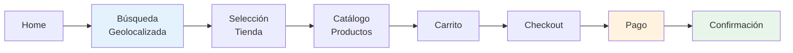
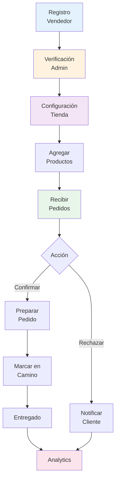
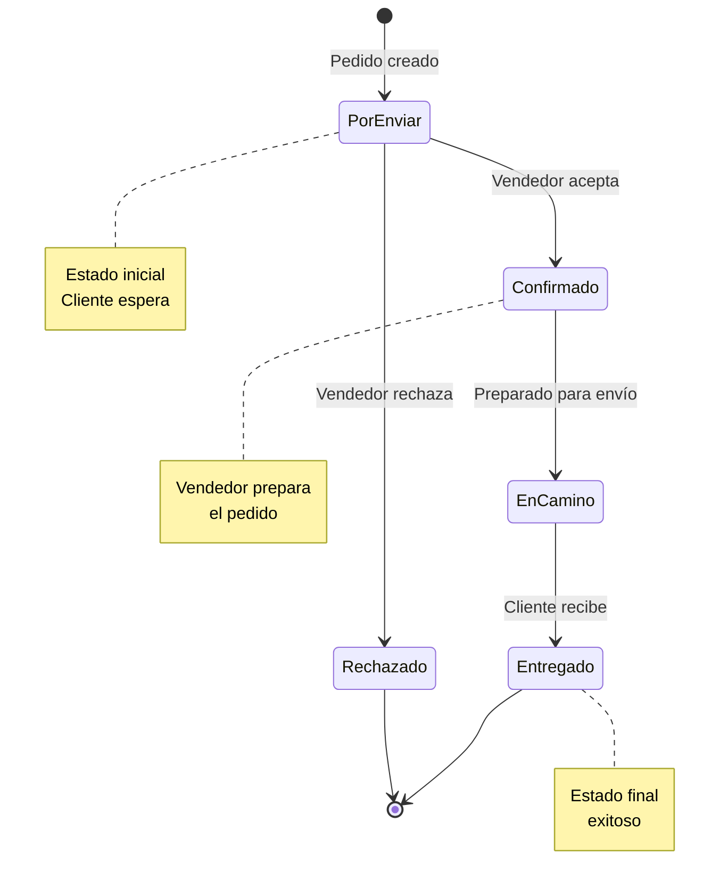
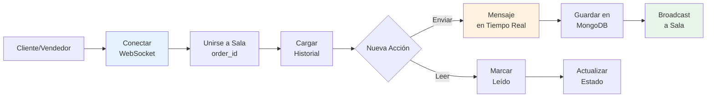
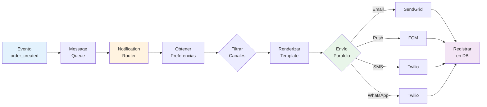

# Arquitectura Tecnológica - Tiendi E-commerce SaaS

## Documento de Arquitectura Técnica v1.0

**Sistema:** Tiendi - Plataforma E-commerce SaaS Multi-Tienda
**Fecha:** 2025-11-25
**Versión:** 1.0
**Generado por:** Claude Sonnet 4.5

---

## Tabla de Contenidos

1. [Resumen Ejecutivo](#1-resumen-ejecutivo)
2. [Visión General del Sistema](#2-visión-general-del-sistema)
3. [Arquitectura de Alto Nivel](#3-arquitectura-de-alto-nivel)
4. [Stack Tecnológico](#4-stack-tecnológico)
5. [Arquitectura Frontend](#5-arquitectura-frontend)
6. [Arquitectura Backend](#6-arquitectura-backend)
7. [Arquitectura Multi-Tenant](#7-arquitectura-multi-tenant)
8. [Arquitectura de Base de Datos](#8-arquitectura-de-base-de-datos)
9. [Integraciones Externas](#9-integraciones-externas)
10. [Sistema de Notificaciones](#10-sistema-de-notificaciones)
11. [Infraestructura y Despliegue](#11-infraestructura-y-despliegue)
12. [CI/CD Pipeline](#12-cicd-pipeline)
13. [Seguridad](#13-seguridad)
14. [Monitoreo y Observabilidad](#14-monitoreo-y-observabilidad)
15. [Escalabilidad](#15-escalabilidad)
16. [Costos Estimados](#16-costos-estimados)
17. [Roadmap Técnico](#17-roadmap-técnico)

---

## 1. Resumen Ejecutivo

**Tiendi** es una plataforma SaaS de e-commerce multi-tienda que permite a emprendedores peruanos crear y gestionar sus propias tiendas virtuales con geolocalización. El sistema conecta tiendas locales con clientes a través de búsqueda geolocalizada, catálogos de productos y proceso de compra completo.

### Características Principales

- **Multi-tienda SaaS:** Arquitectura multi-tenant con aislamiento de datos
- **Geolocalización:** Búsqueda de tiendas cercanas con Google Maps
- **Gestión Completa:** Dashboard para vendedores con productos, pedidos y estadísticas
- **Múltiples Pagos:** Tarjetas (Niubiz/Culqi), Yape, Plin, contraentrega
- **Sistema de Roles:** Super admin, vendedores, empleados y clientes
- **Modelo Freemium:** Planes gratuitos y premium con comisiones
- **Notificaciones Multi-canal:** WhatsApp, Email, SMS y Push

### Objetivos Técnicos

- **Performance:** Tiempo de respuesta < 500ms (p95)
- **Disponibilidad:** 99.9% uptime (SLA)
- **Escalabilidad:** Soportar 10,000+ tiendas y 100,000+ usuarios
- **Seguridad:** Cumplimiento PCI-DSS y GDPR
- **Multi-región:** Despliegue en Azure con alta disponibilidad

---

## 2. Visión General del Sistema

### 2.1 Usuarios del Sistema

1. **Clientes:** Buscan productos, realizan compras, rastrean pedidos
2. **Vendedores:** Gestionan tiendas, productos, inventario y pedidos
3. **Empleados:** Asisten en operaciones de tienda (permisos limitados)
4. **Super Admin:** Administración global de plataforma

### 2.2 Módulos Principales

```
Tiendi Platform
├── Landing Page & Búsqueda Geolocalizada
├── Autenticación y Gestión de Usuarios
├── Gestión de Tiendas (Store Management)
├── Catálogo de Productos
├── Carrito de Compras
├── Proceso de Checkout y Pagos
├── Gestión de Pedidos
├── Sistema de Mensajería (Chat)
├── Sistema de Notificaciones
├── Panel de Administración (Super Admin)
├── Dashboard de Vendedor
├── Sistema de Suscripciones y Comisiones
├── Sistema de Valoraciones y Reviews
├── Sistema de Cupones y Promociones
├── Facturación Electrónica (SUNAT)
└── Analytics y Reportes
```

### 2.3 Flujos de Usuario Principales

#### 2.3.1 Flujo de Compra (Cliente)

**Descripción General:**

Home → Búsqueda Geolocalizada → Selección Tienda → Catálogo → Carrito → Checkout → Pago → Confirmación

**Diagrama Simplificado:**



**Pasos Principales:**

1. **Búsqueda Geolocalizada** - El cliente permite ubicación y ve tiendas cercanas en mapa
2. **Selección de Tienda** - Click en una tienda para ver su catálogo
3. **Navegación de Catálogo** - Búsqueda y filtrado de productos
4. **Agregar al Carrito** - Selección de productos y cantidades
5. **Checkout** - Login/registro + dirección de entrega
6. **Procesamiento de Pago** - Integración con Niubiz/Culqi para pagos
7. **Confirmación** - Orden creada con notificaciones al cliente y vendedor

**Tiempo Total:** ~5-7 segundos (proceso de pago incluido)

> **📄 Diagrama Detallado:** Ver flujo completo con todos los participantes y casos de error en [`DIAGRAMAS/secuencia/FLUJOS_ADICIONALES.md`](DIAGRAMAS/secuencia/FLUJOS_ADICIONALES.md#5-flujo-de-compra-completo-cliente)

**Resumen del Flujo:**

| Fase | Pasos | Tiempo Estimado | Servicios Involucrados |
|------|-------|-----------------|------------------------|
| **1. Búsqueda Geolocalizada** | 1-2 | 500ms | Store Service, Google Maps, Redis |
| **2. Selección de Tienda** | 3 | 200ms | Store Service, Redis |
| **3. Navegación de Catálogo** | 4-5 | 300ms | Product Service, Search Service, Redis |
| **4. Agregar al Carrito** | 6-7 | 100ms | Cart Service, PostgreSQL |
| **5. Checkout** | 8-9 | 500ms | Auth Service, Cart Service, Google Maps |
| **6. Procesamiento de Pago** | 10-11 | 3-5s | Payment Service, Order Service, Niubiz/Culqi |
| **7. Confirmación** | 12 | 200ms | Notification Service |
| **TOTAL** | - | **5-7 segundos** | - |

**Endpoints de API utilizados:**

```typescript
// 1. Búsqueda de tiendas cercanas
GET /api/v1/stores/nearby?lat={lat}&lng={lng}&radius={km}

// 2. Detalles de tienda
GET /api/v1/stores/:slug

// 3. Productos de tienda
GET /api/v1/stores/:id/products?category={cat}&page={n}

// 4. Búsqueda de productos
GET /api/v1/search?q={query}&store_id={id}

// 5. Carrito - Agregar item
POST /api/v1/cart/items
Body: { product_id: string, quantity: number }

// 6. Carrito - Obtener
GET /api/v1/cart

// 7. Crear sesión de pago
POST /api/v1/payments/session
Body: { amount: number, currency: string }

// 8. Crear orden
POST /api/v1/orders
Body: {
  cart_id: string,
  delivery_address: object,
  delivery_type: 'pickup' | 'delivery',
  payment_method: string,
  card_token?: string
}

// 9. Obtener orden
GET /api/v1/orders/:id
```

**Validaciones Importantes:**

1. **Stock disponible:** Verificar antes de crear orden
2. **Precio actual:** Usar precio al momento del pedido, no del carrito
3. **Horario de tienda:** Verificar que esté abierta
4. **Zona de entrega:** Validar que la dirección esté en cobertura
5. **Monto mínimo:** Validar si la tienda tiene monto mínimo
6. **Autenticación:** JWT válido en checkout

**Casos de Error:**

| Error | Código | Mensaje | Acción |
|-------|--------|---------|--------|
| Stock insuficiente | 400 | "Producto sin stock" | Actualizar carrito |
| Tienda cerrada | 400 | "Tienda cerrada" | Mostrar horarios |
| Fuera de cobertura | 400 | "Dirección fuera de zona" | Solicitar otra dirección |
| Pago rechazado | 402 | "Pago no autorizado" | Reintentar o cambiar método |
| Token expirado | 401 | "Sesión expirada" | Redirigir a login |

#### 2.3.2 Flujo de Gestión de Vendedor

**Descripción General:**

Registro → Verificación (Admin) → Configuración → Agregar Productos → Recibir Pedidos → Gestionar Pedidos → Analytics

**Diagrama Simplificado:**



**Fases Principales:**

1. **Registro** (5 min) - Vendedor completa formulario de solicitud
2. **Verificación** (1-2 días) - Admin aprueba y crea cuenta
3. **Configuración** (15-20 min) - Wizard guiado: logo, horarios, ubicación, métodos de pago
4. **Agregar Productos** (5 min/producto) - Catálogo con imágenes y stock
5. **Recibir Pedidos** (tiempo real) - Notificaciones push/email/in-app
6. **Gestionar Pedidos** - Confirmar → En camino → Entregado (o Rechazar)
7. **Analytics** - Dashboard con ventas, productos top, gráficos

**Estados de Pedido:**



**Descripción de Estados:**

| Estado | Código | Color | Actor Responsable | Siguiente Acción |
|--------|--------|-------|-------------------|------------------|
| Por Enviar | `por_enviar` | 🔴 Rojo | Sistema | Vendedor debe confirmar |
| Confirmado | `confirmado` | 🔵 Azul | Vendedor | Preparar pedido |
| En Camino | `en_camino` | 🔵 Azul | Vendedor/Delivery | Entregar al cliente |
| Entregado | `entregado` | 🟢 Verde | Cliente | Completado ✓ |
| Rechazado | `rechazado` | 🔴 Rojo | Vendedor | Notificar cliente |

> **📄 Diagrama Detallado:** Ver flujo completo con todos los pasos de configuración y gestión en [`DIAGRAMAS/secuencia/FLUJOS_ADICIONALES.md`](DIAGRAMAS/secuencia/FLUJOS_ADICIONALES.md#6-flujo-de-gestión-de-vendedor)

**Resumen del Flujo de Vendedor:**

| Fase | Duración | Responsable | Estado |
|------|----------|-------------|--------|
| **1. Registro** | 5 minutos | Vendedor | Inmediato |
| **2. Verificación** | 1-2 días | Admin | Manual |
| **3. Configuración** | 15-20 minutos | Vendedor | Guiado |
| **4. Agregar Productos** | 5 min/producto | Vendedor | Continuo |
| **5. Recibir Pedidos** | Tiempo real | Sistema | Automático |
| **6. Gestionar Pedidos** | Varía | Vendedor | Por pedido |
| **7. Analytics** | Instantáneo | Sistema | Tiempo real |

**Endpoints de API del Vendedor:**

```typescript
// Registro
POST /api/v1/seller-leads
Body: { name, email, phone, business_type, document }

// Configuración de tienda
PUT /api/v1/stores/:id/settings
PUT /api/v1/stores/:id/delivery
POST /api/v1/stores/:id/payment-methods

// Productos
POST /api/v1/products
PUT /api/v1/products/:id
DELETE /api/v1/products/:id
POST /api/v1/upload/product-image

// Pedidos
GET /api/v1/vendor/orders?status={status}
GET /api/v1/orders/:id
PUT /api/v1/orders/:id/confirm
PUT /api/v1/orders/:id/dispatch
PUT /api/v1/orders/:id/complete
PUT /api/v1/orders/:id/reject

// Analytics
GET /api/v1/vendor/analytics?period={period}
GET /api/v1/vendor/reports/sales?from={date}&to={date}
```

**Transiciones de Estados:**

El diagrama completo de estados se encuentra en la sección 2.3.2 arriba ⬆️

#### 2.3.3 Flujo de Chat en Tiempo Real

**Descripción General:**

Sistema de mensajería en tiempo real entre cliente y vendedor sobre pedidos específicos usando WebSocket (Socket.io).

**Diagrama Simplificado:**



**Características Principales:**

- **Tecnología:** WebSocket con Socket.io
- **Persistencia:** MongoDB para almacenar mensajes
- **Autenticación:** JWT token en conexión WebSocket
- **Salas:** Una sala por pedido (order_id)
- **Estados de Mensaje:**
  - ✓ Enviado
  - ✓✓ Entregado
  - ✓✓ (azul) Leído
- **Notificaciones Offline:** Email + Push si el destinatario está desconectado
- **Reconexión Automática:** Si se pierde conexión, reconecta y sincroniza

**Eventos Socket.io:**

| Evento | Dirección | Descripción |
|--------|-----------|-------------|
| `connect` | Client → Server | Establecer conexión WebSocket |
| `join_room` | Client → Server | Unirse a sala del pedido |
| `send_message` | Client → Server | Enviar nuevo mensaje |
| `new_message` | Server → Client | Notificar nuevo mensaje en sala |
| `mark_as_read` | Client → Server | Marcar mensajes como leídos |
| `messages_read` | Server → Client | Notificar que mensajes fueron leídos |

> **📄 Diagrama Detallado:** Ver flujo completo con autenticación, broadcast y notificaciones en [`DIAGRAMAS/secuencia/FLUJOS_ADICIONALES.md`](DIAGRAMAS/secuencia/FLUJOS_ADICIONALES.md#7-flujo-de-chat-en-tiempo-real)

---

## 3. Arquitectura de Alto Nivel

### 3.1 Diagrama de Arquitectura General

```
┌─────────────────────────────────────────────────────────────────┐
│                         CLIENTS LAYER                           │
├─────────────────────────────────────────────────────────────────┤
│  Web App (Next.js)  │  PWA  │  Mobile App (React Native)        │
└─────────────────────────────────────────────────────────────────┘
                                │
                                ▼
┌─────────────────────────────────────────────────────────────────┐
│                    CDN & EDGE LAYER                             │
├─────────────────────────────────────────────────────────────────┤
│  Azure Front Door  │  Azure CDN  │  WAF  │  Edge Functions      │
└─────────────────────────────────────────────────────────────────┘
                                │
                                ▼
┌─────────────────────────────────────────────────────────────────┐
│                      API GATEWAY LAYER                          │
├─────────────────────────────────────────────────────────────────┤
│  API Gateway  │  Auth Service (JWT)  │  Rate Limiting           │
└─────────────────────────────────────────────────────────────────┘
                                │
                                ▼
┌─────────────────────────────────────────────────────────────────┐
│                   MICROSERVICES LAYER (AKS)                     │
├─────────────────────────────────────────────────────────────────┤
│  User Service   │  Store Service   │  Product Service           │
│  Order Service  │  Payment Service │  Chat Service              │
│  Notification Service  │  Search Service (Elasticsearch)        │
└─────────────────────────────────────────────────────────────────┘
                                │
                                ▼
┌─────────────────────────────────────────────────────────────────┐
│                        DATA LAYER                               │
├─────────────────────────────────────────────────────────────────┤
│  PostgreSQL (Primary + Replica)  │  Redis Cache                 │
│  MongoDB (Chat/Logs)  │  Elasticsearch (Search)                 │
│  Azure Blob Storage (Images/Assets)                             │
└─────────────────────────────────────────────────────────────────┘
                                │
                                ▼
┌─────────────────────────────────────────────────────────────────┐
│                  EXTERNAL INTEGRATIONS                          │
├─────────────────────────────────────────────────────────────────┤
│  Google Maps  │  Niubiz/Culqi (Pagos)  │  SendGrid (Email)      │
│  Twilio (SMS/WhatsApp)  │  Nubefact (Facturación SUNAT)         │
└─────────────────────────────────────────────────────────────────┘
                                │
                                ▼
┌─────────────────────────────────────────────────────────────────┐
│                  MONITORING & LOGGING                           │
├─────────────────────────────────────────────────────────────────┤
│  Azure Monitor  │  Application Insights  │  Log Analytics       │
│  Sentry (Error Tracking)  │  Datadog (APM)                      │
└─────────────────────────────────────────────────────────────────┘
```

### 3.2 Diagrama de Arquitectura C4 - Nivel Contenedor

El siguiente diagrama muestra la arquitectura a nivel de contenedores siguiendo el modelo C4:

```mermaid
graph TB
    subgraph "Usuario Final"
        USER[Cliente/Vendedor<br/>Web Browser/Mobile]
    end

    subgraph "Azure Front Door + CDN"
        AFD[Azure Front Door<br/>Global Load Balancer<br/>+ WAF]
        CDN[Azure CDN<br/>Static Assets]
    end

    subgraph "AKS Cluster - Application Containers"

        subgraph "API Gateway Layer"
            GATEWAY[API Gateway Container<br/>NestJS<br/>Port: 3000<br/>Routing + Auth]
        end

        subgraph "Backend Services Containers"
            USER_SVC[User Service<br/>NestJS<br/>Authentication<br/>User Management]

            STORE_SVC[Store Service<br/>NestJS<br/>Store CRUD<br/>Geolocation]

            PRODUCT_SVC[Product Service<br/>NestJS<br/>Catalog<br/>Inventory]

            ORDER_SVC[Order Service<br/>NestJS<br/>Order Processing<br/>Tracking]

            PAYMENT_SVC[Payment Service<br/>NestJS<br/>Payment Gateway<br/>Webhooks]

            CHAT_SVC[Chat Service<br/>NestJS + Socket.io<br/>Real-time Messaging]

            NOTIF_SVC[Notification Service<br/>NestJS<br/>Multi-channel<br/>Notifications]

            SEARCH_SVC[Search Service<br/>NestJS<br/>Elasticsearch Client]
        end

        subgraph "Frontend Container"
            WEB_APP[Web Application<br/>Next.js 14<br/>SSR + CSR<br/>Port: 3000]
        end

        subgraph "Background Workers"
            WORKER[Background Workers<br/>Bull Queue<br/>Async Jobs]
        end
    end

    subgraph "Data Stores - Azure Managed Services"
        POSTGRES[(PostgreSQL<br/>Flexible Server<br/>Primary + Replica<br/>Transactional Data)]

        REDIS[(Redis Cache<br/>Premium Tier<br/>Sessions + Cache<br/>Pub/Sub)]

        MONGO[(Cosmos DB<br/>MongoDB API<br/>Chat Messages<br/>Logs)]

        ELASTIC[(Elasticsearch<br/>Search Index<br/>Full-text Search<br/>Geospatial)]

        BLOB[Azure Blob Storage<br/>Images + Assets<br/>Hot/Cool/Archive]
    end

    subgraph "External Systems"
        GOOGLE_MAPS[Google Maps API<br/>Geocoding<br/>Distance Matrix]

        PAYMENT_GW[Payment Gateways<br/>Niubiz/Culqi<br/>Card Processing]

        SENDGRID[SendGrid<br/>Email Service<br/>Transactional]

        TWILIO[Twilio<br/>SMS + WhatsApp<br/>Business API]

        NUBEFACT[Nubefact<br/>SUNAT<br/>E-invoicing]
    end

    subgraph "Monitoring & Observability"
        APP_INSIGHTS[Application Insights<br/>APM + Tracing<br/>Performance]

        MONITOR[Azure Monitor<br/>Metrics + Alerts<br/>Dashboards]

        SENTRY[Sentry<br/>Error Tracking<br/>Crash Reports]
    end

    %% User connections
    USER -->|HTTPS| AFD
    AFD --> CDN
    AFD --> GATEWAY
    CDN --> WEB_APP

    %% API Gateway to Services
    GATEWAY --> USER_SVC
    GATEWAY --> STORE_SVC
    GATEWAY --> PRODUCT_SVC
    GATEWAY --> ORDER_SVC
    GATEWAY --> PAYMENT_SVC
    GATEWAY --> CHAT_SVC
    GATEWAY --> NOTIF_SVC
    GATEWAY --> SEARCH_SVC

    %% Services to Data Stores
    USER_SVC --> POSTGRES
    USER_SVC --> REDIS

    STORE_SVC --> POSTGRES
    STORE_SVC --> REDIS
    STORE_SVC --> ELASTIC

    PRODUCT_SVC --> POSTGRES
    PRODUCT_SVC --> REDIS
    PRODUCT_SVC --> ELASTIC

    ORDER_SVC --> POSTGRES
    ORDER_SVC --> REDIS

    PAYMENT_SVC --> POSTGRES

    CHAT_SVC --> MONGO
    CHAT_SVC --> REDIS

    NOTIF_SVC --> POSTGRES
    NOTIF_SVC --> REDIS

    SEARCH_SVC --> ELASTIC

    %% Background Workers
    ORDER_SVC -.->|Queue Jobs| REDIS
    PAYMENT_SVC -.->|Queue Jobs| REDIS
    NOTIF_SVC -.->|Queue Jobs| REDIS
    REDIS -.->|Process Jobs| WORKER
    WORKER --> POSTGRES

    %% External Integrations
    STORE_SVC --> GOOGLE_MAPS
    SEARCH_SVC --> GOOGLE_MAPS
    PAYMENT_SVC --> PAYMENT_GW
    NOTIF_SVC --> SENDGRID
    NOTIF_SVC --> TWILIO
    ORDER_SVC --> NUBEFACT

    %% Storage
    PRODUCT_SVC --> BLOB
    STORE_SVC --> BLOB
    USER_SVC --> BLOB

    %% Monitoring
    GATEWAY --> APP_INSIGHTS
    USER_SVC --> APP_INSIGHTS
    STORE_SVC --> APP_INSIGHTS
    PRODUCT_SVC --> APP_INSIGHTS
    ORDER_SVC --> APP_INSIGHTS
    PAYMENT_SVC --> APP_INSIGHTS
    WEB_APP --> APP_INSIGHTS

    APP_INSIGHTS --> MONITOR
    GATEWAY --> SENTRY
    WEB_APP --> SENTRY

    %% Styling
    style GATEWAY fill:#3498db,color:#fff
    style POSTGRES fill:#336791,color:#fff
    style REDIS fill:#DC382D,color:#fff
    style MONGO fill:#4DB33D,color:#fff
    style ELASTIC fill:#FEC514,color:#000
    style AFD fill:#0078D4,color:#fff
    style APP_INSIGHTS fill:#68217A,color:#fff
```



**Descripción de Contenedores:**

| Contenedor | Tecnología | Responsabilidad | Escala |
|------------|------------|-----------------|--------|
| **API Gateway** | NestJS + Express | Enrutamiento, autenticación, rate limiting | 3-5 pods |
| **User Service** | NestJS + TypeORM | Gestión de usuarios, auth, perfiles | 2-4 pods |
| **Store Service** | NestJS + TypeORM | CRUD tiendas, geolocalización | 2-4 pods |
| **Product Service** | NestJS + TypeORM | Catálogo, inventario, categorías | 3-6 pods |
| **Order Service** | NestJS + TypeORM | Procesamiento de pedidos, estados | 3-6 pods |
| **Payment Service** | NestJS | Integración pagos, webhooks | 2-3 pods |
| **Chat Service** | NestJS + Socket.io | Mensajería en tiempo real | 2-4 pods |
| **Notification Service** | NestJS + Bull | Notificaciones multi-canal | 2-3 pods |
| **Search Service** | NestJS + Elasticsearch | Búsqueda full-text y geoespacial | 2-3 pods |
| **Web Application** | Next.js 14 | Frontend SSR/CSR | 2-4 pods |
| **Background Workers** | Bull Workers | Procesamiento asíncrono | 2-4 pods |

**Protocolos de Comunicación:**

- **Usuario → Azure:** HTTPS (TLS 1.3)
- **API Gateway → Services:** HTTP/REST (interno)
- **Services → Databases:** TCP (conexiones persistentes)
- **Chat:** WebSocket (Socket.io)
- **Workers:** Redis Pub/Sub
- **External APIs:** HTTPS/REST

### 3.3 Principios Arquitectónicos

1. **Microservicios:** Servicios independientes y escalables
2. **API-First:** Contratos de API bien definidos
3. **Multi-Tenant:** Aislamiento de datos por tienda
4. **Event-Driven:** Comunicación asíncrona vía message queue
5. **Cloud-Native:** Diseñado para Kubernetes en Azure
6. **Security-First:** Seguridad en todas las capas
7. **Observability:** Monitoreo completo y trazabilidad

---

## 4. Stack Tecnológico

### 4.1 Frontend

| Tecnología | Versión | Propósito |
|------------|---------|-----------|
| **Next.js** | 14+ | Framework principal (App Router) |
| **React** | 18+ | UI Library |
| **TypeScript** | 5.0+ | Lenguaje principal |
| **Redux Toolkit** | 2.0+ | State management (global) |
| **React Query** | 5.0+ | Server state management |
| **Tailwind CSS** | 3.4+ | Styling framework |
| **Google Maps API** | Latest | Mapas y geolocalización |
| **Socket.io Client** | 4.6+ | WebSocket para chat |
| **Axios** | 1.6+ | HTTP client |
| **Zod** | 3.22+ | Validación de schemas |
| **React Hook Form** | 7.49+ | Gestión de formularios |

### 4.2 Backend

| Tecnología | Versión | Propósito |
|------------|---------|-----------|
| **Node.js** | 20 LTS | Runtime |
| **NestJS** | 10+ | Framework backend |
| **TypeScript** | 5.0+ | Lenguaje principal |
| **TypeORM** | 0.3+ | ORM para PostgreSQL |
| **Passport.js** | 0.7+ | Autenticación |
| **JWT** | 9.0+ | Tokens de acceso |
| **Class-validator** | 0.14+ | Validación de DTOs |
| **Bull** | 4.12+ | Job queue con Redis |
| **Socket.io** | 4.6+ | WebSocket server |
| **Helmet** | 7.1+ | Security headers |

### 4.3 Base de Datos

| Tecnología | Versión | Propósito |
|------------|---------|-----------|
| **PostgreSQL** | 14+ | Base de datos principal (transaccional) |
| **Redis** | 7+ | Cache, sessions, pub/sub |
| **MongoDB** | 6.0+ | Chat y logs no estructurados |
| **Elasticsearch** | 8.11+ | Búsqueda full-text y geoespacial |

### 4.4 Infraestructura

| Tecnología | Propósito |
|------------|-----------|
| **Azure Kubernetes Service (AKS)** | Orquestación de contenedores |
| **Azure Database for PostgreSQL** | PostgreSQL administrado |
| **Azure Cache for Redis** | Redis administrado |
| **Azure Cosmos DB** | MongoDB API (chat/logs) |
| **Azure Blob Storage** | Almacenamiento de imágenes |
| **Azure Front Door** | CDN y load balancing global |
| **Azure Monitor** | Monitoreo y métricas |
| **Application Insights** | APM y trazabilidad |
| **Docker** | Containerización |
| **GitHub Actions** | CI/CD pipeline |
| **Terraform** | Infrastructure as Code |

### 4.5 Integraciones Externas

| Servicio | Propósito |
|----------|-----------|
| **Google Maps API** | Geocoding, Places, Distance Matrix |
| **Niubiz** | Pagos con tarjeta (Visa/Mastercard) |
| **Culqi** | Alternativa de pagos Perú |
| **SendGrid** | Email transaccional |
| **Twilio** | SMS y WhatsApp Business |
| **Nubefact** | Facturación electrónica SUNAT |
| **Firebase FCM** | Push notifications |
| **Sentry** | Error tracking |
| **Datadog** | APM y logging |

---

## 5. Arquitectura Frontend

### 5.1 Estructura de Proyecto

```
frontend/
├── src/
│   ├── app/                        # Next.js App Router
│   │   ├── (auth)/                 # Grupo: Autenticación
│   │   │   ├── login/
│   │   │   └── register/
│   │   ├── (shop)/                 # Grupo: Tienda
│   │   │   ├── search/
│   │   │   ├── store/[slug]/
│   │   │   ├── product/[id]/
│   │   │   └── checkout/
│   │   ├── (account)/              # Grupo: Cuenta usuario
│   │   │   ├── orders/
│   │   │   ├── favorites/
│   │   │   └── messages/
│   │   ├── (vendor)/               # Grupo: Dashboard vendedor
│   │   │   ├── dashboard/
│   │   │   ├── products/
│   │   │   ├── orders/
│   │   │   └── settings/
│   │   ├── layout.tsx
│   │   └── page.tsx
│   │
│   ├── components/                 # Componentes reutilizables
│   │   ├── ui/                     # Componentes base
│   │   │   ├── Button/
│   │   │   ├── Input/
│   │   │   ├── Card/
│   │   │   └── Modal/
│   │   ├── features/               # Componentes de funcionalidad
│   │   │   ├── ProductCard/
│   │   │   ├── CartSidebar/
│   │   │   ├── StoreCard/
│   │   │   └── ChatWidget/
│   │   └── layout/
│   │       ├── Header/
│   │       ├── Footer/
│   │       └── Sidebar/
│   │
│   ├── hooks/                      # Custom hooks
│   │   ├── useAuth.ts
│   │   ├── useCart.ts
│   │   ├── useGeolocation.ts
│   │   ├── useSocket.ts
│   │   └── useDebounce.ts
│   │
│   ├── services/                   # API services
│   │   ├── api/
│   │   │   ├── auth.service.ts
│   │   │   ├── products.service.ts
│   │   │   ├── orders.service.ts
│   │   │   └── stores.service.ts
│   │   ├── socket/
│   │   │   └── chat.service.ts
│   │   └── external/
│   │       ├── maps.service.ts
│   │       └── payment.service.ts
│   │
│   ├── store/                      # Redux store
│   │   ├── slices/
│   │   │   ├── authSlice.ts
│   │   │   ├── cartSlice.ts
│   │   │   ├── uiSlice.ts
│   │   │   └── favoritesSlice.ts
│   │   └── store.ts
│   │
│   ├── lib/                        # Utilidades
│   │   ├── validators/
│   │   ├── formatters/
│   │   ├── constants/
│   │   └── utils.ts
│   │
│   └── types/                      # TypeScript types
│       ├── user.types.ts
│       ├── product.types.ts
│       └── order.types.ts
│
├── public/                         # Assets estáticos
├── next.config.js
└── package.json
```

### 5.2 Gestión de Estado

**Estado Global (Redux Toolkit):**
- `authSlice`: Usuario autenticado, token, permisos
- `cartSlice`: Items del carrito, cantidades, subtotal
- `uiSlice`: Modales, sidebars, notificaciones
- `favoritesSlice`: Productos favoritos

**Estado del Servidor (React Query):**
- Products, Stores, Orders (cacheo y sincronización)
- Invalidación automática de cache
- Optimistic updates

**Estado Local (useState/useReducer):**
- Formularios
- Estados temporales de UI
- Filtros locales

### 5.3 Estrategias de Rendering

| Tipo | Uso | Páginas |
|------|-----|---------|
| **SSR** | SEO crítico | Detalle de producto, tienda, búsqueda |
| **SSG** | Contenido estático | Landing, términos, ayuda |
| **ISR** | Contenido semi-estático | Categorías, promociones |
| **CSR** | Interacción del usuario | Dashboard, carrito, chat |

### 5.4 Optimizaciones Frontend

1. **Code Splitting:** Lazy loading de rutas y componentes
2. **Image Optimization:** Next.js Image component con WebP
3. **Bundle Analysis:** Webpack Bundle Analyzer
4. **Fonts:** Optimización de Google Fonts
5. **Service Worker:** PWA con cache offline
6. **Prefetching:** Links con prefetch automático

---

## 6. Arquitectura Backend

### 6.1 Estructura de Proyecto NestJS

```
backend/
├── src/
│   ├── modules/
│   │   ├── auth/                   # Autenticación
│   │   │   ├── strategies/
│   │   │   ├── guards/
│   │   │   ├── decorators/
│   │   │   └── auth.module.ts
│   │   ├── users/                  # Gestión usuarios
│   │   ├── stores/                 # Gestión tiendas
│   │   ├── products/               # Gestión productos
│   │   ├── orders/                 # Gestión pedidos
│   │   ├── payments/               # Procesamiento pagos
│   │   ├── chat/                   # Mensajería
│   │   ├── notifications/          # Notificaciones
│   │   ├── search/                 # Búsqueda
│   │   └── analytics/              # Analytics
│   │
│   ├── common/
│   │   ├── guards/                 # Guards globales
│   │   ├── interceptors/           # Interceptors
│   │   ├── filters/                # Exception filters
│   │   ├── decorators/             # Decoradores custom
│   │   ├── pipes/                  # Pipes de validación
│   │   └── middleware/             # Middleware
│   │
│   ├── config/                     # Configuración
│   │   ├── database.config.ts
│   │   ├── redis.config.ts
│   │   └── integrations.config.ts
│   │
│   ├── database/
│   │   ├── migrations/             # Migraciones TypeORM
│   │   ├── seeds/                  # Seeders
│   │   └── entities/               # Entidades
│   │
│   ├── shared/                     # Código compartido
│   │   ├── dto/                    # DTOs base
│   │   ├── interfaces/
│   │   └── utils/
│   │
│   └── main.ts                     # Entry point
│
├── test/                           # Tests
│   ├── unit/
│   ├── integration/
│   └── e2e/
│
├── docker-compose.yml
├── Dockerfile
└── nest-cli.json
```

### 6.2 Microservicios

Aunque el sistema inicia como monolito modular, está diseñado para evolucionar a microservicios:

**Servicios Principales:**

1. **User Service**
   - Autenticación y autorización
   - Gestión de perfiles
   - OAuth2 (Google, Facebook)

2. **Store Service**
   - CRUD de tiendas
   - Configuración y settings
   - Geolocalización

3. **Product Service**
   - Catálogo de productos
   - Categorías y marcas
   - Inventario

4. **Order Service**
   - Creación de pedidos
   - Estados y tracking
   - Historial

5. **Payment Service**
   - Integración con pasarelas
   - Procesamiento de pagos
   - Webhooks

6. **Chat Service**
   - WebSocket server
   - Mensajes en tiempo real
   - Notificaciones de chat

7. **Notification Service**
   - Email, SMS, WhatsApp, Push
   - Templates y personalización
   - Queue de envíos

8. **Search Service**
   - Elasticsearch integration
   - Búsqueda full-text
   - Búsqueda geoespacial

### 6.3 Comunicación Entre Servicios

**Sincrónica (REST API):**
- Operaciones CRUD
- Consultas inmediatas
- Validaciones en tiempo real

**Asíncrona (Message Queue):**
- Eventos de dominio
- Procesamiento en background
- Notificaciones
- Integrations externas

**Tecnología:** RabbitMQ o Azure Service Bus

---

## 7. Arquitectura Multi-Tenant

### 7.1 Estrategia: Discriminador Compartido

Tiendi utiliza una estrategia de **base de datos compartida con discriminador** (`store_id`) combinada con **Row-Level Security (RLS)** de PostgreSQL.

**Ventajas:**
- Bajo costo operacional
- Fácil mantenimiento
- Excelente performance
- Escalabilidad simple

**Implementación:**

```typescript
// Middleware de tenant context
export async function tenantContextMiddleware(
  req: Request,
  res: Response,
  next: NextFunction
) {
  const tenantId = await resolveTenant(req);

  if (!tenantId) {
    return res.status(400).json({ error: 'Tenant not found' });
  }

  req.tenantId = tenantId;

  // Establecer contexto en PostgreSQL
  await db.query(`SET LOCAL app.tenant_id = $1`, [tenantId]);

  next();
}
```

**Row-Level Security en PostgreSQL:**

```sql
-- Habilitar RLS en productos
ALTER TABLE products ENABLE ROW LEVEL SECURITY;

-- Política: Solo ver productos del tenant actual
CREATE POLICY tenant_isolation_policy ON products
  USING (store_id = current_setting('app.tenant_id')::uuid);
```

### 7.2 Identificación de Tenant

**Métodos soportados:**

1. **Subdomain:** `minimarket.tiendi.pe` → tenant: `minimarket`
2. **Path:** `/store/minimarket` → tenant: `minimarket`
3. **Header:** `X-Tenant-ID: uuid-123`
4. **User-based:** Usuario pertenece a tienda específica

### 7.3 Tablas Multi-Tenant vs Compartidas

**Con `tenant_id` (store_id):**
- `products`
- `orders`
- `order_items`
- `store_hours`
- `payment_methods`
- `reviews`
- `coupons`

**Sin `tenant_id` (compartidas):**
- `users` (un usuario puede tener múltiples roles en diferentes tiendas)
- `stores` (la tabla de tenants misma)
- `categories` (catálogo global)
- `brands` (marcas globales)

---

## 8. Arquitectura de Base de Datos

### 8.1 Modelo de Datos Principal

**Tablas Core:**

```sql
-- Usuarios
users (id, email, password_hash, first_name, last_name, phone, role, ...)

-- Tiendas (Tenants)
stores (id, owner_id, name, slug, location, address, phone, settings, ...)

-- Productos
products (id, store_id, category_id, name, price, stock, images, ...)

-- Categorías
categories (id, parent_id, name, slug, order, ...)

-- Pedidos
orders (id, store_id, customer_id, order_number, status, total, ...)

-- Items de Pedido
order_items (id, order_id, product_id, quantity, unit_price, subtotal)

-- Carrito
cart_items (id, user_id, product_id, quantity)

-- Favoritos
favorites (id, user_id, product_id)

-- Mensajes
messages (id, order_id, sender_id, sender_type, content, is_read, ...)

-- Suscripciones
subscription_plans (id, name, price, features, ...)
store_subscriptions (id, store_id, plan_id, status, start_date, end_date, ...)

-- Notificaciones
notifications (id, user_id, type, title, message, channels, status, ...)
notification_preferences (user_id, email_orders, push_messages, ...)
```

### 8.2 Índices Clave

```sql
-- Geoespacial (tiendas cercanas)
CREATE INDEX idx_stores_location ON stores USING GIST (location);

-- Full-text search (productos)
CREATE INDEX idx_products_search ON products
  USING GIN (to_tsvector('spanish', name || ' ' || description));

-- Queries frecuentes
CREATE INDEX idx_products_store_active ON products(store_id, is_active);
CREATE INDEX idx_orders_customer ON orders(customer_id, created_at DESC);
CREATE INDEX idx_orders_store_status ON orders(store_id, status);
```

### 8.3 Optimizaciones

1. **Connection Pooling:** pgBouncer o TypeORM pool
2. **Read Replicas:** Para queries de lectura intensiva
3. **Partitioning:** Particionar tabla `orders` por fecha
4. **Materialized Views:** Para reportes y analytics
5. **Redis Cache:** Cache de productos, tiendas, sesiones

---

## 9. Integraciones Externas

### 9.1 Pasarelas de Pago (Perú)

**Niubiz (Principal):**
- Visa, Mastercard, American Express
- Comisión: 3.5% + S/ 0.50 por transacción
- Integración: REST API + JavaScript SDK

**Culqi (Alternativa):**
- Visa, Mastercard, Diners
- Comisión: 3.79% por transacción
- Integración: REST API

**Yape / Plin:**
- Upload de comprobante de pago
- Confirmación manual por vendedor

### 9.2 Google Maps API

**Servicios utilizados:**
- **Geocoding API:** Dirección → coordenadas
- **Places API:** Autocomplete de direcciones
- **Distance Matrix API:** Calcular distancias
- **Maps JavaScript API:** Mapas interactivos

**Costo:** ~$200/mes (con optimizaciones)

### 9.3 Comunicaciones

**SendGrid (Email):**
- Emails transaccionales
- Templates personalizables
- Tracking de aperturas y clicks
- Costo: $100/mes (100K emails)

**Twilio (SMS + WhatsApp):**
- SMS transaccionales
- WhatsApp Business API
- Costo: $0.10/SMS, $0.05/WhatsApp

### 9.4 Facturación Electrónica

**Nubefact (PSE SUNAT):**
- Boletas y facturas electrónicas
- Notas de crédito/débito
- Envío automático a SUNAT
- Costo: $50/mes (hasta 500 comprobantes)

### 9.5 Patrón de Integración: Adapter

```typescript
interface PaymentAdapter {
  createSession(amount: number): Promise<SessionToken>;
  authorize(token: string, amount: number): Promise<AuthResult>;
  capture(authCode: string): Promise<CaptureResult>;
  refund(transactionId: string, amount: number): Promise<RefundResult>;
}

class NiubizAdapter implements PaymentAdapter {
  // Implementación específica de Niubiz
}

class CulqiAdapter implements PaymentAdapter {
  // Implementación específica de Culqi
}

// Factory
class PaymentAdapterFactory {
  static create(provider: string): PaymentAdapter {
    switch (provider) {
      case 'niubiz': return new NiubizAdapter();
      case 'culqi': return new CulqiAdapter();
      default: throw new Error('Unknown provider');
    }
  }
}
```

---

## 10. Sistema de Notificaciones

### 10.1 Arquitectura de Notificaciones

**Canales Soportados:**
- Email (SendGrid)
- SMS (Twilio)
- WhatsApp (Twilio WhatsApp API)
- Push Notifications (Firebase FCM)
- In-App Notifications

**Tipos de Notificaciones:**

**Transaccionales:**
- Pedido creado
- Pedido confirmado
- Pedido en tránsito
- Pedido entregado
- Nuevo mensaje

**Marketing:**
- Promociones
- Carritos abandonados
- Recomendaciones

**Sistema:**
- Alertas de stock bajo (vendedores)
- Nuevos pedidos (vendedores)
- Cambio de contraseña

### 10.2 Flujo de Notificación

**Descripción General:**

Sistema event-driven para notificaciones multi-canal (Email, Push, SMS, WhatsApp) con gestión de preferencias de usuario.

**Diagrama Simplificado:**



**Componentes Principales:**

1. **Event Source** - Servicios publican eventos (order_created, order_delivered, etc.)
2. **Message Queue** - Redis/RabbitMQ para desacoplar y garantizar entrega
3. **Notification Router** - Coordina el proceso de envío
4. **Preference Service** - Consulta preferencias del usuario (canales activos, horarios silenciosos)
5. **Template Service** - Renderiza templates con variables personalizadas
6. **Multi-Channel Delivery** - Envío paralelo por Email, Push, SMS, WhatsApp
7. **Persistencia** - Guarda historial de notificaciones en PostgreSQL

**Canales de Notificación:**

| Canal | Proveedor | Tiempo | Costo |
|-------|-----------|--------|-------|
| Email | SendGrid | ~200ms | $0.0006 |
| Push | FCM | ~100ms | Gratis |
| SMS | Twilio | ~300ms | $0.04 |
| WhatsApp | Twilio | ~200ms | $0.005 |

**Características:**

- **Preferencias de Usuario:** Cada usuario controla qué canales recibe
- **Horarios Silenciosos:** No enviar entre 22:00 - 08:00 (configurable)
- **Retry Logic:** Reintentos automáticos si falla un canal
- **Fallback:** Si email falla, intenta otros canales
- **Templates Dinámicos:** Variables como `{order_number}`, `{amount}`, `{customer_name}`

**Tiempo Total de Procesamiento:** ~500ms

> **📄 Diagrama Detallado:** Ver flujo completo con sequence diagram, manejo de errores y todos los tipos de notificaciones en [`DIAGRAMAS/secuencia/FLUJOS_ADICIONALES.md`](DIAGRAMAS/secuencia/FLUJOS_ADICIONALES.md#8-flujo-de-sistema-de-notificaciones)

### 10.3 Gestión de Preferencias

Tabla `notification_preferences`:
```sql
CREATE TABLE notification_preferences (
  user_id UUID PRIMARY KEY,
  -- Email
  email_orders BOOLEAN DEFAULT TRUE,
  email_messages BOOLEAN DEFAULT TRUE,
  email_promotions BOOLEAN DEFAULT TRUE,
  -- Push
  push_orders BOOLEAN DEFAULT TRUE,
  push_messages BOOLEAN DEFAULT TRUE,
  -- SMS
  sms_orders BOOLEAN DEFAULT FALSE,
  -- Quiet hours
  quiet_hours_enabled BOOLEAN DEFAULT FALSE,
  quiet_hours_start TIME,
  quiet_hours_end TIME
);
```

---

## 11. Infraestructura y Despliegue

### 11.1 Azure Cloud Architecture

**Compute:**
- **Azure Kubernetes Service (AKS):**
  - Production Cluster: 3-10 nodes (Standard_D4s_v3)
  - DR Cluster: 2-5 nodes (Standard_D2s_v3)
  - Auto-scaling habilitado

**Database:**
- **Azure Database for PostgreSQL:**
  - Flexible Server, 4 vCores, 32 GB RAM
  - High Availability (Zone-redundant)
  - Backup: 35 días, Geo-redundante
- **Azure Cache for Redis:**
  - Premium P1 (6 GB)
  - Persistence RDB + AOF
- **Azure Cosmos DB:**
  - MongoDB API
  - Multi-region writes

**Storage:**
- **Azure Blob Storage:**
  - Hot tier: Imágenes activas
  - Cool tier: Backups
  - Archive tier: Logs antiguos
- **Azure Files:** Persistent volumes para AKS

**Networking:**
- **Azure Front Door:** Load balancing global + WAF
- **Azure CDN:** Distribución de contenido estático
- **Private Endpoints:** Para bases de datos y storage
- **NSGs:** Network security groups

**Security:**
- **Azure Key Vault:** Secrets y certificados
- **Managed Identities:** Para autenticación entre servicios
- **Microsoft Defender for Cloud:** Seguridad
- **Azure DDoS Protection:** Protección contra DDoS

### 11.2 Regiones y Alta Disponibilidad

**Primary Region:** East US 2
**DR Region:** West US 2

**SLA Target:** 99.9% uptime

**Estrategias:**
- Multi-zone deployment en AKS
- Database replication (Primary + Read Replica)
- Geo-redundant backups
- Automated failover

### 11.3 Disaster Recovery

**RTO (Recovery Time Objective):** 4 horas
**RPO (Recovery Point Objective):** 5 minutos

**Backup Strategy:**
- PostgreSQL: Backups automáticos diarios + point-in-time recovery
- Redis: RDB + AOF persistence
- Blob Storage: Versioning + Soft delete (30 días)
- Kubernetes: Velero para backups de estado

---

## 12. CI/CD Pipeline

### 12.1 GitHub Actions Workflow

**Pipeline Stages:**

1. **Lint & Type Check**
   - ESLint
   - TypeScript check
   - Prettier

2. **Unit Tests**
   - Jest tests
   - Coverage > 80%
   - Upload a Codecov

3. **Integration Tests**
   - Tests con PostgreSQL + Redis (containers)
   - Migraciones de test

4. **E2E Tests**
   - Playwright tests
   - Smoke tests

5. **Build Docker Image**
   - Multi-stage build
   - Push to GitHub Container Registry
   - Tag: branch name + SHA

6. **Security Scanning**
   - SonarCloud code analysis
   - Dependency vulnerability scan
   - Container image scan

7. **Deploy to Staging**
   - Deploy to AKS staging namespace
   - Run smoke tests
   - Manual approval gate

8. **Deploy to Production**
   - Deploy to AKS production
   - Rolling update strategy
   - Health checks
   - Rollback automático si falla

**Environments:**
- Development (auto-deploy from `develop`)
- Staging (auto-deploy from `develop`)
- Production (auto-deploy from `main`, con approval)

### 12.2 Estrategias de Deployment

**Rolling Update (Default):**
- Zero downtime
- Gradual rollout
- `maxSurge: 1, maxUnavailable: 0`

**Blue-Green (Optional):**
- Deploy completo a "green"
- Switch de tráfico instant
- Rollback rápido

**Canary (Advanced):**
- 10% tráfico a versión nueva
- Monitorear métricas
- Rollout gradual si exitoso

### 12.3 Kubernetes Manifests

```yaml
# Deployment
apiVersion: apps/v1
kind: Deployment
metadata:
  name: tiendi-api
spec:
  replicas: 3
  strategy:
    type: RollingUpdate
  template:
    spec:
      containers:
      - name: tiendi-api
        image: ghcr.io/tiendi/api:latest
        resources:
          requests:
            memory: "256Mi"
            cpu: "200m"
          limits:
            memory: "512Mi"
            cpu: "500m"
        livenessProbe:
          httpGet:
            path: /health
            port: 3000
          initialDelaySeconds: 30
          periodSeconds: 10
        readinessProbe:
          httpGet:
            path: /health/ready
            port: 3000

# HorizontalPodAutoscaler
apiVersion: autoscaling/v2
kind: HorizontalPodAutoscaler
metadata:
  name: tiendi-api-hpa
spec:
  scaleTargetRef:
    kind: Deployment
    name: tiendi-api
  minReplicas: 3
  maxReplicas: 10
  metrics:
  - type: Resource
    resource:
      name: cpu
      target:
        averageUtilization: 70
```

---

## 13. Seguridad

### 13.1 Autenticación y Autorización

**Autenticación:**
- JWT tokens (access + refresh)
- OAuth2 (Google, Facebook)
- Password hashing: bcrypt (12 rounds)
- 2FA opcional para vendedores

**Autorización:**
- Role-Based Access Control (RBAC)
- Roles: super_admin, store_owner, employee, customer
- Permisos granulares por módulo
- Validación a nivel de API y UI

### 13.2 Seguridad de API

**Implementaciones:**
- Rate limiting: 100 req/min por IP
- CORS configurado correctamente
- Helmet.js para security headers
- Input validation con class-validator
- SQL Injection prevention (ORM)
- XSS prevention (sanitización)
- CSRF tokens

### 13.3 Seguridad de Datos

**En Tránsito:**
- HTTPS obligatorio (TLS 1.3)
- Certificados Let's Encrypt
- Azure Front Door + WAF

**En Reposo:**
- Encryption at rest en Azure (AES-256)
- Database encryption
- Azure Key Vault para secrets

**Compliance:**
- PCI-DSS: No almacenar datos de tarjetas
- GDPR: Consentimiento explícito, derecho al olvido
- Ley de Protección de Datos Personales (Perú)

### 13.4 Monitoreo de Seguridad

- Microsoft Defender for Cloud
- Azure Security Center
- Sentry para error tracking
- Logs de auditoría completos
- Alertas de actividad sospechosa

---

## 14. Monitoreo y Observabilidad

### 14.1 Métricas (Azure Monitor)

**Métricas de Infraestructura:**
- CPU, Memory, Disk usage
- Network throughput
- Container metrics
- Database connections

**Métricas de Aplicación:**
- Request rate y latency
- Error rate (4xx, 5xx)
- Active users
- Transactions per second

**Métricas de Negocio:**
- Orders created
- GMV (Gross Merchandise Value)
- Conversion rate
- Active stores

### 14.2 Logging (Log Analytics)

**Logs Centralizados:**
- Application logs (stdout/stderr)
- Access logs (nginx)
- Database query logs
- Audit logs

**Retention:** 90 días (production), 30 días (staging)

### 14.3 Tracing (Application Insights)

- Distributed tracing
- Request correlation
- Dependency tracking
- Performance profiling
- Slow query detection

### 14.4 Alerting

**Alertas Críticas:**
- High error rate (> 5%)
- High latency (p95 > 2s)
- Database connection pool exhausted
- Disk space low (< 10%)
- Service down

**Canales de Notificación:**
- Slack (equipo dev)
- Email (on-call engineer)
- PagerDuty (incidentes críticos)

### 14.5 Dashboards

**Azure Dashboards:**
- Infrastructure overview
- Application performance
- Business metrics
- Cost analysis

**Grafana:**
- Custom dashboards
- Real-time metrics
- Historical trends

---

## 15. Escalabilidad

### 15.1 Escalabilidad Horizontal

**Aplicación (AKS):**
- HorizontalPodAutoscaler basado en CPU/Memory
- Min: 3 replicas, Max: 10 replicas
- Auto-scaling de nodos de AKS

**Base de Datos:**
- Read replicas para lectura intensiva
- Connection pooling (pgBouncer)
- Sharding futuro si es necesario

**Cache:**
- Redis Cluster para distribución
- Cache distribuido con TTL

### 15.2 Optimizaciones de Performance

**Backend:**
- Query optimization con EXPLAIN ANALYZE
- Índices apropiados
- Redis cache para queries frecuentes
- Connection pooling
- Compression (gzip)

**Frontend:**
- Code splitting
- Lazy loading
- Image optimization (WebP, responsive)
- CDN para assets estáticos
- Service Worker (PWA)

**Database:**
- Índices geoespaciales (GIST)
- Full-text search índices (GIN)
- Partial índices
- Materialized views para reportes

### 15.3 Capacidad Estimada

Con la infraestructura propuesta:
- **Tiendas:** 10,000+ activas
- **Usuarios:** 100,000+ registrados
- **Pedidos:** 50,000/día (pico)
- **Requests:** 1,000 req/s (sostenido)
- **Latencia:** < 500ms (p95)

---

## 16. Costos Estimados

### 16.1 Costos de Infraestructura (Azure)

| Servicio | Costo Mensual |
|----------|---------------|
| AKS Nodes (6 nodes avg) | $1,800 |
| PostgreSQL (Primary + Replica) | $700 |
| Cosmos DB (Multi-region) | $300 |
| Redis Cache (Premium P1) | $200 |
| Blob Storage (500 GB) | $100 |
| Azure Front Door | $200 |
| CDN (200 GB egress) | $100 |
| Application Insights | $50 |
| Azure Monitor (15 GB) | $150 |
| Key Vault | $50 |
| Container Registry | $50 |
| Bandwidth (500 GB) | $50 |
| **TOTAL INFRAESTRUCTURA** | **~$3,750/mes** |

### 16.2 Costos de Integraciones

| Servicio | Costo Mensual |
|----------|---------------|
| Google Maps API | $200 |
| SendGrid (100K emails) | $100 |
| Twilio SMS (~1000 SMS) | $100 |
| WhatsApp (~2000 mensajes) | $100 |
| Nubefact (facturación) | $50 |
| Sentry | $26 |
| Datadog (opcional) | $200 |
| **TOTAL INTEGRACIONES** | **~$776/mes** |

### 16.3 Costos Variables

| Concepto | Modelo |
|----------|--------|
| Pasarelas de pago | 3.5% + S/ 0.50 por transacción |
| SMS adicionales | $0.10/SMS |
| WhatsApp adicional | $0.05/mensaje |
| Storage adicional | $0.023/GB |

**TOTAL MENSUAL (fijo):** ~$4,500 - $5,000/mes

**Optimizaciones posibles:**
- Reserved Instances (ahorro 30-50%)
- Autoscaling en horas valle
- Lifecycle policies en storage
- Spot instances para dev/test

---

## 17. Roadmap Técnico

### 17.1 Fase 1: MVP (Meses 1-3)

**Funcionalidades Core:**
- Autenticación y roles básicos
- Gestión de tiendas (CRUD)
- Catálogo de productos
- Búsqueda geolocalizada
- Carrito y checkout básico
- Pedidos simples
- Pago con tarjeta (Niubiz)
- Notificaciones email básicas

**Infraestructura:**
- Monolito modular en NestJS
- Despliegue en AKS (staging + prod)
- PostgreSQL + Redis
- CI/CD con GitHub Actions
- Monitoring básico

### 17.2 Fase 2: Optimización (Meses 4-6)

**Funcionalidades:**
- Dashboard vendedor completo
- Sistema de comisiones
- Suscripciones freemium/premium
- Múltiples métodos de pago (Yape, Plin)
- Chat en tiempo real
- Sistema de valoraciones
- Cupones de descuento
- Facturación electrónica SUNAT

**Infraestructura:**
- Elasticsearch para búsqueda
- MongoDB para chat/logs
- Redis Cluster
- CDN optimization
- Read replicas
- Backup automático

### 17.3 Fase 3: Escalabilidad (Meses 7-9)

**Funcionalidades:**
- Analytics avanzado
- Programa de lealtad
- Multi-almacén
- Integración con couriers
- Libro de reclamaciones digital
- Push notifications
- WhatsApp Business

**Infraestructura:**
- Microservicios (separar servicios críticos)
- Event-driven architecture
- Database sharding (si necesario)
- Multi-región activo-activo
- Advanced monitoring (Datadog)

### 17.4 Fase 4: Expansión (Meses 10+)

**Funcionalidades:**
- App móvil nativa (iOS/Android)
- Recomendaciones con ML
- AR para preview de productos
- Integraciones con ERPs
- API pública para partners
- Marketplace de apps

**Infraestructura:**
- Kubernetes multi-cluster
- Service mesh (Istio)
- Advanced observability
- Chaos engineering
- Cost optimization continua

---

## Conclusiones

Esta arquitectura tecnológica de **Tiendi** está diseñada para:

1. **Escalabilidad:** Soportar crecimiento de 10,000+ tiendas
2. **Performance:** Mantener latencias bajas (< 500ms p95)
3. **Disponibilidad:** 99.9% uptime con multi-región
4. **Seguridad:** Cumplimiento PCI-DSS, GDPR y leyes peruanas
5. **Mantenibilidad:** Código modular, bien documentado, testeable
6. **Costos optimizados:** ~$5,000/mes inicialmente, con optimizaciones posibles

El sistema está preparado para iniciar como monolito modular y evolucionar a microservicios según las necesidades del negocio.

---

**Documento generado por:** Claude Sonnet 4.5
**Fecha:** 2025-11-25
**Versión:** 1.0
**Próxima revisión:** Trimestral
