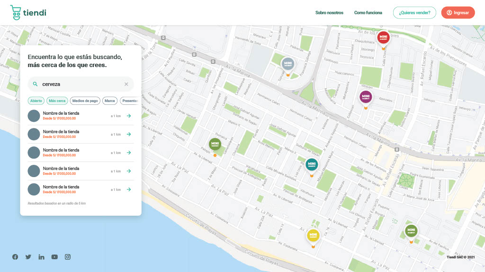
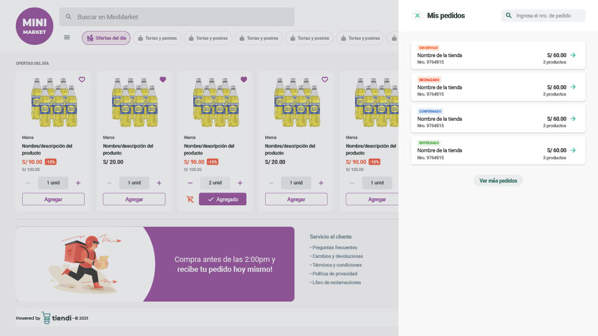
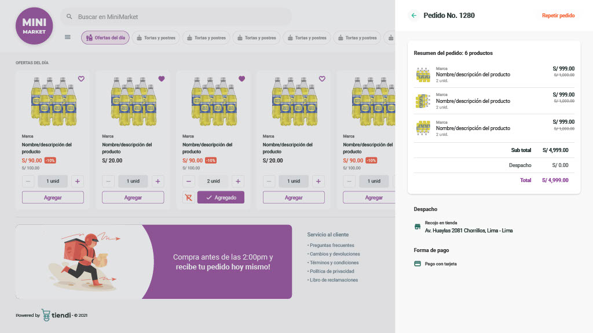

# Tiendi - E-commerce SaaS Multi-tienda

> Plataforma SaaS que permite a emprendedores crear y gestionar sus propias tiendas virtuales con geolocalización


## Descripción

**Tiendi** es una solución completa de e-commerce SaaS que permite a vendedores crear y gestionar sus propias tiendas en línea. Los clientes pueden descubrir tiendas cercanas mediante geolocalización, explorar catálogos de productos y realizar compras de forma segura.

### Características Principales

- **Multi-tienda**: Múltiples tiendas independientes en una sola plataforma
- **Geolocalización**: Búsqueda de tiendas cercanas con mapas interactivos
- **Gestión completa**: Dashboard para vendedores con gestión de productos, pedidos y estadísticas
- **Múltiples métodos de pago**: Tarjetas (Stripe/PayPal), Yape, Plin, contraentrega
- **Sistema de roles**: Super admin, vendedores, empleados y clientes
- **Suscripciones**: Modelo Freemium con planes Premium
- **Notificaciones**: WhatsApp, Email y SMS integrados
- **Responsive**: Optimizado para móvil, tablet y desktop

---

## Stack Tecnológico

### Backend
- **Framework**: NestJS (Node.js + TypeScript)
- **Base de datos**: PostgreSQL
- **Caché**: Redis
- **ORM**: TypeORM
- **Autenticación**: JWT + Passport.js
- **Validación**: class-validator

### Frontend
- **Framework**: Angular 17+
- **Lenguaje**: TypeScript
- **UI**: Angular Material
- **State Management**: NgRx
- **Mapas**: Google Maps API / Mapbox

### Infraestructura
- **Containerización**: Docker
- **CI/CD**: GitHub Actions
- **Cloud**: AWS / Azure
- **CDN**: CloudFront / Cloudinary
- **Monitoring**: Sentry, New Relic

### Integraciones
- **Pagos**: Stripe, PayPal
- **Notificaciones**: Twilio (WhatsApp, SMS), SendGrid (Email)
- **Analytics**: Google Analytics
- **Mapas**: Google Maps API

---

## Estructura del Proyecto

```
ecommerce-saas-sonet/
├── backend/                 # API NestJS
│   ├── src/
│   │   ├── modules/        # Módulos de la aplicación
│   │   ├── common/         # Utilidades compartidas
│   │   ├── config/         # Configuraciones
│   │   └── database/       # Migraciones y seeds
│   ├── test/               # Tests
│   └── docker-compose.yml
│
├── frontend/               # Aplicación Angular
│   ├── src/
│   │   ├── app/
│   │   │   ├── core/      # Servicios singleton
│   │   │   ├── shared/    # Componentes compartidos
│   │   │   └── features/  # Módulos de funcionalidad
│   │   └── assets/
│   └── angular.json
│
├── docs/                   # Documentación adicional
├── prototype/              # Diseños y mockups
│
├── PLANIFICACION.md        # Planificación detallada del proyecto
├── DATABASE_SCHEMA.md      # Esquema de base de datos
├── USER_STORIES.md         # Historias de usuario
└── README.md              # Este archivo
```

---

## Requisitos Previos

- Node.js 18+ y npm/yarn
- PostgreSQL 14+
- Redis 7+
- Docker y Docker Compose (opcional)
- Angular CLI

---

## Instalación y Configuración

### 1. Clonar el repositorio

```bash
git clone https://github.com/tu-usuario/ecommerce-saas-sonet.git
cd ecommerce-saas-sonet
```

### 2. Configurar Backend

```bash
cd backend
npm install

# Copiar archivo de variables de entorno
cp .env.example .env

# Editar .env con tus configuraciones
# - Database credentials
# - JWT secret
# - API keys (Stripe, Google Maps, etc.)

# Ejecutar migraciones
npm run migration:run

# Ejecutar seeds (datos de prueba)
npm run seed:run

# Iniciar servidor de desarrollo
npm run start:dev
```

El backend estará disponible en `http://localhost:3000`

### 3. Configurar Frontend

```bash
cd frontend
npm install

# Copiar archivo de configuración
cp src/environments/environment.example.ts src/environments/environment.ts

# Editar environment.ts con las URLs de tu backend

# Iniciar servidor de desarrollo
ng serve
```

El frontend estará disponible en `http://localhost:4200`

### 4. Usar Docker (Alternativa)

```bash
# Desde la raíz del proyecto
docker-compose up -d

# Backend: http://localhost:3000
# Frontend: http://localhost:4200
# PostgreSQL: localhost:5432
# Redis: localhost:6379
```

---

## Scripts Disponibles

### Backend

```bash
npm run start:dev      # Desarrollo con hot reload
npm run start:prod     # Producción
npm run build          # Compilar
npm run test           # Tests unitarios
npm run test:e2e       # Tests e2e
npm run lint           # Linting
npm run format         # Formatear código
npm run migration:run  # Ejecutar migraciones
npm run seed:run       # Ejecutar seeds
```

### Frontend

```bash
ng serve               # Desarrollo
ng build               # Build de producción
ng test                # Tests unitarios
ng e2e                 # Tests e2e
ng lint                # Linting
```

---

## Configuración de Variables de Entorno

### Backend (.env)

```env
# Server
NODE_ENV=development
PORT=3000
API_PREFIX=api/v1

# Database
DB_HOST=localhost
DB_PORT=5432
DB_USERNAME=postgres
DB_PASSWORD=password
DB_DATABASE=tiendi

# Redis
REDIS_HOST=localhost
REDIS_PORT=6379

# JWT
JWT_SECRET=your-secret-key
JWT_EXPIRES_IN=7d
JWT_REFRESH_SECRET=your-refresh-secret
JWT_REFRESH_EXPIRES_IN=30d

# OAuth
GOOGLE_CLIENT_ID=your-google-client-id
GOOGLE_CLIENT_SECRET=your-google-client-secret
FACEBOOK_APP_ID=your-facebook-app-id
FACEBOOK_APP_SECRET=your-facebook-app-secret

# Stripe
STRIPE_SECRET_KEY=sk_test_...
STRIPE_WEBHOOK_SECRET=whsec_...

# Google Maps
GOOGLE_MAPS_API_KEY=your-google-maps-key

# Twilio (WhatsApp, SMS)
TWILIO_ACCOUNT_SID=your-twilio-sid
TWILIO_AUTH_TOKEN=your-twilio-token
TWILIO_WHATSAPP_NUMBER=+14155238886

# SendGrid
SENDGRID_API_KEY=your-sendgrid-key
SENDGRID_FROM_EMAIL=noreply@tiendi.com

# AWS S3 (opcional)
AWS_ACCESS_KEY_ID=your-aws-key
AWS_SECRET_ACCESS_KEY=your-aws-secret
AWS_S3_BUCKET=tiendi-uploads
AWS_REGION=us-east-1

# Frontend URL
FRONTEND_URL=http://localhost:4200
```

### Frontend (environment.ts)

```typescript
export const environment = {
  production: false,
  apiUrl: 'http://localhost:3000/api/v1',
  googleMapsApiKey: 'your-google-maps-key',
  stripePublishableKey: 'pk_test_...',
  googleClientId: 'your-google-client-id',
  facebookAppId: 'your-facebook-app-id'
};
```

---

## Roles y Permisos

### Super Admin
- Gestión completa de la plataforma
- Aprobar/rechazar tiendas
- Gestionar planes de suscripción
- Ver estadísticas globales
- Suspender usuarios/tiendas

### Dueño de Tienda (Store Owner)
- Crear y configurar su tienda
- Gestionar productos
- Gestionar pedidos
- Ver estadísticas de su tienda
- Agregar empleados
- Gestionar suscripción

### Empleado
- Ver pedidos de la tienda
- Actualizar estado de pedidos
- Gestionar productos (según permisos)

### Cliente
- Buscar tiendas y productos
- Realizar compras
- Seguir pedidos
- Gestionar favoritos

---

## API Endpoints Principales

### Autenticación
```
POST   /api/v1/auth/register
POST   /api/v1/auth/login
POST   /api/v1/auth/google
POST   /api/v1/auth/facebook
POST   /api/v1/auth/refresh
GET    /api/v1/auth/me
```

### Tiendas
```
GET    /api/v1/stores
GET    /api/v1/stores/nearby?lat=X&lng=Y&radius=Z
GET    /api/v1/stores/:id
POST   /api/v1/stores
PUT    /api/v1/stores/:id
DELETE /api/v1/stores/:id
```

### Productos
```
GET    /api/v1/stores/:storeId/products
GET    /api/v1/products/:id
POST   /api/v1/stores/:storeId/products
PUT    /api/v1/products/:id
DELETE /api/v1/products/:id
```

### Pedidos
```
GET    /api/v1/orders
GET    /api/v1/orders/:id
POST   /api/v1/orders
PUT    /api/v1/orders/:id/status
POST   /api/v1/orders/:id/cancel
```

Ver documentación completa en `/api/docs` (Swagger)

---

## Testing

### Backend

```bash
# Tests unitarios
npm run test

# Tests con coverage
npm run test:cov

# Tests e2e
npm run test:e2e

# Watch mode
npm run test:watch
```

### Frontend

```bash
# Tests unitarios
ng test

# Tests con coverage
ng test --code-coverage

# Tests e2e
ng e2e
```

---

## Deploy

### Desarrollo

```bash
# Docker Compose
docker-compose up -d
```

### Staging/Producción

```bash
# Build backend
cd backend
npm run build

# Build frontend
cd frontend
ng build --configuration production

# Deploy con Docker
docker build -t tiendi-backend ./backend
docker build -t tiendi-frontend ./frontend

# Push a registry
docker push tiendi-backend
docker push tiendi-frontend
```

Ver [PLANIFICACION.md](./PLANIFICACION.md) para instrucciones detalladas de deploy en AWS.

---

## Roadmap

### Fase 1 - MVP (Mes 1-2)
- ✅ Autenticación y roles
- ✅ Gestión de tiendas
- ✅ Gestión de productos
- ✅ Búsqueda geolocalizada
- ✅ Carrito y checkout
- ✅ Sistema de pedidos

### Fase 2 - Pagos e Integraciones (Mes 3)
- ✅ Integración de pagos (Stripe, Yape, Plin)
- ✅ Notificaciones (WhatsApp, Email, SMS)
- ✅ Sistema de suscripciones

### Fase 3 - Optimización (Mes 4)
- ✅ Testing completo
- ✅ Optimización de performance
- ✅ SEO
- ✅ Deploy en producción

### Fase 4 - Funcionalidades Avanzadas (Futuro)
- ⏳ Sistema de reviews y calificaciones
- ⏳ Programa de lealtad
- ⏳ Cupones y promociones
- ⏳ App móvil nativa
- ⏳ Multi-almacén
- ⏳ Integración con facturación electrónica (SUNAT)
- ⏳ Marketplace de envíos
- ⏳ Chat en vivo
- ⏳ Recomendaciones con ML

---

## Contribuir

1. Fork el proyecto
2. Crea una rama para tu feature (`git checkout -b feature/AmazingFeature`)
3. Commit tus cambios (`git commit -m 'Add some AmazingFeature'`)
4. Push a la rama (`git push origin feature/AmazingFeature`)
5. Abre un Pull Request

### Guidelines

- Seguir convenciones de código (ESLint, Prettier)
- Escribir tests para nuevas funcionalidades
- Actualizar documentación
- Commits siguiendo [Conventional Commits](https://www.conventionalcommits.org/)

---

## Documentación Adicional

- [📋 Planificación del Proyecto](./PLANIFICACION.md)
- [🗄️ Esquema de Base de Datos](./DATABASE_SCHEMA.md)
- [📝 Historias de Usuario](./USER_STORIES.md)
- [🎨 Prototipos de Diseño](./prototype/)

---

## Soporte

- **Documentación**: [docs.tiendi.com](https://docs.tiendi.com)
- **Email**: soporte@tiendi.com
- **Discord**: [Comunidad Tiendi](https://discord.gg/tiendi)

---

## Licencia

Este proyecto está licenciado bajo la Licencia MIT - ver el archivo [LICENSE](LICENSE) para más detalles.

---

## Equipo

- **Product Owner**: [Nombre]
- **Tech Lead**: [Nombre]
- **Desarrolladores**: [Nombres]
- **UI/UX Designer**: [Nombre]
- **QA**: [Nombre]

---

## Agradecimientos

- Angular Team
- NestJS Team
- Todos los contribuidores
- Comunidad open source

---

**Versión**: 1.0.0
**Última actualización**: 2025-11-23
**Estado**: En desarrollo

---

## Capturas de Pantalla

### Landing Page


### Búsqueda Geolocalizada


### Catálogo de Productos


### Detalle de Pedido


---

**¡Listo para empezar a construir el futuro del e-commerce! 🚀**
