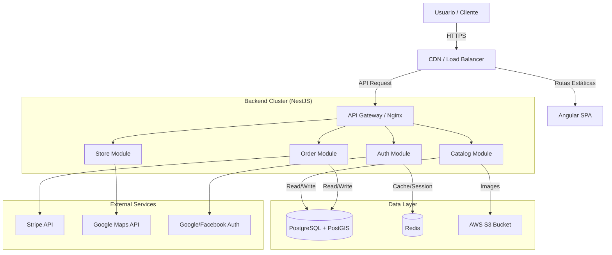

# Arquitectura Tecnológica - Tiendi SaaS

## 1. Visión General
**Tiendi** es una plataforma de comercio electrónico SaaS (Software as a Service) multi-tenant diseñada para permitir a emprendedores y negocios locales crear sus propias tiendas virtuales. La arquitectura está diseñada para ser escalable, segura y modular, soportando múltiples tiendas independientes bajo una misma infraestructura compartida.

## 2. Stack Tecnológico

### 2.1 Frontend (Web App)
- **Framework**: **Angular 17+**
  - Uso de **Standalone Components** para reducir boilerplate.
  - **Signals** para gestión de reactividad granular.
- **Lenguaje**: TypeScript 5.x
- **UI Framework**: **Angular Material** + **Tailwind CSS** (para utilidades y diseño responsive personalizado).
- **Gestión de Estado**: **NgRx** (Store, Effects) para manejo de estado global complejo (carrito, sesión, configuración de tenant).
- **Mapas**: Google Maps JavaScript API (o Mapbox GL JS como alternativa open-source).
- **PWA**: Angular Service Worker para capacidades offline y "Add to Home Screen".

### 2.2 Backend (API)
- **Framework**: **NestJS** (Node.js)
  - Arquitectura **Modular Monolith** (Monolito Modular) para facilitar el desarrollo inicial y futura migración a microservicios.
- **Lenguaje**: TypeScript.
- **Validación**: `class-validator` y `class-transformer`.
- **Documentación**: Swagger (OpenAPI).
- **WebSockets**: `socket.io` para chat y actualizaciones de pedidos en tiempo real.

### 2.3 Base de Datos y Almacenamiento
- **Base de Datos Relacional**: **PostgreSQL 15+**
  - Soporte nativo para JSONB (configuraciones flexibles por tienda).
  - Extensiones: `PostGIS` para consultas geoespaciales (búsqueda por radio).
- **Caché y Session Store**: **Redis 7+**
  - Caché de respuestas API.
  - Gestión de colas (BullMQ) para trabajos en segundo plano (emails, webhooks).
- **Almacenamiento de Archivos**: **AWS S3** (o MinIO para desarrollo local/on-premise).

### 2.4 Infraestructura y DevOps
- **Containerización**: **Docker** y Docker Compose.
- **Orquestación**: **Kubernetes (AKS/EKS)** para producción; Docker Compose para desarrollo.
- **CI/CD**: **GitHub Actions**.
- **Proxy Inverso / Gateway**: **Nginx** o Traefik.

## 3. Arquitectura Multi-Tenant

Para equilibrar costos operativos, escalabilidad y aislamiento, se implementará una estrategia híbrida:

### Estrategia: Base de Datos Compartida con Aislamiento Lógico (Discriminator Column)
Todas las tiendas comparten la misma base de datos y esquemas, pero cada registro crítico (productos, pedidos, clientes) incluye una columna `tenant_id` (o `store_id`).

- **Aislamiento de Datos**:
  - Implementación de **Row-Level Security (RLS)** en PostgreSQL para garantizar que ninguna consulta pueda acceder a datos de otro tenant, incluso si hay errores en la capa de aplicación.
  - Decoradores y Guards en NestJS para inyectar automáticamente el `tenant_id` en todas las consultas.

- **Ventajas**:
  - Menor costo de infraestructura (una sola instancia de DB).
  - Facilidad para migraciones de esquema (se ejecutan una sola vez).
  - Analytics globales simplificados.

## 4. Módulos del Sistema

### 4.1 Core
- **Auth Service**: Gestión de usuarios, roles (RBAC) y sesiones (JWT).
- **Tenant Service**: Gestión de tiendas, configuraciones, dominios personalizados y suscripciones.

### 4.2 E-commerce
- **Catalog Service**: Productos, categorías, inventario, variantes.
- **Order Service**: Carrito de compras, checkout, gestión de estados de pedidos.
- **Payment Service**: Adaptadores para pasarelas (Stripe, MercadoPago, Niubiz).

### 4.3 Soporte y Operaciones
- **Search Service**: Motor de búsqueda (Elasticsearch o Full-Text Search de Postgres) para indexar productos y tiendas.
- **Notification Service**: Envío de emails (SendGrid), SMS (Twilio) y Push Notifications.
- **Geo Service**: Cálculos de distancia, zonas de reparto, geocodificación.

## 5. Diagrama de Arquitectura (C4 - Nivel Contenedor)

## 6. Consideraciones de Seguridad
1.  **Aislamiento de Tenant**: Validaciones estrictas en cada request para asegurar que el `tenant_id` corresponda al usuario autenticado o al dominio visitado.
2.  **Datos Sensibles**: Encriptación de datos PII (Información de Identificación Personal) en reposo.
3.  **Compliance**: Preparado para cumplir con LPDP (Ley de Protección de Datos Personales - Perú) y GDPR.

## 7. Estrategia de Despliegue
- **Ambientes**: Desarrollo, Staging, Producción.
- **Pipeline**:
  1.  Lint & Test (Unit/E2E).
  2.  Build Docker Images.
  3.  Push to Registry (ECR/ACR).
  4.  Deploy to Kubernetes (Helm Charts).
